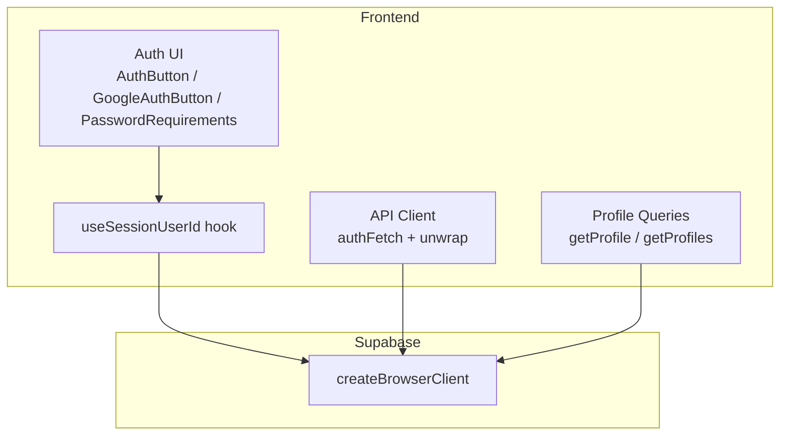
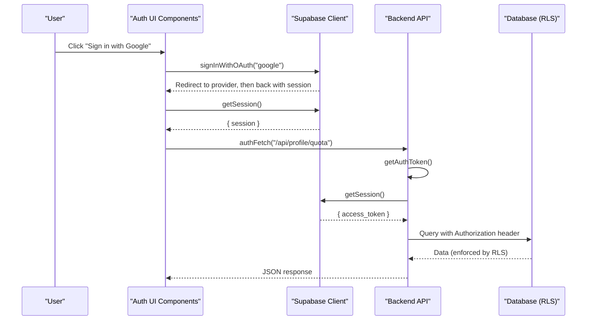
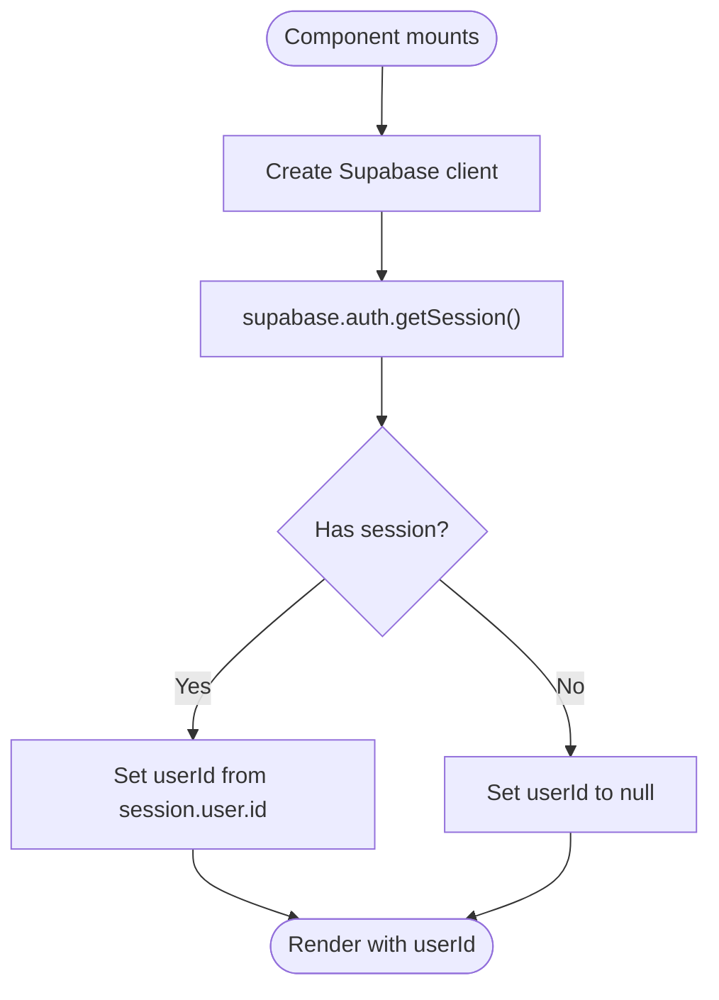
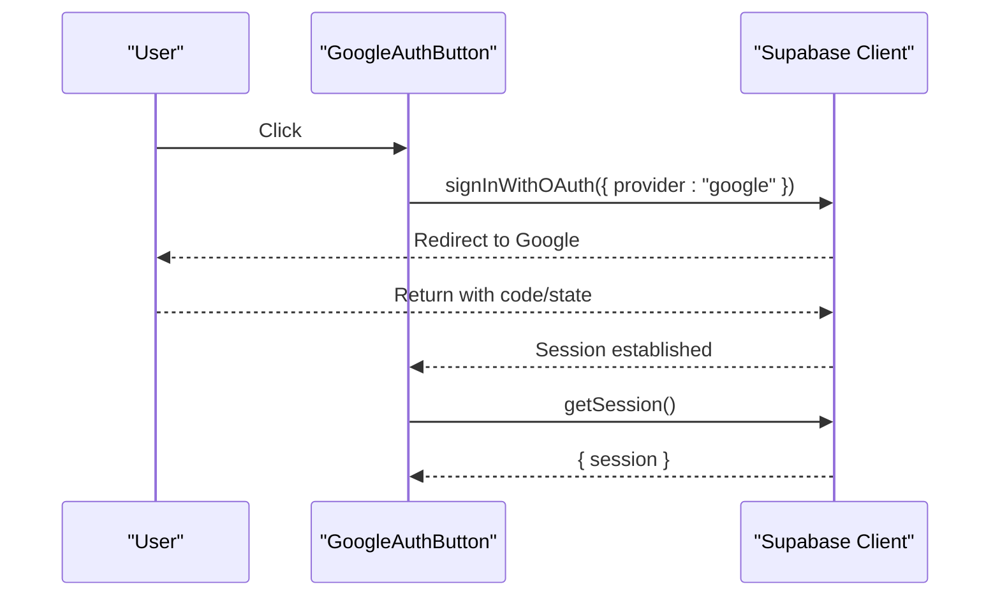
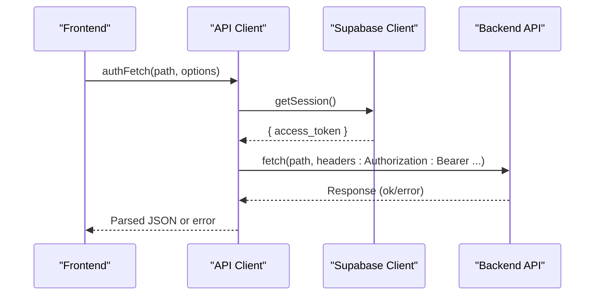
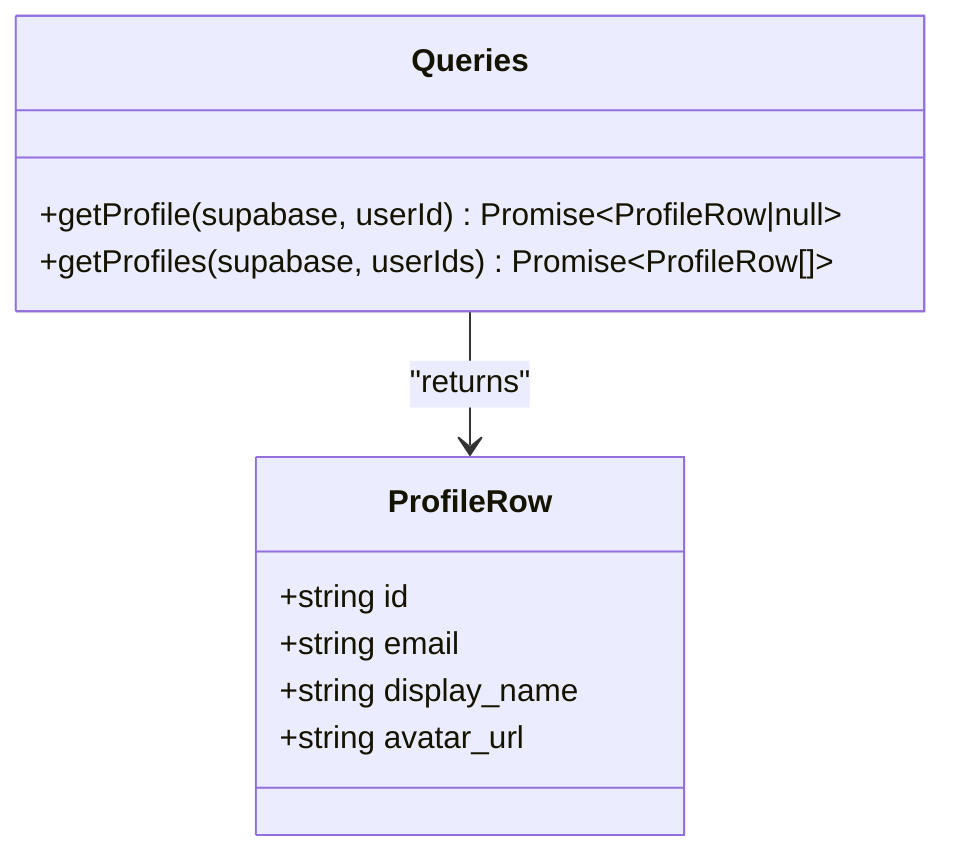
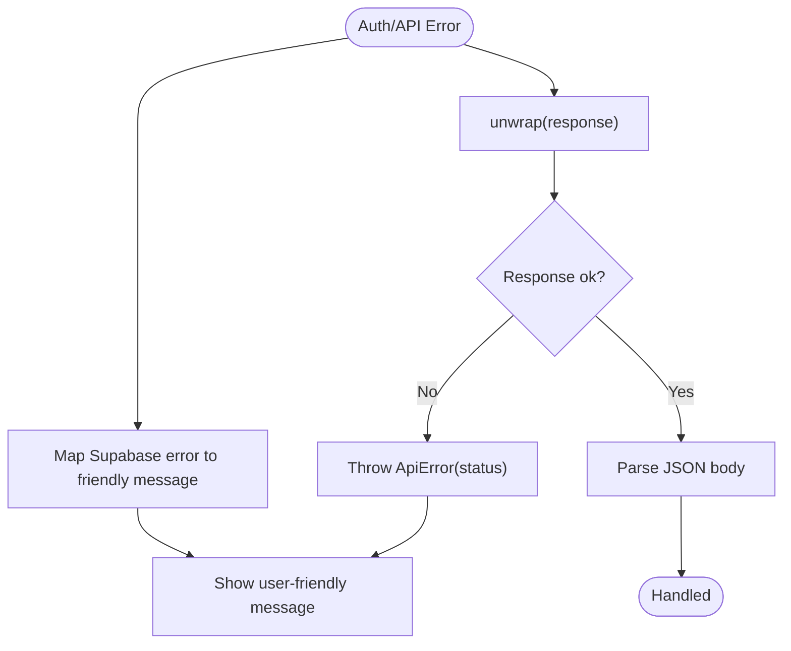
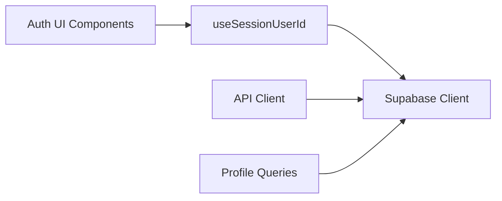

# Authentication & Session Management

<cite>
**Referenced Files in This Document**
- [client.ts](file://src/lib/supabase/client.ts)
- [useSessionUserId.ts](file://src/hooks/useSessionUserId.ts)
- [queries.ts](file://src/lib/supabase/queries.ts)
- [userMessages.ts](file://src/lib/errors/userMessages.ts)
- [password-policy.ts](file://src/lib/auth/password-policy.ts)
- [AuthButton.tsx](file://src/components/ui/auth/AuthButton.tsx)
- [GoogleAuthButton.tsx](file://src/components/ui/auth/GoogleAuthButton.tsx)
- [PasswordRequirements.tsx](file://src/components/ui/auth/PasswordRequirements.tsx)
- [client.ts (API client)](file://src/lib/api/client.ts)
- [profile.ts (API profile)](file://src/lib/api/profile.ts)
</cite>

## Table of Contents
1. Introduction
2. Project Structure
3. Core Components
4. Architecture Overview
5. Detailed Component Analysis
6. Dependency Analysis
7. Performance Considerations
8. Troubleshooting Guide
9. Conclusion

## Introduction
This document explains how authentication and session management are implemented using Supabase in this Next.js application. It covers the authentication flow, user session handling across page reloads, Google OAuth integration points, custom provider readiness, session validation for API calls, user profile management, role-based access control patterns, secure token handling, protected routes, authentication guards, and error handling for auth failures.

## Project Structure
Authentication-related code is organized into:
- Supabase client initialization and session utilities
- UI components for login/signup flows and OAuth buttons
- Error mapping to friendly messages
- Profile queries and API client that attaches tokens to requests
- Hooks to read current session state

**Diagram sources**
- [client.ts:1-9](file://src/lib/supabase/client.ts#L1-L9)
- [useSessionUserId.ts:1-20](file://src/hooks/useSessionUserId.ts#L1-L20)
- [client.ts (API client):52-94](file://src/lib/api/client.ts#L52-L94)
- [queries.ts:1-46](file://src/lib/supabase/queries.ts#L1-L46)

**Section sources**
- [client.ts:1-9](file://src/lib/supabase/client.ts#L1-L9)
- [useSessionUserId.ts:1-20](file://src/hooks/useSessionUserId.ts#L1-L20)
- [client.ts (API client):52-94](file://src/lib/api/client.ts#L52-L94)
- [queries.ts:1-46](file://src/lib/supabase/queries.ts#L1-L46)

## Core Components
- Supabase browser client: Creates a shared client configured with environment variables for URL and anon key.
- Session hook: Reads the current session on mount to resolve the authenticated user id.
- Auth UI components: Reusable button and input components for sign-in/sign-up flows, including a Google OAuth button and password requirements checklist.
- API client: Attaches Supabase access tokens to backend requests and centralizes error unwrapping.
- Profile queries: Typed functions to fetch user profiles from the database.
- Error mapping: Converts Supabase auth errors into user-friendly messages.

**Section sources**
- [client.ts:1-9](file://src/lib/supabase/client.ts#L1-L9)
- [useSessionUserId.ts:1-20](file://src/hooks/useSessionUserId.ts#L1-L20)
- [AuthButton.tsx:1-41](file://src/components/ui/auth/AuthButton.tsx#L1-L41)
- [GoogleAuthButton.tsx:1-60](file://src/components/ui/auth/GoogleAuthButton.tsx#L1-L60)
- [PasswordRequirements.tsx:1-59](file://src/components/ui/auth/PasswordRequirements.tsx#L1-L59)
- [client.ts (API client):52-94](file://src/lib/api/client.ts#L52-L94)
- [queries.ts:1-46](file://src/lib/supabase/queries.ts#L1-L46)
- [userMessages.ts:1-107](file://src/lib/errors/userMessages.ts#L1-L107)

## Architecture Overview
The app uses Supabase’s browser client for session persistence via cookies. A React hook reads the session on component mount to determine if a user is authenticated. UI components trigger sign-in/sign-up or OAuth flows. When calling backend APIs, an API client retrieves the current Supabase access token and attaches it as a Bearer token. Database queries use typed helpers that rely on RLS policies for authorization.

**Diagram sources**
- [GoogleAuthButton.tsx:1-60](file://src/components/ui/auth/GoogleAuthButton.tsx#L1-L60)
- [client.ts:1-9](file://src/lib/supabase/client.ts#L1-L9)
- [client.ts (API client):52-94](file://src/lib/api/client.ts#L52-L94)
- [queries.ts:1-46](file://src/lib/supabase/queries.ts#L1-L46)

## Detailed Component Analysis

### Supabase Client and Session Persistence
- The browser client is created once per call site using environment variables. Supabase SSR helper persists sessions in cookies, enabling automatic session restoration after page reloads.
- The session hook reads the current session on mount to extract the user id, returning null until loaded or signed out.

**Diagram sources**
- [client.ts:1-9](file://src/lib/supabase/client.ts#L1-L9)
- [useSessionUserId.ts:1-20](file://src/hooks/useSessionUserId.ts#L1-L20)

**Section sources**
- [client.ts:1-9](file://src/lib/supabase/client.ts#L1-L9)
- [useSessionUserId.ts:1-20](file://src/hooks/useSessionUserId.ts#L1-L20)

### Google OAuth Integration
- The Google OAuth button component provides a styled entry point for initiating OAuth sign-in. In practice, you would call Supabase’s OAuth method with the Google provider and handle redirects.
- After redirect, the session is restored automatically by Supabase; the session hook will populate the user id.

**Diagram sources**
- [GoogleAuthButton.tsx:1-60](file://src/components/ui/auth/GoogleAuthButton.tsx#L1-L60)
- [client.ts:1-9](file://src/lib/supabase/client.ts#L1-L9)
- [useSessionUserId.ts:1-20](file://src/hooks/useSessionUserId.ts#L1-L20)

**Section sources**
- [GoogleAuthButton.tsx:1-60](file://src/components/ui/auth/GoogleAuthButton.tsx#L1-L60)
- [client.ts:1-9](file://src/lib/supabase/client.ts#L1-L9)
- [useSessionUserId.ts:1-20](file://src/hooks/useSessionUserId.ts#L1-L20)

### Custom Authentication Providers
- The same pattern used for Google OAuth can be applied to other providers supported by Supabase (e.g., GitHub, Apple). Replace the provider identifier and configure the provider in your Supabase project settings.
- Ensure environment variables for the provider are set server-side and that redirect URLs match your domain.

[No sources needed since this section describes general integration patterns]

### Session Validation and Secure Token Handling
- The API client retrieves the current Supabase access token before making requests and attaches it as a Bearer token. If no token exists, it throws a not-authenticated error.
- Backend endpoints should validate the token and enforce authorization via RLS or server-side checks.

**Diagram sources**
- [client.ts (API client):52-94](file://src/lib/api/client.ts#L52-L94)
- [client.ts:1-9](file://src/lib/supabase/client.ts#L1-L9)

**Section sources**
- [client.ts (API client):52-94](file://src/lib/api/client.ts#L52-L94)
- [client.ts:1-9](file://src/lib/supabase/client.ts#L1-L9)

### User Profile Management
- Profile data is fetched through typed query helpers that select specific fields from the profiles table.
- These helpers return null or empty arrays on errors, centralizing error logging and safe defaults.

**Diagram sources**
- [queries.ts:1-46](file://src/lib/supabase/queries.ts#L1-L46)

**Section sources**
- [queries.ts:1-46](file://src/lib/supabase/queries.ts#L1-L46)

### Role-Based Access Control (RBAC) Patterns
- Enforce RBAC at the database layer using Row Level Security (RLS) policies tied to the authenticated user’s id.
- For operations requiring server-side roles or permissions, validate the token in API handlers and enforce access based on claims or stored roles.
- Use the API client to ensure all requests carry the token so RLS can scope data correctly.

[No sources needed since this section provides conceptual guidance]

### Protected Routes and Authentication Guards
- Use the session hook to determine if a user is authenticated before rendering protected content.
- Implement route-level guards by checking the resolved userId and redirecting unauthenticated users to sign-in.
- For server-side protection, verify tokens in API handlers and return appropriate status codes.

[No sources needed since this section provides conceptual guidance]

### Error Handling for Auth Failures
- Map Supabase auth errors to friendly messages for UI display while preserving technical details in logs.
- Centralize API error unwrapping to convert non-ok responses into typed errors with status codes.

**Diagram sources**
- [userMessages.ts:1-107](file://src/lib/errors/userMessages.ts#L1-L107)
- [client.ts (API client):52-94](file://src/lib/api/client.ts#L52-L94)

**Section sources**
- [userMessages.ts:1-107](file://src/lib/errors/userMessages.ts#L1-L107)
- [client.ts (API client):52-94](file://src/lib/api/client.ts#L52-L94)

## Dependency Analysis
- The session hook depends on the Supabase client to read the current session.
- The API client depends on the Supabase client to obtain access tokens.
- Profile queries depend on the Supabase client and define typed return shapes.
- UI components depend on hooks and utilities but do not directly call Supabase except where OAuth is initiated.

**Diagram sources**
- [useSessionUserId.ts:1-20](file://src/hooks/useSessionUserId.ts#L1-L20)
- [client.ts:1-9](file://src/lib/supabase/client.ts#L1-L9)
- [client.ts (API client):52-94](file://src/lib/api/client.ts#L52-L94)
- [queries.ts:1-46](file://src/lib/supabase/queries.ts#L1-L46)

**Section sources**
- [useSessionUserId.ts:1-20](file://src/hooks/useSessionUserId.ts#L1-L20)
- [client.ts:1-9](file://src/lib/supabase/client.ts#L1-L9)
- [client.ts (API client):52-94](file://src/lib/api/client.ts#L52-L94)
- [queries.ts:1-46](file://src/lib/supabase/queries.ts#L1-L46)

## Performance Considerations
- Minimize redundant session reads by caching the userId in local state within components or contexts.
- Prefer batched profile queries when multiple user ids are needed to reduce network calls.
- Use stable query keys and staleTime strategies to avoid unnecessary refetches.
- Ensure OAuth redirects are handled efficiently and that session restoration occurs before sensitive UI renders.

[No sources needed since this section provides general guidance]

## Troubleshooting Guide
- Sign-in fails with invalid credentials: Display the mapped friendly message and prompt the user to re-enter credentials.
- Email not confirmed: Prompt the user to confirm their email address before signing in.
- Rate limits exceeded: Inform the user to wait and retry later.
- Network errors: Notify the user to check connectivity and retry.
- API calls without token: The API client throws a not-authenticated error; ensure the user is signed in before invoking protected endpoints.

**Section sources**
- [userMessages.ts:1-107](file://src/lib/errors/userMessages.ts#L1-L107)
- [client.ts (API client):52-94](file://src/lib/api/client.ts#L52-L94)

## Conclusion
This implementation leverages Supabase for robust authentication and session persistence, with clear separation between UI, session reading, and API authorization. Google OAuth is integrated via a dedicated button component, and the same pattern supports additional providers. Sessions are restored across reloads, and API calls securely attach tokens. Profiles are accessed through typed queries, and errors are mapped to friendly messages. Protect routes and enforce RBAC using RLS and server-side validation to maintain security.