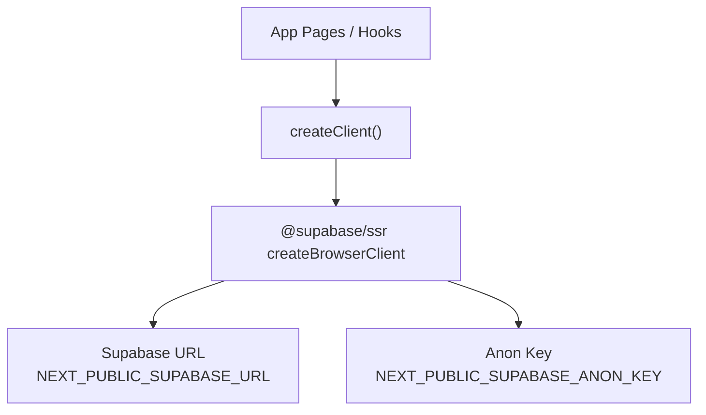
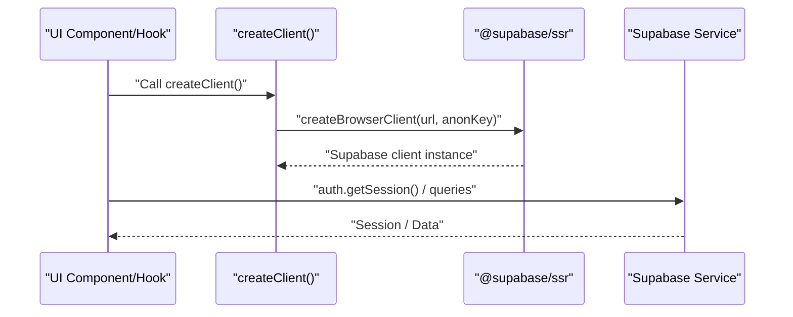
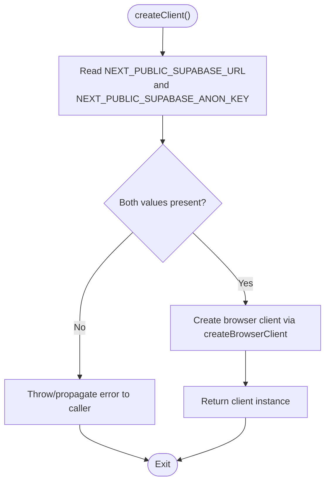
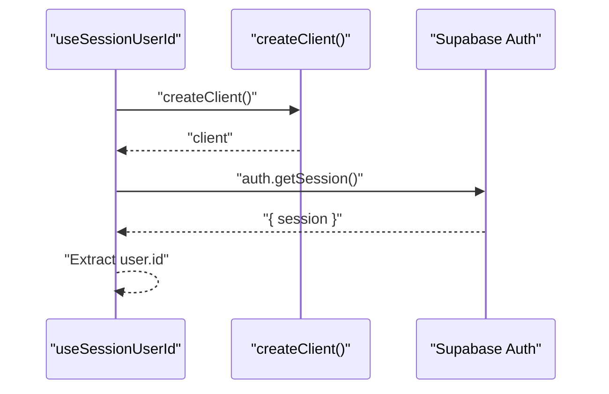
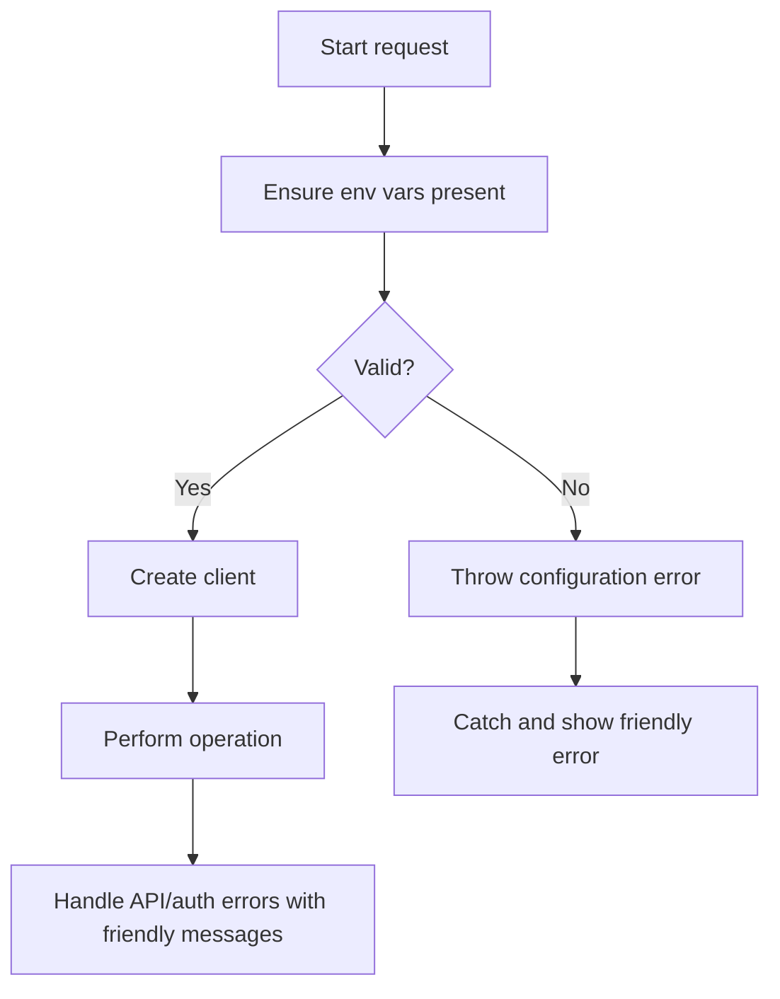
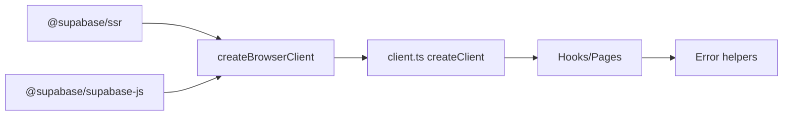

# Client Configuration

<cite>
**Referenced Files in This Document**
- [client.ts](file://src/lib/supabase/client.ts)
- [.env.local.example](file://.env.local.example)
- [package.json](file://package.json)
- [useSessionUserId.ts](file://src/hooks/useSessionUserId.ts)
- [userMessages.ts](file://src/lib/errors/userMessages.ts)
</cite>

## Table of Contents
1. [Introduction](#introduction)
2. [Project Structure](#project-structure)
3. [Core Components](#core-components)
4. [Architecture Overview](#architecture-overview)
5. [Detailed Component Analysis](#detailed-component-analysis)
6. [Dependency Analysis](#dependency-analysis)
7. [Performance Considerations](#performance-considerations)
8. [Troubleshooting Guide](#troubleshooting-guide)
9. [Conclusion](#conclusion)
10. [Appendices](#appendices)

## Introduction
This document explains how the Argo platform configures and uses the Supabase client on the browser. It covers:
- How the client is created using createBrowserClient from @supabase/ssr
- Required environment variables (NEXT_PUBLIC_SUPABASE_URL and NEXT_PUBLIC_SUPABASE_ANON_KEY)
- Client instantiation patterns used across the app
- Security considerations for anonymous keys and environment variable management
- Error handling strategies for missing or invalid credentials
- Testing strategies for different environments

## Project Structure
The Supabase client configuration is centralized in a small module that wraps @supabase/ssr’s createBrowserClient. Consumers import a factory function to obtain a configured client instance. Environment variables are defined via Next.js public env keys and documented in an example file.

**Diagram sources**
- [client.ts:1-8](file://src/lib/supabase/client.ts#L1-L8)
- [.env.local.example:1-12](file://.env.local.example#L1-L12)

**Section sources**
- [client.ts:1-8](file://src/lib/supabase/client.ts#L1-L8)
- [.env.local.example:1-12](file://.env.local.example#L1-L12)

## Core Components
- Client factory: A single exported function creates a browser-ready Supabase client using createBrowserClient with Next.js public environment variables.
- Usage pattern: Components and hooks call the factory to get a fresh client instance, then use auth and data APIs as needed.

Key responsibilities:
- Centralize environment-based configuration
- Provide a consistent client creation point
- Keep consumers decoupled from environment details

**Section sources**
- [client.ts:1-8](file://src/lib/supabase/client.ts#L1-L8)
- [useSessionUserId.ts:1-19](file://src/hooks/useSessionUserId.ts#L1-L19)

## Architecture Overview
The application uses a thin client layer over @supabase/ssr. The client is created per call site, which aligns with SSR-safe practices and avoids shared mutable state. Auth flows and data operations rely on this client.

**Diagram sources**
- [client.ts:1-8](file://src/lib/supabase/client.ts#L1-L8)
- [useSessionUserId.ts:1-19](file://src/hooks/useSessionUserId.ts#L1-L19)

## Detailed Component Analysis

### Client Factory: createClient
- Purpose: Create a browser-compatible Supabase client using Next.js public environment variables.
- Inputs: NEXT_PUBLIC_SUPABASE_URL and NEXT_PUBLIC_SUPABASE_ANON_KEY.
- Output: A configured Supabase client instance ready for auth and database calls.
- Notes:
  - Uses @supabase/ssr’s createBrowserClient for SSR compatibility.
  - Each call returns a new client instance; avoid long-lived global clients unless necessary.

**Diagram sources**
- [client.ts:1-8](file://src/lib/supabase/client.ts#L1-L8)

**Section sources**
- [client.ts:1-8](file://src/lib/supabase/client.ts#L1-L8)

### Environment Variables Setup
- Required keys:
  - NEXT_PUBLIC_SUPABASE_URL: Base URL of your Supabase project.
  - NEXT_PUBLIC_SUPABASE_ANON_KEY: Public anonymous key for browser access.
- Where to configure:
  - Copy and fill values from .env.local.example into your local environment file.
  - Ensure these variables are available at build/runtime for Next.js public env.

Security considerations:
- NEXT_PUBLIC_* variables are exposed to the browser by design; only expose what is safe.
- The anon key should be restricted by Row Level Security policies in Supabase.
- Never store secrets in NEXT_PUBLIC_* variables.

**Section sources**
- [.env.local.example:1-12](file://.env.local.example#L1-L12)

### Client Instantiation Patterns
- Pattern: Import createClient and call it where you need a client (e.g., hooks, pages).
- Example usage:
  - A hook obtains the current session user id by calling createClient and then accessing auth.getSession.
- Benefits:
  - Encapsulates environment configuration.
  - Keeps each call site independent and testable.

**Diagram sources**
- [useSessionUserId.ts:1-19](file://src/hooks/useSessionUserId.ts#L1-L19)
- [client.ts:1-8](file://src/lib/supabase/client.ts#L1-L8)

**Section sources**
- [useSessionUserId.ts:1-19](file://src/hooks/useSessionUserId.ts#L1-L19)
- [client.ts:1-8](file://src/lib/supabase/client.ts#L1-L8)

### Error Handling for Missing Credentials
- Risk: If either NEXT_PUBLIC_SUPABASE_URL or NEXT_PUBLIC_SUPABASE_ANON_KEY is missing, client creation will fail at runtime.
- Recommended approach:
  - Validate environment variables before creating the client.
  - Throw a descriptive error if required keys are missing.
  - Catch errors at the call site and surface a friendly message to users.
- User-facing messages:
  - Use existing helpers to map technical errors to friendly text.

[No sources needed since this diagram shows conceptual workflow, not actual code structure]

**Section sources**
- [userMessages.ts:1-107](file://src/lib/errors/userMessages.ts#L1-L107)

### Security Considerations for Anonymous Keys
- Scope access with Row Level Security (RLS) policies in Supabase to restrict what anonymous users can read/write.
- Do not embed server-only secrets in NEXT_PUBLIC_* variables.
- Rotate keys regularly and monitor usage in the Supabase dashboard.
- Prefer minimal permissions for the anon role.

[No sources needed since this section provides general guidance]

### Client Lifecycle
- Creation: Each call to createClient constructs a new client instance.
- Usage: Use the client for auth and data operations within the same scope.
- Disposal: No explicit disposal is required; instances are short-lived and garbage-collected when no longer referenced.
- Best practice: Avoid storing the client in module-level globals to prevent stale sessions or cross-request leakage.

[No sources needed since this section provides general guidance]

## Dependency Analysis
- External dependencies:
  - @supabase/ssr: Provides createBrowserClient for SSR-safe browser client creation.
  - @supabase/supabase-js: Underlying JS SDK used by @supabase/ssr.
- Internal dependencies:
  - App components/hooks import createClient from the central module.
  - Error utilities provide user-friendly messages for auth/network issues.

**Diagram sources**
- [package.json:12-19](file://package.json#L12-L19)
- [client.ts:1-8](file://src/lib/supabase/client.ts#L1-L8)
- [userMessages.ts:1-107](file://src/lib/errors/userMessages.ts#L1-L107)

**Section sources**
- [package.json:12-19](file://package.json#L12-L19)
- [client.ts:1-8](file://src/lib/supabase/client.ts#L1-L8)
- [userMessages.ts:1-107](file://src/lib/errors/userMessages.ts#L1-L107)

## Performance Considerations
- Creating a client per call is lightweight but avoid excessive churn in tight loops.
- Reuse a client within a component lifecycle if multiple operations are needed in the same render cycle.
- Leverage Supabase caching and query deduplication where applicable.
- Monitor network requests and consider batching operations when possible.

[No sources needed since this section provides general guidance]

## Troubleshooting Guide
Common issues and resolutions:
- Missing environment variables:
  - Symptom: Runtime error during client creation.
  - Resolution: Ensure NEXT_PUBLIC_SUPABASE_URL and NEXT_PUBLIC_SUPABASE_ANON_KEY are set in your environment.
- Invalid or expired anon key:
  - Symptom: Auth failures or permission errors.
  - Resolution: Regenerate the anon key in Supabase and update environment variables.
- Network connectivity problems:
  - Symptom: Fetch or connection errors.
  - Resolution: Check network status and DNS; handle with friendly messages.
- RLS policy misconfiguration:
  - Symptom: Successful client creation but denied access to tables.
  - Resolution: Review and adjust RLS policies for the anon role.

User-friendly messaging:
- Use the provided error helper to map technical errors to plain-language messages for end users.

**Section sources**
- [userMessages.ts:1-107](file://src/lib/errors/userMessages.ts#L1-L107)

## Conclusion
The Argo platform centralizes Supabase client configuration in a small, focused module that leverages @supabase/ssr’s createBrowserClient. By using Next.js public environment variables and a factory pattern, the app maintains a clean separation between configuration and usage. Proper environment setup, strict RLS policies, and robust error handling ensure secure and resilient client interactions across environments.

[No sources needed since this section summarizes without analyzing specific files]

## Appendices

### Environment Variables Reference
- NEXT_PUBLIC_SUPABASE_URL: Your Supabase project URL.
- NEXT_PUBLIC_SUPABASE_ANON_KEY: Public anonymous key for browser access.
- NEXT_PUBLIC_API_URL: Optional backend base URL used elsewhere in the app.
- NEXT_PUBLIC_GOOGLE_MAPS_*: Google Maps keys and IDs used by map components.

**Section sources**
- [.env.local.example:1-12](file://.env.local.example#L1-L12)

### Package Dependencies
- @supabase/ssr: Browser client creation with SSR support.
- @supabase/supabase-js: Core Supabase JavaScript SDK.

**Section sources**
- [package.json:12-19](file://package.json#L12-L19)