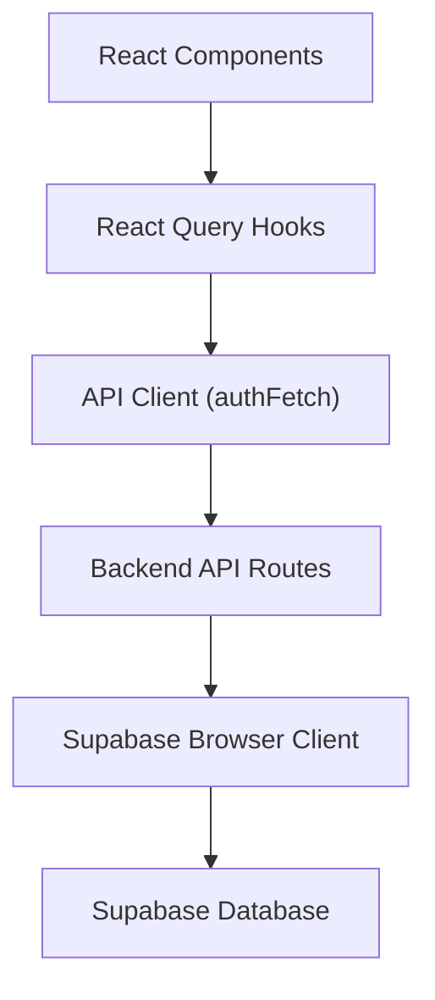
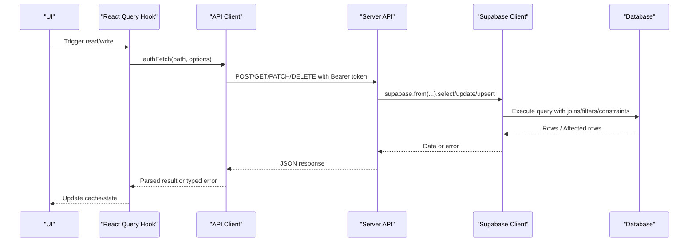
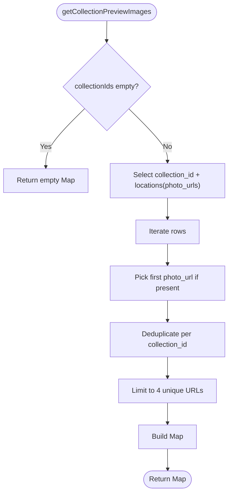
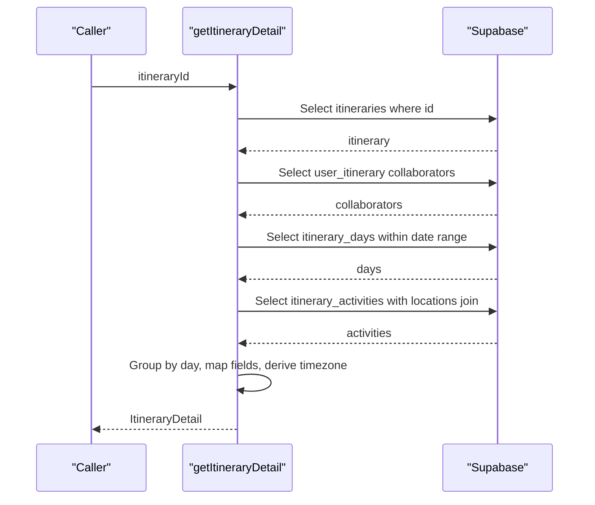
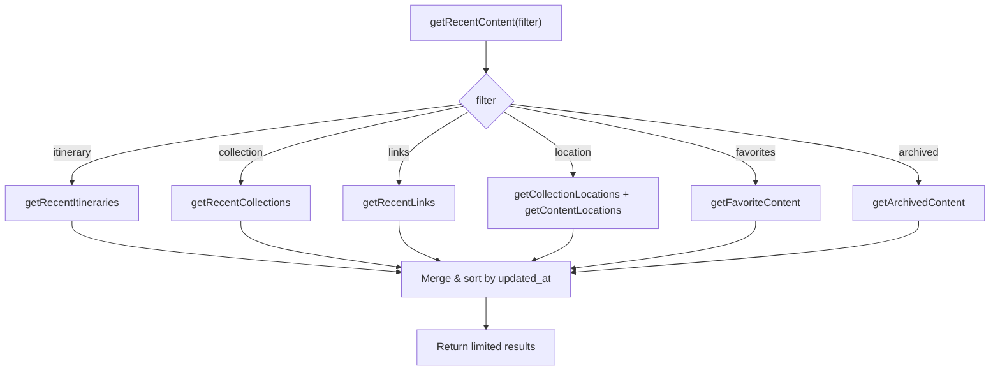
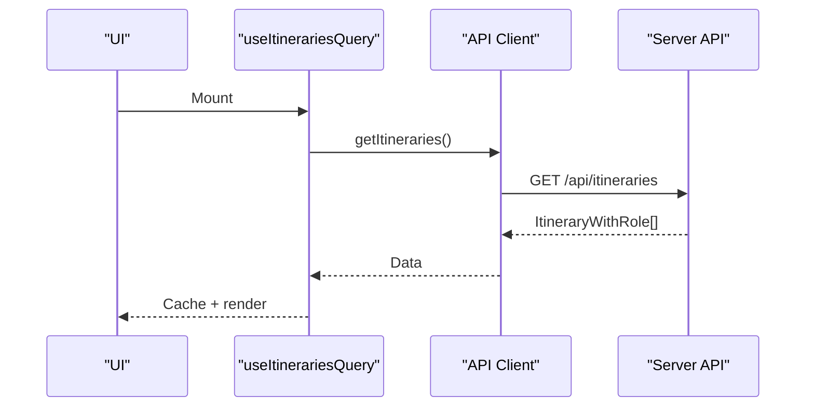
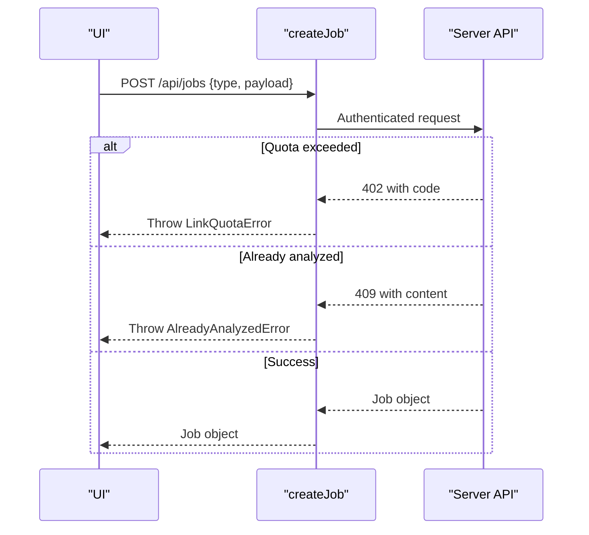
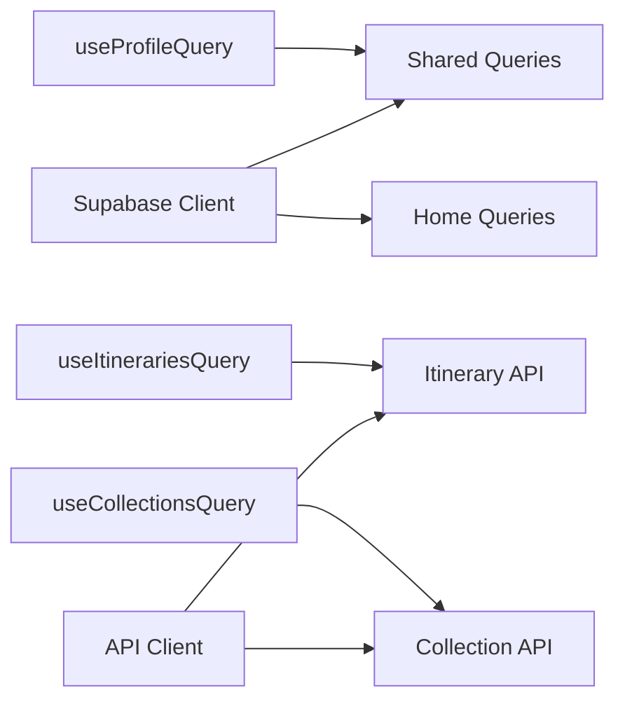

# Database Operations

<cite>
**Referenced Files in This Document**
- [client.ts](file://src/lib/supabase/client.ts)
- [queries.ts](file://src/lib/supabase/queries.ts)
- [home.ts](file://src/lib/supabase/queries/home.ts)
- [itineraries.ts](file://src/lib/api/itineraries.ts)
- [collections.ts](file://src/lib/api/collections.ts)
- [client.ts](file://src/lib/api/client.ts)
- [useProfileQuery.ts](file://src/hooks/queries/useProfileQuery.ts)
- [useItinerariesQuery.ts](file://src/hooks/queries/useItinerariesQuery.ts)
- [useCollectionsQuery.ts](file://src/hooks/queries/useCollectionsQuery.ts)
- [userMessages.ts](file://src/lib/errors/userMessages.ts)
- [personalization-pipeline.md](file://docs/personalization-pipeline.md)
- [implementation-plan.md](file://docs/implementation-plan.md)
</cite>

## Table of Contents
1. Introduction
2. Project Structure
3. Core Components
4. Architecture Overview
5. Detailed Component Analysis
6. Dependency Analysis
7. Performance Considerations
8. Troubleshooting Guide
9. Conclusion

## Introduction
This document explains how the Argo platform uses Supabase for database operations, focusing on data modeling, TypeScript types, CRUD patterns, advanced queries (joins, aggregations, filtering), transactions and batch operations, performance optimization, error handling, retries, and debugging. It maps client-side hooks and API clients to server-side Supabase queries and documents the underlying schema relationships enforced by foreign keys and constraints.

## Project Structure
The database layer spans three areas:
- Supabase client initialization and shared query utilities
- Feature-specific query modules that build complex joins and filters
- API clients and React Query hooks that orchestrate reads/writes and caching

**Diagram sources**
- [client.ts:1-9](file://src/lib/supabase/client.ts#L1-L9)
- [client.ts:48-83](file://src/lib/api/client.ts#L48-L83)
- [useProfileQuery.ts:8-19](file://src/hooks/queries/useProfileQuery.ts#L8-L19)

**Section sources**
- [client.ts:1-9](file://src/lib/supabase/client.ts#L1-L9)
- [client.ts:48-83](file://src/lib/api/client.ts#L48-L83)
- [useProfileQuery.ts:8-19](file://src/hooks/queries/useProfileQuery.ts#L8-L19)

## Core Components
- Supabase browser client: Creates a typed client using environment variables for URL and anon key.
- Shared queries: Profile retrieval, content detail with nested location joins, collection preview images aggregation.
- Feature APIs: Itinerary and Collection CRUD via authenticated endpoints; job creation/retry/detach helpers.
- React Query hooks: Typed queries with caching and stale-time configuration.

Key responsibilities:
- Encapsulate Supabase calls behind typed functions
- Centralize error unwrapping and status handling
- Provide reusable query builders for common joins and filters

**Section sources**
- [client.ts:1-9](file://src/lib/supabase/client.ts#L1-L9)
- [queries.ts:7-46](file://src/lib/supabase/queries.ts#L7-L46)
- [queries.ts:50-99](file://src/lib/supabase/queries.ts#L50-L99)
- [queries.ts:103-149](file://src/lib/supabase/queries.ts#L103-L149)
- [itineraries.ts:54-131](file://src/lib/api/itineraries.ts#L54-L131)
- [collections.ts:65-109](file://src/lib/api/collections.ts#L65-L109)
- [client.ts:85-155](file://src/lib/api/client.ts#L85-L155)
- [useProfileQuery.ts:8-19](file://src/hooks/queries/useProfileQuery.ts#L8-L19)

## Architecture Overview
The system separates concerns across layers:
- UI triggers actions via React Query hooks
- Hooks call feature API clients that authenticate and request backend routes
- Backend routes perform Supabase queries and enforce RLS and constraints
- Supabase client executes SQL with joins, filters, and upserts

**Diagram sources**
- [client.ts:48-83](file://src/lib/api/client.ts#L48-L83)
- [queries.ts:50-99](file://src/lib/supabase/queries.ts#L50-L99)
- [itineraries.ts:101-131](file://src/lib/api/itineraries.ts#L101-L131)

## Detailed Component Analysis

### Supabase Client and Shared Queries
- Client initialization: Uses createBrowserClient with environment variables.
- Profiles: Single and batch fetches with explicit select projections and error logging.
- Content detail: Demonstrates nested joins from content to user_content and locations, enforcing scoping via inner join.
- Collections: Upsert into junction table with conflict handling; aggregation utility to collect distinct preview images per collection.

**Diagram sources**
- [queries.ts:121-149](file://src/lib/supabase/queries.ts#L121-L149)

**Section sources**
- [client.ts:1-9](file://src/lib/supabase/client.ts#L1-L9)
- [queries.ts:7-46](file://src/lib/supabase/queries.ts#L7-L46)
- [queries.ts:50-99](file://src/lib/supabase/queries.ts#L50-L99)
- [queries.ts:103-149](file://src/lib/supabase/queries.ts#L103-L149)

### Itinerary Detail Query (Joins, Ordering, Timezone)
- Fetches itinerary base row, collaborators, days within date range, and activities joined with locations.
- Orders activities by position then start_time for stable display order.
- Derives timezone from day or coordinates when missing.

**Diagram sources**
- [home.ts:159-303](file://src/lib/supabase/queries/home.ts#L159-L303)

**Section sources**
- [home.ts:159-303](file://src/lib/supabase/queries/home.ts#L159-L303)

### Recent Content Aggregation (Union-like Behavior)
- Combines recent items across itineraries, collections, links, and locations.
- Uses cursor-based pagination and deduplication strategies.
- Joins through user_* tables to filter by ownership and flags like bookmarked/archived.

**Diagram sources**
- [home.ts:305-780](file://src/lib/supabase/queries/home.ts#L305-L780)

**Section sources**
- [home.ts:305-780](file://src/lib/supabase/queries/home.ts#L305-L780)

### API Clients for Itineraries and Collections
- Itineraries: List, generate (async planning job), update, create activity, delete/move, optimize route, preview legs, public tokens, collaborators, public view, delete.
- Collections: List/search, get detail, create/update, add location from Google Maps, tokens, collaborators, public view, delete, remove location.

**Diagram sources**
- [useItinerariesQuery.ts:10-16](file://src/hooks/queries/useItinerariesQuery.ts#L10-L16)
- [itineraries.ts:54-57](file://src/lib/api/itineraries.ts#L54-L57)

**Section sources**
- [itineraries.ts:54-532](file://src/lib/api/itineraries.ts#L54-L532)
- [collections.ts:65-214](file://src/lib/api/collections.ts#L65-L214)
- [useItinerariesQuery.ts:10-16](file://src/hooks/queries/useItinerariesQuery.ts#L10-L16)
- [useCollectionsQuery.ts:10-16](file://src/hooks/queries/useCollectionsQuery.ts#L10-L16)

### Job Queue and Retries
- Create jobs with typed errors for quota and already-analyzed cases.
- Retry and detach endpoints for long-running tasks.
- Optimistic queue updates to reflect status changes immediately.

**Diagram sources**
- [client.ts:109-155](file://src/lib/api/client.ts#L109-L155)

**Section sources**
- [client.ts:109-155](file://src/lib/api/client.ts#L109-L155)
- [useJobsQueue.ts:269-295](file://src/hooks/useJobsQueue.ts#L269-L295)

## Dependency Analysis
- The Supabase client is created once and reused across queries.
- Feature API clients depend on the authenticated fetch helper to attach tokens.
- React Query hooks encapsulate query keys, function composition, and caching policies.
- Schema-level relationships are enforced by foreign keys and indexes defined in the documentation.

**Diagram sources**
- [client.ts:1-9](file://src/lib/supabase/client.ts#L1-L9)
- [queries.ts:7-46](file://src/lib/supabase/queries.ts#L7-L46)
- [home.ts:159-303](file://src/lib/supabase/queries/home.ts#L159-L303)
- [client.ts:48-83](file://src/lib/api/client.ts#L48-L83)
- [useProfileQuery.ts:8-19](file://src/hooks/queries/useProfileQuery.ts#L8-L19)
- [useItinerariesQuery.ts:10-16](file://src/hooks/queries/useItinerariesQuery.ts#L10-L16)
- [useCollectionsQuery.ts:10-16](file://src/hooks/queries/useCollectionsQuery.ts#L10-L16)

**Section sources**
- [client.ts:1-9](file://src/lib/supabase/client.ts#L1-L9)
- [client.ts:48-83](file://src/lib/api/client.ts#L48-L83)
- [queries.ts:7-46](file://src/lib/supabase/queries.ts#L7-L46)
- [home.ts:159-303](file://src/lib/supabase/queries/home.ts#L159-L303)
- [useProfileQuery.ts:8-19](file://src/hooks/queries/useProfileQuery.ts#L8-L19)
- [useItinerariesQuery.ts:10-16](file://src/hooks/queries/useItinerariesQuery.ts#L10-L16)
- [useCollectionsQuery.ts:10-16](file://src/hooks/queries/useCollectionsQuery.ts#L10-L16)

## Performance Considerations
- Use explicit select projections to minimize payload size and avoid over-fetching.
- Leverage indexes defined in the schema for frequent filters (e.g., city, types GIN index, expiry indexes).
- Prefer upsert with conflict handling for idempotent writes to junction tables.
- Aggregate related data in single queries (e.g., nested selects) to reduce round trips.
- Apply cursor-based pagination for large lists to limit memory and network usage.
- Cache frequently accessed data with React Query staleTime/gcTime tuned per use case.

[No sources needed since this section provides general guidance]

## Troubleshooting Guide
- Authentication failures: Ensure a valid session exists before calling authFetch; handle 401 responses.
- Network errors: Transport failures return non-Response errors; surface friendly messages and retry logic.
- Quota errors: Catch typed quota errors to prompt upgrades or inform users.
- Already analyzed: Handle 409 conflicts with structured payloads to avoid duplicate processing.
- Debugging queries: Log Supabase error codes and messages; verify RLS policies and foreign key constraints.

**Section sources**
- [client.ts:48-83](file://src/lib/api/client.ts#L48-L83)
- [client.ts:85-155](file://src/lib/api/client.ts#L85-L155)
- [userMessages.ts:1-106](file://src/lib/errors/userMessages.ts#L1-L106)

## Conclusion
The Argo platform’s database layer combines a clean Supabase client, well-structured query modules, and robust API clients with React Query hooks. It leverages joins, filters, and upserts to model rich relationships between itineraries, days, activities, locations, and user-scoped metadata. Error handling is centralized and typed, enabling clear user feedback and resilient workflows. Following the documented patterns ensures maintainable, performant, and secure data access across the application.