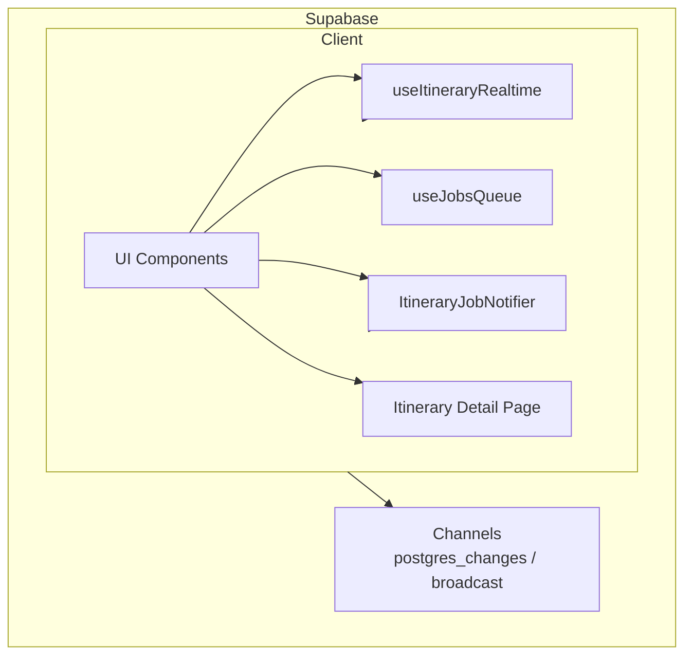
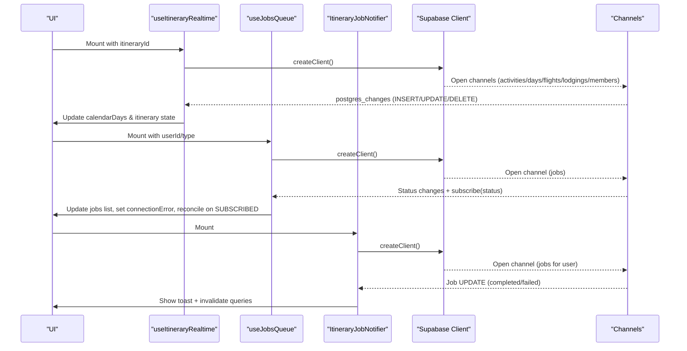
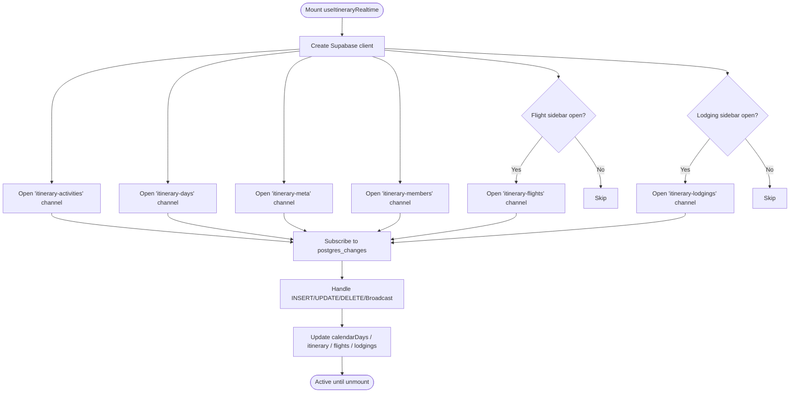
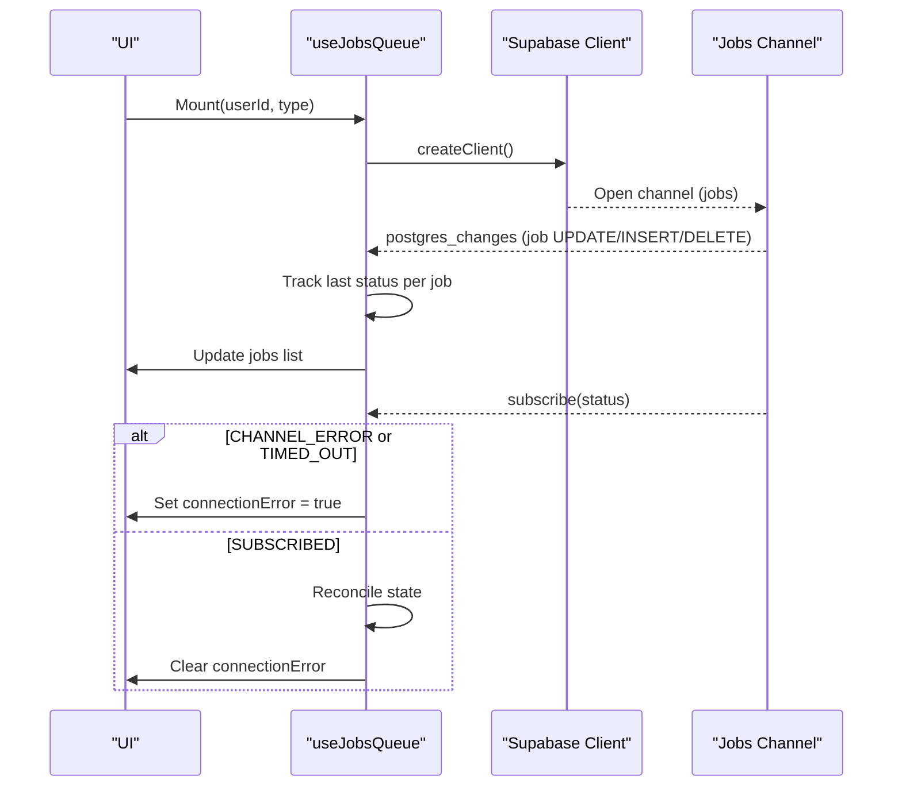
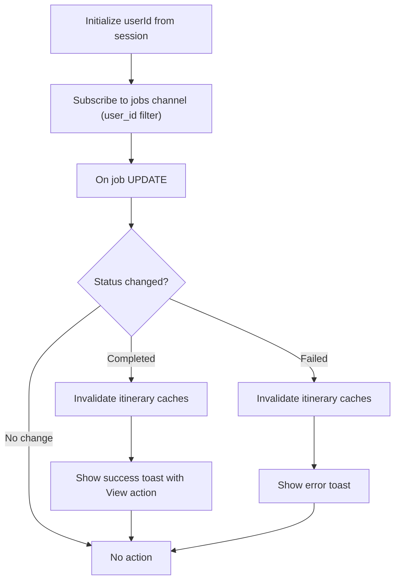
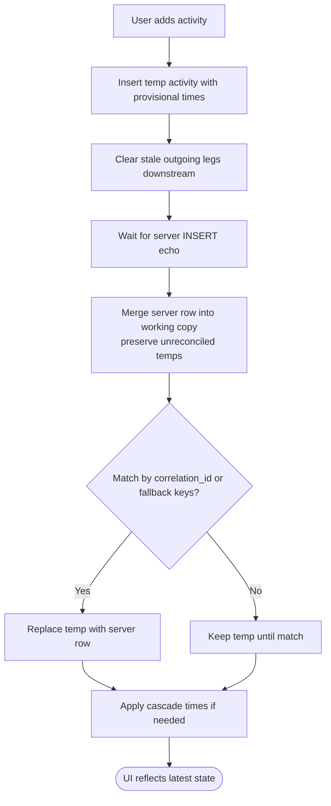
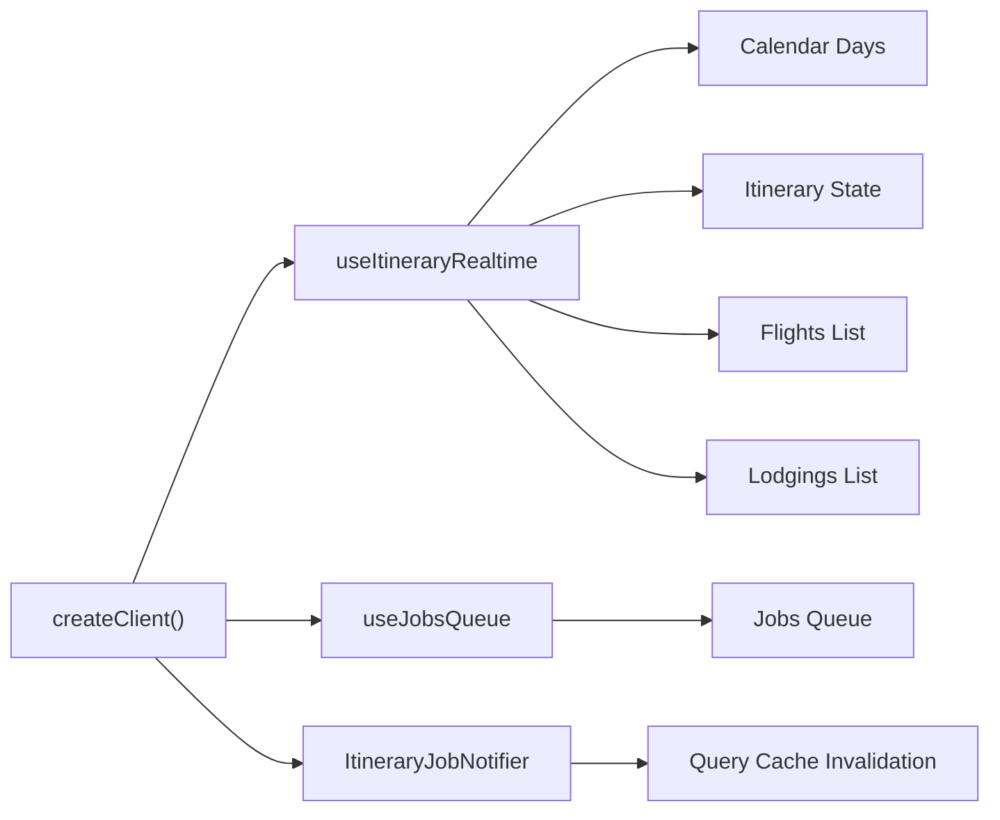

# Real-time Subscriptions

<cite>
**Referenced Files in This Document**
- [useItineraryRealtime.ts](file://src/hooks/useItineraryRealtime.ts)
- [useJobsQueue.ts](file://src/hooks/useJobsQueue.ts)
- [ItineraryJobNotifier.tsx](file://src/components/notifications/ItineraryJobNotifier.tsx)
- [page.tsx (itinerary detail)](file://src/app/itineraries/[id]/page.tsx)
- [client.ts](file://src/lib/supabase/client.ts)
- [personalization-pipeline.md](file://docs/personalization-pipeline.md)
</cite>

## Table of Contents
1. [Introduction](#introduction)
2. [Project Structure](#project-structure)
3. [Core Components](#core-components)
4. [Architecture Overview](#architecture-overview)
5. [Detailed Component Analysis](#detailed-component-analysis)
6. [Dependency Analysis](#dependency-analysis)
7. [Performance Considerations](#performance-considerations)
8. [Troubleshooting Guide](#troubleshooting-guide)
9. [Conclusion](#conclusion)
10. [Appendices](#appendices)

## Introduction
This document explains how the application uses Supabase real-time subscriptions to power live updates, collaborative editing, and notifications. It covers WebSocket connection management via Supabase channels, subscription patterns for database changes, event handling for live updates, optimistic UI updates during collaboration, conflict resolution strategies when merging server state with local edits, and reconnection/error recovery mechanisms. It also provides practical examples for implementing real-time notifications, collaborative editing, and live data synchronization across clients.

## Project Structure
The real-time features are implemented primarily through:
- A dedicated hook that subscribes to multiple Supabase channels for itinerary-related tables and broadcasts.
- A job queue hook that listens to job status changes and reconciles state on reconnect.
- A notification component that shows toast messages based on job completion or failure.
- The itinerary detail page that performs optimistic updates and merges server responses while preserving pending local edits.
- A minimal Supabase client factory used by all components.

**Diagram sources**
- [useItineraryRealtime.ts:27-533](file://src/hooks/useItineraryRealtime.ts#L27-L533)
- [useJobsQueue.ts:45-295](file://src/hooks/useJobsQueue.ts#L45-L295)
- [ItineraryJobNotifier.tsx:10-92](file://src/components/notifications/ItineraryJobNotifier.tsx#L10-L92)
- [page.tsx (itinerary detail):106-154](file://src/app/itineraries/[id]/page.tsx#L106-L154)
- [client.ts:1-9](file://src/lib/supabase/client.ts#L1-L9)

**Section sources**
- [useItineraryRealtime.ts:27-533](file://src/hooks/useItineraryRealtime.ts#L27-L533)
- [useJobsQueue.ts:45-295](file://src/hooks/useJobsQueue.ts#L45-L295)
- [ItineraryJobNotifier.tsx:10-92](file://src/components/notifications/ItineraryJobNotifier.tsx#L10-L92)
- [page.tsx (itinerary detail):106-154](file://src/app/itineraries/[id]/page.tsx#L106-L154)
- [client.ts:1-9](file://src/lib/supabase/client.ts#L1-L9)

## Core Components
- useItineraryRealtime: Subscribes to multiple Supabase channels for activities, days, flights, lodgings, itinerary metadata, and collaborator membership. Handles INSERT/UPDATE/DELETE events and broadcasts to keep calendar and view-mode states in sync.
- useJobsQueue: Subscribes to job table changes, tracks per-job status transitions, detects connection errors/timeouts, and reconciles state after reconnection. Provides optimistic upsert for immediate UI feedback.
- ItineraryJobNotifier: Listens to job updates for a user and shows success/failure toasts, invalidating relevant caches so the UI refreshes.
- Itinerary detail page: Performs optimistic inserts and time cascades, then merges server responses while preserving pending temporary items using correlation-based reconciliation.

**Section sources**
- [useItineraryRealtime.ts:27-533](file://src/hooks/useItineraryRealtime.ts#L27-L533)
- [useJobsQueue.ts:45-295](file://src/hooks/useJobsQueue.ts#L45-L295)
- [ItineraryJobNotifier.tsx:10-92](file://src/components/notifications/ItineraryJobNotifier.tsx#L10-L92)
- [page.tsx (itinerary detail):106-154](file://src/app/itineraries/[id]/page.tsx#L106-L154)

## Architecture Overview
The system relies on Supabase’s real-time channels to propagate database changes to clients. Each feature area opens one or more channels scoped by itinerary or user. Event handlers update local React state immediately, ensuring responsive UIs. For long-running jobs, the app combines real-time updates with optimistic UI and reconnection reconciliation to maintain consistency.

**Diagram sources**
- [useItineraryRealtime.ts:27-533](file://src/hooks/useItineraryRealtime.ts#L27-L533)
- [useJobsQueue.ts:45-295](file://src/hooks/useJobsQueue.ts#L45-L295)
- [ItineraryJobNotifier.tsx:10-92](file://src/components/notifications/ItineraryJobNotifier.tsx#L10-L92)
- [client.ts:1-9](file://src/lib/supabase/client.ts#L1-L9)

## Detailed Component Analysis

### Realtime Hook: useItineraryRealtime
- Subscriptions:
  - Activities: listens to INSERT/UPDATE/DELETE on itinerary_activities filtered by itinerary_id; updates both calendar view and view-mode itinerary state; hydrates location details asynchronously when available.
  - Days: listens to INSERT/DELETE on itinerary_days to add/remove day entries.
  - Metadata: listens to UPDATE on itineraries to reflect name/country/spot count changes from collaborators.
  - Members: listens to INSERT/DELETE on user_itinerary to update collaborator lists.
  - Flights/Lodgings: conditional subscriptions when sidebars are open; listen to INSERT/UPDATE/DELETE on respective tables.
  - Broadcast: listens to activity_added broadcast events to update calendar instantly.
- Channel lifecycle: each effect creates a channel, registers listeners, subscribes, and removes the channel on unmount.

**Diagram sources**
- [useItineraryRealtime.ts:27-533](file://src/hooks/useItineraryRealtime.ts#L27-L533)

**Section sources**
- [useItineraryRealtime.ts:27-533](file://src/hooks/useItineraryRealtime.ts#L27-L533)

### Job Queue: useJobsQueue
- Subscription: listens to job table changes filtered by type and user context; maintains a map of last known statuses to detect transitions and avoid duplicate notifications.
- Connection monitoring: subscribes to channel status; sets connectionError on CHANNEL_ERROR/TIMED_OUT; clears error and reconciles state on SUBSCRIBED to recover missed updates.
- Optimistic updates: exposes upsertJob to merge new or updated jobs immediately into UI state without waiting for realtime UPDATE.
- Cleanup: removes channel and cleans up visibility listeners on unmount.

**Diagram sources**
- [useJobsQueue.ts:45-295](file://src/hooks/useJobsQueue.ts#L45-L295)

**Section sources**
- [useJobsQueue.ts:45-295](file://src/hooks/useJobsQueue.ts#L45-L295)

### Notifications: ItineraryJobNotifier
- Purpose: Provide user-facing notifications for job completion or failure.
- Behavior: Initializes userId from session; subscribes to job updates for the current user and type; compares previous status to trigger actions only once per transition; invalidates relevant query caches and shows toasts with optional navigation action.

**Diagram sources**
- [ItineraryJobNotifier.tsx:10-92](file://src/components/notifications/ItineraryJobNotifier.tsx#L10-L92)

**Section sources**
- [ItineraryJobNotifier.tsx:10-92](file://src/components/notifications/ItineraryJobNotifier.tsx#L10-L92)

### Collaborative Editing and Conflict Resolution: Itinerary Detail Page
- Optimistic inserts: When adding an activity, the UI immediately inserts a temporary item with provisional times and clears stale legs downstream to reflect expected cascade behavior before the server response arrives.
- Server merge strategy: When server rows arrive (via realtime echo), the page merges them into the working copy while preserving pending temporary items until they are matched to their server counterpart using correlation_id or fallback keys. Once matched, the temp is replaced by the authoritative server row.
- Time cascades and deconflictation: When reordering or optimizing routes, the page computes proposed changes, presents a confirmation dialog showing affected activities and locked anchors, and applies resolved times optimistically before persisting.

**Diagram sources**
- [page.tsx (itinerary detail):106-154](file://src/app/itineraries/[id]/page.tsx#L106-L154)
- [page.tsx (itinerary detail):2074-2092](file://src/app/itineraries/[id]/page.tsx#L2074-L2092)
- [page.tsx (itinerary detail):957-984](file://src/app/itineraries/[id]/page.tsx#L957-L984)

**Section sources**
- [page.tsx (itinerary detail):106-154](file://src/app/itineraries/[id]/page.tsx#L106-L154)
- [page.tsx (itinerary detail):2074-2092](file://src/app/itineraries/[id]/page.tsx#L2074-L2092)
- [page.tsx (itinerary detail):957-984](file://src/app/itineraries/[id]/page.tsx#L957-L984)

## Dependency Analysis
- Supabase client: All real-time features rely on a single client factory that returns a browser client configured with environment variables.
- Channel scoping: Channels are named per resource (e.g., itinerary ID or user ID) to scope events correctly and avoid cross-talk.
- State synchronization: Multiple hooks update shared React state objects (calendar days, itinerary, jobs, flights, lodgings). Careful deduplication and id-based matching prevent duplicates and ensure consistent UI.
- Query invalidation: Notifications invalidate cached queries to ensure subsequent reads reflect latest server state.

**Diagram sources**
- [client.ts:1-9](file://src/lib/supabase/client.ts#L1-L9)
- [useItineraryRealtime.ts:27-533](file://src/hooks/useItineraryRealtime.ts#L27-L533)
- [useJobsQueue.ts:45-295](file://src/hooks/useJobsQueue.ts#L45-L295)
- [ItineraryJobNotifier.tsx:10-92](file://src/components/notifications/ItineraryJobNotifier.tsx#L10-L92)

**Section sources**
- [client.ts:1-9](file://src/lib/supabase/client.ts#L1-L9)
- [useItineraryRealtime.ts:27-533](file://src/hooks/useItineraryRealtime.ts#L27-L533)
- [useJobsQueue.ts:45-295](file://src/hooks/useJobsQueue.ts#L45-L295)
- [ItineraryJobNotifier.tsx:10-92](file://src/components/notifications/ItineraryJobNotifier.tsx#L10-L92)

## Performance Considerations
- Channel multiplexing: Each feature opens targeted channels; avoid unnecessary subscriptions (e.g., flights/lodgings only when sidebars are visible).
- Deduplication: Id-based checks prevent duplicate entries when both realtime and pagination load the same items.
- Efficient updates: In-place replacements for same-day updates preserve ordering and avoid unnecessary reflows.
- Polling alternative: For long-running jobs, polling can be considered to reduce channel complexity; however, the current implementation uses real-time with reconciliation for responsiveness.

[No sources needed since this section provides general guidance]

## Troubleshooting Guide
- Connection errors/timeouts:
  - Symptom: Jobs queue shows connectionError; UI may not update until reconnection.
  - Recovery: On SUBSCRIBED, the hook reconciles state to catch missed updates; ensure channels are properly removed on unmount to avoid leaks.
- Duplicate channel subscriptions:
  - Symptom: Errors when subscribing to already-subscribed channels due to topic deduplication.
  - Mitigation: Use unique instance IDs per hook mount to keep channels independent.
- Missing location data on activity inserts:
  - Symptom: Newly inserted activities lack thumbnails/address until location is fetched.
  - Behavior: The hook asynchronously hydrates location details; failures are logged but do not block activity display.
- Stale legs after reorder:
  - Symptom: Outgoing legs point to incorrect successors after insert/reorder.
  - Fix: Clear stale legs immediately on optimistic insert; backend recomputes fresh travel data on save.

**Section sources**
- [useJobsQueue.ts:244-272](file://src/hooks/useJobsQueue.ts#L244-L272)
- [useItineraryRealtime.ts:40-87](file://src/hooks/useItineraryRealtime.ts#L40-L87)
- [page.tsx (itinerary detail):2074-2092](file://src/app/itineraries/[id]/page.tsx#L2074-L2092)

## Conclusion
The application implements robust real-time capabilities using Supabase channels to deliver live updates for itinerary editing, job processing, and notifications. It employs optimistic UI updates, careful reconciliation strategies, and connection monitoring to maintain a responsive and consistent user experience. By structuring subscriptions per resource and handling edge cases like duplicates and missing data, the system scales well for collaborative workflows.

[No sources needed since this section summarizes without analyzing specific files]

## Appendices

### Example Patterns

- Real-time notifications:
  - Subscribe to job updates for the current user and show toasts on status transitions; invalidate caches to refresh related views.
  - Reference: [ItineraryJobNotifier.tsx:10-92](file://src/components/notifications/ItineraryJobNotifier.tsx#L10-L92)

- Collaborative editing:
  - Listen to INSERT/UPDATE/DELETE on activities and days; update calendar and view-mode state; hydrate locations asynchronously.
  - Reference: [useItineraryRealtime.ts:40-333](file://src/hooks/useItineraryRealtime.ts#L40-L333)

- Live data synchronization:
  - Maintain separate channels for flights and lodgings when sidebars are open; handle CRUD events to keep lists in sync.
  - Reference: [useItineraryRealtime.ts:442-530](file://src/hooks/useItineraryRealtime.ts#L442-L530)

- Connection monitoring and reconnection:
  - Monitor channel status; set connectionError on errors; reconcile state on reconnection to recover missed updates.
  - Reference: [useJobsQueue.ts:250-260](file://src/hooks/useJobsQueue.ts#L250-L260)

- Optimistic UI updates:
  - Insert temporary items immediately; clear stale legs; merge server responses preserving pending items until matched by correlation.
  - Reference: [page.tsx (itinerary detail):106-154](file://src/app/itineraries/[id]/page.tsx#L106-L154), [page.tsx (itinerary detail):2074-2092](file://src/app/itineraries/[id]/page.tsx#L2074-L2092)

- Contextual note on real-time usage:
  - The project documents that Supabase Realtime is the primary cost driver and outlines migration considerations for certain hooks.
  - Reference: [personalization-pipeline.md:140-160](file://docs/personalization-pipeline.md#L140-L160)