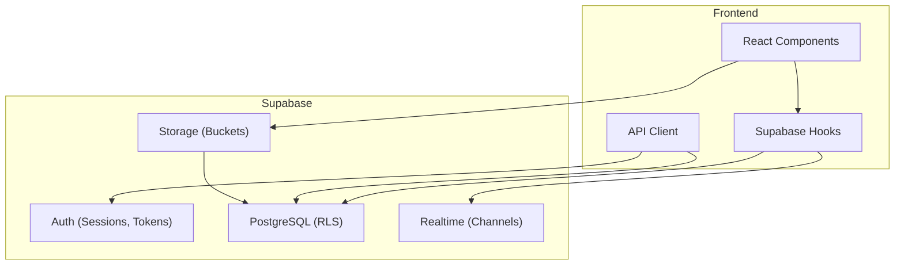
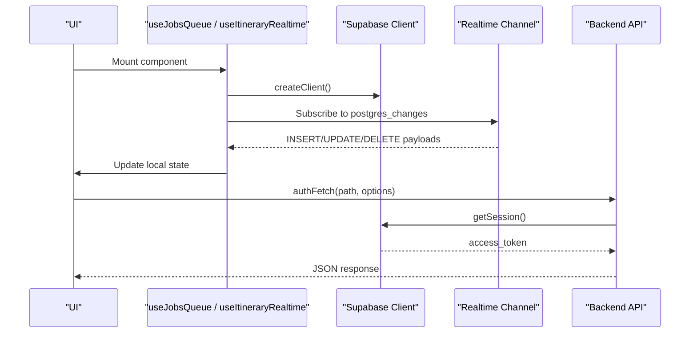
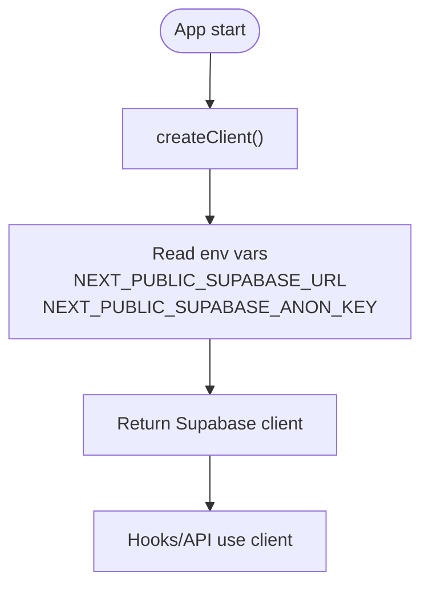
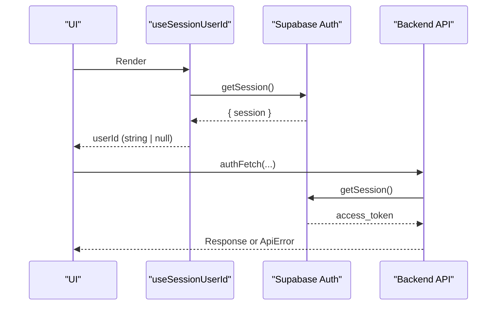
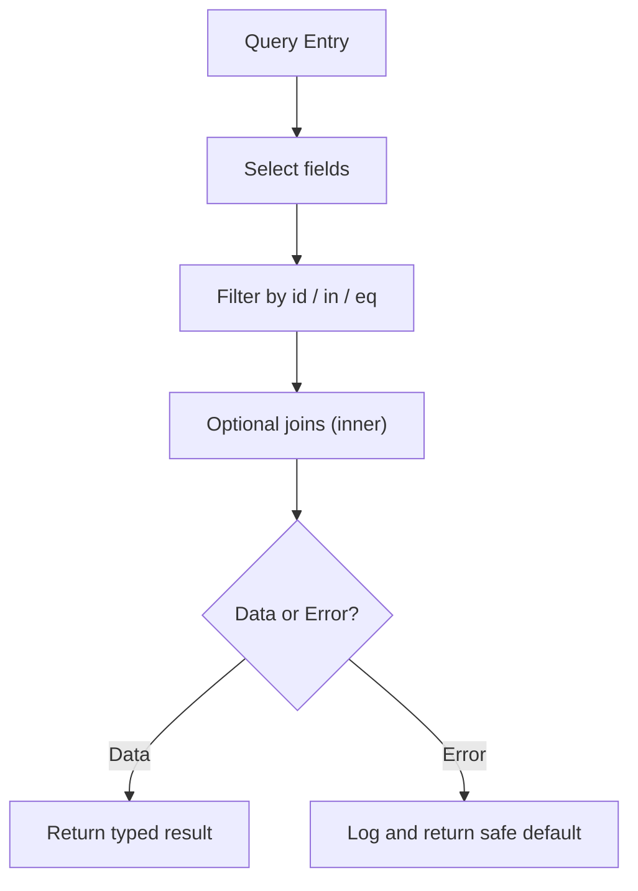
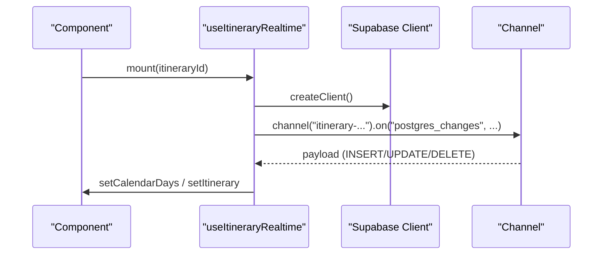
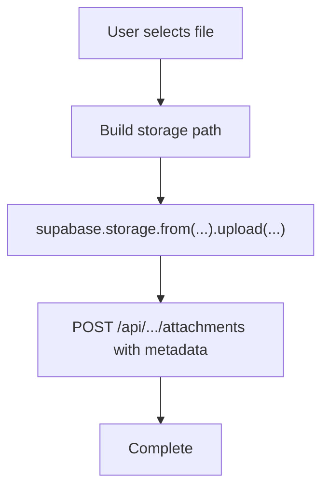
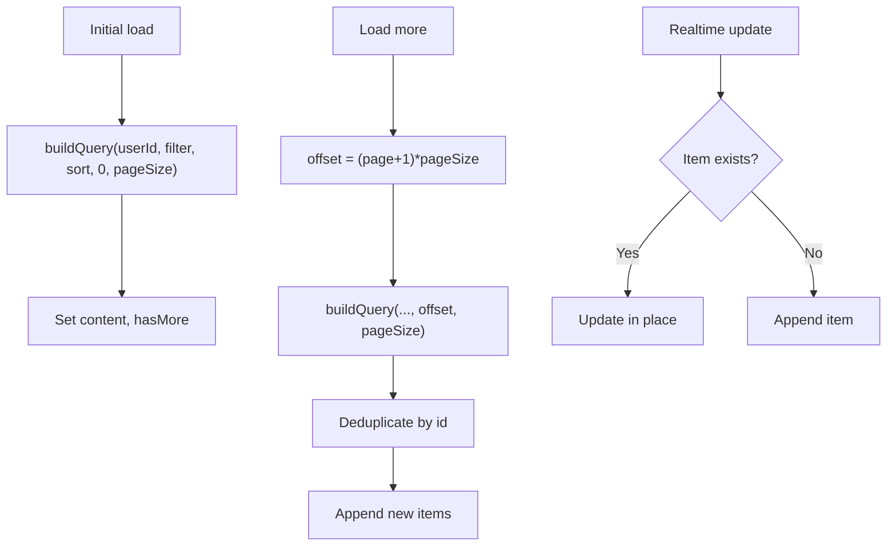
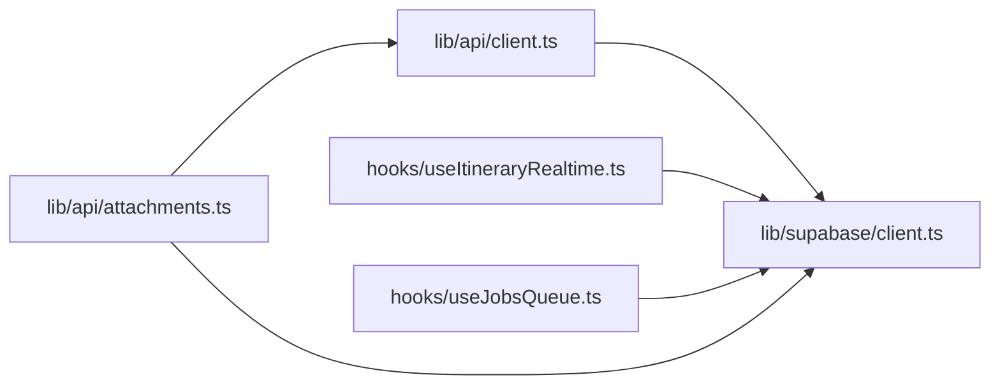

# Supabase Integration

<cite>
**Referenced Files in This Document**
- [client.ts](file://src/lib/supabase/client.ts)
- [queries.ts](file://src/lib/supabase/queries.ts)
- [useSessionUserId.ts](file://src/hooks/useSessionUserId.ts)
- [useJobsQueue.ts](file://src/hooks/useJobsQueue.ts)
- [useItineraryRealtime.ts](file://src/hooks/useItineraryRealtime.ts)
- [usePaginatedContent.ts](file://src/hooks/usePaginatedContent.ts)
- [client.ts](file://src/lib/api/client.ts)
- [attachments.ts](file://src/lib/api/attachments.ts)
- [userMessages.ts](file://src/lib/errors/userMessages.ts)
</cite>

## Table of Contents
1. Introduction
2. Project Structure
3. Core Components
4. Architecture Overview
5. Detailed Component Analysis
6. Dependency Analysis
7. Performance Considerations
8. Troubleshooting Guide
9. Conclusion

## Introduction
This document explains how the Argo platform integrates with Supabase for authentication, database operations, real-time collaboration, and storage. It covers client initialization using createBrowserClient, environment configuration via NEXT_PUBLIC_SUPABASE_URL and NEXT_PUBLIC_SUPABASE_ANON_KEY, session handling, user state management, query patterns, error handling strategies, performance optimizations, connection resilience, and debugging approaches.

## Project Structure
Supabase integration is centered around a small set of modules:
- Client initialization and environment configuration live in a dedicated client module.
- Database queries are encapsulated in reusable functions that accept a Supabase client instance.
- Real-time features are implemented in React hooks that subscribe to Postgres changes and broadcast events.
- Authentication flows integrate with Supabase Auth and propagate tokens to backend APIs.
- Storage uploads use Supabase Storage with server-side metadata registration.

[No sources needed since this diagram shows conceptual workflow, not actual code structure]

## Core Components
- Browser client factory: Creates a Supabase client configured with environment variables for URL and anonymous key.
- Query helpers: Typed functions for profile lookups, content retrieval, and collection operations.
- Session and user state: A hook to resolve the current user ID from the active session.
- Real-time subscriptions: Hooks that listen to Postgres changes for collaborative editing and job queues.
- API client: Retrieves the access token from Supabase Auth and attaches it to outbound requests.
- Storage upload: Uploads files to a bucket and records metadata via a backend endpoint.
- Error mapping: Converts Supabase auth errors into user-friendly messages.

**Section sources**
- [client.ts:1-8](file://src/lib/supabase/client.ts#L1-L8)
- [queries.ts:14-29](file://src/lib/supabase/queries.ts#L14-L29)
- [queries.ts:50-99](file://src/lib/supabase/queries.ts#L50-L99)
- [queries.ts:103-114](file://src/lib/supabase/queries.ts#L103-L114)
- [useSessionUserId.ts:1-19](file://src/hooks/useSessionUserId.ts#L1-L19)
- [useJobsQueue.ts:45-295](file://src/hooks/useJobsQueue.ts#L45-L295)
- [useItineraryRealtime.ts:1-534](file://src/hooks/useItineraryRealtime.ts#L1-L534)
- [client.ts:48-94](file://src/lib/api/client.ts#L48-L94)
- [attachments.ts:48-83](file://src/lib/api/attachments.ts#L48-L83)
- [userMessages.ts:1-106](file://src/lib/errors/userMessages.ts#L1-L106)

## Architecture Overview
The application uses a layered approach:
- UI components call React hooks to read/write data or subscribe to changes.
- Hooks instantiate the Supabase browser client and perform queries or subscribe to channels.
- Backend API calls attach the Supabase access token for authenticated server-to-server interactions.
- Storage uploads persist media to a bucket and then register file metadata through an API route.

**Diagram sources**
- [useJobsQueue.ts:78-267](file://src/hooks/useJobsQueue.ts#L78-L267)
- [useItineraryRealtime.ts:89-333](file://src/hooks/useItineraryRealtime.ts#L89-L333)
- [client.ts:48-94](file://src/lib/api/client.ts#L48-L94)

## Detailed Component Analysis

### Client Initialization and Environment Configuration
- The client factory uses createBrowserClient with NEXT_PUBLIC_SUPABASE_URL and NEXT_PUBLIC_SUPABASE_ANON_KEY.
- All hooks and services import this factory to ensure consistent configuration across the app.

**Diagram sources**
- [client.ts:1-8](file://src/lib/supabase/client.ts#L1-L8)

**Section sources**
- [client.ts:1-8](file://src/lib/supabase/client.ts#L1-L8)

### Authentication Flow and Session Handling
- The app retrieves the current session to obtain the user ID and access token.
- The API client fetches the access token and attaches it to all outbound requests.
- Errors from Supabase Auth are mapped to friendly messages for users.

**Diagram sources**
- [useSessionUserId.ts:1-19](file://src/hooks/useSessionUserId.ts#L1-L19)
- [client.ts:48-94](file://src/lib/api/client.ts#L48-L94)
- [userMessages.ts:1-106](file://src/lib/errors/userMessages.ts#L1-L106)

**Section sources**
- [useSessionUserId.ts:1-19](file://src/hooks/useSessionUserId.ts#L1-L19)
- [client.ts:48-94](file://src/lib/api/client.ts#L48-L94)
- [userMessages.ts:1-106](file://src/lib/errors/userMessages.ts#L1-L106)

### Database Operations and Query Patterns
- Profile queries retrieve user details by ID or batch by IDs.
- Content detail queries select nested relations and enforce scoping via joins.
- Collection operations upsert location associations with conflict handling.
- Preview image aggregation builds maps of images per collection efficiently.

**Diagram sources**
- [queries.ts:14-29](file://src/lib/supabase/queries.ts#L14-L29)
- [queries.ts:50-99](file://src/lib/supabase/queries.ts#L50-L99)
- [queries.ts:103-114](file://src/lib/supabase/queries.ts#L103-L114)
- [queries.ts:121-149](file://src/lib/supabase/queries.ts#L121-L149)

**Section sources**
- [queries.ts:14-29](file://src/lib/supabase/queries.ts#L14-L29)
- [queries.ts:50-99](file://src/lib/supabase/queries.ts#L50-L99)
- [queries.ts:103-114](file://src/lib/supabase/queries.ts#L103-L114)
- [queries.ts:121-149](file://src/lib/supabase/queries.ts#L121-L149)

### Real-Time Subscriptions for Collaborative Features
- Itinerary collaboration subscribes to multiple tables (activities, days, flights, lodgings, members) and updates both calendar and view states.
- Job queue subscription listens to jobs table changes, reconciles missed updates on visibility change or reconnect, and emits terminal transition callbacks.
- Paginated content subscription deduplicates items arriving via realtime and incremental loading.

**Diagram sources**
- [useItineraryRealtime.ts:89-333](file://src/hooks/useItineraryRealtime.ts#L89-L333)
- [useJobsQueue.ts:167-260](file://src/hooks/useJobsQueue.ts#L167-L260)
- [usePaginatedContent.ts:209-220](file://src/hooks/usePaginatedContent.ts#L209-L220)

**Section sources**
- [useItineraryRealtime.ts:1-534](file://src/hooks/useItineraryRealtime.ts#L1-L534)
- [useJobsQueue.ts:45-295](file://src/hooks/useJobsQueue.ts#L45-L295)
- [usePaginatedContent.ts:131-220](file://src/hooks/usePaginatedContent.ts#L131-L220)

### Storage Management for Media Assets
- File uploads target a specific bucket and path constructed from entity context.
- After upload, metadata is registered via a backend endpoint that receives the storage path and file details.

**Diagram sources**
- [attachments.ts:48-83](file://src/lib/api/attachments.ts#L48-L83)

**Section sources**
- [attachments.ts:48-83](file://src/lib/api/attachments.ts#L48-L83)

### Query Patterns and Data Flows
- Initial load: Fetch paginated content using buildQuery with offset and pageSize.
- Incremental load: Load next page and deduplicate against existing items.
- Realtime sync: Listen to changes and merge into local state without duplicating entries.

**Diagram sources**
- [usePaginatedContent.ts:140-207](file://src/hooks/usePaginatedContent.ts#L140-L207)
- [usePaginatedContent.ts:209-220](file://src/hooks/usePaginatedContent.ts#L209-L220)

**Section sources**
- [usePaginatedContent.ts:131-220](file://src/hooks/usePaginatedContent.ts#L131-L220)

## Dependency Analysis
- The API client depends on the Supabase client to obtain the access token.
- Realtime hooks depend on the Supabase client to create channels and subscribe to Postgres changes.
- Storage uploads depend on the Supabase client for storage operations and on the API client for metadata registration.

**Diagram sources**
- [client.ts:48-94](file://src/lib/api/client.ts#L48-L94)
- [useItineraryRealtime.ts:1-534](file://src/hooks/useItineraryRealtime.ts#L1-L534)
- [useJobsQueue.ts:45-295](file://src/hooks/useJobsQueue.ts#L45-L295)
- [attachments.ts:48-83](file://src/lib/api/attachments.ts#L48-L83)
- [client.ts:1-8](file://src/lib/supabase/client.ts#L1-L8)

**Section sources**
- [client.ts:48-94](file://src/lib/api/client.ts#L48-L94)
- [useItineraryRealtime.ts:1-534](file://src/hooks/useItineraryRealtime.ts#L1-L534)
- [useJobsQueue.ts:45-295](file://src/hooks/useJobsQueue.ts#L45-L295)
- [attachments.ts:48-83](file://src/lib/api/attachments.ts#L48-L83)
- [client.ts:1-8](file://src/lib/supabase/client.ts#L1-L8)

## Performance Considerations
- Realtime channel uniqueness: Each hook instance creates a unique channel topic suffix to avoid channel sharing conflicts when multiple instances subscribe to the same table.
- Deduplication: Paginated content merges realtime updates with incremental loads by checking existing IDs.
- Reconciliation: Job queue reconciles missed updates on tab visibility change and channel reconnect to prevent stale states.
- Efficient queries: Queries select only required fields and use joins where necessary to minimize round-trips.
- Optimistic updates: Job queue supports optimistic merging to reflect immediate UI changes while awaiting realtime confirmation.

[No sources needed since this section provides general guidance]

## Troubleshooting Guide
- Friendly auth errors: Map Supabase auth errors to user-friendly messages; keep technical details out of UI.
- API errors: Centralized unwrap ensures non-OK responses throw typed errors with status codes for consistent handling.
- Connection issues: Realtime hooks detect channel errors/timeouts and set connection error flags; reconcile on reconnect.
- Debugging tips:
  - Inspect network panel for transport failures (status 0) vs HTTP errors.
  - Verify environment variables for Supabase URL and anon key.
  - Check channel topics for uniqueness and correct filters.
  - Validate RLS policies if queries unexpectedly return empty results.

**Section sources**
- [userMessages.ts:1-106](file://src/lib/errors/userMessages.ts#L1-L106)
- [client.ts:85-107](file://src/lib/api/client.ts#L85-L107)
- [useJobsQueue.ts:250-260](file://src/hooks/useJobsQueue.ts#L250-L260)

## Conclusion
The Argo platform integrates Supabase through a clear separation of concerns: a centralized client factory, typed query helpers, robust real-time hooks, secure API calls with bearer tokens, and reliable storage workflows. The design emphasizes resilient real-time updates, efficient data fetching, and user-friendly error handling. Following these patterns ensures scalable collaboration features and maintainable integrations with Supabase services.