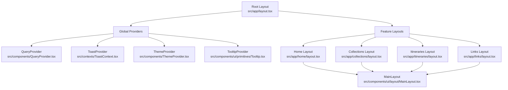
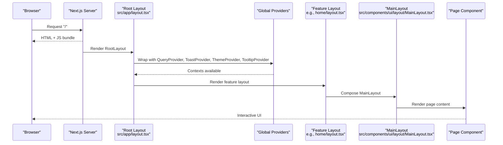
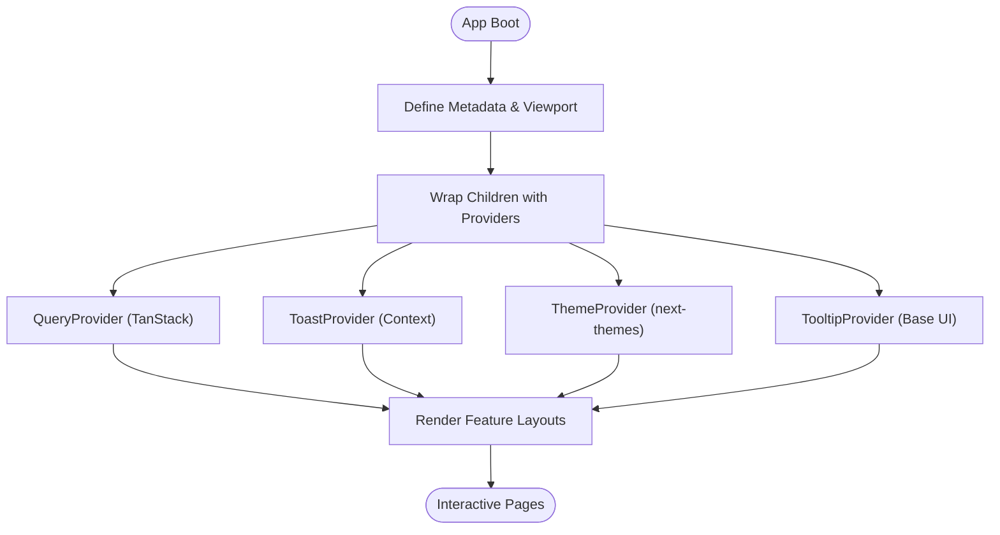
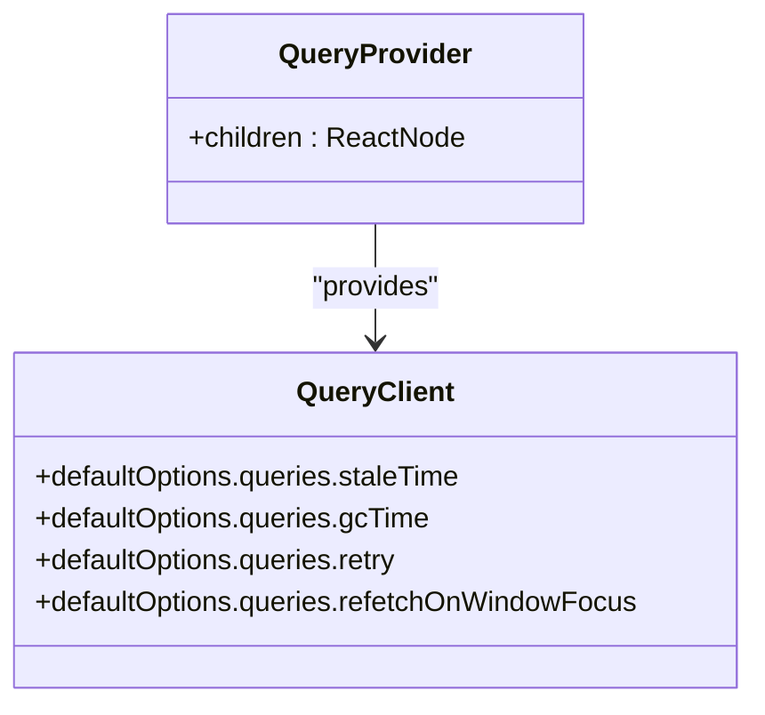
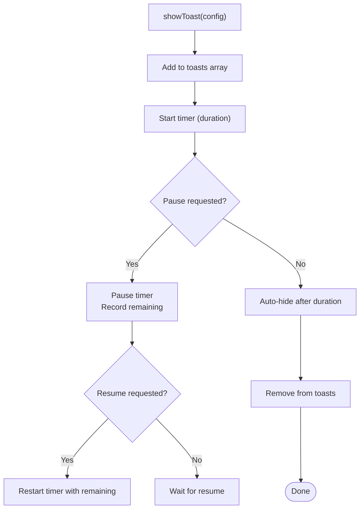
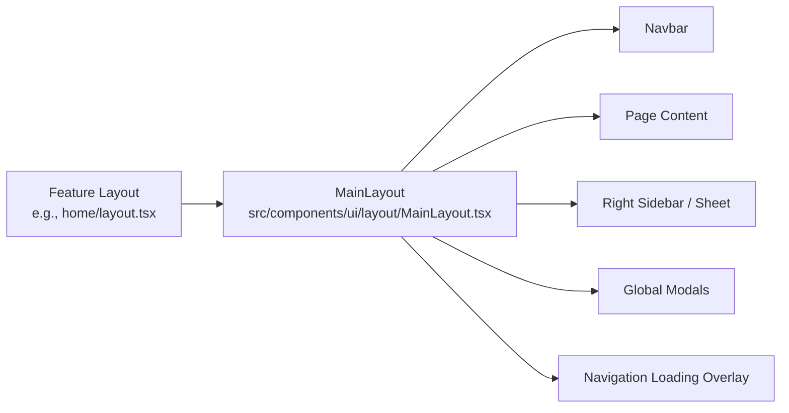
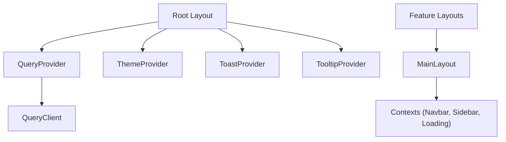

# System Design

<cite>
**Referenced Files in This Document**
- [layout.tsx](file://src/app/layout.tsx)
- [page.tsx](file://src/app/page.tsx)
- [home/layout.tsx](file://src/app/home/layout.tsx)
- [collections/layout.tsx](file://src/app/collections/layout.tsx)
- [itineraries/layout.tsx](file://src/app/itineraries/layout.tsx)
- [links/layout.tsx](file://src/app/links/layout.tsx)
- [QueryProvider.tsx](file://src/components/QueryProvider.tsx)
- [ThemeProvider.tsx](file://src/components/ThemeProvider.tsx)
- [ToastContext.tsx](file://src/contexts/ToastContext.tsx)
- [Tooltip.tsx](file://src/components/ui/primitives/Tooltip.tsx)
- [MainLayout.tsx](file://src/components/ui/layout/MainLayout.tsx)
- [queryClient.ts](file://src/lib/query/queryClient.ts)
- [site.ts](file://src/lib/site.ts)
- [next.config.js](file://next.config.js)
</cite>

## Table of Contents
1. [Introduction](#introduction)
2. [Project Structure](#project-structure)
3. [Core Components](#core-components)
4. [Architecture Overview](#architecture-overview)
5. [Detailed Component Analysis](#detailed-component-analysis)
6. [Dependency Analysis](#dependency-analysis)
7. [Performance Considerations](#performance-considerations)
8. [Troubleshooting Guide](#troubleshooting-guide)
9. [Conclusion](#conclusion)

## Introduction
This document describes the system design of the Argo application built with Next.js App Router. It explains the root layout configuration, global providers (QueryProvider, ThemeProvider, ToastProvider), and how they wrap the application. It also clarifies the separation between server-side rendering and client-side components, metadata management, and performance optimizations implemented via Next.js configuration and component patterns.

## Project Structure
Argo uses a feature-oriented folder structure under src:
- app/: Next.js App Router routes and layouts
  - Root layout defines global providers, metadata, and viewport settings
  - Feature layouts (home, collections, itineraries, links) compose a shared MainLayout for consistent UI chrome
- components/: Reusable UI primitives and feature-specific components
  - Global providers live here (QueryProvider, ThemeProvider)
  - Shared UI primitives include Tooltip, Toast, etc.
- contexts/: React contexts for cross-cutting concerns (toasts, navigation loading, sidebar visibility)
- lib/: Utilities, API clients, query configuration, and site constants

**Diagram sources**
- [layout.tsx:57-83](file://src/app/layout.tsx#L57-L83)
- [QueryProvider.tsx:7-13](file://src/components/QueryProvider.tsx#L7-L13)
- [ThemeProvider.tsx:5-16](file://src/components/ThemeProvider.tsx#L5-L16)
- [ToastContext.tsx:42-148](file://src/contexts/ToastContext.tsx#L42-L148)
- [Tooltip.tsx:98-109](file://src/components/ui/primitives/Tooltip.tsx#L98-L109)
- [home/layout.tsx:5-11](file://src/app/home/layout.tsx#L5-L11)
- [collections/layout.tsx:5-11](file://src/app/collections/layout.tsx#L5-L11)
- [itineraries/layout.tsx:5-11](file://src/app/itineraries/layout.tsx#L5-L11)
- [links/layout.tsx:5-11](file://src/app/links/layout.tsx#L5-L11)
- [MainLayout.tsx:386-396](file://src/components/ui/layout/MainLayout.tsx#L386-L396)

**Section sources**
- [layout.tsx:1-85](file://src/app/layout.tsx#L1-L85)
- [next.config.js:1-18](file://next.config.js#L1-L18)

## Core Components
- Root layout: Defines metadata, viewport, fonts, and wraps children with global providers to provide data fetching, theming, toast notifications, and tooltip behavior across the app.
- QueryProvider: Wraps the app with TanStack React Query’s QueryClientProvider using a configured QueryClient instance.
- ThemeProvider: Uses next-themes to manage theme state with class-based attribute toggling.
- ToastProvider: Provides centralized toast state and lifecycle management (show, pause, resume, remove).
- TooltipProvider: Centralizes hover timing and provides Base UI tooltip primitives consistently across the app.
- MainLayout: Shared shell for authenticated areas, including navbar, right sidebar, modals, and navigation loading overlay.

Key responsibilities:
- Data layer: QueryProvider configures caching, retries, and stale times via queryClient.
- UI layer: ThemeProvider and TooltipProvider standardize appearance and interactions.
- UX layer: ToastProvider manages user feedback; MainLayout composes navigation and content regions.

**Section sources**
- [QueryProvider.tsx:1-14](file://src/components/QueryProvider.tsx#L1-L14)
- [queryClient.ts:1-13](file://src/lib/query/queryClient.ts#L1-L13)
- [ThemeProvider.tsx:1-17](file://src/components/ThemeProvider.tsx#L1-L17)
- [ToastContext.tsx:1-155](file://src/contexts/ToastContext.tsx#L1-L155)
- [Tooltip.tsx:1-185](file://src/components/ui/primitives/Tooltip.tsx#L1-L185)
- [MainLayout.tsx:1-397](file://src/components/ui/layout/MainLayout.tsx#L1-L397)

## Architecture Overview
The application bootstraps through the root layout, which sets up global context providers and metadata. Feature layouts then compose a shared MainLayout that renders page-specific content within a consistent shell. Client-only components are marked with "use client" to ensure interactivity runs on the browser.

**Diagram sources**
- [layout.tsx:57-83](file://src/app/layout.tsx#L57-L83)
- [home/layout.tsx:5-11](file://src/app/home/layout.tsx#L5-L11)
- [MainLayout.tsx:386-396](file://src/components/ui/layout/MainLayout.tsx#L386-L396)

## Detailed Component Analysis

### Root Layout and Metadata Management
- Metadata: Centralized title templates, description, Open Graph, Twitter card, robots directives, and canonical URL.
- Viewport: Configured for safe-area insets to support notched devices.
- Fonts: Preconnect and stylesheet link for external font service; CSS variable injected for font usage.
- Provider chain: QueryProvider -> ToastProvider -> ThemeProvider -> TooltipProvider wrapping children.

**Diagram sources**
- [layout.tsx:19-55](file://src/app/layout.tsx#L19-L55)
- [layout.tsx:57-83](file://src/app/layout.tsx#L57-L83)

**Section sources**
- [layout.tsx:1-85](file://src/app/layout.tsx#L1-L85)
- [site.ts:1-7](file://src/lib/site.ts#L1-L7)

### Global Providers

#### QueryProvider
- Wraps the app with TanStack React Query’s QueryClientProvider.
- Uses a shared QueryClient configured with default options for caching and retry behavior.

**Diagram sources**
- [QueryProvider.tsx:7-13](file://src/components/QueryProvider.tsx#L7-L13)
- [queryClient.ts:3-12](file://src/lib/query/queryClient.ts#L3-L12)

**Section sources**
- [QueryProvider.tsx:1-14](file://src/components/QueryProvider.tsx#L1-L14)
- [queryClient.ts:1-13](file://src/lib/query/queryClient.ts#L1-L13)

#### ThemeProvider
- Uses next-themes with class attribute mode.
- Defaults to light theme and disables transition changes for smoother updates.

**Section sources**
- [ThemeProvider.tsx:1-17](file://src/components/ThemeProvider.tsx#L1-L17)

#### ToastProvider
- Manages toast lifecycle: show, pause, resume, remove.
- Maintains timers and remaining time tracking per toast.
- Exposes useToast hook for consuming components.

**Diagram sources**
- [ToastContext.tsx:90-131](file://src/contexts/ToastContext.tsx#L90-L131)

**Section sources**
- [ToastContext.tsx:1-155](file://src/contexts/ToastContext.tsx#L1-L155)

#### TooltipProvider
- Centralizes hover delay and close delay for all tooltips.
- Provides Base UI primitives (Root, Trigger, Portal, Positioner, Popup, Arrow) with consistent styling.

**Section sources**
- [Tooltip.tsx:1-185](file://src/components/ui/primitives/Tooltip.tsx#L1-L185)

### Feature Layouts and MainLayout
- Feature layouts (home, collections, itineraries, links) are client components that compose MainLayout to provide a consistent shell.
- MainLayout includes:
  - Navbar with dynamic visibility based on scroll position
  - Right sidebar (inline or sheet depending on presentation)
  - Global modals (New Link, New Collection, New Itinerary)
  - Navigation loading overlay
  - Additional providers for navigation state (NavbarVisibilityProvider, NavbarFilterProvider, RightSidebarProvider, NavigationLoadingProvider)

**Diagram sources**
- [home/layout.tsx:5-11](file://src/app/home/layout.tsx#L5-L11)
- [collections/layout.tsx:5-11](file://src/app/collections/layout.tsx#L5-L11)
- [itineraries/layout.tsx:5-11](file://src/app/itineraries/layout.tsx#L5-L11)
- [links/layout.tsx:5-11](file://src/app/links/layout.tsx#L5-L11)
- [MainLayout.tsx:386-396](file://src/components/ui/layout/MainLayout.tsx#L386-L396)

**Section sources**
- [MainLayout.tsx:1-397](file://src/components/ui/layout/MainLayout.tsx#L1-L397)

### Server-Side vs Client-Side Separation
- Root layout is a server component by default; it sets metadata and provider wrappers.
- Feature layouts and MainLayout are marked "use client", enabling interactivity and client-side state.
- The root page redirects to /home, ensuring users land in the main dashboard area.

**Section sources**
- [page.tsx:1-6](file://src/app/page.tsx#L1-L6)
- [home/layout.tsx:1-12](file://src/app/home/layout.tsx#L1-L12)
- [MainLayout.tsx:1-397](file://src/components/ui/layout/MainLayout.tsx#L1-L397)

## Dependency Analysis
- Root layout depends on:
  - Global styles and fonts
  - Providers (QueryProvider, ToastProvider, ThemeProvider, TooltipProvider)
  - Notification component (ItineraryJobNotifier)
  - Site configuration (SITE_URL)
- Feature layouts depend on MainLayout for consistent UI chrome.
- MainLayout depends on multiple contexts and UI primitives for navigation, sidebar, modals, and loading states.
- QueryProvider depends on a shared QueryClient instance for consistent caching and retry policies.

**Diagram sources**
- [layout.tsx:57-83](file://src/app/layout.tsx#L57-L83)
- [MainLayout.tsx:386-396](file://src/components/ui/layout/MainLayout.tsx#L386-L396)
- [queryClient.ts:3-12](file://src/lib/query/queryClient.ts#L3-L12)

**Section sources**
- [layout.tsx:1-85](file://src/app/layout.tsx#L1-L85)
- [MainLayout.tsx:1-397](file://src/components/ui/layout/MainLayout.tsx#L1-L397)
- [queryClient.ts:1-13](file://src/lib/query/queryClient.ts#L1-L13)

## Performance Considerations
- Next.js configuration:
  - reactStrictMode enabled for development-time checks
  - devIndicators disabled to reduce overhead
  - optimizePackageImports configured for specific libraries to improve tree-shaking and bundle size
  - images.remotePatterns restricts allowed image hosts for security and optimization
- Provider-level optimizations:
  - QueryClient configured with sensible defaults for staleTime, gcTime, retry, and refetchOnWindowFocus to balance freshness and network usage
  - ThemeProvider disables transitions on theme change to avoid jank
  - TooltipProvider centralizes delays to minimize reflows and repaints
- Rendering strategy:
  - Root layout remains server-rendered for metadata and initial HTML
  - Client components used where interactivity is required, minimizing client bundle size

[No sources needed since this section provides general guidance]

## Troubleshooting Guide
- Missing provider context errors:
  - If useToast is called outside ToastProvider, an error will be thrown indicating the missing context. Ensure ToastProvider wraps the component tree.
- QueryClient misconfiguration:
  - Verify queryClient defaultOptions to align with expected caching and retry behavior.
- Image loading issues:
  - Ensure remote image hosts are included in images.remotePatterns in next.config.js to allow optimization.
- Theme flicker:
  - ThemeProvider disables transitions on theme change; if flicker persists, check for forcedTheme settings and hydration warnings.

**Section sources**
- [ToastContext.tsx:150-155](file://src/contexts/ToastContext.tsx#L150-L155)
- [queryClient.ts:3-12](file://src/lib/query/queryClient.ts#L3-L12)
- [next.config.js:8-14](file://next.config.js#L8-L14)
- [ThemeProvider.tsx:5-16](file://src/components/ThemeProvider.tsx#L5-L16)

## Conclusion
Argo’s architecture leverages Next.js App Router with a clear separation between server-rendered root layout and client-side feature layouts. Global providers encapsulate cross-cutting concerns such as data fetching, theming, notifications, and tooltips. The shared MainLayout ensures consistent navigation and UI chrome across features. Configuration and component patterns emphasize performance and maintainability, making the application scalable and user-friendly.