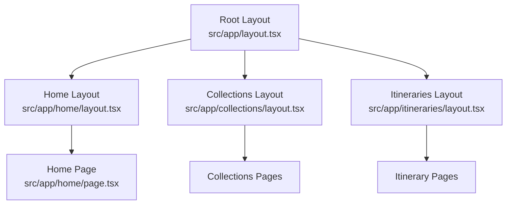
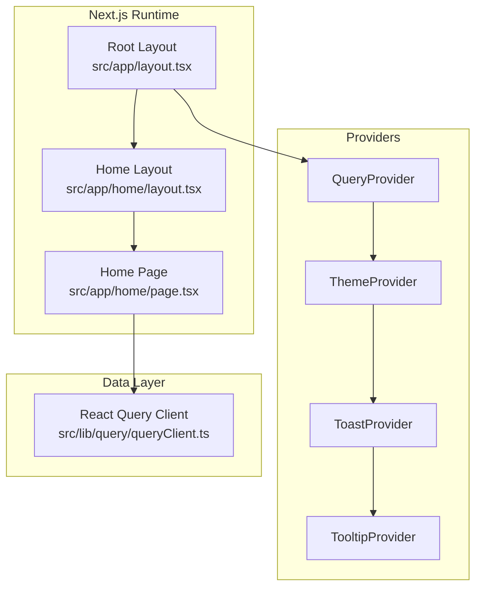
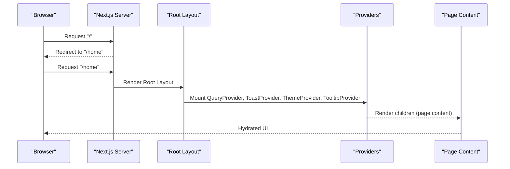
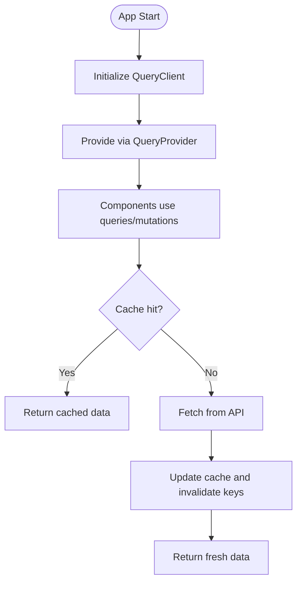
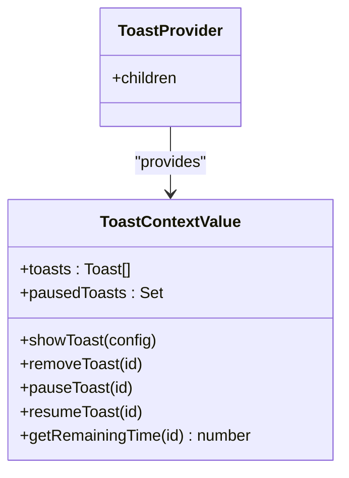
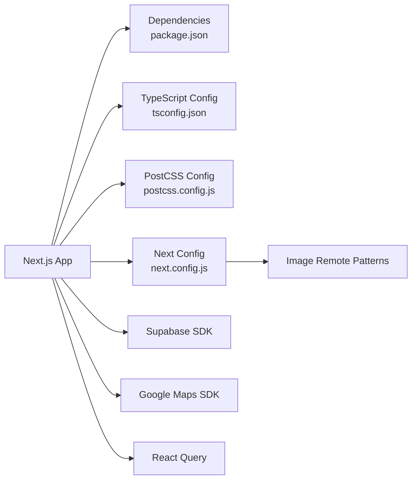

# System Design

<cite>
**Referenced Files in This Document**
- [package.json](file://package.json)
- [next.config.js](file://next.config.js)
- [tsconfig.json](file://tsconfig.json)
- [postcss.config.js](file://postcss.config.js)
- [src/app/layout.tsx](file://src/app/layout.tsx)
- [src/app/page.tsx](file://src/app/page.tsx)
- [src/app/home/layout.tsx](file://src/app/home/layout.tsx)
- [src/app/collections/layout.tsx](file://src/app/collections/layout.tsx)
- [src/app/itineraries/layout.tsx](file://src/app/itineraries/layout.tsx)
- [src/components/QueryProvider.tsx](file://src/components/QueryProvider.tsx)
- [src/components/ThemeProvider.tsx](file://src/components/ThemeProvider.tsx)
- [src/contexts/ToastContext.tsx](file://src/contexts/ToastContext.tsx)
- [src/lib/query/queryClient.ts](file://src/lib/query/queryClient.ts)
- [src/lib/site.ts](file://src/lib/site.ts)
</cite>

## Table of Contents
1. Introduction
2. Project Structure
3. Core Components
4. Architecture Overview
5. Detailed Component Analysis
6. Dependency Analysis
7. Performance Considerations
8. Troubleshooting Guide
9. Conclusion

## Introduction
This document describes the system design of the Argo platform, a Next.js-based itinerary planner application. It covers the App Router structure, server-side and client-side rendering strategies, application bootstrap, root layout composition with provider hierarchy, build configuration, TypeScript setup, development environment architecture, system boundaries, external service dependencies, deployment topology, scalability considerations, performance optimizations, and security architecture.

## Project Structure
Argo uses the Next.js App Router with feature-oriented directories under src/app (home, collections, itineraries, links). Each route group defines its own layout to wrap content in a shared MainLayout shell. The root layout composes global providers for data fetching, theming, notifications, and UI primitives.

**Diagram sources**
- [src/app/layout.tsx:57-80](file://src/app/layout.tsx#L57-L80)
- [src/app/home/layout.tsx:5-10](file://src/app/home/layout.tsx#L5-L10)
- [src/app/collections/layout.tsx:5-10](file://src/app/collections/layout.tsx#L5-L10)
- [src/app/itineraries/layout.tsx:5-10](file://src/app/itineraries/layout.tsx#L5-L10)

**Section sources**
- [src/app/layout.tsx:57-80](file://src/app/layout.tsx#L57-L80)
- [src/app/home/layout.tsx:5-10](file://src/app/home/layout.tsx#L5-L10)
- [src/app/collections/layout.tsx:5-10](file://src/app/collections/layout.tsx#L5-L10)
- [src/app/itineraries/layout.tsx:5-10](file://src/app/itineraries/layout.tsx#L5-L10)

## Core Components
- Root layout and metadata: Defines site metadata, viewport, fonts, and wraps the app in global providers.
- Provider hierarchy: QueryProvider (React Query), ToastProvider (user feedback), ThemeProvider (theme context), TooltipProvider (UI tooltips).
- Data layer: React Query client configured with caching, retry, and stale times.
- Routing: Root page redirects to /home; feature layouts wrap pages in MainLayout.

Key responsibilities:
- Global state and services are provided at the root level to ensure consistent behavior across routes.
- Client-only features (e.g., maps) are dynamically imported to avoid SSR overhead.

**Section sources**
- [src/app/layout.tsx:1-85](file://src/app/layout.tsx#L1-L85)
- [src/components/QueryProvider.tsx:1-14](file://src/components/QueryProvider.tsx#L1-L14)
- [src/components/ThemeProvider.tsx:1-17](file://src/components/ThemeProvider.tsx#L1-L17)
- [src/contexts/ToastContext.tsx:1-155](file://src/contexts/ToastContext.tsx#L1-L155)
- [src/lib/query/queryClient.ts:1-13](file://src/lib/query/queryClient.ts#L1-L13)
- [src/app/page.tsx:1-6](file://src/app/page.tsx#L1-L6)

## Architecture Overview
The application follows a layered architecture:
- Presentation: Next.js App Router pages and components.
- State and Services: React Query for data fetching and caching; custom contexts for UI state (toasts, theme).
- External integrations: Supabase (via SDK), Google Maps, analytics/tracking hooks, and job queues for async processing.

Rendering strategy:
- Server-rendered HTML for SEO-critical pages via Next.js App Router.
- Client-side interactivity through "use client" components and dynamic imports for heavy or browser-only features (e.g., maps).

Bootstrap process:
- Root layout renders metadata and providers.
- Feature layouts apply MainLayout shell.
- Pages hydrate client-side logic and connect to data services.

**Diagram sources**
- [src/app/layout.tsx:57-80](file://src/app/layout.tsx#L57-L80)
- [src/app/home/layout.tsx:5-10](file://src/app/home/layout.tsx#L5-L10)
- [src/components/QueryProvider.tsx:1-14](file://src/components/QueryProvider.tsx#L1-L14)
- [src/components/ThemeProvider.tsx:1-17](file://src/components/ThemeProvider.tsx#L1-L17)
- [src/contexts/ToastContext.tsx:1-155](file://src/contexts/ToastContext.tsx#L1-L155)
- [src/lib/query/queryClient.ts:1-13](file://src/lib/query/queryClient.ts#L1-L13)

## Detailed Component Analysis

### Root Layout Composition and Bootstrap
- Metadata and SEO: Title templates, description, Open Graph, Twitter card, robots settings.
- Providers order: QueryProvider wraps all data interactions; ToastProvider provides user feedback; ThemeProvider sets theme context; TooltipProvider enables tooltips.
- Font preconnect and stylesheet injection for performance.
- Viewport configuration for mobile safe areas.

**Diagram sources**
- [src/app/page.tsx:1-6](file://src/app/page.tsx#L1-L6)
- [src/app/layout.tsx:19-80](file://src/app/layout.tsx#L19-L80)

**Section sources**
- [src/app/layout.tsx:1-85](file://src/app/layout.tsx#L1-L85)
- [src/app/page.tsx:1-6](file://src/app/page.tsx#L1-L6)

### Data Fetching and Caching (React Query)
- Centralized QueryClient configuration with default options for stale time, garbage collection, retries, and focus refetch behavior.
- QueryProvider injects the client into the component tree.

**Diagram sources**
- [src/lib/query/queryClient.ts:1-13](file://src/lib/query/queryClient.ts#L1-L13)
- [src/components/QueryProvider.tsx:1-14](file://src/components/QueryProvider.tsx#L1-L14)

**Section sources**
- [src/lib/query/queryClient.ts:1-13](file://src/lib/query/queryClient.ts#L1-L13)
- [src/components/QueryProvider.tsx:1-14](file://src/components/QueryProvider.tsx#L1-L14)

### Notifications (Toast System)
- Context-driven toast management with lifecycle control (show, pause, resume, remove).
- Default duration and per-toast overrides; timers managed via refs to avoid memory leaks.

**Diagram sources**
- [src/contexts/ToastContext.tsx:12-36](file://src/contexts/ToastContext.tsx#L12-L36)
- [src/contexts/ToastContext.tsx:42-148](file://src/contexts/ToastContext.tsx#L42-L148)

**Section sources**
- [src/contexts/ToastContext.tsx:1-155](file://src/contexts/ToastContext.tsx#L1-L155)

### Theming
- ThemeProvider wraps the app with next-themes, using class attribute toggling and forced light theme for consistency during development.

**Section sources**
- [src/components/ThemeProvider.tsx:1-17](file://src/components/ThemeProvider.tsx#L1-L17)

### Routing and Layouts
- Root redirect to /home ensures a consistent entry point.
- Feature layouts apply MainLayout shell for consistent chrome across sections.

**Section sources**
- [src/app/page.tsx:1-6](file://src/app/page.tsx#L1-L6)
- [src/app/home/layout.tsx:1-12](file://src/app/home/layout.tsx#L1-L12)
- [src/app/collections/layout.tsx:1-12](file://src/app/collections/layout.tsx#L1-L12)
- [src/app/itineraries/layout.tsx:1-12](file://src/app/itineraries/layout.tsx#L1-L12)

## Dependency Analysis
External dependencies and integration points:
- Next.js App Router and runtime.
- React Query for data fetching and caching.
- Supabase SDK for authentication and database operations.
- Google Maps integration via @vis.gl/react-google-maps.
- UI libraries: Base UI, dnd-kit, motion, Tailwind CSS.

Build and tooling:
- Next.js scripts for dev, build, start, lint, type-check.
- TypeScript strict mode with path aliases.
- PostCSS with Tailwind v4 plugin.
- Image optimization with remote patterns for Unsplash, UI avatars, and Supabase storage.

**Diagram sources**
- [package.json:1-45](file://package.json#L1-L45)
- [next.config.js:1-18](file://next.config.js#L1-L18)
- [tsconfig.json:1-29](file://tsconfig.json#L1-L29)
- [postcss.config.js:1-6](file://postcss.config.js#L1-L6)

**Section sources**
- [package.json:1-45](file://package.json#L1-L45)
- [next.config.js:1-18](file://next.config.js#L1-L18)
- [tsconfig.json:1-29](file://tsconfig.json#L1-L29)
- [postcss.config.js:1-6](file://postcss.config.js#L1-L6)

## Performance Considerations
- Dynamic imports for heavy components (e.g., maps) to reduce initial bundle size and avoid SSR overhead.
- React Query caching with tuned staleTime and gcTime to minimize network requests and improve perceived performance.
- Optimized package imports for specific libraries via Next config experimental flag.
- Image optimization with remotePatterns to allow efficient loading from trusted CDNs and storage.
- Reduced motion support via motion/react hooks for accessibility and performance on low-power devices.

[No sources needed since this section provides general guidance]

## Troubleshooting Guide
Common issues and mitigations:
- Toast not appearing: Ensure ToastProvider is mounted in the root layout and that showToast is called within a client component.
- Query not updating: Verify query key invalidation after mutations and check staleTime/gcTime settings.
- Map not rendering: Confirm dynamic import with ssr:false and that the component runs only on the client.
- Theme mismatch: Check forcedTheme setting and ensure theme classes are applied consistently.

**Section sources**
- [src/contexts/ToastContext.tsx:42-148](file://src/contexts/ToastContext.tsx#L42-L148)
- [src/lib/query/queryClient.ts:1-13](file://src/lib/query/queryClient.ts#L1-L13)
- [src/components/ThemeProvider.tsx:1-17](file://src/components/ThemeProvider.tsx#L1-L17)

## Conclusion
Argo’s system design leverages Next.js App Router for structured routing and SSR, React Query for robust data management, and a clear provider hierarchy to encapsulate cross-cutting concerns. The modular layout approach and dynamic imports support scalability and performance. External integrations are cleanly bounded behind SDKs and configuration, enabling maintainable growth and reliable operation in production environments.