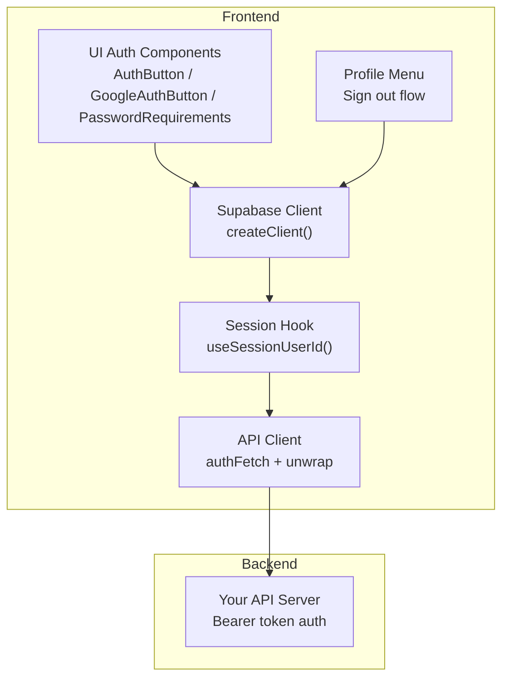
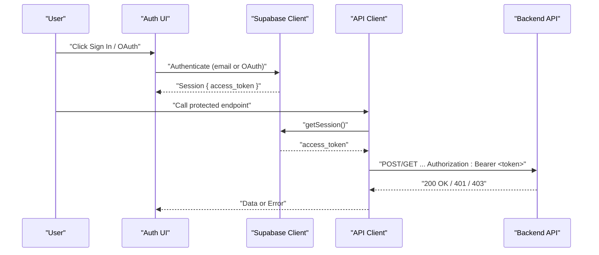
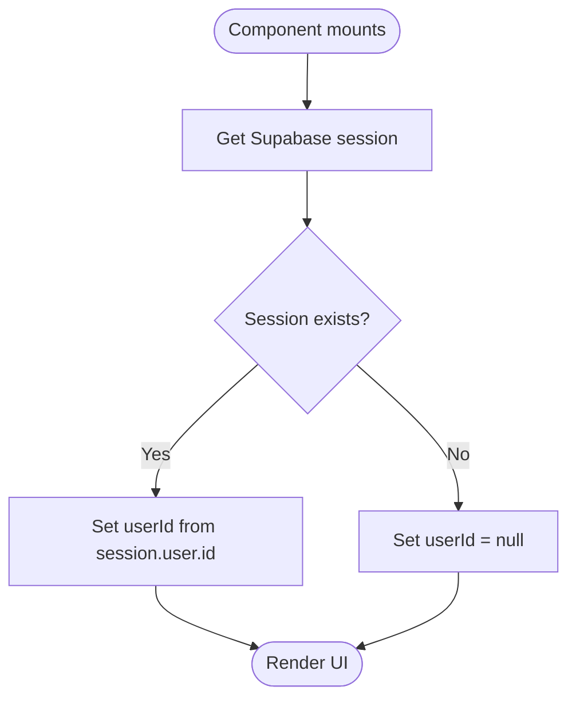
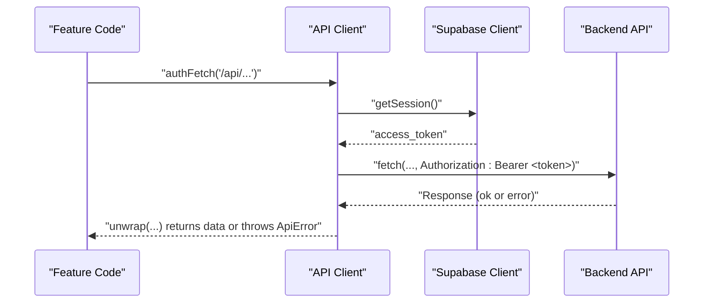
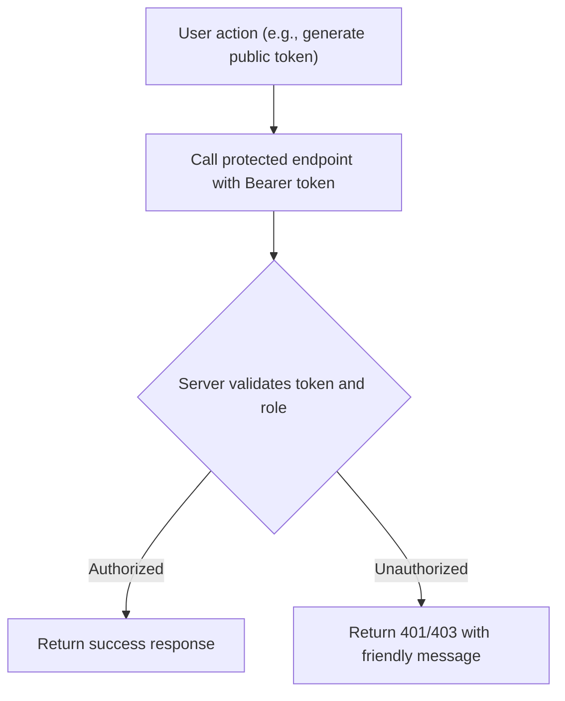
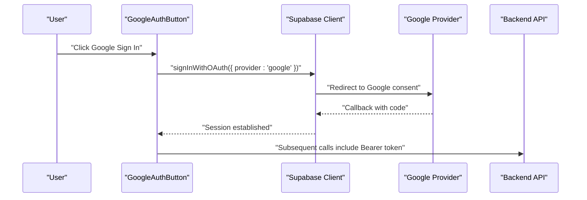
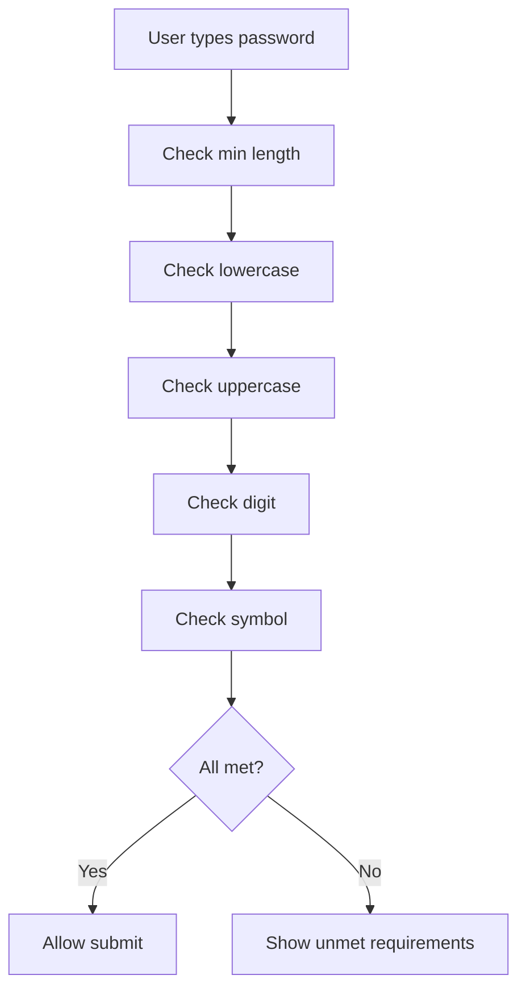
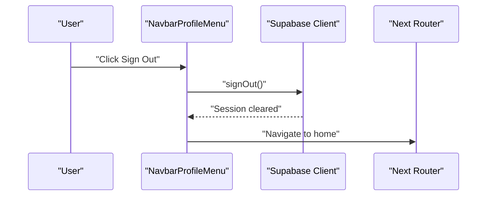
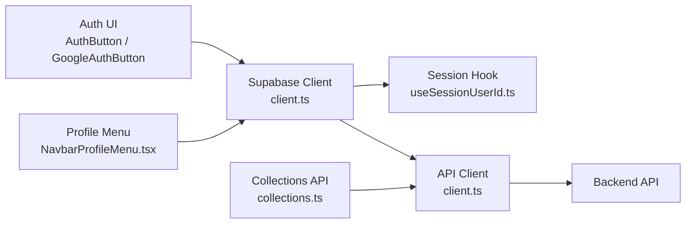

# Authentication & Security

<cite>
**Referenced Files in This Document**
- [client.ts](file://src/lib/supabase/client.ts)
- [useSessionUserId.ts](file://src/hooks/useSessionUserId.ts)
- [NavbarProfileMenu.tsx](file://src/components/ui/navbar/NavbarProfileMenu.tsx)
- [client.ts](file://src/lib/api/client.ts)
- [collections.ts](file://src/lib/api/collections.ts)
- [password-policy.ts](file://src/lib/auth/password-policy.ts)
- [PasswordRequirements.tsx](file://src/components/ui/auth/PasswordRequirements.tsx)
- [AuthButton.tsx](file://src/components/ui/auth/AuthButton.tsx)
- [GoogleAuthButton.tsx](file://src/components/ui/auth/GoogleAuthButton.tsx)
- [userMessages.ts](file://src/lib/errors/userMessages.ts)
</cite>

## Table of Contents
1. Introduction
2. Project Structure
3. Core Components
4. Architecture Overview
5. Detailed Component Analysis
6. Dependency Analysis
7. Performance Considerations
8. Troubleshooting Guide
9. Conclusion

## Introduction
This document explains the authentication and security implementation in the project, focusing on Supabase-based authentication, session handling, role-based access control via API tokens, OAuth flows, password policies, protected routes, and security best practices. It also covers input validation and protection against common vulnerabilities with concrete references to the codebase.

## Project Structure
Authentication spans several layers:
- Client initialization for Supabase
- Session retrieval and user identity hooks
- UI components for sign-in/sign-out and OAuth
- API client that attaches bearer tokens and enforces authenticated calls
- Password policy enforcement and friendly error messaging

**Diagram sources**
- [client.ts:1-8](file://src/lib/supabase/client.ts#L1-L8)
- [useSessionUserId.ts:1-19](file://src/hooks/useSessionUserId.ts#L1-L19)
- [AuthButton.tsx:1-40](file://src/components/ui/auth/AuthButton.tsx#L1-L40)
- [GoogleAuthButton.tsx:1-60](file://src/components/ui/auth/GoogleAuthButton.tsx#L1-L60)
- [PasswordRequirements.tsx:1-58](file://src/components/ui/auth/PasswordRequirements.tsx#L1-L58)
- [NavbarProfileMenu.tsx:1-70](file://src/components/ui/navbar/NavbarProfileMenu.tsx#L1-L70)
- [client.ts:48-107](file://src/lib/api/client.ts#L48-L107)

**Section sources**
- [client.ts:1-8](file://src/lib/supabase/client.ts#L1-L8)
- [useSessionUserId.ts:1-19](file://src/hooks/useSessionUserId.ts#L1-L19)
- [client.ts:48-107](file://src/lib/api/client.ts#L48-L107)

## Core Components
- Supabase client creation for browser sessions
- Session-aware hook to resolve current user id
- API client that injects Authorization headers and centralizes error unwrapping
- Password policy enforcement and live feedback
- Sign-out flow from profile menu
- OAuth button component (Google) ready for provider integration

Key responsibilities:
- Keep Supabase configuration centralized
- Ensure all API calls are authenticated when required
- Provide consistent UX for auth states and errors
- Enforce password requirements consistently across forms

**Section sources**
- [client.ts:1-8](file://src/lib/supabase/client.ts#L1-L8)
- [useSessionUserId.ts:1-19](file://src/hooks/useSessionUserId.ts#L1-L19)
- [client.ts:48-107](file://src/lib/api/client.ts#L48-L107)
- [password-policy.ts:1-40](file://src/lib/auth/password-policy.ts#L1-L40)
- [PasswordRequirements.tsx:1-58](file://src/components/ui/auth/PasswordRequirements.tsx#L1-L58)
- [NavbarProfileMenu.tsx:21-28](file://src/components/ui/navbar/NavbarProfileMenu.tsx#L21-L28)
- [GoogleAuthButton.tsx:1-60](file://src/components/ui/auth/GoogleAuthButton.tsx#L1-L60)

## Architecture Overview
The application uses Supabase for authentication and stores a session with an access token. The API client retrieves this token and attaches it as a Bearer Authorization header to every protected request. The server validates the token and enforces authorization rules.

**Diagram sources**
- [client.ts:1-8](file://src/lib/supabase/client.ts#L1-L8)
- [client.ts:48-107](file://src/lib/api/client.ts#L48-L107)

## Detailed Component Analysis

### Supabase Client and Session Management
- Centralized client factory creates a browser client using environment variables.
- A React hook reads the current session and exposes the user id to components.
- Profile menu triggers sign-out by calling Supabase’s sign-out method and navigating away.

**Diagram sources**
- [useSessionUserId.ts:1-19](file://src/hooks/useSessionUserId.ts#L1-L19)
- [client.ts:1-8](file://src/lib/supabase/client.ts#L1-L8)

**Section sources**
- [client.ts:1-8](file://src/lib/supabase/client.ts#L1-L8)
- [useSessionUserId.ts:1-19](file://src/hooks/useSessionUserId.ts#L1-L19)
- [NavbarProfileMenu.tsx:21-28](file://src/components/ui/navbar/NavbarProfileMenu.tsx#L21-L28)

### API Authentication and Protected Routes
- All protected endpoints are called through a shared API client that:
  - Retrieves the Supabase access token
  - Attaches Authorization: Bearer <token>
  - Throws typed errors with HTTP status codes
  - Provides helpers to unwrap responses safely
- Feature modules call these helpers to perform operations like generating public tokens, listing collaborators, and deleting resources.

**Diagram sources**
- [client.ts:48-107](file://src/lib/api/client.ts#L48-L107)
- [collections.ts:127-157](file://src/lib/api/collections.ts#L127-L157)

**Section sources**
- [client.ts:48-107](file://src/lib/api/client.ts#L48-L107)
- [collections.ts:127-157](file://src/lib/api/collections.ts#L127-L157)

### Role-Based Access Control and Permissions
- RBAC is enforced server-side based on the validated JWT.
- Front-end actions that require permissions call endpoints such as:
  - Generate/revoke public tokens
  - Generate/revoke invite tokens
  - List/remove collaborators
- Errors like “Access denied” or “Only the owner can...” indicate server-side permission checks.

**Diagram sources**
- [collections.ts:127-157](file://src/lib/api/collections.ts#L127-L157)
- [userMessages.ts:49-107](file://src/lib/errors/userMessages.ts#L49-L107)

**Section sources**
- [collections.ts:127-157](file://src/lib/api/collections.ts#L127-L157)
- [userMessages.ts:49-107](file://src/lib/errors/userMessages.ts#L49-L107)

### OAuth Flows
- An OAuth button component is provided for Google sign-in. Integration typically involves:
  - Configuring Google provider in Supabase
  - Triggering provider sign-in from the button
  - Handling redirect back to the app where Supabase sets the session
- The UI supports loading states and accessibility attributes.

**Diagram sources**
- [GoogleAuthButton.tsx:1-60](file://src/components/ui/auth/GoogleAuthButton.tsx#L1-L60)
- [client.ts:1-8](file://src/lib/supabase/client.ts#L1-L8)

**Section sources**
- [GoogleAuthButton.tsx:1-60](file://src/components/ui/auth/GoogleAuthButton.tsx#L1-L60)
- [client.ts:1-8](file://src/lib/supabase/client.ts#L1-L8)

### Password Policies and Input Validation
- Client-side password policy mirrors server policy to provide immediate feedback.
- Requirements include minimum length, lowercase, uppercase, digit, and symbol checks.
- A live checklist updates as users type, improving usability without compromising security.
- Note: Server-side policy remains the source of truth; client checks are a second line of defense.

**Diagram sources**
- [password-policy.ts:1-40](file://src/lib/auth/password-policy.ts#L1-L40)
- [PasswordRequirements.tsx:1-58](file://src/components/ui/auth/PasswordRequirements.tsx#L1-L58)

**Section sources**
- [password-policy.ts:1-40](file://src/lib/auth/password-policy.ts#L1-L40)
- [PasswordRequirements.tsx:1-58](file://src/components/ui/auth/PasswordRequirements.tsx#L1-L58)

### Sign-Out Flow
- Profile menu provides a sign-out action that clears the Supabase session and navigates to a safe route.

**Diagram sources**
- [NavbarProfileMenu.tsx:21-28](file://src/components/ui/navbar/NavbarProfileMenu.tsx#L21-L28)

**Section sources**
- [NavbarProfileMenu.tsx:21-28](file://src/components/ui/navbar/NavbarProfileMenu.tsx#L21-L28)

### Protected Routes and Guards
- While page-level guards are not shown here, the pattern is to:
  - Use the session hook to determine if a user is authenticated
  - Redirect unauthenticated users to sign-in before rendering protected content
  - Gate feature toggles and sensitive UI behind authentication state
- For server-side protection, rely on the API client to attach tokens and handle 401/403 responses centrally.

[No sources needed since this section describes general patterns without analyzing specific files]

## Dependency Analysis

**Diagram sources**
- [client.ts:1-8](file://src/lib/supabase/client.ts#L1-L8)
- [useSessionUserId.ts:1-19](file://src/hooks/useSessionUserId.ts#L1-L19)
- [client.ts:48-107](file://src/lib/api/client.ts#L48-L107)
- [collections.ts:127-157](file://src/lib/api/collections.ts#L127-L157)
- [NavbarProfileMenu.tsx:21-28](file://src/components/ui/navbar/NavbarProfileMenu.tsx#L21-L28)
- [AuthButton.tsx:1-40](file://src/components/ui/auth/AuthButton.tsx#L1-L40)
- [GoogleAuthButton.tsx:1-60](file://src/components/ui/auth/GoogleAuthButton.tsx#L1-L60)

**Section sources**
- [client.ts:1-8](file://src/lib/supabase/client.ts#L1-L8)
- [client.ts:48-107](file://src/lib/api/client.ts#L48-L107)
- [useSessionUserId.ts:1-19](file://src/hooks/useSessionUserId.ts#L1-L19)
- [collections.ts:127-157](file://src/lib/api/collections.ts#L127-L157)
- [NavbarProfileMenu.tsx:21-28](file://src/components/ui/navbar/NavbarProfileMenu.tsx#L21-L28)
- [AuthButton.tsx:1-40](file://src/components/ui/auth/AuthButton.tsx#L1-L40)
- [GoogleAuthButton.tsx:1-60](file://src/components/ui/auth/GoogleAuthButton.tsx#L1-L60)

## Performance Considerations
- Minimize repeated session reads by caching user id at the component level or using a higher-order context if needed.
- Batch API requests where possible to reduce network overhead.
- Debounce heavy operations triggered by auth state changes (e.g., re-fetching data after sign-in).
- Avoid unnecessary re-renders by memoizing derived values around auth state.

[No sources needed since this section provides general guidance]

## Troubleshooting Guide
Common issues and how to address them:
- Not authenticated errors: Occur when no session is present; ensure sign-in completed and session is active before calling protected APIs.
- Rate limiting: Temporary throttling; prompt users to retry after a delay.
- Invalid credentials or email confirmation: Present friendly messages and guide users to confirm email or correct credentials.
- Network failures: Inform users to check connectivity and retry.

Use the centralized error utilities to map technical errors to user-friendly messages.

**Section sources**
- [client.ts:48-107](file://src/lib/api/client.ts#L48-L107)
- [userMessages.ts:1-47](file://src/lib/errors/userMessages.ts#L1-L47)
- [userMessages.ts:49-107](file://src/lib/errors/userMessages.ts#L49-L107)

## Conclusion
The project implements a robust, layered approach to authentication and security:
- Supabase manages identity and sessions
- The API client ensures all protected calls carry valid tokens
- Server-side RBAC enforces permissions
- Client-side password policies improve UX while relying on server validation
- Friendly error handling improves resilience and clarity

Adopting the patterns described here will help maintain secure, user-friendly authentication flows as the application grows.

[No sources needed since this section summarizes without analyzing specific files]