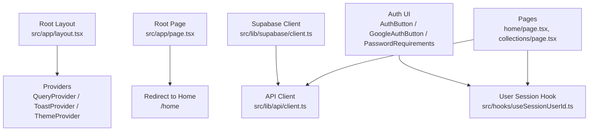
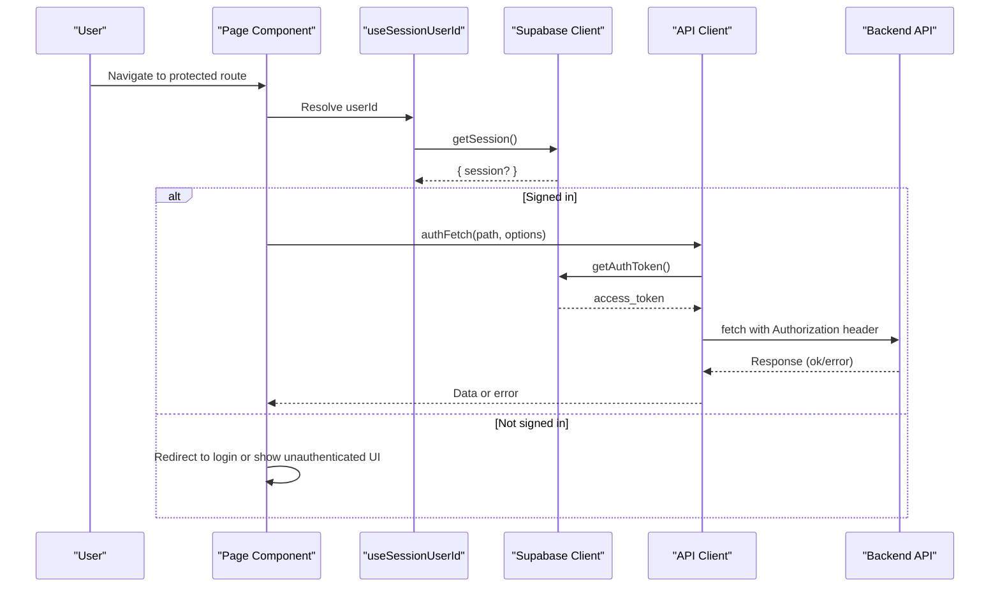
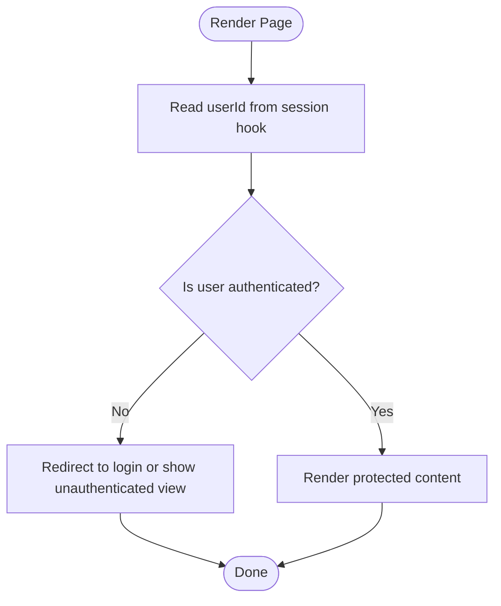
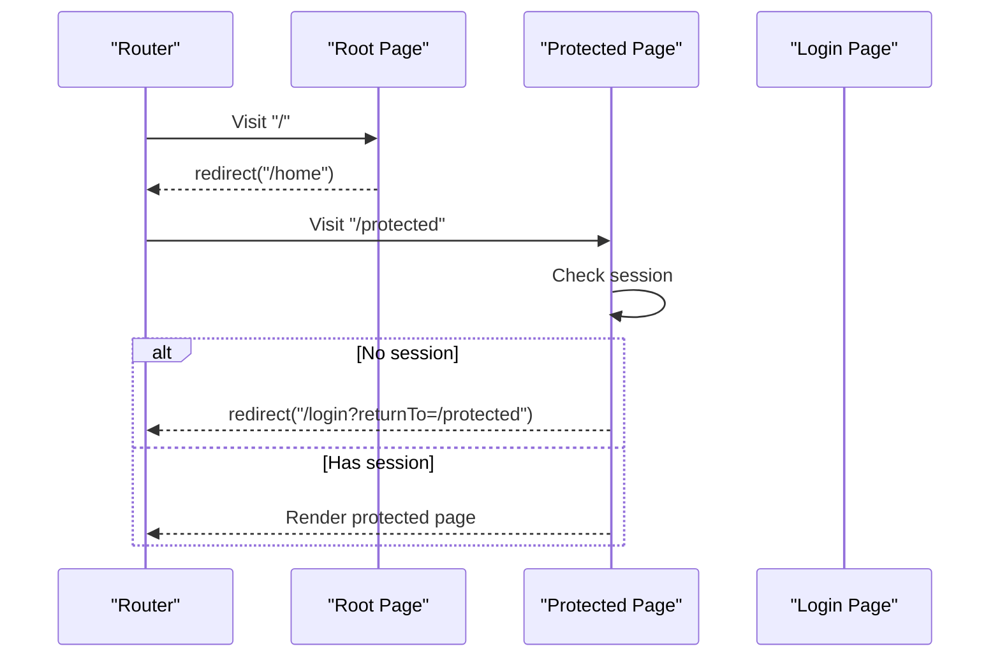
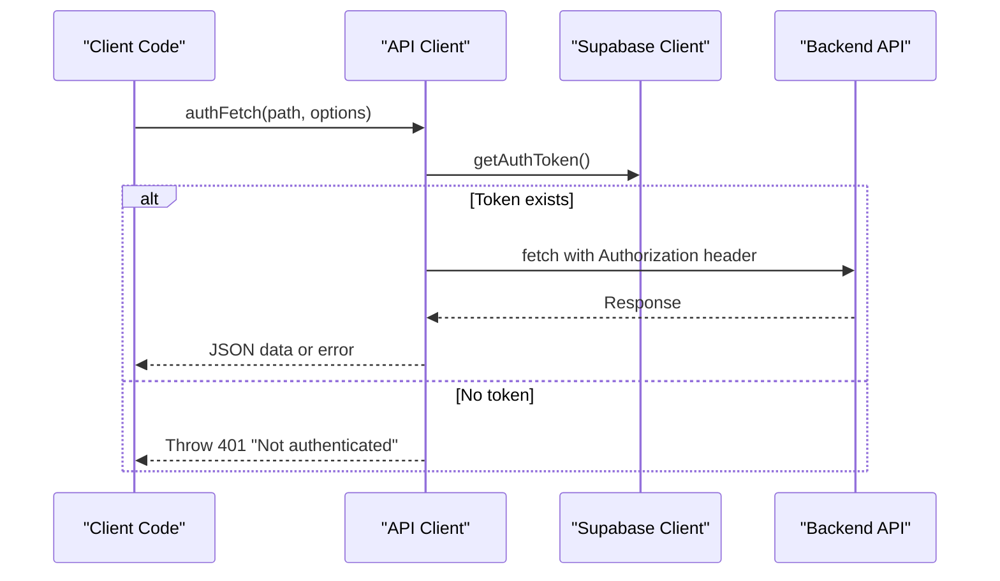
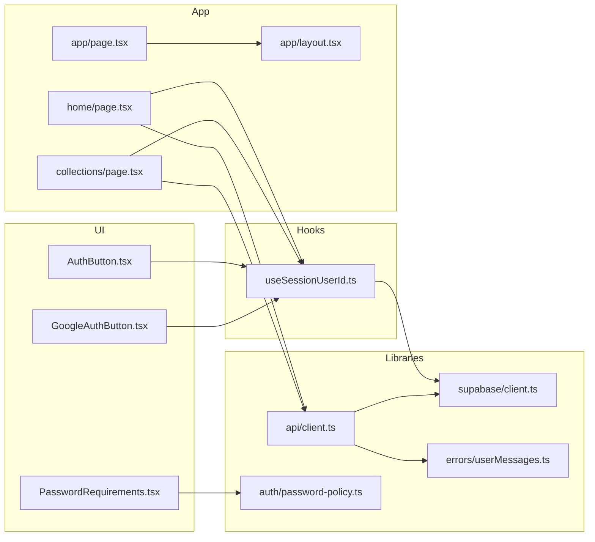

# Authentication Guards & Protected Routes

<cite>
**Referenced Files in This Document**
- [layout.tsx](file://src/app/layout.tsx)
- [page.tsx](file://src/app/page.tsx)
- [client.ts](file://src/lib/supabase/client.ts)
- [client.ts](file://src/lib/api/client.ts)
- [userMessages.ts](file://src/lib/errors/userMessages.ts)
- [useSessionUserId.ts](file://src/hooks/useSessionUserId.ts)
- [AuthButton.tsx](file://src/components/ui/auth/AuthButton.tsx)
- [GoogleAuthButton.tsx](file://src/components/ui/auth/GoogleAuthButton.tsx)
- [PasswordRequirements.tsx](file://src/components/ui/auth/PasswordRequirements.tsx)
- [password-policy.ts](file://src/lib/auth/password-policy.ts)
- [home/page.tsx](file://src/app/home/page.tsx)
- [collections/page.tsx](file://src/app/collections/page.tsx)
</cite>

## Table of Contents
1. [Introduction](#introduction)
2. [Project Structure](#project-structure)
3. [Core Components](#core-components)
4. [Architecture Overview](#architecture-overview)
5. [Detailed Component Analysis](#detailed-component-analysis)
6. [Dependency Analysis](#dependency-analysis)
7. [Performance Considerations](#performance-considerations)
8. [Troubleshooting Guide](#troubleshooting-guide)
9. [Conclusion](#conclusion)

## Introduction
This document explains how to implement authentication guards and protected routes in this Next.js App Router project. It covers middleware-based route protection, conditional rendering based on authentication status, role-based access control patterns, navigation guards, protected page components, secure API endpoint access, login redirects, handling unauthorized access, and reusable authentication wrappers. It also provides guidance for server-side checks and client-side protection strategies.

## Project Structure
The application uses the Next.js App Router with a root layout that wraps providers (query, toast, theme). Authentication is provided by Supabase via a browser client. Pages consume an auth hook to resolve the current user id and use a centralized API client to attach tokens to requests. The root page redirects to the home dashboard.

**Diagram sources**
- [layout.tsx:57-80](file://src/app/layout.tsx#L57-L80)
- [page.tsx:1-5](file://src/app/page.tsx#L1-L5)
- [client.ts:1-9](file://src/lib/supabase/client.ts#L1-L9)
- [client.ts:59-94](file://src/lib/api/client.ts#L59-L94)
- [useSessionUserId.ts:1-19](file://src/hooks/useSessionUserId.ts#L1-L19)
- [AuthButton.tsx:1-40](file://src/components/ui/auth/AuthButton.tsx#L1-L40)
- [GoogleAuthButton.tsx:1-61](file://src/components/ui/auth/GoogleAuthButton.tsx#L1-L61)
- [PasswordRequirements.tsx:1-59](file://src/components/ui/auth/PasswordRequirements.tsx#L1-L59)

**Section sources**
- [layout.tsx:57-80](file://src/app/layout.tsx#L57-L80)
- [page.tsx:1-5](file://src/app/page.tsx#L1-L5)
- [client.ts:1-9](file://src/lib/supabase/client.ts#L1-L9)
- [client.ts:59-94](file://src/lib/api/client.ts#L59-L94)
- [useSessionUserId.ts:1-19](file://src/hooks/useSessionUserId.ts#L1-L19)

## Core Components
- Supabase browser client: Creates a browser client using environment variables for URL and anon key.
- Authenticated API client: Centralizes token retrieval and injection into fetch calls; throws a 401 when no session exists; centralizes response unwrapping.
- User session hook: Resolves the current user id from the Supabase session once loaded.
- Auth UI primitives: Buttons and input helpers for sign-in flows and password validation feedback.
- Password policy: Client-side mirror of server password rules used to validate inputs before submission.

These building blocks enable both client-side guards (rendering and navigation) and server-side protections (via API responses and future middleware).

**Section sources**
- [client.ts:1-9](file://src/lib/supabase/client.ts#L1-L9)
- [client.ts:59-94](file://src/lib/api/client.ts#L59-L94)
- [useSessionUserId.ts:1-19](file://src/hooks/useSessionUserId.ts#L1-L19)
- [AuthButton.tsx:1-40](file://src/components/ui/auth/AuthButton.tsx#L1-L40)
- [GoogleAuthButton.tsx:1-61](file://src/components/ui/auth/GoogleAuthButton.tsx#L1-L61)
- [PasswordRequirements.tsx:1-59](file://src/components/ui/auth/PasswordRequirements.tsx#L1-L59)
- [password-policy.ts:1-41](file://src/lib/auth/password-policy.ts#L1-L41)

## Architecture Overview
The authentication flow combines client-side state and server-enforced security:
- Client-side: Pages read the current user id via a hook and conditionally render or navigate.
- API layer: All authenticated requests go through a wrapper that attaches the bearer token and enforces 401 on missing sessions.
- Error messaging: Friendly messages are mapped from Supabase errors for better UX.

**Diagram sources**
- [useSessionUserId.ts:1-19](file://src/hooks/useSessionUserId.ts#L1-L19)
- [client.ts:1-9](file://src/lib/supabase/client.ts#L1-L9)
- [client.ts:59-94](file://src/lib/api/client.ts#L59-L94)

## Detailed Component Analysis

### Client-Side Route Protection with Conditional Rendering
- Use the session user id hook to determine if a user is logged in.
- In pages, conditionally render content or redirect to a public/login route when not authenticated.
- Example pattern: If userId is null, show a loading indicator or redirect; otherwise render protected UI.

**Section sources**
- [useSessionUserId.ts:1-19](file://src/hooks/useSessionUserId.ts#L1-L19)
- [home/page.tsx:123-170](file://src/app/home/page.tsx#L123-L170)
- [collections/page.tsx:24-30](file://src/app/collections/page.tsx#L24-L30)

### Navigation Guards and Login Redirects
- Root page redirects to the home dashboard.
- For protected routes, add a guard that checks the session and redirects to login if needed.
- After successful sign-in, redirect back to the intended destination.

**Section sources**
- [page.tsx:1-5](file://src/app/page.tsx#L1-L5)

### Secure API Endpoint Access
- All authenticated requests should go through the API client wrapper that:
  - Retrieves the token from the Supabase session.
  - Attaches the Authorization header.
  - Throws a 401 error when no token is present.
  - Centralizes response unwrapping for consistent error handling.

**Diagram sources**
- [client.ts:59-94](file://src/lib/api/client.ts#L59-L94)
- [client.ts:1-9](file://src/lib/supabase/client.ts#L1-L9)

**Section sources**
- [client.ts:59-94](file://src/lib/api/client.ts#L59-L94)

### Role-Based Access Control Patterns
- Derive roles from the user profile or JWT claims where applicable.
- Create a small helper that checks required roles before rendering sensitive actions or calling privileged APIs.
- On the server side, enforce RBAC at the API boundary; on the client, hide/disable controls based on roles.

[No sources needed since this section describes general patterns without analyzing specific files]

### Reusable Authentication Wrappers
- Build a higher-order component or wrapper that:
  - Reads the session.
  - Renders a loading state while resolving.
  - Redirects or shows an unauthenticated screen when needed.
  - Passes down props to the wrapped component only after authorization passes.

[No sources needed since this section describes general patterns without analyzing specific files]

### Server-Side Authentication Checks
- Enforce authentication at the API layer using the presence of a valid token.
- Return appropriate HTTP status codes (e.g., 401 for missing token, 403 for insufficient permissions).
- Centralize error mapping to friendly messages for the client.

**Section sources**
- [client.ts:59-94](file://src/lib/api/client.ts#L59-L94)
- [userMessages.ts:1-47](file://src/lib/errors/userMessages.ts#L1-L47)

### Client-Side Route Protection Strategies
- Use the session hook to gate rendering and navigation.
- Combine with query hooks that depend on userId to avoid unnecessary requests when unauthenticated.
- Provide clear feedback during session resolution to prevent flicker.

**Section sources**
- [useSessionUserId.ts:1-19](file://src/hooks/useSessionUserId.ts#L1-L19)
- [home/page.tsx:123-170](file://src/app/home/page.tsx#L123-L170)
- [collections/page.tsx:24-30](file://src/app/collections/page.tsx#L24-L30)

## Dependency Analysis
The following diagram shows how authentication-related modules depend on each other across the app.

**Diagram sources**
- [AuthButton.tsx:1-40](file://src/components/ui/auth/AuthButton.tsx#L1-L40)
- [GoogleAuthButton.tsx:1-61](file://src/components/ui/auth/GoogleAuthButton.tsx#L1-L61)
- [PasswordRequirements.tsx:1-59](file://src/components/ui/auth/PasswordRequirements.tsx#L1-L59)
- [useSessionUserId.ts:1-19](file://src/hooks/useSessionUserId.ts#L1-L19)
- [client.ts:1-9](file://src/lib/supabase/client.ts#L1-L9)
- [client.ts:59-94](file://src/lib/api/client.ts#L59-L94)
- [userMessages.ts:1-47](file://src/lib/errors/userMessages.ts#L1-L47)
- [password-policy.ts:1-41](file://src/lib/auth/password-policy.ts#L1-L41)
- [home/page.tsx:123-170](file://src/app/home/page.tsx#L123-L170)
- [collections/page.tsx:24-30](file://src/app/collections/page.tsx#L24-L30)
- [page.tsx:1-5](file://src/app/page.tsx#L1-L5)
- [layout.tsx:57-80](file://src/app/layout.tsx#L57-L80)

**Section sources**
- [client.ts:59-94](file://src/lib/api/client.ts#L59-L94)
- [useSessionUserId.ts:1-19](file://src/hooks/useSessionUserId.ts#L1-L19)
- [home/page.tsx:123-170](file://src/app/home/page.tsx#L123-L170)
- [collections/page.tsx:24-30](file://src/app/collections/page.tsx#L24-L30)

## Performance Considerations
- Minimize re-renders by caching the resolved userId and avoiding frequent session polling.
- Defer heavy computations until after the session resolves.
- Use optimistic UI updates carefully around auth-gated operations to avoid showing private data prematurely.
- Ensure API calls are gated behind authentication to prevent unnecessary network traffic.

[No sources needed since this section provides general guidance]

## Troubleshooting Guide
Common issues and resolutions:
- Missing token on API calls: Ensure all requests go through the authenticated fetch wrapper; verify the session exists before calling.
- Unauthorized responses: Handle 401 by redirecting to login and clearing local state.
- Friendly error messages: Map backend or Supabase errors to user-friendly text to improve UX.
- Password validation mismatches: Keep client-side password policy aligned with server configuration to reduce rejected submissions.

**Section sources**
- [client.ts:59-94](file://src/lib/api/client.ts#L59-L94)
- [userMessages.ts:1-47](file://src/lib/errors/userMessages.ts#L1-L47)
- [password-policy.ts:1-41](file://src/lib/auth/password-policy.ts#L1-L41)

## Conclusion
This project’s authentication model relies on a Supabase browser client, a session-aware hook, and a centralized API client that enforces token attachment and 401 handling. Pages can implement guards by reading the session and conditionally rendering or navigating. For robust protection, combine client-side guards with server-side enforcement at the API layer, map errors to friendly messages, and keep client-side policies aligned with server rules.

[No sources needed since this section summarizes without analyzing specific files]