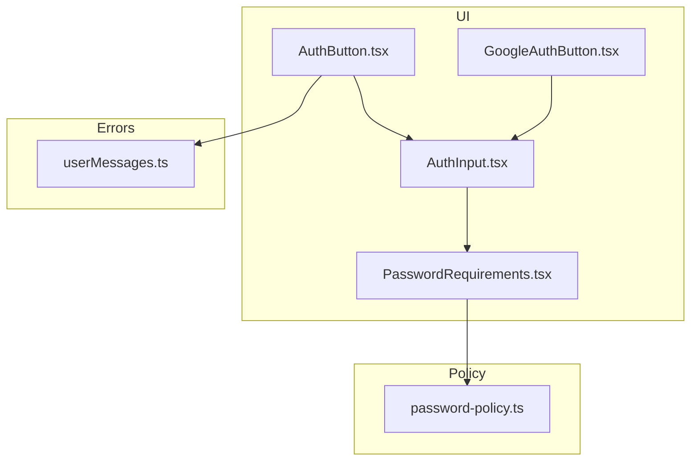
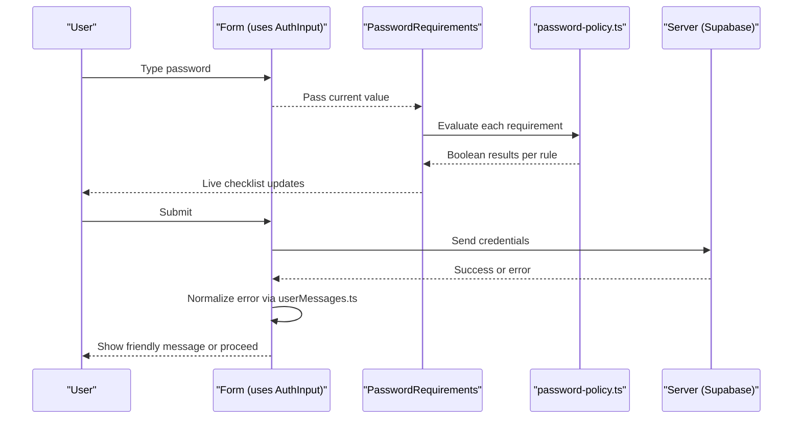
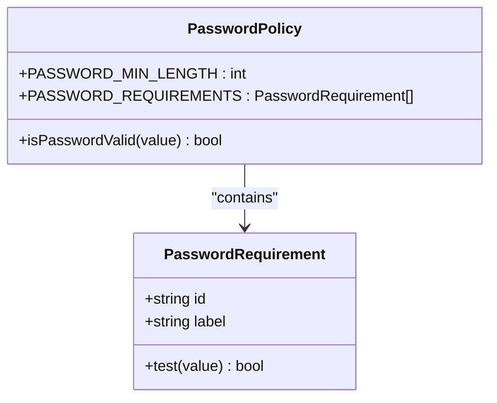
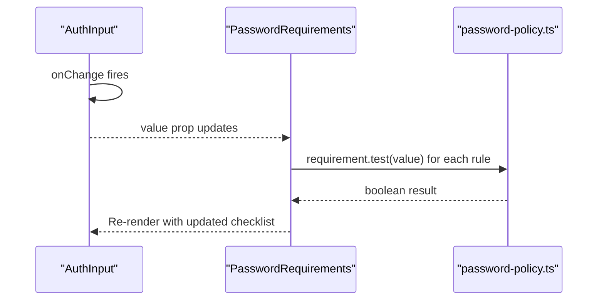
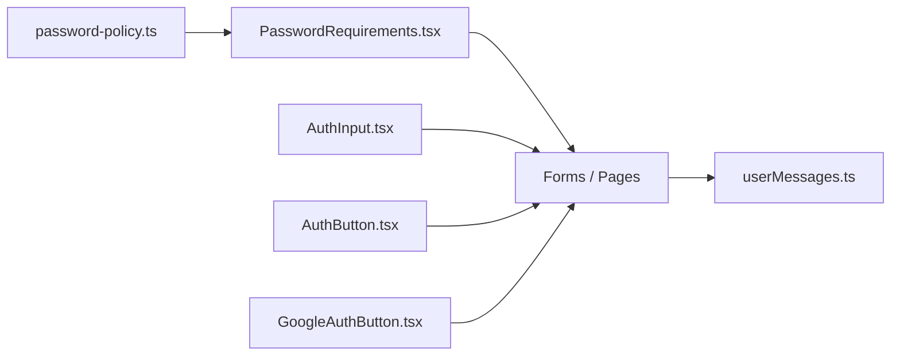

# Password Policy & Validation

<cite>
**Referenced Files in This Document**
- [password-policy.ts](file://src/lib/auth/password-policy.ts)
- [PasswordRequirements.tsx](file://src/components/ui/auth/PasswordRequirements.tsx)
- [AuthInput.tsx](file://src/components/ui/auth/AuthInput.tsx)
- [AuthButton.tsx](file://src/components/ui/auth/AuthButton.tsx)
- [GoogleAuthButton.tsx](file://src/components/ui/auth/GoogleAuthButton.tsx)
- [userMessages.ts](file://src/lib/errors/userMessages.ts)
</cite>

## Table of Contents
1. [Introduction](#introduction)
2. [Project Structure](#project-structure)
3. [Core Components](#core-components)
4. [Architecture Overview](#architecture-overview)
5. [Detailed Component Analysis](#detailed-component-analysis)
6. [Dependency Analysis](#dependency-analysis)
7. [Performance Considerations](#performance-considerations)
8. [Troubleshooting Guide](#troubleshooting-guide)
9. [Conclusion](#conclusion)
10. [Appendices](#appendices)

## Introduction
This document explains the password policy and validation system implemented in the project. It covers the requirements engine, real-time feedback, input components, and error messaging. It also provides guidance on customizing policies, integrating with forms, security best practices, client-side validation strategies, and accessibility considerations for password inputs.

## Project Structure
The password system is split into a policy module (rules and validators) and UI components that render live feedback and form controls:
- Policy rules and validator are centralized to ensure consistency across the app.
- A dedicated component renders a live checklist aligned with the policy.
- Auth-focused input and button primitives support building sign-up or password-change flows.

**Diagram sources**
- [password-policy.ts:1-41](file://src/lib/auth/password-policy.ts#L1-L41)
- [PasswordRequirements.tsx:1-59](file://src/components/ui/auth/PasswordRequirements.tsx#L1-L59)
- [AuthInput.tsx:1-201](file://src/components/ui/auth/AuthInput.tsx#L1-L201)
- [AuthButton.tsx:1-41](file://src/components/ui/auth/AuthButton.tsx#L1-L41)
- [GoogleAuthButton.tsx:1-61](file://src/components/ui/auth/GoogleAuthButton.tsx#L1-L61)
- [userMessages.ts:1-47](file://src/lib/errors/userMessages.ts#L1-L47)

**Section sources**
- [password-policy.ts:1-41](file://src/lib/auth/password-policy.ts#L1-L41)
- [PasswordRequirements.tsx:1-59](file://src/components/ui/auth/PasswordRequirements.tsx#L1-L59)
- [AuthInput.tsx:1-201](file://src/components/ui/auth/AuthInput.tsx#L1-L201)
- [AuthButton.tsx:1-41](file://src/components/ui/auth/AuthButton.tsx#L1-L41)
- [GoogleAuthButton.tsx:1-61](file://src/components/ui/auth/GoogleAuthButton.tsx#L1-L61)
- [userMessages.ts:1-47](file://src/lib/errors/userMessages.ts#L1-L47)

## Core Components
- Password policy module defines the canonical rules and a validator function.
- PasswordRequirements component renders a live checklist tied to the current input value.
- AuthInput provides an accessible, styled input suitable for passwords and other auth fields.
- AuthButton and GoogleAuthButton provide consistent submission UX with loading states.
- Error messages utility maps backend errors to user-friendly text.

Key responsibilities:
- Centralize policy so UI and server stay in sync.
- Provide immediate, accessible feedback as users type.
- Offer reusable primitives for building sign-up or password change forms.

**Section sources**
- [password-policy.ts:11-40](file://src/lib/auth/password-policy.ts#L11-L40)
- [PasswordRequirements.tsx:8-58](file://src/components/ui/auth/PasswordRequirements.tsx#L8-L58)
- [AuthInput.tsx:11-201](file://src/components/ui/auth/AuthInput.tsx#L11-L201)
- [AuthButton.tsx:9-41](file://src/components/ui/auth/AuthButton.tsx#L9-L41)
- [GoogleAuthButton.tsx:10-61](file://src/components/ui/auth/GoogleAuthButton.tsx#L10-L61)
- [userMessages.ts:1-47](file://src/lib/errors/userMessages.ts#L1-L47)

## Architecture Overview
The architecture separates concerns between policy logic and presentation:
- The policy module exports a list of requirements and a validator.
- The PasswordRequirements component consumes the policy to render per-rule status.
- Forms use AuthInput and submit via AuthButton or GoogleAuthButton.
- Errors from authentication calls are normalized using the error messages utility.

**Diagram sources**
- [PasswordRequirements.tsx:21-55](file://src/components/ui/auth/PasswordRequirements.tsx#L21-L55)
- [password-policy.ts:20-40](file://src/lib/auth/password-policy.ts#L20-L40)
- [AuthInput.tsx:69-72](file://src/components/ui/auth/AuthInput.tsx#L69-L72)
- [userMessages.ts:7-47](file://src/lib/errors/userMessages.ts#L7-L47)

## Detailed Component Analysis

### Password Requirements Engine
- Exports a typed interface describing each requirement with id, label, and test function.
- Defines minimum length and a precise symbol set aligned with the server configuration.
- Provides a validator that returns true only when all requirements pass.

Complexity:
- Each keystroke triggers evaluation of N requirements; time complexity is O(N) per check where N is the number of rules. Space complexity is O(1).

Optimization opportunities:
- Cache last evaluated value to avoid re-evaluation on identical input.
- Debounce high-frequency updates if needed for very large forms.

Error handling:
- No exceptions expected; tests are pure functions over strings.

Accessibility:
- The consumer should associate this list with the password field via aria-describedby for screen readers.

**Section sources**
- [password-policy.ts:11-40](file://src/lib/auth/password-policy.ts#L11-L40)

#### Class Diagram: Policy Model

**Diagram sources**
- [password-policy.ts:20-40](file://src/lib/auth/password-policy.ts#L20-L40)

### PasswordRequirements UI Component
- Renders nothing until the password has content to avoid overwhelming new users.
- Uses aria-live="polite" to announce changes without interrupting speech.
- Displays a check or cross icon per requirement based on the current value.

Integration points:
- Consumes PASSWORD_REQUIREMENTS from the policy module.
- Should be paired with a password input via aria-describedby for full accessibility.

Performance:
- Lightweight mapping over requirements; negligible overhead.

**Section sources**
- [PasswordRequirements.tsx:1-59](file://src/components/ui/auth/PasswordRequirements.tsx#L1-L59)

#### Sequence Diagram: Real-Time Feedback

**Diagram sources**
- [AuthInput.tsx:69-72](file://src/components/ui/auth/AuthInput.tsx#L69-L72)
- [PasswordRequirements.tsx:30-53](file://src/components/ui/auth/PasswordRequirements.tsx#L30-L53)
- [password-policy.ts:26-39](file://src/lib/auth/password-policy.ts#L26-L39)

### AuthInput
- Accessible input wrapper with clearable behavior, leading/trailing icons, and focus/error states.
- Supports controlled and uncontrolled usage.
- Emits standard change/input events for integration with form libraries.

Usage patterns:
- Use type="password" for sensitive fields.
- Combine with PasswordRequirements below the input for live feedback.
- Wire trailing icon to toggle visibility if desired.

**Section sources**
- [AuthInput.tsx:11-201](file://src/components/ui/auth/AuthInput.tsx#L11-L201)

### AuthButton and GoogleAuthButton
- AuthButton provides primary action styling with loading state and disabled propagation.
- GoogleAuthButton offers a branded alternative with similar loading/disabled semantics.

Integration:
- Disable while submitting to prevent duplicate requests.
- Pair with form-level validation to ensure policy compliance before submission.

**Section sources**
- [AuthButton.tsx:9-41](file://src/components/ui/auth/AuthButton.tsx#L9-L41)
- [GoogleAuthButton.tsx:10-61](file://src/components/ui/auth/GoogleAuthButton.tsx#L10-L61)

### Error Messaging
- Normalizes authentication errors into friendly messages for users.
- Hides technical details and focuses on actionable guidance.

Integration:
- Use after server responses to display consistent messages.

**Section sources**
- [userMessages.ts:1-47](file://src/lib/errors/userMessages.ts#L1-L47)

## Dependency Analysis
- PasswordRequirements depends on the policy module for rules.
- AuthInput is independent but commonly used alongside PasswordRequirements.
- Buttons depend on shared primitives and are agnostic to policy.
- Error messages are consumed by higher-level flows that call authentication APIs.

**Diagram sources**
- [password-policy.ts:1-41](file://src/lib/auth/password-policy.ts#L1-L41)
- [PasswordRequirements.tsx:1-59](file://src/components/ui/auth/PasswordRequirements.tsx#L1-L59)
- [AuthInput.tsx:1-201](file://src/components/ui/auth/AuthInput.tsx#L1-L201)
- [AuthButton.tsx:1-41](file://src/components/ui/auth/AuthButton.tsx#L1-L41)
- [GoogleAuthButton.tsx:1-61](file://src/components/ui/auth/GoogleAuthButton.tsx#L1-L61)
- [userMessages.ts:1-47](file://src/lib/errors/userMessages.ts#L1-L47)

**Section sources**
- [password-policy.ts:1-41](file://src/lib/auth/password-policy.ts#L1-L41)
- [PasswordRequirements.tsx:1-59](file://src/components/ui/auth/PasswordRequirements.tsx#L1-L59)
- [AuthInput.tsx:1-201](file://src/components/ui/auth/AuthInput.tsx#L1-L201)
- [AuthButton.tsx:1-41](file://src/components/ui/auth/AuthButton.tsx#L1-L41)
- [GoogleAuthButton.tsx:1-61](file://src/components/ui/auth/GoogleAuthButton.tsx#L1-L61)
- [userMessages.ts:1-47](file://src/lib/errors/userMessages.ts#L1-L47)

## Performance Considerations
- Rule evaluation is O(N) per keystroke; keep N small and simple.
- Avoid heavy computations inside requirement tests.
- If many fields exist simultaneously, consider debouncing updates at the form level.
- Prefer controlled components for predictable re-renders.

[No sources needed since this section provides general guidance]

## Troubleshooting Guide
Common issues and resolutions:
- Mismatched policy between client and server: Ensure the client rules match the configured provider settings. The policy file documents alignment with server configuration.
- Unexpected symbol acceptance/rejection: The symbol set is intentionally narrow to match server expectations; adjust both sides together if changing allowed symbols.
- Accessibility gaps: Always associate PasswordRequirements with the password input via aria-describedby and ensure labels are present.
- Error messages not shown: Verify that authentication errors are passed through the error messages utility before displaying to users.

**Section sources**
- [password-policy.ts:1-9](file://src/lib/auth/password-policy.ts#L1-L9)
- [PasswordRequirements.tsx:13-28](file://src/components/ui/auth/PasswordRequirements.tsx#L13-L28)
- [userMessages.ts:7-47](file://src/lib/errors/userMessages.ts#L7-L47)

## Conclusion
The password system centralizes policy in a single module and exposes it to a lightweight UI component that provides real-time, accessible feedback. AuthInput and buttons offer consistent, accessible primitives for building sign-up or password change flows. By keeping client rules synchronized with server configuration and pairing them with friendly error messages, the application delivers a secure and user-friendly experience.

[No sources needed since this section summarizes without analyzing specific files]

## Appendices

### Customizing Password Policies
- Add or remove requirements in the policy module to reflect organizational needs.
- Keep the symbol set aligned with server configuration to avoid mismatches.
- Update labels to clearly communicate requirements to users.

**Section sources**
- [password-policy.ts:11-40](file://src/lib/auth/password-policy.ts#L11-L40)

### Implementing Validation Feedback
- Render PasswordRequirements directly beneath the password input.
- Associate the list with the input using aria-describedby for screen readers.
- Optionally disable the submit button until isPasswordValid returns true.

**Section sources**
- [PasswordRequirements.tsx:21-55](file://src/components/ui/auth/PasswordRequirements.tsx#L21-L55)
- [password-policy.ts:38-40](file://src/lib/auth/password-policy.ts#L38-L40)

### Integrating With Form Systems
- Use AuthInput for controlled or uncontrolled input depending on your form library.
- Wire onChange to update local state and trigger PasswordRequirements updates.
- Use AuthButton or GoogleAuthButton for submission with loading and disabled states.

**Section sources**
- [AuthInput.tsx:69-72](file://src/components/ui/auth/AuthInput.tsx#L69-L72)
- [AuthButton.tsx:22-36](file://src/components/ui/auth/AuthButton.tsx#L22-L36)
- [GoogleAuthButton.tsx:23-55](file://src/components/ui/auth/GoogleAuthButton.tsx#L23-L55)

### Security Best Practices
- Treat client-side validation as a convenience, not a security boundary. Enforce policies server-side.
- Never log or store passwords in plain text.
- Use HTTPS and secure headers for all authentication endpoints.
- Limit retries and implement rate limiting on the server.

[No sources needed since this section provides general guidance]

### Client-Side Validation Strategies
- Validate on input for instant feedback.
- Validate on blur for early detection.
- Validate on submit as a final gate.
- Keep validation rules declarative and centralized.

[No sources needed since this section provides general guidance]

### Accessibility Considerations
- Use aria-live="polite" for dynamic lists like PasswordRequirements.
- Associate feedback with inputs via aria-describedby.
- Ensure sufficient color contrast for success/error states.
- Respect reduced motion preferences where applicable.

**Section sources**
- [PasswordRequirements.tsx:13-28](file://src/components/ui/auth/PasswordRequirements.tsx#L13-L28)
- [AuthInput.tsx:133-153](file://src/components/ui/auth/AuthInput.tsx#L133-L153)