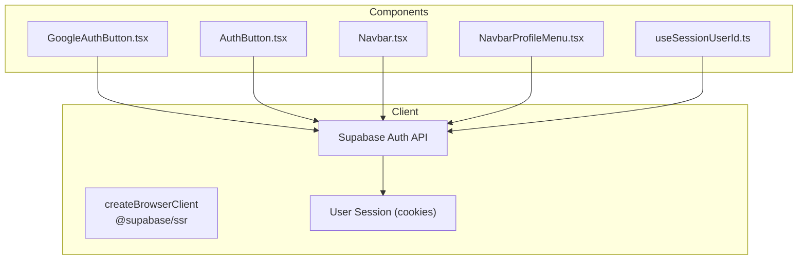
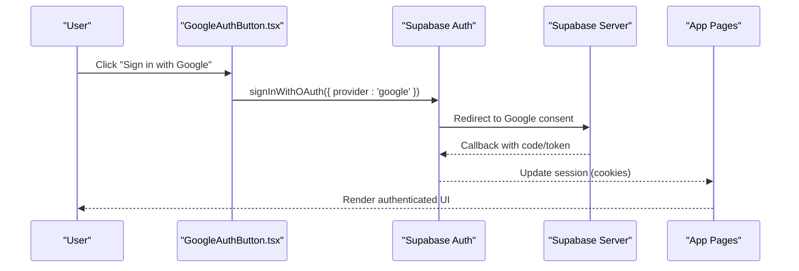
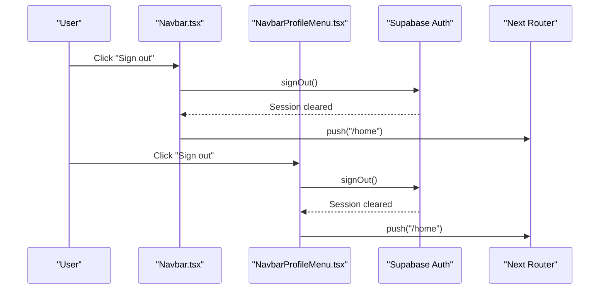
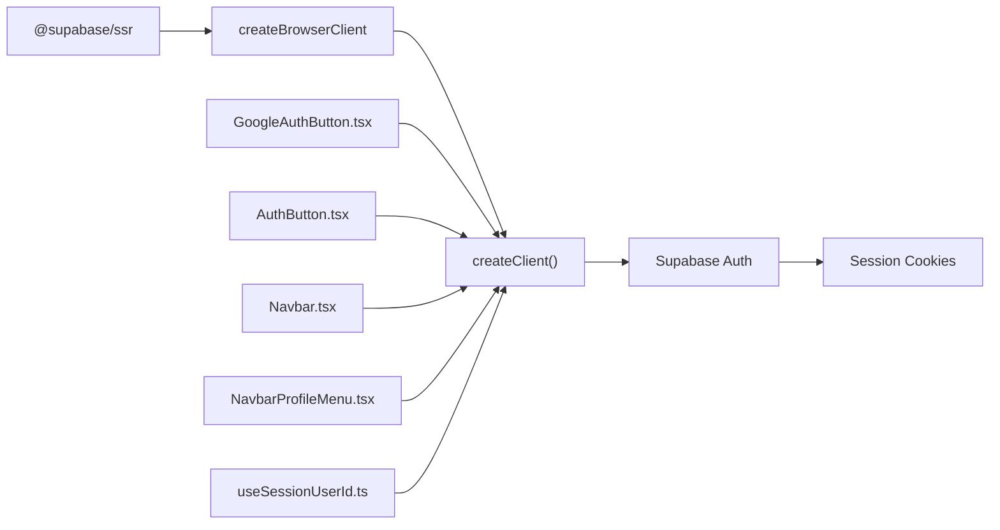

# Supabase Authentication Setup

<cite>
**Referenced Files in This Document**
- [client.ts](file://src/lib/supabase/client.ts)
- [useSessionUserId.ts](file://src/hooks/useSessionUserId.ts)
- [GoogleAuthButton.tsx](file://src/components/ui/auth/GoogleAuthButton.tsx)
- [AuthButton.tsx](file://src/components/ui/auth/AuthButton.tsx)
- [Navbar.tsx](file://src/components/ui/navbar/Navbar.tsx)
- [NavbarProfileMenu.tsx](file://src/components/ui/navbar/NavbarProfileMenu.tsx)
- [password-policy.ts](file://src/lib/auth/password-policy.ts)
- [userMessages.ts](file://src/lib/errors/userMessages.ts)
- [package.json](file://package.json)
</cite>

## Table of Contents
1. Introduction
2. Project Structure
3. Core Components
4. Architecture Overview
5. Detailed Component Analysis
6. Dependency Analysis
7. Performance Considerations
8. Troubleshooting Guide
9. Conclusion

## Introduction
This document explains how Supabase authentication is implemented in the project with a focus on client configuration, Google OAuth integration points, session management patterns, and server-side rendering (SSR) support using @supabase/ssr. It also covers environment configuration, security considerations, and troubleshooting common issues. The goal is to help developers understand how login/logout flows work, how redirects are handled by Supabase, and how sessions are managed across components.

## Project Structure
Authentication-related code is organized into:
- Client initialization for browser and SSR via @supabase/ssr
- UI components for auth buttons and sign-out actions
- Hooks for reading current user session state
- Error mapping utilities and password policy validation

**Diagram sources**
- [client.ts:1-8](file://src/lib/supabase/client.ts#L1-L8)
- [GoogleAuthButton.tsx:1-60](file://src/components/ui/auth/GoogleAuthButton.tsx#L1-L60)
- [AuthButton.tsx:1-41](file://src/components/ui/auth/AuthButton.tsx#L1-L41)
- [Navbar.tsx:204-208](file://src/components/ui/navbar/Navbar.tsx#L204-L208)
- [NavbarProfileMenu.tsx:24-28](file://src/components/ui/navbar/NavbarProfileMenu.tsx#L24-L28)
- [useSessionUserId.ts:1-19](file://src/hooks/useSessionUserId.ts#L1-L19)

**Section sources**
- [client.ts:1-8](file://src/lib/supabase/client.ts#L1-L8)
- [GoogleAuthButton.tsx:1-60](file://src/components/ui/auth/GoogleAuthButton.tsx#L1-L60)
- [AuthButton.tsx:1-41](file://src/components/ui/auth/AuthButton.tsx#L1-L41)
- [Navbar.tsx:204-208](file://src/components/ui/navbar/Navbar.tsx#L204-L208)
- [NavbarProfileMenu.tsx:24-28](file://src/components/ui/navbar/NavbarProfileMenu.tsx#L24-L28)
- [useSessionUserId.ts:1-19](file://src/hooks/useSessionUserId.ts#L1-L19)

## Core Components
- Browser client creation with @supabase/ssr for SSR-safe sessions
- Google OAuth button component for initiating provider flows
- Sign-out flows in navbar and profile menu
- Hook to read current user id from session
- Password policy and friendly error messages for UX

Key responsibilities:
- Initialize Supabase client once per request/component context using createBrowserClient
- Trigger provider sign-in flows from UI components
- Manage sign-out and navigation after logout
- Read session state to gate features or personalize UI

**Section sources**
- [client.ts:1-8](file://src/lib/supabase/client.ts#L1-L8)
- [GoogleAuthButton.tsx:1-60](file://src/components/ui/auth/GoogleAuthButton.tsx#L1-L60)
- [AuthButton.tsx:1-41](file://src/components/ui/auth/AuthButton.tsx#L1-L41)
- [Navbar.tsx:204-208](file://src/components/ui/navbar/Navbar.tsx#L204-L208)
- [NavbarProfileMenu.tsx:24-28](file://src/components/ui/navbar/NavbarProfileMenu.tsx#L24-L28)
- [useSessionUserId.ts:1-19](file://src/hooks/useSessionUserId.ts#L1-L19)
- [password-policy.ts:1-41](file://src/lib/auth/password-policy.ts#L1-L41)
- [userMessages.ts:1-11](file://src/lib/errors/userMessages.ts#L1-L11)

## Architecture Overview
The application uses @supabase/ssr to create a browser client that manages cookies and sessions transparently. Provider-based sign-in (e.g., Google) is initiated from UI components; Supabase handles redirect and callback. After sign-in, components can read session state to render authenticated UI. Sign-out clears the session and navigates to a safe route.

**Diagram sources**
- [GoogleAuthButton.tsx:1-60](file://src/components/ui/auth/GoogleAuthButton.tsx#L1-L60)
- [client.ts:1-8](file://src/lib/supabase/client.ts#L1-L8)

## Detailed Component Analysis

### Client Configuration (@supabase/ssr)
- Uses createBrowserClient from @supabase/ssr to initialize the Supabase client with environment variables for URL and anon key.
- Ensures SSR compatibility by leveraging @supabase/ssr’s cookie handling.

Implementation highlights:
- Environment variables: NEXT_PUBLIC_SUPABASE_URL, NEXT_PUBLIC_SUPABASE_ANON_KEY
- Single exported factory function to obtain a client instance

Security notes:
- Only expose the anon key publicly; never embed secrets in client bundles beyond what Supabase requires.
- Ensure Next.js env variable names match those used in the client.

**Section sources**
- [client.ts:1-8](file://src/lib/supabase/client.ts#L1-L8)
- [package.json:19](file://package.json#L19)

### Google OAuth Integration
- The GoogleAuthButton component provides a styled button for initiating Google sign-in.
- Actual OAuth flow invocation is expected to be wired in parent components/pages using the Supabase client created via createClient().

Behavior:
- Displays loading state during async operations
- Renders Google icon and label text

Integration guidance:
- In your page or form, call supabase.auth.signInWithOAuth({ provider: 'google' }) when the button is clicked.
- Configure Google provider in Supabase dashboard and set allowed redirect URLs to include your app domain.

**Section sources**
- [GoogleAuthButton.tsx:1-60](file://src/components/ui/auth/GoogleAuthButton.tsx#L1-L60)

### Sign-Out Flow
- Sign-out is implemented in both the main navbar and the profile menu.
- Both call supabase.auth.signOut() and then navigate to /home.

Flow details:
- User triggers sign-out
- Supabase clears session cookies
- Router navigates to home

**Diagram sources**
- [Navbar.tsx:204-208](file://src/components/ui/navbar/Navbar.tsx#L204-L208)
- [NavbarProfileMenu.tsx:24-28](file://src/components/ui/navbar/NavbarProfileMenu.tsx#L24-L28)

**Section sources**
- [Navbar.tsx:204-208](file://src/components/ui/navbar/Navbar.tsx#L204-L208)
- [NavbarProfileMenu.tsx:24-28](file://src/components/ui/navbar/NavbarProfileMenu.tsx#L24-L28)

### Session State Handling
- useSessionUserId hook reads the current user id from the Supabase session on mount.
- Returns null until the session loads or when signed out.

Usage pattern:
- Use the returned userId to conditionally render authenticated UI or fetch user-scoped data.

Complexity:
- O(1) state update after initial session retrieval
- Minimal re-renders since it only sets state once

**Section sources**
- [useSessionUserId.ts:1-19](file://src/hooks/useSessionUserId.ts#L1-L19)

### Password Policy and UX
- Client-side password policy mirrors server rules to provide immediate feedback.
- Friendly error messages map technical errors to user-friendly text.

Guidance:
- Keep client rules aligned with Supabase project settings to avoid confusing rejections.
- Surface only friendly messages to users; log technical details separately.

**Section sources**
- [password-policy.ts:1-41](file://src/lib/auth/password-policy.ts#L1-L41)
- [userMessages.ts:1-11](file://src/lib/errors/userMessages.ts#L1-L11)

### Auth Button Component
- Generic reusable button for auth actions with loading state.
- Can be composed with other logic to trigger sign-in/sign-up flows.

**Section sources**
- [AuthButton.tsx:1-41](file://src/components/ui/auth/AuthButton.tsx#L1-L41)

## Dependency Analysis
- @supabase/ssr is a runtime dependency used to create a browser client compatible with SSR.
- Components depend on the client factory to access Supabase Auth APIs.
- Navigation depends on Next.js router for post-auth redirects.

**Diagram sources**
- [package.json:19](file://package.json#L19)
- [client.ts:1-8](file://src/lib/supabase/client.ts#L1-L8)
- [GoogleAuthButton.tsx:1-60](file://src/components/ui/auth/GoogleAuthButton.tsx#L1-L60)
- [AuthButton.tsx:1-41](file://src/components/ui/auth/AuthButton.tsx#L1-L41)
- [Navbar.tsx:204-208](file://src/components/ui/navbar/Navbar.tsx#L204-L208)
- [NavbarProfileMenu.tsx:24-28](file://src/components/ui/navbar/NavbarProfileMenu.tsx#L24-L28)
- [useSessionUserId.ts:1-19](file://src/hooks/useSessionUserId.ts#L1-L19)

**Section sources**
- [package.json:19](file://package.json#L19)
- [client.ts:1-8](file://src/lib/supabase/client.ts#L1-L8)

## Performance Considerations
- Avoid creating multiple Supabase clients unnecessarily; reuse the factory where appropriate.
- Defer heavy computations until after session is resolved to prevent blocking UI.
- Use minimal state updates (as seen in useSessionUserId) to reduce re-renders.
- Ensure environment variables are cached at build time for predictable behavior.

[No sources needed since this section provides general guidance]

## Troubleshooting Guide
Common issues and resolutions:
- Missing environment variables: Ensure NEXT_PUBLIC_SUPABASE_URL and NEXT_PUBLIC_SUPABASE_ANON_KEY are set in your environment.
- Google OAuth not working: Verify Google provider is enabled in Supabase and redirect URLs match your app domain.
- Sign-out does not persist: Confirm that cookies are not blocked and that signOut is called before navigation.
- Session not updating immediately: Allow a short delay or refresh if necessary; Supabase SSR manages cookies automatically.
- Password validation mismatches: Align client-side password policy with Supabase project settings to avoid confusing failures.

Error handling tips:
- Map Supabase auth errors to friendly messages for users.
- Log technical details for debugging without exposing them to users.

**Section sources**
- [client.ts:1-8](file://src/lib/supabase/client.ts#L1-L8)
- [userMessages.ts:1-11](file://src/lib/errors/userMessages.ts#L1-L11)
- [password-policy.ts:1-41](file://src/lib/auth/password-policy.ts#L1-L41)

## Conclusion
The project implements Supabase authentication using @supabase/ssr for SSR-compatible sessions, a clean client factory, and focused UI components for sign-in and sign-out. Google OAuth is integrated via a dedicated button component, while session state is read through a lightweight hook. Follow the guidance above to configure providers, manage redirects, and handle errors gracefully.

[No sources needed since this section summarizes without analyzing specific files]