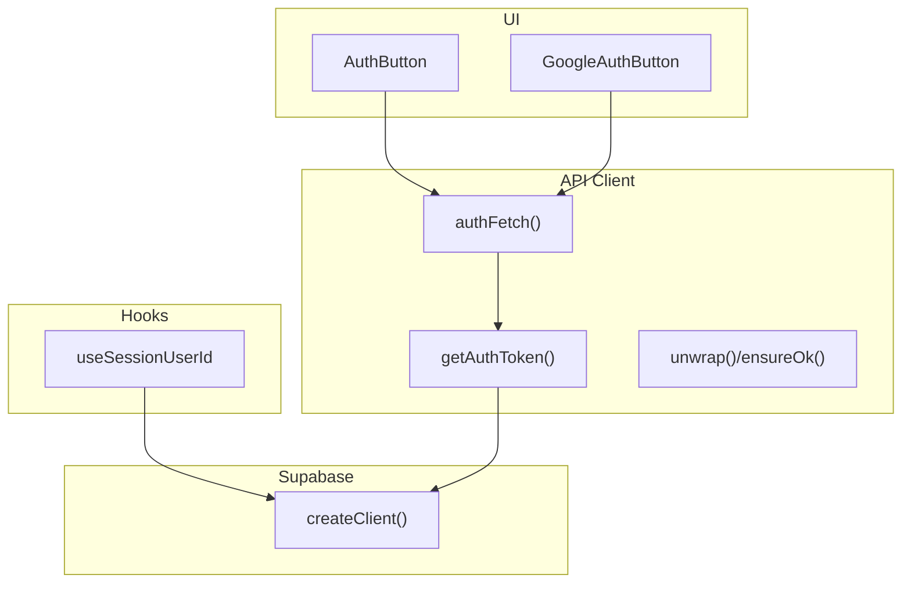
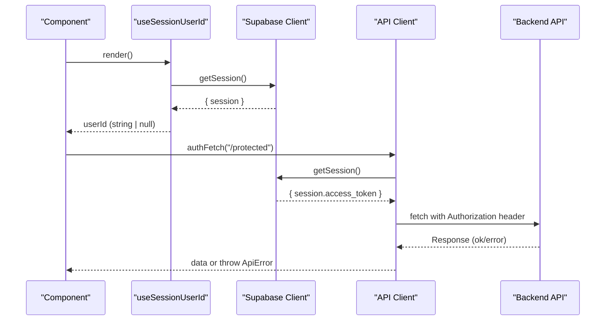
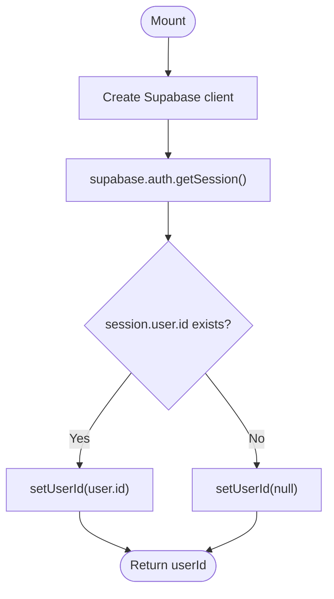
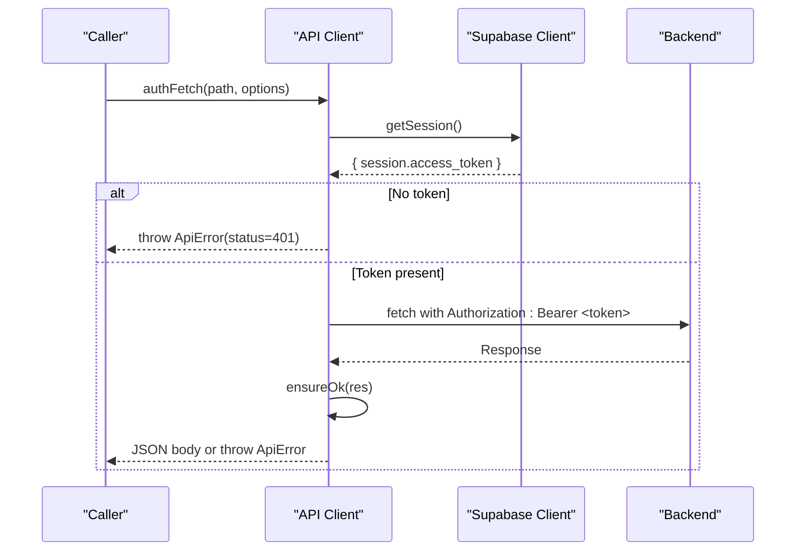
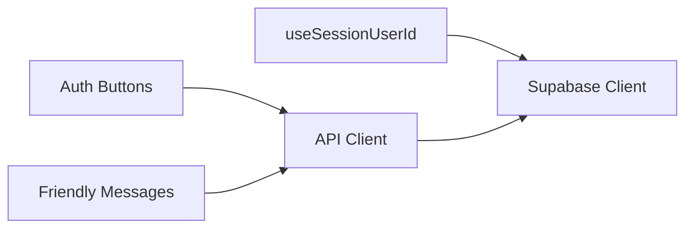

# User Session Management

<cite>
**Referenced Files in This Document**
- [useSessionUserId.ts](file://src/hooks/useSessionUserId.ts)
- [client.ts](file://src/lib/supabase/client.ts)
- [client.ts](file://src/lib/api/client.ts)
- [userMessages.ts](file://src/lib/errors/userMessages.ts)
- [AuthButton.tsx](file://src/components/ui/auth/AuthButton.tsx)
- [GoogleAuthButton.tsx](file://src/components/ui/auth/GoogleAuthButton.tsx)
</cite>

## Table of Contents
1. [Introduction](#introduction)
2. [Project Structure](#project-structure)
3. [Core Components](#core-components)
4. [Architecture Overview](#architecture-overview)
5. [Detailed Component Analysis](#detailed-component-analysis)
6. [Dependency Analysis](#dependency-analysis)
7. [Performance Considerations](#performance-considerations)
8. [Troubleshooting Guide](#troubleshooting-guide)
9. [Conclusion](#conclusion)

## Introduction
This document explains how user sessions are managed across the application, focusing on:
- Retrieving the current session user ID
- Managing user context and synchronizing state
- Persisting and using sessions for API calls
- Protecting routes based on authentication status
- Handling session expiration and automatic logout behavior
- Security considerations and cross-component sharing patterns

The implementation relies on Supabase for authentication and a centralized API client that attaches the access token to outbound requests.

## Project Structure
Session-related code is organized into focused layers:
- Hooks layer: provides React hooks to read session state (e.g., current user ID)
- Client layer: creates a Supabase browser client and an authenticated HTTP client
- UI layer: reusable auth buttons with loading states
- Error handling: friendly messages for auth errors

**Diagram sources**
- [useSessionUserId.ts:1-19](file://src/hooks/useSessionUserId.ts#L1-L19)
- [client.ts:1-9](file://src/lib/supabase/client.ts#L1-L9)
- [client.ts:48-107](file://src/lib/api/client.ts#L48-L107)
- [AuthButton.tsx:1-41](file://src/components/ui/auth/AuthButton.tsx#L1-L41)
- [GoogleAuthButton.tsx:1-61](file://src/components/ui/auth/GoogleAuthButton.tsx#L1-L61)

**Section sources**
- [useSessionUserId.ts:1-19](file://src/hooks/useSessionUserId.ts#L1-L19)
- [client.ts:1-9](file://src/lib/supabase/client.ts#L1-L9)
- [client.ts:48-107](file://src/lib/api/client.ts#L48-L107)
- [AuthButton.tsx:1-41](file://src/components/ui/auth/AuthButton.tsx#L1-L41)
- [GoogleAuthButton.tsx:1-61](file://src/components/ui/auth/GoogleAuthButton.tsx#L1-L61)

## Core Components
- useSessionUserId hook: reads the current user ID from the Supabase session once on mount and returns it as a string or null.
- Supabase client factory: builds a browser client using environment variables for URL and anon key.
- Authenticated API client: retrieves the access token from the Supabase session and attaches it to outgoing requests; centralizes error unwrapping and status handling.
- Auth UI components: provide consistent loading states for sign-in flows.

Key responsibilities:
- Session retrieval: via Supabase getSession
- Token propagation: via authFetch attaching Authorization header
- User-friendly errors: mapping technical auth errors to friendly messages

**Section sources**
- [useSessionUserId.ts:1-19](file://src/hooks/useSessionUserId.ts#L1-L19)
- [client.ts:1-9](file://src/lib/supabase/client.ts#L1-L9)
- [client.ts:48-107](file://src/lib/api/client.ts#L48-L107)
- [userMessages.ts:1-47](file://src/lib/errors/userMessages.ts#L1-L47)
- [AuthButton.tsx:1-41](file://src/components/ui/auth/AuthButton.tsx#L1-L41)
- [GoogleAuthButton.tsx:1-61](file://src/components/ui/auth/GoogleAuthButton.tsx#L1-L61)

## Architecture Overview
The session flow spans three main parts:
- Reading session state in React components via useSessionUserId
- Attaching tokens to API requests through authFetch
- Presenting user-friendly feedback when authentication fails

**Diagram sources**
- [useSessionUserId.ts:1-19](file://src/hooks/useSessionUserId.ts#L1-L19)
- [client.ts:1-9](file://src/lib/supabase/client.ts#L1-L9)
- [client.ts:48-107](file://src/lib/api/client.ts#L48-L107)

## Detailed Component Analysis

### useSessionUserId hook
Purpose:
- Resolve the current authenticated user ID from the Supabase session
- Return null until the session loads or when signed out

Behavior:
- On mount, creates a Supabase client and calls getSession
- Sets local state to the user id if present, otherwise null
- Returns the current userId for consumers

Complexity:
- Time: O(1) per call after initial async resolution
- Space: O(1) local state

Integration points:
- Depends on createBrowserClient for Supabase access
- Suitable for protecting routes or gating features by checking for non-null userId

**Diagram sources**
- [useSessionUserId.ts:1-19](file://src/hooks/useSessionUserId.ts#L1-L19)

**Section sources**
- [useSessionUserId.ts:1-19](file://src/hooks/useSessionUserId.ts#L1-L19)

### Supabase client factory
Purpose:
- Provide a single place to configure the Supabase browser client with environment variables

Behavior:
- Exposes createClient which returns a configured Supabase instance

Usage:
- Used by both the hook and the API client to ensure consistent configuration

**Section sources**
- [client.ts:1-9](file://src/lib/supabase/client.ts#L1-L9)

### Authenticated API client
Purpose:
- Ensure all outbound API calls include a valid access token
- Centralize error handling and response unwrapping

Key functions:
- getAuthToken: fetches the current session and returns the access token or null
- authFetch: attaches Authorization header and forwards the request
- unwrap/ensureOk: parse JSON and throw typed ApiError with numeric status on failures

Security notes:
- If no session exists, requests fail early with a 401-like error
- Transport errors are preserved; HTTP errors are normalized to ApiError

**Diagram sources**
- [client.ts:48-107](file://src/lib/api/client.ts#L48-L107)

**Section sources**
- [client.ts:48-107](file://src/lib/api/client.ts#L48-L107)

### Auth UI components
Purpose:
- Provide consistent button styles and loading indicators for authentication actions

Components:
- AuthButton: generic auth action button with loading state
- GoogleAuthButton: Google OAuth button with logo and loading state

Notes:
- These components do not perform auth logic themselves; they wrap actions that trigger sign-in flows elsewhere

**Section sources**
- [AuthButton.tsx:1-41](file://src/components/ui/auth/AuthButton.tsx#L1-L41)
- [GoogleAuthButton.tsx:1-61](file://src/components/ui/auth/GoogleAuthButton.tsx#L1-L61)

## Dependency Analysis
- useSessionUserId depends on the Supabase client to read the session
- The API client also depends on the Supabase client to obtain the access token
- UI components depend on shared primitives and may trigger auth flows that ultimately rely on the same Supabase client
- Error utilities translate low-level auth errors into user-friendly messages

**Diagram sources**
- [useSessionUserId.ts:1-19](file://src/hooks/useSessionUserId.ts#L1-L19)
- [client.ts:1-9](file://src/lib/supabase/client.ts#L1-L9)
- [client.ts:48-107](file://src/lib/api/client.ts#L48-L107)
- [userMessages.ts:1-47](file://src/lib/errors/userMessages.ts#L1-L47)

**Section sources**
- [useSessionUserId.ts:1-19](file://src/hooks/useSessionUserId.ts#L1-L19)
- [client.ts:1-9](file://src/lib/supabase/client.ts#L1-L9)
- [client.ts:48-107](file://src/lib/api/client.ts#L48-L107)
- [userMessages.ts:1-47](file://src/lib/errors/userMessages.ts#L1-L47)

## Performance Considerations
- Session reads: getSession is called once per hook invocation; avoid redundant calls by reusing the returned userId in components
- Token acquisition: authFetch obtains the token per request; consider caching at the component level if making many rapid calls
- Network overhead: minimize unnecessary protected calls when userId is null to reduce 401 errors and redirects
- Rendering: guard rendering of user-specific content behind a non-null userId check to prevent layout shifts during load

[No sources needed since this section provides general guidance]

## Troubleshooting Guide
Common issues and resolutions:
- Not authenticated:
  - Symptom: API calls fail with a 401-like error before reaching the server
  - Cause: No active Supabase session
  - Resolution: Ensure the user has signed in; verify getSession returns a session; handle 401 by redirecting to login
- Invalid credentials:
  - Symptom: Sign-in fails with a friendly message indicating incorrect email/password
  - Resolution: Prompt user to re-enter credentials or reset password
- Email not confirmed:
  - Symptom: Sign-in blocked until email verification
  - Resolution: Direct user to confirm email via the link sent
- Weak password:
  - Symptom: Registration/sign-up rejected due to policy
  - Resolution: Show password requirements and guide the user to comply
- Rate limits:
  - Symptom: Too many attempts; temporary lockout
  - Resolution: Inform the user to wait and retry later
- Network errors:
  - Symptom: Cannot reach server
  - Resolution: Check connectivity and retry

Use the friendly error mapper to surface appropriate messages to users while keeping technical details out of the UI.

**Section sources**
- [userMessages.ts:1-47](file://src/lib/errors/userMessages.ts#L1-L47)
- [client.ts:48-107](file://src/lib/api/client.ts#L48-L107)

## Conclusion
The application manages sessions by:
- Reading the current user ID via a lightweight hook
- Attaching the Supabase access token to all API requests through a centralized client
- Providing clear, user-friendly error messages for authentication failures

To protect routes and manage user-specific data:
- Gate components and pages by checking for a non-null userId from useSessionUserId
- Use authFetch for any backend calls requiring authentication
- Handle 401 responses by redirecting to login or prompting re-authentication

For security and reliability:
- Always validate authentication before performing sensitive operations
- Centralize error handling to avoid leaking technical details
- Keep session reads minimal and reuse results where possible

[No sources needed since this section summarizes without analyzing specific files]