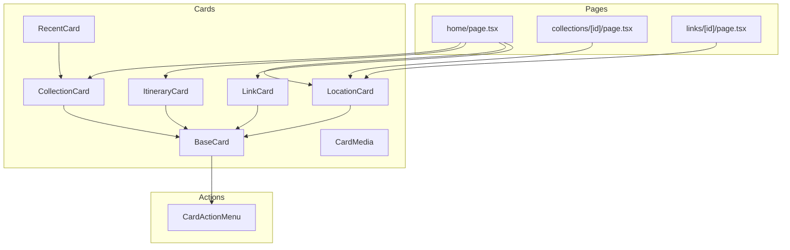
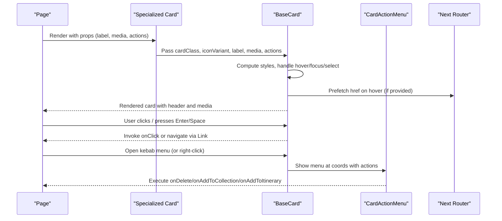
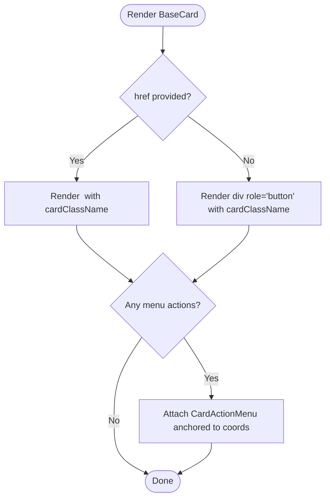
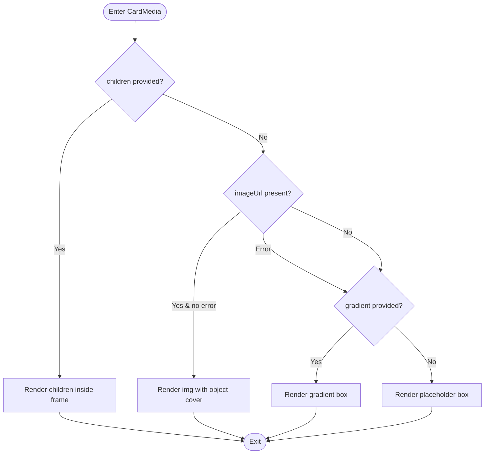
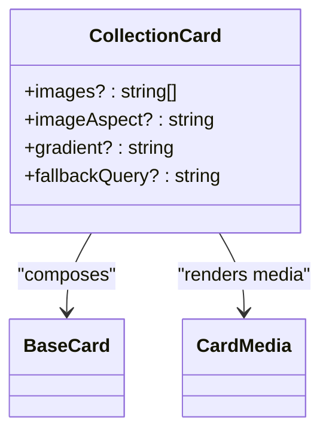
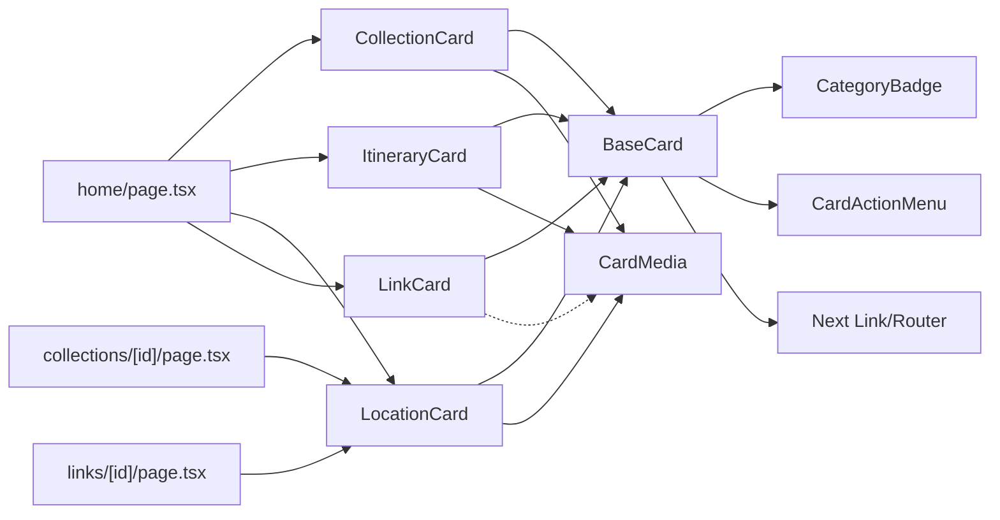

# Card Components

<cite>
**Referenced Files in This Document**
- [BaseCard.tsx](file://src/components/ui/cards/BaseCard.tsx)
- [CardMedia.tsx](file://src/components/ui/cards/CardMedia.tsx)
- [CollectionCard.tsx](file://src/components/ui/cards/CollectionCard.tsx)
- [ItineraryCard.tsx](file://src/components/ui/cards/ItineraryCard.tsx)
- [LocationCard.tsx](file://src/components/ui/cards/LocationCard.tsx)
- [LinkCard.tsx](file://src/components/ui/cards/LinkCard.tsx)
- [constants.ts](file://src/components/ui/cards/constants.ts)
- [RecentCard.tsx](file://src/components/ui/cards/RecentCard.tsx)
- [CardActionMenu.tsx](file://src/components/ui/dashboard/CardActionMenu.tsx)
- [CardGridSkeleton.tsx](file://src/components/ui/skeletons/CardGridSkeleton.tsx)
- [home/page.tsx](file://src/app/home/page.tsx)
- [collections/[id]/page.tsx](file://src/app/collections/[id]/page.tsx)
- [links/[id]/page.tsx](file://src/app/links/[id]/page.tsx)
</cite>

## Table of Contents
1. Introduction
2. Project Structure
3. Core Components
4. Architecture Overview
5. Detailed Component Analysis
6. Dependency Analysis
7. Performance Considerations
8. Troubleshooting Guide
9. Conclusion
10. Appendices

## Introduction
This document explains the card component system used across the application. It covers the shared foundation (BaseCard), specialized cards (CollectionCard, ItineraryCard, LocationCard, LinkCard), media handling via CardMedia, content layout and interactive behaviors, customization patterns, responsive design considerations, integration with pages, performance optimization for large collections, and accessibility best practices.

## Project Structure
The card system is organized under a dedicated UI folder:
- Base shell and behavior: BaseCard
- Media slot: CardMedia
- Specialized cards: CollectionCard, ItineraryCard, LocationCard, LinkCard
- Shared utilities: constants for grid row heights
- Related components: CardActionMenu (per-card actions), RecentCard (compact preview), skeleton placeholders

**Diagram sources**
- [BaseCard.tsx:57-204](file://src/components/ui/cards/BaseCard.tsx#L57-L204)
- [CardMedia.tsx:30-62](file://src/components/ui/cards/CardMedia.tsx#L30-L62)
- [CollectionCard.tsx:79-107](file://src/components/ui/cards/CollectionCard.tsx#L79-L107)
- [ItineraryCard.tsx:30-48](file://src/components/ui/cards/ItineraryCard.tsx#L30-L48)
- [LocationCard.tsx:30-48](file://src/components/ui/cards/LocationCard.tsx#L30-L48)
- [LinkCard.tsx:29-71](file://src/components/ui/cards/LinkCard.tsx#L29-L71)
- [CardActionMenu.tsx:52-113](file://src/components/ui/dashboard/CardActionMenu.tsx#L52-L113)
- [home/page.tsx:892-914](file://src/app/home/page.tsx#L892-L914)
- [collections/[id]/page.tsx:976-988](file://src/app/collections/[id]/page.tsx#L976-L988)
- [links/[id]/page.tsx:10-12](file://src/app/links/[id]/page.tsx#L10-L12)

**Section sources**
- [BaseCard.tsx:13-50](file://src/components/ui/cards/BaseCard.tsx#L13-L50)
- [CardMedia.tsx:7-21](file://src/components/ui/cards/CardMedia.tsx#L7-L21)
- [constants.ts:1-8](file://src/components/ui/cards/constants.ts#L1-L8)

## Core Components
- BaseCard: Shared shell providing selection state, header with category badge, optional kebab menu, keyboard and focus behavior, link vs button rendering, and hover states.
- CardMedia: Standardized media frame that renders custom children, an image with error fallback, gradient, or placeholder; supports aspect ratio control.
- Specialized Cards:
  - CollectionCard: Multi-image grid or single image/gradient fallback using CardMedia; integrates location photo hook for Unsplash fallback.
  - ItineraryCard: Single image/gradient media with itinerary-specific icon variant.
  - LocationCard: Single image/gradient media with location-specific icon variant.
  - LinkCard: Phone-frame thumbnail with optional image or gradient; subtle tilt on hover/selection.
- CardActionMenu: Per-card context menu anchored to fixed coordinates; exposes Add to Collection, Add to Itinerary, Delete.

Key responsibilities:
- Composition: Each specialized card composes BaseCard and supplies its own media via CardMedia or custom slots.
- Interactions: BaseCard handles click, Enter/Space activation, right-click menu positioning, and prefetching when hovering non-link cards.
- Accessibility: Focus rings, aria-disabled, semantic roles, and alt text propagation through CardMedia.

**Section sources**
- [BaseCard.tsx:57-204](file://src/components/ui/cards/BaseCard.tsx#L57-L204)
- [CardMedia.tsx:30-62](file://src/components/ui/cards/CardMedia.tsx#L30-L62)
- [CollectionCard.tsx:79-107](file://src/components/ui/cards/CollectionCard.tsx#L79-L107)
- [ItineraryCard.tsx:30-48](file://src/components/ui/cards/ItineraryCard.tsx#L30-L48)
- [LocationCard.tsx:30-48](file://src/components/ui/cards/LocationCard.tsx#L30-L48)
- [LinkCard.tsx:29-71](file://src/components/ui/cards/LinkCard.tsx#L29-L71)
- [CardActionMenu.tsx:52-113](file://src/components/ui/dashboard/CardActionMenu.tsx#L52-L113)

## Architecture Overview
The card system follows a composition pattern:
- BaseCard defines the common shell and interaction model.
- Specialized cards extend BaseCard by providing type-specific media and icon variants.
- CardMedia centralizes media rendering and fallback logic.
- Pages compose these cards into grids/lists and wire up actions (delete, add to collection/itinerary).

**Diagram sources**
- [BaseCard.tsx:85-109](file://src/components/ui/cards/BaseCard.tsx#L85-L109)
- [BaseCard.tsx:161-204](file://src/components/ui/cards/BaseCard.tsx#L161-L204)
- [CardActionMenu.tsx:63-113](file://src/components/ui/dashboard/CardActionMenu.tsx#L63-L113)

## Detailed Component Analysis

### BaseCard
- Purpose: Provides consistent card shell, selection state, header, and action menu integration.
- Props: cardClass, className, style, media, label, iconVariant, href, prefetchHref, onClick, onDelete, onAddToCollection, onAddToItinerary, disabled, isSelected, isSelectingMode.
- Behavior:
  - Renders either a Link or a div with role="button" depending on href.
  - Keyboard support: Enter/Space triggers click when focused.
  - Right-click opens CardActionMenu at cursor or kebab anchor.
  - Hover-based prefetch via Next router when prefetchHref is set.
  - Selection styling and disabled states.
- Accessibility:
  - Focus-visible ring and outline-none for clean focus.
  - aria-disabled reflects disabled prop.
  - Semantic role="button" for non-link cards.

**Diagram sources**
- [BaseCard.tsx:111-118](file://src/components/ui/cards/BaseCard.tsx#L111-L118)
- [BaseCard.tsx:161-204](file://src/components/ui/cards/BaseCard.tsx#L161-L204)
- [CardActionMenu.tsx:63-113](file://src/components/ui/dashboard/CardActionMenu.tsx#L63-L113)

**Section sources**
- [BaseCard.tsx:20-50](file://src/components/ui/cards/BaseCard.tsx#L20-L50)
- [BaseCard.tsx:57-204](file://src/components/ui/cards/BaseCard.tsx#L57-L204)

### CardMedia
- Purpose: Centralized media frame with consistent rounded corners and overflow handling.
- Rendering order:
  1) Custom children (e.g., multi-image grid)
  2) Image with alt fallback to label
  3) Gradient background
  4) Placeholder box
- Supports aspect ratio via Tailwind class injection.
- Error handling: Switches to fallback if image fails to load.

**Diagram sources**
- [CardMedia.tsx:30-62](file://src/components/ui/cards/CardMedia.tsx#L30-L62)

**Section sources**
- [CardMedia.tsx:7-21](file://src/components/ui/cards/CardMedia.tsx#L7-L21)
- [CardMedia.tsx:30-62](file://src/components/ui/cards/CardMedia.tsx#L30-L62)

### CollectionCard
- Purpose: Displays collections with a multi-image grid or a single image/gradient fallback.
- Media: Uses CardMedia; passes images to a grid component when available; otherwise uses Unsplash fallback via hook or gradient/placeholder.
- Icon variant: "collection".

**Diagram sources**
- [CollectionCard.tsx:79-107](file://src/components/ui/cards/CollectionCard.tsx#L79-L107)
- [BaseCard.tsx:57-204](file://src/components/ui/cards/BaseCard.tsx#L57-L204)
- [CardMedia.tsx:30-62](file://src/components/ui/cards/CardMedia.tsx#L30-L62)

**Section sources**
- [CollectionCard.tsx:10-55](file://src/components/ui/cards/CollectionCard.tsx#L10-L55)
- [CollectionCard.tsx:79-107](file://src/components/ui/cards/CollectionCard.tsx#L79-L107)

### ItineraryCard
- Purpose: Represents an itinerary with a single image or gradient media.
- Icon variant: "itinerary".

**Section sources**
- [ItineraryCard.tsx:8-28](file://src/components/ui/cards/ItineraryCard.tsx#L8-L28)
- [ItineraryCard.tsx:30-48](file://src/components/ui/cards/ItineraryCard.tsx#L30-L48)

### LocationCard
- Purpose: Represents a location with a single image or gradient media.
- Icon variant: "location".

**Section sources**
- [LocationCard.tsx:8-28](file://src/components/ui/cards/LocationCard.tsx#L8-L28)
- [LocationCard.tsx:30-48](file://src/components/ui/cards/LocationCard.tsx#L30-L48)

### LinkCard
- Purpose: Presents a link with a phone-frame thumbnail; tilts slightly on hover/selection.
- Media: Optional image or gradient; falls back to placeholder.
- Icon variant: "link".

**Section sources**
- [LinkCard.tsx:8-27](file://src/components/ui/cards/LinkCard.tsx#L8-L27)
- [LinkCard.tsx:29-71](file://src/components/ui/cards/LinkCard.tsx#L29-L71)

### CardActionMenu
- Purpose: Contextual per-card menu with Add to Collection, Add to Itinerary, and Delete actions.
- Positioning: Anchored to fixed coordinates computed from kebab click or right-click.
- Integration: Owned by BaseCard; pages supply callbacks.

**Section sources**
- [CardActionMenu.tsx:10-18](file://src/components/ui/dashboard/CardActionMenu.tsx#L10-L18)
- [CardActionMenu.tsx:52-113](file://src/components/ui/dashboard/CardActionMenu.tsx#L52-L113)

### RecentCard
- Purpose: Compact preview card for recent items, reusing CollectionImageGrid for previews.
- Behavior: Wraps a Link with a Tooltip showing the label.

**Section sources**
- [RecentCard.tsx:17-58](file://src/components/ui/cards/RecentCard.tsx#L17-L58)
- [CollectionCard.tsx:10-55](file://src/components/ui/cards/CollectionCard.tsx#L10-L55)

## Dependency Analysis
- BaseCard depends on:
  - CategoryBadge for icon variants
  - CardActionMenu for contextual actions
  - Next Link and Router for navigation and prefetch
- Specialized cards depend on BaseCard and optionally CardMedia.
- Pages consume specialized cards and provide data and actions.

**Diagram sources**
- [BaseCard.tsx:57-204](file://src/components/ui/cards/BaseCard.tsx#L57-L204)
- [CardActionMenu.tsx:52-113](file://src/components/ui/dashboard/CardActionMenu.tsx#L52-L113)
- [CollectionCard.tsx:79-107](file://src/components/ui/cards/CollectionCard.tsx#L79-L107)
- [ItineraryCard.tsx:30-48](file://src/components/ui/cards/ItineraryCard.tsx#L30-L48)
- [LocationCard.tsx:30-48](file://src/components/ui/cards/LocationCard.tsx#L30-L48)
- [LinkCard.tsx:29-71](file://src/components/ui/cards/LinkCard.tsx#L29-L71)
- [home/page.tsx:892-914](file://src/app/home/page.tsx#L892-L914)
- [collections/[id]/page.tsx:976-988](file://src/app/collections/[id]/page.tsx#L976-L988)
- [links/[id]/page.tsx:10-12](file://src/app/links/[id]/page.tsx#L10-L12)

**Section sources**
- [BaseCard.tsx:57-204](file://src/components/ui/cards/BaseCard.tsx#L57-L204)
- [CardActionMenu.tsx:52-113](file://src/components/ui/dashboard/CardActionMenu.tsx#L52-L113)
- [home/page.tsx:892-914](file://src/app/home/page.tsx#L892-L914)

## Performance Considerations
- Virtualization and pagination:
  - Use infinite scroll hooks and pagination to avoid rendering large lists at once.
  - Combine with skeletons for perceived performance during loading.
- Image optimization:
  - Prefer lazy loading and appropriate sizing; use CardMedia’s error fallback to prevent broken images.
  - For collections, limit thumbnails to a small number (e.g., up to 4) to reduce DOM size.
- Prefetching:
  - Use prefetchHref on BaseCard to preload destinations on hover for faster navigation.
- Grid sizing:
  - Use CSS variables for consistent card heights and grid rows to minimize reflows.
- Skeletons:
  - Provide lightweight skeleton placeholders while data loads to improve UX.

[No sources needed since this section provides general guidance]

## Troubleshooting Guide
Common issues and resolutions:
- Kebab menu not appearing:
  - Ensure at least one action callback is provided (onDelete, onAddToCollection, onAddToItinerary) so BaseCard renders the kebab and menu.
- Right-click menu not opening:
  - Verify that hasMenuActions is true and that the page does not intercept contextmenu events before BaseCard.
- Images not displaying:
  - Check imageUrl validity; CardMedia will fall back to gradient or placeholder on error.
- Selection state not updating:
  - Confirm isSelected and isSelectingMode are passed correctly to BaseCard for visual feedback.
- Large list performance:
  - Implement virtualization/infinite scroll and ensure only visible cards render heavy content.

**Section sources**
- [BaseCard.tsx:81-109](file://src/components/ui/cards/BaseCard.tsx#L81-L109)
- [CardMedia.tsx:30-62](file://src/components/ui/cards/CardMedia.tsx#L30-L62)
- [CardGridSkeleton.tsx:7-22](file://src/components/ui/skeletons/CardGridSkeleton.tsx#L7-L22)

## Conclusion
The card system provides a robust, composable foundation for consistent UI across collections, itineraries, locations, and links. BaseCard standardizes interactions and accessibility, while CardMedia centralizes media handling. Specialized cards tailor visuals and semantics per entity type. Pages integrate these components into responsive layouts, leveraging prefetching, skeletons, and action menus for a smooth user experience.

[No sources needed since this section summarizes without analyzing specific files]

## Appendices

### Card Composition Patterns
- Compose BaseCard with a specialized cardClass and iconVariant.
- Supply media via CardMedia or custom children for complex layouts (e.g., multi-image grid).
- Wire actions (onClick, onDelete, onAddToCollection, onAddToItinerary) for interactivity.

**Section sources**
- [BaseCard.tsx:57-204](file://src/components/ui/cards/BaseCard.tsx#L57-L204)
- [CollectionCard.tsx:79-107](file://src/components/ui/cards/CollectionCard.tsx#L79-L107)

### Media Handling
- Priority: children > imageUrl > gradient > placeholder.
- Aspect ratio control via Tailwind classes.
- Error fallback ensures graceful degradation.

**Section sources**
- [CardMedia.tsx:30-62](file://src/components/ui/cards/CardMedia.tsx#L30-L62)

### Content Layout Options
- Single image, gradient, or placeholder for ItineraryCard and LocationCard.
- Multi-image grid for CollectionCard.
- Phone-frame thumbnail for LinkCard with subtle rotation on hover/selection.

**Section sources**
- [ItineraryCard.tsx:30-48](file://src/components/ui/cards/ItineraryCard.tsx#L30-L48)
- [LocationCard.tsx:30-48](file://src/components/ui/cards/LocationCard.tsx#L30-L48)
- [CollectionCard.tsx:10-55](file://src/components/ui/cards/CollectionCard.tsx#L10-L55)
- [LinkCard.tsx:29-71](file://src/components/ui/cards/LinkCard.tsx#L29-L71)

### Interactive Behaviors
- Click, Enter/Space activation, hover-based prefetch.
- Context menu via kebab or right-click with anchored positioning.
- Selection mode with visual indicators.

**Section sources**
- [BaseCard.tsx:85-109](file://src/components/ui/cards/BaseCard.tsx#L85-L109)
- [BaseCard.tsx:161-204](file://src/components/ui/cards/BaseCard.tsx#L161-L204)
- [CardActionMenu.tsx:63-113](file://src/components/ui/dashboard/CardActionMenu.tsx#L63-L113)

### Responsive Design Considerations
- Use container queries and grid columns to adapt card counts per viewport.
- Maintain consistent card heights via CSS variables for predictable layouts.
- Provide skeletons to match final card dimensions during loading.

**Section sources**
- [constants.ts:1-8](file://src/components/ui/cards/constants.ts#L1-L8)
- [CardGridSkeleton.tsx:7-22](file://src/components/ui/skeletons/CardGridSkeleton.tsx#L7-L22)

### Integration with Other Components
- Pages render cards within responsive grids and attach actions (e.g., delete, save to collection/itinerary).
- Menus and modals coordinate with cards for batch operations and creation flows.

**Section sources**
- [home/page.tsx:892-914](file://src/app/home/page.tsx#L892-L914)
- [collections/[id]/page.tsx:976-988](file://src/app/collections/[id]/page.tsx#L976-L988)
- [links/[id]/page.tsx:10-12](file://src/app/links/[id]/page.tsx#L10-L12)

### Accessibility Best Practices
- Ensure all actionable cards are keyboard accessible (focusable, Enter/Space).
- Provide meaningful alt text via CardMedia or labels.
- Use aria-disabled for disabled states and maintain visible focus indicators.
- Avoid overriding contextmenu unless necessary; preserve right-click menu where supported.

**Section sources**
- [BaseCard.tsx:161-204](file://src/components/ui/cards/BaseCard.tsx#L161-L204)
- [CardMedia.tsx:30-62](file://src/components/ui/cards/CardMedia.tsx#L30-L62)