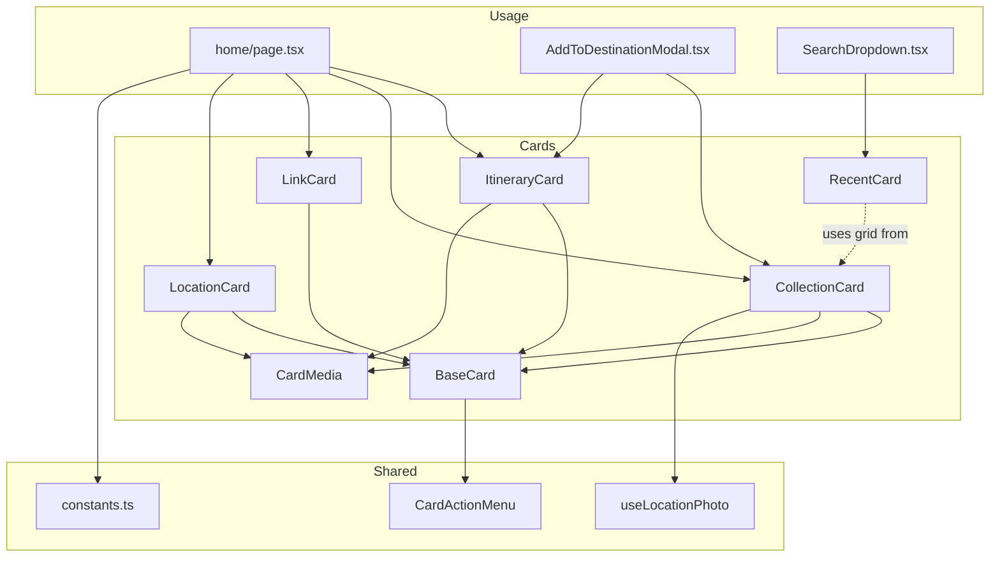
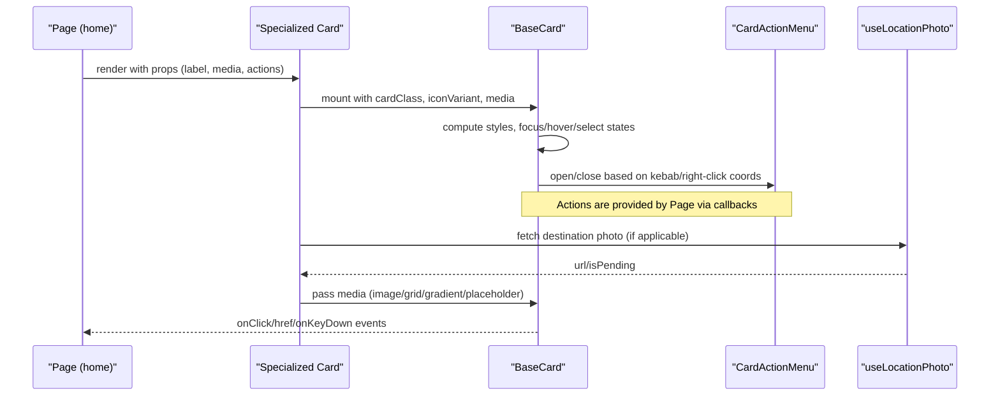
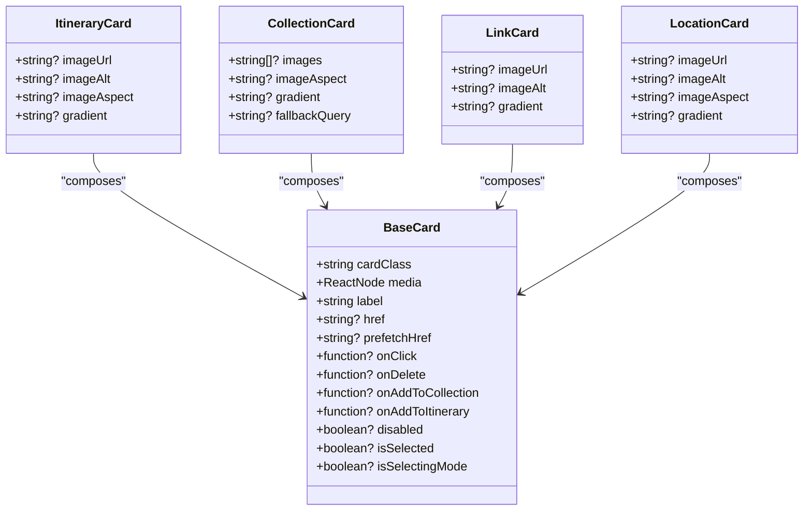
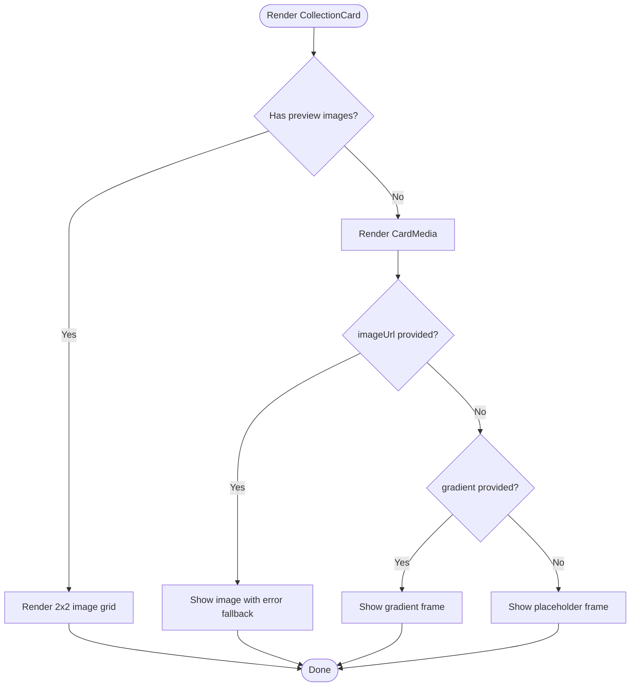
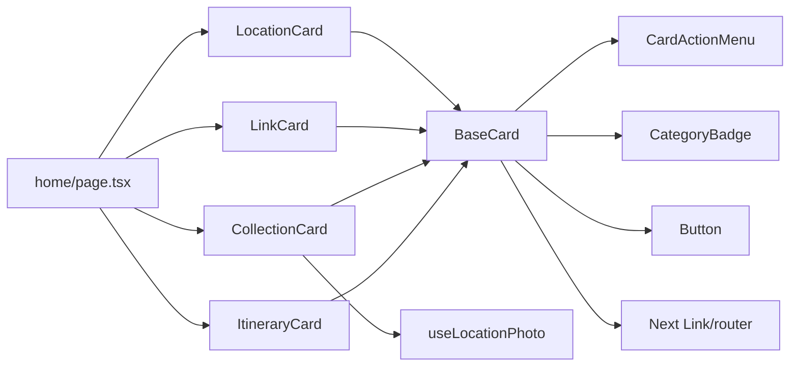

# Card Components

<cite>
**Referenced Files in This Document**
- [BaseCard.tsx](file://src/components/ui/cards/BaseCard.tsx)
- [CardMedia.tsx](file://src/components/ui/cards/CardMedia.tsx)
- [ItineraryCard.tsx](file://src/components/ui/cards/ItineraryCard.tsx)
- [CollectionCard.tsx](file://src/components/ui/cards/CollectionCard.tsx)
- [LinkCard.tsx](file://src/components/ui/cards/LinkCard.tsx)
- [LocationCard.tsx](file://src/components/ui/cards/LocationCard.tsx)
- [RecentCard.tsx](file://src/components/ui/cards/RecentCard.tsx)
- [constants.ts](file://src/components/ui/cards/constants.ts)
- [CardActionMenu.tsx](file://src/components/ui/dashboard/CardActionMenu.tsx)
- [useLocationPhoto.ts](file://src/hooks/useLocationPhoto.ts)
- [home/page.tsx](file://src/app/home/page.tsx)
- [AddToDestinationModal.tsx](file://src/components/ui/modals/AddToDestinationModal.tsx)
- [SearchDropdown.tsx](file://src/components/ui/navbar/SearchDropdown.tsx)
</cite>

## Table of Contents
1. Introduction
2. Project Structure
3. Core Components
4. Architecture Overview
5. Detailed Component Analysis
6. Dependency Analysis
7. Performance Considerations
8. Troubleshooting Guide
9. Conclusion
10. Appendices

## Introduction
This document explains Argo’s card component system: a composable, accessible, and responsive set of UI cards used across the application to represent itineraries, collections, links, locations, and recent items. It covers the BaseCard foundation, specialized card implementations, media handling, content layout strategies, interactive behaviors (including selection and action menus), lifecycle states (loading, error, empty), performance techniques, accessibility considerations, and guidelines for creating new card types while maintaining visual consistency.

## Project Structure
The card system lives under src/components/ui/cards and is composed of:
- A shared shell: BaseCard
- Media container: CardMedia
- Specialized cards: ItineraryCard, CollectionCard, LinkCard, LocationCard
- Compact recent item: RecentCard
- Shared utilities/constants: constants.ts
- Shared menu: CardActionMenu (owned by BaseCard)
- Data hook for destination photos: useLocationPhoto
- Usage examples in pages and modals: home page, AddToDestination modal, Search dropdown

**Diagram sources**
- [BaseCard.tsx:57-204](file://src/components/ui/cards/BaseCard.tsx#L57-L204)
- [CardMedia.tsx:30-62](file://src/components/ui/cards/CardMedia.tsx#L30-L62)
- [ItineraryCard.tsx:30-48](file://src/components/ui/cards/ItineraryCard.tsx#L30-L48)
- [CollectionCard.tsx:79-107](file://src/components/ui/cards/CollectionCard.tsx#L79-L107)
- [LinkCard.tsx:29-71](file://src/components/ui/cards/LinkCard.tsx#L29-L71)
- [LocationCard.tsx:30-47](file://src/components/ui/cards/LocationCard.tsx#L30-L47)
- [RecentCard.tsx:27-58](file://src/components/ui/cards/RecentCard.tsx#L27-L58)
- [CardActionMenu.tsx:52-113](file://src/components/ui/dashboard/CardActionMenu.tsx#L52-L113)
- [useLocationPhoto.ts:21-63](file://src/hooks/useLocationPhoto.ts#L21-L63)
- [home/page.tsx:638-679](file://src/app/home/page.tsx#L638-L679)
- [AddToDestinationModal.tsx:129-239](file://src/components/ui/modals/AddToDestinationModal.tsx#L129-L239)
- [SearchDropdown.tsx:122-150](file://src/components/ui/navbar/SearchDropdown.tsx#L122-L150)
- [constants.ts:1-8](file://src/components/ui/cards/constants.ts#L1-L8)

**Section sources**
- [BaseCard.tsx:1-211](file://src/components/ui/cards/BaseCard.tsx#L1-L211)
- [CardMedia.tsx:1-63](file://src/components/ui/cards/CardMedia.tsx#L1-L63)
- [ItineraryCard.tsx:1-55](file://src/components/ui/cards/ItineraryCard.tsx#L1-L55)
- [CollectionCard.tsx:1-115](file://src/components/ui/cards/CollectionCard.tsx#L1-L115)
- [LinkCard.tsx:1-79](file://src/components/ui/cards/LinkCard.tsx#L1-L79)
- [LocationCard.tsx:1-55](file://src/components/ui/cards/LocationCard.tsx#L1-L55)
- [RecentCard.tsx:1-65](file://src/components/ui/cards/RecentCard.tsx#L1-L65)
- [constants.ts:1-8](file://src/components/ui/cards/constants.ts#L1-L8)
- [CardActionMenu.tsx:1-115](file://src/components/ui/dashboard/CardActionMenu.tsx#L1-L115)
- [useLocationPhoto.ts:1-65](file://src/hooks/useLocationPhoto.ts#L1-L65)
- [home/page.tsx:638-679](file://src/app/home/page.tsx#L638-L679)
- [AddToDestinationModal.tsx:129-239](file://src/components/ui/modals/AddToDestinationModal.tsx#L129-L239)
- [SearchDropdown.tsx:122-150](file://src/components/ui/navbar/SearchDropdown.tsx#L122-L150)

## Core Components
- BaseCard: The foundational card shell providing consistent structure, keyboard navigation, hover/focus states, optional link/button behavior, selection styling, and an integrated kebab menu with right-click support. It accepts a media slot, label, category badge variant, href/prefetch, and action callbacks.
- CardMedia: A standardized media frame that renders either custom children (e.g., multi-image grids), a single image with error fallback, a gradient placeholder, or a plain placeholder. Supports aspect ratio and alt text fallbacks.
- Specialized Cards:
  - ItineraryCard: Uses CardMedia with itinerary-specific icon variant.
  - CollectionCard: Renders a 2×2 image grid when multiple images exist; otherwise falls back to single image, Unsplash photo via useLocationPhoto, gradient, or placeholder.
  - LinkCard: Renders a phone-frame thumbnail with optional image, gradient, or placeholder; includes subtle tilt on hover/selection.
  - LocationCard: Uses CardMedia with location-specific icon variant.
- RecentCard: Compact tile for recently viewed items, reusing the collection image grid when available, otherwise showing a single image or a category badge.
- CardActionMenu: Per-card actions (Add to Collection, Add to Itinerary, Delete) anchored at fixed coordinates; owned by BaseCard but configured by pages.

**Section sources**
- [BaseCard.tsx:20-50](file://src/components/ui/cards/BaseCard.tsx#L20-L50)
- [BaseCard.tsx:57-204](file://src/components/ui/cards/BaseCard.tsx#L57-L204)
- [CardMedia.tsx:7-21](file://src/components/ui/cards/CardMedia.tsx#L7-L21)
- [CardMedia.tsx:30-62](file://src/components/ui/cards/CardMedia.tsx#L30-L62)
- [ItineraryCard.tsx:8-28](file://src/components/ui/cards/ItineraryCard.tsx#L8-L28)
- [ItineraryCard.tsx:30-48](file://src/components/ui/cards/ItineraryCard.tsx#L30-L48)
- [CollectionCard.tsx:10-55](file://src/components/ui/cards/CollectionCard.tsx#L10-L55)
- [CollectionCard.tsx:57-77](file://src/components/ui/cards/CollectionCard.tsx#L57-L77)
- [CollectionCard.tsx:79-107](file://src/components/ui/cards/CollectionCard.tsx#L79-L107)
- [LinkCard.tsx:8-27](file://src/components/ui/cards/LinkCard.tsx#L8-L27)
- [LinkCard.tsx:29-71](file://src/components/ui/cards/LinkCard.tsx#L29-L71)
- [LocationCard.tsx:8-28](file://src/components/ui/cards/LocationCard.tsx#L8-L28)
- [LocationCard.tsx:30-47](file://src/components/ui/cards/LocationCard.tsx#L30-L47)
- [RecentCard.tsx:9-25](file://src/components/ui/cards/RecentCard.tsx#L9-L25)
- [RecentCard.tsx:27-58](file://src/components/ui/cards/RecentCard.tsx#L27-L58)
- [CardActionMenu.tsx:10-18](file://src/components/ui/dashboard/CardActionMenu.tsx#L10-L18)
- [CardActionMenu.tsx:52-113](file://src/components/ui/dashboard/CardActionMenu.tsx#L52-L113)

## Architecture Overview
The card system follows a composition pattern:
- BaseCard provides the shell, interaction model, and menu integration.
- Each specialized card composes BaseCard and supplies its own media and semantic identity (cardClass, iconVariant).
- CardMedia centralizes media rendering and fallback logic.
- Pages wire up actions (delete, add-to-collection/itinerary) and data (images, gradients, labels).

**Diagram sources**
- [BaseCard.tsx:81-159](file://src/components/ui/cards/BaseCard.tsx#L81-L159)
- [BaseCard.tsx:161-204](file://src/components/ui/cards/BaseCard.tsx#L161-L204)
- [CardActionMenu.tsx:52-113](file://src/components/ui/dashboard/CardActionMenu.tsx#L52-L113)
- [CollectionCard.tsx:79-107](file://src/components/ui/cards/CollectionCard.tsx#L79-L107)
- [useLocationPhoto.ts:21-63](file://src/hooks/useLocationPhoto.ts#L21-L63)
- [home/page.tsx:638-679](file://src/app/home/page.tsx#L638-L679)

## Detailed Component Analysis

### BaseCard
Responsibilities:
- Provides a consistent card shell with media area and header (category badge + label).
- Supports both navigational (Link) and interactive (button-like div) modes.
- Implements keyboard accessibility (Enter/Space activation), focus rings, disabled state, and aria-disabled.
- Offers selection styling when isSelected is true and supports rubber-band selection mode.
- Integrates a kebab menu with right-click support, anchored to fixed coordinates.

Key interactions:
- Hover/focus: background and border transitions.
- Selection: brand border and surface-alt background.
- Prefetch: prefetches href on mouse enter when provided.
- Action menu: opens on kebab click or right-click; closes before executing actions.

Accessibility:
- Focusable element with role="button" when not using Link.
- aria-disabled reflects disabled prop.
- Kebab button has aria-label for screen readers.

Performance:
- Lightweight state for menu open/coords.
- No heavy computations inside render.

**Section sources**
- [BaseCard.tsx:13-18](file://src/components/ui/cards/BaseCard.tsx#L13-L18)
- [BaseCard.tsx:20-50](file://src/components/ui/cards/BaseCard.tsx#L20-L50)
- [BaseCard.tsx:57-118](file://src/components/ui/cards/BaseCard.tsx#L57-L118)
- [BaseCard.tsx:120-159](file://src/components/ui/cards/BaseCard.tsx#L120-L159)
- [BaseCard.tsx:161-204](file://src/components/ui/cards/BaseCard.tsx#L161-L204)

#### Class Diagram: BaseCard and Specialized Cards

**Diagram sources**
- [BaseCard.tsx:20-50](file://src/components/ui/cards/BaseCard.tsx#L20-L50)
- [ItineraryCard.tsx:8-28](file://src/components/ui/cards/ItineraryCard.tsx#L8-L28)
- [CollectionCard.tsx:57-77](file://src/components/ui/cards/CollectionCard.tsx#L57-L77)
- [LinkCard.tsx:8-27](file://src/components/ui/cards/LinkCard.tsx#L8-L27)
- [LocationCard.tsx:8-28](file://src/components/ui/cards/LocationCard.tsx#L8-L28)

### CardMedia
Responsibilities:
- Centralizes media rendering with a consistent rounded frame.
- Renders custom children (e.g., multi-image grid) when provided.
- Falls back through image → gradient → placeholder.
- Handles image errors by switching to fallback paths.
- Supports aspect ratios via Tailwind classes.

Error handling:
- Tracks image load errors and switches to fallback automatically.

Accessibility:
- Accepts imageAlt; if absent, uses label as fallback alt text.

**Section sources**
- [CardMedia.tsx:7-21](file://src/components/ui/cards/CardMedia.tsx#L7-L21)
- [CardMedia.tsx:30-62](file://src/components/ui/cards/CardMedia.tsx#L30-L62)

### ItineraryCard
- Wraps BaseCard with itinerary-specific icon variant and CardMedia.
- Supports image, aspect ratio, and gradient.

Usage example:
- Rendered in dashboard feed with label, thumbnail, and delete action.

**Section sources**
- [ItineraryCard.tsx:8-28](file://src/components/ui/cards/ItineraryCard.tsx#L8-L28)
- [ItineraryCard.tsx:30-48](file://src/components/ui/cards/ItineraryCard.tsx#L30-L48)
- [home/page.tsx:659-660](file://src/app/home/page.tsx#L659-L660)

### CollectionCard
- Renders a 2×2 image grid when multiple images are present.
- Otherwise uses CardMedia with single image, Unsplash fallback via useLocationPhoto, gradient, or placeholder.
- Supports image aspect and gradient.

Data flow:
- useLocationPhoto resolves a destination photo based on region/country/seed, with caching and pending state.

**Section sources**
- [CollectionCard.tsx:10-55](file://src/components/ui/cards/CollectionCard.tsx#L10-L55)
- [CollectionCard.tsx:57-77](file://src/components/ui/cards/CollectionCard.tsx#L57-L77)
- [CollectionCard.tsx:79-107](file://src/components/ui/cards/CollectionCard.tsx#L79-L107)
- [useLocationPhoto.ts:21-63](file://src/hooks/useLocationPhoto.ts#L21-L63)

#### Flowchart: CollectionCard Media Resolution

**Diagram sources**
- [CollectionCard.tsx:79-107](file://src/components/ui/cards/CollectionCard.tsx#L79-L107)
- [CardMedia.tsx:30-62](file://src/components/ui/cards/CardMedia.tsx#L30-L62)

### LinkCard
- Renders a phone-frame thumbnail with optional image, gradient, or placeholder.
- Applies a subtle rotation on hover/selection for visual feedback.

**Section sources**
- [LinkCard.tsx:8-27](file://src/components/ui/cards/LinkCard.tsx#L8-L27)
- [LinkCard.tsx:29-71](file://src/components/ui/cards/LinkCard.tsx#L29-L71)

### LocationCard
- Wraps BaseCard with location-specific icon variant and CardMedia.
- Supports image, aspect ratio, and gradient.

**Section sources**
- [LocationCard.tsx:8-28](file://src/components/ui/cards/LocationCard.tsx#L8-L28)
- [LocationCard.tsx:30-47](file://src/components/ui/cards/LocationCard.tsx#L30-L47)

### RecentCard
- Compact tile for recently viewed items.
- Reuses CollectionCard’s image grid when preview images exist; otherwise shows a single image or category badge.
- Wrapped in a tooltip displaying the label.

**Section sources**
- [RecentCard.tsx:9-25](file://src/components/ui/cards/RecentCard.tsx#L9-L25)
- [RecentCard.tsx:27-58](file://src/components/ui/cards/RecentCard.tsx#L27-L58)
- [SearchDropdown.tsx:122-150](file://src/components/ui/navbar/SearchDropdown.tsx#L122-L150)

### CardActionMenu
- Owned by BaseCard; displays “Add to Collection”, “Add to Itinerary”, and “Delete”.
- Anchored at fixed viewport coordinates to support both kebab click and right-click contexts.
- Non-destructive Delete style per design system.

**Section sources**
- [CardActionMenu.tsx:10-18](file://src/components/ui/dashboard/CardActionMenu.tsx#L10-L18)
- [CardActionMenu.tsx:52-113](file://src/components/ui/dashboard/CardActionMenu.tsx#L52-L113)

## Dependency Analysis
- BaseCard depends on:
  - CategoryBadge for icon variants
  - Button for kebab trigger
  - CardActionMenu for actions
  - Next.js Link/router for navigation and prefetch
- Specialized cards depend on BaseCard and optionally CardMedia.
- CollectionCard additionally depends on useLocationPhoto for Unsplash fallback.
- Pages provide data and action wiring (e.g., home page maps entity types to card components and actions).

**Diagram sources**
- [BaseCard.tsx:57-204](file://src/components/ui/cards/BaseCard.tsx#L57-L204)
- [CardActionMenu.tsx:52-113](file://src/components/ui/dashboard/CardActionMenu.tsx#L52-L113)
- [CollectionCard.tsx:79-107](file://src/components/ui/cards/CollectionCard.tsx#L79-L107)
- [useLocationPhoto.ts:21-63](file://src/hooks/useLocationPhoto.ts#L21-L63)
- [home/page.tsx:638-679](file://src/app/home/page.tsx#L638-L679)

**Section sources**
- [BaseCard.tsx:57-204](file://src/components/ui/cards/BaseCard.tsx#L57-L204)
- [CollectionCard.tsx:79-107](file://src/components/ui/cards/CollectionCard.tsx#L79-L107)
- [useLocationPhoto.ts:21-63](file://src/hooks/useLocationPhoto.ts#L21-L63)
- [home/page.tsx:638-679](file://src/app/home/page.tsx#L638-L679)

## Performance Considerations
- Image loading:
  - CardMedia handles image errors and falls back to gradient/placeholder without remounting.
  - useLocationPhoto caches results and separates pending vs no-photo states to avoid unnecessary loading indicators.
- Navigation and prefetch:
  - BaseCard prefetches linked destinations on hover when prefetchHref is provided.
- Rendering efficiency:
  - Minimal state in BaseCard (menu open/coords); specialized cards keep props simple.
  - CollectionCard’s grid only renders up to four tiles to limit DOM size.
- Layout stability:
  - Aspect ratios and fixed heights reduce layout shifts.
  - constants.ts defines row height class for link cards to ensure stable grid rows.

[No sources needed since this section provides general guidance]

## Troubleshooting Guide
Common issues and resolutions:
- Images not showing:
  - Ensure imageUrl is provided; CardMedia will fall back to gradient or placeholder. If an image fails to load, it automatically switches to fallback.
  - For collections without images, use fallbackQuery to resolve a destination photo via useLocationPhoto.
- Menu not opening:
  - Verify that at least one action callback (onDelete, onAddToCollection, onAddToItinerary) is provided; otherwise, the kebab is hidden.
  - Confirm that coords are passed correctly when opening via right-click.
- Accessibility problems:
  - When using BaseCard as a button (no href), ensure tabIndex and onKeyDown are handled (BaseCard does this internally).
  - Provide meaningful label and imageAlt for screen readers.
- Selection state not visible:
  - Pass isSelected=true when in selecting mode; BaseCard applies brand border and surface-alt background.

**Section sources**
- [CardMedia.tsx:30-62](file://src/components/ui/cards/CardMedia.tsx#L30-L62)
- [CollectionCard.tsx:79-107](file://src/components/ui/cards/CollectionCard.tsx#L79-L107)
- [BaseCard.tsx:81-159](file://src/components/ui/cards/BaseCard.tsx#L81-L159)
- [BaseCard.tsx:161-204](file://src/components/ui/cards/BaseCard.tsx#L161-L204)

## Conclusion
Argo’s card system centers around a robust BaseCard shell and a flexible CardMedia layer, enabling consistent, accessible, and performant cards across the app. Specialized cards compose these primitives to deliver tailored experiences for itineraries, collections, links, locations, and recent items. Pages integrate cards with data and actions, while hooks and utilities handle media resolution and performance optimizations. Following the guidelines below ensures new card types remain visually consistent and maintainable.

[No sources needed since this section summarizes without analyzing specific files]

## Appendices

### Guidelines for Creating New Card Types
- Compose BaseCard:
  - Set cardClass for semantic identification.
  - Choose iconVariant for the category badge.
  - Provide label and media (via CardMedia or custom children).
- Media strategy:
  - Prefer CardMedia for single images, gradients, or placeholders.
  - Use custom children for complex layouts (e.g., multi-image grids).
  - Implement error fallbacks and aspect ratios.
- Interactions:
  - Wire href/prefetchHref for navigation and prefetching.
  - Provide onClick for non-link usage.
  - Supply action callbacks (onDelete, onAddToCollection, onAddToItinerary) to enable the kebab menu.
- Accessibility:
  - Ensure label is descriptive; provide imageAlt where applicable.
  - Maintain focus management and keyboard activation.
- Visual consistency:
  - Follow existing spacing, typography, and color tokens via Tailwind classes.
  - Respect selection and hover states defined by BaseCard.

[No sources needed since this section provides general guidance]

### Responsive Design Patterns
- Use aspect ratios for media to maintain proportions across breakpoints.
- Leverage container queries and CSS variables for adaptive grid layouts (see constants.ts for row height).
- Keep media slots lightweight; prefer lazy loading and caching for images.

**Section sources**
- [constants.ts:1-8](file://src/components/ui/cards/constants.ts#L1-L8)

### Accessibility Checklist
- Keyboard:
  - Cards are focusable and activatable via Enter/Space when used as buttons.
- Screen readers:
  - Labels and alt texts are provided; kebab button has an aria-label.
- State:
  - Disabled state is reflected via aria-disabled and pointer-events.
  - Selection state is visually distinct and announced via context.

**Section sources**
- [BaseCard.tsx:161-204](file://src/components/ui/cards/BaseCard.tsx#L161-L204)
- [BaseCard.tsx:120-159](file://src/components/ui/cards/BaseCard.tsx#L120-L159)

### Lifecycle, Loading States, and Error Handling
- Loading:
  - useLocationPhoto exposes isPending to indicate fetching; pages can show skeletons or spinners accordingly.
- Errors:
  - CardMedia switches to fallback on image error.
  - Menus close before executing actions to prevent lingering overlays.
- Empty states:
  - Fallback to gradient or placeholder when no media is available.

**Section sources**
- [useLocationPhoto.ts:21-63](file://src/hooks/useLocationPhoto.ts#L21-L63)
- [CardMedia.tsx:30-62](file://src/components/ui/cards/CardMedia.tsx#L30-L62)
- [BaseCard.tsx:107-159](file://src/components/ui/cards/BaseCard.tsx#L107-L159)

### Integration Examples
- Dashboard feed:
  - Maps entity types to appropriate card components and wires delete/add-to-destination actions.
- Add-to-destination modal:
  - Uses CollectionCard and ItineraryCard to select targets; integrates creation flows.
- Search dropdown:
  - Displays RecentCard for quick access to recently viewed items.

**Section sources**
- [home/page.tsx:638-679](file://src/app/home/page.tsx#L638-L679)
- [AddToDestinationModal.tsx:129-239](file://src/components/ui/modals/AddToDestinationModal.tsx#L129-L239)
- [SearchDropdown.tsx:122-150](file://src/components/ui/navbar/SearchDropdown.tsx#L122-L150)