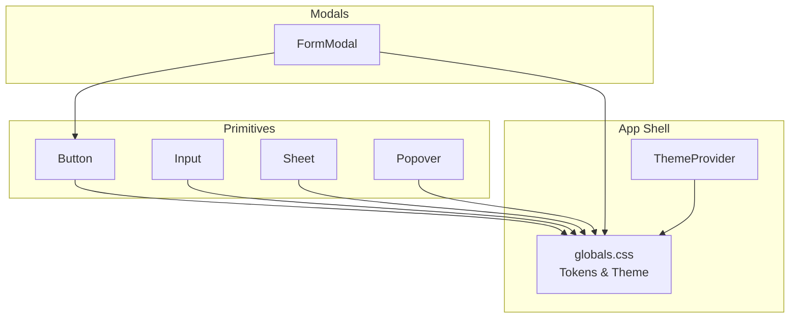
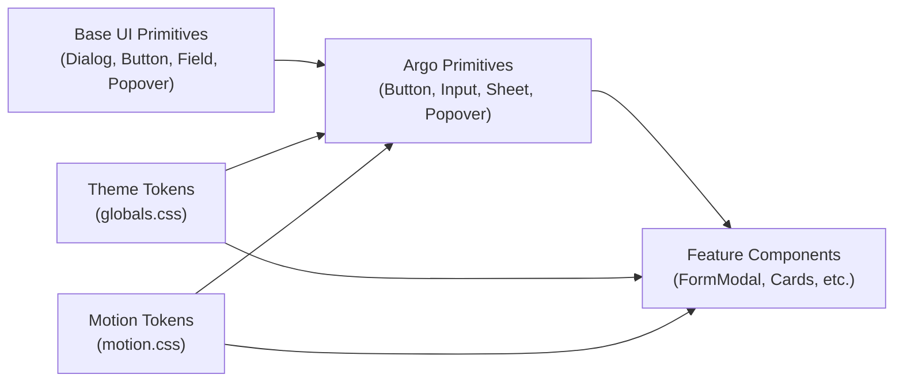
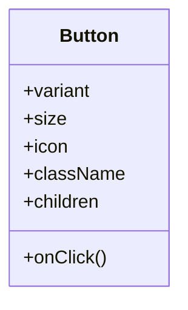
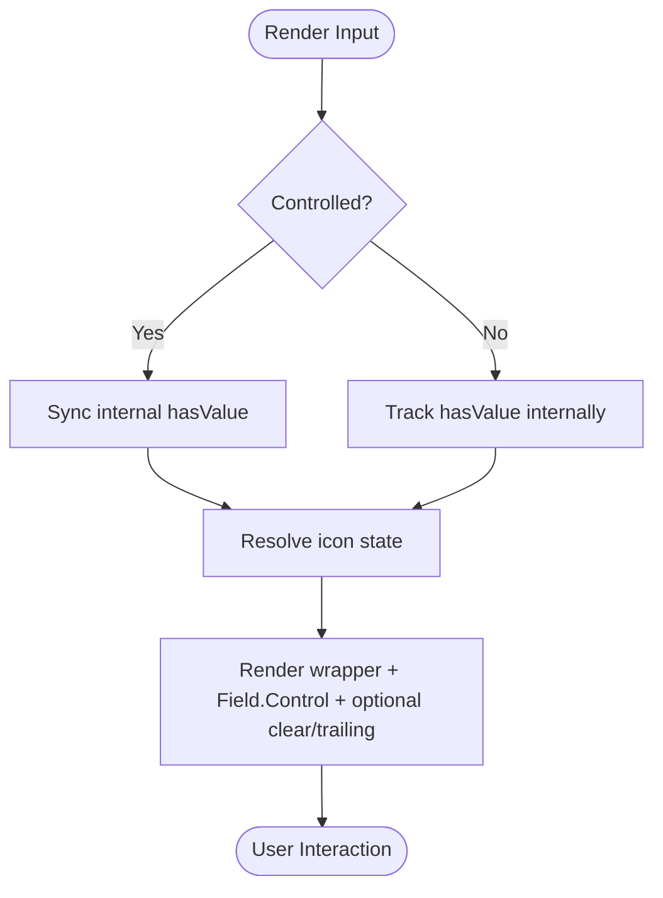
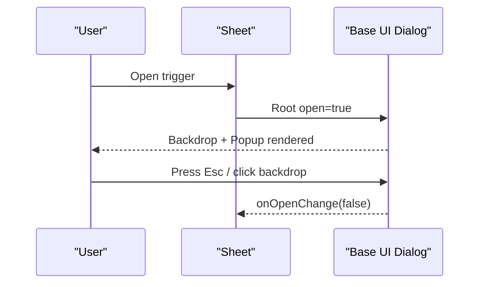
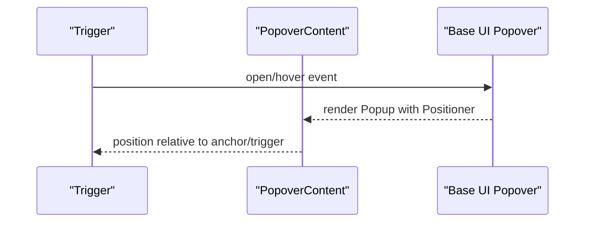
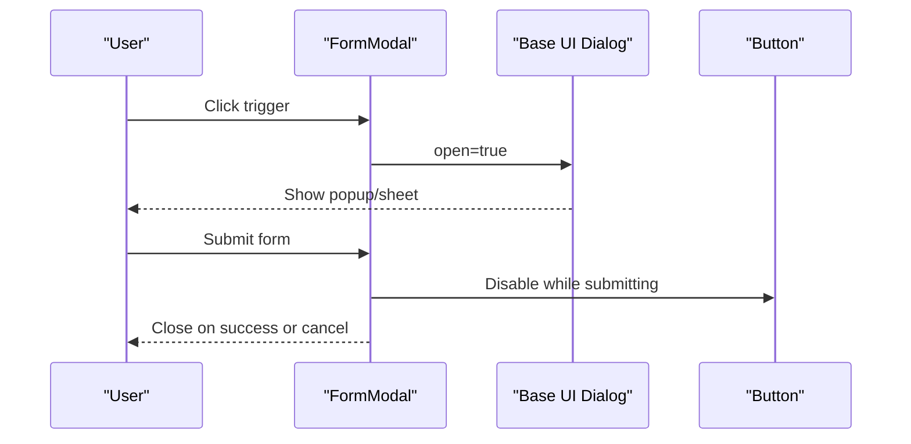
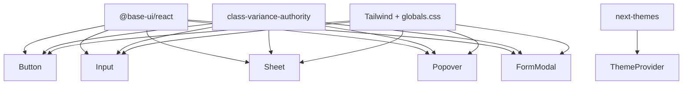
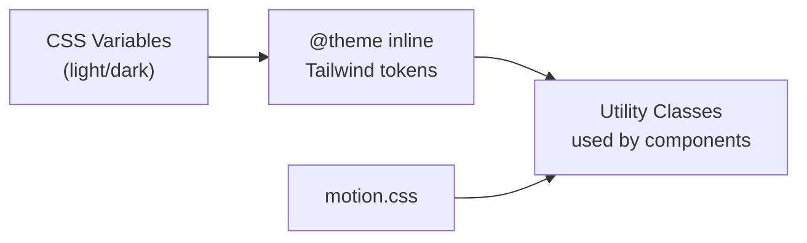

# Component Library

<cite>
**Referenced Files in This Document**
- [Button.tsx](file://src/components/ui/primitives/Button.tsx)
- [Input.tsx](file://src/components/ui/primitives/Input.tsx)
- [FormModal.tsx](file://src/components/ui/modals/FormModal.tsx)
- [Sheet.tsx](file://src/components/ui/primitives/Sheet.tsx)
- [Popover.tsx](file://src/components/ui/primitives/Popover.tsx)
- [index.ts](file://src/components/ui/index.ts)
- [globals.css](file://src/app/globals.css)
- [motion.css](file://src/styles/tokens/motion.css)
- [ThemeProvider.tsx](file://src/components/ThemeProvider.tsx)
- [package.json](file://package.json)
</cite>

## Table of Contents
1. [Introduction](#introduction)
2. [Project Structure](#project-structure)
3. [Core Components](#core-components)
4. [Architecture Overview](#architecture-overview)
5. [Detailed Component Analysis](#detailed-component-analysis)
6. [Dependency Analysis](#dependency-analysis)
7. [Performance Considerations](#performance-considerations)
8. [Troubleshooting Guide](#troubleshooting-guide)
9. [Conclusion](#conclusion)
10. [Appendices](#appendices)

## Introduction
This document describes the Argo component library and design system implemented in this repository. It focuses on primitive components (Button, Input, Sheet, Popover), feature-specific composition (FormModal), theming via Tailwind CSS with semantic tokens, accessibility patterns, responsive behavior, and guidelines for creating new components consistently.

## Project Structure
The UI layer is organized under src/components/ui with a clear separation:
- primitives: foundational building blocks (Button, Input, Sheet, Popover, etc.)
- modals: higher-level overlay components composed from primitives and Base UI primitives
- cards, dashboard, itinerary, map, navbar, skeletons, detail-views: feature-oriented compositions
- index.ts: a convenience barrel exporting commonly used components

**Diagram sources**
- [Button.tsx:1-132](file://src/components/ui/primitives/Button.tsx#L1-L132)
- [Input.tsx:1-513](file://src/components/ui/primitives/Input.tsx#L1-L513)
- [Sheet.tsx:1-97](file://src/components/ui/primitives/Sheet.tsx#L1-L97)
- [Popover.tsx:1-200](file://src/components/ui/primitives/Popover.tsx#L1-L200)
- [FormModal.tsx:1-224](file://src/components/ui/modals/FormModal.tsx#L1-L224)
- [globals.css:12-784](file://src/app/globals.css#L12-L784)
- [ThemeProvider.tsx:1-17](file://src/components/ThemeProvider.tsx#L1-L17)

**Section sources**
- [index.ts:1-46](file://src/components/ui/index.ts#L1-L46)
- [globals.css:12-784](file://src/app/globals.css#L12-L784)

## Core Components
This section documents the primitives that form the foundation of the design system.

- Button
  - Variants: primary, secondary, ghost, outline, dark
  - Sizes: xs, sm, md
  - Icon placement: none, leading, trailing, only
  - Visuals: layered fill, inset bevel, border ring; motion-aware transitions
  - Accessibility: focus-visible ring, disabled state, keyboard-friendly
  - See [Button.tsx:9-42](file://src/components/ui/primitives/Button.tsx#L9-L42) and [Button.tsx:48-67](file://src/components/ui/primitives/Button.tsx#L48-L67)

- Input
  - Variants: default, underline
  - Sizes: sm, md
  - Icon slots: none, leading, trailing, both (auto-resolved)
  - Features: controlled/uncontrolled value, clearable, aria-invalid support
  - DropdownSelector: presentational trigger or menu-backed selection
  - AddToInput: fixed leading/trailing icon layout
  - See [Input.tsx:11-70](file://src/components/ui/primitives/Input.tsx#L11-L70), [Input.tsx:93-123](file://src/components/ui/primitives/Input.tsx#L93-L123), [Input.tsx:280-405](file://src/components/ui/primitives/Input.tsx#L280-L405), [Input.tsx:407-503](file://src/components/ui/primitives/Input.tsx#L407-L503)

- Sheet
  - Responsive presentation: bottom sheet on phone, side drawer on tablet+
  - Backdrop, focus trap, scroll lock via Base UI Dialog
  - Accessible title/description via sr-only elements
  - See [Sheet.tsx:10-26](file://src/components/ui/primitives/Sheet.tsx#L10-L26), [Sheet.tsx:50-97](file://src/components/ui/primitives/Sheet.tsx#L50-L97)

- Popover
  - Trigger and content with optional hover-open and delay
  - Content styling: surface background, edge border, rounded corners, shadow
  - Optional directional arrow with automatic rotation
  - See [Popover.tsx:16-31](file://src/components/ui/primitives/Popover.tsx#L16-L31), [Popover.tsx:126-183](file://src/components/ui/primitives/Popover.tsx#L126-L183)

- FormModal (feature composition)
  - Built on Base UI Dialog with responsive mobile sheet-like behavior
  - Icon treatment: category-based rings/circles or sticker image
  - Header (title + description), separator, content slot, button group
  - Submitting state with spinner and label
  - See [FormModal.tsx:12-48](file://src/components/ui/modals/FormModal.tsx#L12-L48), [FormModal.tsx:78-224](file://src/components/ui/modals/FormModal.tsx#L78-L224)

**Section sources**
- [Button.tsx:9-132](file://src/components/ui/primitives/Button.tsx#L9-L132)
- [Input.tsx:11-513](file://src/components/ui/primitives/Input.tsx#L11-L513)
- [Sheet.tsx:10-97](file://src/components/ui/primitives/Sheet.tsx#L10-L97)
- [Popover.tsx:16-200](file://src/components/ui/primitives/Popover.tsx#L16-L200)
- [FormModal.tsx:12-224](file://src/components/ui/modals/FormModal.tsx#L12-L224)

## Architecture Overview
The design system follows a layered architecture:
- Primitives provide accessible, theme-aware building blocks using Base UI primitives and Tailwind CSS utilities.
- Feature components compose primitives to implement domain-specific UX (e.g., FormModal composes Button and Dialog).
- Theming is centralized in global CSS tokens mapped to Tailwind theme variables, enabling consistent color, typography, spacing, and motion across components.

**Diagram sources**
- [globals.css:12-784](file://src/app/globals.css#L12-L784)
- [motion.css:1-200](file://src/styles/tokens/motion.css#L1-L200)
- [Button.tsx:1-132](file://src/components/ui/primitives/Button.tsx#L1-L132)
- [Input.tsx:1-513](file://src/components/ui/primitives/Input.tsx#L1-L513)
- [Sheet.tsx:1-97](file://src/components/ui/primitives/Sheet.tsx#L1-L97)
- [Popover.tsx:1-200](file://src/components/ui/primitives/Popover.tsx#L1-L200)
- [FormModal.tsx:1-224](file://src/components/ui/modals/FormModal.tsx#L1-L224)

## Detailed Component Analysis

### Button
- Purpose: Primary interactive element with multiple visual variants and sizes.
- Props overview:
  - variant: primary | secondary | ghost | outline | dark
  - size: xs | sm | md
  - icon: none | leading | trailing | only
  - className, children, plus all Base UI Button props
- Styling:
  - Uses class-variance-authority for variant/size/icon combinations
  - Layered decoration for filled variants (background, inset bevel, top border ring)
  - Motion-aware transitions via CSS variables
- Accessibility:
  - Focus-visible ring and disabled states
  - Keyboard interaction handled by Base UI
- Usage pattern:
  - Wrap text or icons; use icon variants for compact actions

**Diagram sources**
- [Button.tsx:69-132](file://src/components/ui/primitives/Button.tsx#L69-L132)

**Section sources**
- [Button.tsx:9-132](file://src/components/ui/primitives/Button.tsx#L9-L132)

### Input
- Purpose: Text input with flexible icon slots, validation states, and optional dropdown selection.
- Props overview:
  - variant: default | underline
  - size: sm | md
  - icon, trailingIcon, iconClassName, trailingIconClassName, inputClassName
  - value/defaultValue for controlled/uncontrolled usage
  - clearable, onClear
  - showDropdown (deprecated alias to DropdownSelector)
  - aria-invalid and standard field props
- Behavior:
  - Auto-detects icon state to adjust padding
  - Clearable control triggers input/change events programmatically
  - DropdownSelector integrates Base UI Menu when options provided
- Accessibility:
  - aria-invalid propagated
  - Clear button has aria-label
- Usage pattern:
  - Use Input for free-form text
  - Use DropdownSelector for single-select lists
  - Use AddToInput for fixed leading/trailing action layouts

**Diagram sources**
- [Input.tsx:148-168](file://src/components/ui/primitives/Input.tsx#L148-L168)
- [Input.tsx:213-275](file://src/components/ui/primitives/Input.tsx#L213-L275)

**Section sources**
- [Input.tsx:11-513](file://src/components/ui/primitives/Input.tsx#L11-L513)

### Sheet
- Purpose: Responsive overlay container (bottom sheet on phone, side drawer on desktop/tablet).
- Props overview:
  - open, onOpenChange
  - side: bottom | right | left (auto-resolved based on breakpoint if omitted)
  - title, description (sr-only for accessibility)
  - trigger, children, className
- Behavior:
  - Backdrop dismissal, focus trap, scroll lock via Base UI Dialog
  - Mobile-safe area insets applied
- Accessibility:
  - Title/description exposed to assistive tech
- Usage pattern:
  - Wrap any content as children; control visibility externally

**Diagram sources**
- [Sheet.tsx:57-97](file://src/components/ui/primitives/Sheet.tsx#L57-L97)

**Section sources**
- [Sheet.tsx:10-97](file://src/components/ui/primitives/Sheet.tsx#L10-L97)

### Popover
- Purpose: Floating content anchored to a trigger with optional hover-open and directional arrow.
- Props overview:
  - Trigger: openOnHover, delay
  - Content: sideOffset, align, side, arrow, collisionPadding, anchor
- Behavior:
  - Positioner handles collision and offset
  - Arrow rotates automatically based on data-side
- Accessibility:
  - Focus management delegated to Base UI
- Usage pattern:
  - Use for contextual help, tooltips, or small panels

**Diagram sources**
- [Popover.tsx:104-121](file://src/components/ui/primitives/Popover.tsx#L104-L121)
- [Popover.tsx:126-183](file://src/components/ui/primitives/Popover.tsx#L126-L183)

**Section sources**
- [Popover.tsx:16-200](file://src/components/ui/primitives/Popover.tsx#L16-L200)

### FormModal
- Purpose: Accessible modal dialog for forms with category-themed iconography and responsive mobile behavior.
- Props overview:
  - trigger, open, onOpenChange
  - variant (for icon colors): link | collection | itinerary | location | brand | neutral
  - icon or stickerUrl
  - title, description, children (form content slot)
  - cancelLabel, submitLabel, submittingLabel
  - onSubmit, onCancel, cancelCloses, submitDisabled, isSubmitting
- Behavior:
  - Mobile: full-width bottom sheet with handle; desktop: centered popup
  - Integrates Base UI Dialog for focus management and backdrop
  - Button group uses Button primitive
- Accessibility:
  - Dialog semantics, titles, descriptions, and keyboard navigation via Base UI
- Usage pattern:
  - Wrap form fields in children; manage submission state with isSubmitting

**Diagram sources**
- [FormModal.tsx:78-224](file://src/components/ui/modals/FormModal.tsx#L78-L224)

**Section sources**
- [FormModal.tsx:12-224](file://src/components/ui/modals/FormModal.tsx#L12-L224)

## Dependency Analysis
- External dependencies:
  - @base-ui/react provides accessible primitives (Dialog, Button, Field, Popover, Menu)
  - class-variance-authority drives variant/size/icon combinations
  - lucide-react supplies icons
  - next-themes powers theme context
  - Tailwind CSS v4 with custom theme tokens defines colors, typography, and effects
- Internal coupling:
  - Feature components depend on primitives (e.g., FormModal depends on Button)
  - All primitives consume semantic tokens from globals.css via Tailwind classes
  - Motion tokens are referenced for consistent timing/easing

**Diagram sources**
- [package.json:12-33](file://package.json#L12-L33)
- [globals.css:12-784](file://src/app/globals.css#L12-L784)
- [Button.tsx:1-132](file://src/components/ui/primitives/Button.tsx#L1-L132)
- [Input.tsx:1-513](file://src/components/ui/primitives/Input.tsx#L1-L513)
- [Sheet.tsx:1-97](file://src/components/ui/primitives/Sheet.tsx#L1-L97)
- [Popover.tsx:1-200](file://src/components/ui/primitives/Popover.tsx#L1-L200)
- [FormModal.tsx:1-224](file://src/components/ui/modals/FormModal.tsx#L1-L224)
- [ThemeProvider.tsx:1-17](file://src/components/ThemeProvider.tsx#L1-L17)

**Section sources**
- [package.json:12-33](file://package.json#L12-L33)
- [globals.css:12-784](file://src/app/globals.css#L12-L784)

## Performance Considerations
- Prefer primitives for common interactions to reduce duplication and ensure optimized rendering.
- Use class-variance-authority to minimize conditional class logic at runtime.
- Keep large overlays (modals/sheets) lightweight; defer heavy content until opened.
- Leverage Base UI’s focus management and portal rendering to avoid reflows outside the viewport.
- Use motion tokens for consistent, GPU-friendly transitions.

[No sources needed since this section provides general guidance]

## Troubleshooting Guide
- Input not clearing:
  - Ensure clearable is true and onClear is either provided or the internal ref mechanism can set value and dispatch input/change events.
  - See [Input.tsx:170-186](file://src/components/ui/primitives/Input.tsx#L170-L186)
- DropdownSelector not opening:
  - Provide options array to enable menu mode; otherwise it renders as a presentational trigger.
  - See [Input.tsx:379-401](file://src/components/ui/primitives/Input.tsx#L379-L401)
- Modal not closing on Escape:
  - Confirm Base UI Dialog is used and open state is controlled; see [FormModal.tsx:101-116](file://src/components/ui/modals/FormModal.tsx#L101-L116)
- Sheet not responsive:
  - Verify breakpoint hook returns expected values; side auto-resolves based on isPhone.
  - See [Sheet.tsx:67-69](file://src/components/ui/primitives/Sheet.tsx#L67-L69)
- Popover arrow misaligned:
  - Adjust sideOffset or collisionPadding; arrow rotation relies on data-side attributes.
  - See [Popover.tsx:141-177](file://src/components/ui/primitives/Popover.tsx#L141-L177)

**Section sources**
- [Input.tsx:170-186](file://src/components/ui/primitives/Input.tsx#L170-L186)
- [Input.tsx:379-401](file://src/components/ui/primitives/Input.tsx#L379-L401)
- [FormModal.tsx:101-116](file://src/components/ui/modals/FormModal.tsx#L101-L116)
- [Sheet.tsx:67-69](file://src/components/ui/primitives/Sheet.tsx#L67-L69)
- [Popover.tsx:141-177](file://src/components/ui/primitives/Popover.tsx#L141-L177)

## Conclusion
The Argo component library provides a cohesive, accessible, and theme-driven UI system built on Base UI and Tailwind CSS. Primitives offer consistent interaction patterns and visual language, while feature components like FormModal demonstrate composition strategies. The tokenized theme ensures consistency across surfaces, content, edges, actions, categories, and typography, with motion tokens unifying animations.

[No sources needed since this section summarizes without analyzing specific files]

## Appendices

### Design Tokens and Theming
- Semantic tokens define Surface, Content, Glyph, Edge, Action, Category, Shadows, Typography, and Calendar colors.
- Light and dark themes are defined via CSS variables and mapped into Tailwind’s @theme inline block.
- Motion tokens are imported for consistent animation timing and easing.

**Diagram sources**
- [globals.css:12-784](file://src/app/globals.css#L12-L784)
- [motion.css:1-200](file://src/styles/tokens/motion.css#L1-L200)

**Section sources**
- [globals.css:12-784](file://src/app/globals.css#L12-L784)
- [motion.css:1-200](file://src/styles/tokens/motion.css#L1-L200)

### Creating New Components: Guidelines
- Composition hierarchy:
  - Start with a primitive if reusable across features; otherwise build a feature-specific component that composes primitives.
- Styling:
  - Use Tailwind utility classes and semantic tokens; avoid hard-coded colors.
  - For multi-variant components, prefer class-variance-authority.
- Accessibility:
  - Rely on Base UI primitives for complex behaviors (Dialog, Popover, Field).
  - Ensure proper roles, labels, and keyboard navigation.
- Responsiveness:
  - Use breakpoints and mobile-first considerations; test bottom-sheet vs side-drawer patterns.
- Testing strategy:
  - Unit tests: verify prop handling, state changes, and event callbacks.
  - Integration tests: validate user flows (open/close, select, submit).
  - Visual regression: snapshot key variants and responsive states.
  - Accessibility audits: check focus order, ARIA attributes, and screen reader announcements.

[No sources needed since this section provides general guidance]

### Example Usage Patterns
- Button:
  - Primary action: use variant="primary", size="md"
  - Icon-only: use icon="only" with appropriate size
  - See [Button.tsx:69-132](file://src/components/ui/primitives/Button.tsx#L69-L132)
- Input:
  - Controlled text field with clearable and validation: set value, onChange, aria-invalid
  - Dropdown selection: pass options and onValueChange to DropdownSelector
  - See [Input.tsx:93-123](file://src/components/ui/primitives/Input.tsx#L93-L123), [Input.tsx:280-405](file://src/components/ui/primitives/Input.tsx#L280-L405)
- Sheet:
  - Control open state; rely on Base UI for focus and backdrop
  - See [Sheet.tsx:57-97](file://src/components/ui/primitives/Sheet.tsx#L57-L97)
- Popover:
  - Hover-triggered help panel with arrow pointing to target
  - See [Popover.tsx:104-121](file://src/components/ui/primitives/Popover.tsx#L104-L121), [Popover.tsx:126-183](file://src/components/ui/primitives/Popover.tsx#L126-L183)
- FormModal:
  - Wrap form fields in children; manage isSubmitting and submitDisabled
  - See [FormModal.tsx:78-224](file://src/components/ui/modals/FormModal.tsx#L78-L224)

**Section sources**
- [Button.tsx:69-132](file://src/components/ui/primitives/Button.tsx#L69-L132)
- [Input.tsx:93-405](file://src/components/ui/primitives/Input.tsx#L93-L405)
- [Sheet.tsx:57-97](file://src/components/ui/primitives/Sheet.tsx#L57-L97)
- [Popover.tsx:104-183](file://src/components/ui/primitives/Popover.tsx#L104-L183)
- [FormModal.tsx:78-224](file://src/components/ui/modals/FormModal.tsx#L78-L224)