# Component Library

<cite>
**Referenced Files in This Document**
- [index.ts](file://src/components/ui/index.ts)
- [ThemeProvider.tsx](file://src/components/ThemeProvider.tsx)
- [Button.tsx](file://src/components/ui/primitives/Button.tsx)
- [Input.tsx](file://src/components/ui/primitives/Input.tsx)
- [Menu.tsx](file://src/components/ui/primitives/Menu.tsx)
- [Popover.tsx](file://src/components/ui/primitives/Popover.tsx)
- [Sheet.tsx](file://src/components/ui/primitives/Sheet.tsx)
- [Toast.tsx](file://src/components/ui/primitives/Toast.tsx)
- [BaseCard.tsx](file://src/components/ui/cards/BaseCard.tsx)
- [ItineraryCard.tsx](file://src/components/ui/cards/ItineraryCard.tsx)
- [FormModal.tsx](file://src/components/ui/modals/FormModal.tsx)
</cite>

## Table of Contents
1. [Introduction](#introduction)
2. [Project Structure](#project-structure)
3. [Core Components](#core-components)
4. [Architecture Overview](#architecture-overview)
5. [Detailed Component Analysis](#detailed-component-analysis)
6. [Dependency Analysis](#dependency-analysis)
7. [Performance Considerations](#performance-considerations)
8. [Troubleshooting Guide](#troubleshooting-guide)
9. [Conclusion](#conclusion)
10. [Appendices](#appendices)

## Introduction
This document describes the comprehensive UI component library used across the application. It covers the design system principles, theming approach, and the architecture that unifies primitive, compound, and feature-specific components. You will find usage guidance, prop interfaces, styling options, accessibility considerations, and best practices for creating new components while maintaining consistency.

## Project Structure
The component library is organized by responsibility:
- Primitives: low-level building blocks (Button, Input, Menu, Popover, Sheet, Toast).
- Cards: compound containers with shared shell and media handling.
- Modals: dialog-based overlays for forms and confirmations.
- Utilities and theme: ThemeProvider and shared utilities.

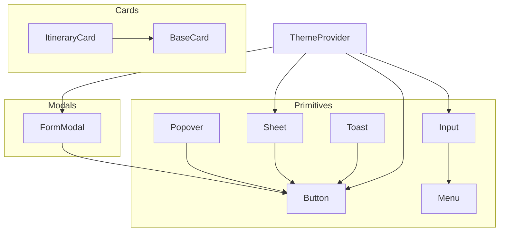

**Diagram sources**
- [Button.tsx:1-132](file://src/components/ui/primitives/Button.tsx#L1-L132)
- [Input.tsx:1-513](file://src/components/ui/primitives/Input.tsx#L1-L513)
- [Menu.tsx:1-384](file://src/components/ui/primitives/Menu.tsx#L1-L384)
- [Popover.tsx:1-200](file://src/components/ui/primitives/Popover.tsx#L1-L200)
- [Sheet.tsx:1-97](file://src/components/ui/primitives/Sheet.tsx#L1-L97)
- [Toast.tsx:1-174](file://src/components/ui/primitives/Toast.tsx#L1-L174)
- [BaseCard.tsx:1-211](file://src/components/ui/cards/BaseCard.tsx#L1-L211)
- [ItineraryCard.tsx:1-55](file://src/components/ui/cards/ItineraryCard.tsx#L1-L55)
- [FormModal.tsx:1-224](file://src/components/ui/modals/FormModal.tsx#L1-L224)
- [ThemeProvider.tsx:1-17](file://src/components/ThemeProvider.tsx#L1-L17)

**Section sources**
- [index.ts:1-46](file://src/components/ui/index.ts#L1-L46)

## Core Components
This section summarizes the key primitives and their responsibilities.

- Button
  - Purpose: Primary interactive element with variants, sizes, and icon placement.
  - Variants: primary, secondary, ghost, outline, dark.
  - Sizes: xs, sm, md; icon modes: none, leading, trailing, only.
  - Accessibility: focus-visible ring, disabled state, keyboard support via Base UI.
  - Styling: class-variance-authority-driven classes, layered decoration for filled variants.

- Input
  - Purpose: Text input with leading/trailing icons, clearable behavior, and dropdown selector mode.
  - Variants: default, underline; sizes: sm, md; icon states computed automatically.
  - Controlled/uncontrolled value handling; aria-invalid support.
  - DropdownSelector: selectable menu integration when options are provided.

- Menu
  - Purpose: Accessible dropdown menus with items, separators, and descriptive items.
  - Features: alignment, side, offset, collision padding, hover/openOnHover on triggers.
  - Styles: consistent item sizing, selected state, destructive variant.

- Popover
  - Purpose: Floating content anchored to a trigger with optional arrow and positioning controls.
  - Options: side, align, sideOffset, collisionPadding, anchor, openOnHover, delay.

- Sheet
  - Purpose: Responsive overlay drawer/modal. Bottom sheet on phone, side drawer on larger screens.
  - ARIA: title/description exposed via sr-only elements; backdrop-dismiss and focus trap via Base UI.

- Toast
  - Purpose: Non-blocking notifications with auto-dismiss progress bar, thumbnails, actions, and pause/resume on hover.
  - Accessibility: role alert/status, aria-live regions.

- BaseCard and ItineraryCard
  - BaseCard: shared card shell with media area, header label, category badge, action menu, selection states, and link/button behavior.
  - ItineraryCard: concrete card composing BaseCard with CardMedia.

- FormModal
  - Purpose: Dialog form wrapper with icon/sticker area, title/description, form slot, cancel/submit buttons, loading state, and responsive mobile sheet-like layout.

**Section sources**
- [Button.tsx:9-132](file://src/components/ui/primitives/Button.tsx#L9-L132)
- [Input.tsx:11-123](file://src/components/ui/primitives/Input.tsx#L11-L123)
- [Menu.tsx:16-183](file://src/components/ui/primitives/Menu.tsx#L16-L183)
- [Popover.tsx:16-88](file://src/components/ui/primitives/Popover.tsx#L16-L88)
- [Sheet.tsx:10-48](file://src/components/ui/primitives/Sheet.tsx#L10-L48)
- [Toast.tsx:13-174](file://src/components/ui/primitives/Toast.tsx#L13-L174)
- [BaseCard.tsx:13-50](file://src/components/ui/cards/BaseCard.tsx#L13-L50)
- [ItineraryCard.tsx:8-28](file://src/components/ui/cards/ItineraryCard.tsx#L8-L28)
- [FormModal.tsx:12-76](file://src/components/ui/modals/FormModal.tsx#L12-L76)

## Architecture Overview
The library follows a layered architecture:
- Primitives provide accessible, theme-aware building blocks built on Base UI and styled with utility classes and CSS variables.
- Compound components compose primitives to implement higher-level UX patterns (cards, modals).
- Theming is centralized via ThemeProvider using next-themes, driving CSS variables for motion and colors.

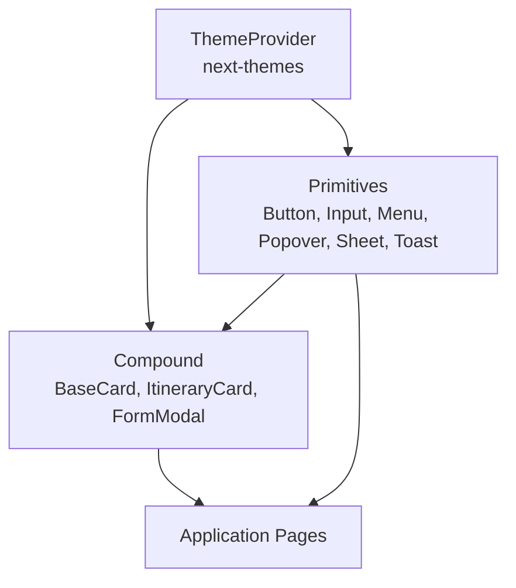

**Diagram sources**
- [ThemeProvider.tsx:1-17](file://src/components/ThemeProvider.tsx#L1-L17)
- [Button.tsx:1-132](file://src/components/ui/primitives/Button.tsx#L1-L132)
- [Input.tsx:1-513](file://src/components/ui/primitives/Input.tsx#L1-L513)
- [BaseCard.tsx:1-211](file://src/components/ui/cards/BaseCard.tsx#L1-L211)
- [FormModal.tsx:1-224](file://src/components/ui/modals/FormModal.tsx#L1-L224)

## Detailed Component Analysis

### Button
- Props
  - Inherits Base UI button props plus:
    - variant: primary | secondary | ghost | outline | dark
    - size: xs | sm | md
    - icon: none | leading | trailing | only
    - className, children
- Styling
  - Uses cva for variant/size/icon combinations; filled variants use layered background, inset bevel, and border ring for crisp edges.
- Accessibility
  - Focus-visible ring, disabled state, keyboard interaction handled by Base UI.

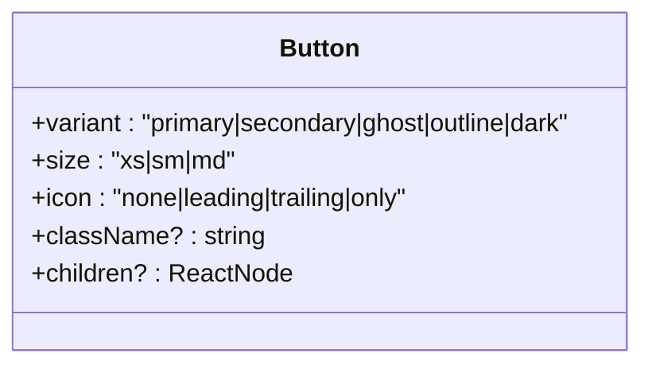

**Diagram sources**
- [Button.tsx:69-132](file://src/components/ui/primitives/Button.tsx#L69-L132)

**Section sources**
- [Button.tsx:9-132](file://src/components/ui/primitives/Button.tsx#L9-L132)

### Input
- Props
  - Inherits Field.Control props plus:
    - variant: default | underline
    - size: sm | md
    - icon: leading | trailing | both | none (computed)
    - hasValue: true | false (computed)
    - value/defaultValue, placeholder, onChange
    - clearable, onClear
    - showDropdown (deprecated; delegates to DropdownSelector)
    - trailingIcon, icon, iconClassName, inputClassName, trailingIconClassName
    - aria-invalid
- Behavior
  - Controlled/uncontrolled value sync; automatic hasValue detection; clear button renders when clearable and hasValue.
  - When showDropdown is true, renders DropdownSelector which can optionally open a real Menu when options are provided.

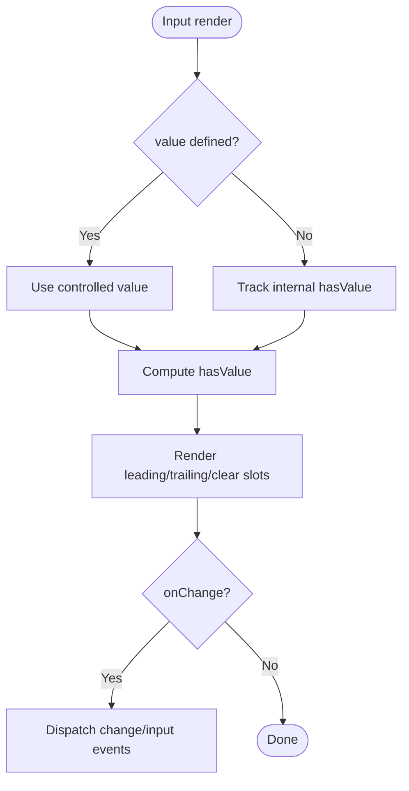

**Diagram sources**
- [Input.tsx:148-186](file://src/components/ui/primitives/Input.tsx#L148-L186)
- [Input.tsx:241-275](file://src/components/ui/primitives/Input.tsx#L241-L275)

**Section sources**
- [Input.tsx:11-123](file://src/components/ui/primitives/Input.tsx#L11-L123)
- [Input.tsx:148-275](file://src/components/ui/primitives/Input.tsx#L148-L275)
- [Input.tsx:284-405](file://src/components/ui/primitives/Input.tsx#L284-L405)

### Menu
- Components
  - Menu, MenuTrigger, MenuContent, MenuItem, DescriptiveMenuItem, MenuSeparator
- Props highlights
  - MenuContent: align, side, sideOffset, positionerClassName
  - MenuItem: size, icon, variant, selected, leadingIcon, trailingIcon
  - DescriptiveMenuItem: title, description, leadingIcon
- Behavior
  - Positioning via Base UI with collision padding; highlight/selected states; destructive variant for actions.

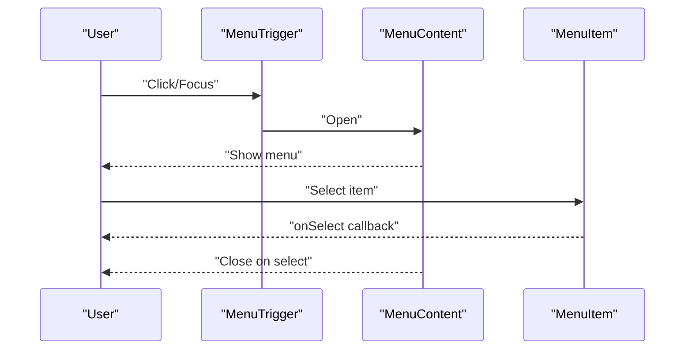

**Diagram sources**
- [Menu.tsx:192-241](file://src/components/ui/primitives/Menu.tsx#L192-L241)
- [Menu.tsx:246-301](file://src/components/ui/primitives/Menu.tsx#L246-L301)

**Section sources**
- [Menu.tsx:16-183](file://src/components/ui/primitives/Menu.tsx#L16-L183)
- [Menu.tsx:192-384](file://src/components/ui/primitives/Menu.tsx#L192-L384)

### Popover
- Components
  - Popover, PopoverTrigger, PopoverContent
- Props highlights
  - PopoverTrigger: openOnHover, delay
  - PopoverContent: side, align, sideOffset, collisionPadding, anchor, arrow
- Behavior
  - Portal rendering; optional directional arrow; focus management via Base UI.

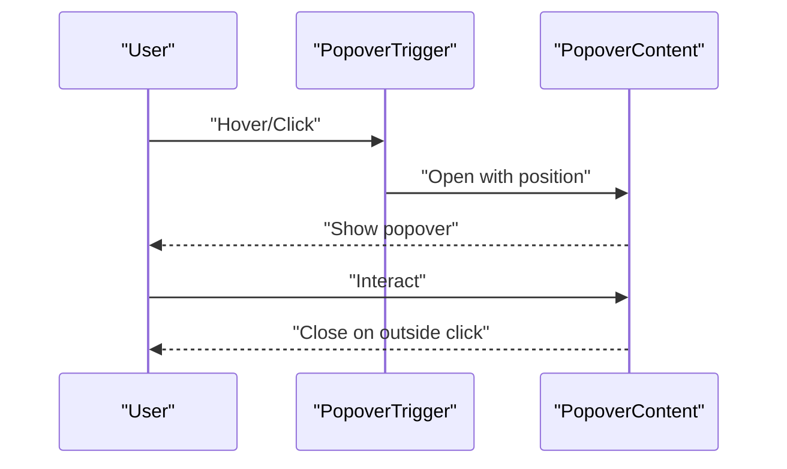

**Diagram sources**
- [Popover.tsx:97-121](file://src/components/ui/primitives/Popover.tsx#L97-L121)
- [Popover.tsx:126-183](file://src/components/ui/primitives/Popover.tsx#L126-L183)

**Section sources**
- [Popover.tsx:16-88](file://src/components/ui/primitives/Popover.tsx#L16-L88)
- [Popover.tsx:97-183](file://src/components/ui/primitives/Popover.tsx#L97-L183)

### Sheet
- Props
  - open, onOpenChange, side (bottom/right/left), title, description, trigger, children, className
- Behavior
  - Responsive presentation: bottom sheet on phone, side drawer on larger screens; accessible via Base UI Dialog.

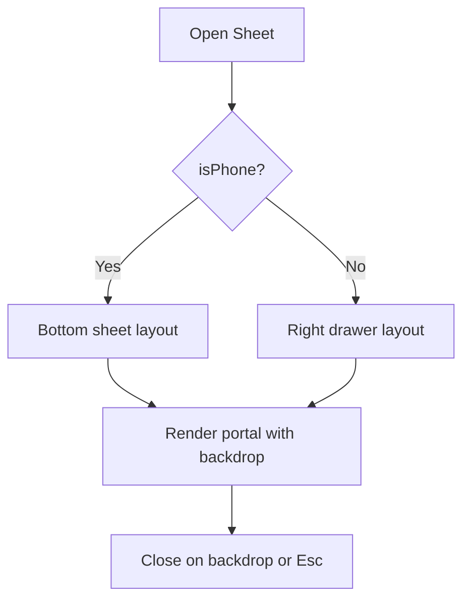

**Diagram sources**
- [Sheet.tsx:57-91](file://src/components/ui/primitives/Sheet.tsx#L57-L91)

**Section sources**
- [Sheet.tsx:10-48](file://src/components/ui/primitives/Sheet.tsx#L10-L48)
- [Sheet.tsx:57-91](file://src/components/ui/primitives/Sheet.tsx#L57-L91)

### Toast
- Container
  - ToastContainer renders a portal at the page root with AnimatePresence for enter/exit animations.
- Props (via context)
  - title, description, thumbnail, action, duration, variant, id
- Behavior
  - Auto-dismiss with progress bar; pause/resume on hover; role/alert semantics for errors.

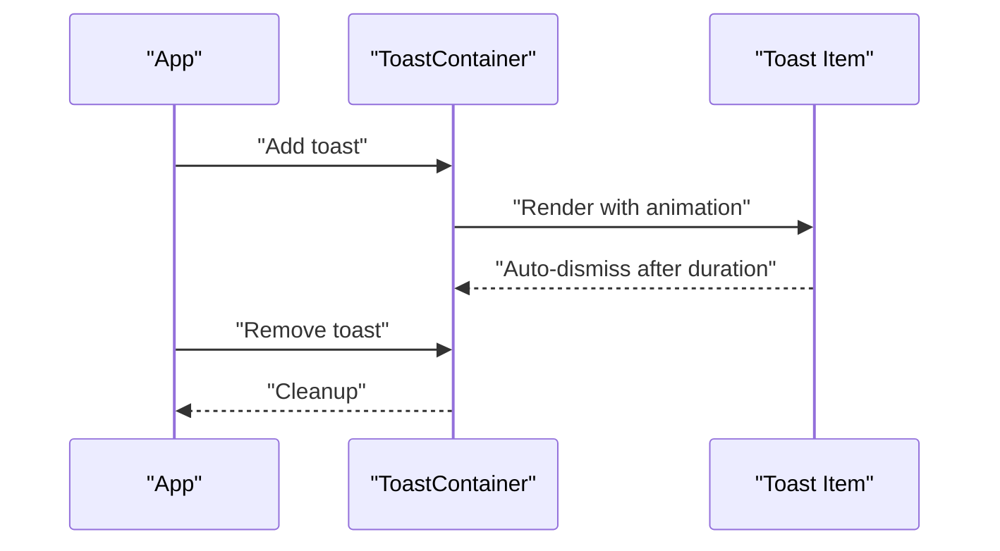

**Diagram sources**
- [Toast.tsx:47-174](file://src/components/ui/primitives/Toast.tsx#L47-L174)

**Section sources**
- [Toast.tsx:13-174](file://src/components/ui/primitives/Toast.tsx#L13-L174)

### BaseCard and ItineraryCard
- BaseCard
  - Provides media area, header with category badge and label, optional kebab menu with actions, selection styles, and link/button behavior with keyboard support.
- ItineraryCard
  - Composes BaseCard with CardMedia and itinerary-specific icon variant.

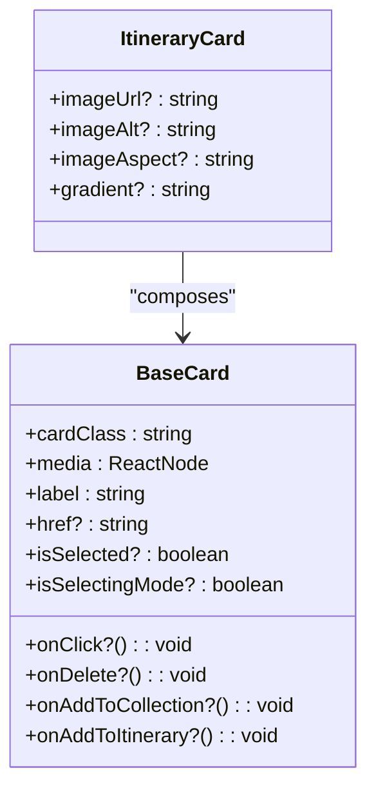

**Diagram sources**
- [BaseCard.tsx:20-50](file://src/components/ui/cards/BaseCard.tsx#L20-L50)
- [ItineraryCard.tsx:8-28](file://src/components/ui/cards/ItineraryCard.tsx#L8-L28)

**Section sources**
- [BaseCard.tsx:13-211](file://src/components/ui/cards/BaseCard.tsx#L13-L211)
- [ItineraryCard.tsx:8-55](file://src/components/ui/cards/ItineraryCard.tsx#L8-L55)

### FormModal
- Props
  - trigger, open, onOpenChange, variant, icon, stickerUrl, title, description, children, cancelLabel, submitLabel, submittingLabel, onSubmit, onCancel, cancelCloses, submitDisabled, isSubmitting
- Behavior
  - Dialog-based modal with responsive mobile sheet-like layout; supports submitting state with spinner; accessible title/description via Base UI.

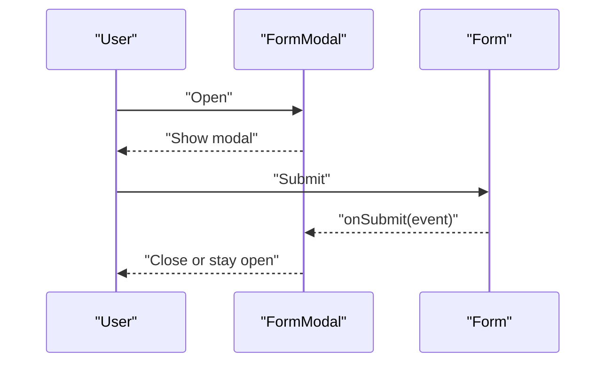

**Diagram sources**
- [FormModal.tsx:78-217](file://src/components/ui/modals/FormModal.tsx#L78-L217)

**Section sources**
- [FormModal.tsx:12-76](file://src/components/ui/modals/FormModal.tsx#L12-L76)
- [FormModal.tsx:78-224](file://src/components/ui/modals/FormModal.tsx#L78-L224)

## Dependency Analysis
Key dependencies and relationships:
- Base UI provides accessible primitives (Dialog, Menu, Popover, Field, Button).
- class-variance-authority drives variant composition for consistent styling.
- next-themes powers ThemeProvider for theme context.
- Utility functions (cn) merge classes consistently.

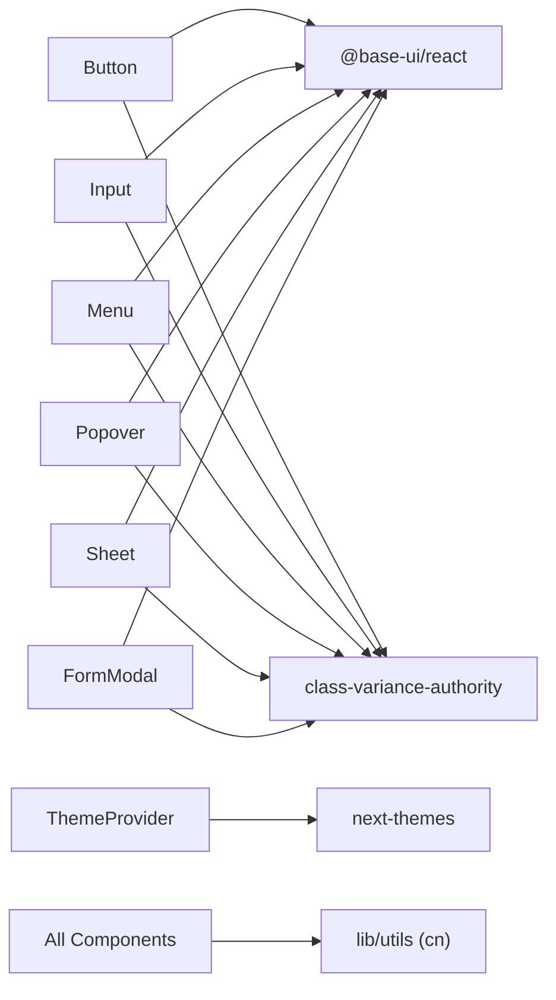

**Diagram sources**
- [Button.tsx:1-10](file://src/components/ui/primitives/Button.tsx#L1-L10)
- [Input.tsx:1-10](file://src/components/ui/primitives/Input.tsx#L1-L10)
- [Menu.tsx:1-10](file://src/components/ui/primitives/Menu.tsx#L1-L10)
- [Popover.tsx:1-10](file://src/components/ui/primitives/Popover.tsx#L1-L10)
- [Sheet.tsx:1-10](file://src/components/ui/primitives/Sheet.tsx#L1-L10)
- [FormModal.tsx:1-10](file://src/components/ui/modals/FormModal.tsx#L1-L10)
- [ThemeProvider.tsx:1-17](file://src/components/ThemeProvider.tsx#L1-L17)

**Section sources**
- [Button.tsx:1-10](file://src/components/ui/primitives/Button.tsx#L1-L10)
- [Input.tsx:1-10](file://src/components/ui/primitives/Input.tsx#L1-L10)
- [Menu.tsx:1-10](file://src/components/ui/primitives/Menu.tsx#L1-L10)
- [Popover.tsx:1-10](file://src/components/ui/primitives/Popover.tsx#L1-L10)
- [Sheet.tsx:1-10](file://src/components/ui/primitives/Sheet.tsx#L1-L10)
- [FormModal.tsx:1-10](file://src/components/ui/modals/FormModal.tsx#L1-L10)
- [ThemeProvider.tsx:1-17](file://src/components/ThemeProvider.tsx#L1-L17)

## Performance Considerations
- Prefer primitives for small, reusable pieces; compose into compound components to avoid duplication.
- Use cva variants to minimize conditional class logic and keep render paths predictable.
- Leverage Base UI’s portals and positioning to reduce reflows in overlays.
- For lists and heavy cards, consider lazy rendering and memoization where appropriate.
- Respect reduced motion preferences (e.g., Toast respects prefers-reduced-motion).

[No sources needed since this section provides general guidance]

## Troubleshooting Guide
Common issues and resolutions:
- Input not clearing
  - Ensure clearable is enabled and onClear is either provided or the internal clear path is reachable; verify hasValue state updates.
  - Section sources
    - [Input.tsx:170-186](file://src/components/ui/primitives/Input.tsx#L170-L186)
- DropdownSelector not opening menu
  - Confirm options array is provided; without options it acts as a presentational trigger.
  - Section sources
    - [Input.tsx:379-401](file://src/components/ui/primitives/Input.tsx#L379-L401)
- Menu items not focusing correctly
  - Ensure MenuContent is within Menu and items are direct children; check collisionPadding if clipping occurs.
  - Section sources
    - [Menu.tsx:214-241](file://src/components/ui/primitives/Menu.tsx#L214-L241)
- Popover arrow clipped
  - Increase sideOffset or adjust collisionPadding; ensure parent containers do not clip overflow.
  - Section sources
    - [Popover.tsx:126-183](file://src/components/ui/primitives/Popover.tsx#L126-L183)
- Sheet not closing on Escape
  - Verify open state is controlled and onOpenChange updates state; Base UI handles focus trap and escape.
  - Section sources
    - [Sheet.tsx:57-91](file://src/components/ui/primitives/Sheet.tsx#L57-L91)
- Toast not dismissing
  - Check duration and paused state; ensure ToastContainer is mounted and context provider is available.
  - Section sources
    - [Toast.tsx:47-174](file://src/components/ui/primitives/Toast.tsx#L47-L174)

## Conclusion
This component library provides a cohesive, accessible, and theme-aware foundation for building consistent user interfaces. By combining primitives with compound patterns, teams can scale features rapidly while preserving design integrity. Follow the guidelines below to maintain consistency and accessibility across the application.

## Appendices

### Design System Principles
- Consistency through primitives: reuse Button, Input, Menu, Popover, Sheet, Toast rather than ad-hoc implementations.
- Variant-driven styling: define all visual states via cva variants to keep changes localized and testable.
- Accessibility first: rely on Base UI for focus management, ARIA attributes, and keyboard interactions.
- Theme via CSS variables: centralize colors, motion, and spacing tokens through ThemeProvider and utility classes.

### Theming Approach
- ThemeProvider wraps the app with next-themes, enabling light/dark themes and CSS variable consumption.
- Motion tokens and color tokens are consumed via CSS variables referenced in component classes.

**Section sources**
- [ThemeProvider.tsx:1-17](file://src/components/ThemeProvider.tsx#L1-L17)

### Prop Interfaces Summary
- Button: variant, size, icon, className, children, plus Base UI button props.
- Input: variant, size, icon, hasValue, value/defaultValue, placeholder, onChange, clearable, onClear, trailingIcon, icon, iconClassName, inputClassName, trailingIconClassName, aria-invalid.
- Menu: Menu, MenuTrigger, MenuContent (align, side, sideOffset, positionerClassName), MenuItem (size, icon, variant, selected, leadingIcon, trailingIcon), DescriptiveMenuItem (title, description, leadingIcon), MenuSeparator.
- Popover: Popover, PopoverTrigger (openOnHover, delay), PopoverContent (side, align, sideOffset, collisionPadding, anchor, arrow).
- Sheet: open, onOpenChange, side, title, description, trigger, children, className.
- Toast: container renders from context; individual toasts include title, description, thumbnail, action, duration, variant, id.
- BaseCard: cardClass, media, label, href, onClick, onDelete, onAddToCollection, onAddToItinerary, disabled, isSelected, isSelectingMode.
- ItineraryCard: imageUrl, imageAlt, imageAspect, gradient, plus inherited BaseCard props.
- FormModal: trigger, open, onOpenChange, variant, icon, stickerUrl, title, description, children, cancelLabel, submitLabel, submittingLabel, onSubmit, onCancel, cancelCloses, submitDisabled, isSubmitting.

**Section sources**
- [Button.tsx:69-132](file://src/components/ui/primitives/Button.tsx#L69-L132)
- [Input.tsx:93-123](file://src/components/ui/primitives/Input.tsx#L93-L123)
- [Menu.tsx:130-183](file://src/components/ui/primitives/Menu.tsx#L130-L183)
- [Popover.tsx:57-88](file://src/components/ui/primitives/Popover.tsx#L57-L88)
- [Sheet.tsx:30-48](file://src/components/ui/primitives/Sheet.tsx#L30-L48)
- [BaseCard.tsx:20-50](file://src/components/ui/cards/BaseCard.tsx#L20-L50)
- [ItineraryCard.tsx:8-28](file://src/components/ui/cards/ItineraryCard.tsx#L8-L28)
- [FormModal.tsx:50-76](file://src/components/ui/modals/FormModal.tsx#L50-L76)

### Accessibility Checklist
- Provide meaningful labels and roles (e.g., alerts for error toasts).
- Ensure focus-visible states are visible and consistent.
- Use aria-invalid for validation feedback on inputs.
- Keep overlays accessible: titles, descriptions, backdrop-dismiss, and keyboard navigation.

**Section sources**
- [Toast.tsx:108-111](file://src/components/ui/primitives/Toast.tsx#L108-L111)
- [Input.tsx:241-275](file://src/components/ui/primitives/Input.tsx#L241-L275)
- [Sheet.tsx:70-91](file://src/components/ui/primitives/Sheet.tsx#L70-L91)

### Creating New Components: Guidelines
- Start with a primitive if it is a single-purpose UI element; otherwise build a compound component that composes primitives.
- Define variants and sizes using cva; keep defaults sensible and explicit.
- Expose minimal, stable props; prefer composition over configuration.
- Integrate with ThemeProvider tokens and utility classes; avoid hard-coded colors or spacing.
- Implement accessibility from the start: roles, labels, focus management, and keyboard support.
- Test edge cases: disabled, loading, empty states, long text truncation, and responsive layouts.

[No sources needed since this section provides general guidance]