# Design System & Theming

<cite>
**Referenced Files in This Document**
- [ThemeProvider.tsx](file://src/components/ThemeProvider.tsx)
- [globals.css](file://src/app/globals.css)
- [motion.css](file://src/styles/tokens/motion.css)
- [presets.ts](file://src/lib/motion/presets.ts)
- [Button.tsx](file://src/components/ui/primitives/Button.tsx)
- [StripeBackground.tsx](file://src/components/ui/StripeBackground/StripeBackground.tsx)
- [utils.ts](file://src/lib/utils.ts)
- [useMediaQuery.ts](file://src/hooks/useMediaQuery.ts)
- [postcss.config.js](file://postcss.config.js)
- [package.json](file://package.json)
</cite>

## Table of Contents
1. Introduction
2. Project Structure
3. Core Components
4. Architecture Overview
5. Detailed Component Analysis
6. Dependency Analysis
7. Performance Considerations
8. Troubleshooting Guide
9. Conclusion
10. Appendices

## Introduction
This document explains Argo’s design system and theming architecture with a focus on tokens, color system, typography scale, spacing conventions, motion design principles, and responsive strategies. It also documents the ThemeProvider implementation, CSS-in-JS patterns used for styling components, Tailwind CSS configuration, animation system, transition patterns, accessibility considerations, guidelines for maintaining consistency, adding new tokens, cross-browser compatibility, and performance optimization techniques.

## Project Structure
Argo uses a token-first approach:
- Global semantic tokens are defined as CSS custom properties in light and dark modes.
- Tokens are exposed to Tailwind via an inline theme block so utilities can consume them consistently.
- Motion tokens live in a dedicated file and are imported into the global stylesheet.
- A lightweight ThemeProvider wraps the app to manage theme context.
- Components use class-based styling with utility composition and variant systems.

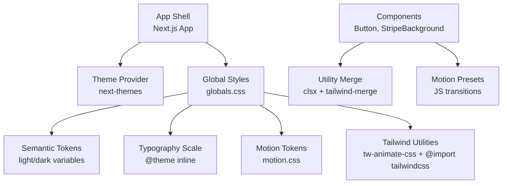

**Diagram sources**
- [ThemeProvider.tsx:5-15](file://src/components/ThemeProvider.tsx#L5-L15)
- [globals.css:1-10](file://src/app/globals.css#L1-L10)
- [globals.css:12-784](file://src/app/globals.css#L12-L784)
- [motion.css:7-55](file://src/styles/tokens/motion.css#L7-L55)
- [presets.ts:8-45](file://src/lib/motion/presets.ts#L8-L45)
- [Button.tsx:9-42](file://src/components/ui/primitives/Button.tsx#L9-L42)
- [utils.ts:4-6](file://src/lib/utils.ts#L4-L6)

**Section sources**
- [ThemeProvider.tsx:5-15](file://src/components/ThemeProvider.tsx#L5-L15)
- [globals.css:1-10](file://src/app/globals.css#L1-L10)
- [globals.css:12-784](file://src/app/globals.css#L12-L784)
- [motion.css:7-55](file://src/styles/tokens/motion.css#L7-L55)
- [presets.ts:8-45](file://src/lib/motion/presets.ts#L8-L45)
- [Button.tsx:9-42](file://src/components/ui/primitives/Button.tsx#L9-L42)
- [utils.ts:4-6](file://src/lib/utils.ts#L4-L6)

## Core Components
- ThemeProvider: Wraps the application with next-themes, using attribute-based theme switching and disabling transitions on theme change for a crisp switch.
- Semantic tokens: Centralized in globals.css under :root (light) and .dark (dark), covering surface, content, glyph, edge, action, category, calendar, chart, and sidebar tokens.
- Typography scale: Declared in @theme inline with font families and text sizes, line heights, and tracking; base type classes apply these tokens.
- Motion tokens: Duration, easing, distance, stagger, and delay tokens plus shared overlay animations and reduced-motion handling.
- Utility composition: Components merge classes with clsx and tailwind-merge to compose consistent styles.

**Section sources**
- [ThemeProvider.tsx:5-15](file://src/components/ThemeProvider.tsx#L5-L15)
- [globals.css:12-784](file://src/app/globals.css#L12-L784)
- [motion.css:7-55](file://src/styles/tokens/motion.css#L7-L55)
- [utils.ts:4-6](file://src/lib/utils.ts#L4-L6)

## Architecture Overview
The theming and styling architecture combines CSS custom properties, Tailwind v4, and a small JS motion layer:
- ThemeProvider sets the root theme attribute.
- globals.css defines semantic tokens and exposes them to Tailwind via @theme inline.
- motion.css provides motion tokens and shared keyframes/utilities.
- Components style themselves with Tailwind utilities and variants, optionally using motion presets from presets.ts for stateful choreography.

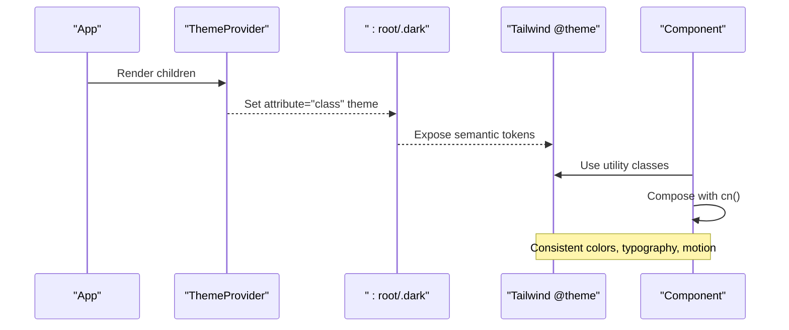

**Diagram sources**
- [ThemeProvider.tsx:5-15](file://src/components/ThemeProvider.tsx#L5-L15)
- [globals.css:12-784](file://src/app/globals.css#L12-L784)
- [utils.ts:4-6](file://src/lib/utils.ts#L4-L6)

## Detailed Component Analysis

### ThemeProvider Implementation
- Uses next-themes with attribute mode to toggle a class on the root element.
- Defaults to light theme and disables transitions on theme changes to avoid flicker.
- Provides a single source of truth for theme state across the app.

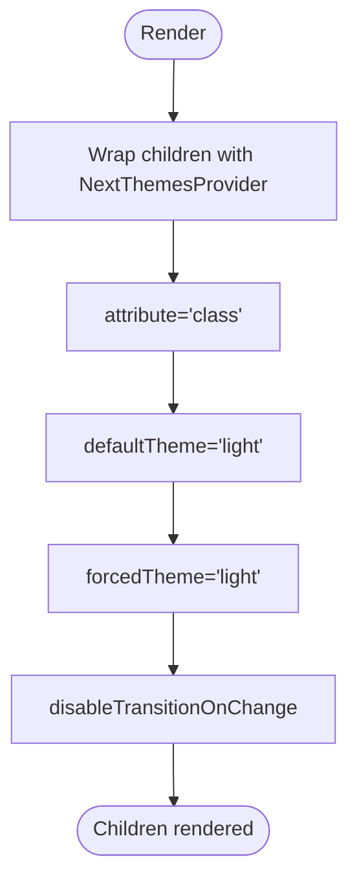

**Diagram sources**
- [ThemeProvider.tsx:5-15](file://src/components/ThemeProvider.tsx#L5-L15)

**Section sources**
- [ThemeProvider.tsx:5-15](file://src/components/ThemeProvider.tsx#L5-L15)

### Color System and Semantic Tokens
- Light and dark themes define semantic tokens for surfaces, content, glyphs, edges, actions, categories, calendar days, charts, and sidebar elements.
- Tokens are mapped into Tailwind’s theme namespace via @theme inline so they can be consumed by utilities like bg-, text-, border- classes.
- Category tokens remain uniform across themes to preserve meaning.

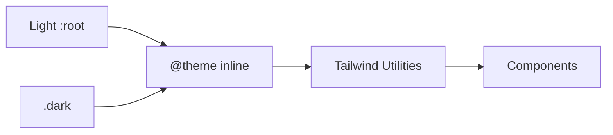

**Diagram sources**
- [globals.css:12-784](file://src/app/globals.css#L12-L784)

**Section sources**
- [globals.css:12-784](file://src/app/globals.css#L12-L784)

### Typography Scale
- Font families: primary (Switzer/system-ui/sans-serif) and secondary (Lora/Georgia/serif).
- Text scales: H1–H4 and Body 1–4 with explicit sizes, line heights, and letter-spacing tokens.
- Base type classes apply these tokens consistently across the app.

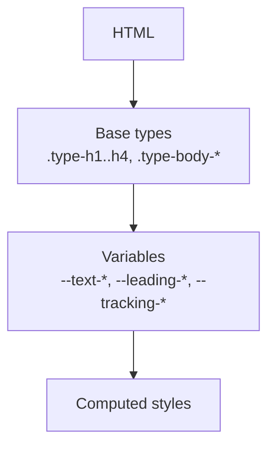

**Diagram sources**
- [globals.css:494-784](file://src/app/globals.css#L494-L784)
- [globals.css:786-854](file://src/app/globals.css#L786-L854)

**Section sources**
- [globals.css:494-784](file://src/app/globals.css#L494-L784)
- [globals.css:786-854](file://src/app/globals.css#L786-L854)

### Spacing Conventions
- Spacing is primarily handled through Tailwind’s spacing scale and container/grid utilities.
- The bento grid and day-board derive column widths and row heights from container queries and CSS variables, ensuring consistent proportional spacing at different breakpoints.

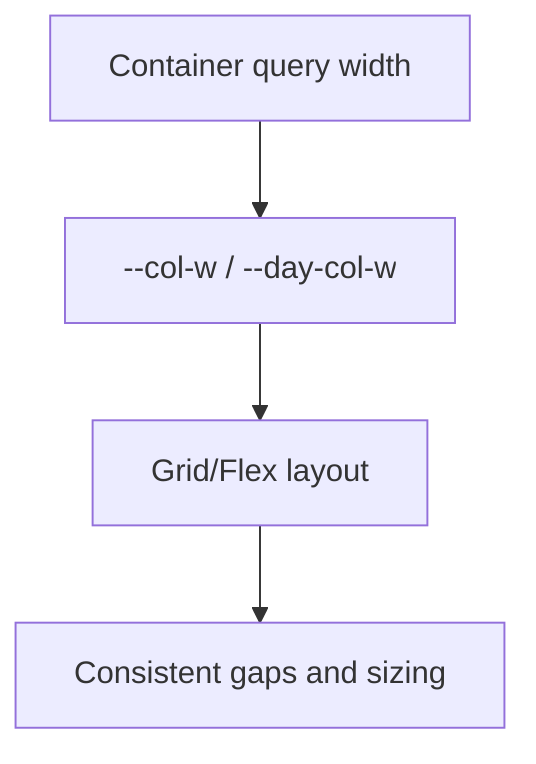

**Diagram sources**
- [globals.css:1089-1133](file://src/app/globals.css#L1089-L1133)

**Section sources**
- [globals.css:1089-1133](file://src/app/globals.css#L1089-L1133)

### Motion Design Principles
- Core durations, easings, distances, and stagger values are centralized as CSS variables.
- Semantic aliases provide component-level defaults (e.g., button, control, overlay).
- Shared overlay animations for modals and sheets use data attributes for starting/ending states and support mobile sheet behavior.
- Reduced motion is respected globally by collapsing durations and disabling decorative animations.

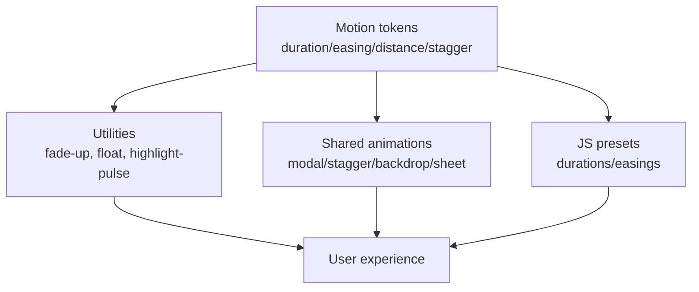

**Diagram sources**
- [motion.css:7-55](file://src/styles/tokens/motion.css#L7-L55)
- [motion.css:100-218](file://src/styles/tokens/motion.css#L100-L218)
- [presets.ts:8-45](file://src/lib/motion/presets.ts#L8-L45)

**Section sources**
- [motion.css:7-55](file://src/styles/tokens/motion.css#L7-L55)
- [motion.css:100-218](file://src/styles/tokens/motion.css#L100-L218)
- [presets.ts:8-45](file://src/lib/motion/presets.ts#L8-L45)

### Component Styling Approaches
- Button uses class-variance-authority to define variants, sizes, and icon placements, composing Tailwind utilities with semantic tokens.
- Decoration layers (fill, inset bevel, ring) ensure crisp borders and consistent visual hierarchy.
- StripeBackground demonstrates dynamic style injection and resolution of colors from hex, design tokens, or Tailwind color names.

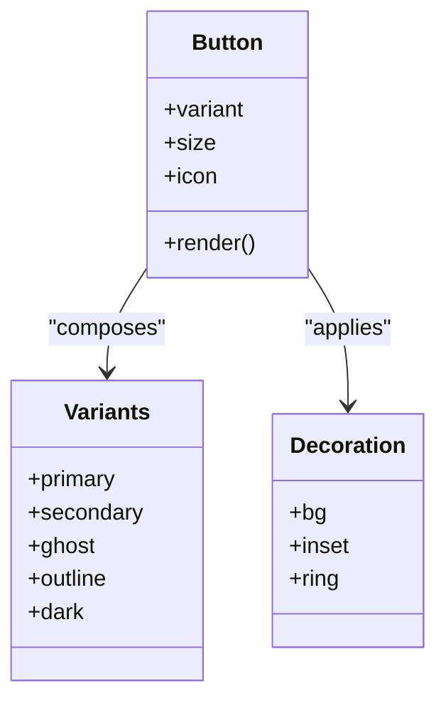

**Diagram sources**
- [Button.tsx:9-67](file://src/components/ui/primitives/Button.tsx#L9-L67)

**Section sources**
- [Button.tsx:9-67](file://src/components/ui/primitives/Button.tsx#L9-L67)
- [StripeBackground.tsx:1-73](file://src/components/ui/StripeBackground/StripeBackground.tsx#L1-L73)

### Responsive Design Strategies
- Custom short breakpoint adapts layouts for shorter viewports.
- Dark mode variant is enabled via a custom variant selector.
- Media queries drive reduced motion and hover behaviors.
- useBreakpoint hook provides SSR-safe breakpoint detection aligned with Tailwind’s default edges.

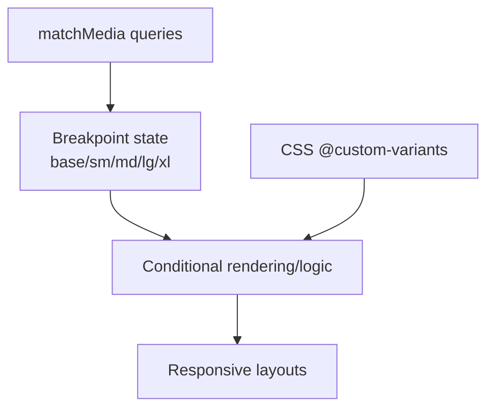

**Diagram sources**
- [useMediaQuery.ts:12-67](file://src/hooks/useMediaQuery.ts#L12-L67)
- [globals.css:7-10](file://src/app/globals.css#L7-L10)
- [globals.css:856-858](file://src/app/globals.css#L856-L858)

**Section sources**
- [useMediaQuery.ts:12-67](file://src/hooks/useMediaQuery.ts#L12-L67)
- [globals.css:7-10](file://src/app/globals.css#L7-L10)
- [globals.css:856-858](file://src/app/globals.css#L856-L858)

### Animation System and Transition Patterns
- CSS keyframes and utilities provide fade-up, floating, highlight pulse, progress fill/drain, and map marker interactions.
- Modal and sheet animations use data attributes to manage starting/ending styles and support discrete transitions where available.
- JS motion presets bridge CSS tokens to stateful animations when necessary.

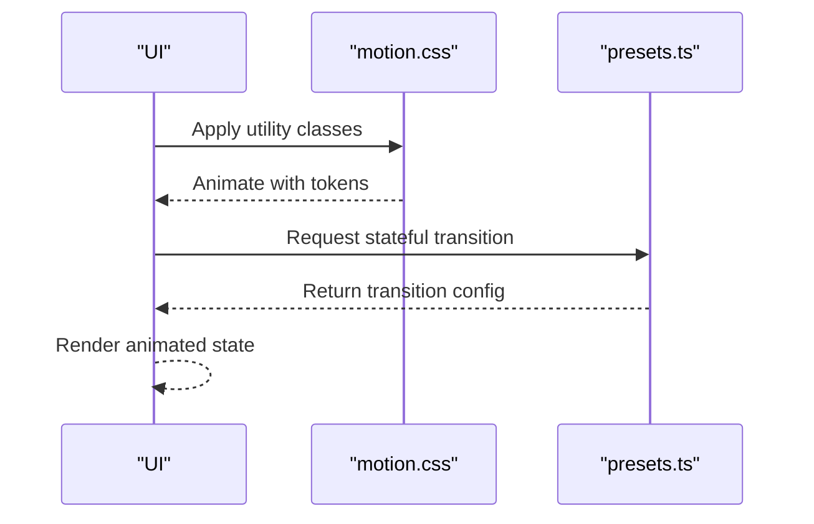

**Diagram sources**
- [motion.css:100-218](file://src/styles/tokens/motion.css#L100-L218)
- [presets.ts:8-45](file://src/lib/motion/presets.ts#L8-L45)

**Section sources**
- [motion.css:100-218](file://src/styles/tokens/motion.css#L100-L218)
- [presets.ts:8-45](file://src/lib/motion/presets.ts#L8-L45)

### Accessibility Considerations
- Reduced motion: All motion tokens collapse to minimal or zero duration; decorative animations are disabled; keyframes adapt to non-moving equivalents.
- Focus management: Buttons include focus-visible rings and outline-none with accessible focus indicators.
- Content safety: Map attribution hidden; placeholder text not selectable; image dragging disabled within content cards.

**Section sources**
- [motion.css:57-94](file://src/styles/tokens/motion.css#L57-L94)
- [motion.css:202-218](file://src/styles/tokens/motion.css#L202-L218)
- [Button.tsx:9-11](file://src/components/ui/primitives/Button.tsx#L9-L11)
- [globals.css:1001-1007](file://src/app/globals.css#L1001-L1007)
- [globals.css:994-999](file://src/app/globals.css#L994-L999)
- [globals.css:881-889](file://src/app/globals.css#L881-L889)

## Dependency Analysis
- ThemeProvider depends on next-themes to manage theme state and attribute toggling.
- Globals import Tailwind, tw-animate-css, and motion tokens, exposing semantic tokens to utilities.
- Components depend on utility composition via clsx and tailwind-merge for deterministic class merging.
- Motion presets depend on motion library tokens and are used by components requiring stateful animations.

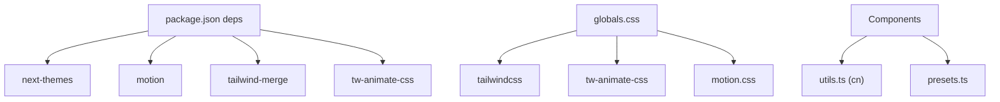

**Diagram sources**
- [package.json:12-33](file://package.json#L12-L33)
- [postcss.config.js:1-5](file://postcss.config.js#L1-L5)
- [globals.css:1-5](file://src/app/globals.css#L1-L5)
- [utils.ts:4-6](file://src/lib/utils.ts#L4-L6)
- [presets.ts:8-45](file://src/lib/motion/presets.ts#L8-L45)

**Section sources**
- [package.json:12-33](file://package.json#L12-L33)
- [postcss.config.js:1-5](file://postcss.config.js#L1-L5)
- [globals.css:1-5](file://src/app/globals.css#L1-L5)
- [utils.ts:4-6](file://src/lib/utils.ts#L4-L6)
- [presets.ts:8-45](file://src/lib/motion/presets.ts#L8-L45)

## Performance Considerations
- Prefer CSS transitions and keyframes over JS animations where possible; leverage motion tokens for consistent durations and easings.
- Use reduced motion media queries to minimize work for users who prefer it.
- Avoid excessive reflows by batching style updates and using transform/opacity for animations.
- Keep token definitions centralized to reduce duplication and improve maintainability.
- Use container queries for responsive grids to avoid heavy JS calculations.

[No sources needed since this section provides general guidance]

## Troubleshooting Guide
- Theme not applying: Ensure ThemeProvider wraps the app and that the root element supports attribute-based theme toggling.
- Colors not updating: Verify semantic tokens are correctly mapped in @theme inline and that components use utility classes referencing those tokens.
- Animations not respecting reduced motion: Confirm motion.css includes the prefers-reduced-motion overrides and that components do not override them inline.
- Inconsistent class merging: Use the provided cn utility to merge classes deterministically with tailwind-merge.

**Section sources**
- [ThemeProvider.tsx:5-15](file://src/components/ThemeProvider.tsx#L5-L15)
- [globals.css:494-784](file://src/app/globals.css#L494-L784)
- [motion.css:57-94](file://src/styles/tokens/motion.css#L57-L94)
- [utils.ts:4-6](file://src/lib/utils.ts#L4-L6)

## Conclusion
Argo’s design system centers on semantic CSS tokens, a robust typography scale, and a cohesive motion system. Theming is managed via a lightweight provider and applied through Tailwind utilities. Components compose styles declaratively, while motion tokens and presets ensure consistent, accessible animations. This architecture promotes consistency, scalability, and performance across the application.

[No sources needed since this section summarizes without analyzing specific files]

## Appendices

### Guidelines for Maintaining Design Consistency
- Always use semantic tokens for colors, surfaces, and actions rather than hard-coded values.
- Refer to the typography scale classes for headings and body text to maintain consistent rhythm.
- Use motion tokens for all durations and easings; avoid ad-hoc timing functions.
- Compose component styles with the cn utility to ensure predictable class merging.

**Section sources**
- [globals.css:12-784](file://src/app/globals.css#L12-L784)
- [motion.css:7-55](file://src/styles/tokens/motion.css#L7-L55)
- [utils.ts:4-6](file://src/lib/utils.ts#L4-L6)

### Adding New Design Tokens
- Define semantic tokens in :root (light) and .dark (dark) sections of globals.css.
- Map new tokens into @theme inline so they are available as Tailwind utilities.
- If introducing motion-related tokens, add them to motion.css and update semantic aliases as needed.

**Section sources**
- [globals.css:12-784](file://src/app/globals.css#L12-L784)
- [motion.css:7-55](file://src/styles/tokens/motion.css#L7-L55)

### Cross-Browser Compatibility
- Scrollbar styling uses vendor-specific selectors for WebKit and Firefox.
- Reduced motion is enforced via media queries to ensure graceful degradation.
- Map-related UI hides third-party attribution to maintain visual consistency.

**Section sources**
- [globals.css:860-908](file://src/app/globals.css#L860-L908)
- [globals.css:1001-1007](file://src/app/globals.css#L1001-L1007)
- [motion.css:57-94](file://src/styles/tokens/motion.css#L57-L94)

### Example: Theme Customization
- Override semantic tokens in :root or .dark to adjust brand colors, surfaces, or actions.
- Extend @theme inline to expose new tokens to utilities.
- Use ThemeProvider to enable runtime theme switching if desired.

**Section sources**
- [globals.css:12-784](file://src/app/globals.css#L12-L784)
- [ThemeProvider.tsx:5-15](file://src/components/ThemeProvider.tsx#L5-L15)

### Example: Component Styling Approach
- Define variants with class-variance-authority and compose with Tailwind utilities.
- Use semantic tokens for colors and motion tokens for transitions.
- Leverage cn for deterministic class merging.

**Section sources**
- [Button.tsx:9-67](file://src/components/ui/primitives/Button.tsx#L9-L67)
- [utils.ts:4-6](file://src/lib/utils.ts#L4-L6)

### Example: Responsive Strategy
- Use the short breakpoint for compact layouts on shorter viewports.
- Employ useBreakpoint for JS branching aligned with Tailwind’s default edges.
- Apply container-query-based grids for responsive tile layouts.

**Section sources**
- [globals.css:7-10](file://src/app/globals.css#L7-L10)
- [useMediaQuery.ts:12-67](file://src/hooks/useMediaQuery.ts#L12-L67)
- [globals.css:1089-1133](file://src/app/globals.css#L1089-L1133)