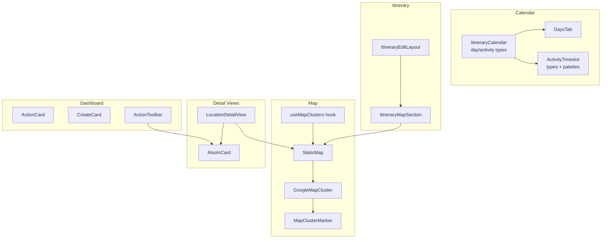
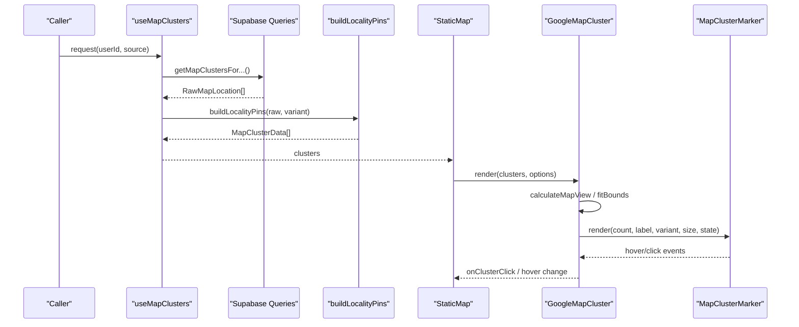
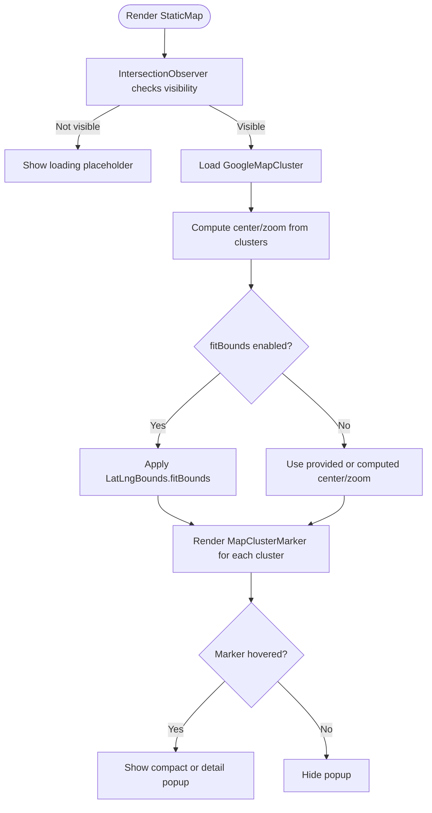
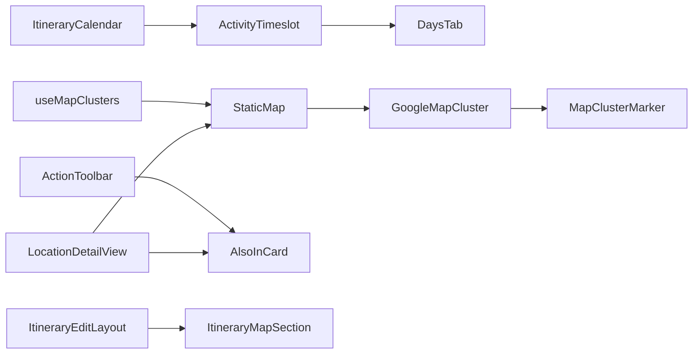

# Feature-Specific Components

<cite>
**Referenced Files in This Document**
- [ItineraryCalendar.tsx](file://src/components/ui/calendar/ItineraryCalendar.tsx)
- [ActivityTimeslot.tsx](file://src/components/ui/calendar/ActivityTimeslot.tsx)
- [DaysTab.tsx](file://src/components/ui/calendar/DaysTab.tsx)
- [GoogleMapCluster.tsx](file://src/components/ui/map/GoogleMapCluster.tsx)
- [StaticMap.tsx](file://src/components/ui/map/StaticMap.tsx)
- [MapClusterMarker.tsx](file://src/components/ui/map/MapClusterMarker.tsx)
- [useMapClusters.ts](file://src/hooks/useMapClusters.ts)
- [ActionCard.tsx](file://src/components/ui/dashboard/ActionCard.tsx)
- [CreateCard.tsx](file://src/components/ui/dashboard/CreateCard.tsx)
- [ActionToolbar.tsx](file://src/components/ui/dashboard/ActionToolbar.tsx)
- [LocationDetailView.tsx](file://src/components/ui/detail-views/LocationDetailView.tsx)
- [AlsoInCard.tsx](file://src/components/ui/detail-views/AlsoInCard.tsx)
- [ItineraryEditLayout.tsx](file://src/components/ui/itinerary/ItineraryEditLayout.tsx)
- [ItineraryMapSection.tsx](file://src/components/ui/itinerary/ItineraryMapSection.tsx)
</cite>

## Table of Contents
1. [Introduction](#introduction)
2. [Project Structure](#project-structure)
3. [Core Components](#core-components)
4. [Architecture Overview](#architecture-overview)
5. [Detailed Component Analysis](#detailed-component-analysis)
6. [Dependency Analysis](#dependency-analysis)
7. [Performance Considerations](#performance-considerations)
8. [Troubleshooting Guide](#troubleshooting-guide)
9. [Conclusion](#conclusion)
10. [Appendices](#appendices)

## Introduction
This document provides detailed, feature-focused documentation for complex business logic components that power itinerary planning and location experiences:
- Calendar components for itinerary planning (days, timeslots, palettes)
- Map integration with clustering (Google Maps via @vis.gl/react-google-maps)
- Dashboard action cards and toolbars for selection and save-to workflows
- Detail views for locations with rich metadata and “Also found in” cross-references
- Itinerary editing layouts with resizable panels and map sections

The goal is to help you understand APIs, data flows, external integrations (Google Maps), state management patterns, and how to customize behavior for specific use cases.

## Project Structure
Feature-specific components are organized by domain under src/components/ui:
- calendar: Day tabs, activity timeslot types, and palette utilities
- map: Google Maps cluster rendering, marker hover UI, and a static map wrapper
- dashboard: Action cards, create cards, and multi-selection toolbar with “Save to” flows
- detail-views: Location detail view, also-found-in list, and supporting UI
- itinerary: Edit layout with resizable columns and an embedded map section

**Diagram sources**
- [ItineraryCalendar.tsx:1-8](file://src/components/ui/calendar/ItineraryCalendar.tsx#L1-L8)
- [ActivityTimeslot.tsx:1-72](file://src/components/ui/calendar/ActivityTimeslot.tsx#L1-L72)
- [DaysTab.tsx:1-104](file://src/components/ui/calendar/DaysTab.tsx#L1-L104)
- [StaticMap.tsx:1-103](file://src/components/ui/map/StaticMap.tsx#L1-L103)
- [GoogleMapCluster.tsx:1-181](file://src/components/ui/map/GoogleMapCluster.tsx#L1-L181)
- [MapClusterMarker.tsx:1-115](file://src/components/ui/map/MapClusterMarker.tsx#L1-L115)
- [useMapClusters.ts:1-61](file://src/hooks/useMapClusters.ts#L1-L61)
- [ActionCard.tsx:1-101](file://src/components/ui/dashboard/ActionCard.tsx#L1-L101)
- [CreateCard.tsx:1-99](file://src/components/ui/dashboard/CreateCard.tsx#L1-L99)
- [ActionToolbar.tsx:1-372](file://src/components/ui/dashboard/ActionToolbar.tsx#L1-L372)
- [LocationDetailView.tsx:1-787](file://src/components/ui/detail-views/LocationDetailView.tsx#L1-L787)
- [AlsoInCard.tsx:1-96](file://src/components/ui/detail-views/AlsoInCard.tsx#L1-L96)
- [ItineraryEditLayout.tsx:1-203](file://src/components/ui/itinerary/ItineraryEditLayout.tsx#L1-L203)
- [ItineraryMapSection.tsx:1-54](file://src/components/ui/itinerary/ItineraryMapSection.tsx#L1-L54)

**Section sources**
- [ItineraryCalendar.tsx:1-8](file://src/components/ui/calendar/ItineraryCalendar.tsx#L1-L8)
- [ActivityTimeslot.tsx:1-72](file://src/components/ui/calendar/ActivityTimeslot.tsx#L1-L72)
- [DaysTab.tsx:1-104](file://src/components/ui/calendar/DaysTab.tsx#L1-L104)
- [StaticMap.tsx:1-103](file://src/components/ui/map/StaticMap.tsx#L1-L103)
- [GoogleMapCluster.tsx:1-181](file://src/components/ui/map/GoogleMapCluster.tsx#L1-L181)
- [MapClusterMarker.tsx:1-115](file://src/components/ui/map/MapClusterMarker.tsx#L1-L115)
- [useMapClusters.ts:1-61](file://src/hooks/useMapClusters.ts#L1-L61)
- [ActionCard.tsx:1-101](file://src/components/ui/dashboard/ActionCard.tsx#L1-L101)
- [CreateCard.tsx:1-99](file://src/components/ui/dashboard/CreateCard.tsx#L1-L99)
- [ActionToolbar.tsx:1-372](file://src/components/ui/dashboard/ActionToolbar.tsx#L1-L372)
- [LocationDetailView.tsx:1-787](file://src/components/ui/detail-views/LocationDetailView.tsx#L1-L787)
- [AlsoInCard.tsx:1-96](file://src/components/ui/detail-views/AlsoInCard.tsx#L1-L96)
- [ItineraryEditLayout.tsx:1-203](file://src/components/ui/itinerary/ItineraryEditLayout.tsx#L1-L203)
- [ItineraryMapSection.tsx:1-54](file://src/components/ui/itinerary/ItineraryMapSection.tsx#L1-L54)

## Core Components
- Calendar planning:
  - DaysTab: Filterable day selector with color-coded indicators and keyboard focus states.
  - ActivityTimeslot: Shared types for activities and per-day color palettes used across calendar and maps.
  - ItineraryCalendar: Defines the CalendarDay and CalendarActivity contracts consumed by higher-level planners.
- Map clustering:
  - StaticMap: Intersection-aware wrapper that lazily loads Google Maps and tracks load events.
  - GoogleMapCluster: Renders clusters with auto-fit bounds, theme-aware map IDs, and hover-driven detail popups.
  - MapClusterMarker: Visual marker with compact or detail hover modes.
  - useMapClusters: Data hook that fetches and builds locality pins for different surfaces (dashboard, collections, itineraries).
- Dashboard actions:
  - ActionCard: Accessible, keyboard-friendly card for primary actions with optional sticker imagery.
  - CreateCard: Promotional card for creating links, collections, or itineraries.
  - ActionToolbar: Multi-selection toolbar with “Save to” popover merging collections and itineraries, inline new-collection creation, delete/generate actions.
- Location detail:
  - LocationDetailView: Rich detail panel with gallery, opening hours, contact info, price/stay hints, and “Also found in” sidebar; integrates StaticMap and save-to flows.
  - AlsoInCard: Compact tile for collection/itinerary references.
- Itinerary editing:
  - ItineraryEditLayout: Three-column editable layout with resizable left/center panels and a right-side map area; responsive overlay on tablet/mobile.
  - ItineraryMapSection: Lightweight container that renders MapContainer with itinerary locations and polylines.

**Section sources**
- [DaysTab.tsx:1-104](file://src/components/ui/calendar/DaysTab.tsx#L1-L104)
- [ActivityTimeslot.tsx:1-72](file://src/components/ui/calendar/ActivityTimeslot.tsx#L1-L72)
- [ItineraryCalendar.tsx:1-8](file://src/components/ui/calendar/ItineraryCalendar.tsx#L1-L8)
- [StaticMap.tsx:1-103](file://src/components/ui/map/StaticMap.tsx#L1-L103)
- [GoogleMapCluster.tsx:1-181](file://src/components/ui/map/GoogleMapCluster.tsx#L1-L181)
- [MapClusterMarker.tsx:1-115](file://src/components/ui/map/MapClusterMarker.tsx#L1-L115)
- [useMapClusters.ts:1-61](file://src/hooks/useMapClusters.ts#L1-L61)
- [ActionCard.tsx:1-101](file://src/components/ui/dashboard/ActionCard.tsx#L1-L101)
- [CreateCard.tsx:1-99](file://src/components/ui/dashboard/CreateCard.tsx#L1-L99)
- [ActionToolbar.tsx:1-372](file://src/components/ui/dashboard/ActionToolbar.tsx#L1-L372)
- [LocationDetailView.tsx:1-787](file://src/components/ui/detail-views/LocationDetailView.tsx#L1-L787)
- [AlsoInCard.tsx:1-96](file://src/components/ui/detail-views/AlsoInCard.tsx#L1-L96)
- [ItineraryEditLayout.tsx:1-203](file://src/components/ui/itinerary/ItineraryEditLayout.tsx#L1-L203)
- [ItineraryMapSection.tsx:1-54](file://src/components/ui/itinerary/ItineraryMapSection.tsx#L1-L54)

## Architecture Overview
High-level flow from data to UI:
- Data fetching: useMapClusters queries Supabase for raw locations and transforms them into MapClusterData suitable for rendering.
- Rendering: StaticMap conditionally loads GoogleMapCluster when visible; GoogleMapCluster computes center/zoom and fits bounds; markers render with hover details.
- Integration points: LocationDetailView composes StaticMap for a single-pin view and orchestrates “Add to” flows with optimistic updates and reconciliation.
- Layout: ItineraryEditLayout manages three regions (left day list, center detail panel, right map) with resizing and responsive overlays.

**Diagram sources**
- [useMapClusters.ts:1-61](file://src/hooks/useMapClusters.ts#L1-L61)
- [StaticMap.tsx:1-103](file://src/components/ui/map/StaticMap.tsx#L1-L103)
- [GoogleMapCluster.tsx:1-181](file://src/components/ui/map/GoogleMapCluster.tsx#L1-L181)
- [MapClusterMarker.tsx:1-115](file://src/components/ui/map/MapClusterMarker.tsx#L1-L115)

## Detailed Component Analysis

### Calendar Components for Itinerary Planning
- DaysTab
  - Purpose: Day filter menu with color-coded indicators and accessibility.
  - Key props: totalDays, expanded, onToggle, focusedDayIndex, onDayClick.
  - Behavior: Uses palette colors from ActivityTimeslot to reflect selected day; supports keyboard navigation and focus rings.
- ActivityTimeslot
  - Purpose: Centralizes activity type definitions and per-day color palettes used across calendar and maps.
  - Exports: CalendarActivity interface, getDayPalette, PALETTE_COLORS, getDayColor.
- ItineraryCalendar
  - Purpose: Declares CalendarDay and CalendarActivity contracts for higher-level planners.

Usage example pattern:
- Build a list of days and pass to DaysTab to let users filter by day.
- Use CalendarActivity fields (startHour/endHour, category, placeId, coordinates) to drive timeline rendering and map overlays.

Customization tips:
- Extend CalendarActivity with additional fields for your domain (e.g., notes, tags).
- Override palettes via paletteOverride if needed by your brand or context.

**Section sources**
- [DaysTab.tsx:1-104](file://src/components/ui/calendar/DaysTab.tsx#L1-L104)
- [ActivityTimeslot.tsx:1-72](file://src/components/ui/calendar/ActivityTimeslot.tsx#L1-L72)
- [ItineraryCalendar.tsx:1-8](file://src/components/ui/calendar/ItineraryCalendar.tsx#L1-L8)

### Map Integration with Clustering
- StaticMap
  - Purpose: Lazy-load Google Maps only when in view; track map load analytics; manage hover state for markers.
  - Props: clusters, center, zoom, height, className, onClusterClick, interactive, fitBounds, renderDetailContent, showZoomControls.
  - Behavior: Shows loading placeholder until intersection observer detects visibility; then renders GoogleMapCluster.
- GoogleMapCluster
  - Purpose: Renders clusters with theme-aware map IDs, auto center/zoom based on cluster spread, and optional zoom controls.
  - Props: clusters, center, zoom, onClusterClick, interactive, fitBounds, renderDetailContent, showZoomControls, hoveredClusterId, onHoverChange.
  - Behavior: Computes bounds and zoom; applies gesture handling based on interactivity; passes hover state to markers.
- MapClusterMarker
  - Purpose: Visual marker with compact or detail hover mode; supports size/state variants.
  - Props: count, label, variant, size, state, hoverMode, detailContent, isHovered.
  - Behavior: Emphasizes marker on hover/active; shows hover popup with either summary or custom detail content.

Data flow:
- useMapClusters fetches and transforms data into MapClusterData.
- StaticMap receives clusters and renders GoogleMapCluster when visible.
- GoogleMapCluster computes view and renders MapClusterMarker instances.

**Diagram sources**
- [StaticMap.tsx:1-103](file://src/components/ui/map/StaticMap.tsx#L1-L103)
- [GoogleMapCluster.tsx:1-181](file://src/components/ui/map/GoogleMapCluster.tsx#L1-L181)
- [MapClusterMarker.tsx:1-115](file://src/components/ui/map/MapClusterMarker.tsx#L1-L115)

Integration with external services:
- Google Maps via @vis.gl/react-google-maps APIProvider and Map components.
- Theme-aware map IDs loaded from environment variables for light/dark modes.
- Analytics tracking on first view via trackMapLoad.

Customization examples:
- Provide renderDetailContent to display a mini card or stats inside the marker hover.
- Toggle interactive to enable gestures and zoom controls.
- Pass center/zoom to override auto-computed values for fixed viewpoints.

**Section sources**
- [StaticMap.tsx:1-103](file://src/components/ui/map/StaticMap.tsx#L1-L103)
- [GoogleMapCluster.tsx:1-181](file://src/components/ui/map/GoogleMapCluster.tsx#L1-L181)
- [MapClusterMarker.tsx:1-115](file://src/components/ui/map/MapClusterMarker.tsx#L1-L115)
- [useMapClusters.ts:1-61](file://src/hooks/useMapClusters.ts#L1-L61)

### Dashboard Action Cards and Toolbars
- ActionCard
  - Purpose: Accessible, keyboard-navigable card for primary actions; supports optional sticker image and disabled state.
  - Props: label, stickerUrl, onClick, disabled, className.
  - Behavior: Focus ring and keyboard activation; hover effects; ARIA attributes for accessibility.
- CreateCard
  - Purpose: Promotional card for link/collection/itinerary creation flows; displays sticker, title, description, and action button.
  - Props: type, onAction, disabled, className.
  - Behavior: Content mapped by type; triggers modal via onAction.
- ActionToolbar
  - Purpose: Floating toolbar during multi-selection; includes “Save to” popover merging collections and itineraries, inline new-collection creation, generate/delete/dismiss actions.
  - Props: count, collections, onSaveToCollection, itineraries, onSaveToItinerary, onCreateCollection, onGenerate, onDelete, onClose, menuOpen, onMenuOpenChange, className.
  - Behavior: Searchable destination list sorted by updatedAt; seeds new-collection name from search; saves directly after creation.

Usage example pattern:
- Wire up collections and itineraries to ActionToolbar to allow bulk saving.
- Implement onCreateCollection to create a new collection and return its id so selections can be saved immediately.

Customization tips:
- Provide itineraries to merge with collections in the “Save to” menu.
- Add onGenerate to trigger AI-assisted itinerary generation from selected items.

**Section sources**
- [ActionCard.tsx:1-101](file://src/components/ui/dashboard/ActionCard.tsx#L1-L101)
- [CreateCard.tsx:1-99](file://src/components/ui/dashboard/CreateCard.tsx#L1-L99)
- [ActionToolbar.tsx:1-372](file://src/components/ui/dashboard/ActionToolbar.tsx#L1-L372)

### Detail Views for Locations
- LocationDetailView
  - Purpose: Comprehensive detail panel with images, description, opening hours, contact info, stay duration, price range, and a small map pin.
  - Props: location, onBack, locationId, excludeItineraryId, excludeCollectionId, collections, itineraries, onSaveToCollection, onSaveToItinerary, onCreateCollection, className.
  - Behavior: Optimistically updates “Also found in” before writes; reconciles with server; opens Google Maps externally; renders StaticMap with a single cluster.
- AlsoInCard
  - Purpose: Compact tile showing collection/itinerary reference with thumbnail, type, and count.
  - Props: title, type, count, countLabel, thumbnailUrl, disabled, ...props.
  - Behavior: Hover border and opacity changes; disabled state dims and disables pointer events.

Data flow:
- Fetch references using useLocationReferencesQuery (via LocationDetailView).
- On “Add to” selection, optimistically insert reference, call appropriate save handler, then invalidate to reconcile.

Customization examples:
- Exclude current itinerary/collection from “Also found in” to avoid self-references.
- Provide onCreateCollection to enable inline creation and immediate save.

**Section sources**
- [LocationDetailView.tsx:1-787](file://src/components/ui/detail-views/LocationDetailView.tsx#L1-L787)
- [AlsoInCard.tsx:1-96](file://src/components/ui/detail-views/AlsoInCard.tsx#L1-L96)

### Itinerary Editing Layouts
- ItineraryEditLayout
  - Purpose: Three-region layout (left day list, center detail panel, right map) with resizable panels and responsive overlay behavior on smaller screens.
  - Props: leftContent, leftOpen, centerContent, centerOpen, rightContent, onPanelOpen, panelOpenLabel, className.
  - Behavior: Resizable handles with direct pointer manipulation; respects reduced motion preferences; toggles center panel visibility with animations.
- ItineraryMapSection
  - Purpose: Container for itinerary map with locations and polylines; uses dynamic import for MapContainer.
  - Props: locations, polylines, defaultCenter, hoverVariant, className.
  - Behavior: Renders nothing when no locations; sets consistent height and styling.

Usage example pattern:
- Place day list in leftContent, detail panel in centerContent, and map in rightContent.
- Open center panel on mobile via onPanelOpen to reveal details over the map.

Customization tips:
- Adjust minWidth for resize handles to suit your content density.
- Use hoverVariant to control marker hover behavior in the itinerary map.

**Section sources**
- [ItineraryEditLayout.tsx:1-203](file://src/components/ui/itinerary/ItineraryEditLayout.tsx#L1-L203)
- [ItineraryMapSection.tsx:1-54](file://src/components/ui/itinerary/ItineraryMapSection.tsx#L1-L54)

## Dependency Analysis
Key relationships:
- Calendar:
  - DaysTab depends on ActivityTimeslot for palette resolution.
  - ItineraryCalendar defines shared types consumed by planner components.
- Map:
  - StaticMap wraps GoogleMapCluster and manages visibility and analytics.
  - GoogleMapCluster depends on MapClusterMarker for visual representation and hover interactions.
  - useMapClusters supplies MapClusterData to StaticMap and other consumers.
- Dashboard:
  - ActionToolbar composes AlsoInCard for destination rows and NewCollectionModal for inline creation.
  - CreateCard drives modals via onAction callbacks.
- Detail Views:
  - LocationDetailView composes AlsoInCard and StaticMap; uses query client for optimistic updates and invalidation.
- Itinerary:
  - ItineraryEditLayout hosts ItineraryMapSection which renders MapContainer (not shown here) with itinerary data.

**Diagram sources**
- [ActivityTimeslot.tsx:1-72](file://src/components/ui/calendar/ActivityTimeslot.tsx#L1-L72)
- [DaysTab.tsx:1-104](file://src/components/ui/calendar/DaysTab.tsx#L1-L104)
- [ItineraryCalendar.tsx:1-8](file://src/components/ui/calendar/ItineraryCalendar.tsx#L1-L8)
- [useMapClusters.ts:1-61](file://src/hooks/useMapClusters.ts#L1-L61)
- [StaticMap.tsx:1-103](file://src/components/ui/map/StaticMap.tsx#L1-L103)
- [GoogleMapCluster.tsx:1-181](file://src/components/ui/map/GoogleMapCluster.tsx#L1-L181)
- [MapClusterMarker.tsx:1-115](file://src/components/ui/map/MapClusterMarker.tsx#L1-L115)
- [ActionToolbar.tsx:1-372](file://src/components/ui/dashboard/ActionToolbar.tsx#L1-L372)
- [AlsoInCard.tsx:1-96](file://src/components/ui/detail-views/AlsoInCard.tsx#L1-L96)
- [LocationDetailView.tsx:1-787](file://src/components/ui/detail-views/LocationDetailView.tsx#L1-L787)
- [ItineraryEditLayout.tsx:1-203](file://src/components/ui/itinerary/ItineraryEditLayout.tsx#L1-L203)
- [ItineraryMapSection.tsx:1-54](file://src/components/ui/itinerary/ItineraryMapSection.tsx#L1-L54)

**Section sources**
- [useMapClusters.ts:1-61](file://src/hooks/useMapClusters.ts#L1-L61)
- [StaticMap.tsx:1-103](file://src/components/ui/map/StaticMap.tsx#L1-L103)
- [GoogleMapCluster.tsx:1-181](file://src/components/ui/map/GoogleMapCluster.tsx#L1-L181)
- [MapClusterMarker.tsx:1-115](file://src/components/ui/map/MapClusterMarker.tsx#L1-L115)
- [ActionToolbar.tsx:1-372](file://src/components/ui/dashboard/ActionToolbar.tsx#L1-L372)
- [AlsoInCard.tsx:1-96](file://src/components/ui/detail-views/AlsoInCard.tsx#L1-L96)
- [LocationDetailView.tsx:1-787](file://src/components/ui/detail-views/LocationDetailView.tsx#L1-L787)
- [ItineraryEditLayout.tsx:1-203](file://src/components/ui/itinerary/ItineraryEditLayout.tsx#L1-L203)
- [ItineraryMapSection.tsx:1-54](file://src/components/ui/itinerary/ItineraryMapSection.tsx#L1-L54)

## Performance Considerations
- Lazy map loading: StaticMap uses intersection observation to defer loading Google Maps until visible, reducing initial bundle and network overhead.
- Auto-fit bounds: GoogleMapCluster computes optimal center/zoom based on cluster spread to minimize unnecessary panning/zooming.
- Reduced motion: ItineraryEditLayout respects user preferences to disable animations where possible.
- Query caching: useMapClusters caches results with staleTime to reduce redundant network calls.
- SSR safety: Dynamic imports prevent server-side execution of browser-only code.

[No sources needed since this section provides general guidance]

## Troubleshooting Guide
Common issues and resolutions:
- Map not loading:
  - Ensure NEXT_PUBLIC_GOOGLE_MAPS_API_KEY is set and valid.
  - Verify the component is within the viewport; StaticMap defers loading until observed.
- Clusters not fitting:
  - Check that clusters contain valid latitude/longitude values.
  - Confirm fitBounds is enabled or provide explicit center/zoom.
- Hover details not showing:
  - Ensure renderDetailContent is provided when using detail hover mode.
  - Verify interactive is true if you need hover-driven behaviors.
- Save-to actions not updating “Also found in”:
  - Confirm locationId is provided to enable optimistic updates.
  - Ensure query invalidation runs after write completion.

**Section sources**
- [GoogleMapCluster.tsx:1-181](file://src/components/ui/map/GoogleMapCluster.tsx#L1-L181)
- [StaticMap.tsx:1-103](file://src/components/ui/map/StaticMap.tsx#L1-L103)
- [LocationDetailView.tsx:1-787](file://src/components/ui/detail-views/LocationDetailView.tsx#L1-L787)

## Conclusion
These feature-specific components form a cohesive system for itinerary planning and location exploration:
- Calendar primitives standardize day-based organization and color themes.
- Map clustering delivers performant, theme-aware visualization with flexible hover interactions.
- Dashboard actions streamline selection and save-to workflows with inline creation.
- Location detail views unify rich metadata, mapping, and cross-reference lists.
- Itinerary editing layouts provide adaptable, responsive workspaces for complex planning tasks.

By composing these components and wiring their APIs appropriately, you can build robust, customizable planning experiences tailored to your product needs.

[No sources needed since this section summarizes without analyzing specific files]

## Appendices

### APIs Quick Reference
- Calendar
  - DaysTab props: totalDays, expanded, onToggle, focusedDayIndex, onDayClick
  - ActivityTimeslot exports: CalendarActivity, getDayPalette, PALETTE_COLORS, getDayColor
  - ItineraryCalendar types: CalendarDay, CalendarActivity
- Map
  - StaticMap props: clusters, center, zoom, height, className, onClusterClick, interactive, fitBounds, renderDetailContent, showZoomControls
  - GoogleMapCluster props: clusters, center, zoom, onClusterClick, interactive, fitBounds, renderDetailContent, showZoomControls, hoveredClusterId, onHoverChange
  - MapClusterMarker props: count, label, variant, size, state, hoverMode, detailContent, isHovered
  - useMapClusters returns: clusters, entityIdsByLocality, isLoading
- Dashboard
  - ActionCard props: label, stickerUrl, onClick, disabled, className
  - CreateCard props: type, onAction, disabled, className
  - ActionToolbar props: count, collections, onSaveToCollection, itineraries, onSaveToItinerary, onCreateCollection, onGenerate, onDelete, onClose, menuOpen, onMenuOpenChange, className
- Detail Views
  - LocationDetailView props: location, onBack, locationId, excludeItineraryId, excludeCollectionId, collections, itineraries, onSaveToCollection, onSaveToItinerary, onCreateCollection, className
  - AlsoInCard props: title, type, count, countLabel, thumbnailUrl, disabled, ...props
- Itinerary
  - ItineraryEditLayout props: leftContent, leftOpen, centerContent, centerOpen, rightContent, onPanelOpen, panelOpenLabel, className
  - ItineraryMapSection props: locations, polylines, defaultCenter, hoverVariant, className

**Section sources**
- [DaysTab.tsx:1-104](file://src/components/ui/calendar/DaysTab.tsx#L1-L104)
- [ActivityTimeslot.tsx:1-72](file://src/components/ui/calendar/ActivityTimeslot.tsx#L1-L72)
- [ItineraryCalendar.tsx:1-8](file://src/components/ui/calendar/ItineraryCalendar.tsx#L1-L8)
- [StaticMap.tsx:1-103](file://src/components/ui/map/StaticMap.tsx#L1-L103)
- [GoogleMapCluster.tsx:1-181](file://src/components/ui/map/GoogleMapCluster.tsx#L1-L181)
- [MapClusterMarker.tsx:1-115](file://src/components/ui/map/MapClusterMarker.tsx#L1-L115)
- [useMapClusters.ts:1-61](file://src/hooks/useMapClusters.ts#L1-L61)
- [ActionCard.tsx:1-101](file://src/components/ui/dashboard/ActionCard.tsx#L1-L101)
- [CreateCard.tsx:1-99](file://src/components/ui/dashboard/CreateCard.tsx#L1-L99)
- [ActionToolbar.tsx:1-372](file://src/components/ui/dashboard/ActionToolbar.tsx#L1-L372)
- [LocationDetailView.tsx:1-787](file://src/components/ui/detail-views/LocationDetailView.tsx#L1-L787)
- [AlsoInCard.tsx:1-96](file://src/components/ui/detail-views/AlsoInCard.tsx#L1-L96)
- [ItineraryEditLayout.tsx:1-203](file://src/components/ui/itinerary/ItineraryEditLayout.tsx#L1-L203)
- [ItineraryMapSection.tsx:1-54](file://src/components/ui/itinerary/ItineraryMapSection.tsx#L1-L54)