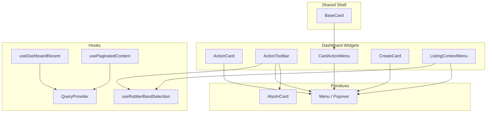
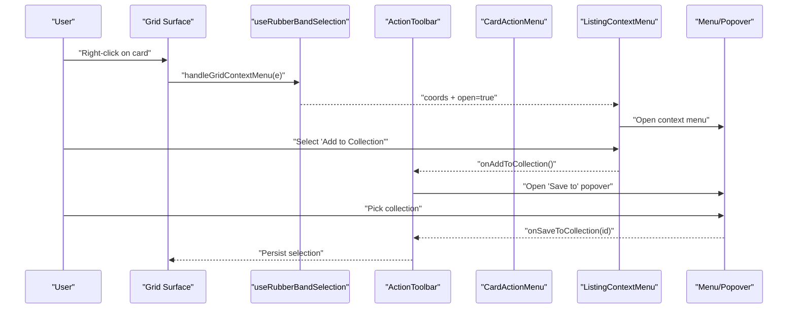
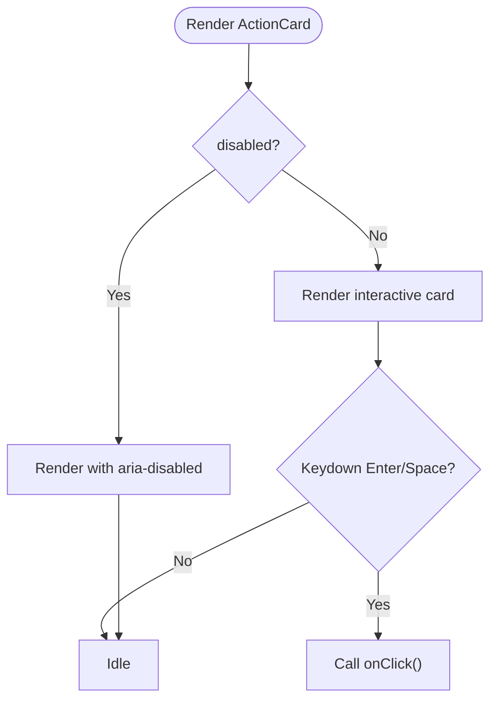
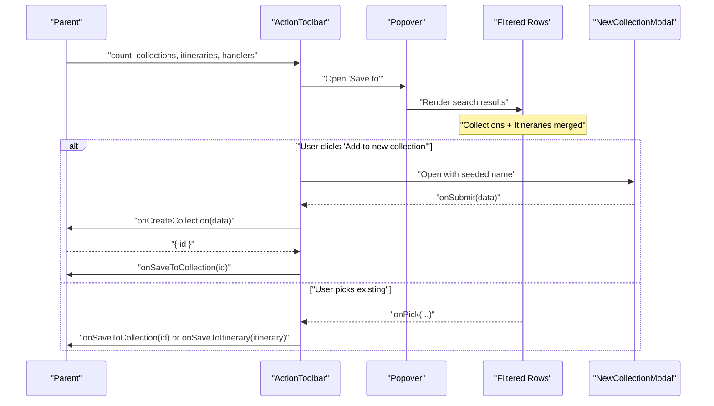
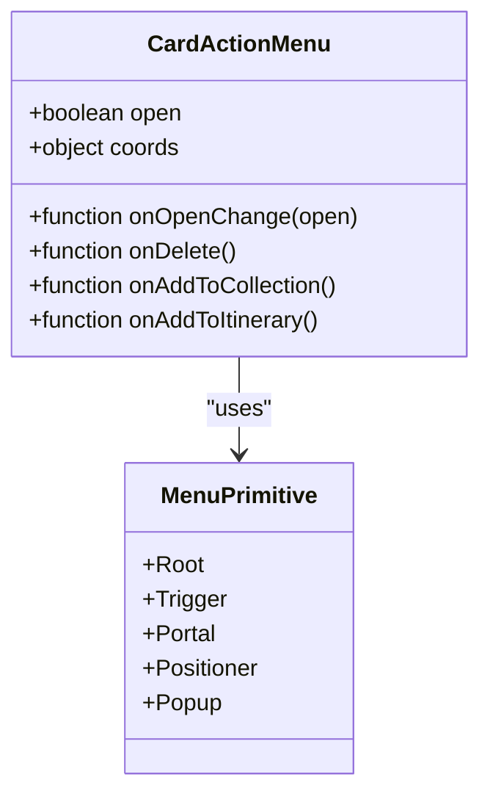
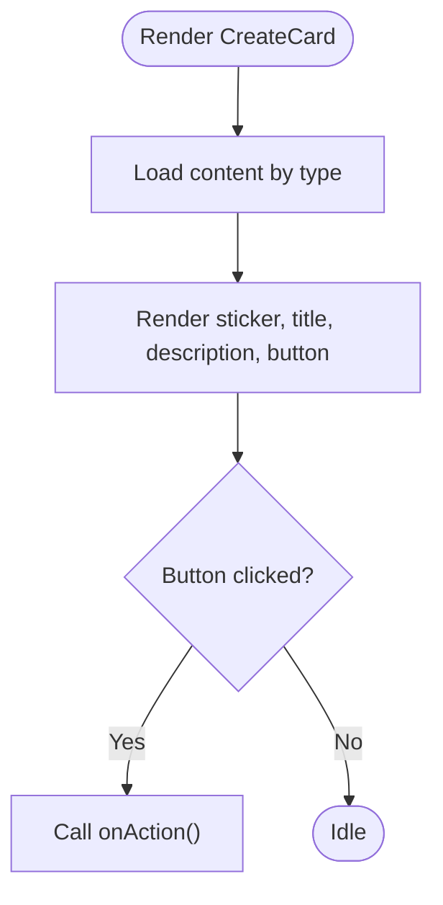
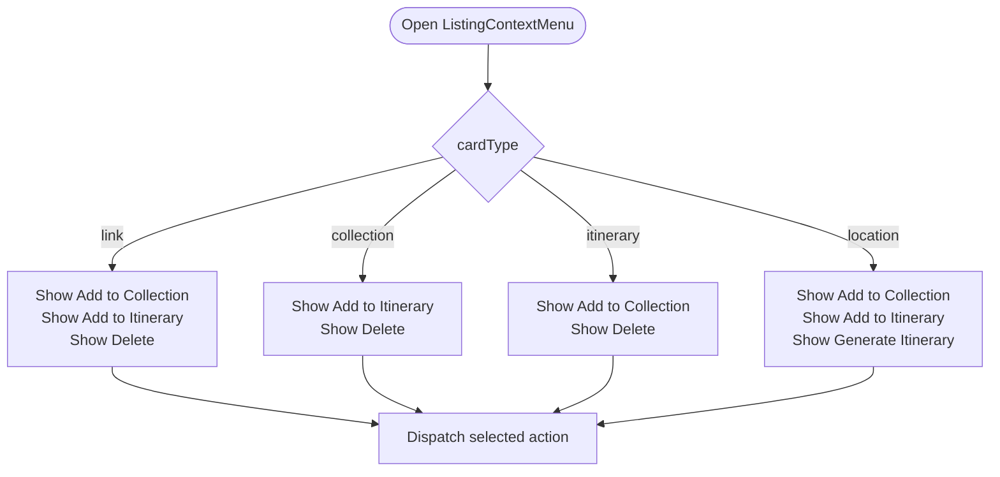
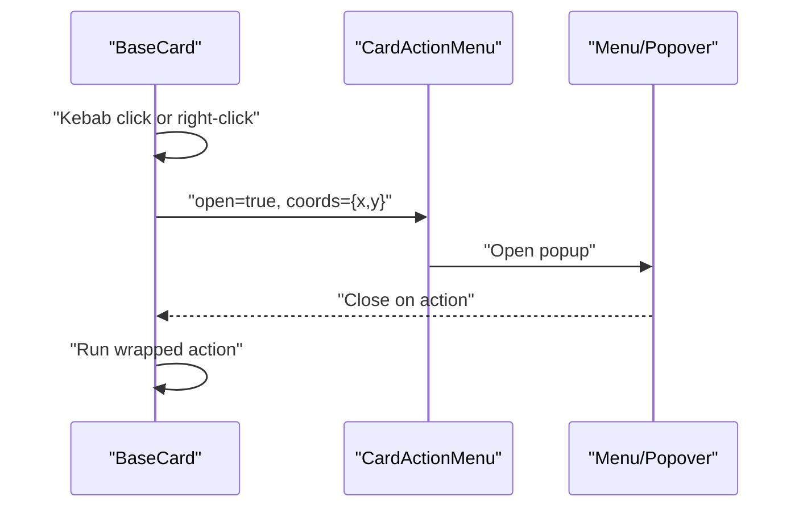
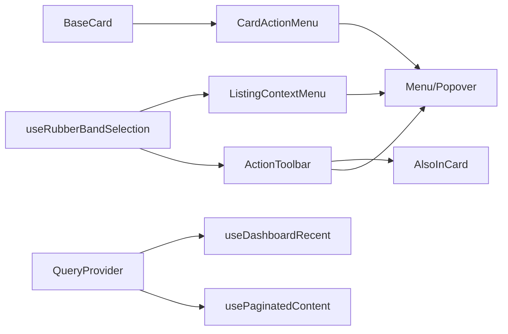

# Dashboard Components

<cite>
**Referenced Files in This Document**
- [ActionCard.tsx](file://src/components/ui/dashboard/ActionCard.tsx)
- [ActionToolbar.tsx](file://src/components/ui/dashboard/ActionToolbar.tsx)
- [CardActionMenu.tsx](file://src/components/ui/dashboard/CardActionMenu.tsx)
- [CreateCard.tsx](file://src/components/ui/dashboard/CreateCard.tsx)
- [ListingContextMenu.tsx](file://src/components/ui/dashboard/ListingContextMenu.tsx)
- [BaseCard.tsx](file://src/components/ui/cards/BaseCard.tsx)
- [AlsoInCard.tsx](file://src/components/ui/detail-views/AlsoInCard.tsx)
- [Menu.tsx](file://src/components/ui/primitives/Menu.tsx)
- [useRubberBandSelection.ts](file://src/hooks/useRubberBandSelection.ts)
- [QueryProvider.tsx](file://src/components/QueryProvider.tsx)
- [useDashboardRecent.ts](file://src/hooks/useDashboardRecent.ts)
- [usePaginatedContent.ts](file://src/hooks/usePaginatedContent.ts)
</cite>

## Table of Contents
1. Introduction
2. Project Structure
3. Core Components
4. Architecture Overview
5. Detailed Component Analysis
6. Dependency Analysis
7. Performance Considerations
8. Troubleshooting Guide
9. Conclusion

## Introduction
This document explains the Argo dashboard components that power content discovery and management in the user interface. It covers ActionCard for quick actions, ActionToolbar for multi-select navigation and filtering, CardActionMenu for per-card context operations, CreateCard for adding new content, and ListingContextMenu for bulk operations. It also documents the component hierarchy, event propagation patterns, keyboard interactions, and how these components integrate with data fetching via React Query and custom hooks.

## Project Structure
The dashboard UI is built from reusable primitives (menus, buttons, popovers) and domain-specific cards. The key files are organized under src/components/ui/dashboard for high-level dashboard widgets, src/components/ui/cards for shared card shells, and src/hooks for selection and data-fetching logic.

**Diagram sources**
- [ActionCard.tsx:1-101](file://src/components/ui/dashboard/ActionCard.tsx#L1-L101)
- [ActionToolbar.tsx:1-372](file://src/components/ui/dashboard/ActionToolbar.tsx#L1-L372)
- [CardActionMenu.tsx:1-115](file://src/components/ui/dashboard/CardActionMenu.tsx#L1-L115)
- [CreateCard.tsx:1-99](file://src/components/ui/dashboard/CreateCard.tsx#L1-L99)
- [ListingContextMenu.tsx:1-164](file://src/components/ui/dashboard/ListingContextMenu.tsx#L1-L164)
- [BaseCard.tsx:1-211](file://src/components/ui/cards/BaseCard.tsx#L1-L211)
- [AlsoInCard.tsx:1-96](file://src/components/ui/detail-views/AlsoInCard.tsx#L1-L96)
- [Menu.tsx:1-384](file://src/components/ui/primitives/Menu.tsx#L1-L384)
- [useRubberBandSelection.ts:1-428](file://src/hooks/useRubberBandSelection.ts#L1-L428)
- [QueryProvider.tsx:1-14](file://src/components/QueryProvider.tsx#L1-L14)
- [useDashboardRecent.ts:1-132](file://src/hooks/useDashboardRecent.ts#L1-L132)
- [usePaginatedContent.ts:1-288](file://src/hooks/usePaginatedContent.ts#L1-L288)

**Section sources**
- [ActionCard.tsx:1-101](file://src/components/ui/dashboard/ActionCard.tsx#L1-L101)
- [ActionToolbar.tsx:1-372](file://src/components/ui/dashboard/ActionToolbar.tsx#L1-L372)
- [CardActionMenu.tsx:1-115](file://src/components/ui/dashboard/CardActionMenu.tsx#L1-L115)
- [CreateCard.tsx:1-99](file://src/components/ui/dashboard/CreateCard.tsx#L1-L99)
- [ListingContextMenu.tsx:1-164](file://src/components/ui/dashboard/ListingContextMenu.tsx#L1-L164)
- [BaseCard.tsx:1-211](file://src/components/ui/cards/BaseCard.tsx#L1-L211)
- [AlsoInCard.tsx:1-96](file://src/components/ui/detail-views/AlsoInCard.tsx#L1-L96)
- [Menu.tsx:1-384](file://src/components/ui/primitives/Menu.tsx#L1-L384)
- [useRubberBandSelection.ts:1-428](file://src/hooks/useRubberBandSelection.ts#L1-L428)
- [QueryProvider.tsx:1-14](file://src/components/QueryProvider.tsx#L1-L14)
- [useDashboardRecent.ts:1-132](file://src/hooks/useDashboardRecent.ts#L1-L132)
- [usePaginatedContent.ts:1-288](file://src/hooks/usePaginatedContent.ts#L1-L288)

## Core Components
- ActionCard: A compact, accessible action tile with label, optional sticker image, hover/focus states, and keyboard activation.
- ActionToolbar: A floating toolbar shown during multi-selection to save items to collections or itineraries, generate itineraries, delete selections, and clear selection. Includes a searchable “Save to” menu merging collections and itineraries.
- CardActionMenu: A per-card kebab/right-click menu offering Add to Collection, Add to Itinerary, and Delete. Anchored at fixed coordinates to support both button-triggered and right-click contexts.
- CreateCard: A promotional card for creating new links, collections, or itineraries, rendering type-specific copy and triggering modals via onAction.
- ListingContextMenu: A context menu for listing items with dynamic visibility based on card type, including Add to Collection, Add to Itinerary, Generate Itinerary (for locations), and Delete.

These components rely on shared primitives (Menu, Popover) and composition patterns to keep behavior consistent across the dashboard.

**Section sources**
- [ActionCard.tsx:1-101](file://src/components/ui/dashboard/ActionCard.tsx#L1-L101)
- [ActionToolbar.tsx:1-372](file://src/components/ui/dashboard/ActionToolbar.tsx#L1-L372)
- [CardActionMenu.tsx:1-115](file://src/components/ui/dashboard/CardActionMenu.tsx#L1-L115)
- [CreateCard.tsx:1-99](file://src/components/ui/dashboard/CreateCard.tsx#L1-L99)
- [ListingContextMenu.tsx:1-164](file://src/components/ui/dashboard/ListingContextMenu.tsx#L1-L164)

## Architecture Overview
The dashboard uses a layered architecture:
- Presentation layer: Cards and toolbars render UI and handle local state (open menus, coords).
- Interaction layer: Selection and context menus coordinate via props and refs; BaseCard centralizes kebab menu behavior for all cards.
- Data layer: Custom hooks fetch and manage lists, pagination, and realtime updates. React Query provider enables caching and synchronization where used.

**Diagram sources**
- [useRubberBandSelection.ts:203-223](file://src/hooks/useRubberBandSelection.ts#L203-L223)
- [ListingContextMenu.tsx:72-164](file://src/components/ui/dashboard/ListingContextMenu.tsx#L72-L164)
- [ActionToolbar.tsx:96-372](file://src/components/ui/dashboard/ActionToolbar.tsx#L96-L372)
- [CardActionMenu.tsx:52-115](file://src/components/ui/dashboard/CardActionMenu.tsx#L52-L115)
- [Menu.tsx:192-240](file://src/components/ui/primitives/Menu.tsx#L192-L240)

## Detailed Component Analysis

### ActionCard
- Purpose: Quick-action tile with label and optional sticker image.
- Accessibility: Keyboard activation via Enter/Space; focus-visible ring; aria-disabled when disabled.
- Styling: Variant-based classes with hover and focus transitions.
- Event handling: onClick receives MouseEvent to enable cursor-anchored UI if needed.

**Diagram sources**
- [ActionCard.tsx:36-99](file://src/components/ui/dashboard/ActionCard.tsx#L36-L99)

**Section sources**
- [ActionCard.tsx:1-101](file://src/components/ui/dashboard/ActionCard.tsx#L1-L101)

### ActionToolbar
- Purpose: Multi-select toolbar for saving to collections/itineraries, generating itineraries, deleting, and clearing selection.
- Behavior:
  - Merges collections and itineraries into one list sorted by updatedAt.
  - Searchable “Save to” menu using AlsoInCard rows.
  - Inline creation of new collections via NewCollectionModal, then auto-save to the created collection.
  - Stops propagation to avoid interfering with rubber-band selection.
- Integration: Uses Popover and primitives; exposes controlled menuOpen/onMenuOpenChange.

**Diagram sources**
- [ActionToolbar.tsx:96-372](file://src/components/ui/dashboard/ActionToolbar.tsx#L96-L372)
- [AlsoInCard.tsx:1-96](file://src/components/ui/detail-views/AlsoInCard.tsx#L1-L96)

**Section sources**
- [ActionToolbar.tsx:1-372](file://src/components/ui/dashboard/ActionToolbar.tsx#L1-L372)
- [AlsoInCard.tsx:1-96](file://src/components/ui/detail-views/AlsoInCard.tsx#L1-L96)

### CardActionMenu
- Purpose: Per-card kebab/right-click menu with Add to Collection, Add to Itinerary, and Delete.
- Positioning: Fixed viewport trigger at coords; portalized popup with collision padding.
- Composition: Built on Menu primitives; renders only provided actions.

**Diagram sources**
- [CardActionMenu.tsx:52-115](file://src/components/ui/dashboard/CardActionMenu.tsx#L52-L115)
- [Menu.tsx:192-240](file://src/components/ui/primitives/Menu.tsx#L192-L240)

**Section sources**
- [CardActionMenu.tsx:1-115](file://src/components/ui/dashboard/CardActionMenu.tsx#L1-L115)
- [Menu.tsx:1-384](file://src/components/ui/primitives/Menu.tsx#L1-L384)

### CreateCard
- Purpose: Promotional card for creating new links, collections, or itineraries.
- Behavior: Renders type-specific title, description, sticker, and primary button. Delegates action to onAction.
- Usage: Typically placed alongside content grids to guide users to create flows.

**Diagram sources**
- [CreateCard.tsx:15-99](file://src/components/ui/dashboard/CreateCard.tsx#L15-L99)

**Section sources**
- [CreateCard.tsx:1-99](file://src/components/ui/dashboard/CreateCard.tsx#L1-L99)

### ListingContextMenu
- Purpose: Context menu for listing items with visibility rules based on card type.
- Behavior:
  - Shows Add to Collection/Itinerary depending on card type.
  - Adds Generate Itinerary for location cards.
  - Provides Delete with destructive styling when allowed.
- Integration: Uses Menu primitives and CategoryBadge for icons.

**Diagram sources**
- [ListingContextMenu.tsx:51-164](file://src/components/ui/dashboard/ListingContextMenu.tsx#L51-L164)

**Section sources**
- [ListingContextMenu.tsx:1-164](file://src/components/ui/dashboard/ListingContextMenu.tsx#L1-L164)

### BaseCard Integration
- Centralizes kebab menu behavior for all cards, opening CardActionMenu anchored to the kebab or cursor on right-click.
- Supports selection mode visuals and keyboard accessibility.

**Diagram sources**
- [BaseCard.tsx:81-159](file://src/components/ui/cards/BaseCard.tsx#L81-L159)
- [CardActionMenu.tsx:52-115](file://src/components/ui/dashboard/CardActionMenu.tsx#L52-L115)

**Section sources**
- [BaseCard.tsx:1-211](file://src/components/ui/cards/BaseCard.tsx#L1-L211)
- [CardActionMenu.tsx:1-115](file://src/components/ui/dashboard/CardActionMenu.tsx#L1-L115)

## Dependency Analysis
- ActionToolbar depends on AlsoInCard for destination rows and Menu primitives for the popover.
- CardActionMenu and ListingContextMenu depend on Menu primitives for positioning and interaction.
- BaseCard composes CardActionMenu and provides unified kebab behavior.
- Selection and context menus are coordinated by useRubberBandSelection, which manages selection state, grid events, and context menu coordinates.
- Data fetching is handled by custom hooks; React Query is provided at app level via QueryProvider.

**Diagram sources**
- [ActionToolbar.tsx:1-372](file://src/components/ui/dashboard/ActionToolbar.tsx#L1-L372)
- [AlsoInCard.tsx:1-96](file://src/components/ui/detail-views/AlsoInCard.tsx#L1-L96)
- [Menu.tsx:1-384](file://src/components/ui/primitives/Menu.tsx#L1-L384)
- [CardActionMenu.tsx:1-115](file://src/components/ui/dashboard/CardActionMenu.tsx#L1-L115)
- [ListingContextMenu.tsx:1-164](file://src/components/ui/dashboard/ListingContextMenu.tsx#L1-L164)
- [BaseCard.tsx:1-211](file://src/components/ui/cards/BaseCard.tsx#L1-L211)
- [useRubberBandSelection.ts:1-428](file://src/hooks/useRubberBandSelection.ts#L1-L428)
- [QueryProvider.tsx:1-14](file://src/components/QueryProvider.tsx#L1-L14)
- [useDashboardRecent.ts:1-132](file://src/hooks/useDashboardRecent.ts#L1-L132)
- [usePaginatedContent.ts:1-288](file://src/hooks/usePaginatedContent.ts#L1-L288)

**Section sources**
- [ActionToolbar.tsx:1-372](file://src/components/ui/dashboard/ActionToolbar.tsx#L1-L372)
- [CardActionMenu.tsx:1-115](file://src/components/ui/dashboard/CardActionMenu.tsx#L1-L115)
- [ListingContextMenu.tsx:1-164](file://src/components/ui/dashboard/ListingContextMenu.tsx#L1-L164)
- [BaseCard.tsx:1-211](file://src/components/ui/cards/BaseCard.tsx#L1-L211)
- [useRubberBandSelection.ts:1-428](file://src/hooks/useRubberBandSelection.ts#L1-L428)
- [QueryProvider.tsx:1-14](file://src/components/QueryProvider.tsx#L1-L14)
- [useDashboardRecent.ts:1-132](file://src/hooks/useDashboardRecent.ts#L1-L132)
- [usePaginatedContent.ts:1-288](file://src/hooks/usePaginatedContent.ts#L1-L288)

## Performance Considerations
- Virtualization and pagination: For large content lists, prefer paginated loading and virtualized rendering. Use usePaginatedContent to load pages incrementally and deduplicate items arriving via realtime.
- Memoization: Avoid unnecessary re-renders by memoizing callbacks and stable references for props passed to menus and cards.
- Event throttling: useRubberBandSelection uses requestAnimationFrame for smooth selection updates and scroll-assist during rubber-band dragging.
- Menu performance: Keep menu item lists small; filter/search locally for short lists, but consider server-side filtering for large datasets.
- Image optimization: Ensure thumbnails and stickers are optimized and lazy-loaded where appropriate.

[No sources needed since this section provides general guidance]

## Troubleshooting Guide
- Context menu not opening:
  - Ensure coords are set and open state is true.
  - Verify that the grid surface calls handleGridContextMenu and passes the correct cardId.
- Toolbar not appearing:
  - Confirm selectedIds size > 0 and toolbar is mounted with proper count prop.
  - Check that event propagation is not blocked unintentionally.
- Selection conflicts:
  - useRubberBandSelection suppresses clicks after drag threshold exceeded; ensure consumeClickSuppression is used where necessary.
  - ESC clears selection and closes context menus.
- Data not updating:
  - For realtime updates, verify channel subscription and reconnect logic in usePaginatedContent.
  - Ensure userId and filters are correctly passed to hooks.

**Section sources**
- [useRubberBandSelection.ts:188-223](file://src/hooks/useRubberBandSelection.ts#L188-L223)
- [useRubberBandSelection.ts:325-352](file://src/hooks/useRubberBandSelection.ts#L325-L352)
- [usePaginatedContent.ts:209-284](file://src/hooks/usePaginatedContent.ts#L209-L284)

## Conclusion
The dashboard components provide a cohesive, accessible, and performant interface for discovering and managing content. ActionCard and CreateCard streamline quick actions and creation flows. ActionToolbar centralizes multi-select operations with a powerful “Save to” menu. CardActionMenu and ListingContextMenu deliver consistent per-item actions. BaseCard unifies kebab behavior across cards. Together with selection and data hooks, they form a robust foundation for scalable dashboards.

[No sources needed since this section summarizes without analyzing specific files]