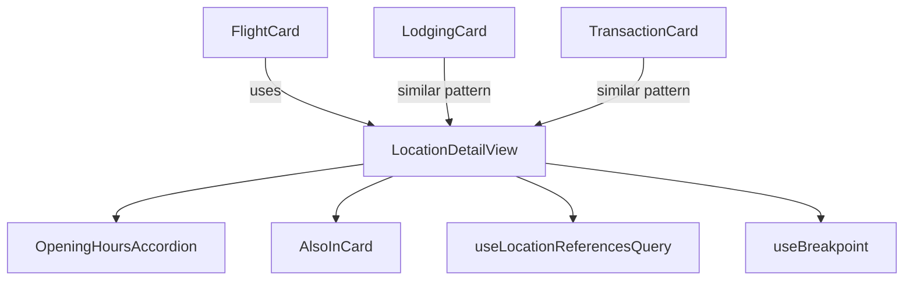
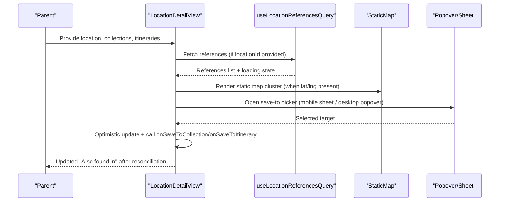
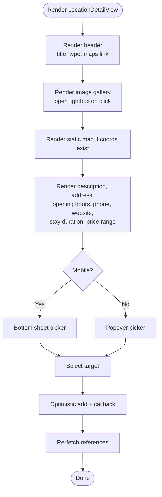
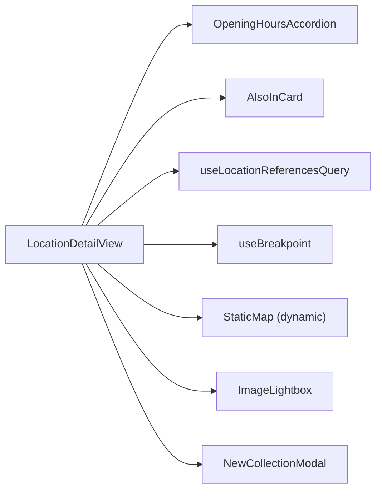

# Detail View Components

<cite>
**Referenced Files in This Document**
- [LocationDetailView.tsx](file://src/components/ui/detail-views/LocationDetailView.tsx)
- [FlightCard.tsx](file://src/components/ui/detail-views/FlightCard.tsx)
- [FlightRouteSection.tsx](file://src/components/ui/detail-views/FlightRouteSection.tsx)
- [FlightDetailsSection.tsx](file://src/components/ui/detail-views/FlightDetailsSection.tsx)
- [LodgingCard.tsx](file://src/components/ui/detail-views/LodgingCard.tsx)
- [TransactionCard.tsx](file://src/components/ui/detail-views/TransactionCard.tsx)
- [OpeningHoursAccordion.tsx](file://src/components/ui/detail-views/OpeningHoursAccordion.tsx)
- [AlsoInCard.tsx](file://src/components/ui/detail-views/AlsoInCard.tsx)
- [useLocationReferencesQuery.ts](file://src/hooks/queries/useLocationReferencesQuery.ts)
- [useMediaQuery.ts](file://src/hooks/useMediaQuery.ts)
</cite>

## Table of Contents
1. [Introduction](#introduction)
2. [Project Structure](#project-structure)
3. [Core Components](#core-components)
4. [Architecture Overview](#architecture-overview)
5. [Detailed Component Analysis](#detailed-component-analysis)
6. [Dependency Analysis](#dependency-analysis)
7. [Performance Considerations](#performance-considerations)
8. [Troubleshooting Guide](#troubleshooting-guide)
9. [Conclusion](#conclusion)

## Introduction
This document explains Argo’s detail view components that render rich, interactive information for different entity types: locations, flights, lodging, and transactions. It focuses on LocationDetailView as the main container and its specialized cards (FlightCard, LodgingCard, TransactionCard), covering data binding patterns, dynamic loading, interactive elements like opening hours displays, responsive behavior, and accessibility features.

## Project Structure
The detail views live under src/components/ui/detail-views and are composed from smaller primitives and hooks:
- LocationDetailView orchestrates image galleries, maps, detail rows, opening hours, and “Add to” flows.
- FlightCard composes route and details sections.
- LodgingCard renders booking details with an image and actions menu.
- TransactionCard supports expandable sub-transactions.
- OpeningHoursAccordion shows today’s hours and a full weekly schedule.
- AlsoInCard lists collections/itineraries where a location is saved.
- useLocationReferencesQuery fetches cross-references for “Also found in”.
- useBreakpoint drives responsive layout decisions.

**Diagram sources**
- [LocationDetailView.tsx:189-776](file://src/components/ui/detail-views/LocationDetailView.tsx#L189-L776)
- [OpeningHoursAccordion.tsx:19-76](file://src/components/ui/detail-views/OpeningHoursAccordion.tsx#L19-L76)
- [AlsoInCard.tsx:31-90](file://src/components/ui/detail-views/AlsoInCard.tsx#L31-L90)
- [FlightCard.tsx:43-140](file://src/components/ui/detail-views/FlightCard.tsx#L43-L140)
- [LodgingCard.tsx:47-171](file://src/components/ui/detail-views/LodgingCard.tsx#L47-L171)
- [TransactionCard.tsx:29-176](file://src/components/ui/detail-views/TransactionCard.tsx#L29-L176)
- [useLocationReferencesQuery.ts:16-30](file://src/hooks/queries/useLocationReferencesQuery.ts#L16-L30)
- [useMediaQuery.ts:53-67](file://src/hooks/useMediaQuery.ts#L53-L67)

**Section sources**
- [LocationDetailView.tsx:189-776](file://src/components/ui/detail-views/LocationDetailView.tsx#L189-L776)
- [useLocationReferencesQuery.ts:16-30](file://src/hooks/queries/useLocationReferencesQuery.ts#L16-L30)
- [useMediaQuery.ts:53-67](file://src/hooks/useMediaQuery.ts#L53-L67)

## Core Components
- LocationDetailView: Main container for place details; renders header, gallery, map, description, address, opening hours, phone, website, stay duration, price range, and “Add to” destination flow. Integrates with external APIs via props and queries.
- FlightCard: Displays flight route and details with optional interactivity to open source documents.
- LodgingCard: Shows lodging image, name, address, check-in/out, cost, and booking reference with edit/delete actions.
- TransactionCard: Expandable transaction row with sub-transactions and optional upward expansion.
- OpeningHoursAccordion: Collapsible panel showing today’s hours and the full week, highlighting the current day.
- AlsoInCard: Compact tile representing a collection or itinerary containing a location.

Key responsibilities:
- Rich content rendering: images, links, icons, formatted text.
- Dynamic data loading: references query, conditional rendering based on presence of data.
- Interactive elements: lightbox, menus, accordions, bottom sheets/popovers.
- Responsive design: mobile-first layout with side-by-side panels on larger screens.
- Accessibility: roles, labels, keyboard support, focus states, aria attributes.

**Section sources**
- [LocationDetailView.tsx:51-126](file://src/components/ui/detail-views/LocationDetailView.tsx#L51-L126)
- [FlightCard.tsx:9-41](file://src/components/ui/detail-views/FlightCard.tsx#L9-L41)
- [LodgingCard.tsx:10-36](file://src/components/ui/detail-views/LodgingCard.tsx#L10-L36)
- [TransactionCard.tsx:9-27](file://src/components/ui/detail-views/TransactionCard.tsx#L9-L27)
- [OpeningHoursAccordion.tsx:9-18](file://src/components/ui/detail-views/OpeningHoursAccordion.tsx#L9-L18)
- [AlsoInCard.tsx:8-21](file://src/components/ui/detail-views/AlsoInCard.tsx#L8-L21)

## Architecture Overview
LocationDetailView composes multiple subcomponents and hooks to present a cohesive detail experience. Data comes from props (location data, collections, itineraries) and a query hook for “Also found in”. The component uses a breakpoint hook to adapt UI between mobile and desktop layouts.

**Diagram sources**
- [LocationDetailView.tsx:214-290](file://src/components/ui/detail-views/LocationDetailView.tsx#L214-L290)
- [LocationDetailView.tsx:339-358](file://src/components/ui/detail-views/LocationDetailView.tsx#L339-L358)
- [LocationDetailView.tsx:462-516](file://src/components/ui/detail-views/LocationDetailView.tsx#L462-L516)
- [useLocationReferencesQuery.ts:16-30](file://src/hooks/queries/useLocationReferencesQuery.ts#L16-L30)

**Section sources**
- [LocationDetailView.tsx:214-290](file://src/components/ui/detail-views/LocationDetailView.tsx#L214-L290)
- [LocationDetailView.tsx:462-516](file://src/components/ui/detail-views/LocationDetailView.tsx#L462-L516)
- [useLocationReferencesQuery.ts:16-30](file://src/hooks/queries/useLocationReferencesQuery.ts#L16-L30)

## Detailed Component Analysis

### LocationDetailView
Responsibilities:
- Renders header with back button, title, primary type pill, and Google Maps link.
- Image gallery with lightbox integration and overflow indicator.
- Static map with a single cluster pin when coordinates are available.
- Description, address, opening hours accordion, phone, website, stay duration, price range.
- “Add to” destination flow with search, new collection creation, and optimistic updates.
- Sidebar showing “Also found in” references with loading and empty states.

Data binding patterns:
- Props define all display fields (name, images, description, address, openingHoursLines, phone, website, stayDurationMinutes, priceRange, primaryType, latitude, longitude, googleMapsUri).
- Collections and itineraries passed as arrays; selection triggers callbacks.
- References fetched via useLocationReferencesQuery and displayed conditionally.

Interactive elements:
- Lightbox opens on image click.
- Opening hours accordion toggles weekly schedule.
- Save-to picker adapts to mobile (bottom sheet) vs desktop (popover).
- Google Maps link opens in a new tab.

Responsive design:
- Mobile: vertical stack with sticky footer “Add to” action.
- Desktop: two-column layout with sidebar.

Accessibility:
- Buttons have aria-labels; icons use aria-hidden.
- Accordion exposes aria-expanded and aria-hidden for content.
- Focus-visible rings for keyboard navigation.

**Diagram sources**
- [LocationDetailView.tsx:519-679](file://src/components/ui/detail-views/LocationDetailView.tsx#L519-L679)
- [LocationDetailView.tsx:462-516](file://src/components/ui/detail-views/LocationDetailView.tsx#L462-L516)
- [LocationDetailView.tsx:214-290](file://src/components/ui/detail-views/LocationDetailView.tsx#L214-L290)

**Section sources**
- [LocationDetailView.tsx:51-126](file://src/components/ui/detail-views/LocationDetailView.tsx#L51-L126)
- [LocationDetailView.tsx:189-776](file://src/components/ui/detail-views/LocationDetailView.tsx#L189-L776)

#### Prop Interfaces (LocationDetailView)
- location: object with name, images, description, address, openingHoursLines, phone, website, stayDurationMinutes, priceRange, primaryType, latitude, longitude, googleMapsUri.
- locationId?: string | null — used to fetch “Also found in”.
- excludeItineraryId?, excludeCollectionId? — filters for references.
- collections?, itineraries? — options for “Add to”.
- onSaveToCollection?, onSaveToItinerary? — handlers for saving.
- onCreateCollection? — inline create-and-save flow.
- onBack? — navigation handler.
- className? — styling override.

**Section sources**
- [LocationDetailView.tsx:51-126](file://src/components/ui/detail-views/LocationDetailView.tsx#L51-L126)

### FlightCard
Responsibilities:
- Displays route section (origin/destination codes, city/country labels, duration) and details section (time, cost, confirmation, flight number, airline, fare class, baggage, terminal, ticket number).
- Optional interactivity to open source document when sourceAttachmentId and onCardClick are provided.

Accessibility:
- When interactive, sets role="button", tabIndex, aria-label, and keyboard handling for Enter/Space.

Responsive considerations:
- Uses flexible grids and truncation to fit varying widths.

**Section sources**
- [FlightCard.tsx:9-41](file://src/components/ui/detail-views/FlightCard.tsx#L9-L41)
- [FlightCard.tsx:43-140](file://src/components/ui/detail-views/FlightCard.tsx#L43-L140)
- [FlightRouteSection.tsx:26-84](file://src/components/ui/detail-views/FlightRouteSection.tsx#L26-L84)
- [FlightDetailsSection.tsx:37-133](file://src/components/ui/detail-views/FlightDetailsSection.tsx#L37-L133)

### LodgingCard
Responsibilities:
- Renders image, name, address, check-in/check-out times, cost with currency, booking reference.
- Provides edit/delete actions via a contextual menu.

Accessibility:
- Interactive mode sets role, tabIndex, aria-label, and keyboard support.

Responsive considerations:
- Image uses Next.js Image with sizes prop for responsive loading.

**Section sources**
- [LodgingCard.tsx:10-36](file://src/components/ui/detail-views/LodgingCard.tsx#L10-L36)
- [LodgingCard.tsx:47-171](file://src/components/ui/detail-views/LodgingCard.tsx#L47-L171)

### TransactionCard
Responsibilities:
- Expandable card showing name, date, amount, optional image/icon.
- Expanded state reveals sub-transactions with descriptions, dates/times, amounts, and an “Add Sub Transaction” button.
- Supports expanding upward or downward.

Accessibility:
- Button element ensures keyboard activation and focus management.

**Section sources**
- [TransactionCard.tsx:9-27](file://src/components/ui/detail-views/TransactionCard.tsx#L9-L27)
- [TransactionCard.tsx:29-176](file://src/components/ui/detail-views/TransactionCard.tsx#L29-L176)

### OpeningHoursAccordion
Responsibilities:
- Collapsible panel showing today’s hours as summary and full weekly schedule when expanded.
- Highlights current day using weekday index.

Accessibility:
- Exposes aria-expanded and aria-hidden for screen readers.

**Section sources**
- [OpeningHoursAccordion.tsx:9-18](file://src/components/ui/detail-views/OpeningHoursAccordion.tsx#L9-L18)
- [OpeningHoursAccordion.tsx:19-76](file://src/components/ui/detail-views/OpeningHoursAccordion.tsx#L19-L76)

### AlsoInCard
Responsibilities:
- Compact tile displaying collection/itinerary name, type, count, and thumbnail.
- Hover and disabled states manage visual feedback.

**Section sources**
- [AlsoInCard.tsx:8-21](file://src/components/ui/detail-views/AlsoInCard.tsx#L8-L21)
- [AlsoInCard.tsx:31-90](file://src/components/ui/detail-views/AlsoInCard.tsx#L31-L90)

## Dependency Analysis
- LocationDetailView depends on:
  - OpeningHoursAccordion for hours display.
  - AlsoInCard for listing references and save targets.
  - useLocationReferencesQuery for fetching cross-references.
  - useBreakpoint for responsive behavior.
  - StaticMap (dynamic import) for map rendering.
  - ImageLightbox modal for gallery viewing.
  - NewCollectionModal for inline collection creation.

**Diagram sources**
- [LocationDetailView.tsx:35-49](file://src/components/ui/detail-views/LocationDetailView.tsx#L35-L49)
- [LocationDetailView.tsx:214-290](file://src/components/ui/detail-views/LocationDetailView.tsx#L214-L290)
- [LocationDetailView.tsx:748-773](file://src/components/ui/detail-views/LocationDetailView.tsx#L748-L773)
- [useLocationReferencesQuery.ts:16-30](file://src/hooks/queries/useLocationReferencesQuery.ts#L16-L30)
- [useMediaQuery.ts:53-67](file://src/hooks/useMediaQuery.ts#L53-L67)

**Section sources**
- [LocationDetailView.tsx:35-49](file://src/components/ui/detail-views/LocationDetailView.tsx#L35-L49)
- [LocationDetailView.tsx:214-290](file://src/components/ui/detail-views/LocationDetailView.tsx#L214-L290)
- [useLocationReferencesQuery.ts:16-30](file://src/hooks/queries/useLocationReferencesQuery.ts#L16-L30)
- [useMediaQuery.ts:53-67](file://src/hooks/useMediaQuery.ts#L53-L67)

## Performance Considerations
- Dynamic imports: StaticMap is dynamically imported with ssr: false to avoid server-side rendering overhead and reduce initial bundle size.
- Conditional rendering: Map only renders when valid coordinates are present; opening hours accordion returns null when no lines are provided.
- Query caching: useLocationReferencesQuery uses staleTime to reduce network requests and improve perceived performance.
- Optimistic updates: Saving a location to a collection/itinerary immediately updates the “Also found in” list before server reconciliation, improving responsiveness.
- Image optimization: LodgingCard uses Next.js Image with sizes for responsive loading; LocationDetailView uses standard img within buttons for gallery cells.

[No sources needed since this section provides general guidance]

## Troubleshooting Guide
Common issues and resolutions:
- “Also found in” not updating after save:
  - Ensure locationId is provided so the query can run.
  - Verify that onSaveToCollection/onSaveToItinerary resolves successfully; the component invalidates references afterward.
- Opening hours not visible:
  - Check that openingHoursLines array is populated; the accordion returns null when empty.
- Map not rendering:
  - Confirm latitude and longitude are non-zero; the map only renders when both are present.
- Mobile “Add to” picker not closing:
  - On mobile, a pointerdown listener closes the menu when tapping outside; ensure event propagation is not prevented by parent elements.

**Section sources**
- [LocationDetailView.tsx:214-290](file://src/components/ui/detail-views/LocationDetailView.tsx#L214-L290)
- [LocationDetailView.tsx:223-244](file://src/components/ui/detail-views/LocationDetailView.tsx#L223-L244)
- [OpeningHoursAccordion.tsx:22-27](file://src/components/ui/detail-views/OpeningHoursAccordion.tsx#L22-L27)
- [LocationDetailView.tsx:604-612](file://src/components/ui/detail-views/LocationDetailView.tsx#L604-L612)

## Conclusion
Argo’s detail view components provide a robust, accessible, and responsive experience for displaying rich entity information. LocationDetailView serves as the central hub, integrating dynamic data loading, interactive elements, and external integrations. Specialized cards (FlightCard, LodgingCard, TransactionCard) follow consistent patterns for data binding, interactivity, and accessibility, ensuring a cohesive user experience across different entity types.

[No sources needed since this section summarizes without analyzing specific files]