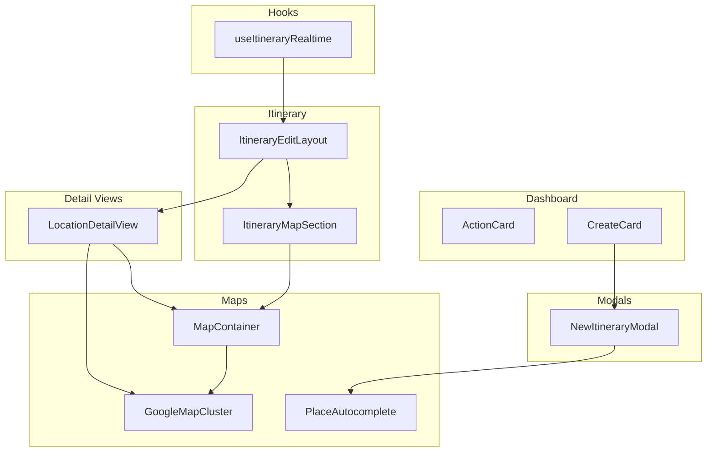
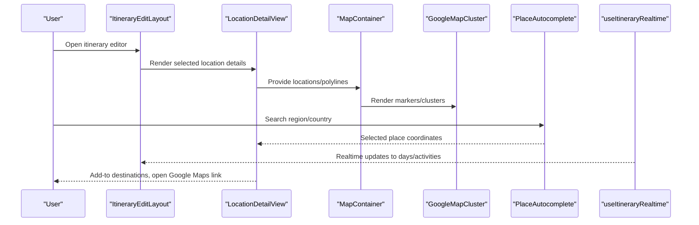
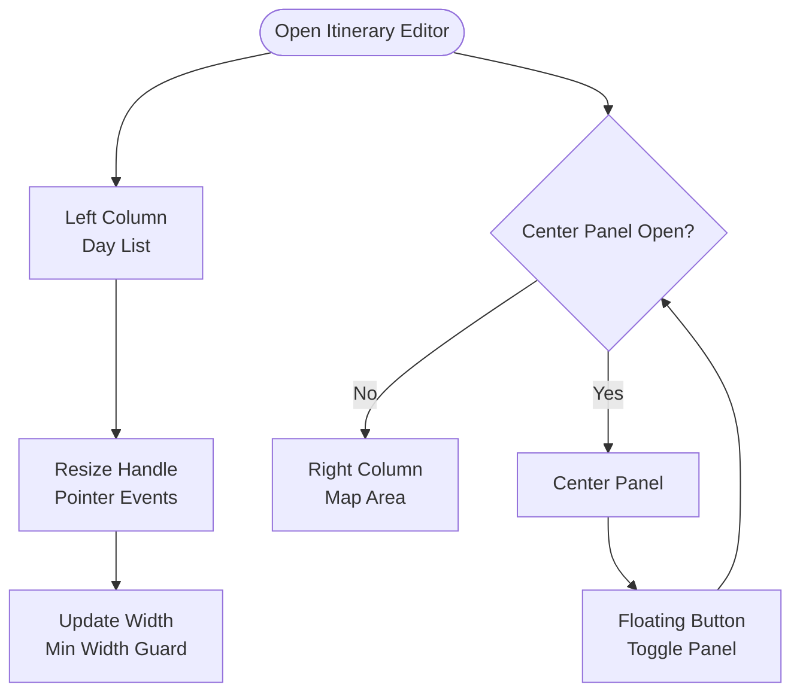
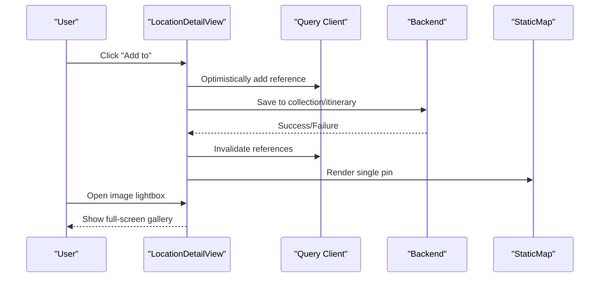
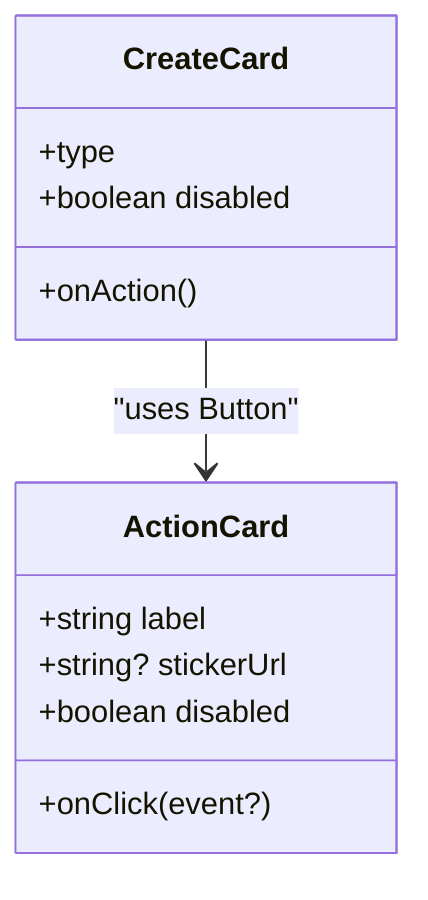
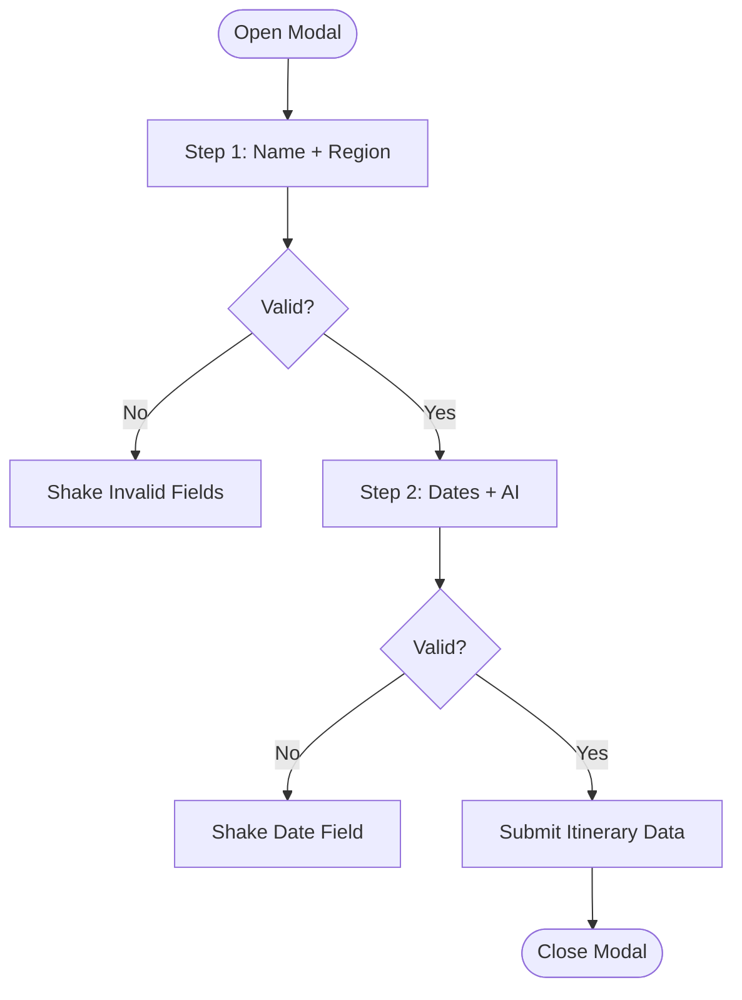
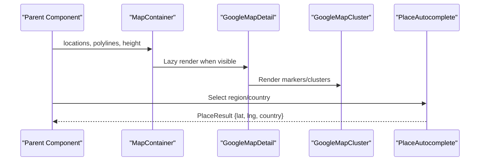
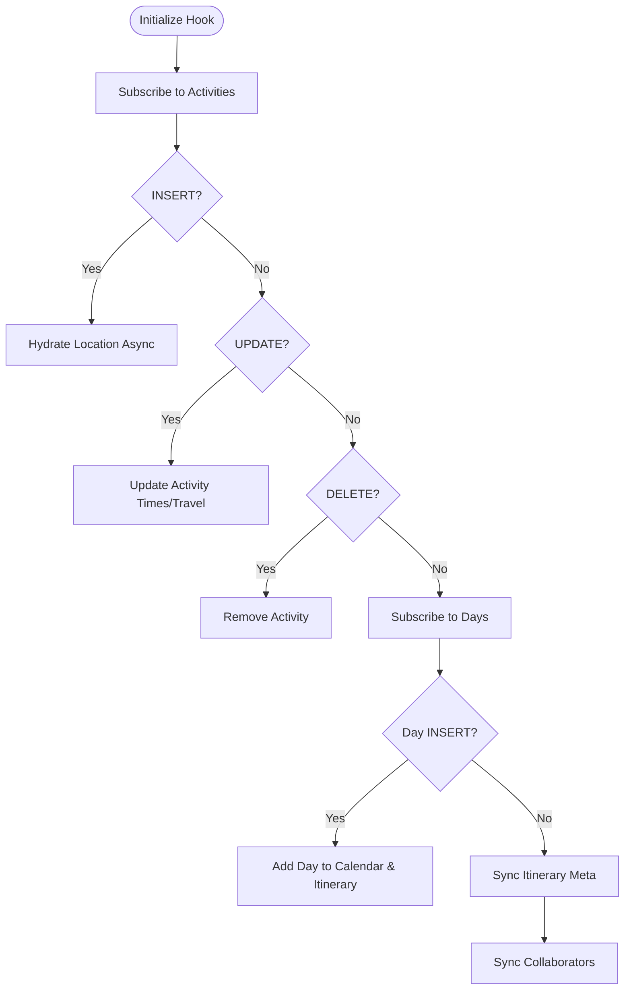
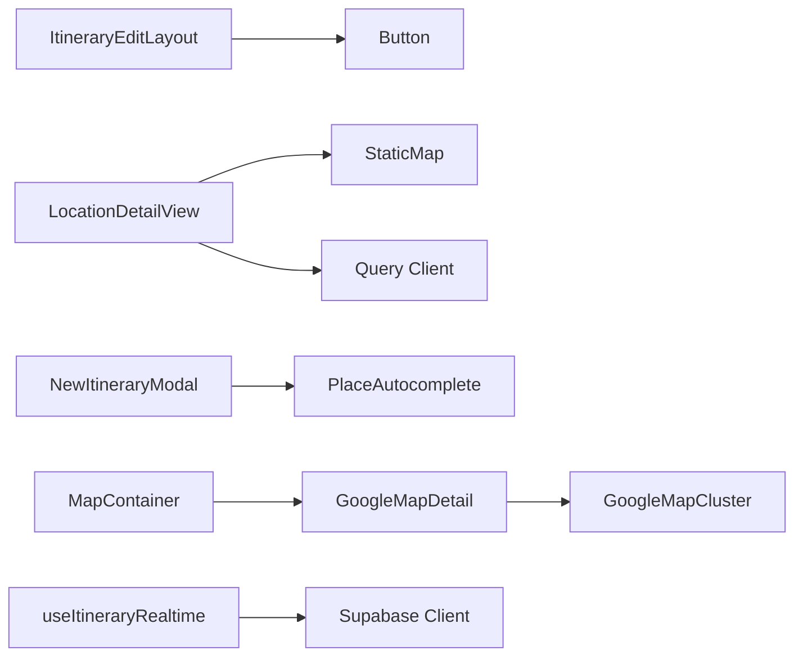

# Feature-Specific Components

<cite>
**Referenced Files in This Document**
- [ItineraryEditLayout.tsx](file://src/components/ui/itinerary/ItineraryEditLayout.tsx)
- [LocationDetailView.tsx](file://src/components/ui/detail-views/LocationDetailView.tsx)
- [ActionCard.tsx](file://src/components/ui/dashboard/ActionCard.tsx)
- [NewItineraryModal.tsx](file://src/components/ui/modals/NewItineraryModal.tsx)
- [GoogleMapCluster.tsx](file://src/components/ui/map/GoogleMapCluster.tsx)
- [ItineraryMapSection.tsx](file://src/components/ui/itinerary/ItineraryMapSection.tsx)
- [PlaceAutocomplete.tsx](file://src/components/ui/primitives/PlaceAutocomplete.tsx)
- [CreateCard.tsx](file://src/components/ui/dashboard/CreateCard.tsx)
- [useItineraryRealtime.ts](file://src/hooks/useItineraryRealtime.ts)
- [MapContainer.tsx](file://src/components/ui/map/MapContainer.tsx)
- [Input.tsx](file://src/components/ui/primitives/Input.tsx)
- [google-maps-url.ts](file://src/lib/maps/google-maps-url.ts)
</cite>

## Table of Contents
1. Introduction
2. Project Structure
3. Core Components
4. Architecture Overview
5. Detailed Component Analysis
6. Dependency Analysis
7. Performance Considerations
8. Troubleshooting Guide
9. Conclusion
10. Appendices

## Introduction
This document explains the feature-specific components that implement core application functionality for itinerary editing, detail views, dashboard elements, modals, and map integrations. It focuses on how these components compose together, manage state, handle events, and integrate with external services such as Google Maps. It also provides guidelines for extending existing features and building new ones following established patterns.

## Project Structure
The feature surface is organized by domain:
- Itinerary editing layout and panels
- Detail views for locations and entities
- Dashboard cards and actions
- Modals for creation flows
- Map integration layers (static and interactive maps)
- Primitives used across features (inputs, autocomplete)
- Realtime synchronization hook for collaborative updates

**Diagram sources**
- [ItineraryEditLayout.tsx:25-127](file://src/components/ui/itinerary/ItineraryEditLayout.tsx#L25-L127)
- [ItineraryMapSection.tsx:21-53](file://src/components/ui/itinerary/ItineraryMapSection.tsx#L21-L53)
- [LocationDetailView.tsx:189-776](file://src/components/ui/detail-views/LocationDetailView.tsx#L189-L776)
- [ActionCard.tsx:36-99](file://src/components/ui/dashboard/ActionCard.tsx#L36-L99)
- [CreateCard.tsx:50-95](file://src/components/ui/dashboard/CreateCard.tsx#L50-L95)
- [NewItineraryModal.tsx:45-280](file://src/components/ui/modals/NewItineraryModal.tsx#L45-L280)
- [GoogleMapCluster.tsx:80-136](file://src/components/ui/map/GoogleMapCluster.tsx#L80-L136)
- [MapContainer.tsx:45-93](file://src/components/ui/map/MapContainer.tsx#L45-L93)
- [PlaceAutocomplete.tsx:65-341](file://src/components/ui/primitives/PlaceAutocomplete.tsx#L65-L341)
- [useItineraryRealtime.ts:27-533](file://src/hooks/useItineraryRealtime.ts#L27-L533)

**Section sources**
- [ItineraryEditLayout.tsx:25-127](file://src/components/ui/itinerary/ItineraryEditLayout.tsx#L25-L127)
- [LocationDetailView.tsx:189-776](file://src/components/ui/detail-views/LocationDetailView.tsx#L189-L776)
- [ActionCard.tsx:36-99](file://src/components/ui/dashboard/ActionCard.tsx#L36-L99)
- [NewItineraryModal.tsx:45-280](file://src/components/ui/modals/NewItineraryModal.tsx#L45-L280)
- [GoogleMapCluster.tsx:80-136](file://src/components/ui/map/GoogleMapCluster.tsx#L80-L136)
- [ItineraryMapSection.tsx:21-53](file://src/components/ui/itinerary/ItineraryMapSection.tsx#L21-L53)
- [MapContainer.tsx:45-93](file://src/components/ui/map/MapContainer.tsx#L45-L93)
- [PlaceAutocomplete.tsx:65-341](file://src/components/ui/primitives/PlaceAutocomplete.tsx#L65-L341)
- [CreateCard.tsx:50-95](file://src/components/ui/dashboard/CreateCard.tsx#L50-L95)
- [useItineraryRealtime.ts:27-533](file://src/hooks/useItineraryRealtime.ts#L27-L533)

## Core Components
- Itinerary editing layout: a responsive three-column editor with resizable panes and an optional center panel overlay on smaller screens.
- Location detail view: a rich card showing images, description, opening hours, contact info, price range, and a small static map; includes “Add to” destination picker and “Also found in” cross-references.
- Dashboard action and create cards: reusable entry points to start creating links, collections, or itineraries.
- New itinerary modal: a two-step wizard to name a trip, select a region, choose dates, and opt into AI recommendations.
- Map integrations: a container that lazy-loads an interactive map, a cluster-based marker component for Google Maps, and a place autocomplete powered by Google Places.
- Realtime sync hook: subscribes to database changes and keeps calendar, itinerary, flights, and lodging lists synchronized across collaborators.

**Section sources**
- [ItineraryEditLayout.tsx:25-127](file://src/components/ui/itinerary/ItineraryEditLayout.tsx#L25-L127)
- [LocationDetailView.tsx:189-776](file://src/components/ui/detail-views/LocationDetailView.tsx#L189-L776)
- [ActionCard.tsx:36-99](file://src/components/ui/dashboard/ActionCard.tsx#L36-L99)
- [CreateCard.tsx:50-95](file://src/components/ui/dashboard/CreateCard.tsx#L50-L95)
- [NewItineraryModal.tsx:45-280](file://src/components/ui/modals/NewItineraryModal.tsx#L45-L280)
- [GoogleMapCluster.tsx:80-136](file://src/components/ui/map/GoogleMapCluster.tsx#L80-L136)
- [MapContainer.tsx:45-93](file://src/components/ui/map/MapContainer.tsx#L45-L93)
- [PlaceAutocomplete.tsx:65-341](file://src/components/ui/primitives/PlaceAutocomplete.tsx#L65-L341)
- [useItineraryRealtime.ts:27-533](file://src/hooks/useItineraryRealtime.ts#L27-L533)

## Architecture Overview
The system composes high-level feature components from primitives and integrates with Google Maps via dedicated wrappers. State is managed locally within components where appropriate and centrally through hooks for realtime collaboration. Data flows are unidirectional: props drive rendering, callbacks propagate user actions upward, and hooks bridge UI state to backend changes.

**Diagram sources**
- [ItineraryEditLayout.tsx:25-127](file://src/components/ui/itinerary/ItineraryEditLayout.tsx#L25-L127)
- [LocationDetailView.tsx:189-776](file://src/components/ui/detail-views/LocationDetailView.tsx#L189-L776)
- [MapContainer.tsx:45-93](file://src/components/ui/map/MapContainer.tsx#L45-L93)
- [GoogleMapCluster.tsx:80-136](file://src/components/ui/map/GoogleMapCluster.tsx#L80-L136)
- [PlaceAutocomplete.tsx:65-341](file://src/components/ui/primitives/PlaceAutocomplete.tsx#L65-L341)
- [useItineraryRealtime.ts:27-533](file://src/hooks/useItineraryRealtime.ts#L27-L533)

## Detailed Component Analysis

### Itinerary Editing Layout
- Purpose: Provides a flexible three-column layout for editing an itinerary’s timeline, a center panel for focused content, and a map area. On smaller screens, the center panel overlays the map and can be toggled via a floating button.
- Key behaviors:
  - Resizable columns with pointer events and minimum width constraints.
  - Motion-aware transitions respecting reduced motion preferences.
  - Responsive behavior: left column collapses on mobile while keeping the map visible.
- Event handling:
  - Pointer drag to resize columns; double-click resets width.
  - Floating button toggles the center panel visibility on mobile.
- Composition:
  - Accepts left, center, and right React nodes to compose day list, detail panel, and map.
- Performance:
  - Uses CSS transitions for smooth resizing and avoids heavy reflows by directly manipulating width during drag.

**Diagram sources**
- [ItineraryEditLayout.tsx:25-127](file://src/components/ui/itinerary/ItineraryEditLayout.tsx#L25-L127)
- [ItineraryEditLayout.tsx:129-203](file://src/components/ui/itinerary/ItineraryEditLayout.tsx#L129-L203)

**Section sources**
- [ItineraryEditLayout.tsx:25-127](file://src/components/ui/itinerary/ItineraryEditLayout.tsx#L25-L127)
- [ItineraryEditLayout.tsx:129-203](file://src/components/ui/itinerary/ItineraryEditLayout.tsx#L129-L203)

### Location Detail View
- Purpose: Displays comprehensive information about a location, including images, description, opening hours, contact details, price range, and a small static map. Supports adding the location to collections or itineraries and shows “Also found in” references.
- State management:
  - Local state for lightbox index, menu open/close, search query, selected save target, and inline create-collection modal.
  - Optimistic updates to “Also found in” using query client cache before server write completes.
- Integration points:
  - Static map renders a single-pin cluster for the current location.
  - Opens Google Maps in a new tab using either provided URI or constructed URL.
  - Integrates with collection/itinerary creation flow via callback props.
- Event handling:
  - Image gallery opens lightbox.
  - “Add to” picker filters targets and supports creating a new collection inline.
  - Mobile uses a bottom sheet for the picker; desktop uses a popover.
- Business logic:
  - Computes stay duration sentence and price range text.
  - Excludes current itinerary/collection from “Also found in”.
  - Reconciles optimistic updates with server truth by invalidating queries.

**Diagram sources**
- [LocationDetailView.tsx:189-776](file://src/components/ui/detail-views/LocationDetailView.tsx#L189-L776)

**Section sources**
- [LocationDetailView.tsx:189-776](file://src/components/ui/detail-views/LocationDetailView.tsx#L189-L776)

### Dashboard Action Card and Create Card
- ActionCard:
  - A clickable card with label, optional sticker image, hover/focus states, keyboard support, and disabled state.
  - Emits click events to callers for navigation or modal triggers.
- CreateCard:
  - Promotes creation flows for links, collections, and itineraries with consistent visual design.
  - Delegates action to caller via onAction prop (e.g., opening NewItineraryModal).

**Diagram sources**
- [ActionCard.tsx:36-99](file://src/components/ui/dashboard/ActionCard.tsx#L36-L99)
- [CreateCard.tsx:50-95](file://src/components/ui/dashboard/CreateCard.tsx#L50-L95)

**Section sources**
- [ActionCard.tsx:36-99](file://src/components/ui/dashboard/ActionCard.tsx#L36-L99)
- [CreateCard.tsx:50-95](file://src/components/ui/dashboard/CreateCard.tsx#L50-L95)

### New Itinerary Modal
- Purpose: Two-step wizard to plan a new itinerary. Step 1 collects trip name and region; Step 2 selects date range and toggles AI recommendations.
- Validation and UX:
  - Validates required fields per step and animates invalid fields.
  - Tracks submission state and prevents duplicate submissions.
  - Resets internal state when closing without submitting.
- Integration:
  - Uses PlaceAutocomplete for region selection.
  - Emits structured data to caller via onSubmit.
- Accessibility:
  - Keyboard navigable steps and controls; semantic roles for custom checkbox toggle.

**Diagram sources**
- [NewItineraryModal.tsx:45-280](file://src/components/ui/modals/NewItineraryModal.tsx#L45-L280)

**Section sources**
- [NewItineraryModal.tsx:45-280](file://src/components/ui/modals/NewItineraryModal.tsx#L45-L280)

### Map Integrations
- MapContainer:
  - Lazily loads the interactive map only when in view or when explicitly eager.
  - Passes locations and polylines to the underlying GoogleMapDetail implementation.
  - Tracks map load events for analytics.
- GoogleMapCluster:
  - Wraps Google Maps with APIProvider and renders AdvancedMarker clusters.
  - Calculates initial view based on cluster bounds and supports fitBounds behavior.
  - Handles hover states and optional zoom controls.
- ItineraryMapSection:
  - Presents a map card with constrained height and rounded styling.
  - Delegates rendering to MapContainer with itinerary-specific props.
- PlaceAutocomplete:
  - Debounced search against Google Places Autocomplete service.
  - Renders a portal dropdown with keyboard navigation and accessibility attributes.
  - Extracts structured place results and tracks usage.

**Diagram sources**
- [MapContainer.tsx:45-93](file://src/components/ui/map/MapContainer.tsx#L45-L93)
- [GoogleMapCluster.tsx:80-136](file://src/components/ui/map/GoogleMapCluster.tsx#L80-L136)
- [ItineraryMapSection.tsx:21-53](file://src/components/ui/itinerary/ItineraryMapSection.tsx#L21-L53)
- [PlaceAutocomplete.tsx:65-341](file://src/components/ui/primitives/PlaceAutocomplete.tsx#L65-L341)

**Section sources**
- [MapContainer.tsx:45-93](file://src/components/ui/map/MapContainer.tsx#L45-L93)
- [GoogleMapCluster.tsx:80-136](file://src/components/ui/map/GoogleMapCluster.tsx#L80-L136)
- [ItineraryMapSection.tsx:21-53](file://src/components/ui/itinerary/ItineraryMapSection.tsx#L21-L53)
- [PlaceAutocomplete.tsx:65-341](file://src/components/ui/primitives/PlaceAutocomplete.tsx#L65-L341)

### Realtime Collaboration Hook
- Purpose: Subscribes to Supabase channels to keep calendar days, activities, flights, lodgings, and itinerary metadata synchronized across collaborators.
- Behavior:
  - Inserts, updates, and deletes activities and days in both calendar and itinerary state trees.
  - Hydrates activity locations asynchronously after inserts to ensure full detail availability.
  - Syncs collaborator joins/leaves and updates itinerary meta fields like name and spot count.
  - Conditionally subscribes to flight/lodging channels only when corresponding sidebars are open.
- Error handling:
  - Logs warnings if location hydration fails but continues gracefully.
  - Ensures channels are removed on cleanup to prevent memory leaks.

**Diagram sources**
- [useItineraryRealtime.ts:27-533](file://src/hooks/useItineraryRealtime.ts#L27-L533)

**Section sources**
- [useItineraryRealtime.ts:27-533](file://src/hooks/useItineraryRealtime.ts#L27-L533)

## Dependency Analysis
- ItineraryEditLayout depends on primitives (Button), motion utilities, and CSS classes for layout and transitions.
- LocationDetailView composes multiple detail-view components, primitives (Button, Separator, Sheet, Popover, SearchBar), and map/static map modules. It also relies on query hooks for references and uses query client for optimistic updates.
- NewItineraryModal composes FormModal, Input, Calendar, and PlaceAutocomplete, and emits structured data to parent.
- MapContainer lazily loads GoogleMapDetail and tracks map load events.
- GoogleMapCluster wraps @vis.gl/react-google-maps and computes viewport from cluster data.
- PlaceAutocomplete depends on Google Places APIs and tracks usage analytics.
- useItineraryRealtime depends on Supabase client and utility formatters to transform and synchronize state.

**Diagram sources**
- [ItineraryEditLayout.tsx:25-127](file://src/components/ui/itinerary/ItineraryEditLayout.tsx#L25-L127)
- [LocationDetailView.tsx:189-776](file://src/components/ui/detail-views/LocationDetailView.tsx#L189-L776)
- [NewItineraryModal.tsx:45-280](file://src/components/ui/modals/NewItineraryModal.tsx#L45-L280)
- [MapContainer.tsx:45-93](file://src/components/ui/map/MapContainer.tsx#L45-L93)
- [GoogleMapCluster.tsx:80-136](file://src/components/ui/map/GoogleMapCluster.tsx#L80-L136)
- [useItineraryRealtime.ts:27-533](file://src/hooks/useItineraryRealtime.ts#L27-L533)

**Section sources**
- [ItineraryEditLayout.tsx:25-127](file://src/components/ui/itinerary/ItineraryEditLayout.tsx#L25-L127)
- [LocationDetailView.tsx:189-776](file://src/components/ui/detail-views/LocationDetailView.tsx#L189-L776)
- [NewItineraryModal.tsx:45-280](file://src/components/ui/modals/NewItineraryModal.tsx#L45-L280)
- [MapContainer.tsx:45-93](file://src/components/ui/map/MapContainer.tsx#L45-L93)
- [GoogleMapCluster.tsx:80-136](file://src/components/ui/map/GoogleMapCluster.tsx#L80-L136)
- [useItineraryRealtime.ts:27-533](file://src/hooks/useItineraryRealtime.ts#L27-L533)

## Performance Considerations
- Lazy loading: MapContainer defers rendering until visible or explicitly eager to reduce initial bundle and runtime cost.
- Reduced motion: ItineraryEditLayout respects user preferences to avoid animations when requested.
- Debouncing: PlaceAutocomplete debounces network requests to limit API calls and improve responsiveness.
- Optimistic updates: LocationDetailView updates local cache immediately and reconciles later to provide instant feedback.
- Efficient updates: useItineraryRealtime performs targeted updates to arrays and preserves order to avoid unnecessary re-renders and map pin renumbering issues.
- Intersection observer: MapContainer uses intersection observation to trigger map initialization only when needed.

[No sources needed since this section provides general guidance]

## Troubleshooting Guide
- Google Maps not loading:
  - Ensure environment variables for API key and map IDs are set correctly.
  - Verify that MapContainer is rendered within a visible container; check intersection observer behavior.
- Autocomplete not returning results:
  - Confirm Places library is available and API key has proper permissions.
  - Check debounce timing and input length thresholds.
- Realtime not syncing:
  - Verify Supabase channel subscriptions are active and itinerary ID is valid.
  - Inspect console warnings for location hydration failures and ensure projections match backend schema.
- Modal validation issues:
  - Ensure required fields are filled before advancing steps; check shake animations for invalid fields.
- Map bounds and clustering:
  - If clusters do not fit properly, verify cluster data includes valid latitude/longitude and that fitBounds is enabled.

**Section sources**
- [GoogleMapCluster.tsx:80-136](file://src/components/ui/map/GoogleMapCluster.tsx#L80-L136)
- [PlaceAutocomplete.tsx:65-341](file://src/components/ui/primitives/PlaceAutocomplete.tsx#L65-L341)
- [useItineraryRealtime.ts:27-533](file://src/hooks/useItineraryRealtime.ts#L27-L533)
- [NewItineraryModal.tsx:45-280](file://src/components/ui/modals/NewItineraryModal.tsx#L45-L280)
- [MapContainer.tsx:45-93](file://src/components/ui/map/MapContainer.tsx#L45-L93)

## Conclusion
The feature-specific components form a cohesive system for itinerary editing, detailed location exploration, dashboard actions, creation workflows, and robust map integrations. They follow clear composition patterns, manage state efficiently with local and global strategies, and integrate seamlessly with Google Maps and realtime collaboration. Extending these features should adhere to established interfaces, leverage primitives, and maintain performance through lazy loading, debouncing, and optimistic updates.

[No sources needed since this section summarizes without analyzing specific files]

## Appendices

### Guidelines for Extending Features
- Compose from primitives: Use Button, Input, Sheet, Popover, and other primitives to maintain consistency.
- Follow prop contracts: Extend existing components by adding well-typed props and preserving backward compatibility.
- Manage state close to the UI: Keep local state in components unless shared across many components; use hooks for cross-cutting concerns like realtime sync.
- Integrate maps carefully: Prefer MapContainer for lazy loading and GoogleMapCluster for markers; validate cluster data and bounds.
- Handle errors gracefully: Log warnings, degrade gracefully when external services fail, and provide user-friendly fallbacks.
- Optimize interactions: Debounce inputs, respect reduced motion, and avoid heavy computations in render paths.

[No sources needed since this section provides general guidance]