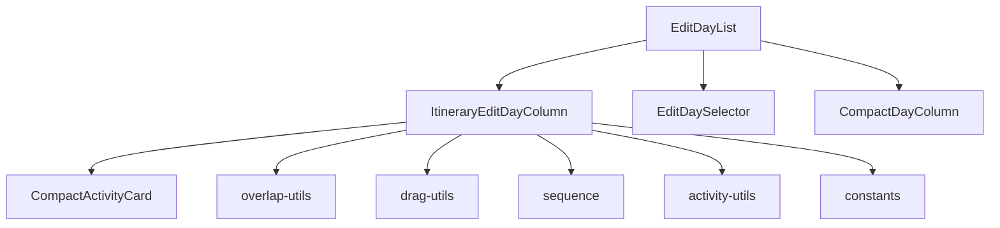
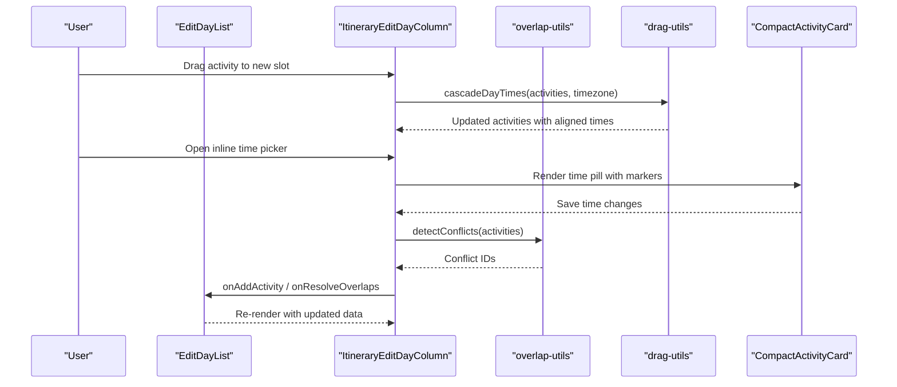
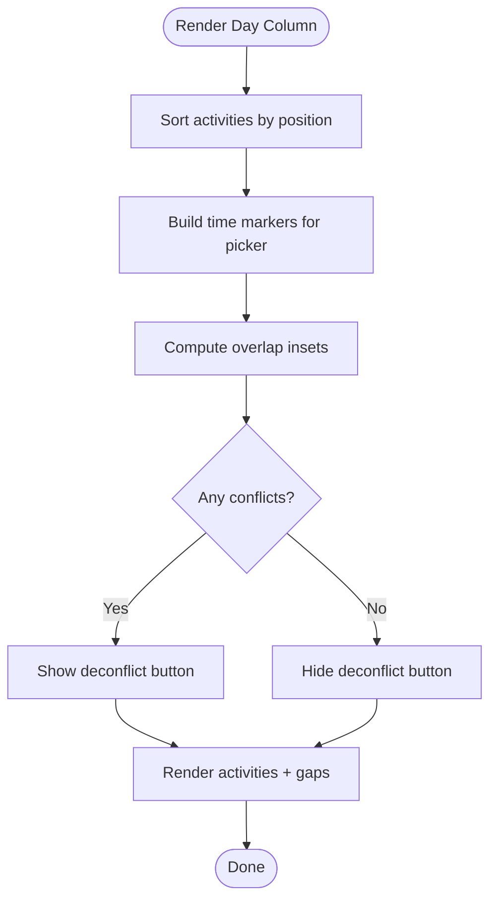
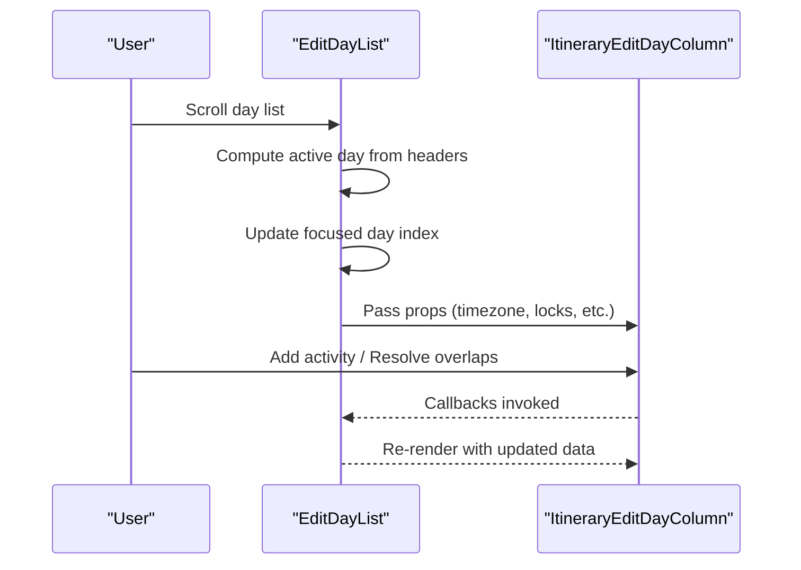
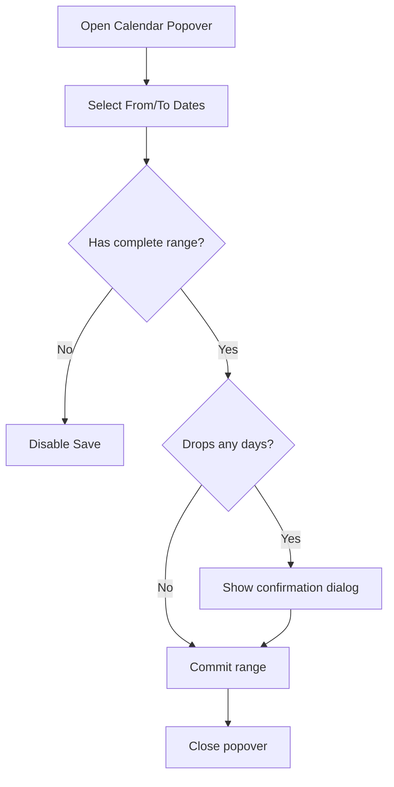
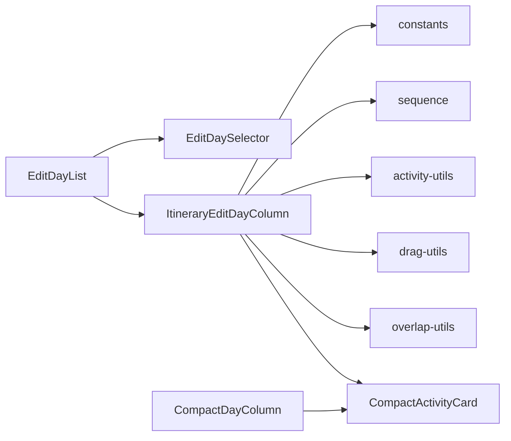

# Day Management Components

<cite>
**Referenced Files in This Document**
- [ItineraryEditDayColumn.tsx](file://src/components/ui/itinerary/ItineraryEditDayColumn.tsx)
- [EditDayList.tsx](file://src/components/ui/itinerary/EditDayList.tsx)
- [EditDaySelector.tsx](file://src/components/ui/itinerary/EditDaySelector.tsx)
- [CompactDayColumn.tsx](file://src/components/ui/itinerary/CompactDayColumn.tsx)
- [activity-utils.ts](file://src/components/ui/itinerary/activity-utils.ts)
- [overlap-utils.ts](file://src/components/ui/itinerary/overlap-utils.ts)
- [drag-utils.ts](file://src/components/ui/itinerary/drag-utils.ts)
- [constants.ts](file://src/components/ui/itinerary/ItineraryDayColumn/constants.ts)
- [sequence.ts](file://src/components/ui/itinerary/ItineraryDayColumn/sequence.ts)
- [CompactActivityCard.tsx](file://src/components/ui/itinerary/CompactActivityCard.tsx)
- [EditDropIndicator.tsx](file://src/components/ui/itinerary/EditDropIndicator.tsx)
</cite>

## Table of Contents
1. [Introduction](#introduction)
2. [Project Structure](#project-structure)
3. [Core Components](#core-components)
4. [Architecture Overview](#architecture-overview)
5. [Detailed Component Analysis](#detailed-component-analysis)
6. [Dependency Analysis](#dependency-analysis)
7. [Performance Considerations](#performance-considerations)
8. [Troubleshooting Guide](#troubleshooting-guide)
9. [Conclusion](#conclusion)

## Introduction
This document explains the day-based activity management components that power Argo’s itinerary editing experience. It focuses on how individual days are displayed and edited, how activities are reordered via drag-and-drop, how time-based positioning is computed and visualized, and how multiple day views stay synchronized. It also covers date handling, conflict resolution, and performance strategies for large itineraries and memory-efficient rendering of multiple day columns.

## Project Structure
The day management system is centered around a few key components and utilities:
- EditDayList orchestrates the list of days, day selection, and cross-day behaviors.
- ItineraryEditDayColumn renders a single editable day column with drag-and-drop, overlap detection, and time-based layout.
- EditDaySelector provides sticky navigation across days and controls for transport visibility and date range changes.
- CompactDayColumn shows a condensed read-only view of a day’s activities.
- Supporting utilities handle time parsing/formatting, overlap detection, cascading times after reorders, and building a day sequence for timeline visualization.

**Diagram sources**
- [EditDayList.tsx:87-497](file://src/components/ui/itinerary/EditDayList.tsx#L87-L497)
- [ItineraryEditDayColumn.tsx:450-800](file://src/components/ui/itinerary/ItineraryEditDayColumn.tsx#L450-L800)
- [EditDaySelector.tsx:55-303](file://src/components/ui/itinerary/EditDaySelector.tsx#L55-L303)
- [CompactDayColumn.tsx:31-127](file://src/components/ui/itinerary/CompactDayColumn.tsx#L31-L127)
- [overlap-utils.ts:75-218](file://src/components/ui/itinerary/overlap-utils.ts#L75-L218)
- [drag-utils.ts:37-89](file://src/components/ui/itinerary/drag-utils.ts#L37-L89)
- [sequence.ts:68-196](file://src/components/ui/itinerary/ItineraryDayColumn/sequence.ts#L68-L196)
- [activity-utils.ts:5-74](file://src/components/ui/itinerary/activity-utils.ts#L5-L74)
- [constants.ts:1-5](file://src/components/ui/itinerary/ItineraryDayColumn/constants.ts#L1-L5)

**Section sources**
- [EditDayList.tsx:87-497](file://src/components/ui/itinerary/EditDayList.tsx#L87-L497)
- [ItineraryEditDayColumn.tsx:450-800](file://src/components/ui/itinerary/ItineraryEditDayColumn.tsx#L450-L800)
- [EditDaySelector.tsx:55-303](file://src/components/ui/itinerary/EditDaySelector.tsx#L55-L303)
- [CompactDayColumn.tsx:31-127](file://src/components/ui/itinerary/CompactDayColumn.tsx#L31-L127)

## Core Components
- ItineraryEditDayColumn: Renders a single day’s activities with drag-and-drop reordering, inline time editing, overlap detection, lodging bookends, transport rows, and deconfliction actions.
- EditDayList: Manages the collection of days, active day tracking via scroll, flight/lodging modes, and delegates to ItineraryEditDayColumn per day.
- EditDaySelector: Sticky header with mini-tabs for each day, transport toggle, calendar popover to change itinerary dates, and collection panel toggle.
- CompactDayColumn: Read-only compact view of a day’s activities with transport legs shown between activities.

Key responsibilities:
- Sorting activities by position or start time depending on context.
- Detecting and resolving overlaps (time conflicts and travel overflow).
- Cascading times after reorder to maintain consistent gaps.
- Managing UI state like ghost slots, locked activities, and pending time recalculations.

**Section sources**
- [ItineraryEditDayColumn.tsx:450-800](file://src/components/ui/itinerary/ItineraryEditDayColumn.tsx#L450-L800)
- [EditDayList.tsx:87-497](file://src/components/ui/itinerary/EditDayList.tsx#L87-L497)
- [EditDaySelector.tsx:55-303](file://src/components/ui/itinerary/EditDaySelector.tsx#L55-L303)
- [CompactDayColumn.tsx:31-127](file://src/components/ui/itinerary/CompactDayColumn.tsx#L31-L127)

## Architecture Overview
The edit flow centers on EditDayList, which renders a sticky EditDaySelector and a vertical stack of ItineraryEditDayColumn instances. Each column uses dnd-kit for drag-and-drop, computes overlaps using overlap-utils, and cascades times via drag-utils when needed. CompactDayColumn is used elsewhere for read-only timelines.

**Diagram sources**
- [ItineraryEditDayColumn.tsx:450-800](file://src/components/ui/itinerary/ItineraryEditDayColumn.tsx#L450-L800)
- [drag-utils.ts:37-89](file://src/components/ui/itinerary/drag-utils.ts#L37-L89)
- [overlap-utils.ts:229-297](file://src/components/ui/itinerary/overlap-utils.ts#L229-L297)
- [CompactActivityCard.tsx:208-420](file://src/components/ui/itinerary/CompactActivityCard.tsx#L208-L420)

## Detailed Component Analysis

### ItineraryEditDayColumn
Responsibilities:
- Sorts activities by server-provided position to preserve ordering intent across refetches.
- Builds markers from activities for inline time picker conflict detection.
- Computes overlap insets based on activity ranges and a constant inset value.
- Renders empty day drop targets, inter-card gaps, and lodging bookends.
- Provides deconflict button to resolve overlapping times.
- Integrates transport rows and mode switching.

Key implementation highlights:
- Activity sorting by position ensures stable order even when times wrap past midnight or overlap.
- Overlap detection uses pairwise comparisons and transport overflow checks.
- Lodging bookends are synthesized to show check-in/check-out transitions across days.
- Ghost slot mechanism supports adding activities at precise positions during drag.

**Diagram sources**
- [ItineraryEditDayColumn.tsx:517-658](file://src/components/ui/itinerary/ItineraryEditDayColumn.tsx#L517-L658)
- [overlap-utils.ts:229-297](file://src/components/ui/itinerary/overlap-utils.ts#L229-L297)

**Section sources**
- [ItineraryEditDayColumn.tsx:450-800](file://src/components/ui/itinerary/ItineraryEditDayColumn.tsx#L450-L800)
- [ItineraryEditDayColumn/constants.ts:1-5](file://src/components/ui/itinerary/ItineraryDayColumn/constants.ts#L1-L5)

### EditDayList
Responsibilities:
- Tracks current visible day via scroll detection and updates the active tab.
- Preserves day heights during cross-day drags to prevent layout jumps.
- Supports specialized modes (flight, lodging) that filter and render relevant activities.
- Passes down callbacks for adding activities, resolving overlaps, and managing transport visibility.

Key implementation highlights:
- Scroll handler computes the active day based on sticky header alignment.
- Cross-day drag height preservation avoids misaligned drops.
- Flight and lodging modes render filtered lists with skeleton placeholders for new entries.

**Diagram sources**
- [EditDayList.tsx:125-240](file://src/components/ui/itinerary/EditDayList.tsx#L125-L240)
- [EditDayList.tsx:425-497](file://src/components/ui/itinerary/EditDayList.tsx#L425-L497)

**Section sources**
- [EditDayList.tsx:87-497](file://src/components/ui/itinerary/EditDayList.tsx#L87-L497)

### EditDaySelector
Responsibilities:
- Displays mini-tabs for each day with an active indicator.
- Provides transport route visibility toggle.
- Offers a calendar popover to change itinerary date range with confirmation if days are dropped.
- Toggles the center collection panel.

Key implementation highlights:
- Baseline vs working date range prevents accidental commits when external edits occur.
- Confirmation dialog warns about permanent deletion of activities on removed days.
- Disabled calendar dates before today enforce future-only planning.

**Diagram sources**
- [EditDaySelector.tsx:66-161](file://src/components/ui/itinerary/EditDaySelector.tsx#L66-L161)
- [EditDaySelector.tsx:167-303](file://src/components/ui/itinerary/EditDaySelector.tsx#L167-L303)

**Section sources**
- [EditDaySelector.tsx:55-303](file://src/components/ui/itinerary/EditDaySelector.tsx#L55-L303)

### CompactDayColumn
Responsibilities:
- Renders a compact, read-only view of a day’s activities.
- Shows transport legs between consecutive activities when available.
- Formats day header and sorts activities by start time.

Key implementation highlights:
- Filters out transport activities from the main list; transport rows appear as connectors.
- Uses activity-utils for time parsing and formatting.

**Section sources**
- [CompactDayColumn.tsx:31-127](file://src/components/ui/itinerary/CompactDayColumn.tsx#L31-L127)

### Supporting Utilities
- activity-utils: Time parsing/formatting, wall-time comparison, lodging map builder.
- overlap-utils: Conflict detection, proposed order computation, cascading times with locked anchors.
- drag-utils: Cascading times after reorder, clearing stale leg data.
- sequence: Builds a day sequence including activities and transport legs for timeline rendering.
- constants: Shared inset value and transport mode vocabulary.

**Section sources**
- [activity-utils.ts:5-128](file://src/components/ui/itinerary/activity-utils.ts#L5-L128)
- [overlap-utils.ts:75-218](file://src/components/ui/itinerary/overlap-utils.ts#L75-L218)
- [drag-utils.ts:37-89](file://src/components/ui/itinerary/drag-utils.ts#L37-L89)
- [sequence.ts:68-196](file://src/components/ui/itinerary/ItineraryDayColumn/sequence.ts#L68-L196)
- [constants.ts:1-5](file://src/components/ui/itinerary/ItineraryDayColumn/constants.ts#L1-L5)

## Dependency Analysis
Component relationships and data flows:
- EditDayList depends on ItineraryEditDayColumn and EditDaySelector for day management and navigation.
- ItineraryEditDayColumn depends on CompactActivityCard for rendering, overlap-utils for conflict detection, drag-utils for time cascading, and activity-utils for time parsing.
- EditDaySelector depends on primitives (Button, Calendar, Popover) and toast notifications for user feedback.
- CompactDayColumn depends on CompactActivityCard and TransportDetailRow for display.

**Diagram sources**
- [EditDayList.tsx:87-497](file://src/components/ui/itinerary/EditDayList.tsx#L87-L497)
- [ItineraryEditDayColumn.tsx:450-800](file://src/components/ui/itinerary/ItineraryEditDayColumn.tsx#L450-L800)
- [EditDaySelector.tsx:55-303](file://src/components/ui/itinerary/EditDaySelector.tsx#L55-L303)
- [CompactDayColumn.tsx:31-127](file://src/components/ui/itinerary/CompactDayColumn.tsx#L31-L127)

**Section sources**
- [EditDayList.tsx:87-497](file://src/components/ui/itinerary/EditDayList.tsx#L87-L497)
- [ItineraryEditDayColumn.tsx:450-800](file://src/components/ui/itinerary/ItineraryEditDayColumn.tsx#L450-L800)
- [EditDaySelector.tsx:55-303](file://src/components/ui/itinerary/EditDaySelector.tsx#L55-L303)
- [CompactDayColumn.tsx:31-127](file://src/components/ui/itinerary/CompactDayColumn.tsx#L31-L127)

## Performance Considerations
Strategies implemented and recommended:
- Stable sorting by position: Prevents unintended reordering when times wrap or overlap; reduces unnecessary re-renders caused by unstable sort keys.
- Memoization: Heavy computations (sorted activities, markers, overlap insets) are wrapped in memoization hooks to avoid recomputation on every render.
- Drag height preservation: During cross-day drags, source day heights are preserved to prevent layout shifts and improve UX.
- Time grid alignment: Times are snapped to a 10-minute grid to keep schedules clean and reduce precision-related reflows.
- Conditional rendering: Empty states, transport rows, and booking bookends are conditionally rendered to minimize DOM size.
- Conflict detection optimization: Pairwise overlap checks are scoped to timed, non-transport activities; transport overflow is checked only between consecutive activities.
- Memory management: Avoid storing large transient objects in component state; use refs for temporary values (e.g., last scroll top, seeded span). Clear stale leg data after reorders to prevent stale map visuals.

[No sources needed since this section provides general guidance]

## Troubleshooting Guide
Common issues and resolutions:
- Activities jump unexpectedly after reorder: Ensure sorting is by position rather than start_time; verify cascadeDayTimes is applied post-drag.
- Inline time picker opens but drag is disabled: The time picker disables drag to prevent conflicts; close the picker to resume dragging.
- Deconflict button not visible: Only appears when detectConflicts reports overlaps; verify activities have start/end times and no transport category.
- Transport row disappears after mode change: Mode changes may trigger recalculation; ensure unavailableLegIds and hiddenTransports are managed correctly.
- Date range changes remove days: When dropping days, a confirmation dialog warns about permanent deletion; confirm only when intended.

**Section sources**
- [overlap-utils.ts:229-297](file://src/components/ui/itinerary/overlap-utils.ts#L229-L297)
- [drag-utils.ts:37-89](file://src/components/ui/itinerary/drag-utils.ts#L37-L89)
- [EditDaySelector.tsx:147-161](file://src/components/ui/itinerary/EditDaySelector.tsx#L147-L161)

## Conclusion
The day management components provide a robust, performant foundation for editing itineraries. They combine stable sorting, conflict detection, time cascading, and intuitive drag-and-drop interactions to support complex scheduling scenarios. With careful memoization, conditional rendering, and memory-aware patterns, the system scales well to large itineraries while maintaining responsiveness and clarity.

[No sources needed since this section summarizes without analyzing specific files]