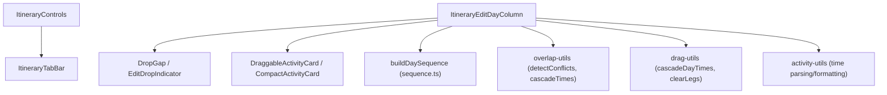
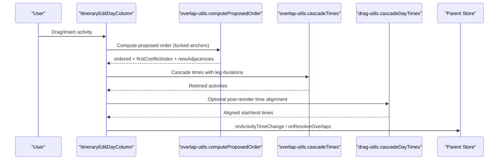
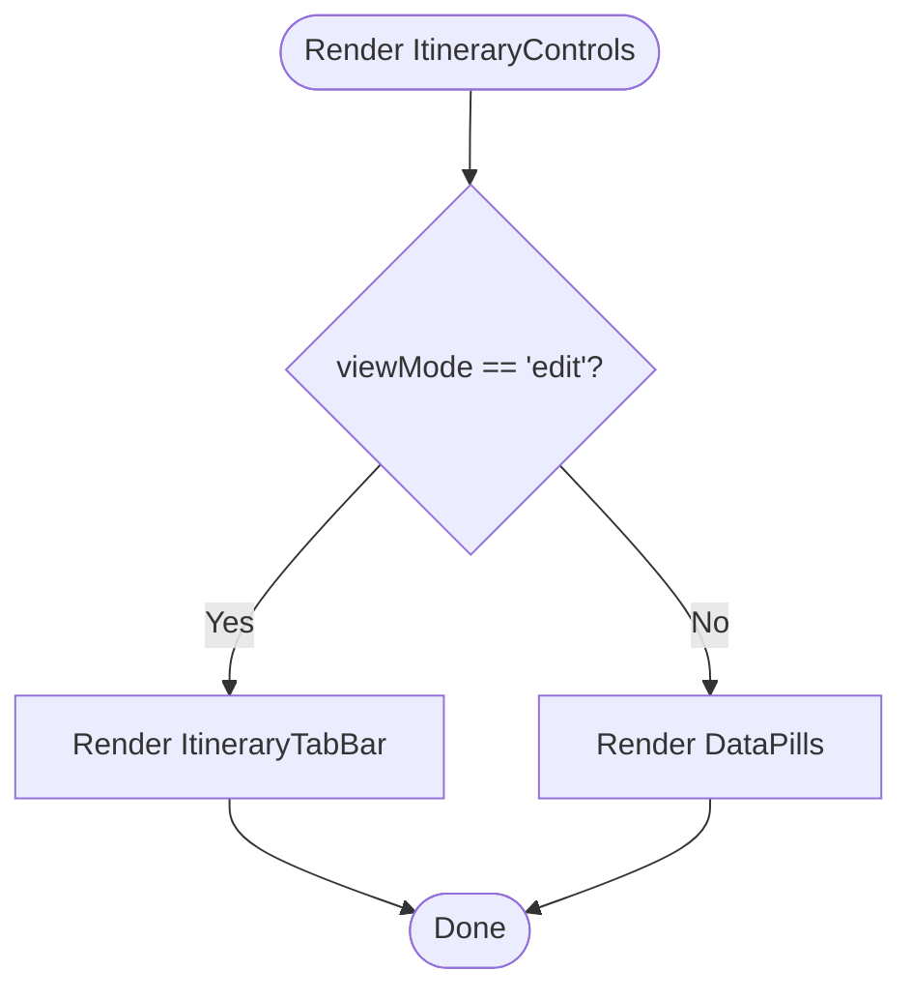
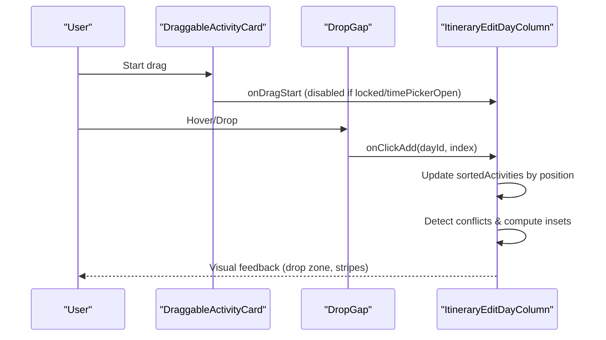
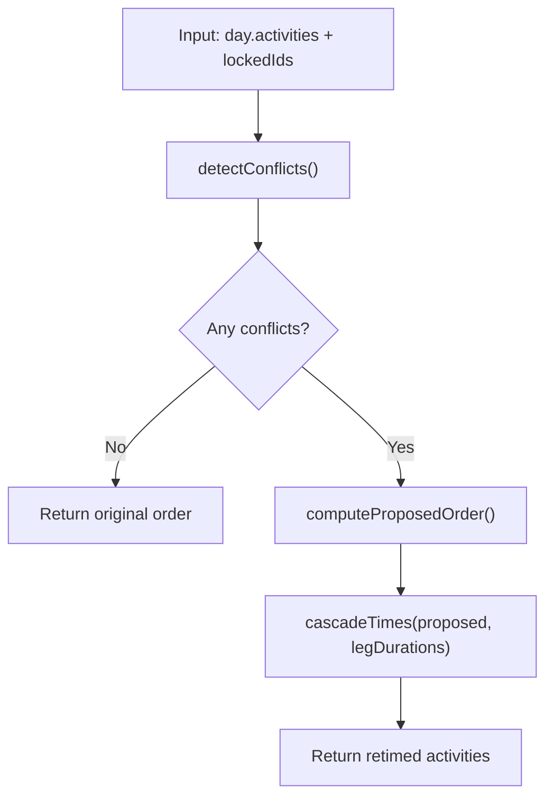
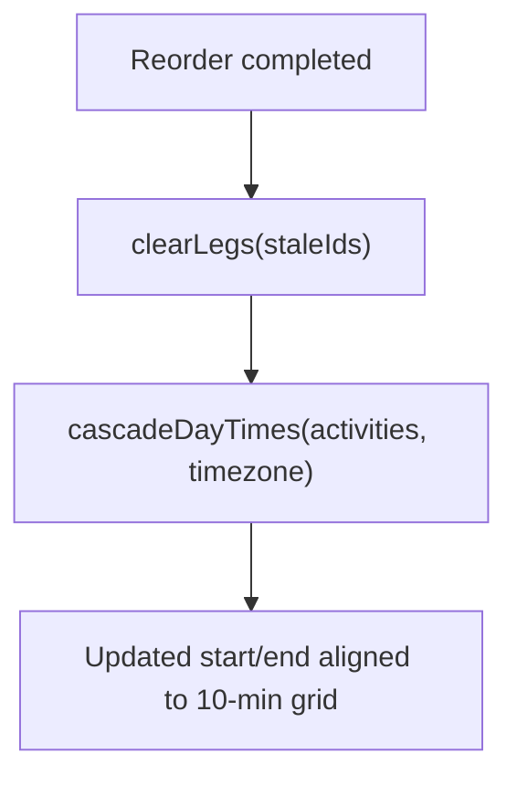
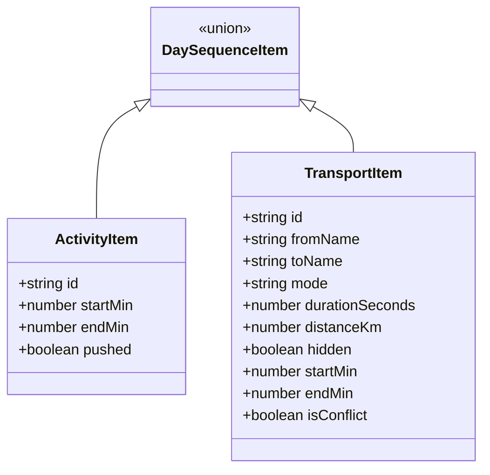
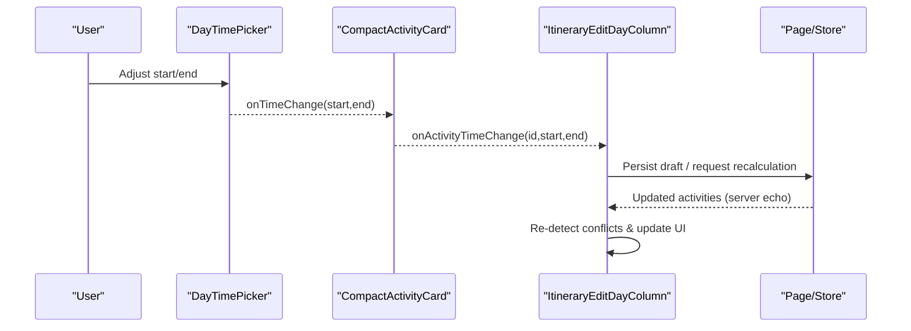
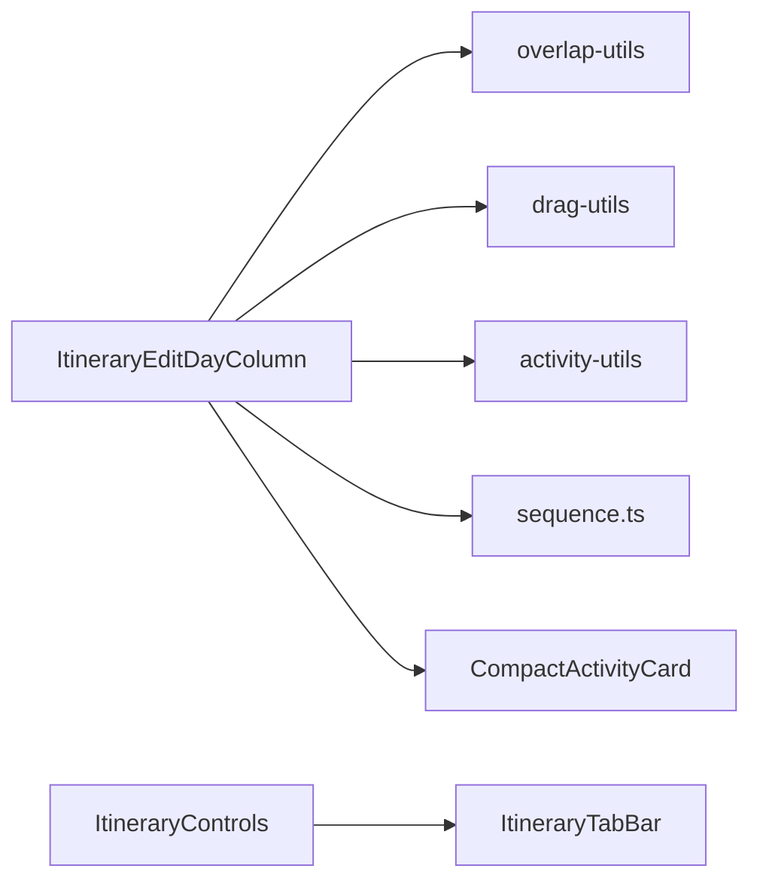

# Interaction Utilities

<cite>
**Referenced Files in This Document**
- [ItineraryControls.tsx](file://src/components/ui/itinerary/ItineraryControls.tsx)
- [drag-utils.ts](file://src/components/ui/itinerary/drag-utils.ts)
- [activity-utils.ts](file://src/components/ui/itinerary/activity-utils.ts)
- [overlap-utils.ts](file://src/components/ui/itinerary/overlap-utils.ts)
- [sequence.ts](file://src/components/ui/itinerary/ItineraryDayColumn/sequence.ts)
- [ItineraryEditDayColumn.tsx](file://src/components/ui/itinerary/ItineraryEditDayColumn.tsx)
- [CompactActivityCard.tsx](file://src/components/ui/itinerary/CompactActivityCard.tsx)
- [EditDropIndicator.tsx](file://src/components/ui/itinerary/EditDropIndicator.tsx)
- [ItineraryTabBar.tsx](file://src/components/ui/itinerary/ItineraryTabBar.tsx)
</cite>

## Table of Contents
1. Introduction
2. Project Structure
3. Core Components
4. Architecture Overview
5. Detailed Component Analysis
6. Dependency Analysis
7. Performance Considerations
8. Troubleshooting Guide
9. Conclusion

## Introduction
This document explains the interaction utilities and control components that power Argo’s itinerary editing interface. It focuses on:
- ItineraryControls for common actions like adding activities, generating AI itineraries (via tabs), and managing trip settings (collaborators, view/edit mode).
- Drag-and-drop utilities in drag-utils.ts for activity reordering and time cascading.
- Activity manipulation and validation helpers in activity-utils.ts.
- Overlap detection and deconfliction algorithms in overlap-utils.ts.
- Event handling patterns, collision detection, and state synchronization across the edit column.
- Accessibility features, keyboard navigation support, and touch interaction handling for mobile devices.

## Project Structure
The itinerary editing surface is composed of a header controls row, an editable day column with draggable cards, drop zones, transport rows, and utility modules for time math, overlap detection, and sequence building.

**Diagram sources**
- [ItineraryControls.tsx:57-163](file://src/components/ui/itinerary/ItineraryControls.tsx#L57-L163)
- [ItineraryTabBar.tsx:37-90](file://src/components/ui/itinerary/ItineraryTabBar.tsx#L37-L90)
- [ItineraryEditDayColumn.tsx:450-1034](file://src/components/ui/itinerary/ItineraryEditDayColumn.tsx#L450-L1034)
- [sequence.ts:68-194](file://src/components/ui/itinerary/ItineraryDayColumn/sequence.ts#L68-L194)
- [overlap-utils.ts:75-218](file://src/components/ui/itinerary/overlap-utils.ts#L75-L218)
- [drag-utils.ts:25-88](file://src/components/ui/itinerary/drag-utils.ts#L25-L88)
- [activity-utils.ts:5-74](file://src/components/ui/itinerary/activity-utils.ts#L5-L74)

**Section sources**
- [ItineraryControls.tsx:57-163](file://src/components/ui/itinerary/ItineraryControls.tsx#L57-L163)
- [ItineraryEditDayColumn.tsx:450-1034](file://src/components/ui/itinerary/ItineraryEditDayColumn.tsx#L450-L1034)

## Core Components
- ItineraryControls: Header controls row showing data pills in view mode and a tab strip in edit mode; exposes invite and view/edit toggle.
- ItineraryEditDayColumn: Draggable day column with drop gaps, transport rows, conflict indicators, and add/resolve actions.
- CompactActivityCard: Per-activity card with time picker, notes, attachments, and optimization controls.
- Utility modules:
  - drag-utils.ts: Time cascading after reorder and clearing stale travel legs.
  - activity-utils.ts: Time parsing/formatting, lodging map builder, wall-time comparison.
  - overlap-utils.ts: Conflict detection, proposed order computation, and time cascading to resolve overlaps.
  - sequence.ts: Builds a visual timeline sequence including transport legs between activities.

**Section sources**
- [ItineraryControls.tsx:57-163](file://src/components/ui/itinerary/ItineraryControls.tsx#L57-L163)
- [ItineraryEditDayColumn.tsx:450-1034](file://src/components/ui/itinerary/ItineraryEditDayColumn.tsx#L450-L1034)
- [CompactActivityCard.tsx:43-74](file://src/components/ui/itinerary/CompactActivityCard.tsx#L43-L74)
- [drag-utils.ts:25-88](file://src/components/ui/itinerary/drag-utils.ts#L25-L88)
- [activity-utils.ts:5-128](file://src/components/ui/itinerary/activity-utils.ts#L5-L128)
- [overlap-utils.ts:75-218](file://src/components/ui/itinerary/overlap-utils.ts#L75-L218)
- [sequence.ts:68-194](file://src/components/ui/itinerary/ItineraryDayColumn/sequence.ts#L68-L194)

## Architecture Overview
The editing flow integrates UI interactions with deterministic scheduling logic:
- User drags or inserts activities via drop gaps.
- The column computes conflicts and offers deconfliction.
- Proposed orders are computed, then times are cascaded respecting locked anchors and travel legs.
- Transport legs are derived from stored travel metadata and shown as detail rows.
- State updates propagate through callbacks to parent pages for persistence.

**Diagram sources**
- [ItineraryEditDayColumn.tsx:655-735](file://src/components/ui/itinerary/ItineraryEditDayColumn.tsx#L655-L735)
- [overlap-utils.ts:75-218](file://src/components/ui/itinerary/overlap-utils.ts#L75-L218)
- [drag-utils.ts:37-88](file://src/components/ui/itinerary/drag-utils.ts#L37-L88)

## Detailed Component Analysis

### ItineraryControls
- Purpose: Provides high-level controls for the itinerary page header.
- Behavior:
  - View mode shows data pills (locations, days, attachments, last edited).
  - Edit mode swaps to a tab bar (Itinerary, Flight, Lodging, Bookings, Expenses, Notes).
  - Right side shows collaborators, Invite button, and View/Edit toggle.
- Integration:
  - Controlled by parent for viewMode and activeTab.
  - Emits events for inviting collaborators and switching modes/tabs.

**Diagram sources**
- [ItineraryControls.tsx:97-129](file://src/components/ui/itinerary/ItineraryControls.tsx#L97-L129)
- [ItineraryTabBar.tsx:37-90](file://src/components/ui/itinerary/ItineraryTabBar.tsx#L37-L90)

**Section sources**
- [ItineraryControls.tsx:57-163](file://src/components/ui/itinerary/ItineraryControls.tsx#L57-L163)
- [ItineraryTabBar.tsx:37-90](file://src/components/ui/itinerary/ItineraryTabBar.tsx#L37-L90)

### Drag-and-Drop and Reordering (ItineraryEditDayColumn)
- Sortable context wraps activities using dnd-kit; each card is draggable unless locked or when inline time picker is open.
- Drop gaps provide insertion points between cards and at edges; they render a drop indicator and optional “Add activity” hover line.
- Empty day target allows dropping into empty days.
- Transport rows appear between activities when both have coordinates and travel metadata exist.
- Locking prevents certain activities (flights, synthetic lodging bookends) from being dragged.

**Diagram sources**
- [ItineraryEditDayColumn.tsx:345-401](file://src/components/ui/itinerary/ItineraryEditDayColumn.tsx#L345-L401)
- [ItineraryEditDayColumn.tsx:137-227](file://src/components/ui/itinerary/ItineraryEditDayColumn.tsx#L137-L227)
- [ItineraryEditDayColumn.tsx:815-955](file://src/components/ui/itinerary/ItineraryEditDayColumn.tsx#L815-L955)

**Section sources**
- [ItineraryEditDayColumn.tsx:345-401](file://src/components/ui/itinerary/ItineraryEditDayColumn.tsx#L345-L401)
- [ItineraryEditDayColumn.tsx:137-227](file://src/components/ui/itinerary/ItineraryEditDayColumn.tsx#L137-L227)
- [ItineraryEditDayColumn.tsx:815-955](file://src/components/ui/itinerary/ItineraryEditDayColumn.tsx#L815-L955)

### Activity Manipulation and Validation (activity-utils.ts)
- parseTimeMins: Converts ISO timestamps or HH:MM strings to minutes since midnight, optionally honoring timezone.
- formatTimeRange: Formats start/end times with locale-aware AM/PM or 24-hour display.
- sameWallTime: Compares two time values ignoring format differences (ISO vs HH:MM).
- buildLodgingMap: Maps lodging ranges to per-day check-in/check-out times.

These utilities underpin consistent time handling across the editor and ensure stable comparisons for change detection and UI rendering.

**Section sources**
- [activity-utils.ts:5-74](file://src/components/ui/itinerary/activity-utils.ts#L5-L74)
- [activity-utils.ts:90-128](file://src/components/ui/itinerary/activity-utils.ts#L90-L128)

### Overlap Detection and Deconfliction (overlap-utils.ts)
- detectConflicts: Identifies overlapping activities and transport overflow cases.
- computeProposedOrder: Produces a non-conflicting order respecting locked anchors and user windows.
- cascadeTimes: Recomputes start/end times from the first conflict forward, snapping to a 10-minute grid and preserving durations.
- dayHasConflicts: Quick boolean check for conflict presence.

**Diagram sources**
- [overlap-utils.ts:229-297](file://src/components/ui/itinerary/overlap-utils.ts#L229-L297)
- [overlap-utils.ts:75-153](file://src/components/ui/itinerary/overlap-utils.ts#L75-L153)
- [overlap-utils.ts:166-218](file://src/components/ui/itinerary/overlap-utils.ts#L166-L218)

**Section sources**
- [overlap-utils.ts:75-218](file://src/components/ui/itinerary/overlap-utils.ts#L75-L218)
- [overlap-utils.ts:229-297](file://src/components/ui/itinerary/overlap-utils.ts#L229-L297)

### Time Cascading After Reorder (drag-utils.ts)
- clearLegs: Clears stale travel polyline/distance/duration for affected activities after a reorder to avoid drawing outdated routes.
- cascadeDayTimes: Walks activities in authoritative position order, aligning starts to a 10-minute step and computing earliest possible starts based on previous end plus travel duration.

**Diagram sources**
- [drag-utils.ts:25-35](file://src/components/ui/itinerary/drag-utils.ts#L25-L35)
- [drag-utils.ts:37-88](file://src/components/ui/itinerary/drag-utils.ts#L37-L88)

**Section sources**
- [drag-utils.ts:25-88](file://src/components/ui/itinerary/drag-utils.ts#L25-L88)

### Timeline Sequence and Transport Rows (sequence.ts)
- buildDaySequence: Creates a unified list of activities and transport legs for a day, inferring transport visibility from coordinate availability and stored travel metadata.
- Transport rows show mode, duration, distance, and conflict status when travel cannot fit within the gap.

**Diagram sources**
- [sequence.ts:14-39](file://src/components/ui/itinerary/ItineraryDayColumn/sequence.ts#L14-L39)
- [sequence.ts:68-194](file://src/components/ui/itinerary/ItineraryDayColumn/sequence.ts#L68-L194)

**Section sources**
- [sequence.ts:68-194](file://src/components/ui/itinerary/ItineraryDayColumn/sequence.ts#L68-L194)

### Event Handling Patterns and State Synchronization
- Dragging:
  - Each card uses sortable attributes/listeners; dragging is disabled when locked or when the inline time picker is open to prevent conflicting edits.
- Insertion:
  - Drop gaps expose onClickAdd with a slot and index; a ghost placeholder can be shown while the add panel is open.
- Conflict resolution:
  - The day header shows a deconflict button when conflicts are detected; clicking triggers onResolveOverlaps to run computeProposedOrder and cascadeTimes.
- Time changes:
  - Inline time picker emits onActivityTimeChange; parents persist changes and may trigger server-side recalculation.
- Transport mode:
  - Transport rows allow changing mode; ephemeral overlay wins until server confirms.

**Diagram sources**
- [CompactActivityCard.tsx:43-74](file://src/components/ui/itinerary/CompactActivityCard.tsx#L43-L74)
- [ItineraryEditDayColumn.tsx:917-949](file://src/components/ui/itinerary/ItineraryEditDayColumn.tsx#L917-L949)

**Section sources**
- [ItineraryEditDayColumn.tsx:655-735](file://src/components/ui/itinerary/ItineraryEditDayColumn.tsx#L655-L735)
- [ItineraryEditDayColumn.tsx:917-949](file://src/components/ui/itinerary/ItineraryEditDayColumn.tsx#L917-L949)

### Accessibility and Keyboard Navigation
- ARIA labels and roles:
  - Buttons and interactive elements include aria-labels for screen readers (e.g., “Add activity”, “Cancel adding activity”, “Optimize this activity’s time”).
  - Some decorative icons use aria-hidden to reduce noise.
- Focus management:
  - Inline time picker opens/closes with controlled focus behavior; drag is suspended while it is open to avoid accidental reorders.
- Touch interactions:
  - Mobile-friendly classes such as touch-none and snap scrolling are used to improve touch behavior and prevent unintended gestures during interactions.

**Section sources**
- [ItineraryEditDayColumn.tsx:685-735](file://src/components/ui/itinerary/ItineraryEditDayColumn.tsx#L685-L735)
- [CompactActivityCard.tsx:43-74](file://src/components/ui/itinerary/CompactActivityCard.tsx#L43-L74)

## Dependency Analysis
- ItineraryEditDayColumn depends on:
  - overlap-utils for conflict detection and deconfliction.
  - drag-utils for post-reorder time alignment and leg clearing.
  - activity-utils for time parsing/formatting and lodging mapping.
  - sequence.ts for building the visual timeline with transport legs.
  - CompactActivityCard for per-activity interactions (time picker, notes, attachments).
- ItineraryControls depends on ItineraryTabBar for edit-mode tabs.

**Diagram sources**
- [ItineraryEditDayColumn.tsx:450-1034](file://src/components/ui/itinerary/ItineraryEditDayColumn.tsx#L450-L1034)
- [ItineraryControls.tsx:57-163](file://src/components/ui/itinerary/ItineraryControls.tsx#L57-L163)

**Section sources**
- [ItineraryEditDayColumn.tsx:450-1034](file://src/components/ui/itinerary/ItineraryEditDayColumn.tsx#L450-L1034)
- [ItineraryControls.tsx:57-163](file://src/components/ui/itinerary/ItineraryControls.tsx#L57-L163)

## Performance Considerations
- Sorting stability: Activities are sorted by stored position to preserve explicit ordering intent and avoid silent reordering due to tied times or midnight wrapping.
- Grid snapping: Times are snapped to a 10-minute grid to keep schedules clean and predictable.
- Conflict detection complexity: Pairwise overlap checks are bounded by the number of timed activities per day; consider capping visible activities or virtualizing lists for very large days.
- Transport leg computation: Only rendered when both endpoints have coordinates and travel metadata exists; avoids unnecessary calculations.
- Reduced motion: Respects prefers-reduced-motion to minimize layout thrashing during drags and transitions.

[No sources needed since this section provides general guidance]

## Troubleshooting Guide
- Conflicts not resolving:
  - Ensure locked activities are correctly identified; locked anchors remain immovable and will push other activities around them.
  - Verify leg durations are present; missing travel_duration_seconds can cause incorrect earliest-start calculations.
- Stale route lines after reorder:
  - Use clearLegs to remove outdated travel_polyline/distance/duration until the server recomputes.
- Time drift after manual edits:
  - Confirm that cascadeDayTimes or cascadeTimes is invoked after edits to realign times to the grid and respect travel legs.
- Transport rows not showing:
  - Check that both origin and destination have coordinates and that travel metadata exists; otherwise the row is intentionally hidden.

**Section sources**
- [drag-utils.ts:25-35](file://src/components/ui/itinerary/drag-utils.ts#L25-L35)
- [overlap-utils.ts:166-218](file://src/components/ui/itinerary/overlap-utils.ts#L166-L218)
- [sequence.ts:108-178](file://src/components/ui/itinerary/ItineraryDayColumn/sequence.ts#L108-L178)

## Conclusion
The itinerary editing interface combines robust drag-and-drop UX with deterministic scheduling logic. ItineraryControls centralize high-level actions, while ItineraryEditDayColumn orchestrates reordering, conflict detection, and time cascading. Utility modules ensure consistent time handling, accurate overlap detection, and reliable sequence rendering. Accessibility and touch considerations make the experience usable across devices, and performance optimizations keep interactions smooth even with complex itineraries.