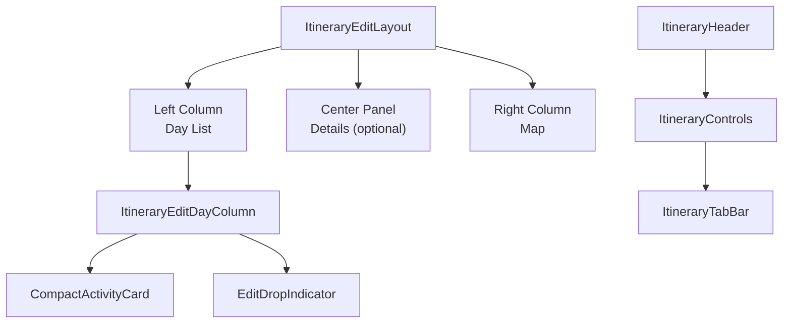
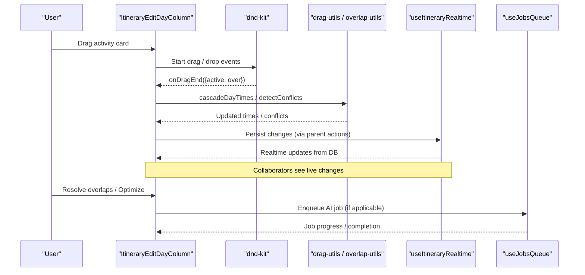
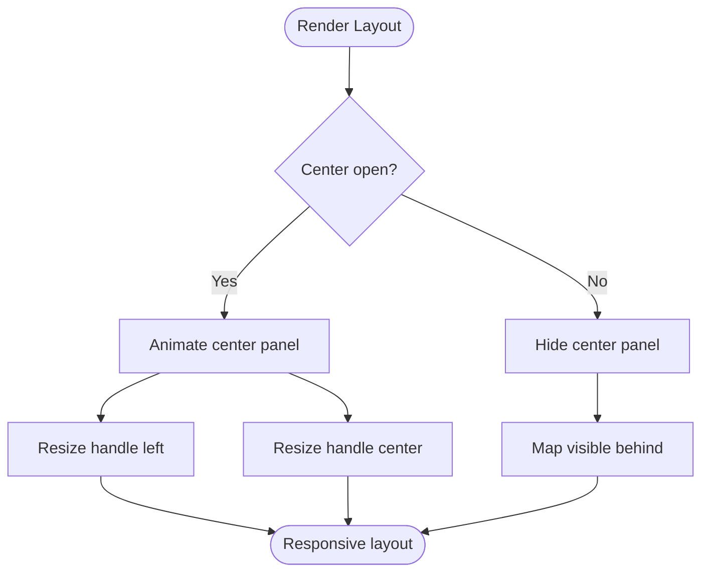
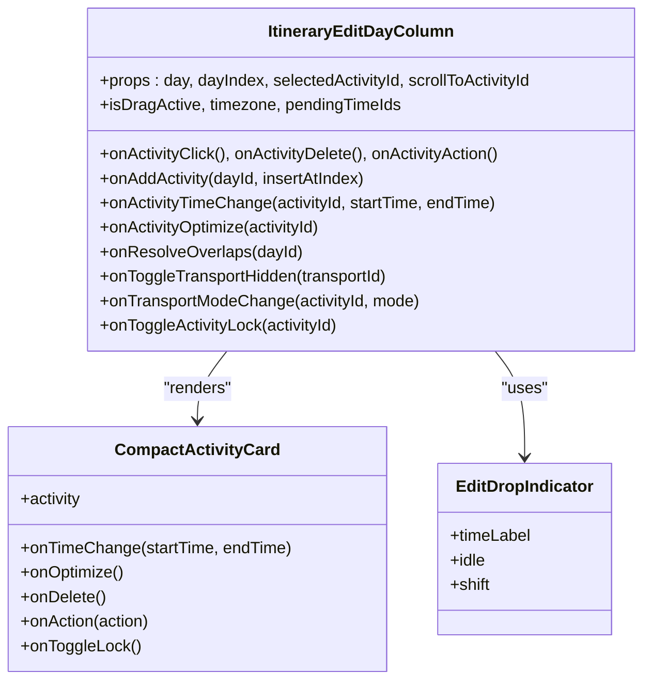
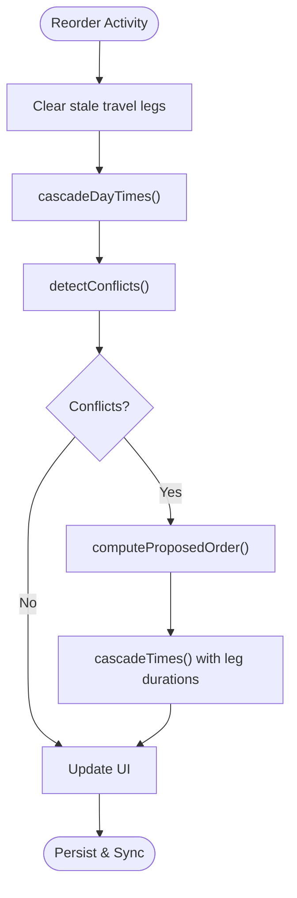
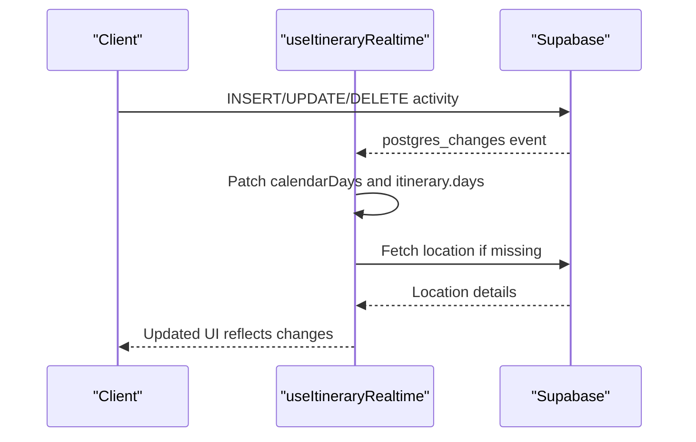
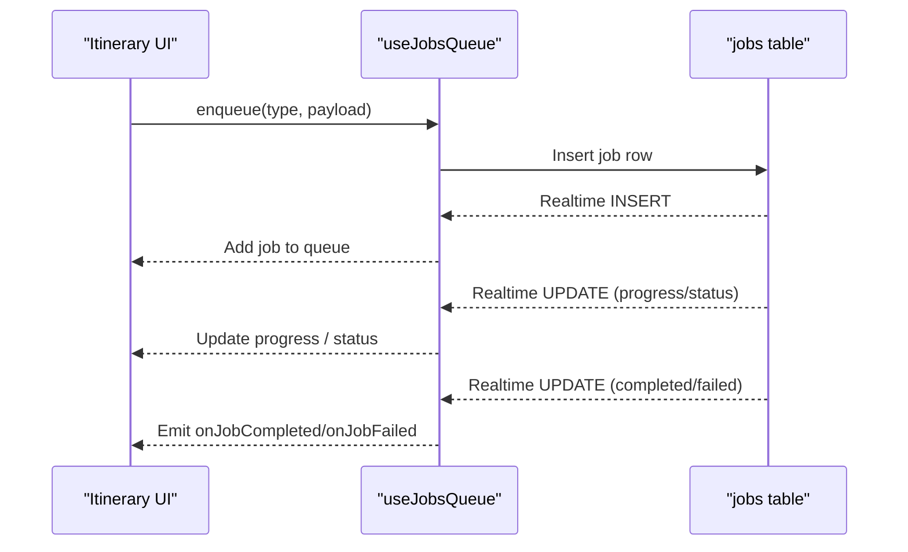
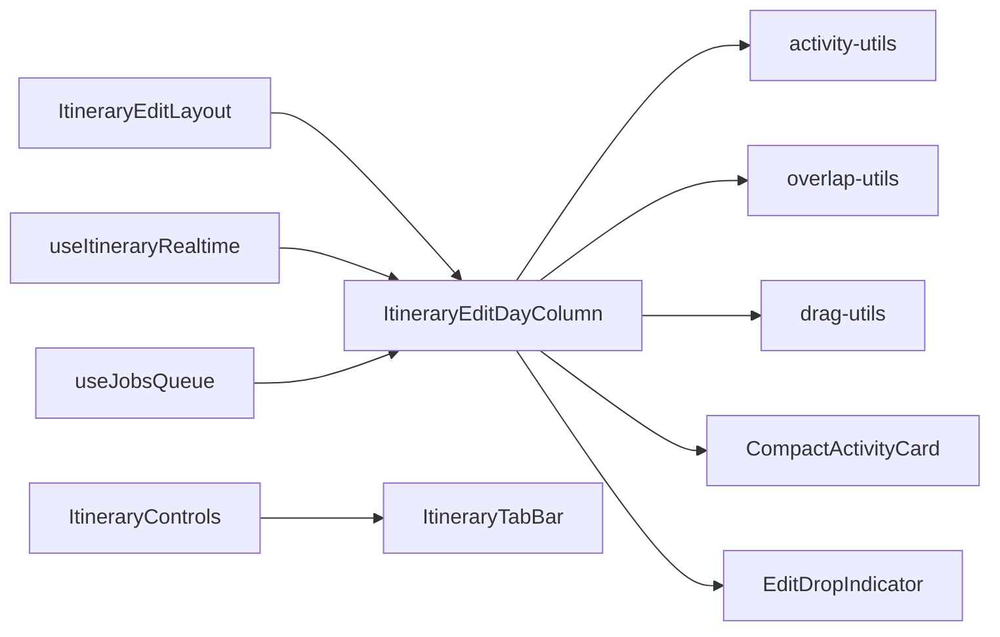

# Itinerary Components

<cite>
**Referenced Files in This Document**
- [ItineraryEditLayout.tsx](file://src/components/ui/itinerary/ItineraryEditLayout.tsx)
- [ItineraryEditDayColumn.tsx](file://src/components/ui/itinerary/ItineraryEditDayColumn.tsx)
- [ItineraryControls.tsx](file://src/components/ui/itinerary/ItineraryControls.tsx)
- [ItineraryHeader.tsx](file://src/components/ui/itinerary/ItineraryHeader.tsx)
- [ItineraryTabBar.tsx](file://src/components/ui/itinerary/ItineraryTabBar.tsx)
- [drag-utils.ts](file://src/components/ui/itinerary/drag-utils.ts)
- [activity-utils.ts](file://src/components/ui/itinerary/activity-utils.ts)
- [overlap-utils.ts](file://src/components/ui/itinerary/overlap-utils.ts)
- [EditDropIndicator.tsx](file://src/components/ui/itinerary/EditDropIndicator.tsx)
- [CompactActivityCard.tsx](file://src/components/ui/itinerary/CompactActivityCard.tsx)
- [constants.ts](file://src/components/ui/itinerary/ItineraryDayColumn/constants.ts)
- [useJobsQueue.ts](file://src/hooks/useJobsQueue.ts)
- [useItineraryRealtime.ts](file://src/hooks/useItineraryRealtime.ts)
</cite>

## Table of Contents
1. [Introduction](#introduction)
2. [Project Structure](#project-structure)
3. [Core Components](#core-components)
4. [Architecture Overview](#architecture-overview)
5. [Detailed Component Analysis](#detailed-component-analysis)
6. [Dependency Analysis](#dependency-analysis)
7. [Performance Considerations](#performance-considerations)
8. [Troubleshooting Guide](#troubleshooting-guide)
9. [Conclusion](#conclusion)

## Introduction
This document explains the itinerary editing components that power trip planning in Argo. It focuses on:
- ItineraryEditLayout as the main container for the edit workspace
- ItineraryEditDayColumn for day-based activity management and drag-and-drop
- Supporting UI: ItineraryControls, ItineraryHeader, ItineraryTabBar
- Complex drag-and-drop interactions, state synchronization across days and activities
- Real-time collaboration via Supabase channels
- Integration with the job queue system for AI-powered itinerary generation
- Performance optimizations and memory strategies for large itineraries

## Project Structure
The itinerary editing UI is organized under src/components/ui/itinerary with supporting hooks under src/hooks. The layout composes a left rail (day list), optional center panel (details), and right map area. Day columns render draggable activity cards with drop zones, overlap detection, and transport leg visualization.

**Diagram sources**
- [ItineraryEditLayout.tsx:25-127](file://src/components/ui/itinerary/ItineraryEditLayout.tsx#L25-L127)
- [ItineraryEditDayColumn.tsx:450-742](file://src/components/ui/itinerary/ItineraryEditDayColumn.tsx#L450-L742)
- [ItineraryControls.tsx:57-166](file://src/components/ui/itinerary/ItineraryControls.tsx#L57-L166)
- [ItineraryHeader.tsx:24-74](file://src/components/ui/itinerary/ItineraryHeader.tsx#L24-L74)
- [ItineraryTabBar.tsx:37-91](file://src/components/ui/itinerary/ItineraryTabBar.tsx#L37-L91)

**Section sources**
- [ItineraryEditLayout.tsx:25-127](file://src/components/ui/itinerary/ItineraryEditLayout.tsx#L25-L127)
- [ItineraryEditDayColumn.tsx:450-742](file://src/components/ui/itinerary/ItineraryEditDayColumn.tsx#L450-L742)
- [ItineraryControls.tsx:57-166](file://src/components/ui/itinerary/ItineraryControls.tsx#L57-L166)
- [ItineraryHeader.tsx:24-74](file://src/components/ui/itinerary/ItineraryHeader.tsx#L24-L74)
- [ItineraryTabBar.tsx:37-91](file://src/components/ui/itinerary/ItineraryTabBar.tsx#L37-L91)

## Core Components
- ItineraryEditLayout: Three-column responsive layout with resizable panels, animated center panel, and accessibility labels.
- ItineraryEditDayColumn: Draggable activity list per day with drop gaps, empty-day targets, lodging bookends, conflict indicators, and time recalculation triggers.
- ItineraryControls: Header controls row showing data pills or tabs, collaborator avatars, invite button, and view/edit mode toggle.
- ItineraryHeader: Banner image and itinerary title/location/date with an optional menu slot.
- ItineraryTabBar: Edit-mode tab strip for Itinerary, Flight, Lodging, Bookings, Expenses, Notes with clickability rules.

**Section sources**
- [ItineraryEditLayout.tsx:25-127](file://src/components/ui/itinerary/ItineraryEditLayout.tsx#L25-L127)
- [ItineraryEditDayColumn.tsx:450-742](file://src/components/ui/itinerary/ItineraryEditDayColumn.tsx#L450-L742)
- [ItineraryControls.tsx:57-166](file://src/components/ui/itinerary/ItineraryControls.tsx#L57-L166)
- [ItineraryHeader.tsx:24-74](file://src/components/ui/itinerary/ItineraryHeader.tsx#L24-L74)
- [ItineraryTabBar.tsx:37-91](file://src/components/ui/itinerary/ItineraryTabBar.tsx#L37-L91)

## Architecture Overview
The editing experience is driven by controlled state at the page level and synchronized via real-time subscriptions. Drag-and-drop uses dnd-kit to reorder activities within and across days. Overlap detection and time cascading ensure consistent schedules. AI-generated suggestions are queued and surfaced through a job queue hook.

**Diagram sources**
- [ItineraryEditDayColumn.tsx:450-742](file://src/components/ui/itinerary/ItineraryEditDayColumn.tsx#L450-L742)
- [drag-utils.ts:37-88](file://src/components/ui/itinerary/drag-utils.ts#L37-L88)
- [overlap-utils.ts:75-153](file://src/components/ui/itinerary/overlap-utils.ts#L75-L153)
- [useItineraryRealtime.ts:40-333](file://src/hooks/useItineraryRealtime.ts#L40-L333)
- [useJobsQueue.ts:45-296](file://src/hooks/useJobsQueue.ts#L45-L296)

## Detailed Component Analysis

### ItineraryEditLayout
- Purpose: Container for left day list, optional center details panel, and right map. Supports resizing, animations, and mobile overlay behavior.
- Key behaviors:
  - Resizable left/center panels with pointer capture and min-width constraints.
  - AnimatePresence-driven center panel transitions with reduced-motion support.
  - Mobile “Details” FAB when center panel is closed.
- Composition: Renders leftContent, centerContent, rightContent; exposes onPanelOpen and panelOpenLabel for accessibility.

**Diagram sources**
- [ItineraryEditLayout.tsx:25-127](file://src/components/ui/itinerary/ItineraryEditLayout.tsx#L25-L127)
- [ItineraryEditLayout.tsx:129-203](file://src/components/ui/itinerary/ItineraryEditLayout.tsx#L129-L203)

**Section sources**
- [ItineraryEditLayout.tsx:25-127](file://src/components/ui/itinerary/ItineraryEditLayout.tsx#L25-L127)
- [ItineraryEditLayout.tsx:129-203](file://src/components/ui/itinerary/ItineraryEditLayout.tsx#L129-L203)

### ItineraryEditDayColumn
- Purpose: Manages a single day’s activities with drag-and-drop, drop gaps, empty-day targets, lodging bookends, and conflict resolution.
- Data ordering: Uses position field for authoritative order; sorts non-transport activities by position while preserving original index ties.
- Time markers: Builds DayTimePicker markers from activities for inline time picker conflict visualization.
- Overlaps: Computes overlap insets based on activity ranges and detects conflicts using overlap utilities.
- Lodging bookends: Inserts synthetic start/end lodging rows around the day when accommodation exists, including transport legs from previous day’s last activity.
- Event handling:
  - Gap clicks trigger ghost add slots and call onAddActivity with insertion index.
  - Activity click, delete, quick notes, time change, optimize, lock toggles, transport mode changes, and resolve overlaps are exposed via props.
- Drag-and-drop:
  - Each activity wrapped in a sortable context with disabled states when locked or when inline time picker is open.
  - Drop gaps register droppable slots with visual indicators and striped backgrounds.
  - Empty day target provides a drop zone or “Add activity” button.

**Diagram sources**
- [ItineraryEditDayColumn.tsx:450-742](file://src/components/ui/itinerary/ItineraryEditDayColumn.tsx#L450-L742)
- [CompactActivityCard.tsx:43-74](file://src/components/ui/itinerary/CompactActivityCard.tsx#L43-L74)
- [EditDropIndicator.tsx:6-46](file://src/components/ui/itinerary/EditDropIndicator.tsx#L6-L46)

**Section sources**
- [ItineraryEditDayColumn.tsx:450-742](file://src/components/ui/itinerary/ItineraryEditDayColumn.tsx#L450-L742)
- [ItineraryEditDayColumn.tsx:112-135](file://src/components/ui/itinerary/ItineraryEditDayColumn.tsx#L112-L135)
- [ItineraryEditDayColumn.tsx:137-227](file://src/components/ui/itinerary/ItineraryEditDayColumn.tsx#L137-L227)
- [ItineraryEditDayColumn.tsx:229-290](file://src/components/ui/itinerary/ItineraryEditDayColumn.tsx#L229-L290)
- [ItineraryEditDayColumn.tsx:292-402](file://src/components/ui/itinerary/ItineraryEditDayColumn.tsx#L292-L402)
- [ItineraryEditDayColumn.tsx:517-658](file://src/components/ui/itinerary/ItineraryEditDayColumn.tsx#L517-L658)

### ItineraryControls
- Purpose: Header control row displaying data pills in view mode and a tab strip in edit mode; shows collaborators, invite action, and view/edit toggle.
- Behavior:
  - In edit mode, renders ItineraryTabBar replacing data pills.
  - AvatarGroup resolves member avatars from profiles; supports owner and collaborators.
  - ToggleGroup drives view/edit mode controlled by parent.

**Section sources**
- [ItineraryControls.tsx:57-166](file://src/components/ui/itinerary/ItineraryControls.tsx#L57-L166)

### ItineraryHeader
- Purpose: Presentational header with banner image, title, location, date label, and optional menu slot.
- Behavior: Purely presentational; variant-ready for future profile-page usage.

**Section sources**
- [ItineraryHeader.tsx:24-74](file://src/components/ui/itinerary/ItineraryHeader.tsx#L24-L74)

### ItineraryTabBar
- Purpose: Underline tab strip for edit-mode navigation across Itinerary, Flight, Lodging, Bookings, Expenses, Notes.
- Behavior:
  - Clickability depends on mode and tab set; some tabs are disabled (“Coming soon”).
  - Active state computed from activeTab or openTab depending on mode.

**Section sources**
- [ItineraryTabBar.tsx:37-91](file://src/components/ui/itinerary/ItineraryTabBar.tsx#L37-L91)

### Drag-and-Drop and State Synchronization
- Dragging:
  - Activities are sortable with dnd-kit; transforms applied via CSS.Transform.toString for smooth reordering.
  - Drop gaps provide visual feedback with stripe backgrounds and drop indicators.
  - Empty day target allows dropping into otherwise empty days.
- Time recalculation:
  - cascadeDayTimes aligns activities to 10-minute steps and computes earliest start based on previous end plus travel duration.
  - clearLegs clears stale travel legs after reorder until server cascade returns recomputed values.
- Conflict detection:
  - detectConflicts identifies overlapping activities and transport overflow between consecutive activities.
  - computeProposedOrder determines a proposed visit order respecting locked anchors and first conflict index.
  - cascadeTimes applies backend leg durations to retime unlocked activities from the first conflict forward.

**Diagram sources**
- [drag-utils.ts:25-88](file://src/components/ui/itinerary/drag-utils.ts#L25-L88)
- [overlap-utils.ts:75-218](file://src/components/ui/itinerary/overlap-utils.ts#L75-L218)
- [overlap-utils.ts:229-297](file://src/components/ui/itinerary/overlap-utils.ts#L229-L297)

**Section sources**
- [drag-utils.ts:25-88](file://src/components/ui/itinerary/drag-utils.ts#L25-L88)
- [overlap-utils.ts:75-218](file://src/components/ui/itinerary/overlap-utils.ts#L75-L218)
- [overlap-utils.ts:229-297](file://src/components/ui/itinerary/overlap-utils.ts#L229-L297)

### Real-Time Collaboration
- Realtime subscriptions synchronize:
  - Activities INSERT/UPDATE/DELETE across calendar and itinerary views.
  - Days INSERT/DELETE to reflect date range changes.
  - Itinerary metadata updates (name, country, spot count).
  - Collaborator joins/leaves via user_itinerary table.
  - Flights and lodgings updates when sidebars are open.
- Hydration: On activity INSERT, fetches location details asynchronously to patch missing fields.

**Diagram sources**
- [useItineraryRealtime.ts:40-333](file://src/hooks/useItineraryRealtime.ts#L40-L333)
- [useItineraryRealtime.ts:335-440](file://src/hooks/useItineraryRealtime.ts#L335-L440)
- [useItineraryRealtime.ts:442-531](file://src/hooks/useItineraryRealtime.ts#L442-L531)

**Section sources**
- [useItineraryRealtime.ts:40-333](file://src/hooks/useItineraryRealtime.ts#L40-L333)
- [useItineraryRealtime.ts:335-440](file://src/hooks/useItineraryRealtime.ts#L335-L440)
- [useItineraryRealtime.ts:442-531](file://src/hooks/useItineraryRealtime.ts#L442-L531)

### AI-Powered Itinerary Generation via Job Queue
- useJobsQueue manages a queue of jobs with status transitions, realtime updates, reconciliation on reconnect, and visibility handling.
- Integrates with itinerary editing by:
  - Enqueuing AI planning jobs (type-filtered).
  - Displaying progress, ETA, and stage information.
  - Handling completed, failed, and rejected jobs with callbacks.
  - Optimistically merging job updates for immediate UI feedback.

**Diagram sources**
- [useJobsQueue.ts:45-296](file://src/hooks/useJobsQueue.ts#L45-L296)

**Section sources**
- [useJobsQueue.ts:45-296](file://src/hooks/useJobsQueue.ts#L45-L296)

## Dependency Analysis
- ItineraryEditLayout depends on motion primitives and Button; provides structural composition.
- ItineraryEditDayColumn depends on dnd-kit, overlap-utils, activity-utils, CompactActivityCard, EditDropIndicator, constants.
- ItineraryControls composes ItineraryTabBar and primitive UI components.
- Realtime integration via useItineraryRealtime synchronizes multiple tables and hydrates locations.
- Job queue via useJobsQueue integrates with Supabase realtime for asynchronous AI tasks.

**Diagram sources**
- [ItineraryEditLayout.tsx:25-127](file://src/components/ui/itinerary/ItineraryEditLayout.tsx#L25-L127)
- [ItineraryEditDayColumn.tsx:450-742](file://src/components/ui/itinerary/ItineraryEditDayColumn.tsx#L450-L742)
- [activity-utils.ts:5-74](file://src/components/ui/itinerary/activity-utils.ts#L5-L74)
- [overlap-utils.ts:75-218](file://src/components/ui/itinerary/overlap-utils.ts#L75-L218)
- [drag-utils.ts:37-88](file://src/components/ui/itinerary/drag-utils.ts#L37-L88)
- [ItineraryControls.tsx:57-166](file://src/components/ui/itinerary/ItineraryControls.tsx#L57-L166)
- [ItineraryTabBar.tsx:37-91](file://src/components/ui/itinerary/ItineraryTabBar.tsx#L37-L91)
- [useItineraryRealtime.ts:40-333](file://src/hooks/useItineraryRealtime.ts#L40-L333)
- [useJobsQueue.ts:45-296](file://src/hooks/useJobsQueue.ts#L45-L296)

**Section sources**
- [ItineraryEditLayout.tsx:25-127](file://src/components/ui/itinerary/ItineraryEditLayout.tsx#L25-L127)
- [ItineraryEditDayColumn.tsx:450-742](file://src/components/ui/itinerary/ItineraryEditDayColumn.tsx#L450-L742)
- [ItineraryControls.tsx:57-166](file://src/components/ui/itinerary/ItineraryControls.tsx#L57-L166)
- [ItineraryTabBar.tsx:37-91](file://src/components/ui/itinerary/ItineraryTabBar.tsx#L37-L91)
- [useItineraryRealtime.ts:40-333](file://src/hooks/useItineraryRealtime.ts#L40-L333)
- [useJobsQueue.ts:45-296](file://src/hooks/useJobsQueue.ts#L45-L296)

## Performance Considerations
- Reduced motion: Components respect prefers-reduced-motion to minimize animations during heavy interactions.
- Efficient sorting: Activities sorted by position to avoid unstable re-sorts on refetches and realtime echoes.
- Leg clearing: Stale travel legs cleared optimistically to prevent map artifacts until server cascade returns updated values.
- Grid snapping: Times snapped to 10-minute grid to keep schedules clean and reduce jitter.
- Realtime deduplication: Channels scoped per instance and itinerary to avoid duplicate subscriptions and errors.
- Reconciliation: Job queue reconciles missed updates on visibility change or reconnect to prevent stuck states.
- Memory management: Realtime channels removed on unmount; job statuses tracked in refs to avoid repeated transitions.

[No sources needed since this section provides general guidance]

## Troubleshooting Guide
- Drag-and-drop issues:
  - Ensure sortable contexts are not disabled unintentionally (e.g., time picker open or activity locked).
  - Verify drop gaps are registered before drag starts to avoid timing-dependent measurements.
- Time conflicts:
  - Use resolve overlaps to retime activities; check locked activities preventing movement.
  - Confirm transport legs are cleared and recalculated after reorders.
- Realtime sync:
  - If activities appear without location details, hydration will fetch asynchronously; failures are logged but do not block UI.
  - For cross-day moves, ensure position field is preserved to maintain order.
- Job queue:
  - Failed jobs pin to front; check connectionError and reconcile on visibility change.
  - Use upsertJob for optimistic updates to avoid lag in UI.

**Section sources**
- [ItineraryEditDayColumn.tsx:292-402](file://src/components/ui/itinerary/ItineraryEditDayColumn.tsx#L292-L402)
- [drag-utils.ts:25-88](file://src/components/ui/itinerary/drag-utils.ts#L25-L88)
- [overlap-utils.ts:75-218](file://src/components/ui/itinerary/overlap-utils.ts#L75-L218)
- [useItineraryRealtime.ts:40-333](file://src/hooks/useItineraryRealtime.ts#L40-L333)
- [useJobsQueue.ts:45-296](file://src/hooks/useJobsQueue.ts#L45-L296)

## Conclusion
The itinerary editing components provide a robust, collaborative, and performant interface for trip planning. ItineraryEditLayout structures the workspace, ItineraryEditDayColumn handles complex drag-and-drop and scheduling logic, and supporting components deliver intuitive controls and navigation. Real-time collaboration ensures consistency across users, while the job queue enables AI-powered enhancements. Careful attention to performance and memory management ensures smooth experiences even with large itineraries.

[No sources needed since this section summarizes without analyzing specific files]