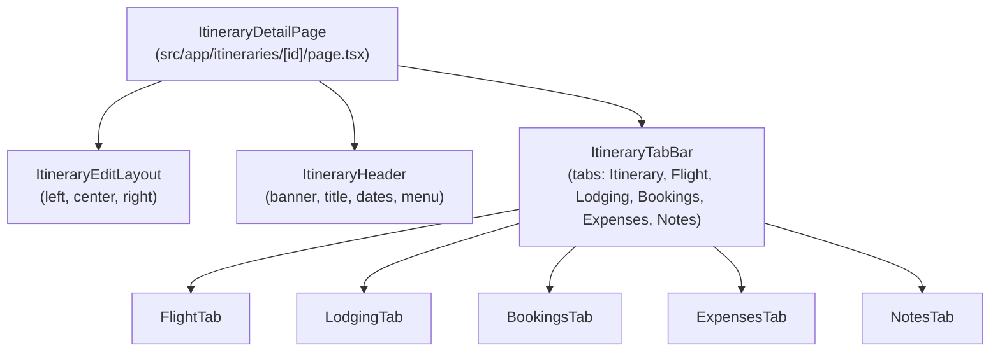
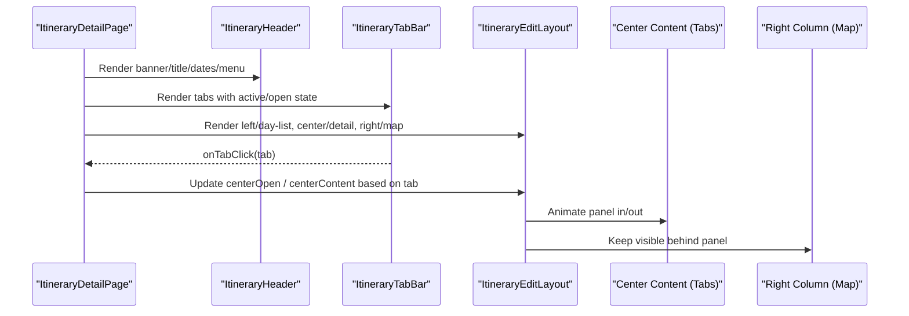
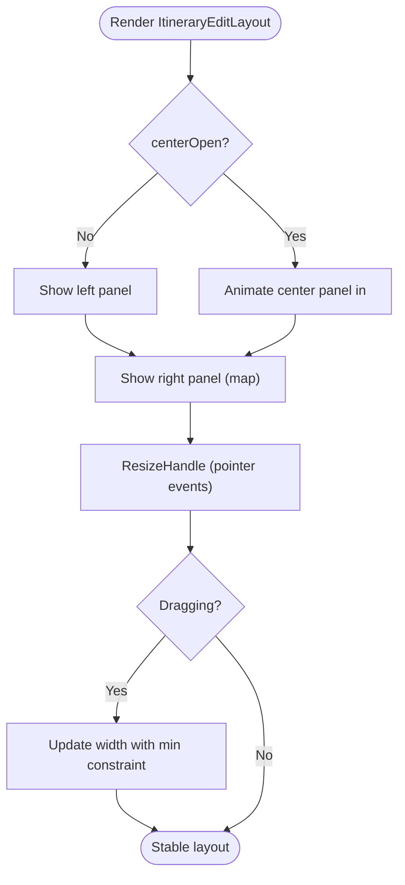
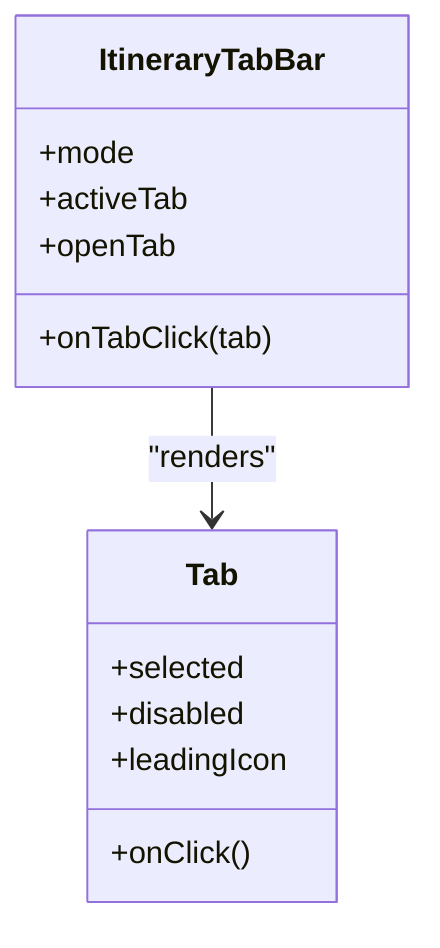
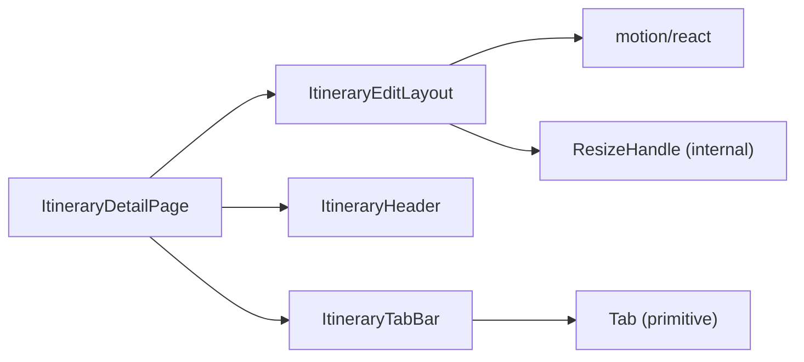

# Layout Components

<cite>
**Referenced Files in This Document**
- [ItineraryEditLayout.tsx](file://src/components/ui/itinerary/ItineraryEditLayout.tsx)
- [ItineraryHeader.tsx](file://src/components/ui/itinerary/ItineraryHeader.tsx)
- [ItineraryTabBar.tsx](file://src/components/ui/itinerary/ItineraryTabBar.tsx)
- [BookingsTab.tsx](file://src/components/ui/itinerary/tabs/BookingsTab.tsx)
- [ExpensesTab.tsx](file://src/components/ui/itinerary/tabs/ExpensesTab.tsx)
- [FlightTab.tsx](file://src/components/ui/itinerary/tabs/FlightTab.tsx)
- [LodgingTab.tsx](file://src/components/ui/itinerary/tabs/LodgingTab.tsx)
- [NotesTab.tsx](file://src/components/ui/itinerary/tabs/NotesTab.tsx)
- [Tab.tsx](file://src/components/ui/primitives/Tab.tsx)
- [page.tsx](file://src/app/itineraries/[id]/page.tsx)
</cite>

## Table of Contents
1. Introduction
2. Project Structure
3. Core Components
4. Architecture Overview
5. Detailed Component Analysis
6. Dependency Analysis
7. Performance Considerations
8. Troubleshooting Guide
9. Conclusion

## Introduction
This document explains the itinerary layout components that form the structural foundation for trip planning interfaces. It focuses on:
- ItineraryEditLayout as the main three-panel container with responsive behavior, resize handles, and mobile adaptations
- ItineraryHeader for displaying trip information and controls
- ItineraryTabBar for organizing different aspects of itinerary management (Bookings, Expenses, Flights, Lodging, Notes)
It also covers composition patterns, responsive design strategies, accessibility considerations, layout state management, panel visibility controls, and integration with navigation contexts.

## Project Structure
The itinerary layout is composed of presentational components under src/components/ui/itinerary and tab content under src/components/ui/itinerary/tabs. The page orchestrating these components lives in src/app/itineraries/[id]/page.tsx.

**Diagram sources**
- [page.tsx:250-486](file://src/app/itineraries/[id]/page.tsx#L250-L486)
- [ItineraryEditLayout.tsx:14-127](file://src/components/ui/itinerary/ItineraryEditLayout.tsx#L14-L127)
- [ItineraryHeader.tsx:7-73](file://src/components/ui/itinerary/ItineraryHeader.tsx#L7-L73)
- [ItineraryTabBar.tsx:8-90](file://src/components/ui/itinerary/ItineraryTabBar.tsx#L8-L90)

**Section sources**
- [page.tsx:250-486](file://src/app/itineraries/[id]/page.tsx#L250-L486)

## Core Components
- ItineraryEditLayout: Three-column layout (left day list, center detail panel, right map). Supports resizing via pointer events, animated panel transitions, and a mobile “Details” button to open the center panel. Respects reduced motion preferences.
- ItineraryHeader: Presentational header row with banner image, title, location, date label, and an optional menu slot.
- ItineraryTabBar: Underline-style tabs for Itinerary, Flight, Lodging, Bookings, Expenses, Notes. Tab clickability depends on mode and open state; some tabs are disabled until available.
- Tabs: Each tab renders its specific content area (e.g., FlightTab uses FlightSidebar and FilePillHeader; NotesTab uses NotesGrid).

Key responsibilities:
- Layout orchestration and responsiveness
- Panel visibility and animation
- Tab selection and interaction gating
- Accessible primitives and roles

**Section sources**
- [ItineraryEditLayout.tsx:14-127](file://src/components/ui/itinerary/ItineraryEditLayout.tsx#L14-L127)
- [ItineraryHeader.tsx:7-73](file://src/components/ui/itinerary/ItineraryHeader.tsx#L7-L73)
- [ItineraryTabBar.tsx:8-90](file://src/components/ui/itinerary/ItineraryTabBar.tsx#L8-L90)
- [FlightTab.tsx:8-33](file://src/components/ui/itinerary/tabs/FlightTab.tsx#L8-L33)
- [LodgingTab.tsx:8-33](file://src/components/ui/itinerary/tabs/LodgingTab.tsx#L8-L33)
- [BookingsTab.tsx:6-21](file://src/components/ui/itinerary/tabs/BookingsTab.tsx#L6-L21)
- [ExpensesTab.tsx:6-19](file://src/components/ui/itinerary/tabs/ExpensesTab.tsx#L6-L19)
- [NotesTab.tsx:7-33](file://src/components/ui/itinerary/tabs/NotesTab.tsx#L7-L33)

## Architecture Overview
The page composes the header, tab bar, and edit layout. The edit layout manages left/center/right panels with animations and resize handles. Tabs switch the center panel content. Mobile shows a floating action to open the details panel when closed.

**Diagram sources**
- [page.tsx:250-486](file://src/app/itineraries/[id]/page.tsx#L250-L486)
- [ItineraryEditLayout.tsx:42-125](file://src/components/ui/itinerary/ItineraryEditLayout.tsx#L42-L125)
- [ItineraryTabBar.tsx:44-90](file://src/components/ui/itinerary/ItineraryTabBar.tsx#L44-L90)

## Detailed Component Analysis

### ItineraryEditLayout
- Purpose: Main three-panel container for editing itineraries.
- Panels:
  - Left: Day list rail (collapsible on tablet, always visible on desktop).
  - Center: Detail panel (animated overlay on mobile; column on desktop).
  - Right: Map area (always visible, behind panel on mobile).
- Responsive behavior:
  - Desktop: Three columns with proportional widths.
  - Tablet/Mobile: Center panel overlays; floating “Details” button opens it when closed.
- Resize handle:
  - Pointer-based drag to adjust left or center panel width.
  - Enforces minimum widths and restores CSS transitions after drag.
  - Double-click resets width.
- Accessibility:
  - Respects reduced motion preference for transitions.
  - Uses aria-label on the mobile “Details” button.

**Diagram sources**
- [ItineraryEditLayout.tsx:42-125](file://src/components/ui/itinerary/ItineraryEditLayout.tsx#L42-L125)
- [ItineraryEditLayout.tsx:129-202](file://src/components/ui/itinerary/ItineraryEditLayout.tsx#L129-L202)

**Section sources**
- [ItineraryEditLayout.tsx:14-127](file://src/components/ui/itinerary/ItineraryEditLayout.tsx#L14-L127)
- [ItineraryEditLayout.tsx:129-202](file://src/components/ui/itinerary/ItineraryEditLayout.tsx#L129-L202)

### ItineraryHeader
- Purpose: Displays trip identity and context (banner, name, region/country, date label) and provides a menu slot for actions.
- Composition: Purely presentational; receives data via props and exposes a menu slot for higher-order controls.

**Section sources**
- [ItineraryHeader.tsx:7-73](file://src/components/ui/itinerary/ItineraryHeader.tsx#L7-L73)

### ItineraryTabBar
- Purpose: Organizes itinerary management areas via tabs with icons.
- Behavior:
  - Mode-driven clickability (view vs edit).
  - Some tabs disabled until available (“Coming soon”).
  - Active state computed from activeTab and openTab.
- Integration: Renders using the primitive Tab component for consistent styling and accessibility.

**Diagram sources**
- [ItineraryTabBar.tsx:8-90](file://src/components/ui/itinerary/ItineraryTabBar.tsx#L8-L90)
- [Tab.tsx:39-85](file://src/components/ui/primitives/Tab.tsx#L39-L85)

**Section sources**
- [ItineraryTabBar.tsx:8-90](file://src/components/ui/itinerary/ItineraryTabBar.tsx#L8-L90)
- [Tab.tsx:39-85](file://src/components/ui/primitives/Tab.tsx#L39-L85)

### Tab Content Components
- FlightTab: Renders file pills and a flight list sidebar with upload/edit/delete/open handlers.
- LodgingTab: Renders file pills and a lodging list sidebar with upload/edit/delete/open handlers.
- BookingsTab: Placeholder empty state indicating upcoming functionality.
- ExpensesTab: Wraps an expenses sidebar for listing and adding expenses.
- NotesTab: Renders a notes grid integrated with activity-authored notes and editing callbacks.

**Section sources**
- [FlightTab.tsx:8-33](file://src/components/ui/itinerary/tabs/FlightTab.tsx#L8-L33)
- [LodgingTab.tsx:8-33](file://src/components/ui/itinerary/tabs/LodgingTab.tsx#L8-L33)
- [BookingsTab.tsx:6-21](file://src/components/ui/itinerary/tabs/BookingsTab.tsx#L6-L21)
- [ExpensesTab.tsx:6-19](file://src/components/ui/itinerary/tabs/ExpensesTab.tsx#L6-L19)
- [NotesTab.tsx:7-33](file://src/components/ui/itinerary/tabs/NotesTab.tsx#L7-L33)

## Dependency Analysis
- ItineraryEditLayout depends on motion primitives for animations and a local ResizeHandle implementation for pointer-based resizing.
- ItineraryTabBar depends on the primitive Tab component for accessible, styled tabs.
- The page composes all layout components and wires state (activeTab, openTab, panel visibility) to control rendering.

**Diagram sources**
- [page.tsx:250-486](file://src/app/itineraries/[id]/page.tsx#L250-L486)
- [ItineraryEditLayout.tsx:1-127](file://src/components/ui/itinerary/ItineraryEditLayout.tsx#L1-L127)
- [ItineraryTabBar.tsx:8-90](file://src/components/ui/itinerary/ItineraryTabBar.tsx#L8-L90)
- [Tab.tsx:39-85](file://src/components/ui/primitives/Tab.tsx#L39-L85)

**Section sources**
- [page.tsx:250-486](file://src/app/itineraries/[id]/page.tsx#L250-L486)
- [ItineraryEditLayout.tsx:1-127](file://src/components/ui/itinerary/ItineraryEditLayout.tsx#L1-L127)
- [ItineraryTabBar.tsx:8-90](file://src/components/ui/itinerary/ItineraryTabBar.tsx#L8-L90)
- [Tab.tsx:39-85](file://src/components/ui/primitives/Tab.tsx#L39-L85)

## Performance Considerations
- Reduced motion: Animations adapt to user preferences to avoid unnecessary motion.
- Efficient updates: Center panel uses conditional rendering with keying to optimize re-renders during tab switches.
- Pointer handling: Resize handle disables default transitions during drag to prevent visual lag and restores them afterward.
- Mobile overlay: Center panel overlays on smaller screens to reduce layout thrashing and maintain performance.

[No sources needed since this section provides general guidance]

## Troubleshooting Guide
- Panel not opening on mobile: Ensure the “Details” button callback is wired and centerOpen state is toggled by the parent.
- Resize handle not working: Verify pointer capture and event listeners are attached; ensure minWidth constraints are reasonable.
- Tabs not clickable: Check mode and disabled sets; Bookings and Expenses are intentionally disabled until available.
- Animation jank: Confirm reduced motion settings and that transitions are removed during drag operations.

**Section sources**
- [ItineraryEditLayout.tsx:129-202](file://src/components/ui/itinerary/ItineraryEditLayout.tsx#L129-L202)
- [ItineraryTabBar.tsx:44-90](file://src/components/ui/itinerary/ItineraryTabBar.tsx#L44-L90)

## Conclusion
The itinerary layout components provide a robust, responsive, and accessible foundation for trip planning. ItineraryEditLayout manages complex multi-panel interactions with smooth animations and precise resizing. ItineraryHeader presents essential trip context, while ItineraryTabBar organizes management features across tabs. Together, they enable a scalable architecture where the page coordinates state and the components remain focused on presentation and interaction.