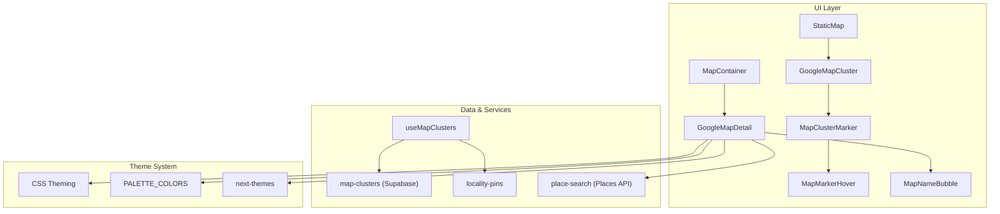
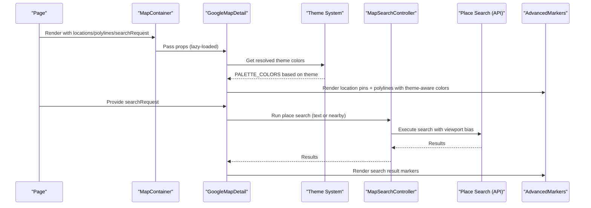
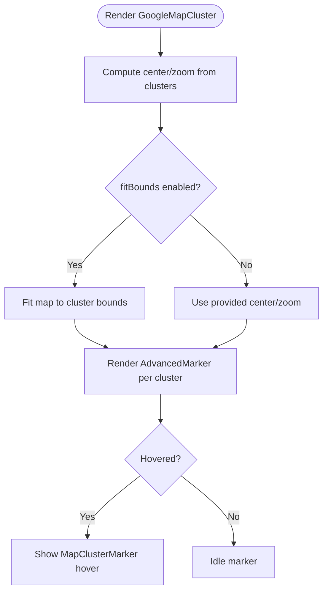
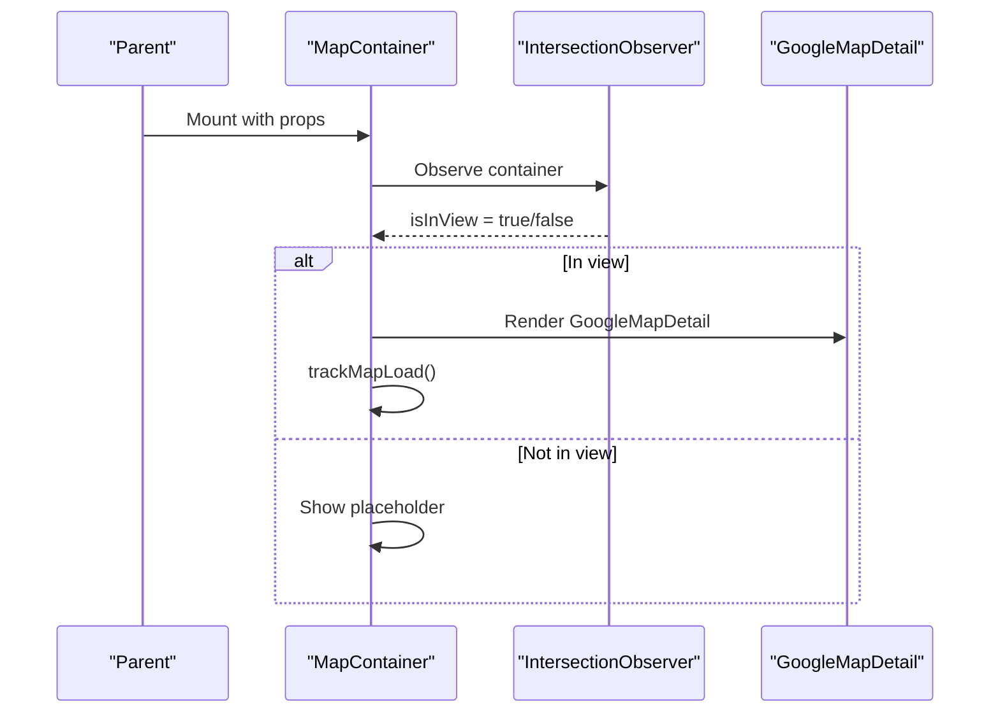
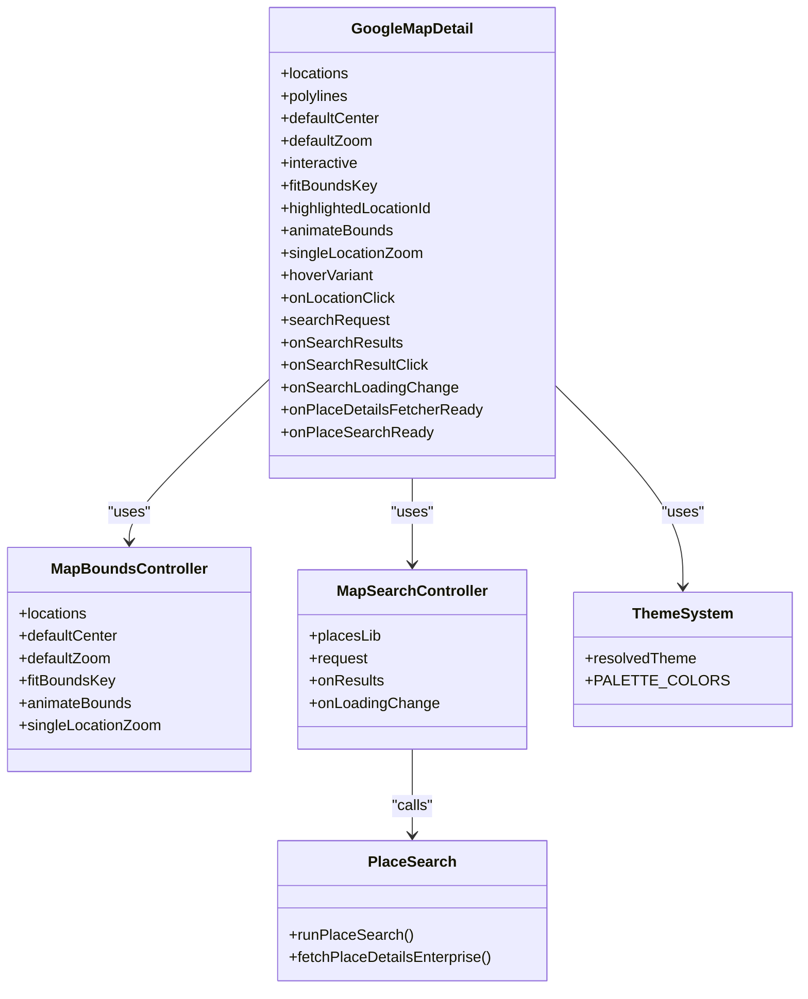
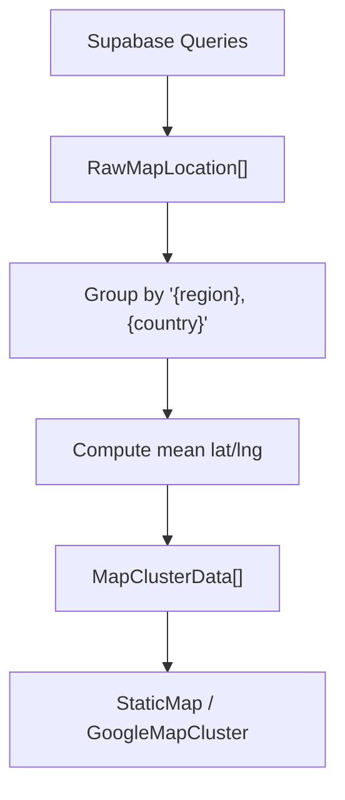
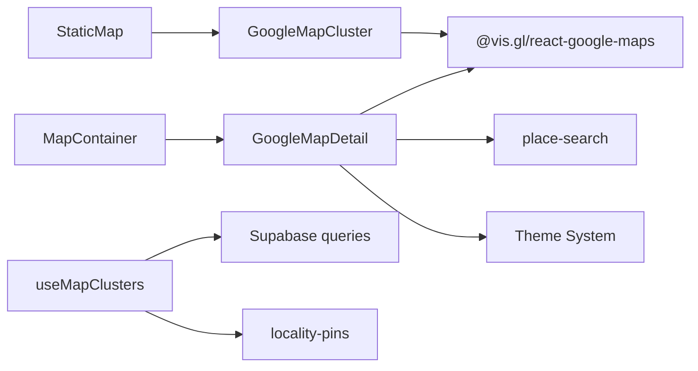

# Map Integration Components

<cite>
**Referenced Files in This Document**
- [GoogleMapCluster.tsx](file://src/components/ui/map/GoogleMapCluster.tsx)
- [MapContainer.tsx](file://src/components/ui/map/MapContainer.tsx)
- [MapMarkerHover.tsx](file://src/components/ui/map/MapMarkerHover.tsx)
- [StaticMap.tsx](file://src/components/ui/map/StaticMap.tsx)
- [GoogleMapDetail.tsx](file://src/components/ui/map/GoogleMapDetail.tsx)
- [MapClusterMarker.tsx](file://src/components/ui/map/MapClusterMarker.tsx)
- [MapNameBubble.tsx](file://src/components/ui/map/MapNameBubble.tsx)
- [useMapClusters.ts](file://src/hooks/useMapClusters.ts)
- [map-clusters.ts](file://src/lib/supabase/queries/map-clusters.ts)
- [locality-pins.ts](file://src/lib/maps/locality-pins.ts)
- [place-search.ts](file://src/lib/maps/place-search.ts)
- [ActivityTimeslot.tsx](file://src/components/ui/calendar/ActivityTimeslot.tsx)
- [globals.css](file://src/app/globals.css)
</cite>

## Update Summary
**Changes Made**
- Updated map ID configuration to reflect single map ID usage instead of theme-specific IDs
- Revised dark mode implementation documentation to show CSS-based theming approach
- Updated troubleshooting section to reflect simplified map configuration
- Enhanced performance considerations for unified map styling

## Table of Contents
1. Introduction
2. Project Structure
3. Core Components
4. Architecture Overview
5. Detailed Component Analysis
6. Dependency Analysis
7. Performance Considerations
8. Troubleshooting Guide
9. Conclusion

## Introduction
This document explains Argo's Google Maps integration components that power interactive mapping, clustering, and location details. It covers:
- GoogleMapCluster for performance-optimized cluster markers with unified map styling
- MapContainer as the main wrapper with lazy loading and analytics
- MapMarkerHover for enhanced marker interactions
- StaticMap for lightweight previews
- GoogleMapDetail for detailed location views with search and polylines
It also documents clustering strategies, marker optimization techniques, React-Google-Maps library integration, custom markers, event handling, geocoding via Places API, and performance considerations for large datasets.

**Updated** The map system now uses a single map ID for both light and dark themes, with dark mode support handled through CSS theming rather than separate map configurations.

## Project Structure
The map feature is organized into reusable UI components under src/components/ui/map, a hook for data fetching under src/hooks, and shared utilities under src/lib/maps and src/lib/supabase/queries.

**Diagram sources**
- [StaticMap.tsx:34-93](file://src/components/ui/map/StaticMap.tsx#L34-L93)
- [GoogleMapCluster.tsx:174-180](file://src/components/ui/map/GoogleMapCluster.tsx#L174-L180)
- [MapContainer.tsx:40-90](file://src/components/ui/map/MapContainer.tsx#L40-L90)
- [GoogleMapDetail.tsx:341-461](file://src/components/ui/map/GoogleMapDetail.tsx#L341-L461)
- [MapClusterMarker.tsx:51-108](file://src/components/ui/map/MapClusterMarker.tsx#L51-L108)
- [MapMarkerHover.tsx:42-72](file://src/components/ui/map/MapMarkerHover.tsx#L42-L72)
- [MapNameBubble.tsx:15-23](file://src/components/ui/map/MapNameBubble.tsx#L15-L23)
- [useMapClusters.ts:35-60](file://src/hooks/useMapClusters.ts#L35-L60)
- [map-clusters.ts:19-95](file://src/lib/supabase/queries/map-clusters.ts#L19-L95)
- [locality-pins.ts:28-38](file://src/lib/maps/locality-pins.ts#L28-L38)
- [place-search.ts:391-466](file://src/lib/maps/place-search.ts#L391-L466)
- [ActivityTimeslot.tsx:29-39](file://src/components/ui/calendar/ActivityTimeslot.tsx#L29-L39)

**Section sources**
- [StaticMap.tsx:1-103](file://src/components/ui/map/StaticMap.tsx#L1-L103)
- [GoogleMapCluster.tsx:1-176](file://src/components/ui/map/GoogleMapCluster.tsx#L1-L176)
- [MapContainer.tsx:1-99](file://src/components/ui/map/MapContainer.tsx#L1-L99)
- [GoogleMapDetail.tsx:1-487](file://src/components/ui/map/GoogleMapDetail.tsx#L1-L487)
- [MapClusterMarker.tsx:1-115](file://src/components/ui/map/MapClusterMarker.tsx#L1-L115)
- [MapMarkerHover.tsx:1-78](file://src/components/ui/map/MapMarkerHover.tsx#L1-L78)
- [MapNameBubble.tsx:1-26](file://src/components/ui/map/MapNameBubble.tsx#L1-L26)
- [useMapClusters.ts:1-61](file://src/hooks/useMapClusters.ts#L1-L61)
- [map-clusters.ts:1-96](file://src/lib/supabase/queries/map-clusters.ts#L1-L96)
- [locality-pins.ts:1-38](file://src/lib/maps/locality-pins.ts#L1-L38)
- [place-search.ts:1-467](file://src/lib/maps/place-search.ts#L1-L467)

## Core Components
- GoogleMapCluster: Renders clustered markers using react-google-maps' AdvancedMarker with unified map ID, automatic fit bounds, optional zoom controls, and hover state management.
- MapContainer: Lazy-loads GoogleMapDetail when visible, tracks map load events, and forwards rich props for locations, polylines, search, and interactions.
- MapMarkerHover: Reusable pill-style hover label showing count and label with variants and sizes.
- StaticMap: Lightweight wrapper around GoogleMapCluster with intersection observer-based lazy rendering and hover state management for clusters.
- GoogleMapDetail: Full-featured map with location pins, route polylines, place search, result markers, and detail popups; integrates with Places API for text/nearby search and enterprise Place Details.

Key responsibilities:
- Data preparation: useMapClusters fetches raw locations and builds locality pins for static maps.
- Rendering: GoogleMapCluster and GoogleMapDetail render markers and overlays.
- Interaction: Hover states, click handlers, and search flows are wired through callbacks and internal state.
- Theme handling: Dark mode support achieved through CSS theming and dynamic color selection rather than separate map configurations.

**Section sources**
- [GoogleMapCluster.tsx:69-136](file://src/components/ui/map/GoogleMapCluster.tsx#L69-L136)
- [MapContainer.tsx:45-90](file://src/components/ui/map/MapContainer.tsx#L45-L90)
- [MapMarkerHover.tsx:28-72](file://src/components/ui/map/MapMarkerHover.tsx#L28-L72)
- [StaticMap.tsx:21-93](file://src/components/ui/map/StaticMap.tsx#L21-L93)
- [GoogleMapDetail.tsx:254-461](file://src/components/ui/map/GoogleMapDetail.tsx#L254-L461)
- [useMapClusters.ts:35-60](file://src/hooks/useMapClusters.ts#L35-L60)

## Architecture Overview
The system composes a layered architecture with unified map styling:
- Presentation layer: StaticMap and MapContainer provide entry points with lazy loading and analytics.
- Rendering layer: GoogleMapCluster and GoogleMapDetail render markers, polylines, and overlays using @vis.gl/react-google-maps with a single map ID.
- Data layer: useMapClusters queries Supabase and builds locality pins for static maps; GoogleMapDetail runs Places API searches and enriches results.
- Theme layer: CSS-based theming handles dark mode appearance without requiring separate map configurations.

**Diagram sources**
- [MapContainer.tsx:45-90](file://src/components/ui/map/MapContainer.tsx#L45-L90)
- [GoogleMapDetail.tsx:341-461](file://src/components/ui/map/GoogleMapDetail.tsx#L341-L461)
- [GoogleMapDetail.tsx:116-151](file://src/components/ui/map/GoogleMapDetail.tsx#L116-L151)
- [place-search.ts:391-466](file://src/lib/maps/place-search.ts#L391-L466)
- [ActivityTimeslot.tsx:29-39](file://src/components/ui/calendar/ActivityTimeslot.tsx#L29-L39)

## Detailed Component Analysis

### GoogleMapCluster
Responsibilities:
- Wraps the map with APIProvider and renders cluster markers via AdvancedMarker using a unified map ID.
- Computes initial view from clusters and fits bounds on mount.
- Supports interactive mode, hover states, and optional zoom controls.

Clustering strategy:
- Uses precomputed clusters from upstream (e.g., buildLocalityPins) rather than client-side spatial clustering. Each cluster is rendered as a single AdvancedMarker with a custom MapClusterMarker.

Marker optimization:
- One AdvancedMarker per cluster reduces DOM nodes and improves performance for large datasets.
- Hover state managed via parent state to avoid re-renders across all markers.

Event handling:
- onClick forwarded to onClusterClick.
- onMouseEnter/onMouseLeave update hoveredClusterId for hover effects.

**Updated** Map configuration now uses a single map ID (`NEXT_PUBLIC_GOOGLE_MAPS_MAP_ID_LIGHT`) for both light and dark themes, eliminating the need for separate map style configurations.

**Diagram sources**
- [GoogleMapCluster.tsx:13-67](file://src/components/ui/map/GoogleMapCluster.tsx#L13-L67)
- [GoogleMapCluster.tsx:80-136](file://src/components/ui/map/GoogleMapCluster.tsx#L80-L136)
- [MapClusterMarker.tsx:51-108](file://src/components/ui/map/MapClusterMarker.tsx#L51-L108)

**Section sources**
- [GoogleMapCluster.tsx:13-67](file://src/components/ui/map/GoogleMapCluster.tsx#L13-L67)
- [GoogleMapCluster.tsx:80-136](file://src/components/ui/map/GoogleMapCluster.tsx#L80-L136)
- [MapClusterMarker.tsx:51-108](file://src/components/ui/map/MapClusterMarker.tsx#L51-L108)

### MapContainer
Responsibilities:
- Lazy-loads GoogleMapDetail only when in view using an intersection observer.
- Tracks map load events for analytics.
- Forwards rich props including locations, polylines, search request, and callbacks.

Performance:
- Avoids heavy map initialization until needed.
- Provides eager mode for off-screen panels where immediate rendering is required.

**Diagram sources**
- [MapContainer.tsx:45-90](file://src/components/ui/map/MapContainer.tsx#L45-L90)

**Section sources**
- [MapContainer.tsx:45-90](file://src/components/ui/map/MapContainer.tsx#L45-L90)

### MapMarkerHover
Responsibilities:
- Displays a compact pill with count and label for cluster hover states.
- Supports variants and sizes to match different grouping contexts.

Usage:
- Used by MapClusterMarker in compact hover mode to show quick info above the marker.

**Section sources**
- [MapMarkerHover.tsx:28-72](file://src/components/ui/map/MapMarkerHover.tsx#L28-L72)
- [MapClusterMarker.tsx:86-105](file://src/components/ui/map/MapClusterMarker.tsx#L86-L105)

### StaticMap
Responsibilities:
- Lightweight wrapper around GoogleMapCluster with lazy rendering based on visibility.
- Manages hover state for clusters and exposes a simple interface for non-interactive previews.

Performance:
- Defers map initialization until the component enters the viewport.
- Uses dynamic import to reduce bundle size until needed.

**Section sources**
- [StaticMap.tsx:21-93](file://src/components/ui/map/StaticMap.tsx#L21-L93)
- [StaticMap.tsx:34-37](file://src/components/ui/map/StaticMap.tsx#L34-L37)

### GoogleMapDetail
Responsibilities:
- Renders locations as markers with day-colored stop pins or default pins using theme-aware colors.
- Draws route polylines with white casing and vibrant stroke colors that adapt to the current theme.
- Integrates place search (text or nearby) and displays result markers.
- Exposes Enterprise Place Details fetcher and viewport-biased search runner.

Custom markers:
- StopPin: Numbered teardrop pin colored by day palette with theme-aware colors.
- SearchMarker: Default pin image scaled on hover.

Event handling:
- Location markers support hover to show detail popup or name bubble.
- Click handlers forward to onLocationClick.
- Search result markers support hover and click to open details.

Geocoding integration:
- Uses runPlaceSearch to perform Text Search or Nearby Search based on query presence.
- Normalizes results and optionally enriches via fetchPlaceDetailsEnterprise.

Theme integration:
- Uses `useTheme()` from next-themes to determine current theme context.
- Applies theme-aware colors to polylines and markers using PALETTE_COLORS.
- Maintains consistent visual appearance across light and dark modes without separate map configurations.

**Updated** Dark mode support is now implemented through CSS theming and dynamic color selection rather than maintaining separate map styles for light and dark themes.

**Diagram sources**
- [GoogleMapDetail.tsx:254-461](file://src/components/ui/map/GoogleMapDetail.tsx#L254-L461)
- [GoogleMapDetail.tsx:65-103](file://src/components/ui/map/GoogleMapDetail.tsx#L65-L103)
- [GoogleMapDetail.tsx:116-151](file://src/components/ui/map/GoogleMapDetail.tsx#L116-L151)
- [place-search.ts:391-466](file://src/lib/maps/place-search.ts#L391-L466)
- [ActivityTimeslot.tsx:29-39](file://src/components/ui/calendar/ActivityTimeslot.tsx#L29-L39)

**Section sources**
- [GoogleMapDetail.tsx:254-461](file://src/components/ui/map/GoogleMapDetail.tsx#L254-L461)
- [GoogleMapDetail.tsx:193-248](file://src/components/ui/map/GoogleMapDetail.tsx#L193-L248)
- [place-search.ts:176-263](file://src/lib/maps/place-search.ts#L176-L263)
- [place-search.ts:391-466](file://src/lib/maps/place-search.ts#L391-L466)
- [ActivityTimeslot.tsx:29-39](file://src/components/ui/calendar/ActivityTimeslot.tsx#L29-L39)

### Clustering Algorithms and Data Flow
- Locality pins: Groups entities by "region, country" string labels and computes mean coordinates for each group. This is presentation-only and distinct from planner k-means clustering.
- Data pipeline: useMapClusters queries Supabase, then buildLocalityPins transforms raw rows into MapClusterData arrays consumed by StaticMap/GoogleMapCluster.

**Diagram sources**
- [useMapClusters.ts:35-60](file://src/hooks/useMapClusters.ts#L35-L60)
- [map-clusters.ts:19-95](file://src/lib/supabase/queries/map-clusters.ts#L19-L95)
- [locality-pins.ts:28-38](file://src/lib/maps/locality-pins.ts#L28-L38)

**Section sources**
- [useMapClusters.ts:35-60](file://src/hooks/useMapClusters.ts#L35-L60)
- [map-clusters.ts:19-95](file://src/lib/supabase/queries/map-clusters.ts#L19-L95)
- [locality-pins.ts:28-38](file://src/lib/maps/locality-pins.ts#L28-L38)

## Dependency Analysis
- StaticMap depends on GoogleMapCluster and uses dynamic imports to defer loading.
- GoogleMapCluster depends on @vis.gl/react-google-maps (APIProvider, Map, AdvancedMarker, MapControl) with unified map ID.
- GoogleMapDetail depends on @vis.gl/react-google-maps, integrates with place-search utilities, and uses theme system for colors.
- useMapClusters depends on Supabase queries and locality-pins transformation.

**Updated** Map dependencies now use a single map ID configuration instead of separate light/dark map IDs.

**Diagram sources**
- [StaticMap.tsx:34-37](file://src/components/ui/map/StaticMap.tsx#L34-L37)
- [GoogleMapCluster.tsx:3-5](file://src/components/ui/map/GoogleMapCluster.tsx#L3-L5)
- [GoogleMapDetail.tsx:3-5](file://src/components/ui/map/GoogleMapDetail.tsx#L3-L5)
- [place-search.ts:1-8](file://src/lib/maps/place-search.ts#L1-L8)
- [useMapClusters.ts:3-14](file://src/hooks/useMapClusters.ts#L3-L14)
- [ActivityTimeslot.tsx:29-39](file://src/components/ui/calendar/ActivityTimeslot.tsx#L29-L39)

**Section sources**
- [StaticMap.tsx:34-37](file://src/components/ui/map/StaticMap.tsx#L34-L37)
- [GoogleMapCluster.tsx:3-5](file://src/components/ui/map/GoogleMapCluster.tsx#L3-L5)
- [GoogleMapDetail.tsx:3-5](file://src/components/ui/map/GoogleMapDetail.tsx#L3-L5)
- [place-search.ts:1-8](file://src/lib/maps/place-search.ts#L1-L8)
- [useMapClusters.ts:3-14](file://src/hooks/useMapClusters.ts#L3-L14)

## Performance Considerations
- Lazy rendering: MapContainer and StaticMap defer map initialization until visible, reducing initial bundle and runtime cost.
- Marker efficiency: Use one AdvancedMarker per cluster to minimize DOM nodes; prefer precomputed clusters over client-side spatial clustering for large sets.
- Fit bounds optimization: Compute bounds once and apply with padding; avoid frequent recalculations by keying on stable identifiers.
- Unified map styling: Single map ID eliminates the overhead of managing multiple map configurations while maintaining visual consistency across themes.
- CSS-based theming: Dark mode support through CSS variables and dynamic color selection avoids expensive map recreation during theme changes.
- Search cost model: Places API billing is per request; combine fields to maximize value per call and avoid redundant Place Details calls unless necessary.
- Intersection observer: Prevent unnecessary work for off-screen maps.

**Updated** Performance improvements include reduced configuration complexity and eliminated map recreation costs when switching between light and dark themes.

## Troubleshooting Guide
Common issues and resolutions:
- Map not loading: Ensure NEXT_PUBLIC_GOOGLE_MAPS_API_KEY is set and valid; verify the single map ID configuration.
- No markers shown: Check that clusters/locations have valid latitude and longitude; confirm fitBounds logic and that data is not empty.
- Search returns no results: Verify places library loaded; ensure query or includedTypes are set appropriately; check viewport circle calculation for nearby search.
- Excessive re-renders: Stabilize callback identities; use refs for unstable callbacks inside effects; rely on nonce-driven search runs.
- Hover popups not appearing: Confirm hover state propagation and z-index stacking; ensure pointer-events are correctly configured.
- Theme display issues: Verify CSS theme classes are properly applied; check that theme-aware colors are being selected correctly.

**Updated** Simplified troubleshooting due to unified map configuration - no longer need to manage separate light/dark map IDs.

**Section sources**
- [GoogleMapCluster.tsx:9-11](file://src/components/ui/map/GoogleMapCluster.tsx#L9-L11)
- [GoogleMapDetail.tsx:23-25](file://src/components/ui/map/GoogleMapDetail.tsx#L23-L25)
- [GoogleMapDetail.tsx:116-151](file://src/components/ui/map/GoogleMapDetail.tsx#L116-L151)
- [place-search.ts:154-174](file://src/lib/maps/place-search.ts#L154-L174)

## Conclusion
Argo's map integration combines efficient clustering, lazy rendering, and robust interaction patterns built on @vis.gl/react-google-maps. The recent simplification to use a single map ID with CSS-based theming provides better maintainability while preserving full dark mode support. StaticMap and MapContainer optimize startup and runtime costs, while GoogleMapDetail delivers a full-featured experience with place search and rich markers. The separation of concerns—data preparation, rendering, and interaction—enables scalable performance for large datasets and flexible customization for different use cases.

**Updated** The unified map ID approach reduces configuration complexity while maintaining visual consistency across themes, making the system more maintainable and performant.