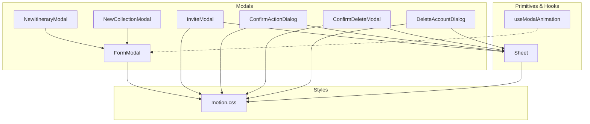
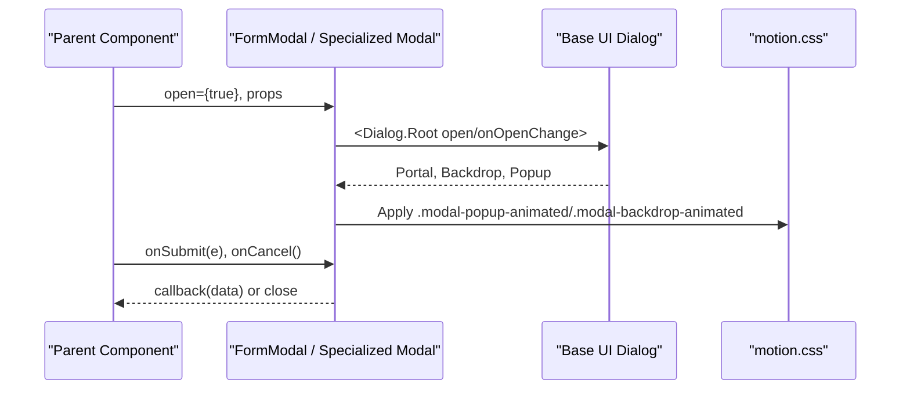
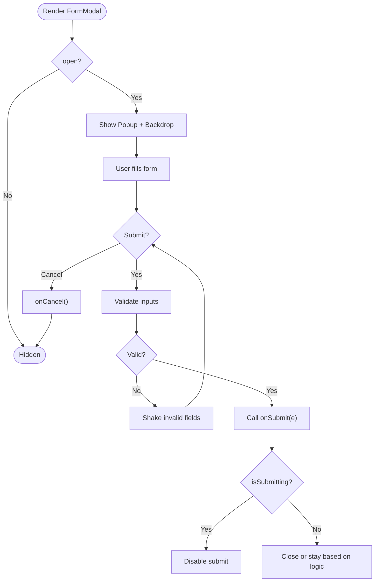
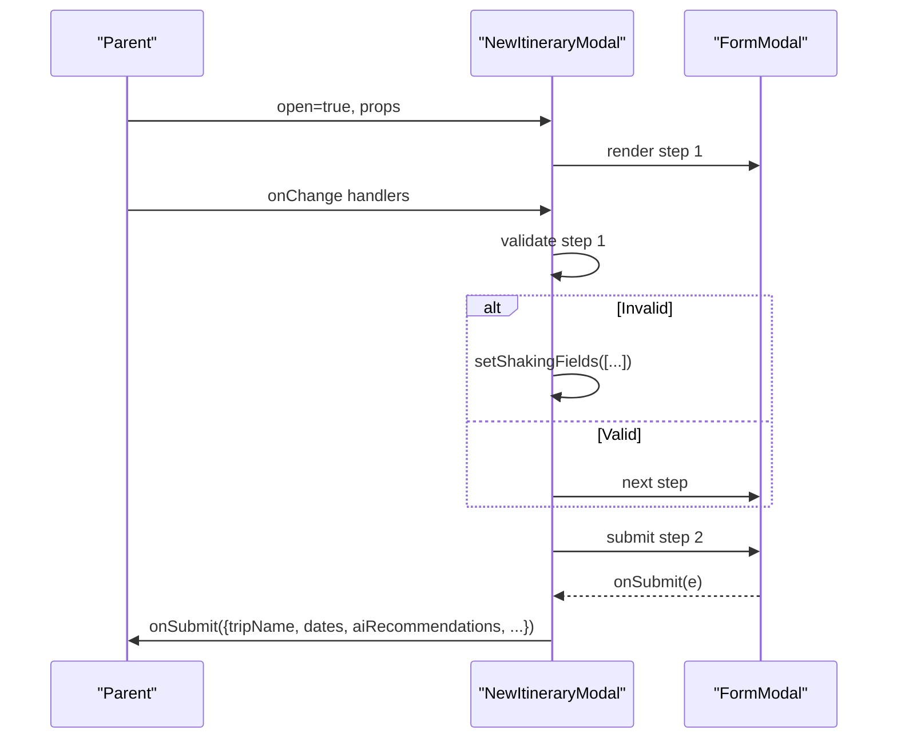
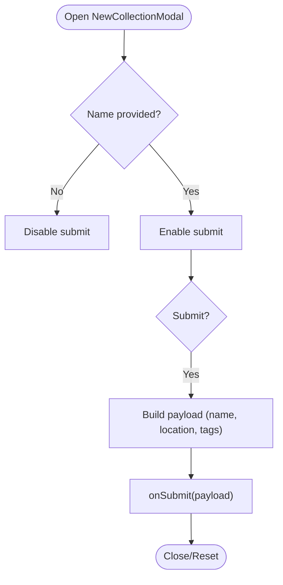
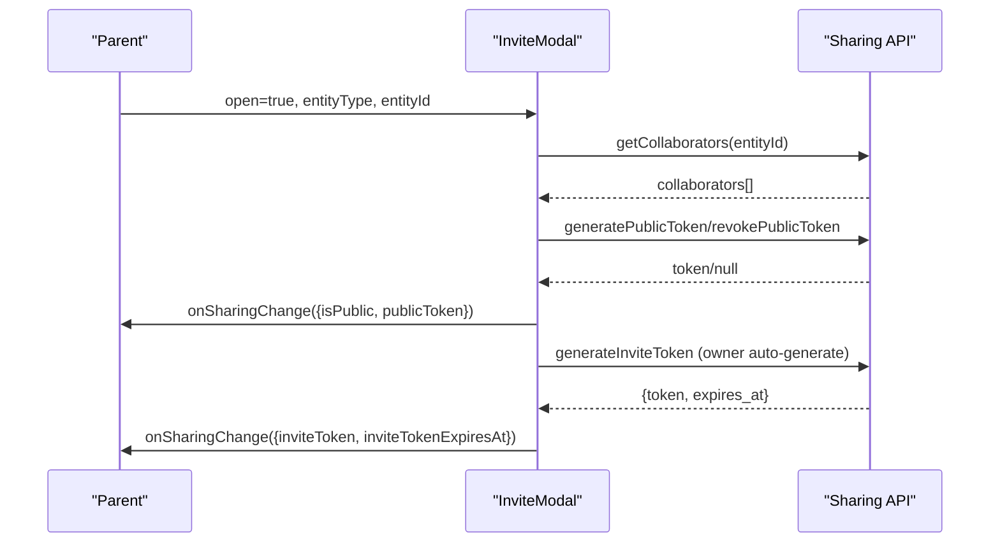
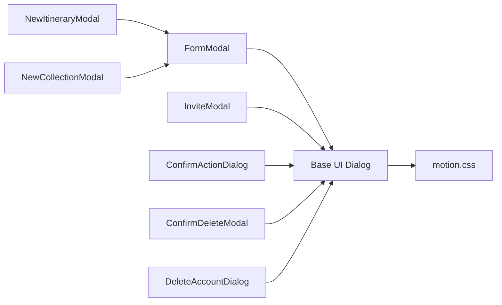

# Modal Components

<cite>
**Referenced Files in This Document**
- [FormModal.tsx](file://src/components/ui/modals/FormModal.tsx)
- [NewItineraryModal.tsx](file://src/components/ui/modals/NewItineraryModal.tsx)
- [NewCollectionModal.tsx](file://src/components/ui/modals/NewCollectionModal.tsx)
- [InviteModal.tsx](file://src/components/ui/modals/InviteModal.tsx)
- [ConfirmActionDialog.tsx](file://src/components/ui/modals/ConfirmActionDialog.tsx)
- [ConfirmDeleteModal.tsx](file://src/components/ui/modals/ConfirmDeleteModal.tsx)
- [DeleteAccountDialog.tsx](file://src/components/ui/modals/DeleteAccountDialog.tsx)
- [Sheet.tsx](file://src/components/ui/primitives/Sheet.tsx)
- [useModalAnimation.ts](file://src/hooks/useModalAnimation.ts)
- [motion.css](file://src/styles/tokens/motion.css)
</cite>

## Table of Contents
1. Introduction
2. Project Structure
3. Core Components
4. Architecture Overview
5. Detailed Component Analysis
6. Dependency Analysis
7. Performance Considerations
8. Troubleshooting Guide
9. Conclusion
10. Appendices

## Introduction
This document explains Argo’s modal component system for user interactions that require focused attention. It covers the base FormModal and specialized modals for creating itineraries, collections, inviting collaborators, and confirming destructive actions. It also documents modal lifecycle management, focus trapping and accessibility via Base UI Dialog, animation transitions powered by CSS tokens, form validation patterns inside modals, data passing between parent and modal components, and best practices for composing reusable modals.

## Project Structure
The modal system is organized under src/components/ui/modals with a shared base (FormModal) and several domain-specific implementations. Supporting primitives and hooks include:
- Base UI Dialog used across modals for portal, backdrop, focus trap, keyboard handling, and ARIA wiring.
- Sheet primitive for responsive overlays on mobile vs desktop.
- Motion tokens for consistent overlay animations and reduced-motion support.

**Diagram sources**
- [FormModal.tsx:1-224](file://src/components/ui/modals/FormModal.tsx#L1-L224)
- [NewItineraryModal.tsx:1-286](file://src/components/ui/modals/NewItineraryModal.tsx#L1-L286)
- [NewCollectionModal.tsx:1-226](file://src/components/ui/modals/NewCollectionModal.tsx#L1-L226)
- [InviteModal.tsx:1-789](file://src/components/ui/modals/InviteModal.tsx#L1-L789)
- [ConfirmActionDialog.tsx:1-129](file://src/components/ui/modals/ConfirmActionDialog.tsx#L1-L129)
- [ConfirmDeleteModal.tsx:1-107](file://src/components/ui/modals/ConfirmDeleteModal.tsx#L1-L107)
- [DeleteAccountDialog.tsx:1-279](file://src/components/ui/modals/DeleteAccountDialog.tsx#L1-L279)
- [Sheet.tsx:1-97](file://src/components/ui/primitives/Sheet.tsx#L1-L97)
- [motion.css:100-219](file://src/styles/tokens/motion.css#L100-L219)

**Section sources**
- [FormModal.tsx:1-224](file://src/components/ui/modals/FormModal.tsx#L1-L224)
- [Sheet.tsx:1-97](file://src/components/ui/primitives/Sheet.tsx#L1-L97)
- [motion.css:100-219](file://src/styles/tokens/motion.css#L100-L219)

## Core Components
- FormModal: Base form dialog with icon/sticker area, title/description, content slot, cancel/submit buttons, submission state, and mobile sheet behavior.
- NewItineraryModal: Two-step wizard to create an itinerary with trip name, region selection, date range, and AI recommendations toggle.
- NewCollectionModal: Create a collection with optional location and tags (preset + custom).
- InviteModal: Share and collaborate via public links and invite links; manage collaborators and token lifetimes.
- ConfirmActionDialog: Generic confirmation dialog for destructive or important actions.
- ConfirmDeleteModal: Delete confirmation with collaborator impact messaging.
- DeleteAccountDialog: Account deletion flow with impact summary and explicit confirmation phrase.

Key responsibilities:
- Lifecycle control via open/onOpenChange props.
- Form validation and submission gating.
- Data passing through controlled props and callbacks.
- Accessibility via Base UI Dialog (focus trap, Esc, ARIA).
- Consistent animations via motion tokens.

**Section sources**
- [FormModal.tsx:50-224](file://src/components/ui/modals/FormModal.tsx#L50-L224)
- [NewItineraryModal.tsx:16-286](file://src/components/ui/modals/NewItineraryModal.tsx#L16-L286)
- [NewCollectionModal.tsx:22-226](file://src/components/ui/modals/NewCollectionModal.tsx#L22-L226)
- [InviteModal.tsx:55-537](file://src/components/ui/modals/InviteModal.tsx#L55-L537)
- [ConfirmActionDialog.tsx:11-77](file://src/components/ui/modals/ConfirmActionDialog.tsx#L11-L77)
- [ConfirmDeleteModal.tsx:9-107](file://src/components/ui/modals/ConfirmDeleteModal.tsx#L9-L107)
- [DeleteAccountDialog.tsx:17-279](file://src/components/ui/modals/DeleteAccountDialog.tsx#L17-L279)

## Architecture Overview
All modals are built on top of Base UI Dialog for robust accessibility and focus management. The base FormModal provides a consistent layout and form UX, while specialized modals compose it or build their own dialogs when needed. Animations are driven by CSS variables and keyframes defined in motion.css, with reduced-motion support.

**Diagram sources**
- [FormModal.tsx:100-216](file://src/components/ui/modals/FormModal.tsx#L100-L216)
- [motion.css:100-186](file://src/styles/tokens/motion.css#L100-L186)

## Detailed Component Analysis

### FormModal
- Purpose: Reusable form dialog with consistent header, content slot, and footer.
- Props: open, onOpenChange, title, description, children, submit/cancel labels, submitting state, variant/icon/sticker, trigger.
- Behavior:
  - Uses Base UI Dialog for portal/backdrop/focus trap and ARIA.
  - Mobile presentation uses bottom sheet styling; desktop centers popup.
  - Submit button shows loading spinner during submission.
  - Cancel can close or act as “Back” depending on cancelCloses.

**Diagram sources**
- [FormModal.tsx:124-213](file://src/components/ui/modals/FormModal.tsx#L124-L213)

**Section sources**
- [FormModal.tsx:50-224](file://src/components/ui/modals/FormModal.tsx#L50-L224)

### NewItineraryModal
- Purpose: Two-step wizard to create an itinerary with trip name, region, dates, and AI recommendations.
- Validation:
  - Step 1 requires trip name and selected place; invalid fields shake.
  - Step 2 requires a valid date range; invalid field shakes.
- Data passing: Controlled props for trip name and change handler; returns structured payload on submit.
- Lifecycle: Resets internal state on close; distinguishes close-after-submit from abandonment using a ref.

**Diagram sources**
- [NewItineraryModal.tsx:118-160](file://src/components/ui/modals/NewItineraryModal.tsx#L118-L160)
- [NewItineraryModal.tsx:162-279](file://src/components/ui/modals/NewItineraryModal.tsx#L162-L279)

**Section sources**
- [NewItineraryModal.tsx:16-286](file://src/components/ui/modals/NewItineraryModal.tsx#L16-L286)

### NewCollectionModal
- Purpose: Create a collection with optional location and tags (preset + custom).
- Validation: Requires a non-empty name; disables submit while loading or submitting.
- Data passing: Controlled name prop with change handler; returns payload including optional tags and location coordinates.

**Diagram sources**
- [NewCollectionModal.tsx:118-135](file://src/components/ui/modals/NewCollectionModal.tsx#L118-L135)

**Section sources**
- [NewCollectionModal.tsx:22-226](file://src/components/ui/modals/NewCollectionModal.tsx#L22-L226)

### InviteModal
- Purpose: Manage sharing via public links and invite links; list/remove collaborators.
- Features:
  - Tabs for Public link and Invite.
  - Auto-generates invite link for owners when viewing Invite tab.
  - Copy-to-clipboard with feedback.
  - Collaborators list with remove action.
  - Inline or dialog rendering modes.
- Data passing: Controlled open state; onSharingChange notifies parent of token updates.

**Diagram sources**
- [InviteModal.tsx:184-239](file://src/components/ui/modals/InviteModal.tsx#L184-L239)
- [InviteModal.tsx:194-215](file://src/components/ui/modals/InviteModal.tsx#L194-L215)

**Section sources**
- [InviteModal.tsx:55-537](file://src/components/ui/modals/InviteModal.tsx#L55-L537)

### ConfirmActionDialog
- Purpose: Generic confirmation dialog with warning icon, message, and confirm/cancel actions.
- Usage: Suitable for destructive or important actions requiring explicit confirmation.

**Section sources**
- [ConfirmActionDialog.tsx:11-77](file://src/components/ui/modals/ConfirmActionDialog.tsx#L11-L77)

### ConfirmDeleteModal
- Purpose: Delete confirmation tailored for entities with optional collaborator impact messaging.
- Behavior: Shows collaborator count if present; primary delete action triggers onConfirm and closes.

**Section sources**
- [ConfirmDeleteModal.tsx:9-107](file://src/components/ui/modals/ConfirmDeleteModal.tsx#L9-L107)

### DeleteAccountDialog
- Purpose: Account deletion flow with impact summary and explicit confirmation phrase.
- Safety: Disables closing during deletion; prevents accidental dismissal; requires typing exact phrase to enable delete.

**Section sources**
- [DeleteAccountDialog.tsx:17-279](file://src/components/ui/modals/DeleteAccountDialog.tsx#L17-L279)

## Dependency Analysis
- Base UI Dialog: Provides portal, backdrop, focus trap, keyboard handling (Esc), and ARIA attributes across all modals.
- Motion tokens: Centralize durations, easings, and keyframes for consistent overlay animations and reduced-motion behavior.
- Primitives: Button, Input, Pill, Separator, Switch, Avatar used by modals for consistent UI.
- Hooks: useBreakpoint drives responsive behavior (e.g., mobile sheet in FormModal); useModalAnimation is a no-op placeholder indicating CSS-driven animations.

**Diagram sources**
- [FormModal.tsx:100-216](file://src/components/ui/modals/FormModal.tsx#L100-L216)
- [InviteModal.tsx:518-535](file://src/components/ui/modals/InviteModal.tsx#L518-L535)
- [ConfirmActionDialog.tsx:30-75](file://src/components/ui/modals/ConfirmActionDialog.tsx#L30-L75)
- [ConfirmDeleteModal.tsx:28-103](file://src/components/ui/modals/ConfirmDeleteModal.tsx#L28-L103)
- [DeleteAccountDialog.tsx:101-275](file://src/components/ui/modals/DeleteAccountDialog.tsx#L101-L275)
- [motion.css:100-219](file://src/styles/tokens/motion.css#L100-L219)

**Section sources**
- [Sheet.tsx:50-97](file://src/components/ui/primitives/Sheet.tsx#L50-L97)
- [useModalAnimation.ts:1-3](file://src/hooks/useModalAnimation.ts#L1-L3)
- [motion.css:1-219](file://src/styles/tokens/motion.css#L1-L219)

## Performance Considerations
- Prefer controlled open state at the parent level to avoid uncontrolled re-renders.
- Debounce heavy operations in onSubmit (e.g., API calls) and keep isSubmitting true until completion.
- Use memoization for derived values (e.g., date display, total days) to prevent unnecessary recalculations.
- Respect prefers-reduced-motion; animations automatically reduce to instant transitions.

[No sources needed since this section provides general guidance]

## Troubleshooting Guide
- Focus not trapped: Ensure modals use Base UI Dialog Root/Portal/Popup; verify z-index and portal mounting.
- Escape key does not close: Check that onOpenChange is wired and not blocked by disabling close during critical flows.
- Animations not playing: Verify classes .modal-popup-animated and .modal-backdrop-animated are applied; ensure motion.css is imported.
- Form validation not visible: Ensure shaking fields are toggled and animations are triggered; check that invalid fields have appropriate refs or keys.
- Copy to clipboard fails: Handle navigator.clipboard errors and show toast feedback.

**Section sources**
- [InviteModal.tsx:272-283](file://src/components/ui/modals/InviteModal.tsx#L272-L283)
- [motion.css:100-219](file://src/styles/tokens/motion.css#L100-L219)
- [Sheet.tsx:50-97](file://src/components/ui/primitives/Sheet.tsx#L50-L97)

## Conclusion
Argo’s modal system centers around a reusable FormModal base and specialized modals that encapsulate domain workflows. Base UI Dialog ensures accessibility and focus management, while motion.css provides consistent, theme-aware animations. Controlled props and callbacks enable predictable data flow and lifecycle management. Following the patterns outlined here will help maintain consistency, accessibility, and performance across the application.

[No sources needed since this section summarizes without analyzing specific files]

## Appendices

### Best Practices for Modal Composition and Reusability
- Keep modals small and focused; extract complex logic into hooks or utilities.
- Use controlled open state and expose clear callbacks (onSubmit, onCancel, onOpenChange).
- Provide sensible defaults for labels and behaviors; allow overrides via props.
- Validate early and provide immediate feedback; use consistent error visuals (e.g., shaking fields).
- Compose modals with primitives (Button, Input, Pill) to maintain design consistency.
- For multi-step flows, manage steps internally but expose minimal surface to parents.

[No sources needed since this section provides general guidance]