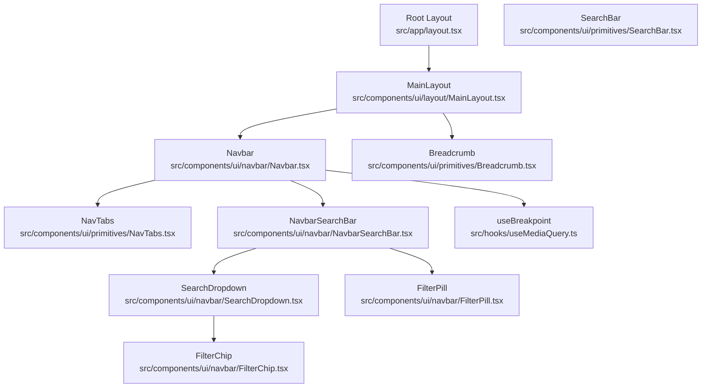
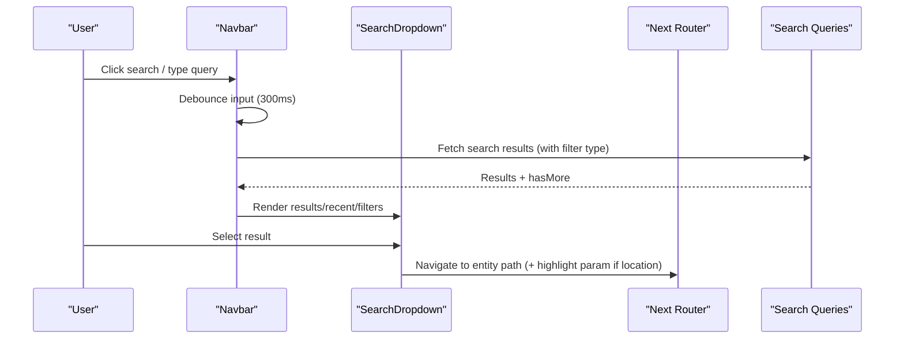
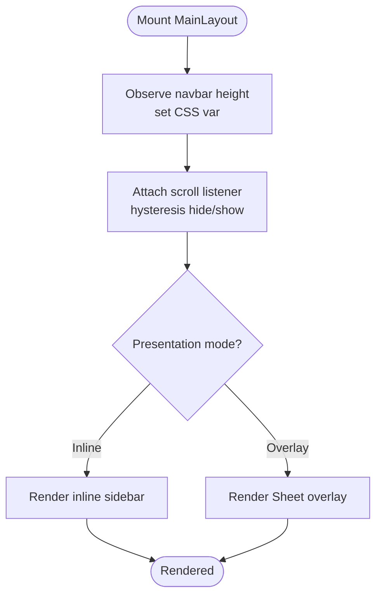
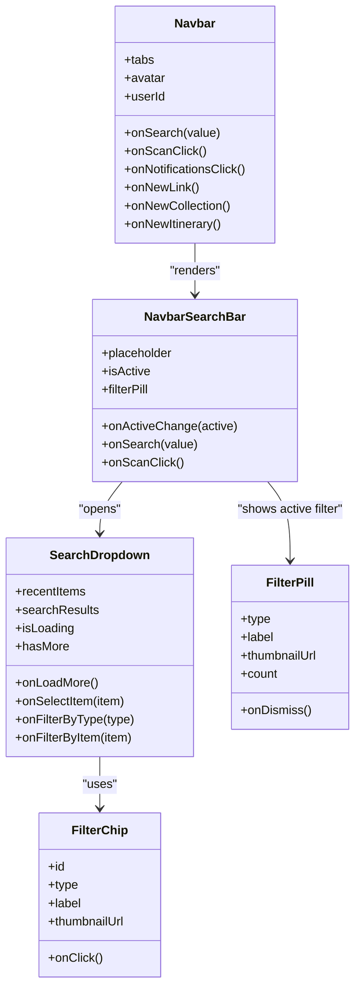
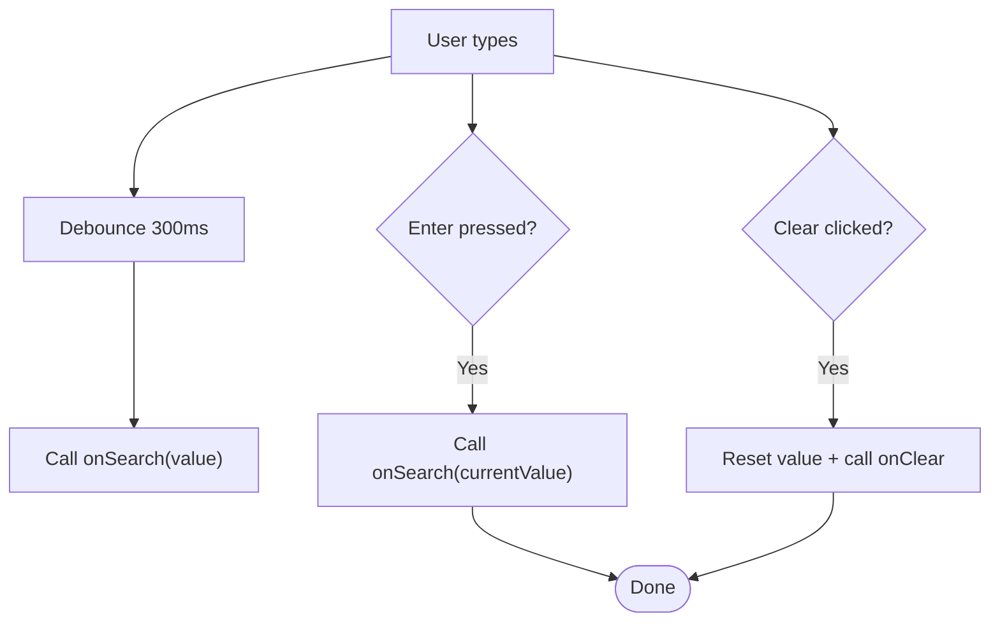
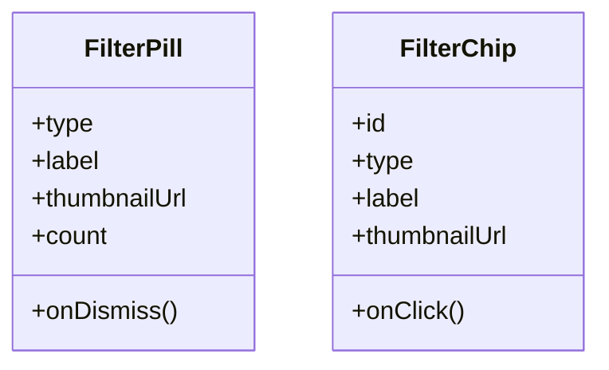
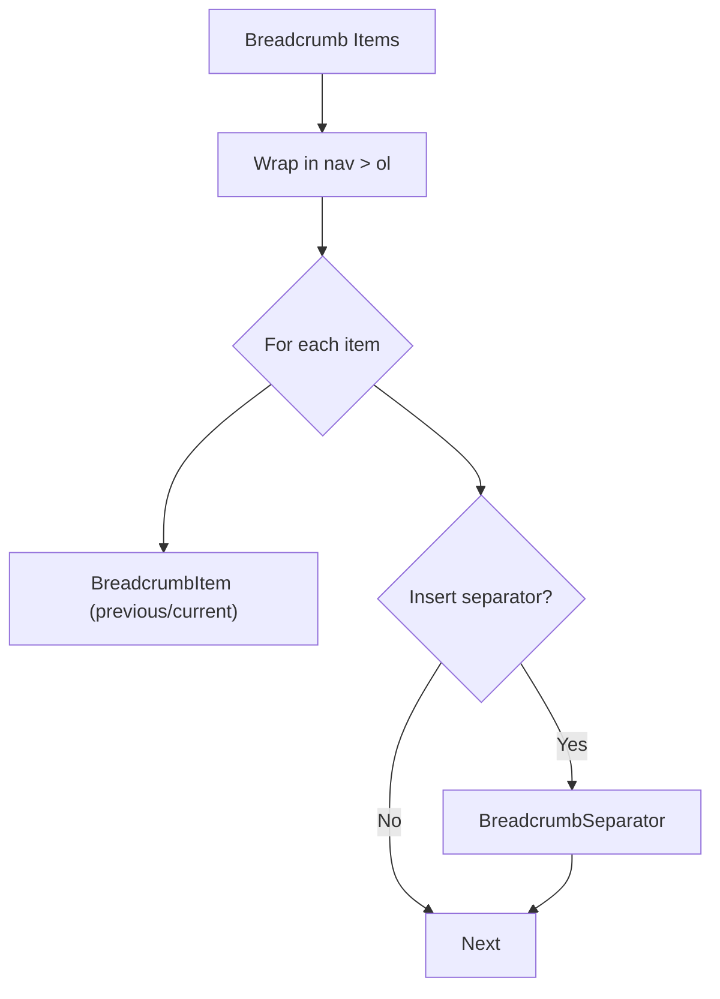
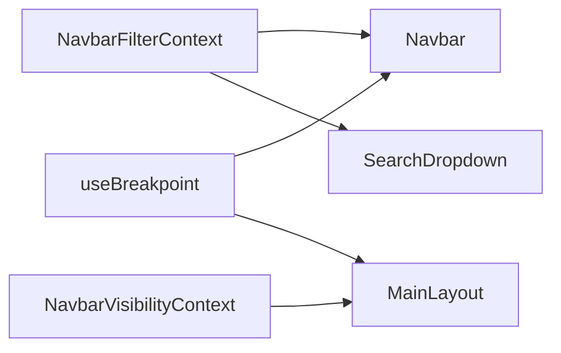

# Layout & Navigation Components

<cite>
**Referenced Files in This Document**
- [MainLayout.tsx](file://src/components/ui/layout/MainLayout.tsx)
- [Navbar.tsx](file://src/components/ui/navbar/Navbar.tsx)
- [NavbarSearchBar.tsx](file://src/components/ui/navbar/NavbarSearchBar.tsx)
- [SearchDropdown.tsx](file://src/components/ui/navbar/SearchDropdown.tsx)
- [FilterPill.tsx](file://src/components/ui/navbar/FilterPill.tsx)
- [FilterChip.tsx](file://src/components/ui/navbar/FilterChip.tsx)
- [Breadcrumb.tsx](file://src/components/ui/primitives/Breadcrumb.tsx)
- [NavTabs.tsx](file://src/components/ui/primitives/NavTabs.tsx)
- [SearchBar.tsx](file://src/components/ui/primitives/SearchBar.tsx)
- [NavbarFilterContext.tsx](file://src/contexts/NavbarFilterContext.tsx)
- [NavbarVisibilityContext.tsx](file://src/contexts/NavbarVisibilityContext.tsx)
- [useMediaQuery.ts](file://src/hooks/useMediaQuery.ts)
- [layout.tsx](file://src/app/layout.tsx)
</cite>

## Table of Contents
1. [Introduction](#introduction)
2. [Project Structure](#project-structure)
3. [Core Components](#core-components)
4. [Architecture Overview](#architecture-overview)
5. [Detailed Component Analysis](#detailed-component-analysis)
6. [Dependency Analysis](#dependency-analysis)
7. [Performance Considerations](#performance-considerations)
8. [Troubleshooting Guide](#troubleshooting-guide)
9. [Conclusion](#conclusion)
10. [Appendices](#appendices)

## Introduction
This document explains the layout and navigation system used across the application. It covers the MainLayout shell, the Navbar with search and filters, SearchBar primitives, FilterChips and FilterPills for filtering, and Breadcrumb navigation. It also documents responsive design patterns, navigation state management, and how search and filters integrate with routing and data fetching. You will find examples for customizing layouts, implementing navigation flows, and building consistent page structures, along with accessibility considerations for navigation and responsive behavior.

## Project Structure
The layout and navigation are composed from a top-level layout component that wraps pages with shared chrome (navbar, right sidebar, modals), and a set of reusable UI components for search, filtering, and navigation.

**Diagram sources**
- [layout.tsx:57-83](file://src/app/layout.tsx#L57-L83)
- [MainLayout.tsx:386-396](file://src/components/ui/layout/MainLayout.tsx#L386-L396)
- [Navbar.tsx:49-60](file://src/components/ui/navbar/Navbar.tsx#L49-L60)
- [NavTabs.tsx:26-67](file://src/components/ui/primitives/NavTabs.tsx#L26-L67)
- [SearchBar.tsx:88-213](file://src/components/ui/primitives/SearchBar.tsx#L88-L213)
- [NavbarSearchBar.tsx:26-199](file://src/components/ui/navbar/NavbarSearchBar.tsx#L26-L199)
- [SearchDropdown.tsx:53-215](file://src/components/ui/navbar/SearchDropdown.tsx#L53-L215)
- [FilterPill.tsx:20-68](file://src/components/ui/navbar/FilterPill.tsx#L20-L68)
- [FilterChip.tsx:15-45](file://src/components/ui/navbar/FilterChip.tsx#L15-L45)
- [Breadcrumb.tsx:105-124](file://src/components/ui/primitives/Breadcrumb.tsx#L105-L124)
- [useMediaQuery.ts:53-67](file://src/hooks/useMediaQuery.ts#L53-L67)

**Section sources**
- [layout.tsx:57-83](file://src/app/layout.tsx#L57-L83)
- [MainLayout.tsx:386-396](file://src/components/ui/layout/MainLayout.tsx#L386-L396)

## Core Components
- MainLayout: Provides the application shell, including a sticky navbar that hides on scroll, a main content area, a right sidebar (inline on desktop, overlay sheet on mobile), global modals, and navigation loading overlays. It also wires up user profile, quota handling, and creation flows for links, collections, and itineraries.
- Navbar: The primary navigation bar with logo, tabs, search, create actions, notifications, and profile menu. It manages an expanded search overlay with recent items, type filters, and result cards.
- SearchBar: A generic, accessible search input primitive with variants, debounced search, clear button, and optional loading indicator.
- NavbarSearchBar: A specialized search input integrated into the navbar, supporting active states, filter pills, and keyboard interactions.
- SearchDropdown: Displays “search in” filters, recently viewed items, and paginated search results with load more.
- FilterPill and FilterChip: Visual indicators for active filters; FilterPill is used inside the search bar to show current filter context; FilterChip appears in dropdowns for quick filtering by item or type.
- Breadcrumb: Accessible breadcrumb trail with previous/current steps and separators.
- NavTabs: Primary site navigation tabs with active state detection based on pathname.

**Section sources**
- [MainLayout.tsx:33-379](file://src/components/ui/layout/MainLayout.tsx#L33-L379)
- [Navbar.tsx:49-538](file://src/components/ui/navbar/Navbar.tsx#L49-L538)
- [SearchBar.tsx:88-213](file://src/components/ui/primitives/SearchBar.tsx#L88-L213)
- [NavbarSearchBar.tsx:26-199](file://src/components/ui/navbar/NavbarSearchBar.tsx#L26-L199)
- [SearchDropdown.tsx:53-215](file://src/components/ui/navbar/SearchDropdown.tsx#L53-L215)
- [FilterPill.tsx:20-68](file://src/components/ui/navbar/FilterPill.tsx#L20-L68)
- [FilterChip.tsx:15-45](file://src/components/ui/navbar/FilterChip.tsx#L15-L45)
- [Breadcrumb.tsx:105-124](file://src/components/ui/primitives/Breadcrumb.tsx#L105-L124)
- [NavTabs.tsx:26-67](file://src/components/ui/primitives/NavTabs.tsx#L26-L67)

## Architecture Overview
The layout architecture centers around MainLayout as the root wrapper for all routes. It composes providers for navigation loading, right sidebar visibility, and navbar filters. The Navbar orchestrates search and filters using contexts and hooks, while SearchDropdown renders results and integrates with routing. Responsive behavior is driven by useBreakpoint to switch between inline and overlay modes for sidebars and menus.

**Diagram sources**
- [Navbar.tsx:132-184](file://src/components/ui/navbar/Navbar.tsx#L132-L184)
- [NavbarSearchBar.tsx:68-88](file://src/components/ui/navbar/NavbarSearchBar.tsx#L68-L88)
- [SearchDropdown.tsx:163-210](file://src/components/ui/navbar/SearchDropdown.tsx#L163-L210)

## Detailed Component Analysis

### MainLayout
- Responsibilities:
  - Wraps children with providers for navigation loading, right sidebar, and navbar filters.
  - Manages a sticky navbar that auto-hides on scroll using hysteresis thresholds to avoid flicker.
  - Exposes a right sidebar that is inline on desktop and a Sheet overlay on smaller screens.
  - Integrates global modals for creating links, collections, and itineraries.
  - Handles user profile retrieval and quota-aware feedback for creation flows.
- Responsive behavior:
  - Uses presentation mode to decide between inline sidebar and overlay sheet.
  - Observes navbar height to compute CSS variable for content spacing.
- Accessibility:
  - Respects reduced motion preferences for animations.
  - Uses semantic structure for main content and proper focus management via providers.

**Diagram sources**
- [MainLayout.tsx:49-91](file://src/components/ui/layout/MainLayout.tsx#L49-L91)
- [MainLayout.tsx:299-342](file://src/components/ui/layout/MainLayout.tsx#L299-L342)

**Section sources**
- [MainLayout.tsx:33-379](file://src/components/ui/layout/MainLayout.tsx#L33-L379)

### Navbar
- Responsibilities:
  - Renders logo, NavTabs, search, create actions, notifications, and profile menu.
  - Controls an expanded search overlay portaled to body to escape stacking contexts.
  - Manages filter state via NavbarFilterContext and integrates with search queries.
  - Routes users to entities based on selected search results, with special handling for locations within specific entities.
- Responsive behavior:
  - On desktop, shows full tabs and centered search anchor; on mobile, collapses to compact controls and uses a menu for secondary actions.
  - Uses useBreakpoint to determine when to show the overlay search vs inline search.
- Accessibility:
  - Uses aria-labels for interactive elements.
  - Backdrop dismisses search overlay; Escape key closes search in inputs.

**Diagram sources**
- [Navbar.tsx:49-538](file://src/components/ui/navbar/Navbar.tsx#L49-L538)
- [NavbarSearchBar.tsx:26-199](file://src/components/ui/navbar/NavbarSearchBar.tsx#L26-L199)
- [SearchDropdown.tsx:53-215](file://src/components/ui/navbar/SearchDropdown.tsx#L53-L215)
- [FilterPill.tsx:20-68](file://src/components/ui/navbar/FilterPill.tsx#L20-L68)
- [FilterChip.tsx:15-45](file://src/components/ui/navbar/FilterChip.tsx#L15-L45)

**Section sources**
- [Navbar.tsx:49-538](file://src/components/ui/navbar/Navbar.tsx#L49-L538)
- [NavbarSearchBar.tsx:26-199](file://src/components/ui/navbar/NavbarSearchBar.tsx#L26-L199)
- [SearchDropdown.tsx:53-215](file://src/components/ui/navbar/SearchDropdown.tsx#L53-L215)

### SearchBar (Primitive)
- Features:
  - Controlled or uncontrolled value with internal state fallback.
  - Debounced onChange to reduce network calls.
  - Clear button triggers clearing and optional callbacks.
  - Loading spinner replaces icon during search.
  - Keyboard support for Enter submission.
- Accessibility:
  - Clear button has aria-label.
  - Focus states and disabled states are styled consistently.

**Diagram sources**
- [SearchBar.tsx:119-156](file://src/components/ui/primitives/SearchBar.tsx#L119-L156)

**Section sources**
- [SearchBar.tsx:88-213](file://src/components/ui/primitives/SearchBar.tsx#L88-L213)

### FilterPill and FilterChip
- FilterPill:
  - Shows active filter context inside the search bar with thumbnail or category badge.
  - Dismissible via click; supports count display.
  - Responsive: compact circular on small screens, expands to label on larger screens.
- FilterChip:
  - Used in dropdowns to quickly filter by type or recent item.
  - Accessible with image alt attributes hidden and meaningful labels.

**Diagram sources**
- [FilterPill.tsx:20-68](file://src/components/ui/navbar/FilterPill.tsx#L20-L68)
- [FilterChip.tsx:15-45](file://src/components/ui/navbar/FilterChip.tsx#L15-L45)

**Section sources**
- [FilterPill.tsx:20-68](file://src/components/ui/navbar/FilterPill.tsx#L20-L68)
- [FilterChip.tsx:15-45](file://src/components/ui/navbar/FilterChip.tsx#L15-L45)

### Breadcrumb
- Structure:
  - Composed of BreadcrumbItem (previous/current) and BreadcrumbSeparator.
  - Automatically inserts separators between items.
  - Uses aria-current for the current step and aria-hidden for decorative separators.
- Usage:
  - Ideal for deep navigation paths within detail views or sections.

**Diagram sources**
- [Breadcrumb.tsx:105-124](file://src/components/ui/primitives/Breadcrumb.tsx#L105-L124)

**Section sources**
- [Breadcrumb.tsx:105-124](file://src/components/ui/primitives/Breadcrumb.tsx#L105-L124)

### NavTabs
- Behavior:
  - Renders default tabs (Home, Link, Collection, Itinerary).
  - Highlights active tab based on pathname matching.
  - Supports disabled tabs with appropriate accessibility attributes.
- Integration:
  - Placed next to the logo in the Navbar for primary navigation.

**Section sources**
- [NavTabs.tsx:26-67](file://src/components/ui/primitives/NavTabs.tsx#L26-L67)

## Dependency Analysis
- Contexts:
  - NavbarFilterContext provides shared filter state across Navbar and SearchDropdown.
  - NavbarVisibilityContext allows child components to influence navbar visibility.
- Hooks:
  - useBreakpoint drives responsive branching for layout and menus.
- Routing:
  - Next.js router is used to navigate to entities after selecting search results.

**Diagram sources**
- [NavbarFilterContext.tsx:24-43](file://src/contexts/NavbarFilterContext.tsx#L24-L43)
- [NavbarVisibilityContext.tsx:11-27](file://src/contexts/NavbarVisibilityContext.tsx#L11-L27)
- [useMediaQuery.ts:53-67](file://src/hooks/useMediaQuery.ts#L53-L67)
- [Navbar.tsx:62-65](file://src/components/ui/navbar/Navbar.tsx#L62-L65)
- [MainLayout.tsx:386-396](file://src/components/ui/layout/MainLayout.tsx#L386-L396)

**Section sources**
- [NavbarFilterContext.tsx:24-43](file://src/contexts/NavbarFilterContext.tsx#L24-L43)
- [NavbarVisibilityContext.tsx:11-27](file://src/contexts/NavbarVisibilityContext.tsx#L11-L27)
- [useMediaQuery.ts:53-67](file://src/hooks/useMediaQuery.ts#L53-L67)

## Performance Considerations
- Debounced search: Both SearchBar and NavbarSearchBar debounce input changes by 300ms to reduce unnecessary network requests.
- Pagination: SearchDropdown supports incremental loading with “load more” to handle large result sets efficiently.
- Reduced motion: Animations respect user preferences via useReducedMotion to improve performance and accessibility.
- Portal usage: Search overlay is portaled to body to avoid expensive reflows caused by nested stacking contexts.

[No sources needed since this section provides general guidance]

## Troubleshooting Guide
- Search not updating:
  - Ensure onSearch is provided and debounce is not masking rapid updates. Check that Enter key triggers immediate submission.
- Filters not applied:
  - Verify NavbarFilterContext is wrapped by NavbarFilterProvider and that setFilter is called correctly from Navbar.
- Navbar hiding unexpectedly:
  - Confirm the scroll container has correct attributes and that hysteresis thresholds are appropriate for your content height.
- Right sidebar not showing:
  - Check presentation mode and ensure RightSidebarProvider is wrapping content; verify state updates via setRightSidebar.
- Accessibility issues:
  - Ensure all interactive elements have appropriate aria-labels and roles; confirm focus management when opening/closing overlays.

**Section sources**
- [NavbarSearchBar.tsx:68-88](file://src/components/ui/navbar/NavbarSearchBar.tsx#L68-L88)
- [NavbarFilterContext.tsx:24-43](file://src/contexts/NavbarFilterContext.tsx#L24-L43)
- [MainLayout.tsx:49-91](file://src/components/ui/layout/MainLayout.tsx#L49-L91)
- [MainLayout.tsx:299-342](file://src/components/ui/layout/MainLayout.tsx#L299-L342)

## Conclusion
The layout and navigation system is built around a robust MainLayout shell and a flexible Navbar that integrates search, filters, and routing. Components like SearchBar, FilterPill, FilterChip, and Breadcrumb provide consistent, accessible primitives for common UX patterns. Responsive behavior is centralized through useBreakpoint, enabling seamless transitions between mobile and desktop experiences. By leveraging contexts and hooks, the system maintains clean separation of concerns and scalable state management.

[No sources needed since this section summarizes without analyzing specific files]

## Appendices

### Customizing Layouts
- Add or replace tabs by passing a custom tabs array to NavTabs within Navbar.
- Adjust right sidebar behavior by changing presentation mode in MainLayout or overriding provider values.
- Extend search functionality by integrating additional filters or result types in SearchDropdown.

**Section sources**
- [NavTabs.tsx:26-67](file://src/components/ui/primitives/NavTabs.tsx#L26-L67)
- [MainLayout.tsx:299-342](file://src/components/ui/layout/MainLayout.tsx#L299-L342)
- [SearchDropdown.tsx:53-215](file://src/components/ui/navbar/SearchDropdown.tsx#L53-L215)

### Implementing Navigation Flows
- Use Navbar’s onSearch callback to trigger searches and update URL parameters as needed.
- Route to entities via Next.js router after selecting search results; include highlight parameters for location-based navigation.
- Leverage Breadcrumb for deep navigation paths within detail views.

**Section sources**
- [Navbar.tsx:162-184](file://src/components/ui/navbar/Navbar.tsx#L162-L184)
- [Breadcrumb.tsx:105-124](file://src/components/ui/primitives/Breadcrumb.tsx#L105-L124)

### Creating Consistent Page Structures
- Wrap pages with MainLayout to inherit shared chrome and behaviors.
- Use NavTabs for primary navigation and Breadcrumb for contextual navigation within sections.
- Apply consistent styling via primitives and utility classes for cohesive design.

**Section sources**
- [MainLayout.tsx:386-396](file://src/components/ui/layout/MainLayout.tsx#L386-L396)
- [NavTabs.tsx:26-67](file://src/components/ui/primitives/NavTabs.tsx#L26-L67)
- [Breadcrumb.tsx:105-124](file://src/components/ui/primitives/Breadcrumb.tsx#L105-L124)

### Accessibility Considerations
- Provide descriptive aria-labels for buttons and inputs.
- Use semantic HTML (nav, ol, li) for breadcrumbs and navigation lists.
- Respect reduced motion preferences for animations.
- Ensure focus management when opening/closing overlays and modals.

**Section sources**
- [Navbar.tsx:370-413](file://src/components/ui/navbar/Navbar.tsx#L370-L413)
- [Breadcrumb.tsx:105-124](file://src/components/ui/primitives/Breadcrumb.tsx#L105-L124)
- [MainLayout.tsx:34-35](file://src/components/ui/layout/MainLayout.tsx#L34-L35)