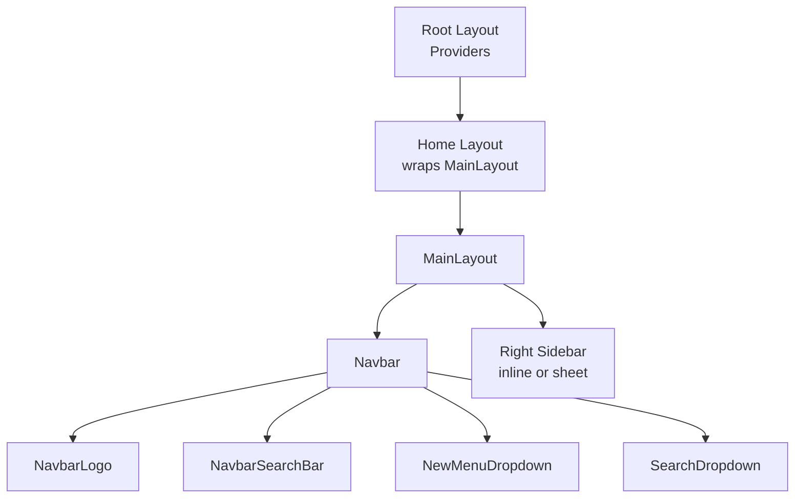
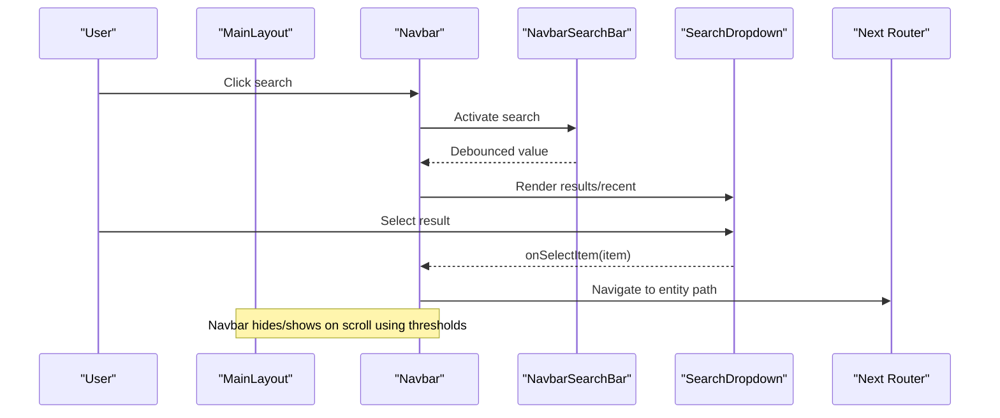
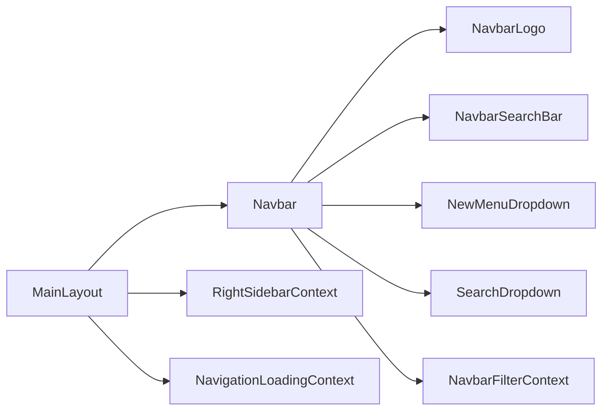

# Layout Components

<cite>
**Referenced Files in This Document**
- [MainLayout.tsx](file://src/components/ui/layout/MainLayout.tsx)
- [Navbar.tsx](file://src/components/ui/navbar/Navbar.tsx)
- [NavbarLogo.tsx](file://src/components/ui/navbar/NavbarLogo.tsx)
- [NavbarSearchBar.tsx](file://src/components/ui/navbar/NavbarSearchBar.tsx)
- [NewMenuDropdown.tsx](file://src/components/ui/navbar/NewMenuDropdown.tsx)
- [SearchDropdown.tsx](file://src/components/ui/navbar/SearchDropdown.tsx)
- [NavbarFilterContext.tsx](file://src/contexts/NavbarFilterContext.tsx)
- [NavbarVisibilityContext.tsx](file://src/contexts/NavbarVisibilityContext.tsx)
- [useMediaQuery.ts](file://src/hooks/useMediaQuery.ts)
- [SearchBar.tsx](file://src/components/ui/primitives/SearchBar.tsx)
- [home layout.tsx](file://src/app/home/layout.tsx)
</cite>

## Table of Contents
1. Introduction
2. Project Structure
3. Core Components
4. Architecture Overview
5. Detailed Component Analysis
6. Dependency Analysis
7. Performance Considerations
8. Troubleshooting Guide
9. Conclusion
10. Appendices

## Introduction
This document explains Argo’s layout and navigation system with a focus on the MainLayout component, the Navbar implementation, and supporting elements such as Logo, SearchBar, and MenuDropdown. It covers responsive layout strategies, mobile-first design, navigation state management, search integration, accessibility features, and guidelines for extending layouts while maintaining consistent experiences across devices.

## Project Structure
Argo uses Next.js App Router with a root layout that provides global providers (theme, toasts, tooltips). Feature routes wrap their content in a shared MainLayout, which renders the Navbar and manages global UI concerns like right sidebar presentation and navigation loading overlays. The Navbar is a self-contained component that adapts between desktop and mobile layouts and orchestrates search, filters, and creation flows.

**Diagram sources**
- [home layout.tsx:1-12](file://src/app/home/layout.tsx#L1-L12)
- [MainLayout.tsx:386-397](file://src/components/ui/layout/MainLayout.tsx#L386-L397)
- [Navbar.tsx:326-533](file://src/components/ui/navbar/Navbar.tsx#L326-L533)

**Section sources**
- [home layout.tsx:1-12](file://src/app/home/layout.tsx#L1-L12)
- [MainLayout.tsx:386-397](file://src/components/ui/layout/MainLayout.tsx#L386-L397)

## Core Components
- MainLayout: Provides the application shell, manages navbar visibility based on scroll position, hosts the right sidebar (inline on desktop, sheet on mobile), and wraps global contexts for navigation loading, filtering, and sidebar state.
- Navbar: Responsive header with logo, tabs, search, create menu, notifications, and profile. On mobile, it collapses actions into a menu.
- NavbarLogo: Accessible link to home with keyboard focus styles.
- NavbarSearchBar: Debounced input with clear button, scan action, and optional filter pill; supports controlled and uncontrolled modes.
- NewMenuDropdown: “+ New” menu to create Link, Collection, or Itinerary.
- SearchDropdown: Overlay panel showing recent items, type filters, and paginated results.

**Section sources**
- [MainLayout.tsx:33-397](file://src/components/ui/layout/MainLayout.tsx#L33-L397)
- [Navbar.tsx:36-542](file://src/components/ui/navbar/Navbar.tsx#L36-L542)
- [NavbarLogo.tsx:6-35](file://src/components/ui/navbar/NavbarLogo.tsx#L6-L35)
- [NavbarSearchBar.tsx:15-203](file://src/components/ui/navbar/NavbarSearchBar.tsx#L15-L203)
- [NewMenuDropdown.tsx:15-73](file://src/components/ui/navbar/NewMenuDropdown.tsx#L15-L73)
- [SearchDropdown.tsx:30-221](file://src/components/ui/navbar/SearchDropdown.tsx#L30-L221)

## Architecture Overview
The layout architecture centers around MainLayout, which composes the Navbar and content area. The Navbar handles its own internal state for search activation and integrates with global filter context. Search results are rendered via a portal overlay to escape stacking contexts. The right sidebar switches between inline column and sheet based on presentation mode.

**Diagram sources**
- [Navbar.tsx:127-184](file://src/components/ui/navbar/Navbar.tsx#L127-L184)
- [Navbar.tsx:237-324](file://src/components/ui/navbar/Navbar.tsx#L237-L324)
- [SearchDropdown.tsx:163-211](file://src/components/ui/navbar/SearchDropdown.tsx#L163-L211)
- [MainLayout.tsx:69-91](file://src/components/ui/layout/MainLayout.tsx#L69-L91)

## Detailed Component Analysis

### MainLayout
Responsibilities:
- Renders the Navbar and main content area.
- Manages navbar visibility with scroll-based thresholds and hysteresis to avoid flicker during programmatic scrolls.
- Hosts the right sidebar in two modes: inline column on larger screens and a slide-out Sheet on smaller screens.
- Integrates global modals for creating new content (Link, Collection, Itinerary) and displays a navigation loading overlay when needed.
- Wraps providers for navigation loading, filter context, and right sidebar context.

Responsive behavior:
- Uses CSS classes to control layout and spacing.
- Switches right sidebar rendering strategy based on presentation mode.

Accessibility:
- Respects reduced motion preferences for animations.
- Uses semantic structure and ARIA attributes where appropriate.

Key interactions:
- Scroll observer sets a CSS variable for navbar height and toggles visibility based on scrollTop thresholds.
- Creates entities and navigates to detail pages, invalidating relevant queries and dispatching custom events to update lists.

**Section sources**
- [MainLayout.tsx:33-397](file://src/components/ui/layout/MainLayout.tsx#L33-L397)

### Navbar
Responsibilities:
- Displays logo, navigation tabs, search bar, create menu, notifications, and profile actions.
- Adapts layout for desktop vs. mobile:
  - Desktop: horizontal layout with centered search and right-aligned actions.
  - Mobile: compact layout with collapsible menu for actions.
- Manages search activation state and renders a full-screen search overlay via portal.
- Integrates with filter context to scope searches by type or specific entity.

Search flow:
- Activates search overlay anchored to the search bar position on desktop or top-aligned on mobile.
- Debounces input changes and loads recent items and paginated results.
- Supports filtering by type and by specific item; navigates to entity paths or highlights locations within an entity page.

Accessibility:
- Keyboard support for closing search (Escape) and submitting (Enter).
- ARIA labels for buttons and menus.

**Section sources**
- [Navbar.tsx:36-542](file://src/components/ui/navbar/Navbar.tsx#L36-L542)

### NavbarLogo
Responsibilities:
- Renders a branded link to the home route with accessible label and focus ring.

Accessibility:
- Uses aria-label for screen readers.
- Focus-visible styling ensures keyboard navigation clarity.

**Section sources**
- [NavbarLogo.tsx:6-35](file://src/components/ui/navbar/NavbarLogo.tsx#L6-L35)

### NavbarSearchBar
Responsibilities:
- Provides a rounded search input with leading icon, optional filter pill, clear button, and scan action.
- Supports both controlled and uncontrolled value modes.
- Debounces onChange to reduce query frequency and immediately triggers on Enter key.

Behavior:
- Truncates placeholder text when not active to save space.
- Animates filter pill appearance/disappearance respecting reduced motion preference.

Accessibility:
- Clear button has aria-label.
- Keyboard handling includes Escape to deactivate and Enter to submit.

**Section sources**
- [NavbarSearchBar.tsx:15-203](file://src/components/ui/navbar/NavbarSearchBar.tsx#L15-L203)

### NewMenuDropdown
Responsibilities:
- Presents a “+ New” menu with descriptive items for Link, Collection, and Itinerary creation.
- Delegates creation callbacks to parent components.

Usage:
- Used in desktop Navbar and mobile menu for consistent creation flows.

**Section sources**
- [NewMenuDropdown.tsx:15-73](file://src/components/ui/navbar/NewMenuDropdown.tsx#L15-L73)

### SearchDropdown
Responsibilities:
- Shows “Search in” filters (type chips and recent items), recently viewed grid, and paginated search results.
- Handles load more and empty states.

Integration:
- Receives recent items from hooks and filters/search results from parent state.
- Emits selection callbacks to navigate or highlight within current entity context.

**Section sources**
- [SearchDropdown.tsx:30-221](file://src/components/ui/navbar/SearchDropdown.tsx#L30-L221)

### Supporting Contexts and Hooks
- NavbarFilterContext: Provides scoped filter state (type, label, thumbnailUrl, entityId, localityEntityIds) consumed by Navbar and SearchDropdown to tailor search behavior.
- NavbarVisibilityContext: Allows child components to influence navbar hidden state if needed.
- useMediaQuery and useBreakpoint: SSR-safe media query hook and breakpoint helper aligned with Tailwind breakpoints for responsive branching.

**Section sources**
- [NavbarFilterContext.tsx:1-46](file://src/contexts/NavbarFilterContext.tsx#L1-L46)
- [NavbarVisibilityContext.tsx:1-28](file://src/contexts/NavbarVisibilityContext.tsx#L1-L28)
- [useMediaQuery.ts:1-68](file://src/hooks/useMediaQuery.ts#L1-L68)

## Dependency Analysis
The layout and navigation components form a cohesive system with clear separation of concerns:
- MainLayout depends on Navbar and global contexts to orchestrate layout and state.
- Navbar composes primitives (Button, Menu, NavTabs) and subcomponents (Logo, SearchBar, Dropdown) while managing local state and integrating with global filter context.
- Search functionality relies on hooks for data fetching and pagination, with results rendered in a portal overlay.

**Diagram sources**
- [MainLayout.tsx:386-397](file://src/components/ui/layout/MainLayout.tsx#L386-L397)
- [Navbar.tsx:36-542](file://src/components/ui/navbar/Navbar.tsx#L36-L542)
- [NavbarFilterContext.tsx:1-46](file://src/contexts/NavbarFilterContext.tsx#L1-L46)

**Section sources**
- [MainLayout.tsx:386-397](file://src/components/ui/layout/MainLayout.tsx#L386-L397)
- [Navbar.tsx:36-542](file://src/components/ui/navbar/Navbar.tsx#L36-L542)

## Performance Considerations
- Debounced search input reduces unnecessary network requests and re-renders.
- Paginated search results prevent large initial payloads and improve perceived performance.
- Portal-based search overlay avoids complex z-index and stacking context issues.
- Reduced motion preferences respected for smoother UX on devices or user settings that prefer minimal animations.
- Scroll-based navbar hiding uses thresholds to minimize frequent state updates and visual flicker.

[No sources needed since this section provides general guidance]

## Troubleshooting Guide
Common issues and resolutions:
- Search does not close on Escape: Ensure onKeyDown handler calls setActive(false) and blurs the input. Verify that the overlay exit callback clears accumulated results.
- Search results do not update: Confirm debounce timing and that onChange triggers onSearch. Check that search offset resets when query or filter changes.
- Navbar hides unexpectedly: Review scroll thresholds and ensure the container element is correctly identified as a page scroller.
- Right sidebar not visible: Check presentation mode and whether rightSidebar state is set. Ensure Sheet is used below lg and inline column above.

**Section sources**
- [NavbarSearchBar.tsx:78-88](file://src/components/ui/navbar/NavbarSearchBar.tsx#L78-L88)
- [Navbar.tsx:210-219](file://src/components/ui/navbar/Navbar.tsx#L210-L219)
- [MainLayout.tsx:69-91](file://src/components/ui/layout/MainLayout.tsx#L69-L91)

## Conclusion
Argo’s layout and navigation system delivers a responsive, accessible, and extensible foundation. MainLayout centralizes shell responsibilities, while Navbar encapsulates navigation, search, and creation flows with strong mobile-first patterns. Contexts and hooks enable scalable state management and consistent behavior across devices. By following the provided guidelines, teams can extend layouts and maintain a cohesive user experience.

[No sources needed since this section summarizes without analyzing specific files]

## Appendices

### Responsive Layout Strategies
- Mobile-first approach: Base styles target small screens; enhancements apply at md/lg/xl breakpoints.
- Breakpoint detection via useBreakpoint aligns JS logic with CSS variants for consistency.
- Right sidebar switches between inline and sheet modes based on presentation mode and viewport.

**Section sources**
- [useMediaQuery.ts:33-68](file://src/hooks/useMediaQuery.ts#L33-L68)
- [MainLayout.tsx:299-342](file://src/components/ui/layout/MainLayout.tsx#L299-L342)

### Navigation State Management
- Filter state lives in NavbarFilterContext and scopes search results by type or entity.
- NavbarVisibilityContext allows child components to influence navbar hidden state.
- Search state is local to Navbar, including active overlay, query, offset, and accumulated results.

**Section sources**
- [NavbarFilterContext.tsx:1-46](file://src/contexts/NavbarFilterContext.tsx#L1-L46)
- [NavbarVisibilityContext.tsx:1-28](file://src/contexts/NavbarVisibilityContext.tsx#L1-L28)
- [Navbar.tsx:61-116](file://src/components/ui/navbar/Navbar.tsx#L61-L116)

### Accessibility Features
- Keyboard navigation: Enter submits search; Escape closes overlays and deactivates inputs.
- ARIA labels on interactive elements (buttons, menus, logo).
- Focus-visible rings for keyboard users.
- Reduced motion support for animations.

**Section sources**
- [NavbarLogo.tsx:11-30](file://src/components/ui/navbar/NavbarLogo.tsx#L11-L30)
- [NavbarSearchBar.tsx:78-88](file://src/components/ui/navbar/NavbarSearchBar.tsx#L78-L88)
- [Navbar.tsx:370-413](file://src/components/ui/navbar/Navbar.tsx#L370-L413)

### Extending Layouts and Maintaining Consistency
- Wrap feature routes with MainLayout to inherit consistent header, sidebar, and global behaviors.
- Use Navbar props to inject custom tabs, avatar, and callbacks for creation flows.
- Leverage SearchDropdown and NavbarSearchBar for unified search experiences across sections.
- Respect breakpoints and reduced motion to keep UX consistent across devices and user preferences.

**Section sources**
- [home layout.tsx:1-12](file://src/app/home/layout.tsx#L1-L12)
- [Navbar.tsx:36-542](file://src/components/ui/navbar/Navbar.tsx#L36-L542)
- [SearchBar.tsx:8-45](file://src/components/ui/primitives/SearchBar.tsx#L8-L45)