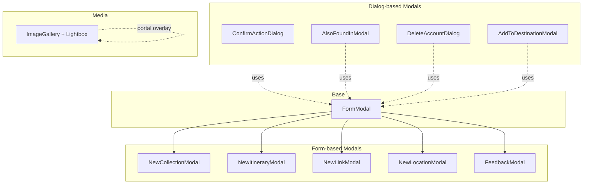
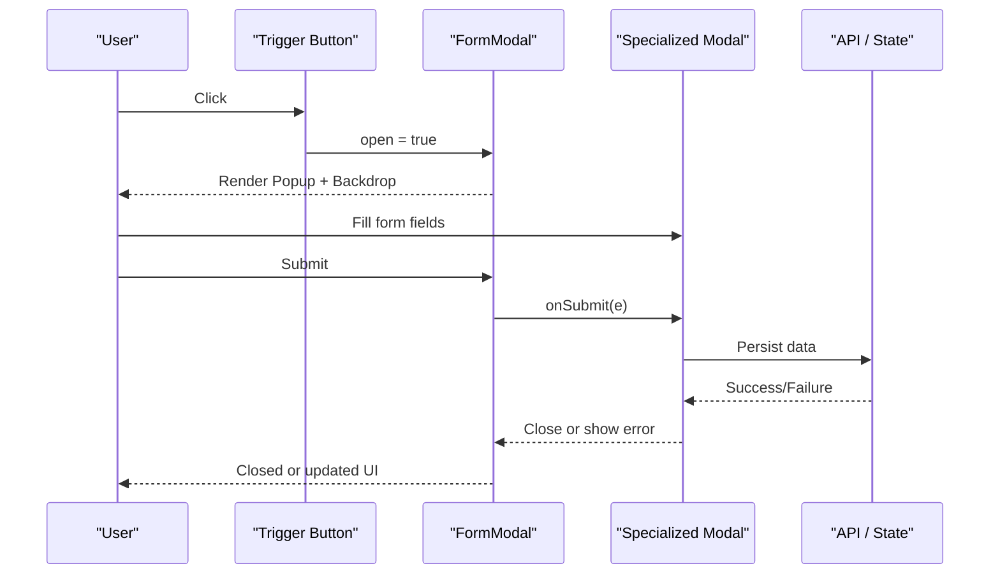
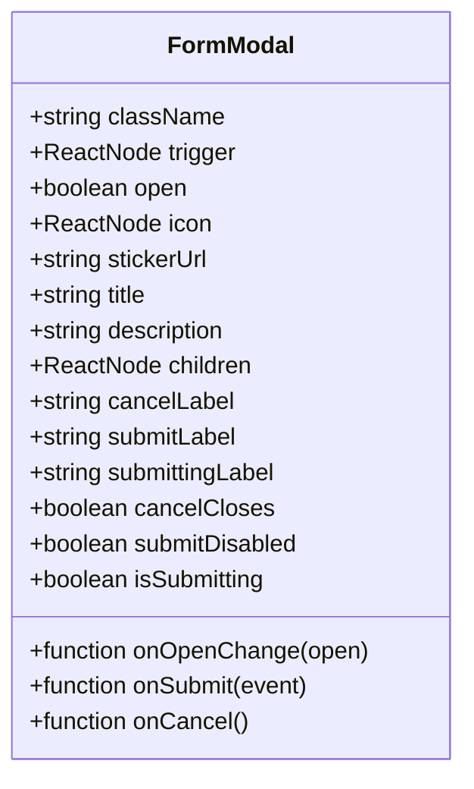
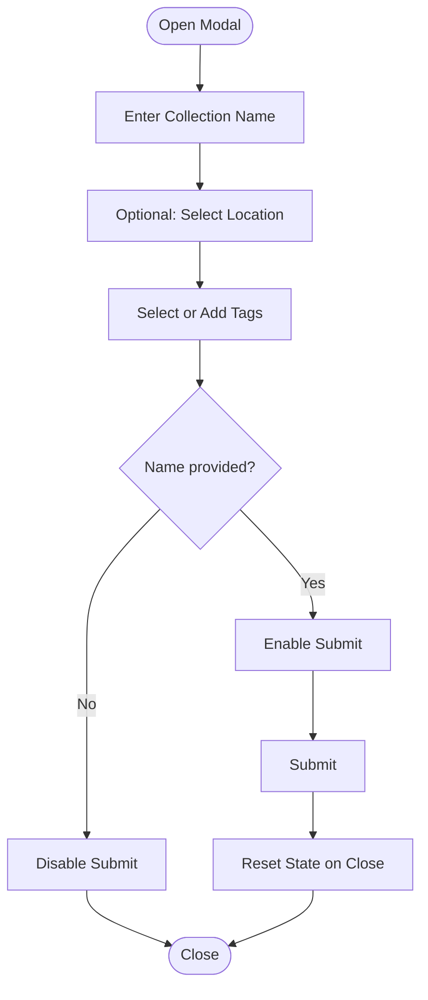
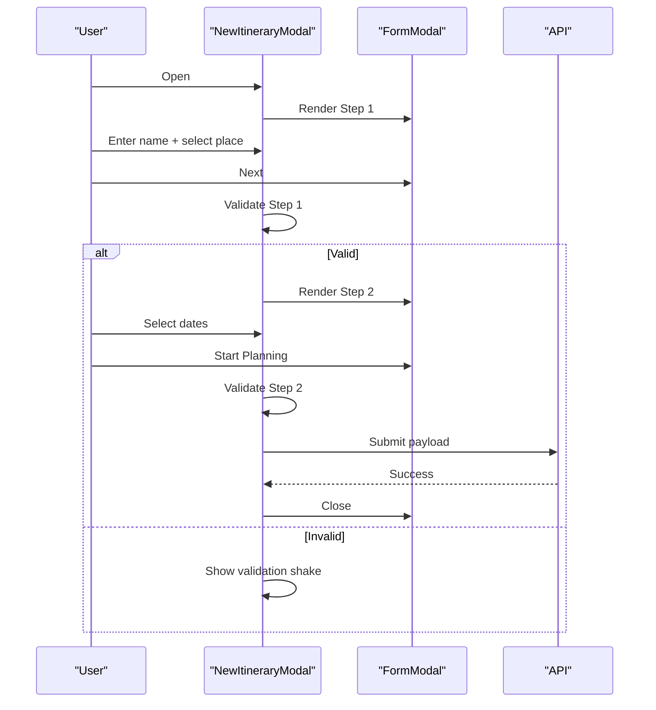
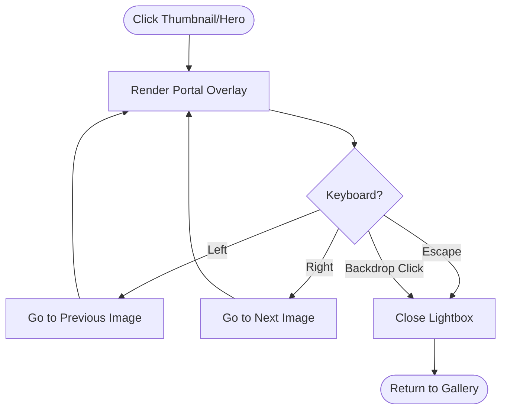
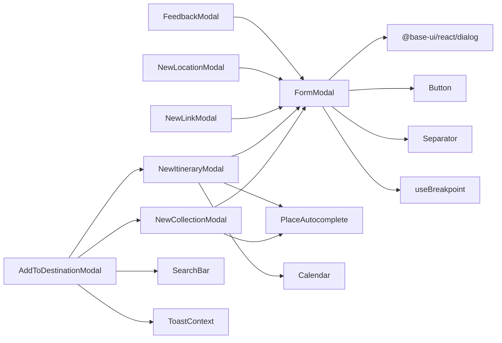

# Modal Components

<cite>
**Referenced Files in This Document**
- [FormModal.tsx](file://src/components/ui/modals/FormModal.tsx)
- [NewCollectionModal.tsx](file://src/components/ui/modals/NewCollectionModal.tsx)
- [NewItineraryModal.tsx](file://src/components/ui/modals/NewItineraryModal.tsx)
- [ConfirmActionDialog.tsx](file://src/components/ui/modals/ConfirmActionDialog.tsx)
- [ImageGallery.tsx](file://src/components/ui/modals/ImageGallery.tsx)
- [AddToDestinationModal.tsx](file://src/components/ui/modals/AddToDestinationModal.tsx)
- [AlsoFoundInModal.tsx](file://src/components/ui/modals/AlsoFoundInModal.tsx)
- [DeleteAccountDialog.tsx](file://src/components/ui/modals/DeleteAccountDialog.tsx)
- [FeedbackModal.tsx](file://src/components/ui/modals/FeedbackModal.tsx)
- [NewLinkModal.tsx](file://src/components/ui/modals/NewLinkModal.tsx)
- [NewLocationModal.tsx](file://src/components/ui/modals/NewLocationModal.tsx)
- [useModalAnimation.ts](file://src/hooks/useModalAnimation.ts)
</cite>

## Table of Contents
1. [Introduction](#introduction)
2. [Project Structure](#project-structure)
3. [Core Components](#core-components)
4. [Architecture Overview](#architecture-overview)
5. [Detailed Component Analysis](#detailed-component-analysis)
6. [Dependency Analysis](#dependency-analysis)
7. [Performance Considerations](#performance-considerations)
8. [Troubleshooting Guide](#troubleshooting-guide)
9. [Conclusion](#conclusion)
10. [Appendices](#appendices)

## Introduction
This document explains the modal and dialog component system used across the application. It focuses on:
- The FormModal base component and how specialized modals compose it
- Dialog-only components for confirmations and listings
- Image gallery lightbox behavior
- Modal composition patterns, form integration, keyboard navigation, focus management, and backdrop behavior
- Guidelines for creating custom modals, handling modal state, and implementing accessible interactions
- Best practices for modal hierarchy and user experience

## Project Structure
The modal system lives under src/components/ui/modals and is built with a shared base (FormModal) plus specialized modals that either extend the base or use the underlying Dialog primitives directly. A separate image lightbox provides full-screen browsing.

**Diagram sources**
- [FormModal.tsx:1-224](file://src/components/ui/modals/FormModal.tsx#L1-L224)
- [NewCollectionModal.tsx:1-226](file://src/components/ui/modals/NewCollectionModal.tsx#L1-L226)
- [NewItineraryModal.tsx:1-286](file://src/components/ui/modals/NewItineraryModal.tsx#L1-L286)
- [ConfirmActionDialog.tsx:1-129](file://src/components/ui/modals/ConfirmActionDialog.tsx#L1-L129)
- [ImageGallery.tsx:1-259](file://src/components/ui/modals/ImageGallery.tsx#L1-L259)
- [AddToDestinationModal.tsx:1-343](file://src/components/ui/modals/AddToDestinationModal.tsx#L1-L343)
- [AlsoFoundInModal.tsx:1-134](file://src/components/ui/modals/AlsoFoundInModal.tsx#L1-L134)
- [DeleteAccountDialog.tsx:1-279](file://src/components/ui/modals/DeleteAccountDialog.tsx#L1-L279)
- [FeedbackModal.tsx:1-303](file://src/components/ui/modals/FeedbackModal.tsx#L1-L303)
- [NewLinkModal.tsx:1-136](file://src/components/ui/modals/NewLinkModal.tsx#L1-L136)
- [NewLocationModal.tsx:1-99](file://src/components/ui/modals/NewLocationModal.tsx#L1-L99)

**Section sources**
- [FormModal.tsx:1-224](file://src/components/ui/modals/FormModal.tsx#L1-L224)
- [ImageGallery.tsx:1-259](file://src/components/ui/modals/ImageGallery.tsx#L1-L259)

## Core Components
- FormModal: A reusable form-backed modal with consistent header, icon/sticker area, description, content slot, and button row. It supports mobile sheet mode, submit/cancel flows, and submitting states.
- NewCollectionModal: Creates a collection with name, optional location, and tags. Integrates with PlaceAutocomplete and tag selection UI.
- NewItineraryModal: Two-step wizard to plan an itinerary (name/location then dates/AI toggle). Validates per step and submits aggregated data.
- ConfirmActionDialog: A simple confirmation dialog with title, message, and confirm/cancel actions.
- ImageGallery: Displays hero image and thumbnails; opens a full-screen lightbox with keyboard navigation and backdrop dismissal.
- Additional dialogs: AlsoFoundInModal, DeleteAccountDialog, AddToDestinationModal, FeedbackModal, NewLinkModal, NewLocationModal demonstrate various modal patterns (lists, destructive actions, creation flows, feedback forms).

Key behaviors:
- Backdrop: Semi-transparent overlay closes on click where supported by the underlying Dialog.Backdrop or custom overlays.
- Focus: Base Dialog primitives manage focus trapping within the popup; some components add additional keyboard handlers (e.g., lightbox arrows and Escape).
- Mobile: FormModal switches to a bottom sheet layout on small screens.

**Section sources**
- [FormModal.tsx:50-224](file://src/components/ui/modals/FormModal.tsx#L50-L224)
- [NewCollectionModal.tsx:22-226](file://src/components/ui/modals/NewCollectionModal.tsx#L22-L226)
- [NewItineraryModal.tsx:16-286](file://src/components/ui/modals/NewItineraryModal.tsx#L16-L286)
- [ConfirmActionDialog.tsx:11-77](file://src/components/ui/modals/ConfirmActionDialog.tsx#L11-L77)
- [ImageGallery.tsx:9-259](file://src/components/ui/modals/ImageGallery.tsx#L9-L259)

## Architecture Overview
The system follows a layered approach:
- Base layer: Dialog primitives from @base-ui/react/dialog provide accessibility, portal, backdrop, and focus management.
- Composition layer: FormModal encapsulates common form modal UX and styling.
- Feature layer: Specialized modals implement business logic and compose FormModal or Dialog primitives.
- Media layer: ImageGallery renders a portal-based lightbox overlay with its own keyboard handling.

**Diagram sources**
- [FormModal.tsx:100-217](file://src/components/ui/modals/FormModal.tsx#L100-L217)
- [NewCollectionModal.tsx:118-135](file://src/components/ui/modals/NewCollectionModal.tsx#L118-L135)
- [NewItineraryModal.tsx:118-160](file://src/components/ui/modals/NewItineraryModal.tsx#L118-L160)

## Detailed Component Analysis

### FormModal
Responsibilities:
- Wraps Dialog.Root/Portal/Popup/Backdrop
- Provides consistent header, icon/sticker, description, separator, content slot, and button group
- Supports mobile sheet mode via breakpoint hook
- Handles submitting state and disabled controls during submission
- Exposes cancelCloses to allow wizard-like back behavior

Accessibility:
- Uses Dialog.Title and Dialog.Description for semantic headings and descriptions
- Backdrop and popup structure ensure proper focus containment via Dialog primitives

Mobile behavior:
- Detects phone viewport and applies bottom-sheet styles, safe-area padding, and minimum height for inputs

**Diagram sources**
- [FormModal.tsx:50-76](file://src/components/ui/modals/FormModal.tsx#L50-L76)

**Section sources**
- [FormModal.tsx:100-217](file://src/components/ui/modals/FormModal.tsx#L100-L217)

### NewCollectionModal
Purpose: Create a new collection with name, optional location, and tags.

Key behaviors:
- Controlled/uncontrolled name input via props
- Tag selection from preset list and custom tags
- Location selection via PlaceAutocomplete
- Validation: requires a non-empty name before enabling submit
- Resets internal state when closed

Integration:
- Composes FormModal with variant and sticker
- Submits structured payload including optional coordinates and tags

**Diagram sources**
- [NewCollectionModal.tsx:66-135](file://src/components/ui/modals/NewCollectionModal.tsx#L66-L135)
- [NewCollectionModal.tsx:137-218](file://src/components/ui/modals/NewCollectionModal.tsx#L137-L218)

**Section sources**
- [NewCollectionModal.tsx:22-226](file://src/components/ui/modals/NewCollectionModal.tsx#L22-L226)

### NewItineraryModal
Purpose: Two-step wizard to create an itinerary with name/location and date range, plus AI recommendations toggle.

Key behaviors:
- Step 1 validates trip name and selected place; Step 2 validates date range
- Shaking animation highlights invalid fields
- Computes total days from selected range
- Tracks submission to avoid accidental close-after-submit confusion
- Resets all state on close

Integration:
- Composes FormModal with variant and sticker
- Submits structured payload including optional coordinates, dates, AI flag, and preselected location IDs

**Diagram sources**
- [NewItineraryModal.tsx:104-160](file://src/components/ui/modals/NewItineraryModal.tsx#L104-L160)
- [NewItineraryModal.tsx:162-278](file://src/components/ui/modals/NewItineraryModal.tsx#L162-L278)

**Section sources**
- [NewItineraryModal.tsx:16-286](file://src/components/ui/modals/NewItineraryModal.tsx#L16-L286)

### ConfirmActionDialog
Purpose: Present a confirmation prompt with a clear action and cancellation path.

Key behaviors:
- Uses Dialog primitives directly for portal/backdrop/popup
- Header includes warning icon and title
- Footer has Cancel and Confirm buttons
- Closes on backdrop or close button

Accessibility:
- Dialog primitives handle focus trapping and semantics

**Section sources**
- [ConfirmActionDialog.tsx:11-77](file://src/components/ui/modals/ConfirmActionDialog.tsx#L11-L77)

### ImageGallery and Lightbox
Purpose: Display a hero image and up to four thumbnail tiles; open a full-screen lightbox with keyboard navigation.

Key behaviors:
- Hero image at top; thumbnails below in two-column rows
- “+N more” overlay indicates additional images beyond visible thumbnails
- Lightbox renders via React Portal to body
- Keyboard: ArrowLeft/ArrowRight navigate images; Escape closes
- Backdrop dismisses lightbox on click
- Counter shows current index out of total

Accessibility:
- role="dialog" and aria-modal on lightbox container
- Descriptive alt text for images and buttons

**Diagram sources**
- [ImageGallery.tsx:45-155](file://src/components/ui/modals/ImageGallery.tsx#L45-L155)
- [ImageGallery.tsx:169-253](file://src/components/ui/modals/ImageGallery.tsx#L169-L253)

**Section sources**
- [ImageGallery.tsx:9-259](file://src/components/ui/modals/ImageGallery.tsx#L9-L259)

### Additional Dialogs and Patterns
- AlsoFoundInModal: Lists related collections/itineraries with loading and empty states; uses Dialog primitives.
- DeleteAccountDialog: Destructive action flow with impact summary, required confirmation phrase, and guarded closing during deletion.
- AddToDestinationModal: Destination picker with search, multi-select, and nested creation modals (NewCollectionModal/NewItineraryModal) stacked via portals.
- FeedbackModal: Rich form with message, image attachments (paste/file picker), and submission feedback.
- NewLinkModal and NewLocationModal: Simple single-field forms with URL validation and error display.

These illustrate:
- Stacking multiple modals safely using portals
- Guarding destructive actions until explicit confirmation
- Handling async operations and errors inside modals
- Providing informative empty/loading states

**Section sources**
- [AlsoFoundInModal.tsx:12-134](file://src/components/ui/modals/AlsoFoundInModal.tsx#L12-L134)
- [DeleteAccountDialog.tsx:17-279](file://src/components/ui/modals/DeleteAccountDialog.tsx#L17-L279)
- [AddToDestinationModal.tsx:35-343](file://src/components/ui/modals/AddToDestinationModal.tsx#L35-L343)
- [FeedbackModal.tsx:27-303](file://src/components/ui/modals/FeedbackModal.tsx#L27-L303)
- [NewLinkModal.tsx:12-136](file://src/components/ui/modals/NewLinkModal.tsx#L12-L136)
- [NewLocationModal.tsx:11-99](file://src/components/ui/modals/NewLocationModal.tsx#L11-L99)

## Dependency Analysis
- FormModal depends on:
  - @base-ui/react/dialog for accessible dialog primitives
  - class-variance-authority for variant styling
  - lucide-react icons
  - useBreakpoint for responsive behavior
  - primitives Button and Separator for UI elements
- Specialized modals depend on:
  - FormModal for consistent form modal shell
  - PlaceAutocomplete for location selection
  - Calendar for date ranges
  - Input/Pill/SearchBar for form controls
  - ToastContext for user feedback
  - Query client and API modules for data operations

**Diagram sources**
- [FormModal.tsx:1-11](file://src/components/ui/modals/FormModal.tsx#L1-L11)
- [NewCollectionModal.tsx:1-11](file://src/components/ui/modals/NewCollectionModal.tsx#L1-L11)
- [NewItineraryModal.tsx:1-14](file://src/components/ui/modals/NewItineraryModal.tsx#L1-L14)
- [AddToDestinationModal.tsx:1-22](file://src/components/ui/modals/AddToDestinationModal.tsx#L1-L22)

**Section sources**
- [FormModal.tsx:1-11](file://src/components/ui/modals/FormModal.tsx#L1-L11)
- [NewCollectionModal.tsx:1-11](file://src/components/ui/modals/NewCollectionModal.tsx#L1-L11)
- [NewItineraryModal.tsx:1-14](file://src/components/ui/modals/NewItineraryModal.tsx#L1-L14)
- [AddToDestinationModal.tsx:1-22](file://src/components/ui/modals/AddToDestinationModal.tsx#L1-L22)

## Performance Considerations
- Prefer controlled open/onOpenChange for predictable state management in parent components
- Avoid heavy computations inside modal render; memoize derived values (e.g., date displays)
- Use portals judiciously; only one lightbox/modal should be active at a time to reduce reflows
- Debounce or throttle expensive operations like autocomplete queries if added later
- Keep modal content minimal; lazy-load heavy components when possible

[No sources needed since this section provides general guidance]

## Troubleshooting Guide
Common issues and resolutions:
- Modal not closing: Ensure onOpenChange is wired to Dialog.Close or backdrop; check for blocking conditions (e.g., deleting state in destructive dialogs)
- Form submit disabled unexpectedly: Verify required fields are valid and not blocked by isLoading/isSubmitting flags
- Keyboard navigation not working in lightbox: Ensure lightbox is mounted and event listeners are attached; verify no other keydown handlers intercept events
- Focus trap not working: Confirm Dialog primitives are used correctly and no external overlays break focus containment
- Errors surfaced to users: Use friendly messages and associate them with inputs via aria-describedby and role="alert"

**Section sources**
- [DeleteAccountDialog.tsx:101-137](file://src/components/ui/modals/DeleteAccountDialog.tsx#L101-L137)
- [NewLinkModal.tsx:56-81](file://src/components/ui/modals/NewLinkModal.tsx#L56-L81)
- [ImageGallery.tsx:72-85](file://src/components/ui/modals/ImageGallery.tsx#L72-L85)

## Conclusion
The modal system provides a consistent, accessible, and extensible foundation:
- FormModal standardizes form-driven modals with strong UX patterns
- Specialized modals compose FormModal or Dialog primitives to meet specific needs
- ImageGallery offers a robust lightbox with keyboard support
- Patterns demonstrated include wizards, destructive confirmations, rich forms, and nested creation flows
Adhering to these patterns ensures consistency, accessibility, and maintainability across the application.

[No sources needed since this section summarizes without analyzing specific files]

## Appendices

### Creating a Custom Modal
Steps:
- Choose base:
  - Use FormModal for form-driven experiences
  - Use Dialog primitives directly for informational or confirmation dialogs
- Manage state:
  - Control open/onOpenChange from parent
  - Reset internal state on close to avoid stale data
- Integrate forms:
  - Use Input, PlaceAutocomplete, Calendar as needed
  - Validate inputs and surface errors with aria-describedby and alerts
- Handle submissions:
  - Set isSubmitting to disable controls and show loading state
  - Provide success/error feedback via toast or inline messages
- Accessibility:
  - Ensure titles and descriptions are present
  - Use Dialog primitives for focus trapping and semantics
  - For custom overlays (like lightboxes), add role="dialog", aria-modal, and keyboard handlers

Guidelines:
- Keep modals focused on a single task
- Use progressive disclosure (multi-step) for complex tasks
- Provide clear cancel/close paths
- Respect mobile layouts (bottom sheets where appropriate)
- Avoid stacking too many modals; prefer nested creation flows only when necessary

[No sources needed since this section provides general guidance]