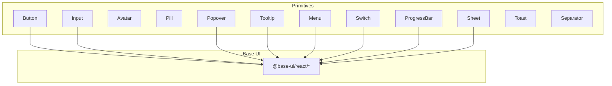
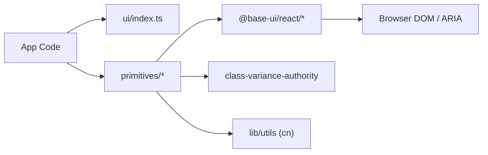
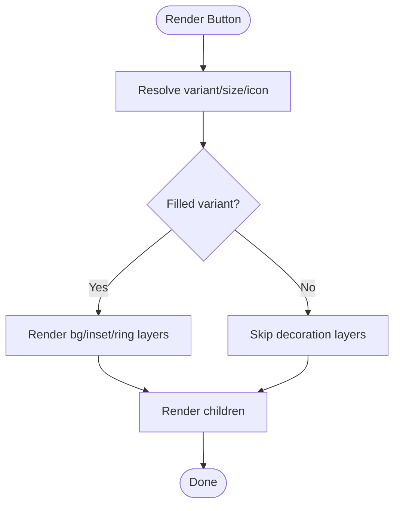
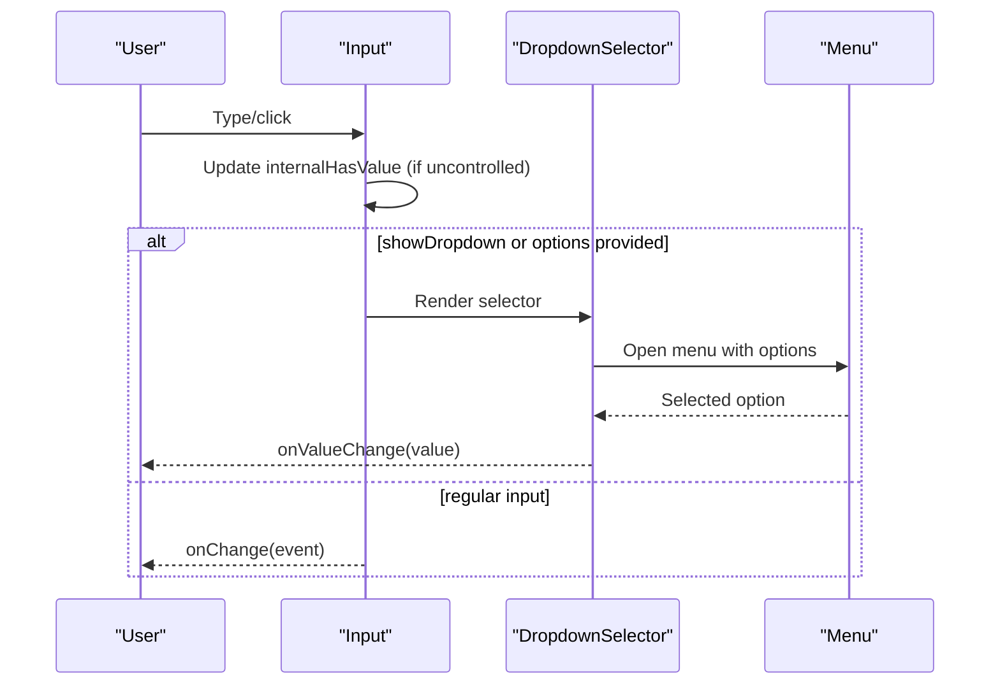
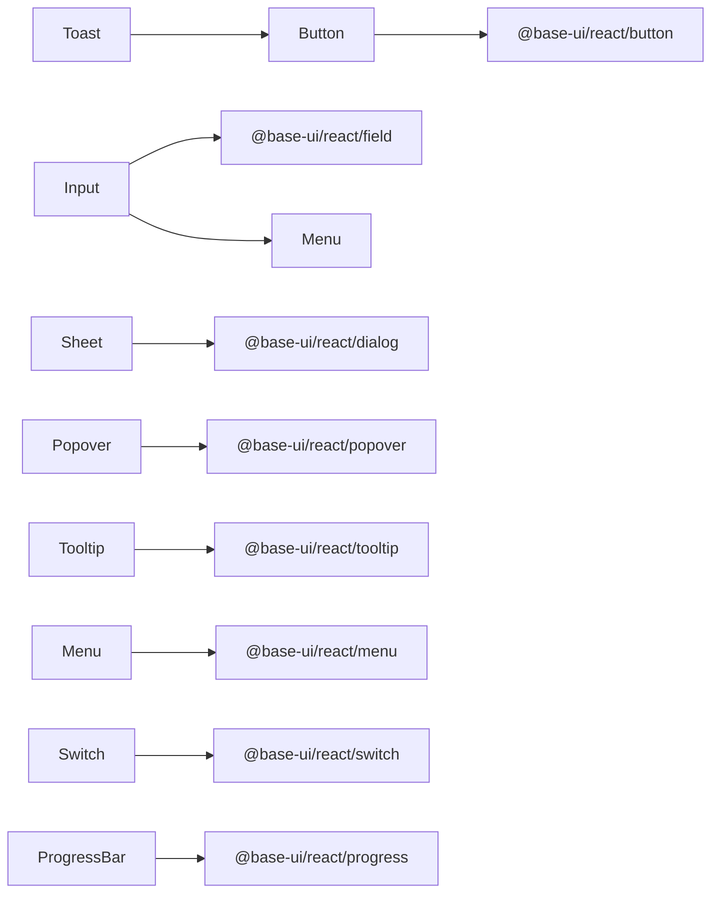

# Primitive Components

<cite>
**Referenced Files in This Document**
- [Button.tsx](file://src/components/ui/primitives/Button.tsx)
- [Input.tsx](file://src/components/ui/primitives/Input.tsx)
- [Avatar.tsx](file://src/components/ui/primitives/Avatar.tsx)
- [Pill.tsx](file://src/components/ui/primitives/Pill.tsx)
- [Sheet.tsx](file://src/components/ui/primitives/Sheet.tsx)
- [Popover.tsx](file://src/components/ui/primitives/Popover.tsx)
- [Switch.tsx](file://src/components/ui/primitives/Switch.tsx)
- [Tooltip.tsx](file://src/components/ui/primitives/Tooltip.tsx)
- [Menu.tsx](file://src/components/ui/primitives/Menu.tsx)
- [ProgressBar.tsx](file://src/components/ui/primitives/ProgressBar.tsx)
- [Toast.tsx](file://src/components/ui/primitives/Toast.tsx)
- [Separator.tsx](file://src/components/ui/primitives/Separator.tsx)
- [index.ts](file://src/components/ui/index.ts)
</cite>

## Table of Contents
1. Introduction
2. Project Structure
3. Core Components
4. Architecture Overview
5. Detailed Component Analysis
6. Dependency Analysis
7. Performance Considerations
8. Troubleshooting Guide
9. Conclusion
10. Appendices

## Introduction
This document explains the primitive component system that forms the foundation of the UI layer. It covers foundational building blocks such as Button, Input, Modal-like Sheet, Avatar, Pill, and other primitives like Popover, Tooltip, Menu, Switch, ProgressBar, Toast, and Separator. For each component you will find:
- Prop interfaces and variants
- Usage patterns and examples (described conceptually)
- Styling customization options via class names and tokens
- Accessibility considerations baked into the components
- Design principles guiding consistency across the library

The primitives are built on Base UI primitives for robust behavior (focus management, keyboard navigation, ARIA), with styling composed through class-variance-authority and utility classes.

## Project Structure
Primitive components live under src/components/ui/primitives. Each file encapsulates a single concern (e.g., Button, Input, Popover). A barrel at src/components/ui/index.ts re-exports a curated subset for convenient imports elsewhere in the app.

**Diagram sources**
- [Button.tsx:1-132](file://src/components/ui/primitives/Button.tsx#L1-L132)
- [Input.tsx:1-513](file://src/components/ui/primitives/Input.tsx#L1-L513)
- [Popover.tsx:1-200](file://src/components/ui/primitives/Popover.tsx#L1-L200)
- [Tooltip.tsx:1-185](file://src/components/ui/primitives/Tooltip.tsx#L1-L185)
- [Menu.tsx:1-384](file://src/components/ui/primitives/Menu.tsx#L1-L384)
- [Switch.tsx:1-104](file://src/components/ui/primitives/Switch.tsx#L1-L104)
- [ProgressBar.tsx:1-66](file://src/components/ui/primitives/ProgressBar.tsx#L1-L66)
- [Sheet.tsx:1-97](file://src/components/ui/primitives/Sheet.tsx#L1-L97)

**Section sources**
- [index.ts:1-46](file://src/components/ui/index.ts#L1-L46)

## Core Components
Below is a concise overview of each primitive’s purpose, props, variants, styling hooks, and accessibility notes.

- Button
  - Purpose: Primary interactive action with multiple visual styles and sizes.
  - Props: variant (primary, secondary, ghost, outline, dark), size (xs, sm, md), icon placement (none, leading, trailing, only), plus all base button attributes.
  - Styling: Uses CVA variants; supports custom className; layered decoration for filled variants (background, inset bevel, border ring).
  - Accessibility: Focus-visible ring, disabled state, semantic button element.
  - Section sources
    - [Button.tsx:9-42](file://src/components/ui/primitives/Button.tsx#L9-L42)
    - [Button.tsx:44-67](file://src/components/ui/primitives/Button.tsx#L44-L67)
    - [Button.tsx:69-132](file://src/components/ui/primitives/Button.tsx#L69-L132)

- Input
  - Purpose: Text input with optional leading/trailing icons, clear button, and dropdown selector mode.
  - Props: variant (default, underline), size (sm, md), icon slots, controlled/uncontrolled value, clearable, onClear, aria-invalid, plus field control attributes.
  - Styling: Asymmetric padding based on icon presence; focus states; inner shadow when hasValue; underline variant for minimal look.
  - Accessibility: aria-invalid support; clear button with aria-label; keyboard-friendly.
  - Section sources
    - [Input.tsx:11-70](file://src/components/ui/primitives/Input.tsx#L11-L70)
    - [Input.tsx:93-123](file://src/components/ui/primitives/Input.tsx#L93-L123)
    - [Input.tsx:125-276](file://src/components/ui/primitives/Input.tsx#L125-L276)

- DropdownSelector (part of Input module)
  - Purpose: Selects from a list or acts as a presentational trigger.
  - Props: value/defaultValue, placeholder, options array, onValueChange, menuClassName, icon slots, aria-invalid.
  - Behavior: When options provided, opens a Base UI Menu; otherwise renders a styled button.
  - Section sources
    - [Input.tsx:284-405](file://src/components/ui/primitives/Input.tsx#L284-L405)

- AddToInput (part of Input module)
  - Purpose: Input with fixed leading and trailing slots (always both).
  - Props: value/defaultValue, icon, trailingIcon, size, aria-invalid.
  - Section sources
    - [Input.tsx:411-503](file://src/components/ui/primitives/Input.tsx#L411-L503)

- Avatar
  - Purpose: Displays user identity via initials, image, or icon.
  - Props: name, src, alt, initials, type (initial, image, icon), size (sm, md, lg), icon override.
  - Styling: Rounded full, size-driven typography, hover/active opacity transitions.
  - Accessibility: Image alt text; defaults to accessible label fallback.
  - Section sources
    - [Avatar.tsx:9-31](file://src/components/ui/primitives/Avatar.tsx#L9-L31)
    - [Avatar.tsx:40-53](file://src/components/ui/primitives/Avatar.tsx#L40-L53)
    - [Avatar.tsx:83-127](file://src/components/ui/primitives/Avatar.tsx#L83-L127)

- Pill
  - Purpose: Tag-like selectable chip with optional leading icon and remove action.
  - Props: type (default, selected, input), leadingIcon, onClick, onRemove, disabled.
  - Styling: Rounded-full, focus-visible ring, selected state with brand colors and inset shadows.
  - Accessibility: role="checkbox", aria-checked for selected; remove button with aria-label.
  - Section sources
    - [Pill.tsx:8-34](file://src/components/ui/primitives/Pill.tsx#L8-L34)
    - [Pill.tsx:36-43](file://src/components/ui/primitives/Pill.tsx#L36-L43)
    - [Pill.tsx:45-87](file://src/components/ui/primitives/Pill.tsx#L45-L87)

- Sheet (Modal-like overlay)
  - Purpose: Responsive overlay panel (bottom sheet on phone, side drawer on tablet+).
  - Props: open, onOpenChange, side (bottom, left, right), title, description, children, trigger, className.
  - Behavior: Backdrop-dismiss, focus trap, scroll lock via Base UI Dialog; responsive side resolution.
  - Accessibility: sr-only title/description; proper dialog semantics.
  - Section sources
    - [Sheet.tsx:10-28](file://src/components/ui/primitives/Sheet.tsx#L10-L28)
    - [Sheet.tsx:30-48](file://src/components/ui/primitives/Sheet.tsx#L30-L48)
    - [Sheet.tsx:57-97](file://src/components/ui/primitives/Sheet.tsx#L57-L97)

- Popover
  - Purpose: Floating content anchored to a trigger with optional arrow and collision handling.
  - Props: Trigger (openOnHover, delay), Content (side, align, sideOffset, arrow, collisionPadding, anchor).
  - Styling: Surface, border, rounded-xl, shadow-default; directional arrow SVG.
  - Accessibility: Focus ring; portal-based positioning.
  - Section sources
    - [Popover.tsx:16-31](file://src/components/ui/primitives/Popover.tsx#L16-L31)
    - [Popover.tsx:57-88](file://src/components/ui/primitives/Popover.tsx#L57-L88)
    - [Popover.tsx:97-200](file://src/components/ui/primitives/Popover.tsx#L97-L200)

- Tooltip
  - Purpose: Contextual hint bubble with consistent timing and arrow.
  - Props: Provider (delay, closeDelay), Trigger, Content (side, align, sideOffset).
  - Styling: Surface, border, rounded-lg, shadow-default; directional arrow SVG.
  - Accessibility: Portal-based; respects motion preferences.
  - Section sources
    - [Tooltip.tsx:15-37](file://src/components/ui/primitives/Tooltip.tsx#L15-L37)
    - [Tooltip.tsx:63-88](file://src/components/ui/primitives/Tooltip.tsx#L63-L88)
    - [Tooltip.tsx:98-185](file://src/components/ui/primitives/Tooltip.tsx#L98-L185)

- Menu
  - Purpose: Accessible dropdown menu with items, separators, and descriptive items.
  - Props: Root/Trigger/Content (align, side, sideOffset, positionerClassName), MenuItem (size, icon, variant, selected), DescriptiveMenuItem (title, description, leadingIcon).
  - Styling: Surface, border, rounded-2xl, shadow-default; item states and icon spacing.
  - Accessibility: Keyboard navigation, focus management via Base UI.
  - Section sources
    - [Menu.tsx:16-86](file://src/components/ui/primitives/Menu.tsx#L16-L86)
    - [Menu.tsx:111-124](file://src/components/ui/primitives/Menu.tsx#L111-L124)
    - [Menu.tsx:130-183](file://src/components/ui/primitives/Menu.tsx#L130-L183)
    - [Menu.tsx:192-384](file://src/components/ui/primitives/Menu.tsx#L192-L384)

- Switch
  - Purpose: Toggle control with two sizes and branded checked state.
  - Props: size (sm, md), checked/defaultChecked, onCheckedChange, disabled, name, label.
  - Styling: Track bevel, thumb transition, focus-visible ring.
  - Accessibility: aria-label via label prop; keyboard operable via Base UI.
  - Section sources
    - [Switch.tsx:9-35](file://src/components/ui/primitives/Switch.tsx#L9-L35)
    - [Switch.tsx:37-45](file://src/components/ui/primitives/Switch.tsx#L37-L45)
    - [Switch.tsx:47-104](file://src/components/ui/primitives/Switch.tsx#L47-L104)

- ProgressBar
  - Purpose: Linear progress indicator with optional label and auto-fill animation.
  - Props: value, max, label, formatLabel, showLabel, autoFill, labelClassName.
  - Styling: Track with inset shadow; pill-shaped fill with brand/info token colors.
  - Accessibility: Semantic progress root; tabular numbers for values.
  - Section sources
    - [ProgressBar.tsx:7-18](file://src/components/ui/primitives/ProgressBar.tsx#L7-L18)
    - [ProgressBar.tsx:20-66](file://src/components/ui/primitives/ProgressBar.tsx#L20-L66)

- Toast
  - Purpose: Dismissible notification with optional thumbnail, description, action, and auto-dismiss progress bar.
  - Props: Consumes global toast context; container renders per-toast properties (variant, thumbnail, description, action, duration).
  - Styling: Card with subtle borders/shadows; animated entrance/exit; progress drain bar.
  - Accessibility: aria-live regions; role="alert" for errors; pause/resume on hover.
  - Section sources
    - [Toast.tsx:13-45](file://src/components/ui/primitives/Toast.tsx#L13-L45)
    - [Toast.tsx:47-174](file://src/components/ui/primitives/Toast.tsx#L47-L174)

- Separator
  - Purpose: Visual divider with horizontal or vertical orientation.
  - Props: orientation (horizontal, vertical), className.
  - Styling: 1px rule using edge token; padded hit area wrapper.
  - Accessibility: Semantic separator via Base UI.
  - Section sources
    - [Separator.tsx:7-35](file://src/components/ui/primitives/Separator.tsx#L7-L35)
    - [Separator.tsx:41-68](file://src/components/ui/primitives/Separator.tsx#L41-L68)

## Architecture Overview
The primitives follow a consistent architecture:
- Behavior layer: Base UI primitives provide robust, accessible interactions (Dialog, Popover, Tooltip, Menu, Switch, Progress, Field).
- Styling layer: class-variance-authority defines variants and compound variants; utility classes compose layout, color, and motion.
- Composition layer: Primitives combine Base UI + CVA + utility classes to produce reusable, theme-aware components.
- Integration: Consumers import directly from subpaths or via the ui barrel.

**Diagram sources**
- [index.ts:1-46](file://src/components/ui/index.ts#L1-L46)
- [Button.tsx:1-132](file://src/components/ui/primitives/Button.tsx#L1-L132)
- [Input.tsx:1-513](file://src/components/ui/primitives/Input.tsx#L1-L513)
- [Popover.tsx:1-200](file://src/components/ui/primitives/Popover.tsx#L1-L200)
- [Tooltip.tsx:1-185](file://src/components/ui/primitives/Tooltip.tsx#L1-L185)
- [Menu.tsx:1-384](file://src/components/ui/primitives/Menu.tsx#L1-L384)
- [Switch.tsx:1-104](file://src/components/ui/primitives/Switch.tsx#L1-L104)
- [ProgressBar.tsx:1-66](file://src/components/ui/primitives/ProgressBar.tsx#L1-L66)
- [Sheet.tsx:1-97](file://src/components/ui/primitives/Sheet.tsx#L1-L97)

## Detailed Component Analysis

### Button
- Variants: primary, secondary, ghost, outline, dark; sizes xs/sm/md; icon placement none/leading/trailing/only.
- Decoration: Filled variants use layered spans for background, inset bevel, and top border ring to keep edges crisp.
- Customization: Pass className to extend; leverage CVA variants for standard changes.
- Accessibility: Focus-visible ring, disabled state, native button semantics.

**Diagram sources**
- [Button.tsx:9-42](file://src/components/ui/primitives/Button.tsx#L9-L42)
- [Button.tsx:44-67](file://src/components/ui/primitives/Button.tsx#L44-L67)
- [Button.tsx:76-132](file://src/components/ui/primitives/Button.tsx#L76-L132)

**Section sources**
- [Button.tsx:9-42](file://src/components/ui/primitives/Button.tsx#L9-L42)
- [Button.tsx:44-67](file://src/components/ui/primitives/Button.tsx#L44-L67)
- [Button.tsx:69-132](file://src/components/ui/primitives/Button.tsx#L69-L132)

### Input, DropdownSelector, AddToInput
- Input: Controlled/uncontrolled value, clearable, icon slots, variants default/underline, sizes sm/md.
- DropdownSelector: Options-driven selection with Base UI Menu; falls back to presentational button if no options.
- AddToInput: Always both icon slots; symmetric padding; controlled/uncontrolled value.

**Diagram sources**
- [Input.tsx:125-276](file://src/components/ui/primitives/Input.tsx#L125-L276)
- [Input.tsx:284-405](file://src/components/ui/primitives/Input.tsx#L284-L405)

**Section sources**
- [Input.tsx:11-70](file://src/components/ui/primitives/Input.tsx#L11-L70)
- [Input.tsx:93-123](file://src/components/ui/primitives/Input.tsx#L93-L123)
- [Input.tsx:125-276](file://src/components/ui/primitives/Input.tsx#L125-L276)
- [Input.tsx:284-405](file://src/components/ui/primitives/Input.tsx#L284-L405)
- [Input.tsx:411-503](file://src/components/ui/primitives/Input.tsx#L411-L503)

### Avatar
- Modes: initial (name-derived initials), image (src/alt), icon (customizable Lucide icon).
- Sizes: sm/md/lg with corresponding typography and icon sizing.
- Accessibility: Alt text for images; initials fallback.

**Section sources**
- [Avatar.tsx:9-31](file://src/components/ui/primitives/Avatar.tsx#L9-L31)
- [Avatar.tsx:40-53](file://src/components/ui/primitives/Avatar.tsx#L40-L53)
- [Avatar.tsx:83-127](file://src/components/ui/primitives/Avatar.tsx#L83-L127)

### Pill
- Types: default, selected, input; supports leadingIcon and removable X.
- Accessibility: role="checkbox", aria-checked for selected; remove button aria-label.

**Section sources**
- [Pill.tsx:8-34](file://src/components/ui/primitives/Pill.tsx#L8-L34)
- [Pill.tsx:36-43](file://src/components/ui/primitives/Pill.tsx#L36-L43)
- [Pill.tsx:45-87](file://src/components/ui/primitives/Pill.tsx#L45-L87)

### Sheet (Modal-like)
- Behavior: Backdrop-dismiss, focus trap, scroll lock via Base UI Dialog; responsive side (bottom/right/left).
- Accessibility: sr-only title/description; proper dialog semantics.

**Section sources**
- [Sheet.tsx:10-28](file://src/components/ui/primitives/Sheet.tsx#L10-L28)
- [Sheet.tsx:30-48](file://src/components/ui/primitives/Sheet.tsx#L30-L48)
- [Sheet.tsx:57-97](file://src/components/ui/primitives/Sheet.tsx#L57-L97)

### Popover
- Features: Hover/focus triggers, configurable alignment/side/offset, collision padding, optional arrow.
- Styling: Surface, border, rounded-xl, shadow-default; arrow SVG rotates by side.

**Section sources**
- [Popover.tsx:16-31](file://src/components/ui/primitives/Popover.tsx#L16-L31)
- [Popover.tsx:57-88](file://src/components/ui/primitives/Popover.tsx#L57-L88)
- [Popover.tsx:97-200](file://src/components/ui/primitives/Popover.tsx#L97-L200)

### Tooltip
- Features: Global provider for consistent delays; trigger/content composition; arrow.
- Styling: Surface, border, rounded-lg, shadow-default; arrow SVG rotates by side.

**Section sources**
- [Tooltip.tsx:15-37](file://src/components/ui/primitives/Tooltip.tsx#L15-L37)
- [Tooltip.tsx:63-88](file://src/components/ui/primitives/Tooltip.tsx#L63-L88)
- [Tooltip.tsx:98-185](file://src/components/ui/primitives/Tooltip.tsx#L98-L185)

### Menu
- Items: Standard and descriptive items; separators; icon axes (none/leading/trailing/both); sizes; destructive variant.
- Positioning: Align, side, sideOffset, collisionPadding; z-index via positionerClassName.

**Section sources**
- [Menu.tsx:16-86](file://src/components/ui/primitives/Menu.tsx#L16-L86)
- [Menu.tsx:111-124](file://src/components/ui/primitives/Menu.tsx#L111-L124)
- [Menu.tsx:130-183](file://src/components/ui/primitives/Menu.tsx#L130-L183)
- [Menu.tsx:192-384](file://src/components/ui/primitives/Menu.tsx#L192-L384)

### Switch
- Sizes: sm/md with precise track/thumb dimensions and travel distances.
- States: Checked/unchecked with brand/bevel tokens; focus-visible ring.

**Section sources**
- [Switch.tsx:9-35](file://src/components/ui/primitives/Switch.tsx#L9-L35)
- [Switch.tsx:37-45](file://src/components/ui/primitives/Switch.tsx#L37-L45)
- [Switch.tsx:47-104](file://src/components/ui/primitives/Switch.tsx#L47-L104)

### ProgressBar
- Modes: Manual width transition or auto-fill animation; clamped value; optional label formatting.
- Styling: Track with inset shadow; pill-shaped fill with info token colors.

**Section sources**
- [ProgressBar.tsx:7-18](file://src/components/ui/primitives/ProgressBar.tsx#L7-L18)
- [ProgressBar.tsx:20-66](file://src/components/ui/primitives/ProgressBar.tsx#L20-L66)

### Toast
- Features: Thumbnail, description, action button, auto-dismiss with progress drain; pause/resume on hover.
- Accessibility: aria-live regions; role="alert" for error variant.

**Section sources**
- [Toast.tsx:13-45](file://src/components/ui/primitives/Toast.tsx#L13-L45)
- [Toast.tsx:47-174](file://src/components/ui/primitives/Toast.tsx#L47-L174)

### Separator
- Orientation: Horizontal or vertical; 1px rule with edge token; padded hit area.

**Section sources**
- [Separator.tsx:7-35](file://src/components/ui/primitives/Separator.tsx#L7-L35)
- [Separator.tsx:41-68](file://src/components/ui/primitives/Separator.tsx#L41-L68)

## Dependency Analysis
- Base UI dependency: All primitives rely on @base-ui/react for accessible behaviors (Dialog, Popover, Tooltip, Menu, Switch, Progress, Field).
- Styling dependencies: class-variance-authority for variants; utility classes for layout and tokens; cn helper for class merging.
- Internal dependencies: Some primitives depend on others (e.g., Toast uses Button; Input uses Menu).

**Diagram sources**
- [Button.tsx:1-132](file://src/components/ui/primitives/Button.tsx#L1-L132)
- [Input.tsx:1-513](file://src/components/ui/primitives/Input.tsx#L1-L513)
- [Sheet.tsx:1-97](file://src/components/ui/primitives/Sheet.tsx#L1-L97)
- [Popover.tsx:1-200](file://src/components/ui/primitives/Popover.tsx#L1-L200)
- [Tooltip.tsx:1-185](file://src/components/ui/primitives/Tooltip.tsx#L1-L185)
- [Menu.tsx:1-384](file://src/components/ui/primitives/Menu.tsx#L1-L384)
- [Switch.tsx:1-104](file://src/components/ui/primitives/Switch.tsx#L1-L104)
- [ProgressBar.tsx:1-66](file://src/components/ui/primitives/ProgressBar.tsx#L1-L66)
- [Toast.tsx:1-174](file://src/components/ui/primitives/Toast.tsx#L1-L174)

**Section sources**
- [index.ts:1-46](file://src/components/ui/index.ts#L1-L46)

## Performance Considerations
- Prefer controlled inputs where possible to avoid unnecessary re-renders; Input tracks hasValue internally for uncontrolled usage.
- Use autoFill for ProgressBar animations to leverage CSS animations instead of JS loops.
- Avoid heavy child trees inside overlays (Sheet/Popover/Tooltip) to maintain smooth interactions.
- Leverage motion-reduce media queries respected by motion utilities to respect user preferences.

[No sources needed since this section provides general guidance]

## Troubleshooting Guide
- Input not clearing: Ensure clearable is true and onClear either updates state or clears the underlying input; check that hasValue reflects current value.
- DropdownSelector not opening: Provide options to enable Base UI Menu; otherwise it remains a presentational trigger.
- Sheet not trapping focus: Verify it is used within a Dialog context (provided by Sheet) and that trigger/open state is managed correctly.
- Tooltip/Popover positioning issues: Adjust sideOffset, align, and collisionPadding; ensure anchor is set if rendering in complex layouts.
- Menu items not focusing: Confirm MenuContent is rendered within a Menu and that items are direct children; verify z-index stacking via positionerClassName if needed.
- Toast not dismissing: Check duration and paused state; ensure ToastContainer is mounted and context is available.

**Section sources**
- [Input.tsx:125-276](file://src/components/ui/primitives/Input.tsx#L125-L276)
- [Input.tsx:284-405](file://src/components/ui/primitives/Input.tsx#L284-L405)
- [Sheet.tsx:57-97](file://src/components/ui/primitives/Sheet.tsx#L57-L97)
- [Popover.tsx:97-200](file://src/components/ui/primitives/Popover.tsx#L97-L200)
- [Menu.tsx:192-384](file://src/components/ui/primitives/Menu.tsx#L192-L384)
- [Toast.tsx:47-174](file://src/components/ui/primitives/Toast.tsx#L47-L174)

## Conclusion
The primitive component system provides a cohesive, accessible, and customizable foundation for the application’s UI. By combining Base UI’s robust behaviors with a consistent styling approach (CVA + utility classes), each primitive offers predictable APIs, clear customization points, and strong accessibility. Use these primitives as building blocks for higher-level components to maintain design consistency and reduce duplication across the codebase.

[No sources needed since this section summarizes without analyzing specific files]

## Appendices

### Extending Primitives Guidelines
- Keep variants aligned with design tokens (colors, sizes, spacing).
- Use className to extend rather than overriding internals; prefer compound variants for combinations.
- Maintain accessibility: preserve focus rings, roles, and ARIA attributes; test with keyboard and screen readers.
- Compose primitives: build complex UIs by composing primitives (e.g., Menu + Button + Tooltip) rather than creating monolithic components.
- Export types: always export TypeScript types alongside components for consumer safety.

[No sources needed since this section provides general guidance]