# Primitive Components

<cite>
**Referenced Files in This Document**
- [Button.tsx](file://src/components/ui/primitives/Button.tsx)
- [Input.tsx](file://src/components/ui/primitives/Input.tsx)
- [Avatar.tsx](file://src/components/ui/primitives/Avatar.tsx)
- [Breadcrumb.tsx](file://src/components/ui/primitives/Breadcrumb.tsx)
- [BaseCard.tsx](file://src/components/ui/cards/BaseCard.tsx)
- [Sheet.tsx](file://src/components/ui/primitives/Sheet.tsx)
- [Menu.tsx](file://src/components/ui/primitives/Menu.tsx)
- [Popover.tsx](file://src/components/ui/primitives/Popover.tsx)
- [Tab.tsx](file://src/components/ui/primitives/Tab.tsx)
- [Switch.tsx](file://src/components/ui/primitives/Switch.tsx)
- [Toast.tsx](file://src/components/ui/primitives/Toast.tsx)
- [Tooltip.tsx](file://src/components/ui/primitives/Tooltip.tsx)
- [Pill.tsx](file://src/components/ui/primitives/Pill.tsx)
- [index.ts](file://src/components/ui/index.ts)
- [ThemeProvider.tsx](file://src/components/ThemeProvider.tsx)
</cite>

## Table of Contents
1. Introduction
2. Project Structure
3. Core Components
4. Architecture Overview
5. Detailed Component Analysis
6. Dependency Analysis
7. Performance Considerations
8. Troubleshooting Guide
9. Conclusion

## Introduction
This document describes the primitive component foundation of Argo’s design system. It covers base UI building blocks such as Button, Input, Avatar, Breadcrumb, Card shell, Sheet (modal-like overlay), Menu, Popover, Tab, Switch, Toast, Tooltip, and Pill. For each component, you will find prop interfaces, styling options, accessibility features, usage guidance, responsive behavior, theme integration, and performance considerations. The primitives are designed to be consistent, accessible, and theme-aware, enabling higher-level components to compose rich experiences while preserving design integrity.

## Project Structure
The primitives live under src/components/ui/primitives and are consumed via direct imports or a convenience barrel at src/components/ui/index.ts. Theme configuration is provided by src/components/ThemeProvider.tsx using next-themes.

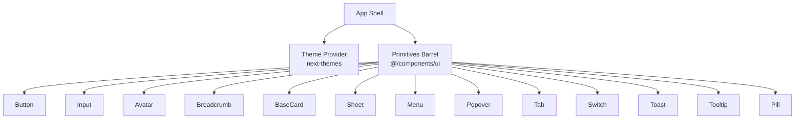

**Diagram sources**
- [index.ts:15-46](file://src/components/ui/index.ts#L15-L46)
- [ThemeProvider.tsx:5-15](file://src/components/ThemeProvider.tsx#L5-L15)

**Section sources**
- [index.ts:1-46](file://src/components/ui/index.ts#L1-L46)
- [ThemeProvider.tsx:1-17](file://src/components/ThemeProvider.tsx#L1-L17)

## Core Components
Below is a concise overview of each primitive with its key props, variants, accessibility, and behavior.

- Button
  - Purpose: Primary interactive element with multiple visual styles and sizes.
  - Props: variant (primary, secondary, ghost, outline, dark), size (xs, sm, md), icon placement (none, leading, trailing, only), plus standard button attributes.
  - Styling: Uses class-variance-authority for variants; layered decorations for filled variants; motion tokens for transitions.
  - Accessibility: Focus-visible ring, disabled state, keyboard support via Base UI button primitive.
  - Usage: Use for actions; choose variant to match hierarchy and context.

- Input
  - Purpose: Text input with optional icons, clear action, and dropdown selector mode.
  - Props: variant (default, underline), size (sm, md), icon slots (leading/trailing), controlled/uncontrolled value, clearable, onClear, aria-invalid, plus Field.Control attributes.
  - Styling: Asymmetric padding based on icon presence; focus states with ring and inner shadow; supports DropdownSelector when showDropdown is true.
  - Accessibility: aria-invalid wiring; clear button has aria-label; keyboard-friendly.
  - Usage: Prefer controlled inputs; use DropdownSelector for selection patterns.

- Avatar
  - Purpose: Identity indicator via initials, image, or icon.
  - Props: name, src, alt, initials, type (initial, image, icon), size (sm, md, lg), icon.
  - Styling: Rounded full container; border style varies by type; hover/active opacity changes.
  - Accessibility: Image alt text; semantic role via div container.
  - Usage: Display user identity consistently across lists and headers.

- Breadcrumb
  - Purpose: Navigation trail with previous/current semantics.
  - Props: BreadcrumbItem step (previous, current), icon; BreadcrumbSeparator; Breadcrumb wraps items.
  - Styling: Previous steps are interactive buttons; current step is non-interactive label; separators auto-inserted.
  - Accessibility: nav landmark, aria-current="page" on current item, aria-hidden on separators.
  - Usage: Compose Breadcrumb with BreadcrumbItem and let it insert separators automatically.

- BaseCard
  - Purpose: Shared card shell with media, header, and optional action menu.
  - Props: cardClass, media, label, iconVariant, href/prefetchHref, onClick, onDelete/onAddToCollection/onAddToItinerary, disabled, isSelected/isSelectingMode.
  - Styling: Hover/focus states; selected state with brand border; action menu appears on hover/select.
  - Accessibility: Keyboard activation for clickable cards; aria-disabled; focus rings.
  - Usage: Build entity cards by providing media and label; attach actions via callbacks.

- Sheet
  - Purpose: Responsive overlay panel (bottom on phone, side drawer on tablet+).
  - Props: open, onOpenChange, side (auto or forced), title, description, trigger, children, className.
  - Styling: Backdrop, safe-area insets, min-height adjustments for form controls.
  - Accessibility: Dialog semantics, focus trap, Esc dismissal, sr-only title/description.
  - Usage: Wrap content in Sheet for modals/side panels; control visibility from parent.

- Menu
  - Purpose: Floating list of actions/options with alignment and positioning.
  - Props: MenuRoot, MenuTrigger, MenuContent (align, side, sideOffset, positionerClassName), MenuItem (size, icon, variant, selected), DescriptiveMenuItem, MenuSeparator.
  - Styling: Consistent item heights, icon spacing, destructive variant, selected states.
  - Accessibility: Base UI menu behaviors; keyboard navigation; focus management.
  - Usage: Attach Menu to triggers; provide options and handlers.

- Popover
  - Purpose: Lightweight floating content with optional arrow and anchor support.
  - Props: PopoverRoot, PopoverTrigger (openOnHover, delay), PopoverContent (side, align, sideOffset, arrow, collisionPadding, anchor).
  - Styling: Surface, border, rounded corners, shadow; directional arrow.
  - Accessibility: Focus ring on popup; portal-based positioning.
  - Usage: Show contextual info or small forms near triggers.

- Tab
  - Purpose: Underline-style tab with selected/disabled states.
  - Props: size (md, sm), icon (none, leading, only), selected, disabled, leadingIcon, children.
  - Styling: Reserved bottom border to avoid layout shift; brand underline when selected.
  - Accessibility: role="tab", aria-selected, aria-disabled.
  - Usage: Pair with tab panels managed by your state.

- Switch
  - Purpose: Binary toggle with two sizes.
  - Props: size (sm, md), checked/defaultChecked, onCheckedChange, disabled, name, label.
  - Styling: Track bevel, thumb animation, focus ring.
  - Accessibility: Base UI switch semantics; aria-label via label prop.
  - Usage: Toggle settings or modes.

- Toast
  - Purpose: Non-blocking notifications with optional thumbnail, description, and action.
  - Props: Consumes global toast store; renders ToastContainer with AnimatePresence.
  - Styling: Auto-dismiss progress bar; variants include error; action button styled with Button.
  - Accessibility: aria-live regions; alert vs status roles.
  - Usage: Add toasts via context; container renders into body portal.

- Tooltip
  - Purpose: Contextual hints with configurable timing and arrow.
  - Props: TooltipProvider (delay, closeDelay), TooltipRoot, Trigger, Content (side, align, sideOffset).
  - Styling: Surface bubble, border, shadow; directional arrow.
  - Accessibility: Base UI tooltip behaviors; portal positioning.
  - Usage: Wrap interactive elements to explain purpose.

- Pill
  - Purpose: Inline selectable tag with optional remove action.
  - Props: type (default, selected, input), leadingIcon, onClick, onRemove, disabled.
  - Styling: Selected state uses brand fill and inset shadows; focus ring.
  - Accessibility: role="checkbox", aria-checked.
  - Usage: Represent filters, tags, or selections.

**Section sources**
- [Button.tsx:9-74](file://src/components/ui/primitives/Button.tsx#L9-L74)
- [Input.tsx:11-123](file://src/components/ui/primitives/Input.tsx#L11-L123)
- [Avatar.tsx:9-53](file://src/components/ui/primitives/Avatar.tsx#L9-L53)
- [Breadcrumb.tsx:15-37](file://src/components/ui/primitives/Breadcrumb.tsx#L15-L37)
- [BaseCard.tsx:13-50](file://src/components/ui/cards/BaseCard.tsx#L13-L50)
- [Sheet.tsx:10-48](file://src/components/ui/primitives/Sheet.tsx#L10-L48)
- [Menu.tsx:16-183](file://src/components/ui/primitives/Menu.tsx#L16-L183)
- [Popover.tsx:16-88](file://src/components/ui/primitives/Popover.tsx#L16-L88)
- [Tab.tsx:11-48](file://src/components/ui/primitives/Tab.tsx#L11-L48)
- [Switch.tsx:9-45](file://src/components/ui/primitives/Switch.tsx#L9-L45)
- [Toast.tsx:47-174](file://src/components/ui/primitives/Toast.tsx#L47-L174)
- [Tooltip.tsx:28-88](file://src/components/ui/primitives/Tooltip.tsx#L28-L88)
- [Pill.tsx:8-43](file://src/components/ui/primitives/Pill.tsx#L8-L43)

## Architecture Overview
The primitives are built on Base UI primitives for robust interaction models (focus, keyboard, portal, positioning) and styled with Tailwind and class-variance-authority. Theme tokens come from CSS variables and next-themes. Higher-order components compose primitives to build feature-specific UIs.

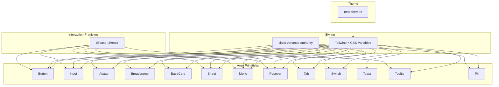

**Diagram sources**
- [Button.tsx:3-7](file://src/components/ui/primitives/Button.tsx#L3-L7)
- [Input.tsx:3-8](file://src/components/ui/primitives/Input.tsx#L3-L8)
- [Sheet.tsx:3-8](file://src/components/ui/primitives/Sheet.tsx#L3-L8)
- [Menu.tsx:3-10](file://src/components/ui/primitives/Menu.tsx#L3-L10)
- [Popover.tsx:3-10](file://src/components/ui/primitives/Popover.tsx#L3-L10)
- [Tooltip.tsx:3-9](file://src/components/ui/primitives/Tooltip.tsx#L3-L9)
- [ThemeProvider.tsx:3-12](file://src/components/ThemeProvider.tsx#L3-L12)

## Detailed Component Analysis

### Button
- Prop interface: variant, size, icon placement, plus Base UI button props.
- Styling: Variants define color and background; compound variants adjust sizing for icon-only buttons; layered decoration for filled variants.
- Accessibility: Focus-visible ring, disabled state, keyboard interactions via Base UI.
- Usage example path: See Button exports and variants.
- Responsive/theme: Inherits theme colors; motion tokens drive transitions.

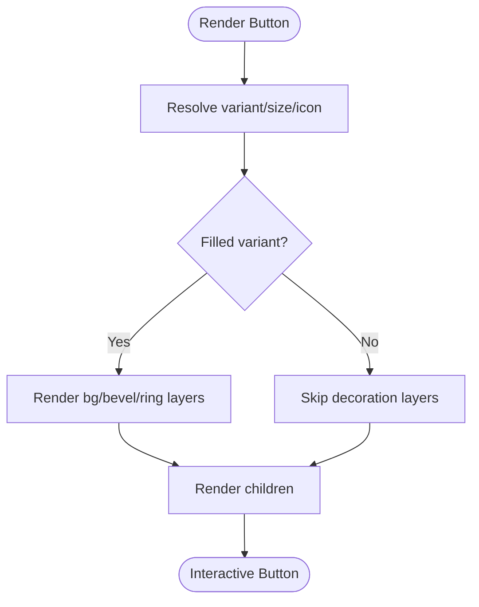

**Diagram sources**
- [Button.tsx:44-127](file://src/components/ui/primitives/Button.tsx#L44-L127)

**Section sources**
- [Button.tsx:9-74](file://src/components/ui/primitives/Button.tsx#L9-L74)
- [Button.tsx:76-131](file://src/components/ui/primitives/Button.tsx#L76-L131)

### Input
- Prop interface: variant, size, icon slots, controlled/uncontrolled value, clearable, onClear, aria-invalid.
- Styling: Default and underline variants; asymmetric padding based on icon presence; focus ring and inner shadow; clear button in trailing slot.
- Accessibility: aria-invalid; clear button labeled; keyboard-friendly.
- Usage example path: See Input, DropdownSelector, AddToInput exports.
- Responsive/theme: Adapts to theme tokens; motion durations applied.

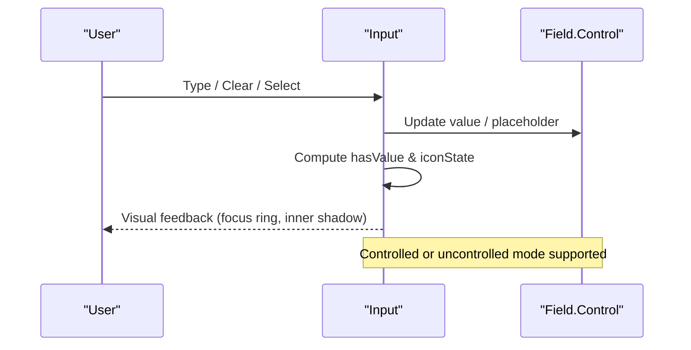

**Diagram sources**
- [Input.tsx:125-276](file://src/components/ui/primitives/Input.tsx#L125-L276)

**Section sources**
- [Input.tsx:11-123](file://src/components/ui/primitives/Input.tsx#L11-L123)
- [Input.tsx:125-276](file://src/components/ui/primitives/Input.tsx#L125-L276)

### Avatar
- Prop interface: name, src, alt, initials, type, size, icon.
- Styling: Rounded full container; border varies by type; hover/active opacity.
- Accessibility: Alt text for images; semantic container.
- Usage example path: See Avatar export and types.
- Responsive/theme: Scales with typography tokens; theme-aware colors.

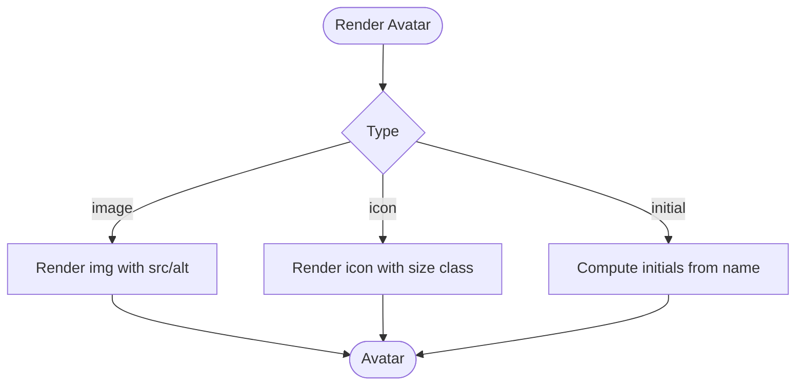

**Diagram sources**
- [Avatar.tsx:83-120](file://src/components/ui/primitives/Avatar.tsx#L83-L120)

**Section sources**
- [Avatar.tsx:9-53](file://src/components/ui/primitives/Avatar.tsx#L9-L53)
- [Avatar.tsx:83-120](file://src/components/ui/primitives/Avatar.tsx#L83-L120)

### Breadcrumb
- Prop interface: BreadcrumbItem step (previous/current), icon; BreadcrumbSeparator; Breadcrumb wraps items.
- Styling: Previous steps are interactive; current step is non-interactive; separators auto-inserted.
- Accessibility: nav landmark, aria-current, aria-hidden separators.
- Usage example path: See Breadcrumb exports.
- Responsive/theme: Uses theme tokens for text and borders.

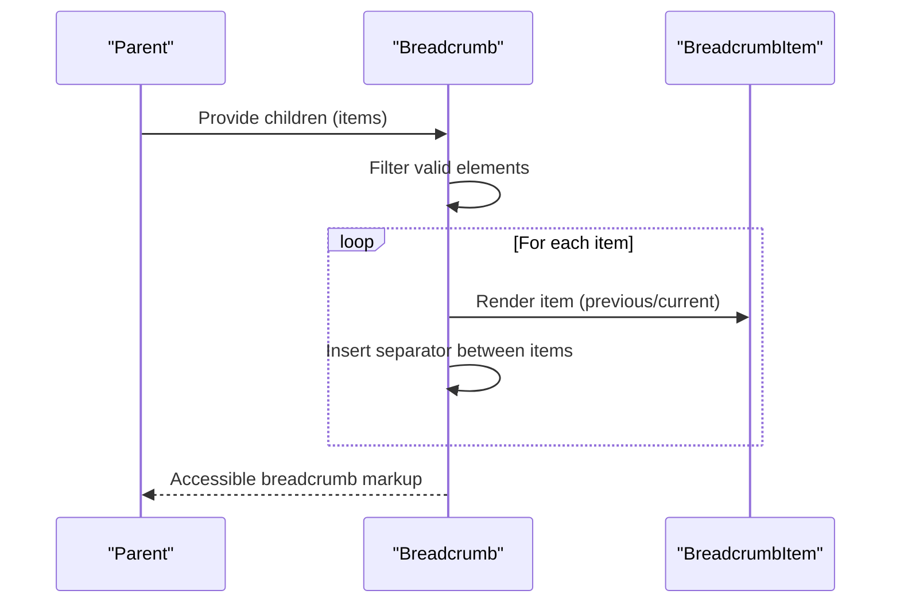

**Diagram sources**
- [Breadcrumb.tsx:105-123](file://src/components/ui/primitives/Breadcrumb.tsx#L105-L123)

**Section sources**
- [Breadcrumb.tsx:15-79](file://src/components/ui/primitives/Breadcrumb.tsx#L15-L79)
- [Breadcrumb.tsx:105-123](file://src/components/ui/primitives/Breadcrumb.tsx#L105-L123)

### BaseCard
- Prop interface: cardClass, media, label, iconVariant, href/prefetchHref, onClick, action callbacks, disabled, selection flags.
- Styling: Hover/focus states; selected state with brand border; action menu anchored to kebab.
- Accessibility: Keyboard activation; aria-disabled; focus rings.
- Usage example path: See BaseCard export and types.
- Responsive/theme: Uses theme tokens; prefetch links on hover.

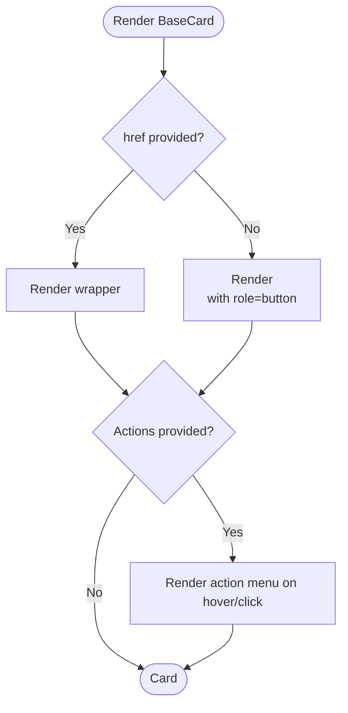

**Diagram sources**
- [BaseCard.tsx:161-203](file://src/components/ui/cards/BaseCard.tsx#L161-L203)

**Section sources**
- [BaseCard.tsx:13-50](file://src/components/ui/cards/BaseCard.tsx#L13-L50)
- [BaseCard.tsx:57-203](file://src/components/ui/cards/BaseCard.tsx#L57-L203)

### Sheet
- Prop interface: open, onOpenChange, side (auto/responsive), title, description, trigger, children, className.
- Styling: Backdrop, safe-area insets, min-height for form controls.
- Accessibility: Dialog semantics, focus trap, Esc dismissal, sr-only title/description.
- Usage example path: See Sheet export and types.
- Responsive/theme: Chooses bottom vs right based on breakpoint; theme-aware surfaces.

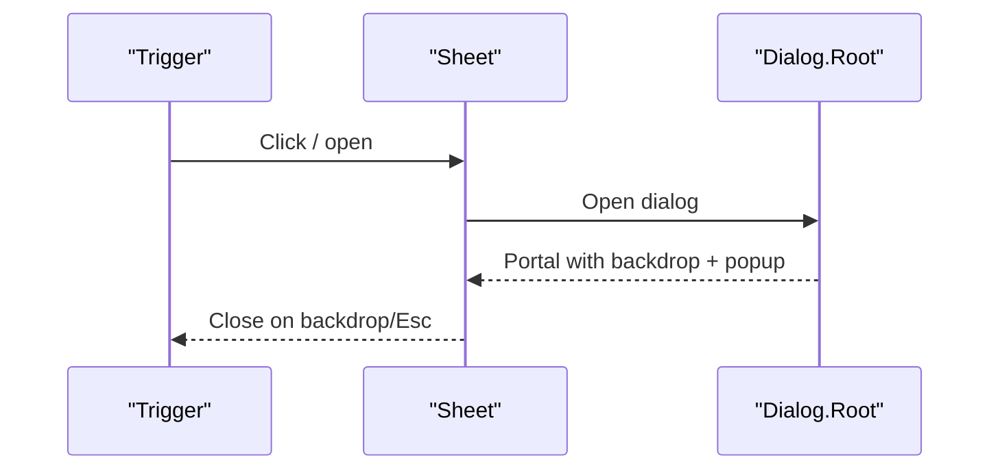

**Diagram sources**
- [Sheet.tsx:57-90](file://src/components/ui/primitives/Sheet.tsx#L57-L90)

**Section sources**
- [Sheet.tsx:10-48](file://src/components/ui/primitives/Sheet.tsx#L10-L48)
- [Sheet.tsx:57-90](file://src/components/ui/primitives/Sheet.tsx#L57-L90)

### Menu
- Prop interface: MenuRoot, MenuTrigger, MenuContent (align, side, sideOffset, positionerClassName), MenuItem (size, icon, variant, selected), DescriptiveMenuItem, MenuSeparator.
- Styling: Item heights, icon spacing, destructive variant, selected states.
- Accessibility: Base UI menu behaviors; keyboard navigation; focus management.
- Usage example path: See Menu exports and types.
- Responsive/theme: Positioning adapts to viewport; theme tokens for surfaces.

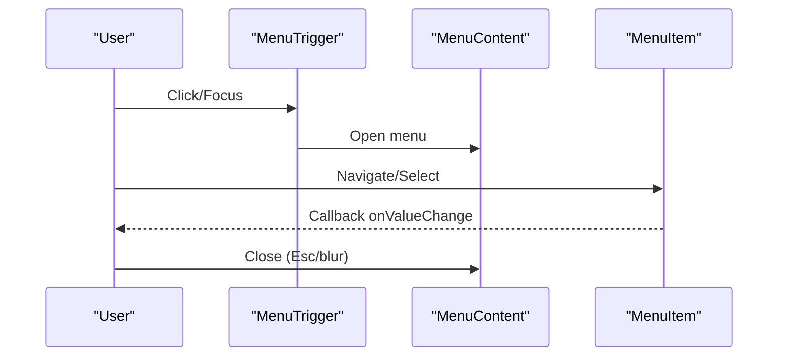

**Diagram sources**
- [Menu.tsx:192-240](file://src/components/ui/primitives/Menu.tsx#L192-L240)
- [Menu.tsx:246-300](file://src/components/ui/primitives/Menu.tsx#L246-L300)

**Section sources**
- [Menu.tsx:16-183](file://src/components/ui/primitives/Menu.tsx#L16-L183)
- [Menu.tsx:192-300](file://src/components/ui/primitives/Menu.tsx#L192-L300)

### Popover
- Prop interface: PopoverRoot, PopoverTrigger (openOnHover, delay), PopoverContent (side, align, sideOffset, arrow, collisionPadding, anchor).
- Styling: Surface, border, rounded corners, shadow; directional arrow.
- Accessibility: Focus ring on popup; portal-based positioning.
- Usage example path: See Popover exports and types.
- Responsive/theme: Positioning adapts to viewport; theme tokens for surfaces.

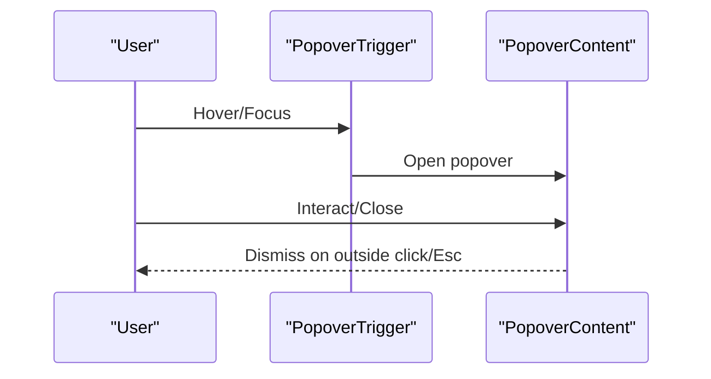

**Diagram sources**
- [Popover.tsx:126-181](file://src/components/ui/primitives/Popover.tsx#L126-L181)

**Section sources**
- [Popover.tsx:16-88](file://src/components/ui/primitives/Popover.tsx#L16-L88)
- [Popover.tsx:126-181](file://src/components/ui/primitives/Popover.tsx#L126-L181)

### Tab
- Prop interface: size, icon, selected, disabled, leadingIcon, children.
- Styling: Reserved bottom border; brand underline when selected; hover/active states.
- Accessibility: role="tab", aria-selected, aria-disabled.
- Usage example path: See Tab export and types.
- Responsive/theme: Uses theme tokens for text and borders.

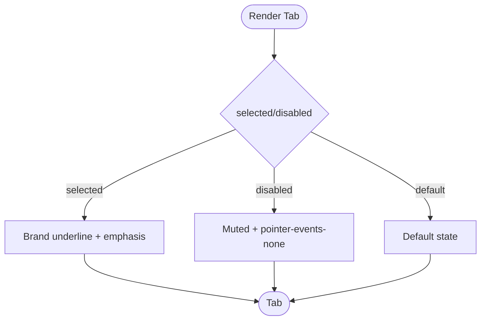

**Diagram sources**
- [Tab.tsx:50-82](file://src/components/ui/primitives/Tab.tsx#L50-L82)

**Section sources**
- [Tab.tsx:11-48](file://src/components/ui/primitives/Tab.tsx#L11-L48)
- [Tab.tsx:50-82](file://src/components/ui/primitives/Tab.tsx#L50-L82)

### Switch
- Prop interface: size, checked/defaultChecked, onCheckedChange, disabled, name, label.
- Styling: Track bevel, thumb animation, focus ring.
- Accessibility: Base UI switch semantics; aria-label via label prop.
- Usage example path: See Switch export and types.
- Responsive/theme: Motion tokens for transitions; theme tokens for colors.

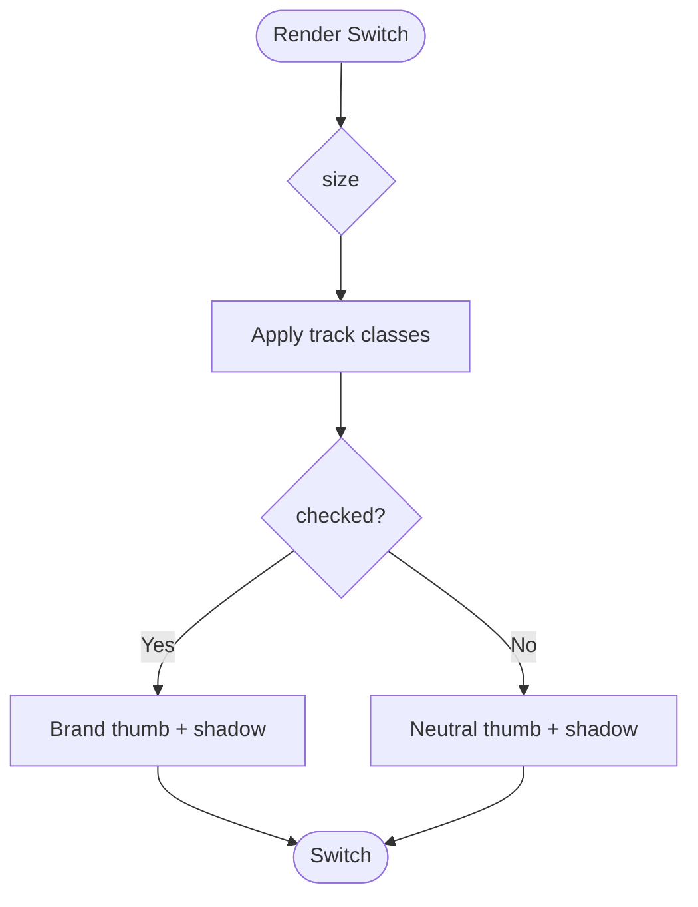

**Diagram sources**
- [Switch.tsx:47-95](file://src/components/ui/primitives/Switch.tsx#L47-L95)

**Section sources**
- [Switch.tsx:9-45](file://src/components/ui/primitives/Switch.tsx#L9-L45)
- [Switch.tsx:47-95](file://src/components/ui/primitives/Switch.tsx#L47-L95)

### Toast
- Prop interface: Consumes global toast store; renders ToastContainer with AnimatePresence.
- Styling: Auto-dismiss progress bar; variants include error; action button styled with Button.
- Accessibility: aria-live regions; alert vs status roles.
- Usage example path: See ToastContainer and ProgressBar.
- Responsive/theme: Uses theme tokens; motion presets for animations.

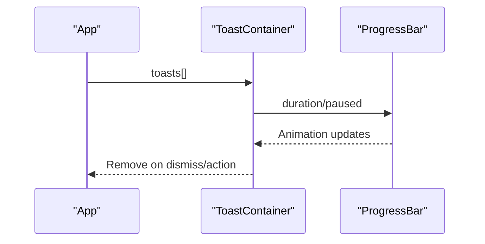

**Diagram sources**
- [Toast.tsx:47-174](file://src/components/ui/primitives/Toast.tsx#L47-L174)

**Section sources**
- [Toast.tsx:47-174](file://src/components/ui/primitives/Toast.tsx#L47-L174)

### Tooltip
- Prop interface: TooltipProvider (delay, closeDelay), TooltipRoot, Trigger, Content (side, align, sideOffset).
- Styling: Surface bubble, border, shadow; directional arrow.
- Accessibility: Base UI tooltip behaviors; portal positioning.
- Usage example path: See Tooltip exports and types.
- Responsive/theme: Uses theme tokens; motion presets for transitions.

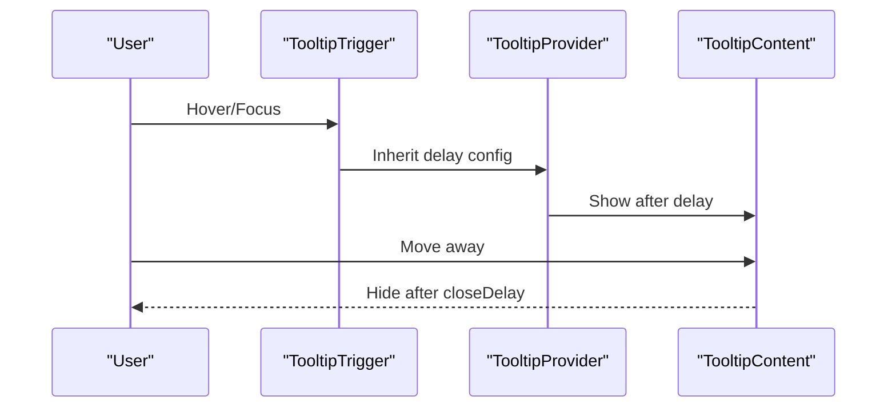

**Diagram sources**
- [Tooltip.tsx:98-169](file://src/components/ui/primitives/Tooltip.tsx#L98-L169)

**Section sources**
- [Tooltip.tsx:28-88](file://src/components/ui/primitives/Tooltip.tsx#L28-L88)
- [Tooltip.tsx:98-169](file://src/components/ui/primitives/Tooltip.tsx#L98-L169)

### Pill
- Prop interface: type, leadingIcon, onClick, onRemove, disabled.
- Styling: Selected state uses brand fill and inset shadows; focus ring.
- Accessibility: role="checkbox", aria-checked.
- Usage example path: See Pill export and types.
- Responsive/theme: Uses theme tokens for colors and borders.

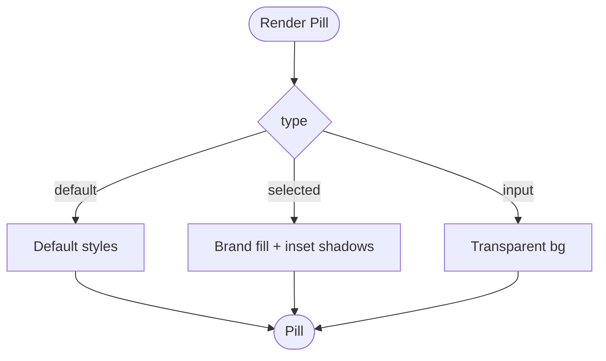

**Diagram sources**
- [Pill.tsx:45-80](file://src/components/ui/primitives/Pill.tsx#L45-L80)

**Section sources**
- [Pill.tsx:8-43](file://src/components/ui/primitives/Pill.tsx#L8-L43)
- [Pill.tsx:45-80](file://src/components/ui/primitives/Pill.tsx#L45-L80)

## Dependency Analysis
- Interaction layer: Base UI provides robust primitives for focus, keyboard, portals, and positioning used by Button, Input, Sheet, Menu, Popover, Tooltip.
- Styling layer: class-variance-authority defines variants; Tailwind utilities apply tokens; CSS variables drive motion and theme colors.
- Theme layer: next-themes sets attribute-based theming consumed by CSS variables.
- Composition: BaseCard composes Button and CategoryBadge; Input can delegate to Menu for dropdowns; Toast consumes context and renders Button.

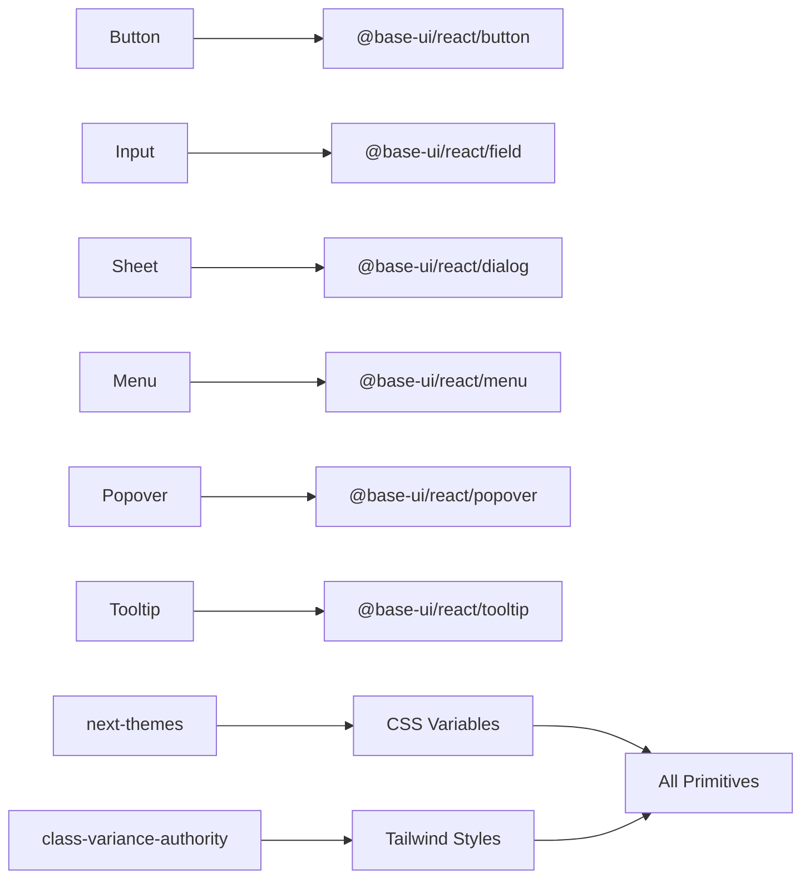

**Diagram sources**
- [Button.tsx:3-7](file://src/components/ui/primitives/Button.tsx#L3-L7)
- [Input.tsx:3-8](file://src/components/ui/primitives/Input.tsx#L3-L8)
- [Sheet.tsx:3-8](file://src/components/ui/primitives/Sheet.tsx#L3-L8)
- [Menu.tsx:3-10](file://src/components/ui/primitives/Menu.tsx#L3-L10)
- [Popover.tsx:3-10](file://src/components/ui/primitives/Popover.tsx#L3-L10)
- [Tooltip.tsx:3-9](file://src/components/ui/primitives/Tooltip.tsx#L3-L9)
- [ThemeProvider.tsx:3-12](file://src/components/ThemeProvider.tsx#L3-L12)

**Section sources**
- [index.ts:15-46](file://src/components/ui/index.ts#L15-L46)
- [ThemeProvider.tsx:3-12](file://src/components/ThemeProvider.tsx#L3-L12)

## Performance Considerations
- Prefer controlled inputs where possible to keep state predictable; Input tracks internal hasValue only when uncontrolled.
- Use lazy rendering for overlays (Sheet, Menu, Popover, Tooltip) via Base UI portals to avoid unnecessary DOM work.
- Avoid heavy re-renders in menus by memoizing items and minimizing prop churn.
- Respect reduced motion preferences (Toast respects useReducedMotion).
- Keep icon sizes consistent to prevent layout shifts (Tabs reserve bottom border; Inputs compute iconState to adjust padding).
- Use prefetchHref on BaseCard to preload linked pages on hover.

[No sources needed since this section provides general guidance]

## Troubleshooting Guide
- Input not clearing: Ensure clearable is enabled and onClear handler or native clearing logic is wired; verify ref handling for controlled inputs.
- DropdownSelector not opening: When options are provided, ensure Menu integration is present; otherwise it renders as a presentational trigger.
- Breadcrumbs missing separators: Only valid elements are counted; ensure children are valid React elements.
- Sheet not closing: Confirm open/onOpenChange are controlled; backdrop and Esc are handled by Base UI Dialog.
- Menu items not focusing: Ensure MenuContent is rendered within a portal and that collisionPadding is sufficient for viewport constraints.
- Popover clipping: Adjust collisionPadding or use anchor to position relative to a specific element.
- Tabs layout shift: The reserved bottom border prevents shifts; ensure selected state toggles correctly.
- Switch not updating: Verify checked/defaultChecked and onCheckedChange are wired; label prop sets aria-label for accessibility.
- Toast not visible: Ensure ToastContainer is mounted and toasts are added via context; check paused state if hovering.
- Tooltip not appearing: Check provider delay/closeDelay; ensure trigger is interactive and positioned within viewport.

**Section sources**
- [Input.tsx:170-186](file://src/components/ui/primitives/Input.tsx#L170-L186)
- [Input.tsx:316-403](file://src/components/ui/primitives/Input.tsx#L316-L403)
- [Breadcrumb.tsx:105-123](file://src/components/ui/primitives/Breadcrumb.tsx#L105-L123)
- [Sheet.tsx:57-90](file://src/components/ui/primitives/Sheet.tsx#L57-L90)
- [Menu.tsx:214-240](file://src/components/ui/primitives/Menu.tsx#L214-L240)
- [Popover.tsx:126-181](file://src/components/ui/primitives/Popover.tsx#L126-L181)
- [Tab.tsx:50-82](file://src/components/ui/primitives/Tab.tsx#L50-L82)
- [Switch.tsx:47-95](file://src/components/ui/primitives/Switch.tsx#L47-L95)
- [Toast.tsx:47-174](file://src/components/ui/primitives/Toast.tsx#L47-L174)
- [Tooltip.tsx:98-169](file://src/components/ui/primitives/Tooltip.tsx#L98-L169)

## Conclusion
The primitive components form a cohesive, accessible, and theme-aware foundation for Argo’s design system. By leveraging Base UI for interaction, class-variance-authority for styling, and next-themes for theming, these components maintain consistency and scalability. Use the documented props and patterns to customize responsibly, ensuring accessibility and performance are preserved across the application.

[No sources needed since this section summarizes without analyzing specific files]