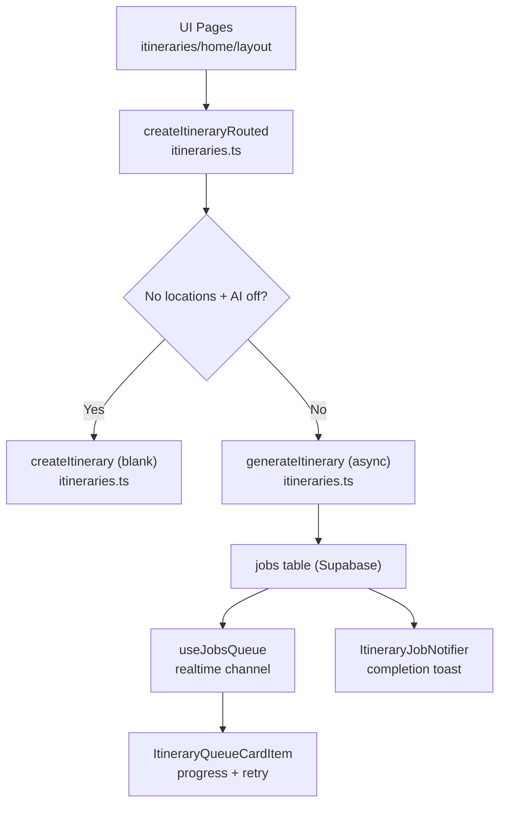
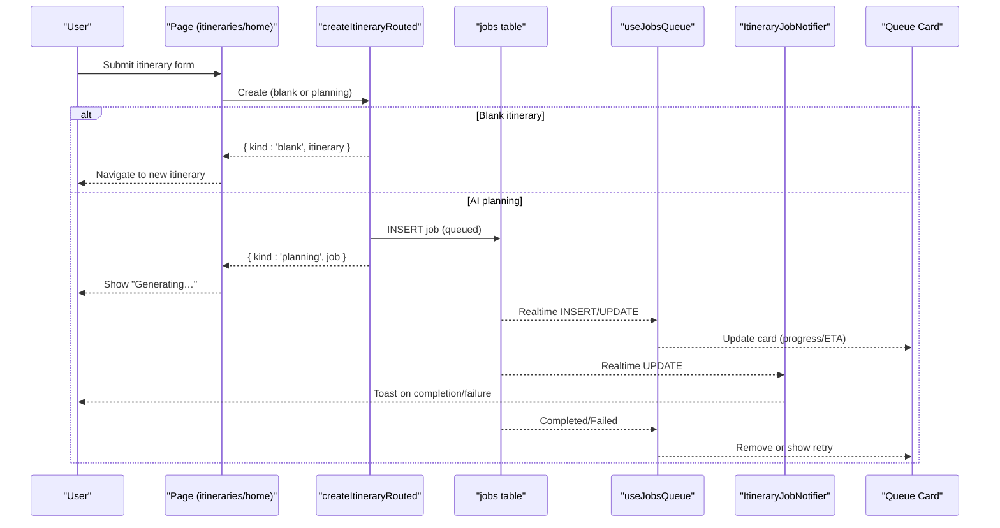
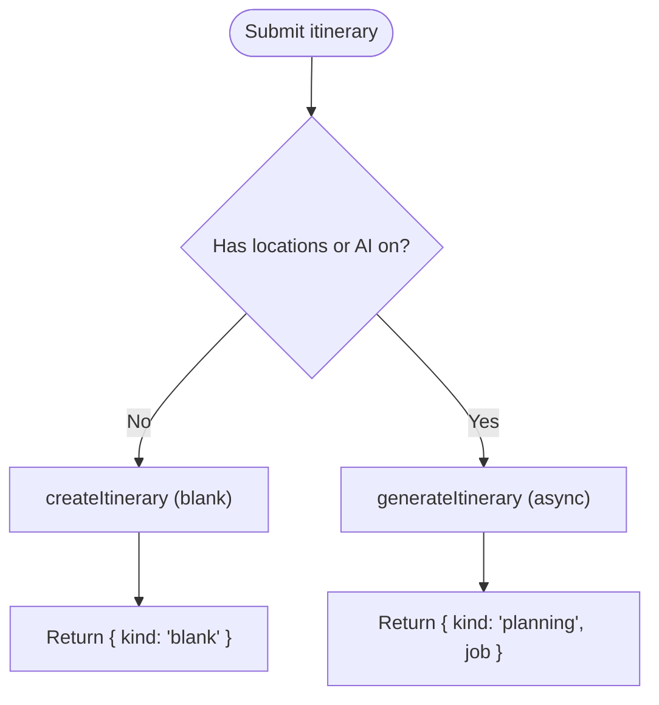
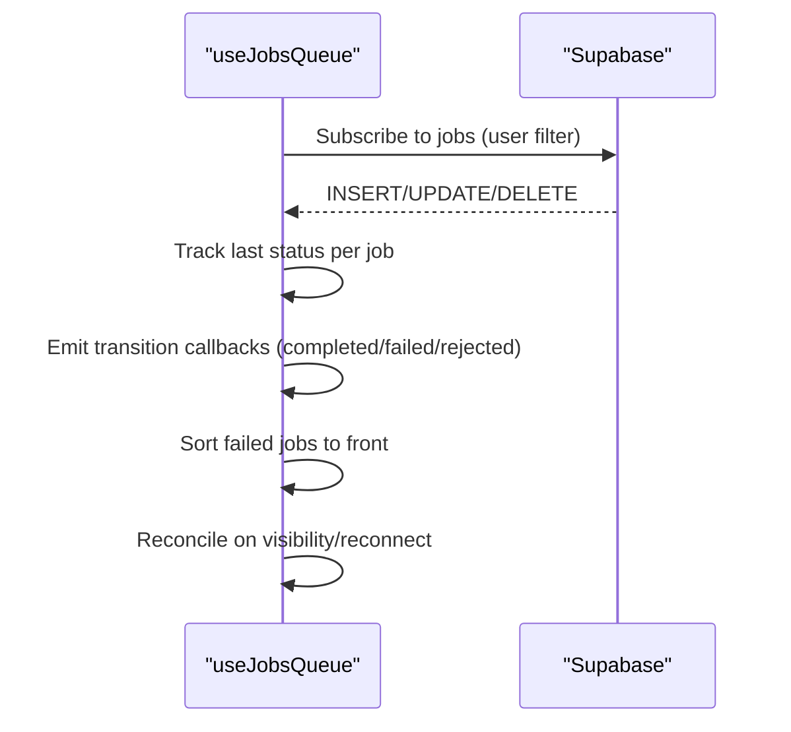
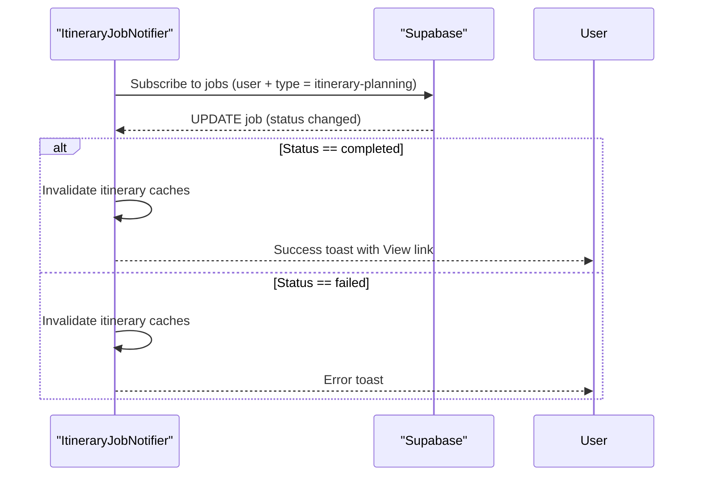
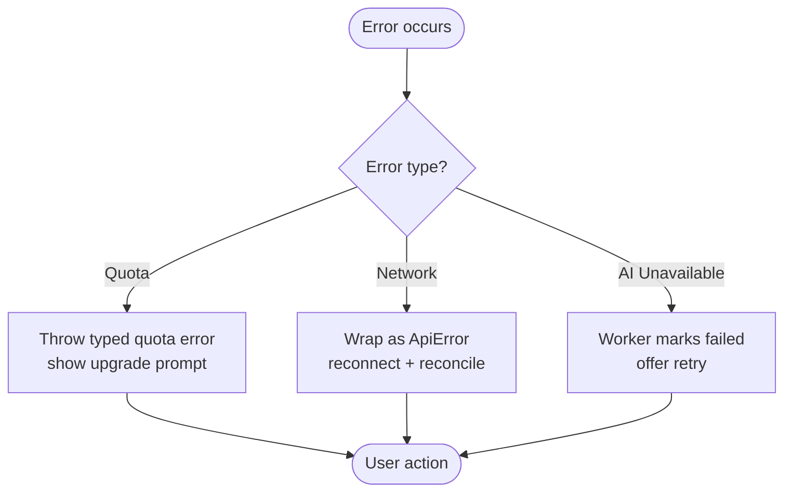
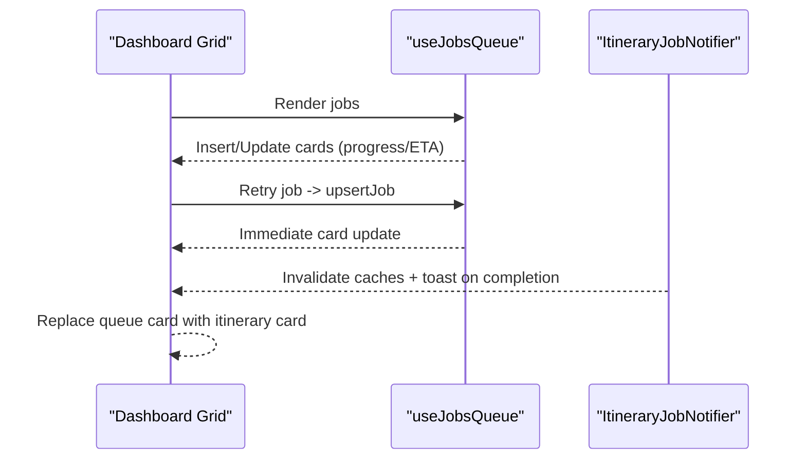
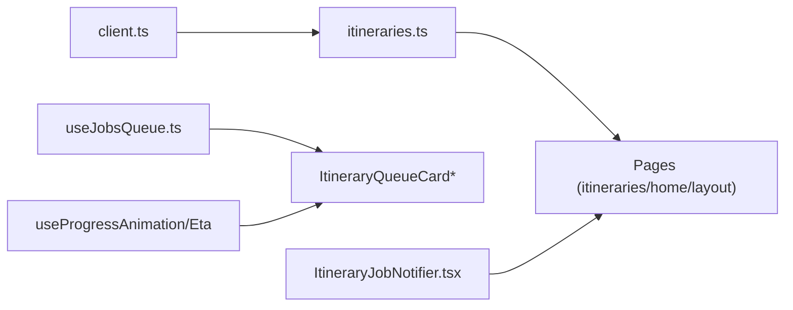

# AI Processing Jobs & Queue System

<cite>
**Referenced Files in This Document**
- [useJobsQueue.ts](file://src/hooks/useJobsQueue.ts)
- [ItineraryJobNotifier.tsx](file://src/components/notifications/ItineraryJobNotifier.tsx)
- [itineraries.ts](file://src/lib/api/itineraries.ts)
- [client.ts](file://src/lib/api/client.ts)
- [ItineraryQueueCard.tsx](file://src/components/ui/itinerary/ItineraryQueueCard.tsx)
- [ItineraryQueueCardItem.tsx](file://src/components/ui/itinerary/ItineraryQueueCardItem.tsx)
- [useProgressAnimation.ts](file://src/hooks/useProgressAnimation.ts)
- [useProgressEta.ts](file://src/hooks/useProgressEta.ts)
- [page.tsx (itineraries)](file://src/app/itineraries/page.tsx)
- [page.tsx (home)](file://src/app/home/page.tsx)
- [MainLayout.tsx](file://src/components/ui/layout/MainLayout.tsx)
- [personalization-pipeline.md](file://docs/personalization-pipeline.md)
</cite>

## Table of Contents
1. [Introduction](#introduction)
2. [Project Structure](#project-structure)
3. [Core Components](#core-components)
4. [Architecture Overview](#architecture-overview)
5. [Detailed Component Analysis](#detailed-component-analysis)
6. [Dependency Analysis](#dependency-analysis)
7. [Performance Considerations](#performance-considerations)
8. [Troubleshooting Guide](#troubleshooting-guide)
9. [Conclusion](#conclusion)

## Introduction
This document explains Argo’s AI processing job queue system for long-running itinerary generation tasks. It covers the GenerateItineraryJob interface, job types and lifecycle, real-time monitoring via useJobsQueue, progress updates and completion notifications through ItineraryJobNotifier, dual-mode creation (synchronous blank vs asynchronous AI-powered), error handling strategies, optimistic UI updates, retry mechanisms, and how the dashboard displays job progress.

## Project Structure
The job system spans client hooks, API utilities, notification components, and UI cards:
- Job queue hook and realtime subscription: src/hooks/useJobsQueue.ts
- Completion notifications: src/components/notifications/ItineraryJobNotifier.tsx
- Itinerary creation routing and job interfaces: src/lib/api/itineraries.ts
- Generic job client with retry/detach: src/lib/api/client.ts
- Queue UI components: src/components/ui/itinerary/ItineraryQueueCard.tsx, ItineraryQueueCardItem.tsx
- Progress helpers: src/hooks/useProgressAnimation.ts, src/hooks/useProgressEta.ts
- Entry points that trigger creation: src/app/itineraries/page.tsx, src/app/home/page.tsx, src/components/ui/layout/MainLayout.tsx
- Pipeline context: docs/personalization-pipeline.md



**Diagram sources**
- [itineraries.ts:339-439](file://src/lib/api/itineraries.ts#L339-L439)
- [useJobsQueue.ts:167-260](file://src/hooks/useJobsQueue.ts#L167-L260)
- [ItineraryJobNotifier.tsx:29-88](file://src/components/notifications/ItineraryJobNotifier.tsx#L29-L88)
- [ItineraryQueueCardItem.tsx:39-100](file://src/components/ui/itinerary/ItineraryQueueCardItem.tsx#L39-L100)

**Section sources**
- [itineraries.ts:59-87](file://src/lib/api/itineraries.ts#L59-L87)
- [useJobsQueue.ts:6-34](file://src/hooks/useJobsQueue.ts#L6-L34)
- [ItineraryJobNotifier.tsx:10-90](file://src/components/notifications/ItineraryJobNotifier.tsx#L10-L90)

## Core Components
- GenerateItineraryJob: a minimal job record returned by the create flow to identify an async planning job.
- QueueJob: the full runtime job shape used by the queue UI, including status, payload, result, progress, and timestamps.
- useJobsQueue: subscribes to Supabase realtime changes for jobs, reconciles missed updates, sorts failed jobs to the front, and exposes upsert/remove helpers for optimistic UI.
- ItineraryJobNotifier: listens for completed/failed transitions on itinerary-planning jobs and invalidates caches plus shows toasts.
- ItineraryQueueCard / ItineraryQueueCardItem: render in-flight jobs with progress bars, ETA countdown, retry buttons, and image placeholders.
- Progress hooks: useProgressAnimation maps step/percent to smooth visual progress; useProgressEta computes human-friendly time left.

Key responsibilities:
- Dual-mode creation: synchronous blank itineraries when no locations and AI recommendations are off; otherwise, asynchronous AI-powered generation.
- Real-time monitoring: live updates for queued/processing/completed/failed states.
- Optimistic UI: immediate feedback on retry and completion without waiting for network round-trips.
- Error handling: quota errors surfaced as typed exceptions; friendly messages for user display.

**Section sources**
- [itineraries.ts:80-99](file://src/lib/api/itineraries.ts#L80-L99)
- [useJobsQueue.ts:45-295](file://src/hooks/useJobsQueue.ts#L45-L295)
- [ItineraryJobNotifier.tsx:29-88](file://src/components/notifications/ItineraryJobNotifier.tsx#L29-L88)
- [ItineraryQueueCard.tsx:35-199](file://src/components/ui/itinerary/ItineraryQueueCard.tsx#L35-L199)
- [ItineraryQueueCardItem.tsx:13-100](file://src/components/ui/itinerary/ItineraryQueueCardItem.tsx#L13-L100)
- [useProgressAnimation.ts:1-41](file://src/hooks/useProgressAnimation.ts#L1-L41)
- [useProgressEta.ts:1-59](file://src/hooks/useProgressEta.ts#L1-L59)

## Architecture Overview
The system routes itinerary creation into two paths:
- Synchronous blank itinerary: returns immediately with a new itinerary object.
- Asynchronous AI-powered generation: creates a job row, then the UI monitors it until completion or failure.

Realtime updates flow from the jobs table to both the queue UI and the global notifier. The queue UI provides progress, ETA, and retry controls; the notifier handles cache invalidation and toasts.



**Diagram sources**
- [itineraries.ts:339-439](file://src/lib/api/itineraries.ts#L339-L439)
- [useJobsQueue.ts:167-260](file://src/hooks/useJobsQueue.ts#L167-L260)
- [ItineraryJobNotifier.tsx:29-88](file://src/components/notifications/ItineraryJobNotifier.tsx#L29-L88)
- [page.tsx (itineraries):201-223](file://src/app/itineraries/page.tsx#L201-L223)
- [page.tsx (home):492-516](file://src/app/home/page.tsx#L492-L516)

## Detailed Component Analysis

### GenerateItineraryJob and Creation Routing
- GenerateItineraryParams defines inputs for AI-assisted generation, including location IDs, dates, region, and toggles like aiFillGaps.
- GenerateItineraryJob is the minimal job identifier returned when starting async planning.
- createItineraryRouted decides between:
  - Synchronous blank itinerary when no locations and AI recommendations are off.
  - Asynchronous planning job otherwise.
- Quota errors are thrown as ItineraryQuotaError with current_count and max_itineraries for upgrade prompts.



**Diagram sources**
- [itineraries.ts:339-439](file://src/lib/api/itineraries.ts#L339-L439)

**Section sources**
- [itineraries.ts:59-99](file://src/lib/api/itineraries.ts#L59-L99)
- [itineraries.ts:339-439](file://src/lib/api/itineraries.ts#L339-L439)

### useJobsQueue: Real-Time Monitoring and Lifecycle
- Subscribes to Supabase postgres_changes for jobs scoped by user_id and optional type.
- Initial fetch includes recent failed jobs so users can retry them.
- Reconciliation pass runs on visibility change and reconnect to settle any missed updates.
- Failed jobs pin to the front; within groups newest first.
- Exposes removeJob and upsertJob for optimistic UI updates after retries.



**Diagram sources**
- [useJobsQueue.ts:78-267](file://src/hooks/useJobsQueue.ts#L78-L267)

**Section sources**
- [useJobsQueue.ts:6-34](file://src/hooks/useJobsQueue.ts#L6-L34)
- [useJobsQueue.ts:78-267](file://src/hooks/useJobsQueue.ts#L78-L267)
- [useJobsQueue.ts:269-295](file://src/hooks/useJobsQueue.ts#L269-L295)

### ItineraryJobNotifier: Completion and Failure Notifications
- Listens only for itinerary-planning jobs.
- On completion: invalidates itinerary-related queries and shows a success toast with a “View” link to the new itinerary.
- On failure: invalidates queries and shows an error toast.
- Uses a per-instance channel suffix to avoid duplicate subscriptions.



**Diagram sources**
- [ItineraryJobNotifier.tsx:29-88](file://src/components/notifications/ItineraryJobNotifier.tsx#L29-L88)

**Section sources**
- [ItineraryJobNotifier.tsx:10-90](file://src/components/notifications/ItineraryJobNotifier.tsx#L10-L90)

### Queue UI: Progress, ETA, Retry, and Optimism
- ItineraryQueueCard renders stateful visuals: queued/processing/failed, progress bar, error message, and retry button.
- ItineraryQueueCardItem binds a job to the card:
  - Computes animated progress using useProgressAnimation.
  - Resolves destination photo if not already present.
  - Offers retry when failed or stuck beyond threshold.
  - Manages retry spinner state.
- useProgressAnimation maps step/percent to smooth visual progress, trusting worker-reported percent when available.
- useProgressEta computes a human-friendly countdown based on worker-provided eta_seconds and fired_at.

```mermaid
classDiagram
class ItineraryQueueCard {
+state
+title
+progress
+imageUrl
+isImagePending
+gradient
+errorMessage
+onRemove()
+onRetry()
}
class ItineraryQueueCardItem {
+job
+gradient
+onRemove(id)
+onRetry(job)
}
class useProgressAnimation {
+(job) number
}
class useProgressEta {
+(job) { label, isOverrun }
}
ItineraryQueueCardItem --> ItineraryQueueCard : "renders"
ItineraryQueueCardItem --> useProgressAnimation : "uses"
ItineraryQueueCardItem --> useProgressEta : "uses"
```

**Diagram sources**
- [ItineraryQueueCard.tsx:35-199](file://src/components/ui/itinerary/ItineraryQueueCard.tsx#L35-L199)
- [ItineraryQueueCardItem.tsx:13-100](file://src/components/ui/itinerary/ItineraryQueueCardItem.tsx#L13-L100)
- [useProgressAnimation.ts:1-41](file://src/hooks/useProgressAnimation.ts#L1-L41)
- [useProgressEta.ts:1-59](file://src/hooks/useProgressEta.ts#L1-L59)

**Section sources**
- [ItineraryQueueCard.tsx:35-199](file://src/components/ui/itinerary/ItineraryQueueCard.tsx#L35-L199)
- [ItineraryQueueCardItem.tsx:13-100](file://src/components/ui/itinerary/ItineraryQueueCardItem.tsx#L13-L100)
- [useProgressAnimation.ts:1-41](file://src/hooks/useProgressAnimation.ts#L1-L41)
- [useProgressEta.ts:1-59](file://src/hooks/useProgressEta.ts#L1-L59)

### Error Handling Strategies
- Quota exceeded:
  - createItinerary throws ItineraryQuotaError with counts and limits for upgrade prompts.
  - Link quota errors are handled centrally in the client layer.
  - A shared quota gate hook surfaces consistent upgrade messaging.
- Network failures:
  - authFetch wraps transport errors; ensureOk/unwrap centralize non-OK responses.
  - useJobsQueue detects connection errors and triggers reconciliation on reconnect.
- AI service unavailability:
  - Workers mark jobs failed; UI offers retry for failed or stuck jobs.
  - Friendly error messages are filtered to safe whitelists before display.



**Diagram sources**
- [itineraries.ts:339-367](file://src/lib/api/itineraries.ts#L339-L367)
- [client.ts:96-155](file://src/lib/api/client.ts#L96-L155)
- [useJobsQueue.ts:250-260](file://src/hooks/useJobsQueue.ts#L250-L260)
- [userMessages.ts:94-106](file://src/lib/errors/userMessages.ts#L94-L106)

**Section sources**
- [itineraries.ts:89-99](file://src/lib/api/itineraries.ts#L89-L99)
- [client.ts:96-155](file://src/lib/api/client.ts#L96-L155)
- [useJobsQueue.ts:250-260](file://src/hooks/useJobsQueue.ts#L250-L260)
- [userMessages.ts:94-106](file://src/lib/errors/userMessages.ts#L94-L106)

### Optimistic UI Updates and Dashboard Integration
- Optimistic merge:
  - useJobsQueue.upsertJob merges retry results immediately so the card reflects new status without waiting for realtime lag.
  - Itineraries page builds an optimistic itinerary object from completed job result to fill the grid slot instantly.
- Dashboard integration:
  - Queued/processing jobs appear in the grid as queue cards with progress and ETA.
  - Completed jobs transition seamlessly to itinerary cards; failed jobs stay visible for one day to allow retry.
  - Global notifier invalidates query caches and shows toasts for completion/failure.



**Diagram sources**
- [useJobsQueue.ts:269-295](file://src/hooks/useJobsQueue.ts#L269-L295)
- [page.tsx (itineraries):32-72](file://src/app/itineraries/page.tsx#L32-L72)
- [ItineraryJobNotifier.tsx:57-82](file://src/components/notifications/ItineraryJobNotifier.tsx#L57-L82)

**Section sources**
- [useJobsQueue.ts:269-295](file://src/hooks/useJobsQueue.ts#L269-L295)
- [page.tsx (itineraries):32-72](file://src/app/itineraries/page.tsx#L32-L72)
- [ItineraryJobNotifier.tsx:57-82](file://src/components/notifications/ItineraryJobNotifier.tsx#L57-L82)

## Dependency Analysis
- Creation flows depend on itineraries.ts for routing and error mapping.
- Realtime monitoring depends on Supabase channels managed by useJobsQueue and ItineraryJobNotifier.
- UI components depend on progress hooks for smooth UX and on queue data from useJobsQueue.
- Entry pages call createItineraryRouted and handle both blank and planning outcomes.



**Diagram sources**
- [itineraries.ts:339-439](file://src/lib/api/itineraries.ts#L339-L439)
- [client.ts:109-155](file://src/lib/api/client.ts#L109-L155)
- [useJobsQueue.ts:167-260](file://src/hooks/useJobsQueue.ts#L167-L260)
- [ItineraryJobNotifier.tsx:29-88](file://src/components/notifications/ItineraryJobNotifier.tsx#L29-L88)
- [ItineraryQueueCardItem.tsx:39-100](file://src/components/ui/itinerary/ItineraryQueueCardItem.tsx#L39-L100)

**Section sources**
- [itineraries.ts:339-439](file://src/lib/api/itineraries.ts#L339-L439)
- [client.ts:109-155](file://src/lib/api/client.ts#L109-L155)
- [useJobsQueue.ts:167-260](file://src/hooks/useJobsQueue.ts#L167-L260)
- [ItineraryJobNotifier.tsx:29-88](file://src/components/notifications/ItineraryJobNotifier.tsx#L29-L88)
- [ItineraryQueueCardItem.tsx:39-100](file://src/components/ui/itinerary/ItineraryQueueCardItem.tsx#L39-L100)

## Performance Considerations
- Realtime efficiency:
  - Per-instance channel suffix prevents duplicate subscriptions across multiple hook instances.
  - Reconciliation minimizes stale state by re-fetching tracked jobs on visibility change and reconnect.
- Progress UX:
  - useProgressAnimation trusts worker-reported percent when available; otherwise uses step-based targets with a crawl timer to avoid jumpy UI.
  - useProgressEta avoids overpromising near completion by holding countdown at a floor until final reports.
- Data freshness:
  - ItineraryJobNotifier invalidates relevant queries on completion/failure to keep lists consistent.
  - Failed jobs remain visible for 24 hours to support retry workflows.

[No sources needed since this section provides general guidance]

## Troubleshooting Guide
- Stuck jobs:
  - If a job remains in queued/pending/processing beyond a threshold, offer retry.
  - useJobsQueue reconciles missed updates on reconnect to resolve stalls.
- Quota errors:
  - Catch ItineraryQuotaError and show upgrade prompts via the quota gate hook.
- Network issues:
  - Connection errors set a flag; reconcile on reconnect to recover state.
- Friendly messages:
  - Use getFriendlyApiError to prevent technical details leaking into UI.

**Section sources**
- [ItineraryQueueCardItem.tsx:64-83](file://src/components/ui/itinerary/ItineraryQueueCardItem.tsx#L64-L83)
- [useJobsQueue.ts:250-260](file://src/hooks/useJobsQueue.ts#L250-L260)
- [client.ts:96-155](file://src/lib/api/client.ts#L96-L155)
- [userMessages.ts:94-106](file://src/lib/errors/userMessages.ts#L94-L106)

## Conclusion
Argo’s job queue system provides a robust, real-time experience for long-running itinerary generation. It cleanly separates synchronous blank creation from asynchronous AI-powered planning, offers smooth progress and ETA feedback, and ensures resilient error handling with retry support. The combination of useJobsQueue, ItineraryJobNotifier, and queue UI components delivers an intuitive dashboard where users can monitor, retry, and view their generated itineraries with minimal friction.