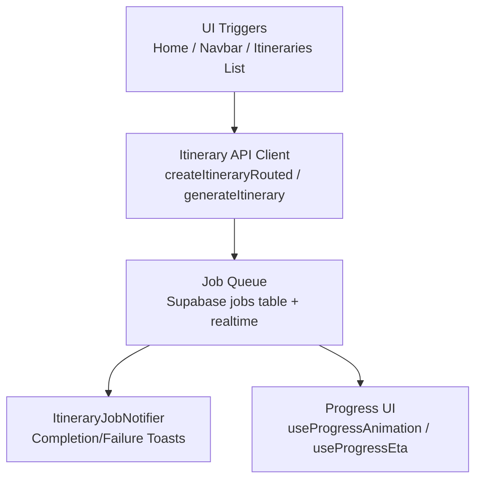
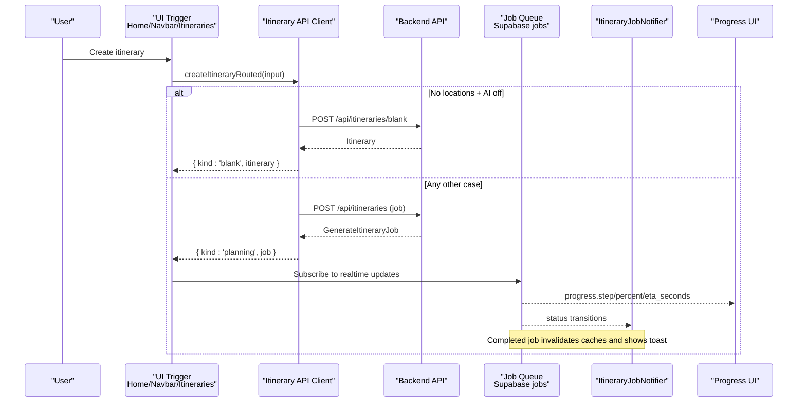
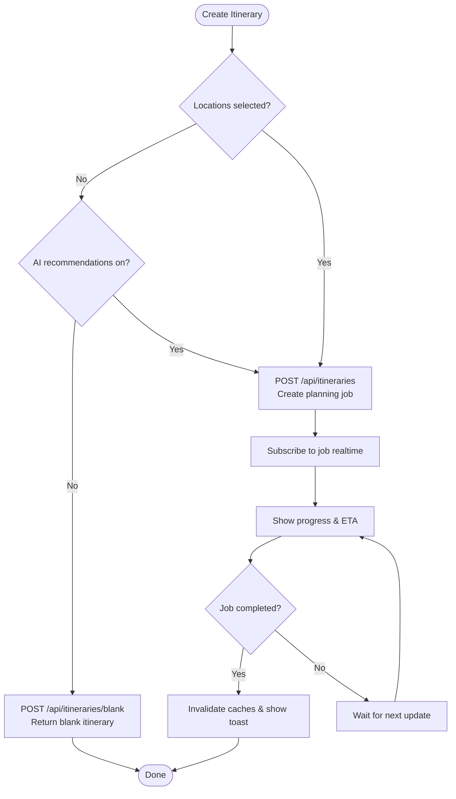
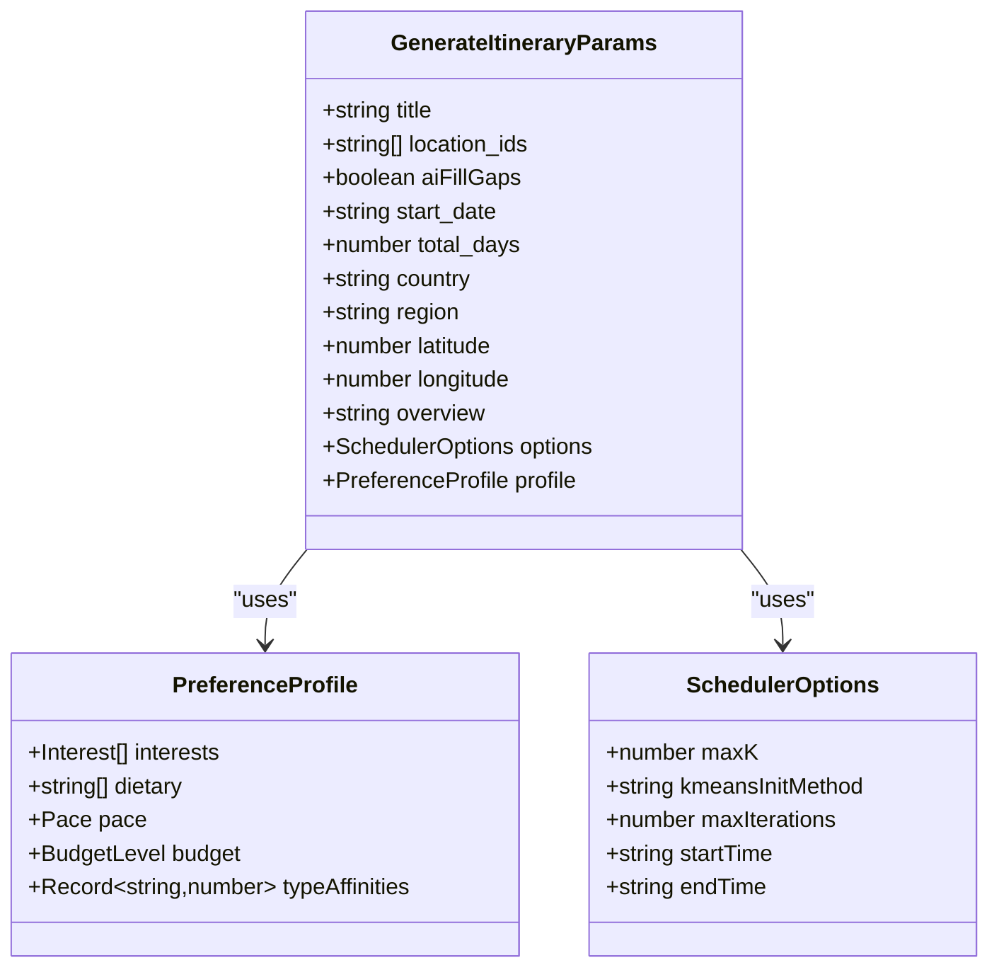
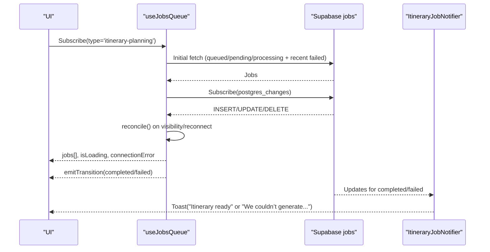
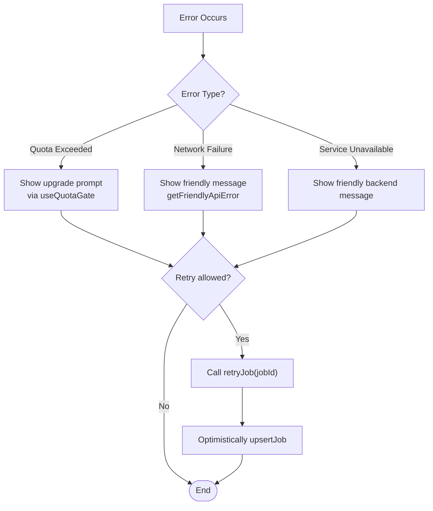
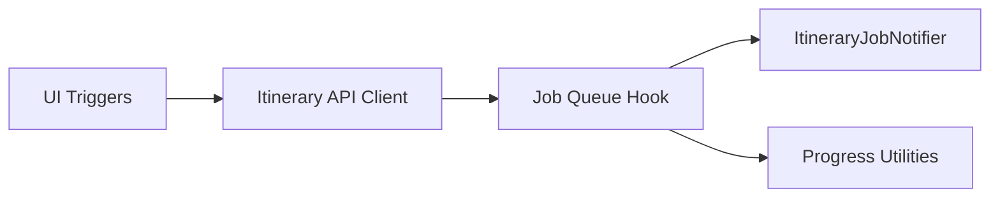

# Itinerary Generation Workflow

<cite>
**Referenced Files in This Document**
- [itineraries.ts](file://src/lib/api/itineraries.ts)
- [client.ts](file://src/lib/api/client.ts)
- [useJobsQueue.ts](file://src/hooks/useJobsQueue.ts)
- [ItineraryJobNotifier.tsx](file://src/components/notifications/ItineraryJobNotifier.tsx)
- [page.tsx (home)](file://src/app/home/page.tsx)
- [MainLayout.tsx](file://src/components/ui/layout/MainLayout.tsx)
- [page.tsx (itineraries list)](file://src/app/itineraries/page.tsx)
- [types.ts](file://src/lib/planner/types.ts)
- [userMessages.ts](file://src/lib/errors/userMessages.ts)
- [useQuotaGate.ts](file://src/hooks/useQuotaGate.ts)
- [useProgressEta.ts](file://src/hooks/useProgressEta.ts)
- [useProgressAnimation.ts](file://src/hooks/useProgressAnimation.ts)
</cite>

## Table of Contents
1. Introduction
2. Project Structure
3. Core Components
4. Architecture Overview
5. Detailed Component Analysis
6. Dependency Analysis
7. Performance Considerations
8. Troubleshooting Guide
9. Conclusion

## Introduction
This document explains the AI-powered itinerary generation workflow that turns content analysis results into structured travel plans. The system supports a dual-mode creation flow:
- Synchronous blank itinerary creation for immediate user feedback when no AI recommendations are requested and no locations are selected.
- Asynchronous AI-powered planning with intelligent activity recommendations, clustering, and route optimization when AI is enabled or locations are provided.

The workflow integrates an itinerary API with a job queue system. Jobs carry location data, time constraints, and user preferences. Progress is tracked via a progress object and surfaced to the UI through realtime updates. On completion, itineraries are surfaced to users with optimistic UI updates and notifications. Error handling covers quota exceeded, network failures, and service unavailability with friendly messaging and retry mechanisms.

## Project Structure
The itinerary generation feature spans client-side hooks, API clients, UI components, and a job queue backed by Supabase realtime channels. Key areas:
- API layer: Itinerary endpoints and job helpers
- Job queue hook: Realtime tracking of queued, processing, completed, failed jobs
- UI triggers: Home page, navbar, and itineraries list initiate creation
- Notifications: Global notifier surfaces completion and failure toasts
- Planner types: Preference profile and scheduler options passed to the backend

**Diagram sources**
- [page.tsx (home):492-516](file://src/app/home/page.tsx#L492-L516)
- [MainLayout.tsx:181-216](file://src/components/ui/layout/MainLayout.tsx#L181-L216)
- [page.tsx (itineraries list):201-223](file://src/app/itineraries/page.tsx#L201-L223)
- [itineraries.ts:339-439](file://src/lib/api/itineraries.ts#L339-L439)
- [client.ts:109-155](file://src/lib/api/client.ts#L109-L155)
- [useJobsQueue.ts:167-260](file://src/hooks/useJobsQueue.ts#L167-L260)
- [ItineraryJobNotifier.tsx:29-85](file://src/components/notifications/ItineraryJobNotifier.tsx#L29-L85)
- [useProgressAnimation.ts:18-103](file://src/hooks/useProgressAnimation.ts#L18-L103)
- [useProgressEta.ts:22-59](file://src/hooks/useProgressEta.ts#L22-L59)

**Section sources**
- [itineraries.ts:339-439](file://src/lib/api/itineraries.ts#L339-L439)
- [useJobsQueue.ts:6-34](file://src/hooks/useJobsQueue.ts#L6-L34)
- [ItineraryJobNotifier.tsx:1-92](file://src/components/notifications/ItineraryJobNotifier.tsx#L1-L92)
- [page.tsx (home):492-516](file://src/app/home/page.tsx#L492-L516)
- [MainLayout.tsx:181-216](file://src/components/ui/layout/MainLayout.tsx#L181-L216)
- [page.tsx (itineraries list):201-223](file://src/app/itineraries/page.tsx#L201-L223)

## Core Components
- Itinerary API client: Creates blank itineraries synchronously and initiates async AI planning jobs; defines payload types and error classes.
- Job queue hook: Subscribes to realtime job updates, reconciles missed updates, and exposes callbacks for completion/failure/rejection.
- Notification component: Listens for job status changes and shows toasts with actions (e.g., View itinerary).
- Progress utilities: Compute ETA countdowns and animated progress bars based on worker-reported progress.
- Planner types: Define preference profiles and scheduler options consumed by the backend planner.

Key responsibilities:
- Routing creation requests to either blank creation or async planning based on inputs.
- Tracking job lifecycle and surfacing progress to users.
- Handling errors gracefully with user-friendly messages and retry flows.

**Section sources**
- [itineraries.ts:59-120](file://src/lib/api/itineraries.ts#L59-L120)
- [itineraries.ts:339-439](file://src/lib/api/itineraries.ts#L339-L439)
- [useJobsQueue.ts:45-295](file://src/hooks/useJobsQueue.ts#L45-L295)
- [ItineraryJobNotifier.tsx:29-85](file://src/components/notifications/ItineraryJobNotifier.tsx#L29-L85)
- [useProgressEta.ts:22-59](file://src/hooks/useProgressEta.ts#L22-L59)
- [useProgressAnimation.ts:18-103](file://src/hooks/useProgressAnimation.ts#L18-L103)
- [types.ts:25-49](file://src/lib/planner/types.ts#L25-L49)

## Architecture Overview
The end-to-end flow begins at UI entry points, routes to the appropriate API endpoint, creates a job if needed, and uses realtime updates to drive UI state and notifications.

**Diagram sources**
- [page.tsx (home):492-516](file://src/app/home/page.tsx#L492-L516)
- [MainLayout.tsx:181-216](file://src/components/ui/layout/MainLayout.tsx#L181-L216)
- [page.tsx (itineraries list):201-223](file://src/app/itineraries/page.tsx#L201-L223)
- [itineraries.ts:339-439](file://src/lib/api/itineraries.ts#L339-L439)
- [useJobsQueue.ts:167-260](file://src/hooks/useJobsQueue.ts#L167-L260)
- [ItineraryJobNotifier.tsx:29-85](file://src/components/notifications/ItineraryJobNotifier.tsx#L29-L85)

## Detailed Component Analysis

### Dual-mode Creation Flow
- Synchronous blank creation: When no locations are selected and AI recommendations are disabled, the client calls the blank endpoint to return an empty itinerary immediately.
- Asynchronous AI planning: For all other cases (AI enabled or locations present), the client posts a planning job and returns a job object. The UI subscribes to realtime updates to track progress and display completion.

**Diagram sources**
- [itineraries.ts:339-439](file://src/lib/api/itineraries.ts#L339-L439)
- [page.tsx (home):492-516](file://src/app/home/page.tsx#L492-L516)
- [MainLayout.tsx:181-216](file://src/components/ui/layout/MainLayout.tsx#L181-L216)
- [page.tsx (itineraries list):201-223](file://src/app/itineraries/page.tsx#L201-L223)

**Section sources**
- [itineraries.ts:339-439](file://src/lib/api/itineraries.ts#L339-L439)
- [page.tsx (home):492-516](file://src/app/home/page.tsx#L492-L516)
- [MainLayout.tsx:181-216](file://src/components/ui/layout/MainLayout.tsx#L181-L216)
- [page.tsx (itineraries list):201-223](file://src/app/itineraries/page.tsx#L201-L223)

### Job Payload Structure
The planning job payload includes:
- Location data: Array of location IDs to include in planning.
- Time constraints: Start date and total days (and optionally end date).
- Region and coordinates: Country, region, latitude, longitude for geographic context.
- Preferences and options: PreferenceProfile (interests, dietary, pace, budget) and SchedulerOptions (clustering/packing knobs, daily start/end times).
- AI toggle: aiFillGaps controls whether gap-filling and meal discovery run.

**Diagram sources**
- [itineraries.ts:59-78](file://src/lib/api/itineraries.ts#L59-L78)
- [types.ts:25-49](file://src/lib/planner/types.ts#L25-L49)

**Section sources**
- [itineraries.ts:59-78](file://src/lib/api/itineraries.ts#L59-L78)
- [types.ts:25-49](file://src/lib/planner/types.ts#L25-L49)

### Job Queue Integration and Progress Tracking
- Job creation: Planning jobs are created via the itinerary API and returned to the client.
- Realtime subscription: The hook subscribes to Supabase realtime events for the jobs table filtered by user_id and type.
- Reconciliation: On visibility change or reconnect, the hook re-reads in-flight jobs to settle any missed updates.
- Progress object: Workers report step, label, fired_at, percent, eta_seconds, stage, done/total, next_percent, stage_ms. The UI uses these to animate progress and compute ETA.
- Completion handling: On completion, caches are invalidated and a toast is shown with a link to view the itinerary.

**Diagram sources**
- [useJobsQueue.ts:78-260](file://src/hooks/useJobsQueue.ts#L78-L260)
- [ItineraryJobNotifier.tsx:29-85](file://src/components/notifications/ItineraryJobNotifier.tsx#L29-L85)

**Section sources**
- [useJobsQueue.ts:78-260](file://src/hooks/useJobsQueue.ts#L78-L260)
- [ItineraryJobNotifier.tsx:29-85](file://src/components/notifications/ItineraryJobNotifier.tsx#L29-L85)

### Result Handling Upon Completion
- Optimistic card build: The itineraries list builds an optimistic itinerary from the completed job’s result and payload to avoid layout shifts while refetching.
- Cache invalidation: Realtime notifier invalidates queries for itineraries, upcoming itineraries, and usage metrics.
- Toast action: Completion toast includes a “View” action linking to the new itinerary.

**Section sources**
- [page.tsx (itineraries list):32-122](file://src/app/itineraries/page.tsx#L32-L122)
- [ItineraryJobNotifier.tsx:57-85](file://src/components/notifications/ItineraryJobNotifier.tsx#L57-L85)

### Error Handling Strategies
- Quota exceeded:
  - Itinerary quota: The API client throws a typed ItineraryQuotaError when the backend returns 403 with ITINERARY_QUOTA_EXCEEDED. Callers can catch this and show upgrade messaging via a centralized quota gate.
  - Link quota: Similar pattern exists for links using LinkQuotaError.
- Network failures:
  - Friendly messages: getFriendlyApiError maps backend messages to safe strings; network-related errors surface a friendly message guiding users to check their connection.
  - Connection error state: The job queue tracks connection errors and can reconcile on reconnect to prevent stuck states.
- Service unavailability:
  - Backend messages like “Service temporarily unavailable” are whitelisted and surfaced safely.
  - Retry mechanism: retryJob endpoint allows users to retry failed or stuck jobs; the UI marks retrying state and clears it once the job leaves failed.

**Diagram sources**
- [itineraries.ts:89-119](file://src/lib/api/itineraries.ts#L89-L119)
- [client.ts:109-155](file://src/lib/api/client.ts#L109-L155)
- [userMessages.ts:94-106](file://src/lib/errors/userMessages.ts#L94-L106)
- [useQuotaGate.ts:16-40](file://src/hooks/useQuotaGate.ts#L16-L40)
- [useJobsQueue.ts:269-295](file://src/hooks/useJobsQueue.ts#L269-L295)

**Section sources**
- [itineraries.ts:89-119](file://src/lib/api/itineraries.ts#L89-L119)
- [client.ts:109-155](file://src/lib/api/client.ts#L109-L155)
- [userMessages.ts:94-106](file://src/lib/errors/userMessages.ts#L94-L106)
- [useQuotaGate.ts:16-40](file://src/hooks/useQuotaGate.ts#L16-L40)
- [useJobsQueue.ts:269-295](file://src/hooks/useJobsQueue.ts#L269-L295)

## Dependency Analysis
- UI triggers depend on the itinerary API client to decide between blank creation and async planning.
- The job queue hook depends on Supabase realtime to track job status and progress.
- The notification component depends on realtime updates to invalidate caches and show toasts.
- Progress utilities depend on the job’s progress object fields to compute ETA and animate the bar.

**Diagram sources**
- [page.tsx (home):492-516](file://src/app/home/page.tsx#L492-L516)
- [MainLayout.tsx:181-216](file://src/components/ui/layout/MainLayout.tsx#L181-L216)
- [page.tsx (itineraries list):201-223](file://src/app/itineraries/page.tsx#L201-L223)
- [itineraries.ts:339-439](file://src/lib/api/itineraries.ts#L339-L439)
- [useJobsQueue.ts:167-260](file://src/hooks/useJobsQueue.ts#L167-L260)
- [ItineraryJobNotifier.tsx:29-85](file://src/components/notifications/ItineraryJobNotifier.tsx#L29-L85)
- [useProgressEta.ts:22-59](file://src/hooks/useProgressEta.ts#L22-L59)
- [useProgressAnimation.ts:18-103](file://src/hooks/useProgressAnimation.ts#L18-L103)

**Section sources**
- [useJobsQueue.ts:167-260](file://src/hooks/useJobsQueue.ts#L167-L260)
- [ItineraryJobNotifier.tsx:29-85](file://src/components/notifications/ItineraryJobNotifier.tsx#L29-L85)
- [useProgressEta.ts:22-59](file://src/hooks/useProgressEta.ts#L22-L59)
- [useProgressAnimation.ts:18-103](file://src/hooks/useProgressAnimation.ts#L18-L103)

## Performance Considerations
- Realtime efficiency: The hook filters updates by user_id and type to minimize noise and avoids redundant state updates by tracking previous statuses.
- Reconciliation: Prevents stuck in-flight jobs by re-reading rows on visibility changes and reconnects.
- Progress UX: ETA countdowns and animated progress bars reduce perceived wait times without excessive server writes.
- Optimistic UI: Building an optimistic itinerary from job results prevents layout shifts during refetches.

[No sources needed since this section provides general guidance]

## Troubleshooting Guide
Common issues and resolutions:
- Quota exceeded:
  - Symptom: Error thrown with ItineraryQuotaError or LinkQuotaError.
  - Resolution: Show upgrade prompt via useQuotaGate; guide users to billing.
- Network failures:
  - Symptom: getFriendlyApiError returns a friendly message; connectionError may be set in the job queue.
  - Resolution: Prompt users to check connectivity; rely on reconciliation to recover after reconnect.
- Service unavailability:
  - Symptom: Backend returns a friendly message like “Service temporarily unavailable”.
  - Resolution: Display the whitelisted message; allow retry later.
- Stuck jobs:
  - Symptom: Job remains in queued/pending/processing beyond expected duration.
  - Resolution: Use retryJob to restart processing; UI marks retrying state until backend acknowledges.

**Section sources**
- [itineraries.ts:89-119](file://src/lib/api/itineraries.ts#L89-L119)
- [client.ts:109-155](file://src/lib/api/client.ts#L109-L155)
- [userMessages.ts:94-106](file://src/lib/errors/userMessages.ts#L94-L106)
- [useQuotaGate.ts:16-40](file://src/hooks/useQuotaGate.ts#L16-L40)
- [useJobsQueue.ts:269-295](file://src/hooks/useJobsQueue.ts#L269-L295)

## Conclusion
The itinerary generation workflow combines synchronous blank creation for immediate feedback with asynchronous AI-powered planning for intelligent recommendations. The job queue system provides robust progress tracking and resilient handling of realtime updates. Error strategies ensure users receive friendly messages and actionable steps, including retries and upgrade prompts. Together, these components deliver a responsive and reliable experience for generating personalized travel plans.