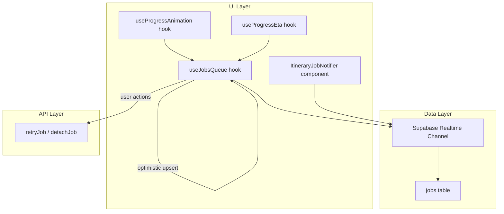
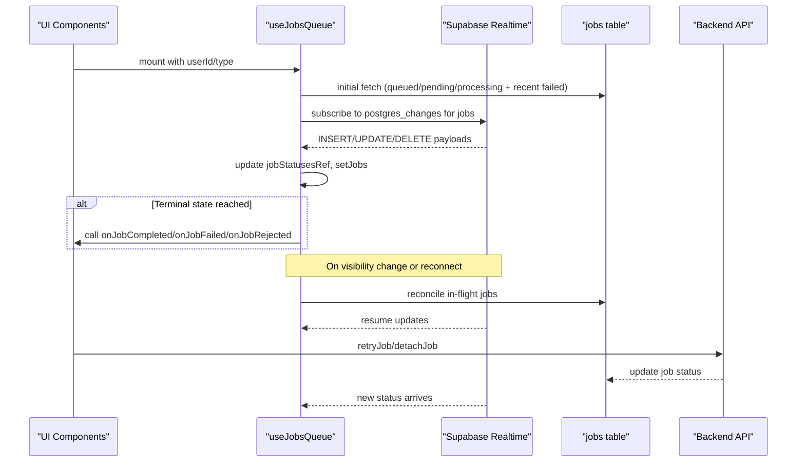
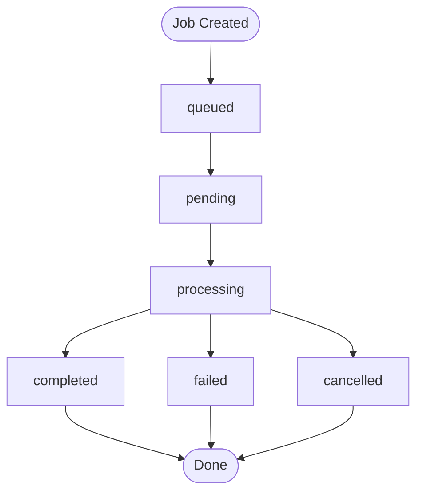
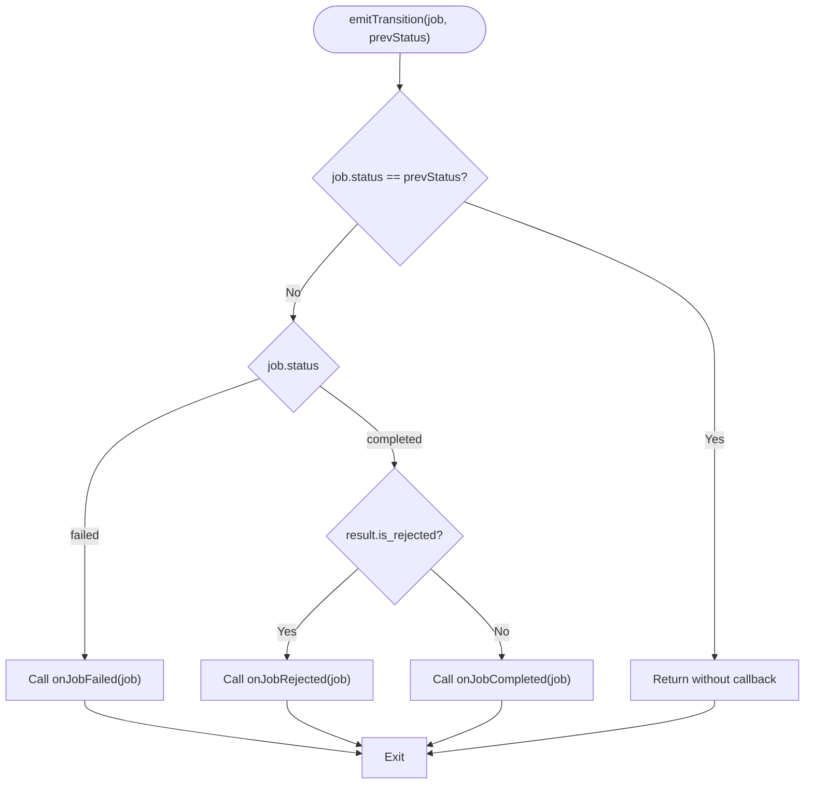
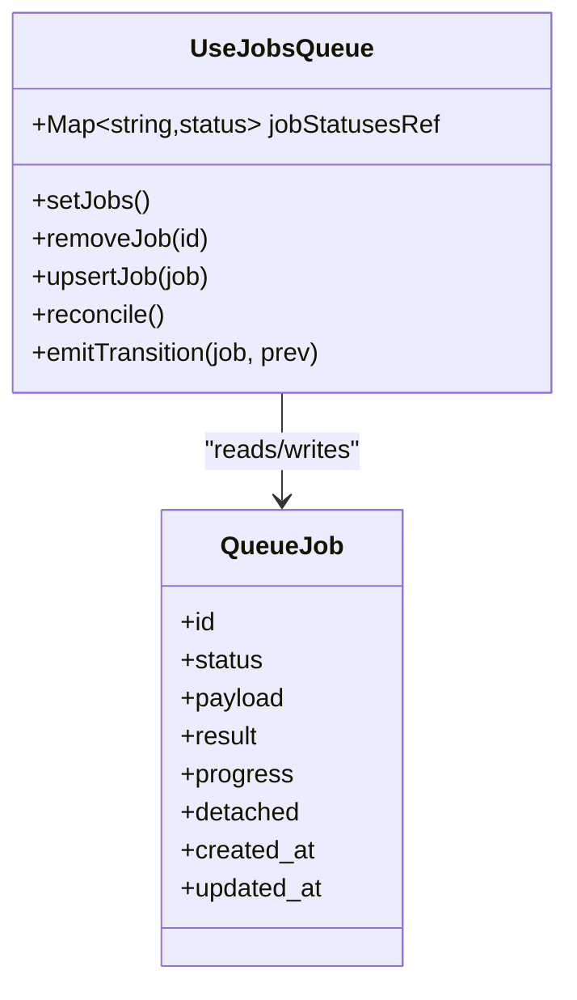
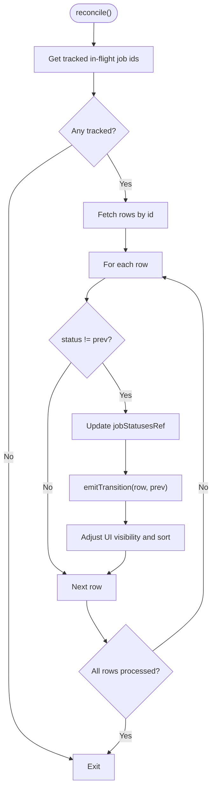
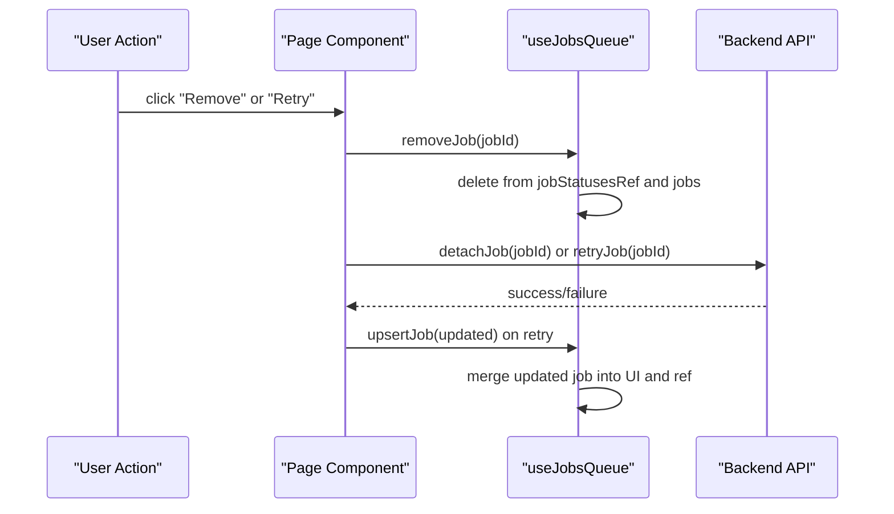
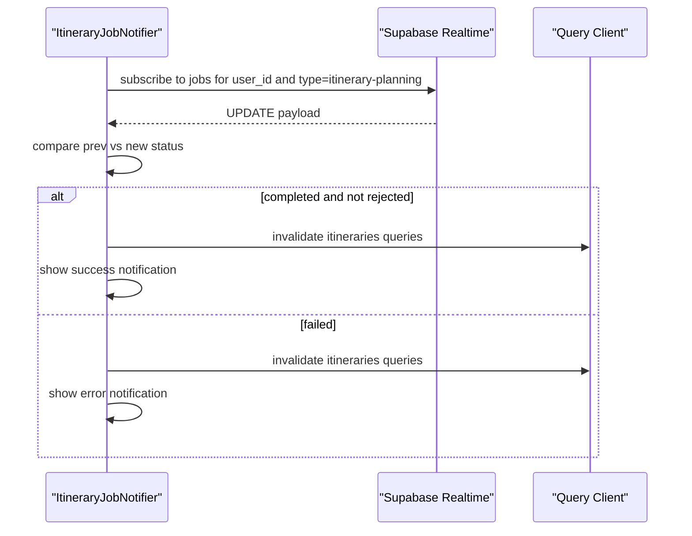
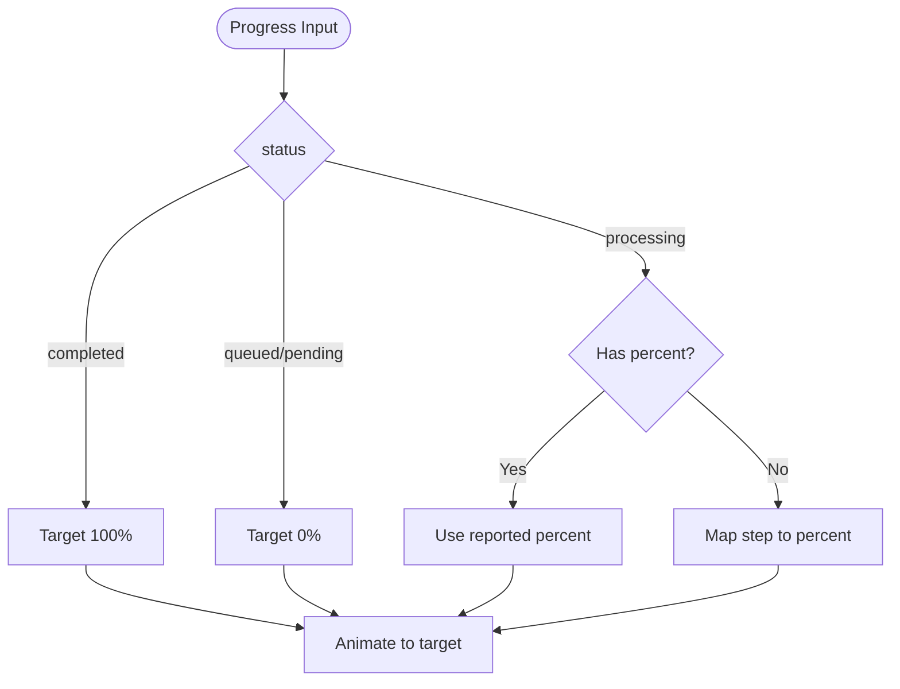
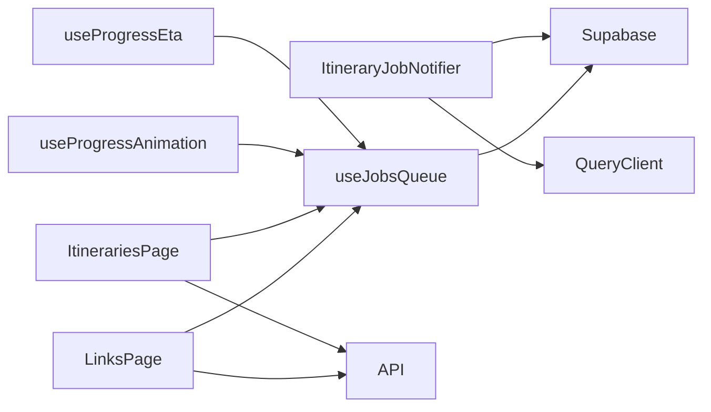

# Job Lifecycle & State Management

<cite>
**Referenced Files in This Document**
- [useJobsQueue.ts](file://src/hooks/useJobsQueue.ts)
- [ItineraryJobNotifier.tsx](file://src/components/notifications/ItineraryJobNotifier.tsx)
- [client.ts](file://src/lib/api/client.ts)
- [page.tsx (links)](file://src/app/links/page.tsx)
- [page.tsx (itineraries)](file://src/app/itineraries/page.tsx)
- [useProgressAnimation.ts](file://src/hooks/useProgressAnimation.ts)
- [useProgressEta.ts](file://src/hooks/useProgressEta.ts)
</cite>

## Table of Contents
1. Introduction
2. Project Structure
3. Core Components
4. Architecture Overview
5. Detailed Component Analysis
6. Dependency Analysis
7. Performance Considerations
8. Troubleshooting Guide
9. Conclusion

## Introduction
This document explains how jobs are tracked and transitioned through their lifecycle in the application, focusing on state transitions from pending to queued, processing, completed, failed, or cancelled. It details the emitTransition function that triggers terminal callbacks for completion, failure, and rejection scenarios; the jobStatusesRef Map used to detect meaningful transitions and avoid duplicate notifications; and the reconcile function that restores consistent UI state after disconnections by reconciling in-flight jobs. It also covers removal strategies, cleanup procedures, and memory management considerations for long-running applications.

## Project Structure
The job lifecycle is implemented primarily in a React hook that subscribes to realtime database changes, maintains local state, and exposes helpers for optimistic updates and manual removal. Supporting components handle user-facing notifications and progress visualization.

**Diagram sources**
- [useJobsQueue.ts:45-295](file://src/hooks/useJobsQueue.ts#L45-L295)
- [ItineraryJobNotifier.tsx:10-92](file://src/components/notifications/ItineraryJobNotifier.tsx#L10-L92)
- [client.ts:147-155](file://src/lib/api/client.ts#L147-L155)
- [useProgressAnimation.ts:1-41](file://src/hooks/useProgressAnimation.ts#L1-L41)
- [useProgressEta.ts:1-59](file://src/hooks/useProgressEta.ts#L1-L59)

**Section sources**
- [useJobsQueue.ts:45-295](file://src/hooks/useJobsQueue.ts#L45-L295)
- [ItineraryJobNotifier.tsx:10-92](file://src/components/notifications/ItineraryJobNotifier.tsx#L10-L92)
- [client.ts:147-155](file://src/lib/api/client.ts#L147-L155)
- [useProgressAnimation.ts:1-41](file://src/hooks/useProgressAnimation.ts#L1-L41)
- [useProgressEta.ts:1-59](file://src/hooks/useProgressEta.ts#L1-L59)

## Core Components
- useJobsQueue: Central hook that manages job state, subscribes to realtime updates, detects transitions, emits terminal callbacks, reconciles in-flight jobs, and provides remove/upsert helpers.
- ItineraryJobNotifier: A dedicated notifier that listens to job updates for itinerary planning and shows user notifications on completion or failure.
- API client functions: retryJob and detachJob for resuming or detaching jobs via backend endpoints.
- Progress hooks: useProgressAnimation and useProgressEta translate job status and progress into visual feedback.

Key responsibilities:
- Maintain a per-job last-known status map to detect only meaningful transitions.
- Emit terminal callbacks when jobs complete, fail, or are rejected.
- Reconcile missed updates after backgrounding or reconnects.
- Provide safe removal and optimistic update paths.

**Section sources**
- [useJobsQueue.ts:45-295](file://src/hooks/useJobsQueue.ts#L45-L295)
- [ItineraryJobNotifier.tsx:10-92](file://src/components/notifications/ItineraryJobNotifier.tsx#L10-L92)
- [client.ts:147-155](file://src/lib/api/client.ts#L147-L155)
- [useProgressAnimation.ts:1-41](file://src/hooks/useProgressAnimation.ts#L1-L41)
- [useProgressEta.ts:1-59](file://src/hooks/useProgressEta.ts#L1-L59)

## Architecture Overview
The system combines realtime database subscriptions with local reconciliation to ensure robust job lifecycle handling even under network interruptions.

**Diagram sources**
- [useJobsQueue.ts:78-267](file://src/hooks/useJobsQueue.ts#L78-L267)
- [client.ts:147-155](file://src/lib/api/client.ts#L147-L155)

## Detailed Component Analysis

### Job Lifecycle States and Transitions
- States: pending, queued, processing, completed, failed, cancelled.
- Typical flow:
  - Creation: inserted with queued or pending.
  - Dispatch: transitions to processing.
  - Completion: transitions to completed; if result indicates rejection, treat as rejected.
  - Failure: transitions to failed.
  - Cancellation: transitions to cancelled (not shown in queue unless explicitly handled).
- Visibility rules:
  - Active jobs: queued, pending, processing.
  - Recent failures: failed within 24 hours are visible to allow retries.
  - Detached jobs: excluded from the queue view.

**Section sources**
- [useJobsQueue.ts:6-34](file://src/hooks/useJobsQueue.ts#L6-L34)
- [useJobsQueue.ts:138-159](file://src/hooks/useJobsQueue.ts#L138-L159)
- [useJobsQueue.ts:184-247](file://src/hooks/useJobsQueue.ts#L184-L247)

### emitTransition: Terminal State Callbacks
- Purpose: Invokes appropriate callbacks when a job reaches a terminal state.
- Behavior:
  - If status changed to failed: invoke onJobFailed.
  - If status changed to completed:
    - If result contains is_rejected: invoke onJobRejected.
    - Otherwise: invoke onJobCompleted.
  - Skips invocation if no actual transition occurred (compared against previous status).
- Integration points:
  - Called during realtime UPDATE handling.
  - Called during reconciliation for missed updates.

**Diagram sources**
- [useJobsQueue.ts:89-103](file://src/hooks/useJobsQueue.ts#L89-L103)

**Section sources**
- [useJobsQueue.ts:89-103](file://src/hooks/useJobsQueue.ts#L89-L103)
- [useJobsQueue.ts:213-218](file://src/hooks/useJobsQueue.ts#L213-L218)
- [useJobsQueue.ts:118-124](file://src/hooks/useJobsQueue.ts#L118-L124)

### jobStatusesRef: Transition Detection and Deduplication
- Data structure: Map from job id to last known status.
- Responsibilities:
  - Track last status per job to detect only meaningful transitions.
  - Avoid duplicate notifications on repeated updates.
  - Support reconcile pass by providing baseline statuses.
- Update points:
  - On INSERT: set initial status for new jobs.
  - On UPDATE: update to latest status before emitting transition.
  - On reconcile: refresh statuses for tracked in-flight jobs.
  - On remove/upsert: keep map in sync with UI state.

**Diagram sources**
- [useJobsQueue.ts:68-76](file://src/hooks/useJobsQueue.ts#L68-L76)
- [useJobsQueue.ts:184-218](file://src/hooks/useJobsQueue.ts#L184-L218)
- [useJobsQueue.ts:269-292](file://src/hooks/useJobsQueue.ts#L269-L292)

**Section sources**
- [useJobsQueue.ts:68-76](file://src/hooks/useJobsQueue.ts#L68-L76)
- [useJobsQueue.ts:184-218](file://src/hooks/useJobsQueue.ts#L184-L218)
- [useJobsQueue.ts:269-292](file://src/hooks/useJobsQueue.ts#L269-L292)

### reconcile: Background State Reconciliation
- Trigger points:
  - On tab becoming visible.
  - On realtime channel re-subscription.
- Process:
  - Identify tracked jobs still considered in-flight (queued, pending, processing).
  - Fetch current rows for those ids.
  - For each row:
    - Compare with last known status.
    - If changed, update jobStatusesRef, emit transition, and adjust UI visibility.
  - Remove jobs from UI if they are no longer visible (e.g., completed or detached).
- Benefits:
  - Ensures UI consistency after backgrounding, sleep, or brief offline periods.
  - Prevents “stuck” mid-progress cards.

**Diagram sources**
- [useJobsQueue.ts:105-136](file://src/hooks/useJobsQueue.ts#L105-L136)
- [useJobsQueue.ts:161-165](file://src/hooks/useJobsQueue.ts#L161-L165)
- [useJobsQueue.ts:250-259](file://src/hooks/useJobsQueue.ts#L250-L259)

**Section sources**
- [useJobsQueue.ts:105-136](file://src/hooks/useJobsQueue.ts#L105-L136)
- [useJobsQueue.ts:161-165](file://src/hooks/useJobsQueue.ts#L161-L165)
- [useJobsQueue.ts:250-259](file://src/hooks/useJobsQueue.ts#L250-L259)

### Removal Strategies, Cleanup, and Memory Management
- Removal:
  - removeJob deletes the job from both UI state and jobStatusesRef to prevent stale tracking.
  - detachJob calls backend to mark job as detached so it is excluded from queue views.
- Cleanup:
  - On unmount, the hook removes event listeners and supabase channels to free resources.
  - Visibility listener triggers reconcile to settle any missed updates.
- Memory considerations:
  - jobStatusesRef grows with active jobs; removing jobs prevents leaks.
  - Only recent failed jobs (within 24 hours) remain visible to reduce UI clutter and memory pressure.
  - Optimistic upsert ensures immediate UI feedback without waiting for realtime, reducing perceived latency.

**Diagram sources**
- [useJobsQueue.ts:269-292](file://src/hooks/useJobsQueue.ts#L269-L292)
- [client.ts:147-155](file://src/lib/api/client.ts#L147-L155)
- [page.tsx (links):199-219](file://src/app/links/page.tsx#L199-L219)
- [page.tsx (itineraries):137-162](file://src/app/itineraries/page.tsx#L137-L162)

**Section sources**
- [useJobsQueue.ts:262-267](file://src/hooks/useJobsQueue.ts#L262-L267)
- [useJobsQueue.ts:269-292](file://src/hooks/useJobsQueue.ts#L269-L292)
- [client.ts:147-155](file://src/lib/api/client.ts#L147-L155)
- [page.tsx (links):199-219](file://src/app/links/page.tsx#L199-L219)
- [page.tsx (itineraries):137-162](file://src/app/itineraries/page.tsx#L137-L162)

### Notification Handling for Itinerary Jobs
- ItineraryJobNotifier subscribes specifically to itinerary-planning jobs and shows user notifications on completion or failure.
- Uses its own status map to avoid duplicate notifications and invalidates relevant caches upon completion.

**Diagram sources**
- [ItineraryJobNotifier.tsx:29-88](file://src/components/notifications/ItineraryJobNotifier.tsx#L29-L88)

**Section sources**
- [ItineraryJobNotifier.tsx:29-88](file://src/components/notifications/ItineraryJobNotifier.tsx#L29-L88)

### Progress Visualization
- useProgressAnimation maps job status and progress to a target percentage for smooth UI animations.
- useProgressEta computes a human-friendly countdown based on worker-reported eta_seconds and fired_at timestamps.

**Diagram sources**
- [useProgressAnimation.ts:18-31](file://src/hooks/useProgressAnimation.ts#L18-L31)
- [useProgressEta.ts:30-59](file://src/hooks/useProgressEta.ts#L30-L59)

**Section sources**
- [useProgressAnimation.ts:18-31](file://src/hooks/useProgressAnimation.ts#L18-L31)
- [useProgressEta.ts:30-59](file://src/hooks/useProgressEta.ts#L30-L59)

## Dependency Analysis
- useJobsQueue depends on:
  - Supabase client for realtime subscriptions and queries.
  - React hooks for state and lifecycle management.
  - Optional type filter to scope jobs by type.
- ItineraryJobNotifier depends on:
  - Supabase client and query client cache invalidation.
- Pages depend on:
  - useJobsQueue for queue state and helpers.
  - API client for retry and detach operations.
  - Progress hooks for UX enhancements.

**Diagram sources**
- [useJobsQueue.ts:45-295](file://src/hooks/useJobsQueue.ts#L45-L295)
- [ItineraryJobNotifier.tsx:10-92](file://src/components/notifications/ItineraryJobNotifier.tsx#L10-L92)
- [client.ts:147-155](file://src/lib/api/client.ts#L147-L155)
- [page.tsx (links):199-219](file://src/app/links/page.tsx#L199-L219)
- [page.tsx (itineraries):137-162](file://src/app/itineraries/page.tsx#L137-L162)
- [useProgressAnimation.ts:1-41](file://src/hooks/useProgressAnimation.ts#L1-L41)
- [useProgressEta.ts:1-59](file://src/hooks/useProgressEta.ts#L1-L59)

**Section sources**
- [useJobsQueue.ts:45-295](file://src/hooks/useJobsQueue.ts#L45-L295)
- [ItineraryJobNotifier.tsx:10-92](file://src/components/notifications/ItineraryJobNotifier.tsx#L10-L92)
- [client.ts:147-155](file://src/lib/api/client.ts#L147-L155)
- [page.tsx (links):199-219](file://src/app/links/page.tsx#L199-L219)
- [page.tsx (itineraries):137-162](file://src/app/itineraries/page.tsx#L137-L162)
- [useProgressAnimation.ts:1-41](file://src/hooks/useProgressAnimation.ts#L1-L41)
- [useProgressEta.ts:1-59](file://src/hooks/useProgressEta.ts#L1-L59)

## Performance Considerations
- Minimize redundant notifications by relying on jobStatusesRef to detect only meaningful transitions.
- Keep UI responsive by filtering out detached jobs and older failed jobs beyond 24 hours.
- Use optimistic upsert to provide immediate feedback while awaiting realtime updates.
- Reconcile on visibility change and reconnect to avoid stale states without excessive polling.
- Limit realtime channel scope by filtering on user_id and optionally job type to reduce payload size.

[No sources needed since this section provides general guidance]

## Troubleshooting Guide
Common issues and resolutions:
- Stuck mid-progress jobs:
  - Ensure reconcile runs on visibility change and reconnect; verify that tracked statuses include queued/pending/processing.
  - Check that jobStatusesRef is updated on INSERT/UPDATE events.
- Duplicate notifications:
  - Confirm emitTransition compares against prevStatus and only fires on actual transitions.
  - Verify jobStatusesRef is updated before calling emitTransition.
- Missing realtime updates:
  - Validate channel subscription status and handle CHANNEL_ERROR/TIMED_OUT by setting connectionError and triggering reconcile.
- UI not reflecting retries:
  - Use upsertJob immediately after retryJob returns to merge the updated row into the queue.
- Excessive memory usage:
  - Ensure removeJob cleans up jobStatusesRef entries.
  - Rely on visibility filters to hide completed or detached jobs.

**Section sources**
- [useJobsQueue.ts:105-136](file://src/hooks/useJobsQueue.ts#L105-L136)
- [useJobsQueue.ts:184-218](file://src/hooks/useJobsQueue.ts#L184-L218)
- [useJobsQueue.ts:250-259](file://src/hooks/useJobsQueue.ts#L250-L259)
- [useJobsQueue.ts:269-292](file://src/hooks/useJobsQueue.ts#L269-L292)

## Conclusion
The job lifecycle management implementation uses a combination of realtime subscriptions, local state tracking, and reconciliation to ensure reliable state transitions and user feedback. The emitTransition function centralizes terminal callback logic, jobStatusesRef prevents duplicate notifications, and reconcile restores consistency after disconnections. Removal and cleanup strategies help maintain performance and memory efficiency in long-running applications. Together, these patterns provide a robust foundation for managing background jobs across the application.

[No sources needed since this section summarizes without analyzing specific files]