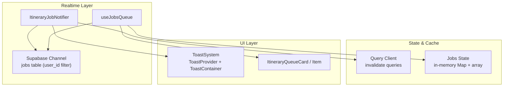
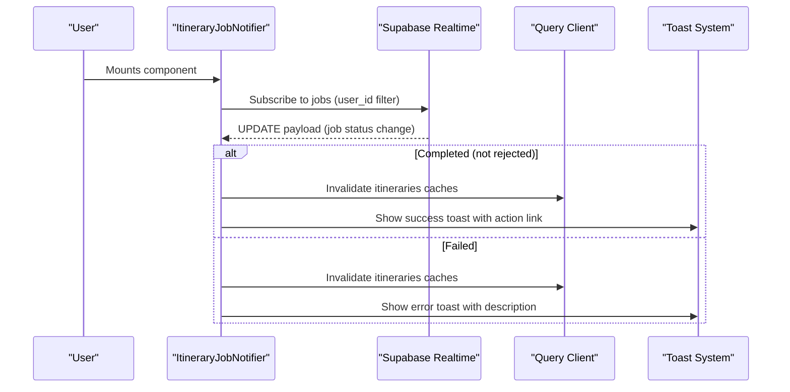
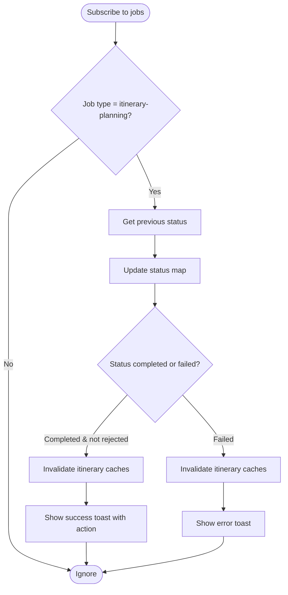
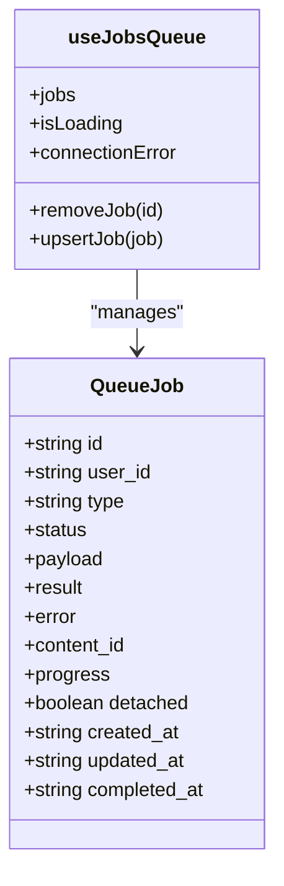
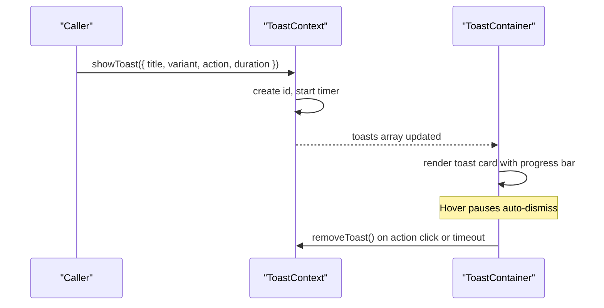
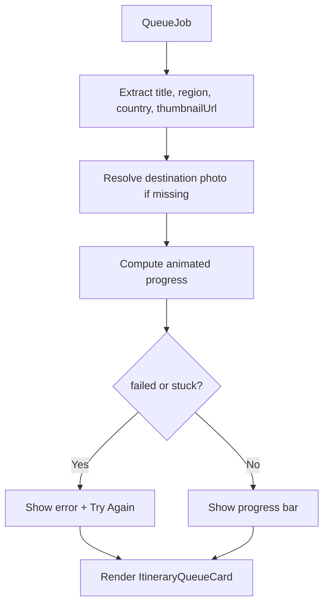
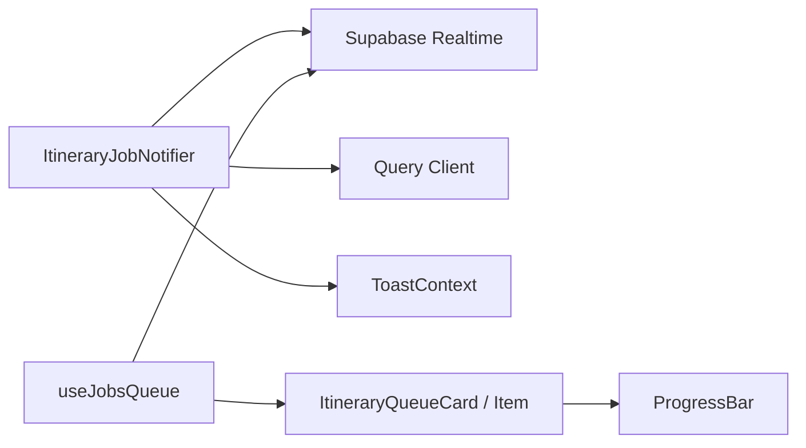

# Job Notification System

<cite>
**Referenced Files in This Document**
- [ItineraryJobNotifier.tsx](file://src/components/notifications/ItineraryJobNotifier.tsx)
- [useJobsQueue.ts](file://src/hooks/useJobsQueue.ts)
- [Toast.tsx](file://src/components/ui/primitives/Toast.tsx)
- [ToastContext.tsx](file://src/contexts/ToastContext.tsx)
- [ProgressBar.tsx](file://src/components/ui/primitives/ProgressBar.tsx)
- [ItineraryQueueCard.tsx](file://src/components/ui/itinerary/ItineraryQueueCard.tsx)
- [ItineraryQueueCardItem.tsx](file://src/components/ui/itinerary/ItineraryQueueCardItem.tsx)
- [queryKeys.ts](file://src/lib/query/queryKeys.ts)
</cite>

## Table of Contents
1. [Introduction](#introduction)
2. [Project Structure](#project-structure)
3. [Core Components](#core-components)
4. [Architecture Overview](#architecture-overview)
5. [Detailed Component Analysis](#detailed-component-analysis)
6. [Dependency Analysis](#dependency-analysis)
7. [Performance Considerations](#performance-considerations)
8. [Troubleshooting Guide](#troubleshooting-guide)
9. [Conclusion](#conclusion)
10. [Appendices](#appendices)

## Introduction
This document explains the ItineraryJobNotifier component and how it provides user feedback for AI processing jobs that generate itineraries. It covers:
- Real-time progress updates via a job queue hook
- Completion notifications with actionable links to results
- Error alerts with retry guidance
- Non-intrusive notification UX patterns
- Customization options for styling, positioning, and behavior

The notifier integrates with Supabase real-time channels to observe job status changes and uses a shared toast system to display contextual feedback without disrupting the user’s workflow.

## Project Structure
The notification system spans several layers:
- Realtime job observation: ItineraryJobNotifier subscribes to job updates for itinerary planning
- Queue state management: useJobsQueue maintains a live list of jobs with transitions and reconciliation
- UI presentation: Toast system renders non-blocking notifications; queue cards show in-context progress
- Data invalidation: Query cache is refreshed when jobs complete or fail

**Diagram sources**
- [ItineraryJobNotifier.tsx:29-88](file://src/components/notifications/ItineraryJobNotifier.tsx#L29-L88)
- [useJobsQueue.ts:78-267](file://src/hooks/useJobsQueue.ts#L78-L267)
- [Toast.tsx:47-174](file://src/components/ui/primitives/Toast.tsx#L47-L174)
- [ItineraryQueueCard.tsx:60-199](file://src/components/ui/itinerary/ItineraryQueueCard.tsx#L60-L199)
- [ItineraryQueueCardItem.tsx:39-101](file://src/components/ui/itinerary/ItineraryQueueCardItem.tsx#L39-L101)

**Section sources**
- [ItineraryJobNotifier.tsx:1-92](file://src/components/notifications/ItineraryJobNotifier.tsx#L1-L92)
- [useJobsQueue.ts:1-296](file://src/hooks/useJobsQueue.ts#L1-L296)
- [Toast.tsx:1-174](file://src/components/ui/primitives/Toast.tsx#L1-L174)
- [ItineraryQueueCard.tsx:1-199](file://src/components/ui/itinerary/ItineraryQueueCard.tsx#L1-L199)
- [ItineraryQueueCardItem.tsx:1-101](file://src/components/ui/itinerary/ItineraryQueueCardItem.tsx#L1-L101)

## Core Components
- ItineraryJobNotifier: Subscribes to job updates for itinerary-planning jobs and shows success/error toasts while invalidating relevant query caches.
- useJobsQueue: Manages a live queue of jobs per user, handles INSERT/UPDATE/DELETE events, reconciles missed updates, and exposes helpers to update local state.
- Toast system: Provides a global context to show, pause, resume, and remove toasts with variants and optional actions.
- ItineraryQueueCard and ItineraryQueueCardItem: Render in-context progress indicators for queued/processing jobs, including error states and retry flows.

Key responsibilities:
- Realtime event handling and deduplication
- Transition detection and side effects (cache invalidation, toasts)
- Local progress animation and ETA hints
- Non-blocking user feedback

**Section sources**
- [ItineraryJobNotifier.tsx:10-90](file://src/components/notifications/ItineraryJobNotifier.tsx#L10-L90)
- [useJobsQueue.ts:6-34](file://src/hooks/useJobsQueue.ts#L6-L34)
- [useJobsQueue.ts:45-295](file://src/hooks/useJobsQueue.ts#L45-L295)
- [ToastContext.tsx:12-36](file://src/contexts/ToastContext.tsx#L12-L36)
- [Toast.tsx:14-45](file://src/components/ui/primitives/Toast.tsx#L14-L45)
- [ItineraryQueueCard.tsx:12-53](file://src/components/ui/itinerary/ItineraryQueueCard.tsx#L12-L53)
- [ItineraryQueueCardItem.tsx:13-32](file://src/components/ui/itinerary/ItineraryQueueCardItem.tsx#L13-L32)

## Architecture Overview
The notifier listens to Supabase realtime updates for the jobs table filtered by user. On terminal transitions (completed/failed), it triggers cache invalidation and displays a toast. The queue hook manages a broader set of jobs and presents them as cards with progress bars and retry options.

**Diagram sources**
- [ItineraryJobNotifier.tsx:29-88](file://src/components/notifications/ItineraryJobNotifier.tsx#L29-L88)
- [queryKeys.ts:1-42](file://src/lib/query/queryKeys.ts#L1-L42)
- [ToastContext.tsx:90-98](file://src/contexts/ToastContext.tsx#L90-L98)

## Detailed Component Analysis

### ItineraryJobNotifier
- Purpose: Observe itinerary-planning job updates and provide user-facing feedback via toasts and cache invalidation.
- Realtime subscription: Creates a unique channel per instance using userId and an instanceId suffix to avoid channel sharing conflicts.
- Status tracking: Maintains a Map of job IDs to their last known status to detect transitions and avoid duplicate notifications.
- Side effects:
  - On completion (and not rejected): invalidates itinerary-related queries and shows a success toast with an optional “View” action linking to the new itinerary.
  - On failure: invalidates queries and shows an error toast with a friendly message.
- Cleanup: Unsubscribes from auth listeners and removes the realtime channel on unmount.

**Diagram sources**
- [ItineraryJobNotifier.tsx:35-88](file://src/components/notifications/ItineraryJobNotifier.tsx#L35-L88)

**Section sources**
- [ItineraryJobNotifier.tsx:10-90](file://src/components/notifications/ItineraryJobNotifier.tsx#L10-L90)

### useJobsQueue
- Purpose: Provide a reactive queue of jobs for a given user, with support for filtering by job type and callbacks on terminal transitions.
- Data model: Defines QueueJob with fields for id, user_id, type, status, payload, result, error, content_id, progress, detached, timestamps.
- Initial load: Fetches recent jobs (including recently failed ones) and sorts them so failures appear at the top, newest first within groups.
- Realtime handling: Listens to INSERT/UPDATE/DELETE events, updates local state, and emits transition callbacks for completed/failed/rejected statuses.
- Reconciliation: Periodically re-reads jobs still considered in-flight to recover from missed realtime messages (e.g., backgrounded tabs).
- Utilities: removeJob and upsertJob allow optimistic updates and immediate UI feedback.

**Diagram sources**
- [useJobsQueue.ts:6-34](file://src/hooks/useJobsQueue.ts#L6-L34)
- [useJobsQueue.ts:45-295](file://src/hooks/useJobsQueue.ts#L45-L295)

**Section sources**
- [useJobsQueue.ts:1-296](file://src/hooks/useJobsQueue.ts#L1-L296)

### Toast System
- Context: Provides showToast, removeToast, pauseToast, resumeToast, and access to current toasts and paused sets.
- Container: Renders toasts in a fixed bottom-right container with animations, accessibility attributes, and auto-dismiss progress bar.
- Variants: Supports default, success, and error variants; errors are treated as alerts with assertive aria-live.
- Actions: Optional action button with label and href; automatically hidden for error variant.
- Progress indicator: Thin bar drains over the configured duration; pausing resumes correctly after hover interactions.

**Diagram sources**
- [ToastContext.tsx:42-148](file://src/contexts/ToastContext.tsx#L42-L148)
- [Toast.tsx:47-174](file://src/components/ui/primitives/Toast.tsx#L47-L174)

**Section sources**
- [ToastContext.tsx:12-155](file://src/contexts/ToastContext.tsx#L12-L155)
- [Toast.tsx:1-174](file://src/components/ui/primitives/Toast.tsx#L1-L174)

### Itinerary Queue Cards
- ItineraryQueueCard: Visual representation of an in-flight job with media area, category badge, title, error messaging, retry button, and progress bar.
- ItineraryQueueCardItem: Bridges a QueueJob to the card, computes progress via animation hook, resolves destination photo, and determines retry eligibility based on failure or stuck thresholds.
- Progress: Uses ProgressBar with custom formatting to show “Waiting...” or percentage; supports smooth width transitions and accessible labels.

**Diagram sources**
- [ItineraryQueueCardItem.tsx:13-32](file://src/components/ui/itinerary/ItineraryQueueCardItem.tsx#L13-L32)
- [ItineraryQueueCardItem.tsx:39-101](file://src/components/ui/itinerary/ItineraryQueueCardItem.tsx#L39-L101)
- [ItineraryQueueCard.tsx:60-199](file://src/components/ui/itinerary/ItineraryQueueCard.tsx#L60-L199)
- [ProgressBar.tsx:7-66](file://src/components/ui/primitives/ProgressBar.tsx#L7-L66)

**Section sources**
- [ItineraryQueueCard.tsx:1-199](file://src/components/ui/itinerary/ItineraryQueueCard.tsx#L1-L199)
- [ItineraryQueueCardItem.tsx:1-101](file://src/components/ui/itinerary/ItineraryQueueCardItem.tsx#L1-L101)
- [ProgressBar.tsx:1-66](file://src/components/ui/primitives/ProgressBar.tsx#L1-L66)

## Dependency Analysis
- ItineraryJobNotifier depends on:
  - Supabase client for realtime subscriptions
  - Query client for cache invalidation
  - Toast context for user feedback
- useJobsQueue depends on:
  - Supabase client for initial fetch and realtime events
  - Local refs for status tracking and transition emission
- UI components depend on:
  - Progress utilities and motion primitives
  - Shared design tokens and utility classes

**Diagram sources**
- [ItineraryJobNotifier.tsx:29-88](file://src/components/notifications/ItineraryJobNotifier.tsx#L29-L88)
- [useJobsQueue.ts:78-267](file://src/hooks/useJobsQueue.ts#L78-L267)
- [ItineraryQueueCard.tsx:60-199](file://src/components/ui/itinerary/ItineraryQueueCard.tsx#L60-L199)
- [ProgressBar.tsx:20-66](file://src/components/ui/primitives/ProgressBar.tsx#L20-L66)

**Section sources**
- [ItineraryJobNotifier.tsx:1-92](file://src/components/notifications/ItineraryJobNotifier.tsx#L1-L92)
- [useJobsQueue.ts:1-296](file://src/hooks/useJobsQueue.ts#L1-L296)
- [ItineraryQueueCard.tsx:1-199](file://src/components/ui/itinerary/ItineraryQueueCard.tsx#L1-L199)
- [ProgressBar.tsx:1-66](file://src/components/ui/primitives/ProgressBar.tsx#L1-L66)

## Performance Considerations
- Realtime efficiency:
  - Unique channel per instance prevents duplicate subscriptions and avoids channel-sharing conflicts.
  - Filtering by user_id reduces noise and ensures only relevant updates are processed.
- State reconciliation:
  - Missed realtime messages are recovered by re-reading in-flight jobs, preventing stale progress states.
- UI responsiveness:
  - Optimistic merges and local progress animations keep the interface responsive even if backend updates lag.
- Cache invalidation:
  - Targeted invalidation of itinerary-related queries minimizes unnecessary refetches.

[No sources needed since this section provides general guidance]

## Troubleshooting Guide
Common issues and resolutions:
- No notifications appear:
  - Ensure the component is mounted within a provider that includes the ToastProvider.
  - Verify Supabase realtime connection and permissions for the jobs table.
- Duplicate or missing toasts:
  - Confirm that status transitions are detected correctly; check the status map logic and ensure prev vs current status comparison works.
- Stuck progress:
  - Use the visibilitychange handler and reconcile pass to refresh in-flight jobs; verify that the tab becomes visible again to trigger reconciliation.
- Retry not available:
  - Retry is shown for failed jobs or jobs stuck beyond a threshold; confirm job.updated_at and status to ensure eligibility.

**Section sources**
- [ItineraryJobNotifier.tsx:29-88](file://src/components/notifications/ItineraryJobNotifier.tsx#L29-L88)
- [useJobsQueue.ts:105-164](file://src/hooks/useJobsQueue.ts#L105-L164)
- [ItineraryQueueCardItem.tsx:9-11](file://src/components/ui/itinerary/ItineraryQueueCardItem.tsx#L9-L11)

## Conclusion
The ItineraryJobNotifier provides a robust, non-intrusive feedback layer for AI-driven itinerary generation. By combining Supabase realtime updates, targeted cache invalidation, and a flexible toast system, it delivers timely progress, success, and error notifications. Coupled with in-context queue cards, users receive comprehensive feedback without losing focus on their primary tasks.

[No sources needed since this section summarizes without analyzing specific files]

## Appendices

### Notification Types and UX Patterns
- Processing indicators:
  - In-context cards show progress bars and “Waiting...” states; toasts can also indicate ongoing work where appropriate.
- Success confirmations:
  - Toast with success variant and optional “View” action linking to the generated itinerary.
- Error alerts:
  - Toast with error variant and descriptive message; in-context cards offer retry buttons for failed or stuck jobs.

### Customization Options
- Styling:
  - Toast variants control visual emphasis; progress bar styles are consistent across components.
- Positioning:
  - Toasts render in a fixed bottom-right container; adjust container classes to reposition globally if needed.
- Behavior:
  - Auto-dismiss duration is configurable per toast; hover pauses and resumes timers for better UX.
  - Job-specific behaviors (retry eligibility, stuck thresholds) are encapsulated in queue card item logic.

**Section sources**
- [Toast.tsx:60-174](file://src/components/ui/primitives/Toast.tsx#L60-L174)
- [ToastContext.tsx:40-98](file://src/contexts/ToastContext.tsx#L40-L98)
- [ItineraryQueueCardItem.tsx:63-83](file://src/components/ui/itinerary/ItineraryQueueCardItem.tsx#L63-L83)