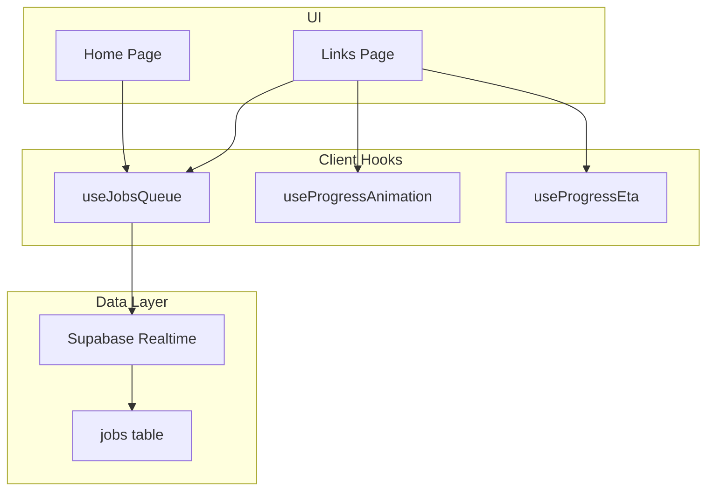
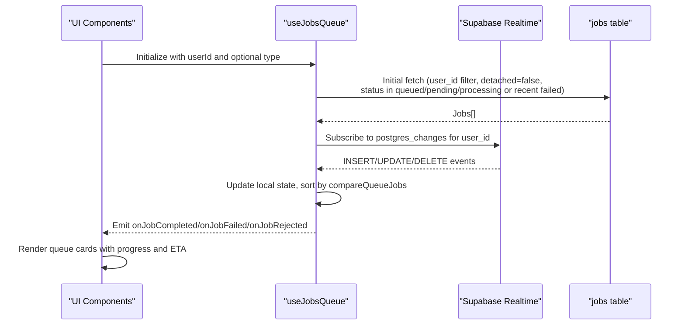
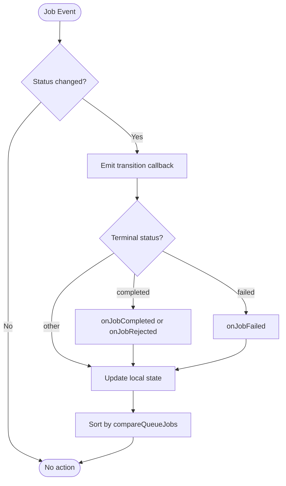
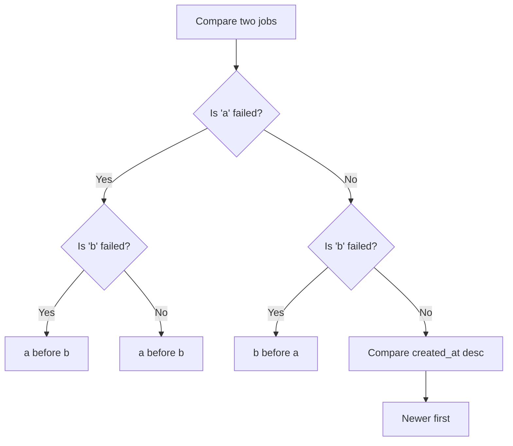
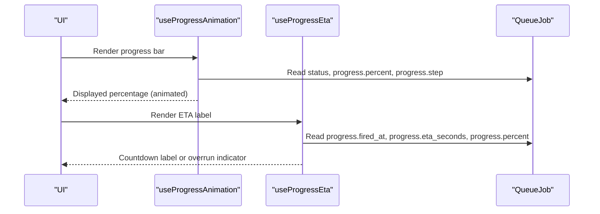
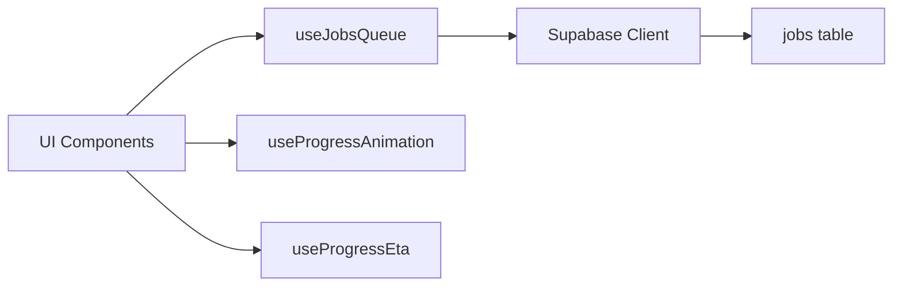

# Job Queue Interface & Data Model

<cite>
**Referenced Files in This Document**
- [useJobsQueue.ts](file://src/hooks/useJobsQueue.ts)
- [useProgressAnimation.ts](file://src/hooks/useProgressAnimation.ts)
- [useProgressEta.ts](file://src/hooks/useProgressEta.ts)
- [links/page.tsx](file://src/app/links/page.tsx)
- [home/page.tsx](file://src/app/home/page.tsx)
- [itineraries.ts](file://src/lib/api/itineraries.ts)
- [personalization-pipeline.md](file://docs/personalization-pipeline.md)
</cite>

## Table of Contents
1. [Introduction](#introduction)
2. [Project Structure](#project-structure)
3. [Core Components](#core-components)
4. [Architecture Overview](#architecture-overview)
5. [Detailed Component Analysis](#detailed-component-analysis)
6. [Dependency Analysis](#dependency-analysis)
7. [Performance Considerations](#performance-considerations)
8. [Troubleshooting Guide](#troubleshooting-guide)
9. [Conclusion](#conclusion)
10. [Appendices](#appendices)

## Introduction
This document explains the QueueJob interface and job queue data model used across the application to manage background tasks such as content analysis and itinerary planning. It covers all properties, status transitions, payload and result structures, error handling fields, content references, progress tracking with step-by-step updates, detached jobs, lifecycle timestamps, and the sorting algorithm that prioritizes failed jobs and recent timestamps. It also provides examples of different job types, status transitions, and progress object structures including percent, stage, eta_seconds, and timing information.

## Project Structure
The job queue is implemented as a client-side hook that subscribes to database changes for a user’s jobs, maintains local state, and exposes utilities to interact with the queue. Progress visualization and ETA countdowns are provided by dedicated hooks. UI components consume these hooks to render queue cards and react to job events.

**Diagram sources**
- [useJobsQueue.ts:1-296](file://src/hooks/useJobsQueue.ts#L1-L296)
- [useProgressAnimation.ts:1-103](file://src/hooks/useProgressAnimation.ts#L1-L103)
- [useProgressEta.ts:1-59](file://src/hooks/useProgressEta.ts#L1-L59)
- [links/page.tsx:1-200](file://src/app/links/page.tsx#L1-L200)
- [home/page.tsx:192-240](file://src/app/home/page.tsx#L192-L240)

**Section sources**
- [useJobsQueue.ts:1-296](file://src/hooks/useJobsQueue.ts#L1-L296)
- [links/page.tsx:1-200](file://src/app/links/page.tsx#L1-L200)
- [home/page.tsx:192-240](file://src/app/home/page.tsx#L192-L240)

## Core Components
- QueueJob interface: defines the shape of a job record, including identifiers, type, status, payload, result, error, content reference, progress, detached flag, and lifecycle timestamps.
- Sorting algorithm: compareQueueJobs ensures failed jobs appear first and within each group jobs are ordered by newest created_at first.
- useJobsQueue hook: manages fetching, realtime updates, visibility reconciliation, transition callbacks, and optimistic upserts.
- Progress hooks: useProgressAnimation computes visual progress; useProgressEta computes remaining time based on worker-provided estimates.

Key responsibilities:
- Track per-job status transitions and emit typed callbacks (completed, failed, rejected).
- Filter visible jobs by status and detached flag, including recently failed jobs for retry visibility.
- Maintain a stable, sorted list for consistent UI rendering.

**Section sources**
- [useJobsQueue.ts:6-43](file://src/hooks/useJobsQueue.ts#L6-L43)
- [useJobsQueue.ts:45-295](file://src/hooks/useJobsQueue.ts#L45-L295)
- [useProgressAnimation.ts:1-103](file://src/hooks/useProgressAnimation.ts#L1-L103)
- [useProgressEta.ts:1-59](file://src/hooks/useProgressEta.ts#L1-L59)

## Architecture Overview
The queue architecture centers around a single QueueJob type and a reactive hook that syncs with the database via Supabase realtime. UI components subscribe to job events and render queue cards. Progress and ETA are computed locally using worker-updated progress objects.

**Diagram sources**
- [useJobsQueue.ts:138-159](file://src/hooks/useJobsQueue.ts#L138-L159)
- [useJobsQueue.ts:167-248](file://src/hooks/useJobsQueue.ts#L167-L248)
- [useJobsQueue.ts:89-103](file://src/hooks/useJobsQueue.ts#L89-L103)

## Detailed Component Analysis

### QueueJob Interface and Data Model
- id: Unique identifier for the job.
- user_id: Owner of the job; used to scope queries and realtime subscriptions.
- type: Categorizes the job (e.g., "content-analysis", "itinerary-planning").
- status: Enum-like string union with values:
  - pending
  - queued
  - processing
  - completed
  - failed
  - cancelled
- payload: Arbitrary JSON object describing inputs required by the worker (e.g., url for link analysis).
- result: Optional JSON object containing the worker’s output when completed.
- error: Optional string capturing failure details.
- content_id: Optional reference to a related content entity (e.g., a link row); used to morph queue cards into content cards upon completion.
- progress: Optional structured object providing step-by-step updates:
  - step: numeric step ordinal
  - label: human-readable step description
  - fired_at: timestamp when the current stage started
  - thumbnail: optional preview image
  - percent: optional authoritative percentage from the worker (when present)
  - stage: optional named stage
  - eta_seconds: optional estimated seconds remaining
  - done: optional count of completed units
  - total: optional total units
  - next_percent: optional percentage where this stage ends (used for smooth crawling)
  - stage_ms: optional expected duration in ms for the current stage
- detached: Boolean indicating whether the job should be hidden from the active queue UI.
- created_at: Timestamp when the job was created.
- updated_at: Timestamp when the job was last updated.
- completed_at: Optional timestamp when the job reached terminal success.

Notes:
- The frontend treats “failed” jobs as visible only if they are recent (updated within 24 hours), enabling retry UX without cluttering the queue indefinitely.
- Detached jobs are excluded from the active queue display.

**Section sources**
- [useJobsQueue.ts:6-34](file://src/hooks/useJobsQueue.ts#L6-L34)
- [useJobsQueue.ts:125-133](file://src/hooks/useJobsQueue.ts#L125-L133)
- [personalization-pipeline.md:912-923](file://docs/personalization-pipeline.md#L912-L923)

### Status Transitions and Lifecycle Management
- Transitions are detected by comparing previous and current statuses per job.
- Terminal transitions trigger callbacks:
  - completed: triggers onJobCompleted unless result indicates rejection (is_rejected), which triggers onJobRejected.
  - failed: triggers onJobFailed.
- Visibility rules:
  - Active queue shows jobs with status queued, pending, processing.
  - Recently failed jobs (updated within 24 hours) remain visible to allow retries.
  - Detached jobs are always hidden from the active queue.
- Reconciliation:
  - On tab visibility change or reconnect, the hook re-fetches tracked jobs to settle any missed updates and ensure correct final states.

**Diagram sources**
- [useJobsQueue.ts:89-103](file://src/hooks/useJobsQueue.ts#L89-L103)
- [useJobsQueue.ts:118-135](file://src/hooks/useJobsQueue.ts#L118-L135)
- [useJobsQueue.ts:202-241](file://src/hooks/useJobsQueue.ts#L202-L241)

**Section sources**
- [useJobsQueue.ts:89-103](file://src/hooks/useJobsQueue.ts#L89-L103)
- [useJobsQueue.ts:118-135](file://src/hooks/useJobsQueue.ts#L118-L135)
- [useJobsQueue.ts:182-241](file://src/hooks/useJobsQueue.ts#L182-L241)

### Sorting Algorithm
- compareQueueJobs prioritizes failed jobs at the front of the list.
- Within each group (failed vs non-failed), jobs are sorted by created_at descending so newer jobs appear earlier.
- This ensures errors are immediately visible and recent jobs land near the top.

**Diagram sources**
- [useJobsQueue.ts:36-43](file://src/hooks/useJobsQueue.ts#L36-L43)

**Section sources**
- [useJobsQueue.ts:36-43](file://src/hooks/useJobsQueue.ts#L36-L43)

### Progress Tracking and ETA
- useProgressAnimation computes a visual percentage:
  - If status is completed, show 100%.
  - If queued or pending, show 0%.
  - If processing and percent is provided by the worker, trust it.
  - Otherwise, map step to target percentages and crawl forward between steps.
- useProgressEta computes a countdown:
  - Uses fired_at and eta_seconds to estimate remaining time.
  - Avoids showing misleading countdowns near completion; hides label when overrun or nearly done.
- Worker-provided fields:
  - percent: authoritative percentage when present.
  - stage: named stage for context.
  - eta_seconds: estimated seconds left.
  - next_percent and stage_ms: enable smooth crawling during long-running stages.

**Diagram sources**
- [useProgressAnimation.ts:18-31](file://src/hooks/useProgressAnimation.ts#L18-L31)
- [useProgressAnimation.ts:37-103](file://src/hooks/useProgressAnimation.ts#L37-L103)
- [useProgressEta.ts:30-59](file://src/hooks/useProgressEta.ts#L30-L59)

**Section sources**
- [useProgressAnimation.ts:1-103](file://src/hooks/useProgressAnimation.ts#L1-L103)
- [useProgressEta.ts:1-59](file://src/hooks/useProgressEta.ts#L1-L59)

### Detached Flag and Visibility
- detached: boolean indicating whether a job should be hidden from the active queue.
- Filtering logic excludes detached jobs from both initial fetch and realtime updates.
- This allows background jobs to run without cluttering the UI while still being persisted.

**Section sources**
- [useJobsQueue.ts:138-145](file://src/hooks/useJobsQueue.ts#L138-L145)
- [useJobsQueue.ts:190-199](file://src/hooks/useJobsQueue.ts#L190-L199)
- [useJobsQueue.ts:208-211](file://src/hooks/useJobsQueue.ts#L208-L211)

### Content References and Morphing Cards
- content_id: When present, links a job to a specific content item (e.g., a link).
- Upon completion, the UI can morph the queue card into the corresponding content card using the same key (content_id), ensuring seamless transitions without flicker.

**Section sources**
- [links/page.tsx:93-118](file://src/app/links/page.tsx#L93-L118)
- [links/page.tsx:277-295](file://src/app/links/page.tsx#L277-L295)

### Examples of Job Types and Usage
- content-analysis: Analyzes links to extract metadata and locations; uses payload.url and produces result with thumbnail, title, platform, etc.; emits toasts and builds optimistic content cards keyed by content_id.
- itinerary-planning: Generates itineraries; consumes results to refresh itinerary lists and optionally build optimistic items.

**Section sources**
- [home/page.tsx:192-240](file://src/app/home/page.tsx#L192-L240)
- [links/page.tsx:138-170](file://src/app/links/page.tsx#L138-L170)
- [itineraries.ts:80-87](file://src/lib/api/itineraries.ts#L80-L87)

## Dependency Analysis
- useJobsQueue depends on Supabase client for querying and realtime subscriptions.
- UI components depend on useJobsQueue for job state and callbacks.
- Progress hooks depend on QueueJob structure to compute visuals and ETA.
- Database schema defines the jobs table with fields aligned to the QueueJob interface.

**Diagram sources**
- [useJobsQueue.ts:1-296](file://src/hooks/useJobsQueue.ts#L1-L296)
- [personalization-pipeline.md:912-923](file://docs/personalization-pipeline.md#L912-L923)

**Section sources**
- [useJobsQueue.ts:1-296](file://src/hooks/useJobsQueue.ts#L1-L296)
- [personalization-pipeline.md:912-923](file://docs/personalization-pipeline.md#L912-L923)

## Performance Considerations
- Realtime updates are filtered by user_id and type to minimize noise.
- Reconciliation prevents stale or stuck jobs by re-fetching tracked jobs on visibility changes or reconnects.
- Sorting is O(n log n) on each update; keep job lists reasonably sized for responsiveness.
- Progress crawling avoids excessive UI churn by using thresholds and intervals.
- ETA countdown runs locally to avoid frequent server writes.

[No sources needed since this section provides general guidance]

## Troubleshooting Guide
Common issues and resolutions:
- Stuck jobs: If a job remains in queued/pending/processing beyond a threshold, consider retrying or investigating worker health.
- Missed updates: Use the reconciliation mechanism by returning focus to the tab or reconnecting to refresh state.
- Overrun ETA: The ETA may temporarily show overrun near completion; rely on the progress bar for accurate completion indication.
- Detached jobs: Ensure detached is false if you expect the job to appear in the active queue.

**Section sources**
- [links/page.tsx:44-47](file://src/app/links/page.tsx#L44-L47)
- [useJobsQueue.ts:105-135](file://src/hooks/useJobsQueue.ts#L105-L135)
- [useProgressEta.ts:42-59](file://src/hooks/useProgressEta.ts#L42-L59)

## Conclusion
The QueueJob interface and associated hooks provide a robust, reactive job queue system with clear status semantics, rich progress reporting, and resilient synchronization. The sorting algorithm ensures failures are prominent, while detached flags and visibility rules keep the UI focused on relevant work. Progress and ETA hooks deliver smooth, informative feedback to users, and content references enable seamless card morphing upon completion.

[No sources needed since this section summarizes without analyzing specific files]

## Appendices

### Status Enum Values
- pending
- queued
- processing
- completed
- failed
- cancelled

**Section sources**
- [useJobsQueue.ts:10](file://src/hooks/useJobsQueue.ts#L10)

### Progress Object Fields
- step: number
- label: string
- fired_at: string
- thumbnail?: string
- percent?: number
- stage?: string
- eta_seconds?: number
- done?: number
- total?: number
- next_percent?: number
- stage_ms?: number

**Section sources**
- [useJobsQueue.ts:15-29](file://src/hooks/useJobsQueue.ts#L15-L29)

### Example Payload Structures
- content-analysis: payload.url for link analysis; result includes thumbnail, title, platform, generated_summary, location_count.
- itinerary-planning: payload contains trip parameters; result drives itinerary creation and updates.

**Section sources**
- [links/page.tsx:81-118](file://src/app/links/page.tsx#L81-L118)
- [home/page.tsx:192-240](file://src/app/home/page.tsx#L192-L240)