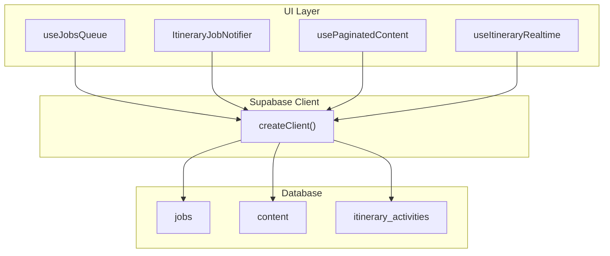
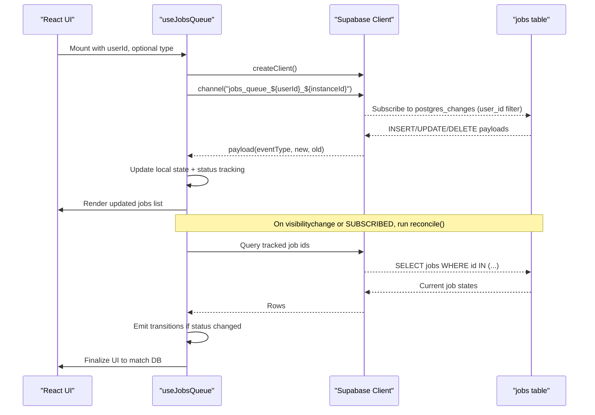
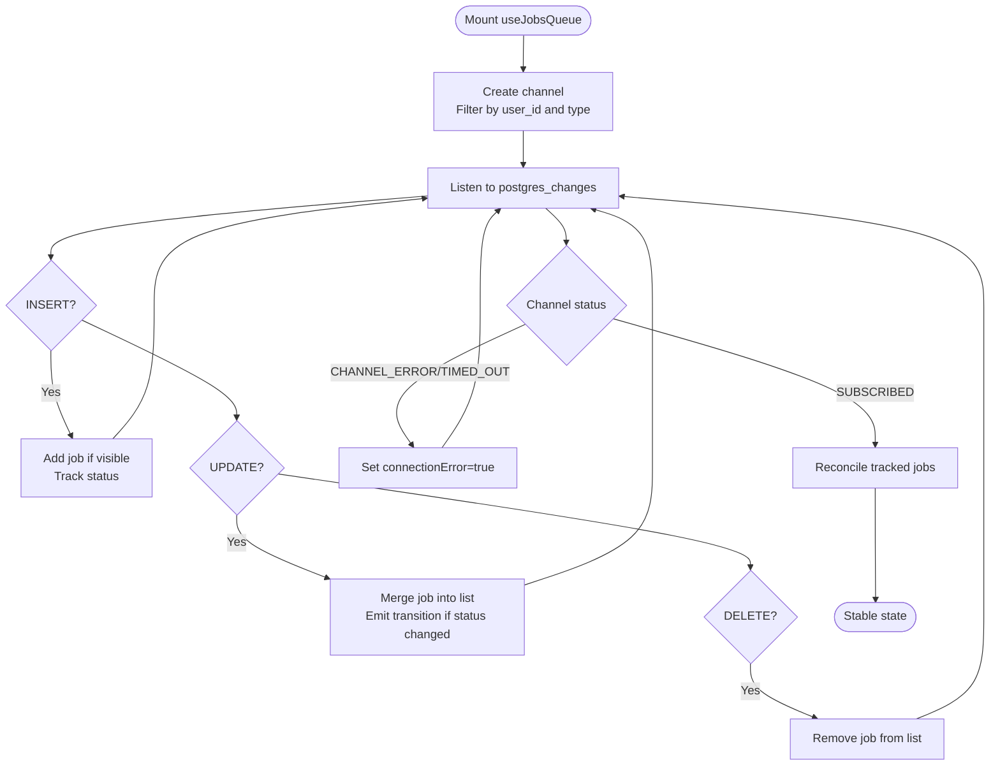
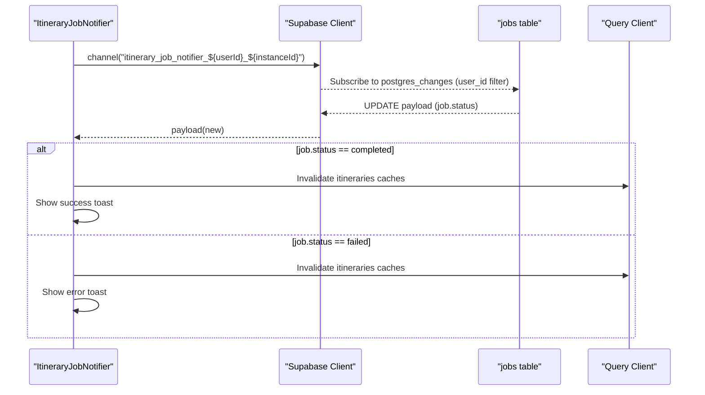
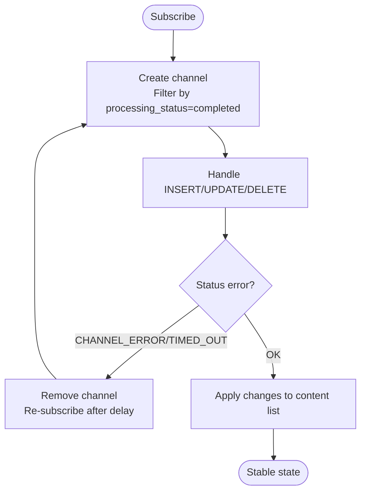
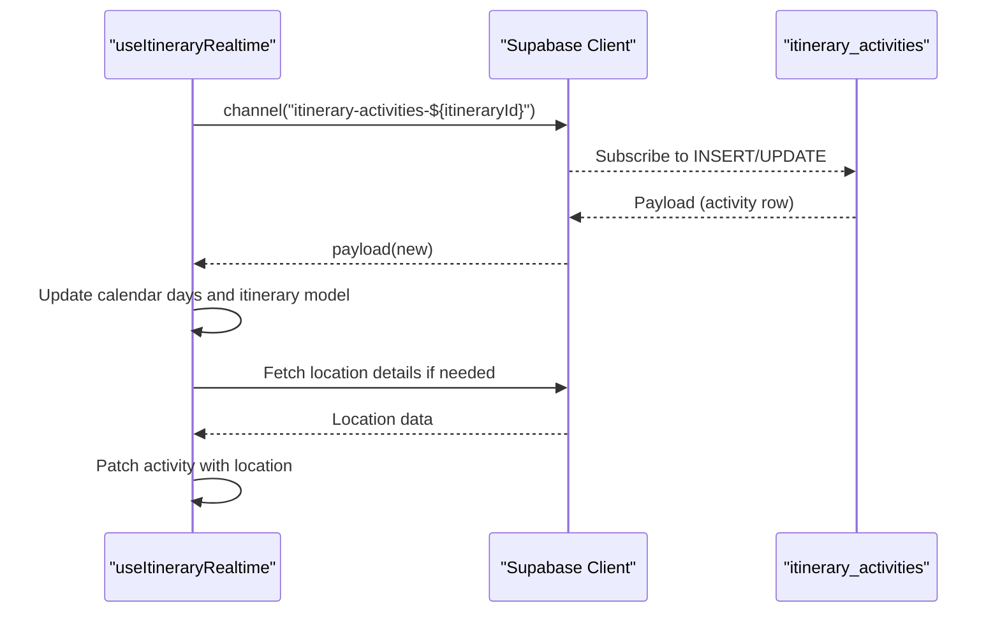
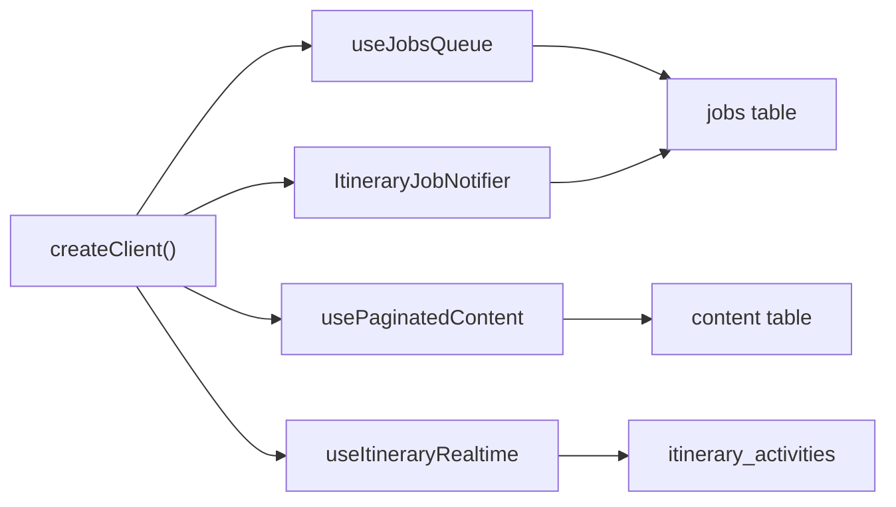

# Real-time Job Monitoring

<cite>
**Referenced Files in This Document**
- [useJobsQueue.ts](file://src/hooks/useJobsQueue.ts)
- [ItineraryJobNotifier.tsx](file://src/components/notifications/ItineraryJobNotifier.tsx)
- [usePaginatedContent.ts](file://src/hooks/usePaginatedContent.ts)
- [useItineraryRealtime.ts](file://src/hooks/useItineraryRealtime.ts)
- [client.ts](file://src/lib/supabase/client.ts)
</cite>

## Table of Contents
1. [Introduction](#introduction)
2. [Project Structure](#project-structure)
3. [Core Components](#core-components)
4. [Architecture Overview](#architecture-overview)
5. [Detailed Component Analysis](#detailed-component-analysis)
6. [Dependency Analysis](#dependency-analysis)
7. [Performance Considerations](#performance-considerations)
8. [Troubleshooting Guide](#troubleshooting-guide)
9. [Conclusion](#conclusion)

## Introduction
This document explains the real-time job monitoring system built on Supabase realtime subscriptions. It covers:
- Channel creation with unique instance IDs to avoid subscription conflicts
- Handling postgres_changes events for INSERT, UPDATE, and DELETE
- Connection state management including CHANNEL_ERROR and TIMED_OUT handling
- Reconciliation to recover missed updates after tab backgrounding or network interruptions
- Visibility change detection to synchronize state when users return to the app
- Filtering jobs by user_id and job type
- Maintaining consistency between optimistic UI updates and database state

## Project Structure
The real-time job monitoring spans several hooks and components that subscribe to Supabase channels and reconcile state:
- useJobsQueue: Core hook for subscribing to job queue changes, filtering by user and type, and reconciling state
- ItineraryJobNotifier: Lightweight notifier component that listens for itinerary planning job completion/failure and triggers cache invalidation and toasts
- usePaginatedContent: Demonstrates a similar pattern for content items with reconnect logic
- useItineraryRealtime: Example of multi-table realtime subscriptions for itinerary activities and related entities
- Supabase client: Browser client factory used across modules

**Diagram sources**
- [useJobsQueue.ts:167-260](file://src/hooks/useJobsQueue.ts#L167-L260)
- [ItineraryJobNotifier.tsx:45-85](file://src/components/notifications/ItineraryJobNotifier.tsx#L45-L85)
- [usePaginatedContent.ts:250-274](file://src/hooks/usePaginatedContent.ts#L250-L274)
- [useItineraryRealtime.ts:89-169](file://src/hooks/useItineraryRealtime.ts#L89-L169)
- [client.ts:3-8](file://src/lib/supabase/client.ts#L3-L8)

**Section sources**
- [useJobsQueue.ts:45-295](file://src/hooks/useJobsQueue.ts#L45-L295)
- [ItineraryJobNotifier.tsx:10-90](file://src/components/notifications/ItineraryJobNotifier.tsx#L10-L90)
- [usePaginatedContent.ts:130-288](file://src/hooks/usePaginatedContent.ts#L130-L288)
- [useItineraryRealtime.ts:27-200](file://src/hooks/useItineraryRealtime.ts#L27-L200)
- [client.ts:3-8](file://src/lib/supabase/client.ts#L3-L8)

## Core Components
- useJobsQueue: Subscribes to the jobs table filtered by user_id and optional job type; handles INSERT/UPDATE/DELETE; reconciles missed updates; manages connection errors; supports optimistic upserts
- ItineraryJobNotifier: Subscribes to job updates for itinerary-planning type; invalidates caches and shows toasts on completion/failure
- usePaginatedContent: Shows a reusable pattern for realtime subscriptions with automatic reconnection on CHANNEL_ERROR/TIMED_OUT
- useItineraryRealtime: Demonstrates per-entity realtime subscriptions (activities, flights, lodging) with targeted filters

Key responsibilities:
- Unique channel names per instance to prevent duplicate subscriptions
- Event-driven UI updates via postgres_changes
- Robust error handling and recovery
- Visibility-based reconciliation to catch missed updates
- Type and user filtering at the subscription level

**Section sources**
- [useJobsQueue.ts:68-76](file://src/hooks/useJobsQueue.ts#L68-L76)
- [useJobsQueue.ts:167-260](file://src/hooks/useJobsQueue.ts#L167-L260)
- [ItineraryJobNotifier.tsx:13-16](file://src/components/notifications/ItineraryJobNotifier.tsx#L13-L16)
- [ItineraryJobNotifier.tsx:45-85](file://src/components/notifications/ItineraryJobNotifier.tsx#L45-L85)
- [usePaginatedContent.ts:135-138](file://src/hooks/usePaginatedContent.ts#L135-L138)
- [usePaginatedContent.ts:250-274](file://src/hooks/usePaginatedContent.ts#L250-L274)
- [useItineraryRealtime.ts:89-169](file://src/hooks/useItineraryRealtime.ts#L89-L169)

## Architecture Overview
The system uses Supabase realtime channels to listen to database changes and update React state accordingly. Each subscription is scoped to a specific user and optionally a job type. A reconciliation mechanism ensures consistency even when realtime messages are missed due to backgrounding or network issues.

**Diagram sources**
- [useJobsQueue.ts:105-136](file://src/hooks/useJobsQueue.ts#L105-L136)
- [useJobsQueue.ts:167-260](file://src/hooks/useJobsQueue.ts#L167-L260)
- [useJobsQueue.ts:161-165](file://src/hooks/useJobsQueue.ts#L161-L165)

## Detailed Component Analysis

### useJobsQueue: Real-time Job Queue Management
Highlights:
- Unique instance ID per hook invocation prevents channel deduplication conflicts
- Filters by user_id and optional job type at both initial query and realtime subscription
- Handles INSERT/UPDATE/DELETE to keep UI consistent
- Tracks last known status per job to detect terminal transitions (completed/failed/rejected)
- Reconciles on visibility change and on reconnect (SUBSCRIBED) to handle missed updates
- Manages connectionError flag for CHANNEL_ERROR and TIMED_OUT
- Supports optimistic upserts to reflect immediate UI changes while waiting for realtime

**Diagram sources**
- [useJobsQueue.ts:167-260](file://src/hooks/useJobsQueue.ts#L167-L260)
- [useJobsQueue.ts:105-136](file://src/hooks/useJobsQueue.ts#L105-L136)
- [useJobsQueue.ts:250-260](file://src/hooks/useJobsQueue.ts#L250-L260)

Implementation details:
- Instance ID generation: Uses a stable identifier per hook instance to avoid channel sharing conflicts
- Initial fetch: Retrieves active jobs (including recent failures) ordered by creation time
- Visibility listener: Triggers reconcile when the tab becomes visible again
- Reconcile function: Queries only tracked jobs still considered “in flight” and applies missing transitions
- Optimistic upsert: Allows immediate UI updates for retries or other operations without waiting for realtime

**Section sources**
- [useJobsQueue.ts:68-76](file://src/hooks/useJobsQueue.ts#L68-L76)
- [useJobsQueue.ts:138-159](file://src/hooks/useJobsQueue.ts#L138-L159)
- [useJobsQueue.ts:161-165](file://src/hooks/useJobsQueue.ts#L161-L165)
- [useJobsQueue.ts:167-260](file://src/hooks/useJobsQueue.ts#L167-L260)
- [useJobsQueue.ts:269-292](file://src/hooks/useJobsQueue.ts#L269-L292)

### ItineraryJobNotifier: Completion/Failure Notifications
Highlights:
- Subscribes to job updates for itinerary-planning type
- Invalidates relevant queries on completion/failure to refresh downstream views
- Displays success/error toasts based on job outcome
- Uses unique instance ID to avoid channel conflicts

**Diagram sources**
- [ItineraryJobNotifier.tsx:45-85](file://src/components/notifications/ItineraryJobNotifier.tsx#L45-L85)

**Section sources**
- [ItineraryJobNotifier.tsx:10-90](file://src/components/notifications/ItineraryJobNotifier.tsx#L10-L90)

### usePaginatedContent: Reusable Realtime Pattern with Reconnect
Highlights:
- Demonstrates robust reconnection strategy on CHANNEL_ERROR/TIMED_OUT
- Deduplicates items when merging realtime updates with paginated loads
- Filters realtime updates to only include completed items

**Diagram sources**
- [usePaginatedContent.ts:250-274](file://src/hooks/usePaginatedContent.ts#L250-L274)
- [usePaginatedContent.ts:218-248](file://src/hooks/usePaginatedContent.ts#L218-L248)

**Section sources**
- [usePaginatedContent.ts:130-288](file://src/hooks/usePaginatedContent.ts#L130-L288)

### useItineraryRealtime: Multi-table Realtime Updates
Highlights:
- Subscribes to multiple tables (e.g., itinerary_activities) with precise filters
- Hydrates related data asynchronously when needed (e.g., location details)
- Mirrors changes into multiple UI models (calendar days and itinerary detail)

**Diagram sources**
- [useItineraryRealtime.ts:89-169](file://src/hooks/useItineraryRealtime.ts#L89-L169)
- [useItineraryRealtime.ts:170-200](file://src/hooks/useItineraryRealtime.ts#L170-L200)

**Section sources**
- [useItineraryRealtime.ts:27-200](file://src/hooks/useItineraryRealtime.ts#L27-L200)

## Dependency Analysis
- All components depend on the Supabase browser client created via createClient
- useJobsQueue depends on:
  - Supabase client for channel creation and queries
  - React hooks for state and lifecycle
  - Optional callbacks for job transitions
- ItineraryJobNotifier depends on:
  - Supabase client for channel
  - Query client for cache invalidation
  - Toast context for notifications
- usePaginatedContent demonstrates a reusable pattern for channel lifecycle and reconnection
- useItineraryRealtime shows complex multi-table subscriptions and data hydration

**Diagram sources**
- [client.ts:3-8](file://src/lib/supabase/client.ts#L3-L8)
- [useJobsQueue.ts:167-260](file://src/hooks/useJobsQueue.ts#L167-L260)
- [ItineraryJobNotifier.tsx:45-85](file://src/components/notifications/ItineraryJobNotifier.tsx#L45-L85)
- [usePaginatedContent.ts:250-274](file://src/hooks/usePaginatedContent.ts#L250-L274)
- [useItineraryRealtime.ts:89-169](file://src/hooks/useItineraryRealtime.ts#L89-L169)

**Section sources**
- [client.ts:3-8](file://src/lib/supabase/client.ts#L3-L8)
- [useJobsQueue.ts:167-260](file://src/hooks/useJobsQueue.ts#L167-L260)
- [ItineraryJobNotifier.tsx:45-85](file://src/components/notifications/ItineraryJobNotifier.tsx#L45-L85)
- [usePaginatedContent.ts:250-274](file://src/hooks/usePaginatedContent.ts#L250-L274)
- [useItineraryRealtime.ts:89-169](file://src/hooks/useItineraryRealtime.ts#L89-L169)

## Performance Considerations
- Use targeted filters (user_id, type, processing_status) to minimize payload size and event volume
- Avoid redundant updates by tracking last known status per job and emitting transitions only on changes
- Reconcile only tracked jobs to reduce query load during recovery
- Debounce or throttle UI updates where necessary (e.g., large lists)
- Prefer server-side sorting and pagination to limit client-side work

[No sources needed since this section provides general guidance]

## Troubleshooting Guide
Common issues and resolutions:
- CHANNEL_ERROR or TIMED_OUT:
  - The hook sets connectionError to true; ensure cleanup removes the channel and consider reconnection strategies
  - In usePaginatedContent, automatic reconnection is implemented with a retry delay
- Missed updates after tab backgrounding:
  - Rely on visibilitychange to trigger reconcile; verify document.visibilityState usage
  - Ensure reconcile queries only tracked jobs to avoid unnecessary work
- Duplicate subscriptions:
  - Confirm unique instanceId per hook/component to prevent channel deduplication conflicts
- Inconsistent UI vs database:
  - Use optimistic upserts judiciously; reconcile will correct any drift
  - Validate filters and projections to ensure realtime payloads match expected shapes

**Section sources**
- [useJobsQueue.ts:250-260](file://src/hooks/useJobsQueue.ts#L250-L260)
- [usePaginatedContent.ts:265-274](file://src/hooks/usePaginatedContent.ts#L265-L274)
- [useJobsQueue.ts:161-165](file://src/hooks/useJobsQueue.ts#L161-L165)
- [useJobsQueue.ts:68-76](file://src/hooks/useJobsQueue.ts#L68-L76)

## Conclusion
The real-time job monitoring system leverages Supabase realtime subscriptions with careful attention to channel uniqueness, event handling, connection resilience, and reconciliation. By filtering at the subscription level and using visibility-based recovery, it maintains a consistent UI even under network interruptions or backgrounding. Optimistic updates improve perceived performance while reconciliation ensures eventual consistency with the database.

[No sources needed since this section summarizes without analyzing specific files]