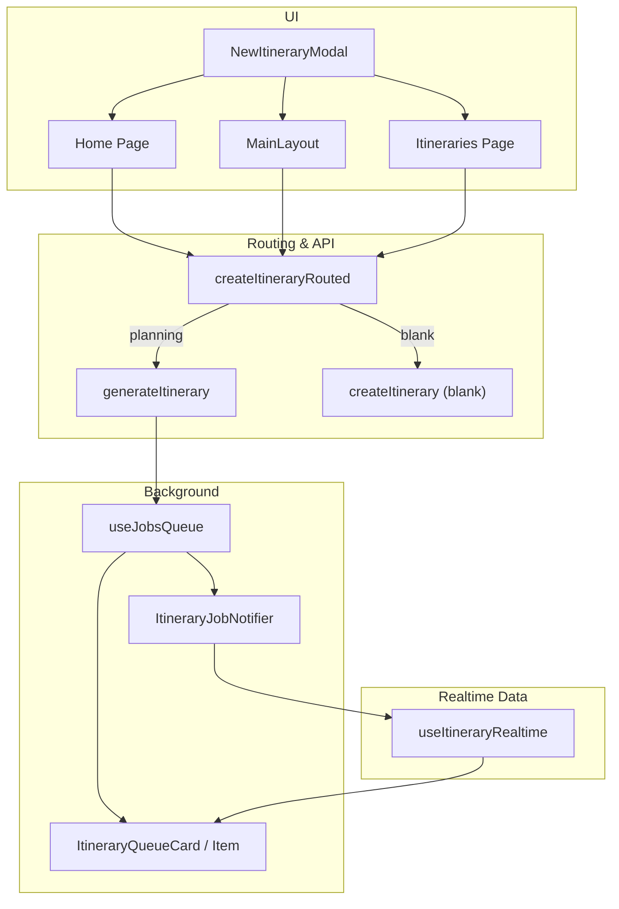
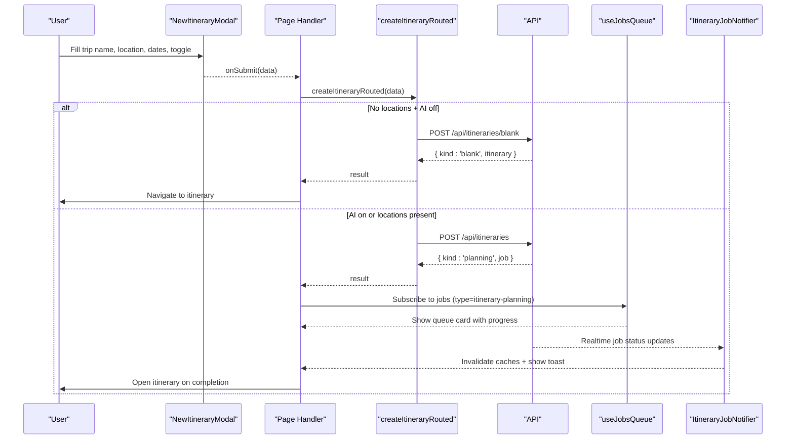
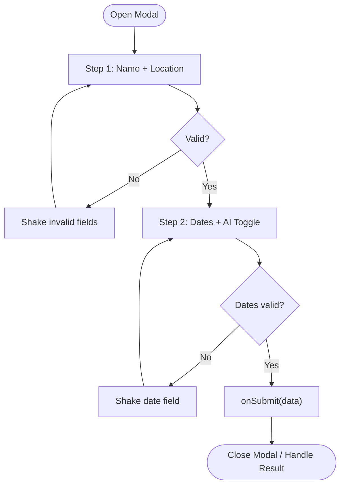
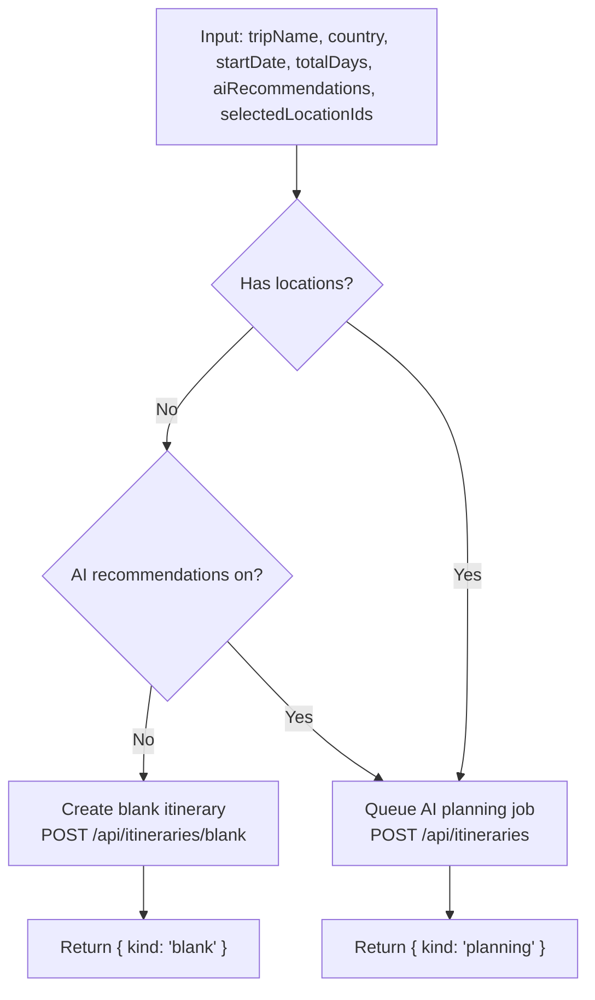
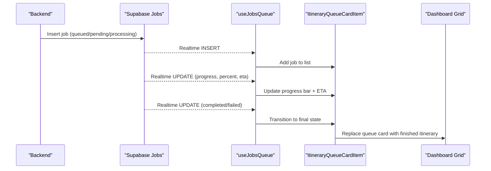
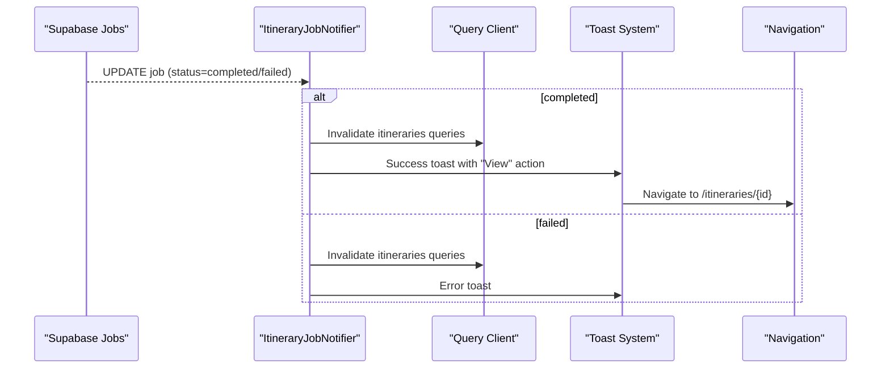
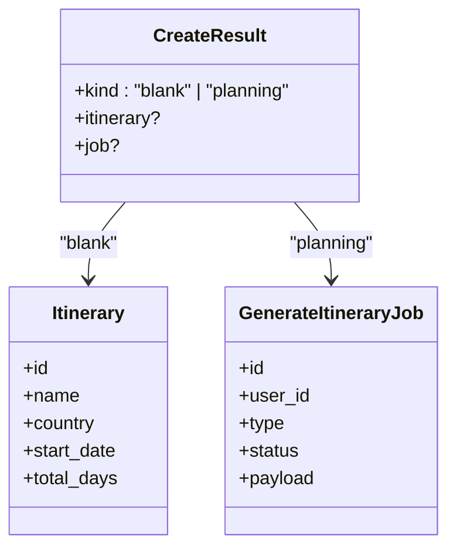
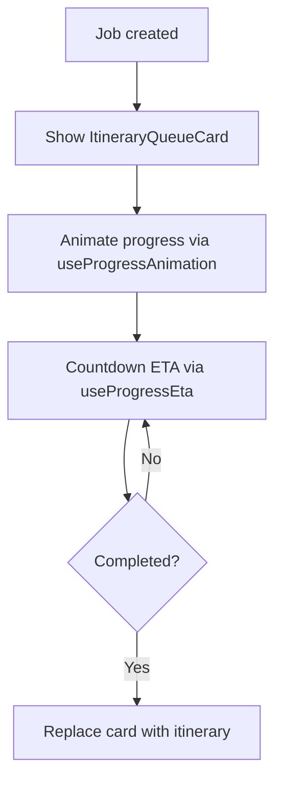
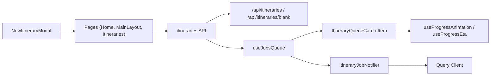
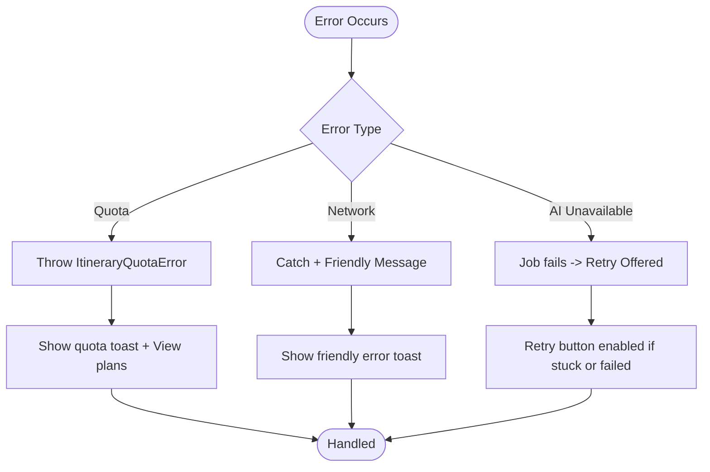

# AI-Powered Itinerary Generation

<cite>
**Referenced Files in This Document**
- [NewItineraryModal.tsx](file://src/components/ui/modals/NewItineraryModal.tsx)
- [MainLayout.tsx](file://src/components/ui/layout/MainLayout.tsx)
- [home page.tsx](file://src/app/home/page.tsx)
- [itineraries page.tsx](file://src/app/itineraries/page.tsx)
- [itineraries API](file://src/lib/api/itineraries.ts)
- [client API](file://src/lib/api/client.ts)
- [useJobsQueue hook](file://src/hooks/useJobsQueue.ts)
- [ItineraryJobNotifier component](file://src/components/notifications/ItineraryJobNotifier.tsx)
- [ItineraryQueueCard component](file://src/components/ui/itinerary/ItineraryQueueCard.tsx)
- [ItineraryQueueCardItem component](file://src/components/ui/itinerary/ItineraryQueueCardItem.tsx)
- [useProgressAnimation hook](file://src/hooks/useProgressAnimation.ts)
- [useProgressEta hook](file://src/hooks/useProgressEta.ts)
- [useItineraryRealtime hook](file://src/hooks/useItineraryRealtime.ts)
- [userMessages utility](file://src/lib/errors/userMessages.ts)
- [quota gate hook](file://src/hooks/useQuotaGate.ts)
</cite>

## Table of Contents
1. [Introduction](#introduction)
2. [Project Structure](#project-structure)
3. [Core Components](#core-components)
4. [Architecture Overview](#architecture-overview)
5. [Detailed Component Analysis](#detailed-component-analysis)
6. [Dependency Analysis](#dependency-analysis)
7. [Performance Considerations](#performance-considerations)
8. [Troubleshooting Guide](#troubleshooting-guide)
9. [Conclusion](#conclusion)

## Introduction
This document explains Argo’s AI-powered itinerary generation system end-to-end: how the NewItineraryModal collects trip parameters, how routing decides between instant blank itineraries and asynchronous AI planning, how background jobs are tracked in real time, and how users receive progress and completion notifications. It also covers error handling for quota limits, network failures, and AI service issues, plus optimistic UI updates that keep the experience smooth during long-running processing.

## Project Structure
The itinerary creation flow spans UI components, hooks, and API modules:
- Modal and pages collect user inputs and trigger creation.
- A routing function chooses between synchronous blank creation and asynchronous AI planning.
- Background job state is managed via a queue hook with Supabase realtime subscriptions.
- Notifications and queue cards render progress and completion actions.
- Realtime hooks keep itinerary details synchronized as activities are added by workers.

**Diagram sources**
- [NewItineraryModal.tsx:118-160](file://src/components/ui/modals/NewItineraryModal.tsx#L118-L160)
- [MainLayout.tsx:181-251](file://src/components/ui/layout/MainLayout.tsx#L181-L251)
- [home page.tsx:492-550](file://src/app/home/page.tsx#L492-L550)
- [itineraries page.tsx:201-223](file://src/app/itineraries/page.tsx#L201-L223)
- [itineraries API:406-439](file://src/lib/api/itineraries.ts#L406-L439)
- [itineraries API:101-120](file://src/lib/api/itineraries.ts#L101-L120)
- [itineraries API:339-367](file://src/lib/api/itineraries.ts#L339-L367)
- [useJobsQueue hook:45-295](file://src/hooks/useJobsQueue.ts#L45-L295)
- [ItineraryQueueCard.tsx:60-199](file://src/components/ui/itinerary/ItineraryQueueCard.tsx#L60-L199)
- [ItineraryQueueCardItem.tsx:39-101](file://src/components/ui/itinerary/ItineraryQueueCardItem.tsx#L39-L101)
- [ItineraryJobNotifier.tsx:10-92](file://src/components/notifications/ItineraryJobNotifier.tsx#L10-L92)
- [useItineraryRealtime.ts:27-534](file://src/hooks/useItineraryRealtime.ts#L27-L534)

**Section sources**
- [NewItineraryModal.tsx:16-43](file://src/components/ui/modals/NewItineraryModal.tsx#L16-L43)
- [itineraries API:377-439](file://src/lib/api/itineraries.ts#L377-L439)
- [useJobsQueue hook:6-34](file://src/hooks/useJobsQueue.ts#L6-L34)

## Core Components
- NewItineraryModal: Two-step form capturing trip name, region/location, date range, duration, and an AI recommendations toggle. Validates fields and emits structured submission data.
- Routing logic (createItineraryRouted): Decides between creating a blank itinerary instantly or queuing an AI planning job based on selected locations and the AI toggle.
- Job queue (useJobsQueue): Subscribes to Supabase realtime changes for jobs, reconciles missed updates, sorts failed jobs to the front, and exposes upsert/remove helpers.
- Queue UI (ItineraryQueueCard/Item): Renders in-flight jobs with animated progress, ETA countdown, retry controls, and image placeholders.
- Completion notifier (ItineraryJobNotifier): Listens for completed/failed jobs and shows toasts with navigation actions; invalidates caches to refresh lists.
- Realtime itinerary updates (useItineraryRealtime): Keeps calendar and view-mode data in sync as activities, days, flights, and lodging entries are added or updated.

**Section sources**
- [NewItineraryModal.tsx:59-160](file://src/components/ui/modals/NewItineraryModal.tsx#L59-L160)
- [itineraries API:406-439](file://src/lib/api/itineraries.ts#L406-L439)
- [useJobsQueue hook:45-295](file://src/hooks/useJobsQueue.ts#L45-L295)
- [ItineraryQueueCard.tsx:60-199](file://src/components/ui/itinerary/ItineraryQueueCard.tsx#L60-L199)
- [ItineraryQueueCardItem.tsx:39-101](file://src/components/ui/itinerary/ItineraryQueueCardItem.tsx#L39-L101)
- [ItineraryJobNotifier.tsx:10-92](file://src/components/notifications/ItineraryJobNotifier.tsx#L10-L92)
- [useItineraryRealtime.ts:27-534](file://src/hooks/useItineraryRealtime.ts#L27-L534)

## Architecture Overview
The system supports dual-mode generation:
- Instant blank itineraries: When no locations are selected and AI recommendations are off, a blank itinerary is created synchronously and the user is navigated immediately.
- AI-powered generation: When AI recommendations are on or when locations are provided, a background job is queued. The UI shows a queue card with live progress and notifies on completion.

**Diagram sources**
- [NewItineraryModal.tsx:118-160](file://src/components/ui/modals/NewItineraryModal.tsx#L118-L160)
- [itineraries API:406-439](file://src/lib/api/itineraries.ts#L406-L439)
- [itineraries API:101-120](file://src/lib/api/itineraries.ts#L101-L120)
- [itineraries API:339-367](file://src/lib/api/itineraries.ts#L339-L367)
- [useJobsQueue hook:138-260](file://src/hooks/useJobsQueue.ts#L138-L260)
- [ItineraryJobNotifier.tsx:29-88](file://src/components/notifications/ItineraryJobNotifier.tsx#L29-L88)

## Detailed Component Analysis

### NewItineraryModal: Trip Parameters and Validation
- Inputs:
  - Trip name and region/location via place autocomplete.
  - Date range with computed total days.
  - AI recommendations toggle to enable intelligent activity recommendations and schedule optimization.
- Validation:
  - Step 1 requires trip name and location.
  - Step 2 requires a valid date range with at least one day.
  - Shaking animations highlight invalid fields.
- Submission payload includes trip metadata, dates, duration, AI toggle, and any pre-selected location IDs.

**Diagram sources**
- [NewItineraryModal.tsx:59-160](file://src/components/ui/modals/NewItineraryModal.tsx#L59-L160)

**Section sources**
- [NewItineraryModal.tsx:16-43](file://src/components/ui/modals/NewItineraryModal.tsx#L16-L43)
- [NewItineraryModal.tsx:59-160](file://src/components/ui/modals/NewItineraryModal.tsx#L59-L160)

### Routing Logic: Synchronous vs Asynchronous Generation
- Decision matrix:
  - No locations + AI off → create blank itinerary synchronously.
  - Any locations or AI on → queue an AI planning job asynchronously.
- The routing function returns a discriminated union indicating whether to navigate immediately or await job completion.

**Diagram sources**
- [itineraries API:406-439](file://src/lib/api/itineraries.ts#L406-L439)
- [itineraries API:339-367](file://src/lib/api/itineraries.ts#L339-L367)
- [itineraries API:101-120](file://src/lib/api/itineraries.ts#L101-L120)

**Section sources**
- [itineraries API:406-439](file://src/lib/api/itineraries.ts#L406-L439)

### Job Queue Architecture: Background Processing and Progress Tracking
- useJobsQueue:
  - Initial fetch includes recent failed jobs so users can retry.
  - Realtime subscription listens to INSERT/UPDATE/DELETE events for jobs.
  - Reconciliation pass handles missed updates when tabs go background or connections drop.
  - Failed jobs pinned to front; within groups newest first.
  - Exposes removeJob and upsertJob for optimistic updates.
- ItineraryQueueCard/Item:
  - Displays title, destination photo, progress bar, and error messages.
  - Offers retry when failed or stuck beyond threshold.
  - Uses useProgressAnimation to animate percentage smoothly and useProgressEta to count down ETA locally.

**Diagram sources**
- [useJobsQueue hook:138-260](file://src/hooks/useJobsQueue.ts#L138-L260)
- [ItineraryQueueCardItem.tsx:39-101](file://src/components/ui/itinerary/ItineraryQueueCardItem.tsx#L39-L101)
- [useProgressAnimation.ts:1-41](file://src/hooks/useProgressAnimation.ts#L1-L41)
- [useProgressEta.ts:22-59](file://src/hooks/useProgressEta.ts#L22-L59)

**Section sources**
- [useJobsQueue hook:45-295](file://src/hooks/useJobsQueue.ts#L45-L295)
- [ItineraryQueueCard.tsx:60-199](file://src/components/ui/itinerary/ItineraryQueueCard.tsx#L60-L199)
- [ItineraryQueueCardItem.tsx:39-101](file://src/components/ui/itinerary/ItineraryQueueCardItem.tsx#L39-L101)
- [useProgressAnimation.ts:1-41](file://src/hooks/useProgressAnimation.ts#L1-L41)
- [useProgressEta.ts:22-59](file://src/hooks/useProgressEta.ts#L22-L59)

### Real-time Progress Tracking and Completion Notifications
- ItineraryJobNotifier:
  - Subscribes to jobs table updates filtered by user and type.
  - On completion, invalidates itinerary caches and shows a success toast with a “View” action linking to the new itinerary.
  - On failure, shows an error toast prompting retry later.
- Dashboard integration:
  - Pages subscribe to the job queue and display queue cards inline.
  - Completed jobs are transformed into optimistic itinerary entries to avoid grid reflow.

**Diagram sources**
- [ItineraryJobNotifier.tsx:29-88](file://src/components/notifications/ItineraryJobNotifier.tsx#L29-L88)

**Section sources**
- [ItineraryJobNotifier.tsx:10-92](file://src/components/notifications/ItineraryJobNotifier.tsx#L10-L92)
- [itineraries page.tsx:32-72](file://src/app/itineraries/page.tsx#L32-L72)

### Dual-mode Generation: Instant Blank vs AI-powered Planning
- Instant blank:
  - Triggered when no locations are selected and AI recommendations are off.
  - Creates a minimal itinerary synchronously; user navigates immediately.
- AI-powered:
  - Triggered when AI recommendations are on or when locations are provided.
  - Queues a background job; UI shows progress and notifies on completion.
  - Activities, days, flights, and lodging are synced in real time as workers add them.

**Diagram sources**
- [itineraries API:373-375](file://src/lib/api/itineraries.ts#L373-L375)
- [itineraries API:32-52](file://src/lib/api/itineraries.ts#L32-L52)
- [itineraries API:80-87](file://src/lib/api/itineraries.ts#L80-L87)

**Section sources**
- [itineraries API:406-439](file://src/lib/api/itineraries.ts#L406-L439)
- [useItineraryRealtime.ts:27-534](file://src/hooks/useItineraryRealtime.ts#L27-L534)

### Optimistic UI Updates During Long-running AI Processing
- Queue cards appear immediately after job creation.
- Progress animates using worker-reported percentages and step-based targets.
- ETA countdown runs locally between backend updates to keep the UI responsive.
- On completion, the queue card is replaced by the finished itinerary without layout shifts.

**Diagram sources**
- [useProgressAnimation.ts:1-41](file://src/hooks/useProgressAnimation.ts#L1-L41)
- [useProgressEta.ts:22-59](file://src/hooks/useProgressEta.ts#L22-L59)
- [ItineraryQueueCardItem.tsx:39-101](file://src/components/ui/itinerary/ItineraryQueueCardItem.tsx#L39-L101)

**Section sources**
- [useProgressAnimation.ts:1-41](file://src/hooks/useProgressAnimation.ts#L1-L41)
- [useProgressEta.ts:22-59](file://src/hooks/useProgressEta.ts#L22-L59)
- [ItineraryQueueCardItem.tsx:39-101](file://src/components/ui/itinerary/ItineraryQueueCardItem.tsx#L39-L101)

## Dependency Analysis
Key dependencies and relationships:
- NewItineraryModal depends on FormModal, Input, Calendar, PlaceAutocomplete, and domain types.
- Pages depend on createItineraryRouted from the itineraries API module.
- Routing depends on generateItinerary and createItinerary endpoints.
- useJobsQueue depends on Supabase client and manages realtime channels per user and instance.
- ItineraryJobNotifier depends on Supabase realtime and query client cache invalidation.
- ItineraryQueueCard/Item depend on progress hooks and location photo resolution.

**Diagram sources**
- [NewItineraryModal.tsx:118-160](file://src/components/ui/modals/NewItineraryModal.tsx#L118-L160)
- [itineraries API:406-439](file://src/lib/api/itineraries.ts#L406-L439)
- [useJobsQueue hook:138-260](file://src/hooks/useJobsQueue.ts#L138-L260)
- [ItineraryJobNotifier.tsx:29-88](file://src/components/notifications/ItineraryJobNotifier.tsx#L29-L88)
- [useProgressAnimation.ts:1-41](file://src/hooks/useProgressAnimation.ts#L1-L41)
- [useProgressEta.ts:22-59](file://src/hooks/useProgressEta.ts#L22-L59)

**Section sources**
- [itineraries API:406-439](file://src/lib/api/itineraries.ts#L406-L439)
- [useJobsQueue hook:45-295](file://src/hooks/useJobsQueue.ts#L45-L295)
- [ItineraryJobNotifier.tsx:10-92](file://src/components/notifications/ItineraryJobNotifier.tsx#L10-L92)

## Performance Considerations
- Realtime efficiency:
  - Per-user, per-instance channels prevent duplicate subscriptions and channel conflicts.
  - Reconciliation ensures consistent state after reconnects or backgrounding.
- UI responsiveness:
  - Local ETA countdown avoids frequent UI thrashing between backend updates.
  - Animated progress reduces perceived latency during long operations.
- Data synchronization:
  - Realtime hooks update both calendar and view-mode states to maintain consistency across UI modes.
  - Optimistic replacement of queue cards with finished itineraries prevents layout shifts.

[No sources needed since this section provides general guidance]

## Troubleshooting Guide
Common errors and handling:
- Quota limits:
  - ItineraryQuotaError thrown by API calls; callers catch and show upgrade prompts via quota gate utilities.
  - Home and navbar handlers invalidate usage queries and display appropriate toasts.
- Network failures:
  - Friendly error messages are used to avoid leaking technical details; fallback messages guide users to retry.
- AI service unavailability:
  - Jobs transition to failed; queue cards offer retry; notifier shows error toast.
- Stuck jobs:
  - If a job remains in flight beyond a threshold, retry is offered even without a formal failure.

**Diagram sources**
- [itineraries API:89-99](file://src/lib/api/itineraries.ts#L89-L99)
- [itineraries API:107-117](file://src/lib/api/itineraries.ts#L107-L117)
- [client API:130-145](file://src/lib/api/client.ts#L130-L145)
- [userMessages utility:94-106](file://src/lib/errors/userMessages.ts#L94-L106)
- [quota gate hook:16-40](file://src/hooks/useQuotaGate.ts#L16-L40)
- [ItineraryQueueCardItem.tsx:63-83](file://src/components/ui/itinerary/ItineraryQueueCardItem.tsx#L63-L83)

**Section sources**
- [itineraries API:89-99](file://src/lib/api/itineraries.ts#L89-L99)
- [itineraries API:107-117](file://src/lib/api/itineraries.ts#L107-L117)
- [client API:130-145](file://src/lib/api/client.ts#L130-L145)
- [userMessages utility:94-106](file://src/lib/errors/userMessages.ts#L94-L106)
- [quota gate hook:16-40](file://src/hooks/useQuotaGate.ts#L16-L40)
- [ItineraryQueueCardItem.tsx:63-83](file://src/components/ui/itinerary/ItineraryQueueCardItem.tsx#L63-L83)

## Conclusion
Argo’s itinerary generation system provides a seamless user experience by combining immediate blank creation with robust asynchronous AI planning. The modal captures essential trip parameters and toggles, routing determines the optimal path, and the job queue architecture ensures real-time visibility and reliable notifications. Error handling covers quotas, network issues, and AI service failures, while optimistic UI updates keep interactions fluid. Integration with dashboard queues and realtime data streams maintains consistency and clarity throughout the planning workflow.