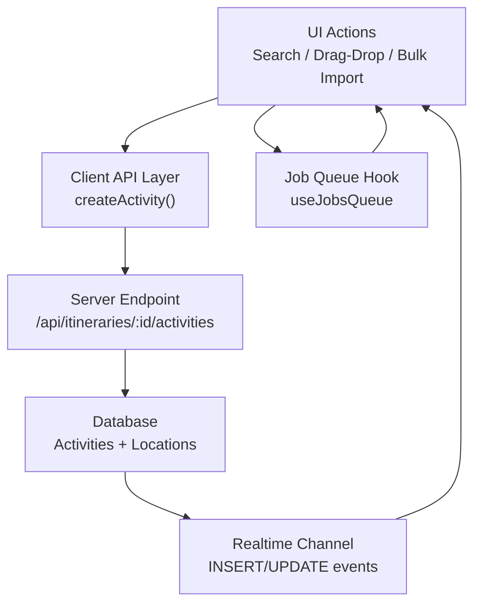
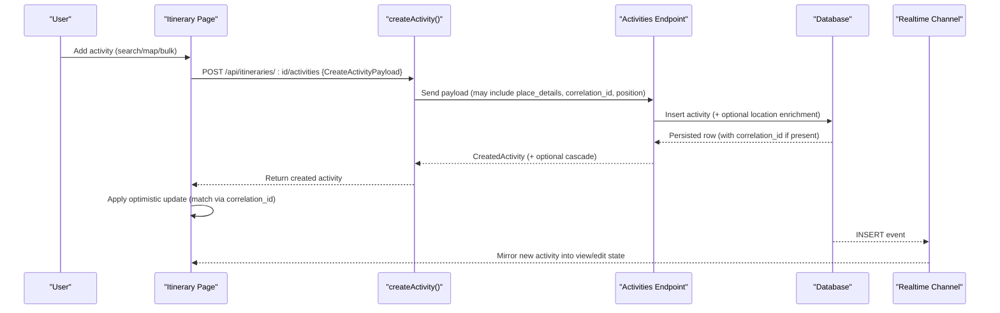
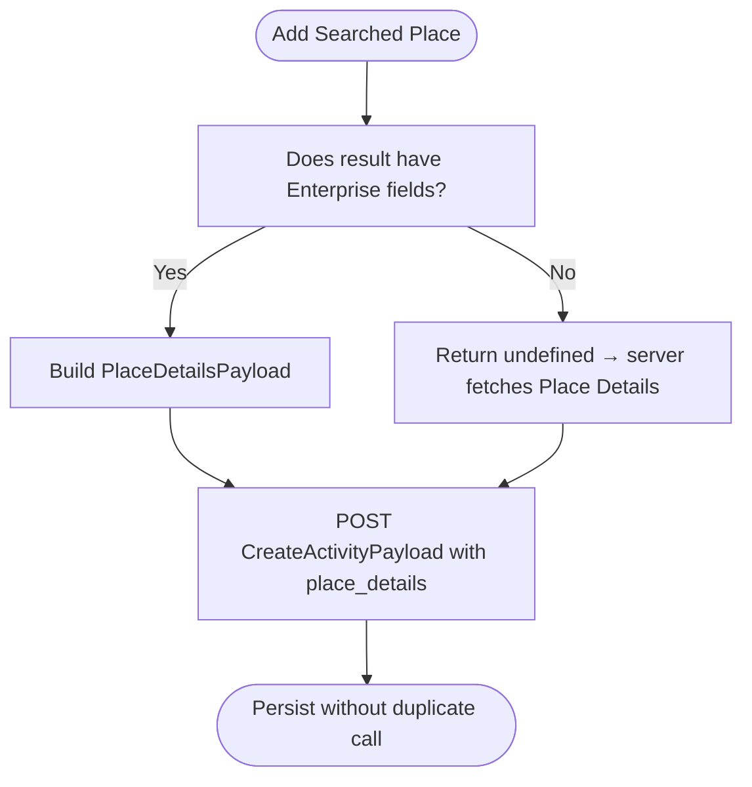
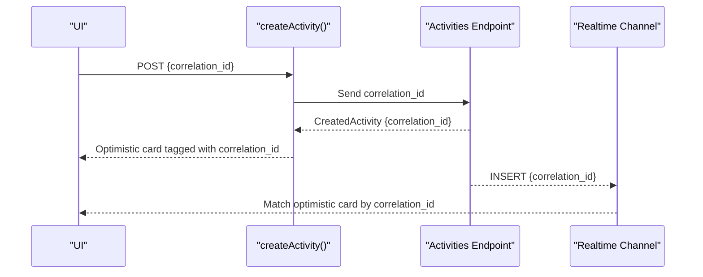
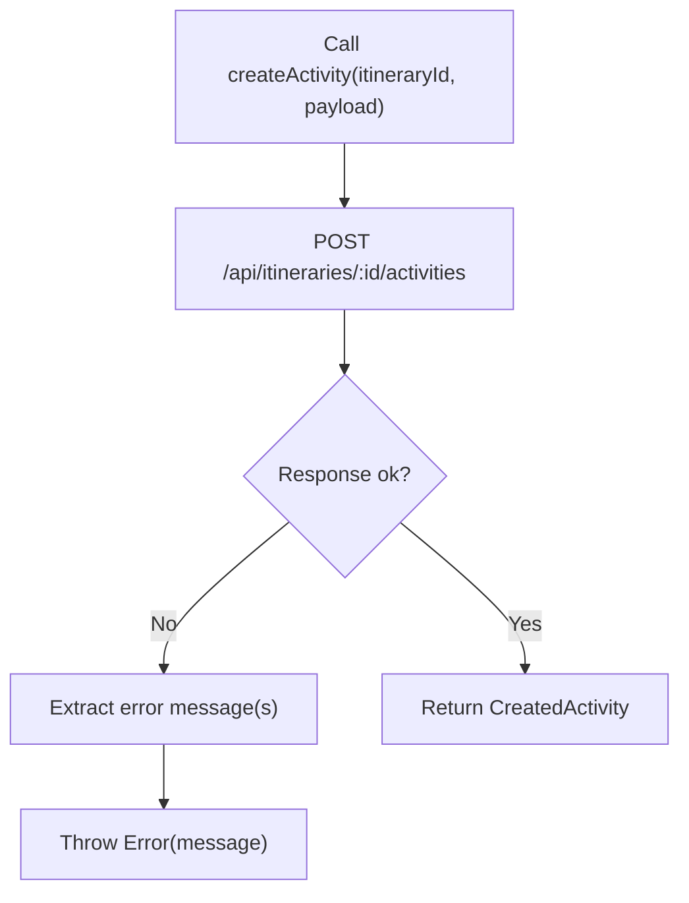
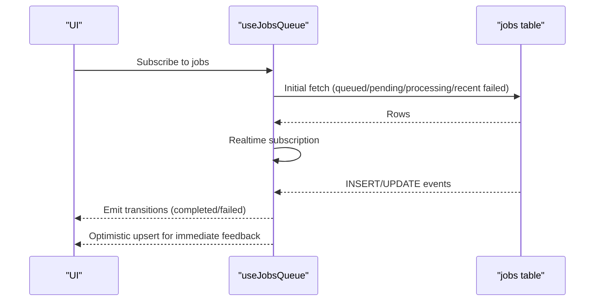
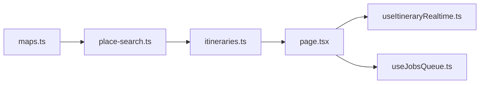

# Activity Creation & Management

<cite>
**Referenced Files in This Document**
- [itineraries.ts](file://src/lib/api/itineraries.ts)
- [place-search.ts](file://src/lib/maps/place-search.ts)
- [maps.ts](file://src/lib/api/maps.ts)
- [page.tsx](file://src/app/itineraries/[id]/page.tsx)
- [useItineraryRealtime.ts](file://src/hooks/useItineraryRealtime.ts)
- [useJobsQueue.ts](file://src/hooks/useJobsQueue.ts)
</cite>

## Table of Contents
1. [Introduction](#introduction)
2. [Project Structure](#project-structure)
3. [Core Components](#core-components)
4. [Architecture Overview](#architecture-overview)
5. [Detailed Component Analysis](#detailed-component-analysis)
6. [Dependency Analysis](#dependency-analysis)
7. [Performance Considerations](#performance-considerations)
8. [Troubleshooting Guide](#troubleshooting-guide)
9. [Conclusion](#conclusion)

## Introduction
This document explains how Argo creates and manages activities within an itinerary. It focuses on the CreateActivityPayload contract, place_details optimization to avoid duplicate Enterprise API calls, correlation_id for optimistic UI updates, and the position parameter for precise insertion ordering. It also covers the createActivity implementation, error handling patterns, and integration with the job queue system used for background processing. Finally, it provides usage examples from search results, map interactions, and bulk imports.

## Project Structure
The activity creation flow spans client-side APIs, maps utilities, and real-time state synchronization:
- Client API layer defines the payload and endpoints for creating activities and related operations.
- Maps utilities normalize Google Places data and build payloads that avoid redundant Place Details calls.
- The itinerary page orchestrates user actions (search, drag-drop, bulk import) and applies optimistic updates.
- Realtime hooks mirror server changes back into the UI to keep view and edit modes consistent.
- Job queue hook tracks long-running tasks and surfaces progress or errors.

**Diagram sources**
- [itineraries.ts:230-246](file://src/lib/api/itineraries.ts#L230-L246)
- [useItineraryRealtime.ts:129-163](file://src/hooks/useItineraryRealtime.ts#L129-L163)
- [useJobsQueue.ts:145-216](file://src/hooks/useJobsQueue.ts#L145-L216)

**Section sources**
- [itineraries.ts:133-160](file://src/lib/api/itineraries.ts#L133-L160)
- [place-search.ts:265-357](file://src/lib/maps/place-search.ts#L265-L357)
- [page.tsx:133-154](file://src/app/itineraries/[id]/page.tsx#L133-L154)
- [useItineraryRealtime.ts:129-163](file://src/hooks/useItineraryRealtime.ts#L129-L163)
- [useJobsQueue.ts:145-216](file://src/hooks/useJobsQueue.ts#L145-L216)

## Core Components
- CreateActivityPayload: Defines day assignment, time scheduling, location binding, category classification, optional place details reuse, recompute flag, correlation token, and insertion position.
- CreatedActivity: Response shape including optional joined location and cascade result when recomputing times.
- place_details optimization: Reuses browser-fetched Enterprise data to avoid a second Place Details call.
- correlation_id: A client-generated token echoed back via realtime INSERT to match optimistic cards to persisted rows.
- position: Precise insertion index so dropped activities stay where they were placed rather than jumping to the end.
- createActivity function: Posts the payload and handles errors by extracting messages from response bodies.
- Job queue integration: Tracks background jobs and merges updates optimistically for responsive UI.

**Section sources**
- [itineraries.ts:133-160](file://src/lib/api/itineraries.ts#L133-L160)
- [itineraries.ts:208-246](file://src/lib/api/itineraries.ts#L208-L246)
- [place-search.ts:265-357](file://src/lib/maps/place-search.ts#L265-L357)
- [page.tsx:133-154](file://src/app/itineraries/[id]/page.tsx#L133-L154)
- [useJobsQueue.ts:145-216](file://src/hooks/useJobsQueue.ts#L145-L216)

## Architecture Overview
The activity creation architecture combines immediate optimistic UI updates with eventual consistency via realtime events and server-side cascades.

**Diagram sources**
- [itineraries.ts:230-246](file://src/lib/api/itineraries.ts#L230-L246)
- [useItineraryRealtime.ts:129-163](file://src/hooks/useItineraryRealtime.ts#L129-L163)
- [page.tsx:133-154](file://src/app/itineraries/[id]/page.tsx#L133-L154)

## Detailed Component Analysis

### CreateActivityPayload
- day_id: Assigns the activity to a specific day.
- name: Human-readable title for the activity.
- start_time/end_time: Optional scheduling hints; server may adjust during cascade.
- location_id: Binds to an existing location row when available.
- category: Enumerated classification: poi, meal, flight, lodging_checkin, lodging_checkout.
- latitude/longitude: Optional coordinates for geospatial context.
- place_id: Google Place identifier when not using location_id.
- photo_url: Optional thumbnail URL.
- estimated_duration_hours: Optional duration hint for planning.
- place_details: When present (and no location_id), server persists location from this instead of calling Place Details again, avoiding duplicate Enterprise billing.
- recompute_times: Requests server-side recalculation of legs and times after drag-drop.
- correlation_id: Client-generated token echoed back on realtime INSERT to match optimistic cards to persisted rows.
- position: Slot index within the day to insert at; server renumbers around the new row to preserve drop position.

**Section sources**
- [itineraries.ts:133-160](file://src/lib/api/itineraries.ts#L133-L160)

### place_details Optimization
- Browser fetches Enterprise-tier fields during search (rating, opening hours, price level, phone, website, etc.).
- toPlaceDetailsPayload builds a normalized payload only when the result already includes Enterprise data; otherwise returns undefined so the server can fall back to its own Place Details fetch.
- This avoids a second Place Details call when adding a searched place to a day, saving cost and latency.
- Analytics track Enterprise usage separately for transparency.

**Diagram sources**
- [place-search.ts:265-357](file://src/lib/maps/place-search.ts#L265-L357)
- [maps.ts:58-75](file://src/lib/api/maps.ts#L58-L75)

**Section sources**
- [place-search.ts:265-357](file://src/lib/maps/place-search.ts#L265-L357)
- [maps.ts:58-75](file://src/lib/api/maps.ts#L58-L75)

### correlation_id Mechanism
- The client generates a unique token before posting an activity.
- The server echoes this token back in the persisted row and realtime INSERT event.
- The UI matches the optimistic card to the server row using correlation_id, ensuring deterministic matching even if name/start_time change.
- Fallback matching uses location_id, place_id, or name+start_time when correlation_id is absent.

**Diagram sources**
- [itineraries.ts:133-160](file://src/lib/api/itineraries.ts#L133-L160)
- [useItineraryRealtime.ts:129-163](file://src/hooks/useItineraryRealtime.ts#L129-L163)
- [page.tsx:133-154](file://src/app/itineraries/[id]/page.tsx#L133-L154)

**Section sources**
- [page.tsx:133-154](file://src/app/itineraries/[id]/page.tsx#L133-L154)
- [useItineraryRealtime.ts:129-163](file://src/hooks/useItineraryRealtime.ts#L129-L163)

### position Parameter for Precise Insertion
- position indicates the slot within the day’s activity list where the new activity should be inserted.
- Omitting position appends to the end.
- The server renumbers surrounding activities so the dropped card remains at the intended index rather than moving to the end on next read.
- Combined with cascade logic, this preserves user intent during drag-and-drop.

**Section sources**
- [itineraries.ts:133-160](file://src/lib/api/itineraries.ts#L133-L160)

### createActivity Implementation and Error Handling
- Sends a POST request to the activities endpoint with the CreateActivityPayload.
- On non-ok responses, extracts error messages from the JSON body (including array-of-errors) and throws a descriptive Error.
- Returns the CreatedActivity, which may include a joined location and cascade result when recomputing times.

**Diagram sources**
- [itineraries.ts:230-246](file://src/lib/api/itineraries.ts#L230-L246)

**Section sources**
- [itineraries.ts:230-246](file://src/lib/api/itineraries.ts#L230-L246)

### Integration with Job Queue System
- Long-running tasks (e.g., itinerary generation) are tracked via a job queue.
- The useJobsQueue hook subscribes to realtime changes, reconciles missed updates, and emits completion/failure callbacks.
- Optimistic merging ensures UI reflects status transitions immediately, even if realtime updates lag.
- ETA formatting provides human-friendly progress estimates for planning jobs.

**Diagram sources**
- [useJobsQueue.ts:145-216](file://src/hooks/useJobsQueue.ts#L145-L216)
- [useJobsQueue.ts:269-295](file://src/hooks/useJobsQueue.ts#L269-L295)

**Section sources**
- [useJobsQueue.ts:145-216](file://src/hooks/useJobsQueue.ts#L145-L216)
- [useJobsQueue.ts:269-295](file://src/hooks/useJobsQueue.ts#L269-L295)

### Examples: Creating Activities from Different Sources

#### From Search Results
- Use runPlaceSearch to get Enterprise-enriched results.
- If the result has Enterprise fields, build PlaceDetailsPayload via toPlaceDetailsPayload and pass it in CreateActivityPayload to avoid a second Place Details call.
- Optionally set category based on primaryType or chip selection.

**Section sources**
- [place-search.ts:391-467](file://src/lib/maps/place-search.ts#L391-L467)
- [place-search.ts:265-357](file://src/lib/maps/place-search.ts#L265-L357)
- [itineraries.ts:133-160](file://src/lib/api/itineraries.ts#L133-L160)

#### From Map Interactions
- Pin clicks may trigger fetchPlaceDetailsEnterprise to enrich Pro-tier results.
- Track Enterprise usage via trackPlaceDetailsEnterprise for analytics.
- After enrichment, proceed with CreateActivityPayload including place_details when available.

**Section sources**
- [place-search.ts:372-383](file://src/lib/maps/place-search.ts#L372-L383)
- [maps.ts:58-75](file://src/lib/api/maps.ts#L58-L75)
- [itineraries.ts:133-160](file://src/lib/api/itineraries.ts#L133-L160)

#### From Bulk Imports
- For bulk scenarios (e.g., importing lodging check-in/check-out), construct multiple CreateActivityPayload entries with appropriate categories (lodging_checkin, lodging_checkout).
- Use position to control insertion order across days and rely on correlation_id to match optimistic cards to persisted rows.
- Mirror updates into both calendar and edit views to keep UI consistent.

**Section sources**
- [page.tsx:2739-2808](file://src/app/itineraries/[id]/page.tsx#L2739-L2808)
- [page.tsx:3294-3388](file://src/app/itineraries/[id]/page.tsx#L3294-L3388)
- [itineraries.ts:133-160](file://src/lib/api/itineraries.ts#L133-L160)

## Dependency Analysis
- itineraries.ts depends on maps types for PlaceDetailsPayload and on Supabase queries for ActivityLocation.
- place-search.ts normalizes Google Places data and produces payloads consumed by itineraries.ts.
- The itinerary page orchestrates UI state and integrates with realtime hooks to reflect server changes.
- useJobsQueue depends on Supabase realtime to track job lifecycle and provide optimistic updates.

**Diagram sources**
- [place-search.ts:265-357](file://src/lib/maps/place-search.ts#L265-L357)
- [itineraries.ts:133-160](file://src/lib/api/itineraries.ts#L133-L160)
- [useItineraryRealtime.ts:129-163](file://src/hooks/useItineraryRealtime.ts#L129-L163)
- [useJobsQueue.ts:145-216](file://src/hooks/useJobsQueue.ts#L145-L216)
- [maps.ts:58-75](file://src/lib/api/maps.ts#L58-L75)

**Section sources**
- [place-search.ts:265-357](file://src/lib/maps/place-search.ts#L265-L357)
- [itineraries.ts:133-160](file://src/lib/api/itineraries.ts#L133-L160)
- [useItineraryRealtime.ts:129-163](file://src/hooks/useItineraryRealtime.ts#L129-L163)
- [useJobsQueue.ts:145-216](file://src/hooks/useJobsQueue.ts#L145-L216)
- [maps.ts:58-75](file://src/lib/api/maps.ts#L58-L75)

## Performance Considerations
- Reusing browser-fetched Enterprise data via place_details avoids redundant Place Details calls, reducing cost and latency.
- Using correlation_id enables fast optimistic UI updates without waiting for server echo, improving perceived responsiveness.
- Position-based insertion reduces unnecessary reordering and keeps drag-and-drop intuitive.
- Job queue realtime subscriptions reconcile missed updates to prevent stale states.

[No sources needed since this section provides general guidance]

## Troubleshooting Guide
- Non-ok responses from createActivity: Errors are extracted from the response body (including arrays of messages) and thrown; callers should catch and display user-friendly messages.
- Missing correlation_id: Matching falls back to location_id, place_id, or name+start_time; ensure these fields are present for reliable matching.
- Realtime gaps: The job queue hook reconciles missed updates on visibility changes and reconnects; ensure realtime channels are subscribed and listeners are active.
- Duplicate Place Details: Verify that place_details is included when the search result has Enterprise fields; otherwise the server will perform its own Place Details fetch.

**Section sources**
- [itineraries.ts:230-246](file://src/lib/api/itineraries.ts#L230-L246)
- [page.tsx:133-154](file://src/app/itineraries/[id]/page.tsx#L133-L154)
- [useJobsQueue.ts:145-216](file://src/hooks/useJobsQueue.ts#L145-L216)
- [place-search.ts:326-357](file://src/lib/maps/place-search.ts#L326-L357)

## Conclusion
Argo’s activity creation system balances speed and accuracy through optimistic UI updates, precise insertion ordering, and robust server-side cascades. The place_details optimization significantly reduces redundant Enterprise API calls, while correlation_id ensures reliable matching between optimistic and persisted activities. Integration with the job queue provides resilient background processing and clear user feedback. Together, these patterns deliver a smooth experience whether users add activities from search results, interact with the map, or import data in bulk.

[No sources needed since this section summarizes without analyzing specific files]