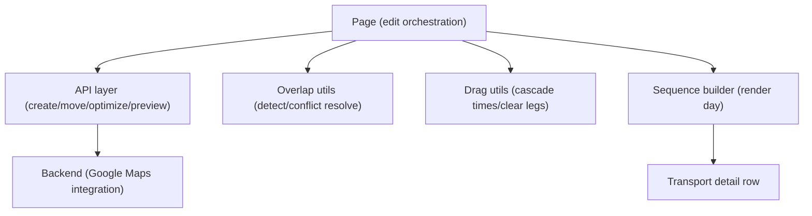
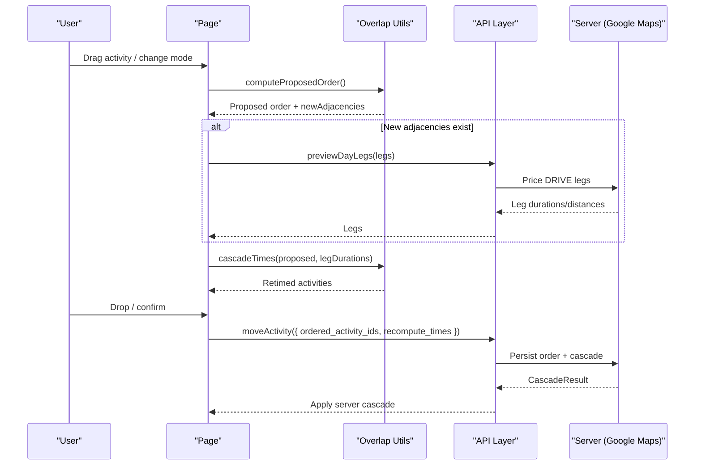
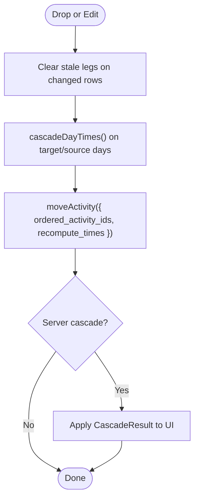
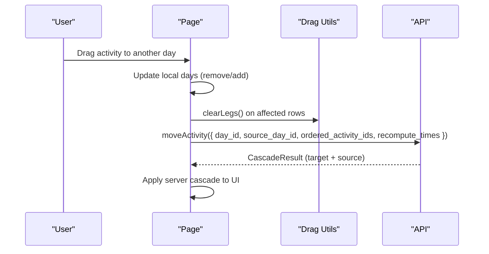
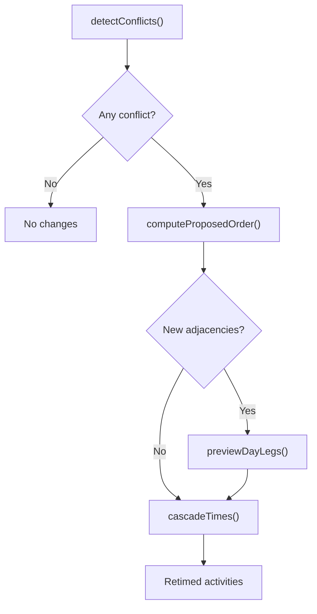
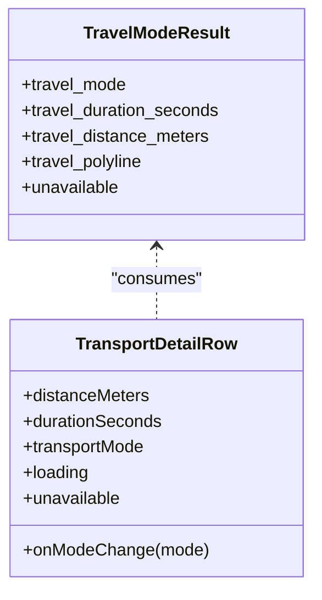
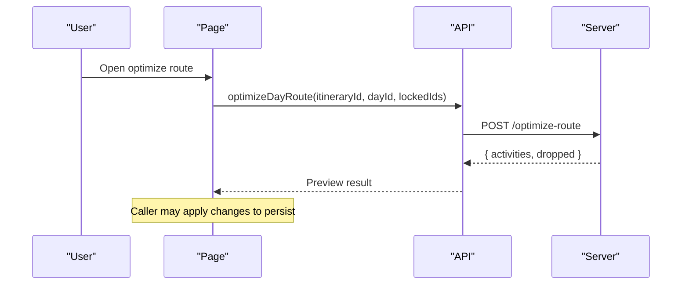
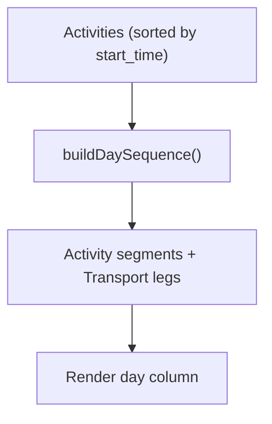
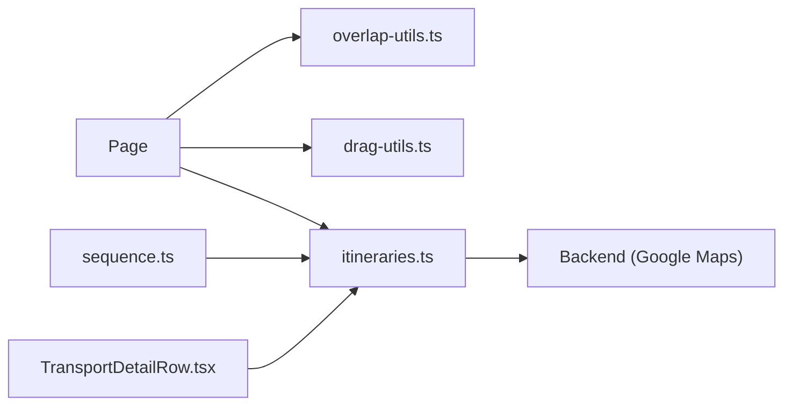

# Activity Management & Scheduling

<cite>
**Referenced Files in This Document**
- [itineraries.ts](file://src/lib/api/itineraries.ts)
- [page.tsx](file://src/app/itineraries/[id]/page.tsx)
- [overlap-utils.ts](file://src/components/ui/itinerary/overlap-utils.ts)
- [drag-utils.ts](file://src/components/ui/itinerary/drag-utils.ts)
- [sequence.ts](file://src/components/ui/itinerary/ItineraryDayColumn/sequence.ts)
- [activity-utils.ts](file://src/components/ui/itinerary/activity-utils.ts)
- [TransportDetailRow.tsx](file://src/components/ui/itinerary/TransportDetailRow.tsx)
- [constants.ts](file://src/components/ui/itinerary/ItineraryDayColumn/constants.ts)
- [ActivityTimeslot.tsx](file://src/components/ui/calendar/ActivityTimeslot.tsx)
- [home.ts](file://src/lib/supabase/queries/home.ts)
</cite>

## Table of Contents
1. Introduction
2. Project Structure
3. Core Components
4. Architecture Overview
5. Detailed Component Analysis
6. Dependency Analysis
7. Performance Considerations
8. Troubleshooting Guide
9. Conclusion

## Introduction
This document explains Argo’s activity management and scheduling system within itineraries. It covers how activities are created, scheduled, and cascaded across a day; how drag-and-drop reordering triggers automatic recalculation of travel times, distances, and routes via Google Maps APIs; how conflicts are detected and resolved; and how route optimization and hypothetical leg previews support planning without persisting changes. It also documents key interfaces such as CreateActivityPayload, TravelModeResult, and CascadeResult, and highlights performance considerations for large itineraries.

## Project Structure
The itinerary editing experience is centered on the page component that orchestrates drag-and-drop, conflict resolution, and server-side cascade operations. Supporting modules provide:
- API contracts and client functions for creating, moving, optimizing, and previewing legs
- Overlap detection and time-cascading utilities
- Day sequence building for rendering activities and transport legs
- Transport mode selection UI and display
- Time parsing/formatting helpers and data mapping to calendar views

**Diagram sources**
- [page.tsx:926-957](file://src/app/itineraries/[id]/page.tsx#L926-L957)
- [itineraries.ts:133-160](file://src/lib/api/itineraries.ts#L133-L160)
- [overlap-utils.ts:75-153](file://src/components/ui/itinerary/overlap-utils.ts#L75-L153)
- [drag-utils.ts:37-88](file://src/components/ui/itinerary/drag-utils.ts#L37-L88)
- [sequence.ts:68-139](file://src/components/ui/itinerary/ItineraryDayColumn/sequence.ts#L68-L139)
- [TransportDetailRow.tsx:37-119](file://src/components/ui/itinerary/TransportDetailRow.tsx#L37-L119)

**Section sources**
- [page.tsx:926-957](file://src/app/itineraries/[id]/page.tsx#L926-L957)
- [itineraries.ts:133-160](file://src/lib/api/itineraries.ts#L133-L160)
- [overlap-utils.ts:75-153](file://src/components/ui/itinerary/overlap-utils.ts#L75-L153)
- [drag-utils.ts:37-88](file://src/components/ui/itinerary/drag-utils.ts#L37-L88)
- [sequence.ts:68-139](file://src/components/ui/itinerary/ItineraryDayColumn/sequence.ts#L68-L139)
- [TransportDetailRow.tsx:37-119](file://src/components/ui/itinerary/TransportDetailRow.tsx#L37-L119)

## Core Components
- CreateActivityPayload: Defines how new activities are added with day assignment, time scheduling, location binding, category classification, optional place details, and an option to trigger server-side recomputation of times and legs.
- TravelModeResult: Describes the outcome when switching transport mode for a leg, including duration, distance, polyline, and availability.
- CascadeResult: Represents batched results after a move or create operation, returning updated activities per affected day (including source day for cross-day moves).
- optimizeDayRoute and previewDayLegs: Provide route optimization and hypothetical leg pricing without persisting changes.

Key responsibilities:
- CreateActivityPayload supports poi, meal, flight, and lodging-related categories, enabling consistent classification across the system.
- TravelModeResult unifies drive/walk outcomes from the backend.
- CascadeResult enables optimistic UI updates by applying server-provided cascaded times and legs.

**Section sources**
- [itineraries.ts:133-160](file://src/lib/api/itineraries.ts#L133-L160)
- [itineraries.ts:162-206](file://src/lib/api/itineraries.ts#L162-L206)
- [itineraries.ts:298-337](file://src/lib/api/itineraries.ts#L298-L337)

## Architecture Overview
The system follows a layered flow:
- User interactions (drag-and-drop, mode switch, add/move) update local state optimistically.
- The page coordinates overlap detection and proposes a new order.
- For new adjacencies, it requests exact travel times via previewDayLegs.
- It then applies cascadeTimes to compute start/end times respecting locked anchors and 10-minute grid snapping.
- On drop commit, the page calls moveActivity with ordered_activity_ids to persist ordering and request server-side cascade (recompute_times).
- The server uses Google Maps to calculate durations, distances, polylines, and returns a CascadeResult applied back to the UI.

**Diagram sources**
- [page.tsx:926-957](file://src/app/itineraries/[id]/page.tsx#L926-L957)
- [page.tsx:2292-2312](file://src/app/itineraries/[id]/page.tsx#L2292-L2312)
- [itineraries.ts:264-296](file://src/lib/api/itineraries.ts#L264-L296)
- [itineraries.ts:322-337](file://src/lib/api/itineraries.ts#L322-L337)
- [overlap-utils.ts:75-153](file://src/components/ui/itinerary/overlap-utils.ts#L75-L153)

## Detailed Component Analysis

### CreateActivityPayload and Category Classification
- Fields include day_id, name, start_time, end_time, location_id, category, latitude/longitude, place_id, photo_url, estimated_duration_hours, place_details, recompute_times, correlation_id, and position.
- Categories supported include poi, meal, flight, and lodging variants (lodging_checkin, lodging_checkout), enabling consistent classification and downstream handling.
- When place_details is provided alongside place_id (without location_id), the server persists location data directly, avoiding duplicate Enterprise billing.

Use cases:
- Add a POI with approximate stay and let the cascade compute travel legs.
- Add a meal or flight with precise times to anchor the schedule.
- Add lodging check-in/check-out points that do not consume a time window.

**Section sources**
- [itineraries.ts:133-160](file://src/lib/api/itineraries.ts#L133-L160)
- [home.ts:214-249](file://src/lib/supabase/queries/home.ts#L214-L249)

### Cascading Schedule and Travel Legs
- Client-side cascade aligns starts to a 10-minute grid and computes earliest departures based on previous end plus travel duration stored on the predecessor row.
- Stale legs are cleared optimistically when successors change, preventing stale map lines until the server cascade returns fresh data.
- The server cascade (triggered by recompute_times) calculates Google Routes for each leg and returns updated activities with travel_mode, duration, distance, and polyline.

**Diagram sources**
- [drag-utils.ts:25-88](file://src/components/ui/itinerary/drag-utils.ts#L25-L88)
- [page.tsx:2231-2269](file://src/app/itineraries/[id]/page.tsx#L2231-L2269)
- [page.tsx:2292-2312](file://src/app/itineraries/[id]/page.tsx#L2292-L2312)
- [itineraries.ts:264-296](file://src/lib/api/itineraries.ts#L264-L296)

**Section sources**
- [drag-utils.ts:25-88](file://src/components/ui/itinerary/drag-utils.ts#L25-L88)
- [page.tsx:2231-2269](file://src/app/itineraries/[id]/page.tsx#L2231-L2269)
- [page.tsx:2292-2312](file://src/app/itineraries/[id]/page.tsx#L2292-L2312)
- [itineraries.ts:264-296](file://src/lib/api/itineraries.ts#L264-L296)

### Drag-and-Drop Reordering and Cross-Day Movement
- The page handles both same-day reorder and cross-day movement, updating local state optimistically and clearing stale legs before committing.
- For cross-day moves, it removes the activity from the source day, inserts into the target day at the dropped index, and sends both source and target ordered lists to ensure idempotent server writes.
- Lodging activities cannot be moved across days.

**Diagram sources**
- [page.tsx:1698-1717](file://src/app/itineraries/[id]/page.tsx#L1698-L1717)
- [page.tsx:2163-2175](file://src/app/itineraries/[id]/page.tsx#L2163-L2175)
- [page.tsx:2214-2269](file://src/app/itineraries/[id]/page.tsx#L2214-L2269)
- [page.tsx:2292-2312](file://src/app/itineraries/[id]/page.tsx#L2292-L2312)

**Section sources**
- [page.tsx:1698-1717](file://src/app/itineraries/[id]/page.tsx#L1698-L1717)
- [page.tsx:2163-2175](file://src/app/itineraries/[id]/page.tsx#L2163-L2175)
- [page.tsx:2214-2269](file://src/app/itineraries/[id]/page.tsx#L2214-L2269)
- [page.tsx:2292-2312](file://src/app/itineraries/[id]/page.tsx#L2292-L2312)

### Conflict Detection and Resolution
- detectConflicts identifies overlapping activities and transport overflow where a predecessor’s travel duration exceeds the gap to the next activity.
- computeProposedOrder determines a feasible order starting from the first conflict, preserving locked activities (e.g., flights) as immovable anchors.
- cascadeTimes re-times unlocked activities from the first conflict forward using exact leg durations (from preview or stored values) and snaps to a 10-minute grid.

**Diagram sources**
- [overlap-utils.ts:75-153](file://src/components/ui/itinerary/overlap-utils.ts#L75-L153)
- [overlap-utils.ts:166-218](file://src/components/ui/itinerary/overlap-utils.ts#L166-L218)
- [overlap-utils.ts:229-289](file://src/components/ui/itinerary/overlap-utils.ts#L229-L289)
- [page.tsx:926-957](file://src/app/itineraries/[id]/page.tsx#L926-L957)

**Section sources**
- [overlap-utils.ts:75-153](file://src/components/ui/itinerary/overlap-utils.ts#L75-L153)
- [overlap-utils.ts:166-218](file://src/components/ui/itinerary/overlap-utils.ts#L166-L218)
- [overlap-utils.ts:229-289](file://src/components/ui/itinerary/overlap-utils.ts#L229-L289)
- [page.tsx:926-957](file://src/app/itineraries/[id]/page.tsx#L926-L957)

### Travel Mode Selection and Display
- setActivityTravelMode switches the transport mode for the leg departing an activity and returns TravelModeResult with duration, distance, polyline, and availability.
- TransportDetailRow renders mode-specific icons, durations, distances, loading skeletons during computation, and “No route” states when Google has no route for the pair in the selected mode.

**Diagram sources**
- [itineraries.ts:162-206](file://src/lib/api/itineraries.ts#L162-L206)
- [TransportDetailRow.tsx:37-119](file://src/components/ui/itinerary/TransportDetailRow.tsx#L37-L119)
- [constants.ts:1-4](file://src/components/ui/itinerary/ItineraryDayColumn/constants.ts#L1-L4)

**Section sources**
- [itineraries.ts:162-206](file://src/lib/api/itineraries.ts#L162-L206)
- [TransportDetailRow.tsx:37-119](file://src/components/ui/itinerary/TransportDetailRow.tsx#L37-L119)
- [constants.ts:1-4](file://src/components/ui/itinerary/ItineraryDayColumn/constants.ts#L1-L4)

### Route Optimization and Hypothetical Planning
- optimizeDayRoute runs Google Route Optimization on a single day and returns a preview of reordered activities and any that don’t fit (to be dropped), without persisting changes.
- previewDayLegs prices exact DRIVE travel times for hypothetical adjacencies used during deconfliction to fill missing legs before showing accurate previews.

**Diagram sources**
- [itineraries.ts:298-313](file://src/lib/api/itineraries.ts#L298-L313)

**Section sources**
- [itineraries.ts:298-313](file://src/lib/api/itineraries.ts#L298-L313)
- [itineraries.ts:322-337](file://src/lib/api/itineraries.ts#L322-L337)

### Rendering Activities and Transport Legs
- buildDaySequence constructs a timeline of activities and transport legs, inferring transport durations and distances from stored travel_* fields on the predecessor row.
- ActivityTimeslot maps itinerary activities to calendar view fields, including category normalization and travel metadata.

**Diagram sources**
- [sequence.ts:59-139](file://src/components/ui/itinerary/ItineraryDayColumn/sequence.ts#L59-L139)
- [ActivityTimeslot.tsx:47-71](file://src/components/ui/calendar/ActivityTimeslot.tsx#L47-L71)

**Section sources**
- [sequence.ts:59-139](file://src/components/ui/itinerary/ItineraryDayColumn/sequence.ts#L59-L139)
- [ActivityTimeslot.tsx:47-71](file://src/components/ui/calendar/ActivityTimeslot.tsx#L47-L71)

## Dependency Analysis
- The page depends on overlap-utils for conflict detection and time cascading, drag-utils for local schedule alignment and leg clearing, and the API layer for server-side cascade and optimization.
- The API layer encapsulates all Google Maps integrations behind typed endpoints, returning structured results consumed by the UI.
- Sequence building depends on persisted travel_* fields; if absent, transport legs are not rendered until the server cascade completes.

**Diagram sources**
- [page.tsx:926-957](file://src/app/itineraries/[id]/page.tsx#L926-L957)
- [itineraries.ts:133-160](file://src/lib/api/itineraries.ts#L133-L160)
- [sequence.ts:68-139](file://src/components/ui/itinerary/ItineraryDayColumn/sequence.ts#L68-L139)
- [TransportDetailRow.tsx:37-119](file://src/components/ui/itinerary/TransportDetailRow.tsx#L37-L119)

**Section sources**
- [page.tsx:926-957](file://src/app/itineraries/[id]/page.tsx#L926-L957)
- [itineraries.ts:133-160](file://src/lib/api/itineraries.ts#L133-L160)
- [sequence.ts:68-139](file://src/components/ui/itinerary/ItineraryDayColumn/sequence.ts#L68-L139)
- [TransportDetailRow.tsx:37-119](file://src/components/ui/itinerary/TransportDetailRow.tsx#L37-L119)

## Performance Considerations
- Batch operations: Use moveActivity with ordered_activity_ids and recompute_times to minimize round-trips and ensure deterministic server-side ordering.
- Avoid unnecessary API calls: previewDayLegs is only invoked when new adjacencies exist, reducing Google Maps usage during pure overlaps without reorders.
- Optimize rendering: Only render transport legs when valid travel_* data exists; otherwise defer until the server cascade completes.
- Grid snapping: 10-minute grid reduces visual jitter and simplifies comparisons while keeping travel durations exact.
- Large itineraries: Keep locked sets minimal; prefer locking only critical anchors (e.g., flights) to reduce recomputation scope.

[No sources needed since this section provides general guidance]

## Troubleshooting Guide
- No route available: When a mode yields no route (e.g., water separation), the UI shows “No route.” Try switching modes or adjusting locations.
- Stale legs after reorder: If map lines look incorrect after a drop, verify that clearLegs was called for affected rows and that the server cascade returned updated legs.
- Conflicts persist: Ensure lockedIds correctly reflect immovable activities (flights) and that cascadeTimes ran from the first conflict index.
- Time jumps: Confirm that start/end times are aligned to the 10-minute grid and that user-set later starts were preserved when they already clear travel gaps.

**Section sources**
- [TransportDetailRow.tsx:92-119](file://src/components/ui/itinerary/TransportDetailRow.tsx#L92-L119)
- [drag-utils.ts:25-35](file://src/components/ui/itinerary/drag-utils.ts#L25-L35)
- [overlap-utils.ts:229-289](file://src/components/ui/itinerary/overlap-utils.ts#L229-L289)

## Conclusion
Argo’s activity management system combines robust client-side scheduling with server-driven Google Maps calculations to deliver a responsive, accurate itinerary editor. By leveraging CreateActivityPayload for flexible creation, TravelModeResult and CascadeResult for consistent transport and batch updates, and utilities for conflict detection, optimization, and hypothetical planning, the system scales to complex itineraries while maintaining a smooth user experience. Proper use of ordered_activity_ids, selective preview calls, and careful handling of stale legs ensures correctness and performance even under heavy edits.