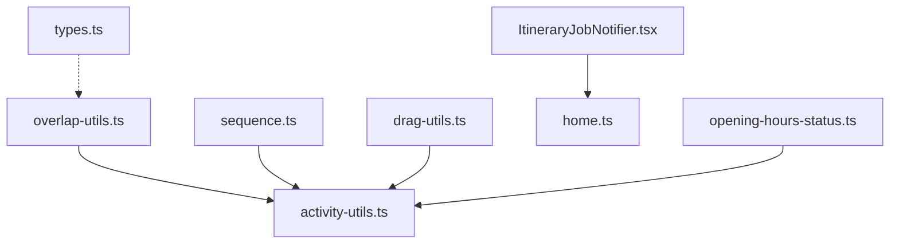
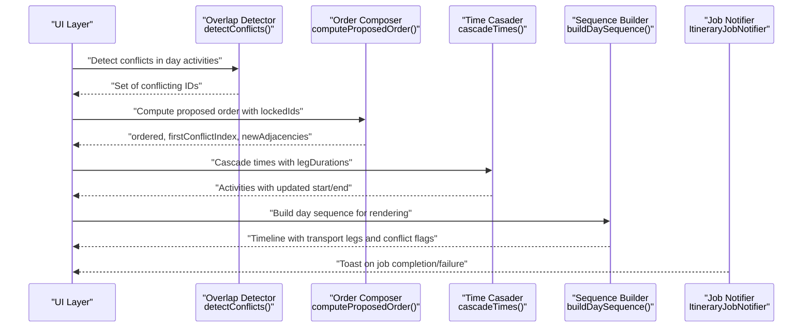
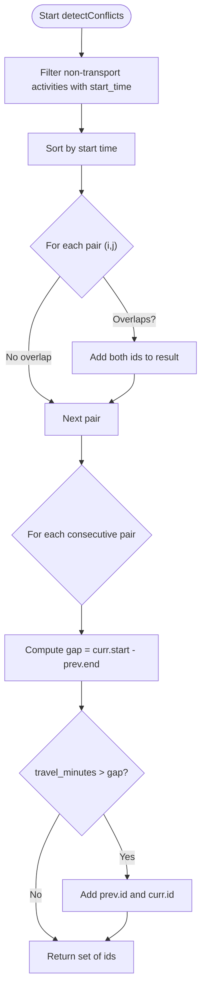
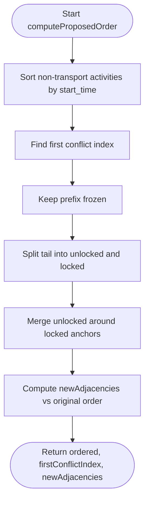
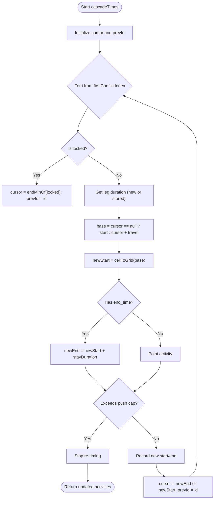
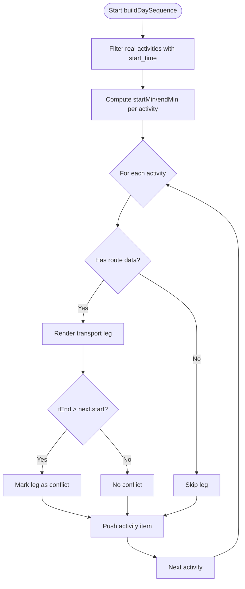
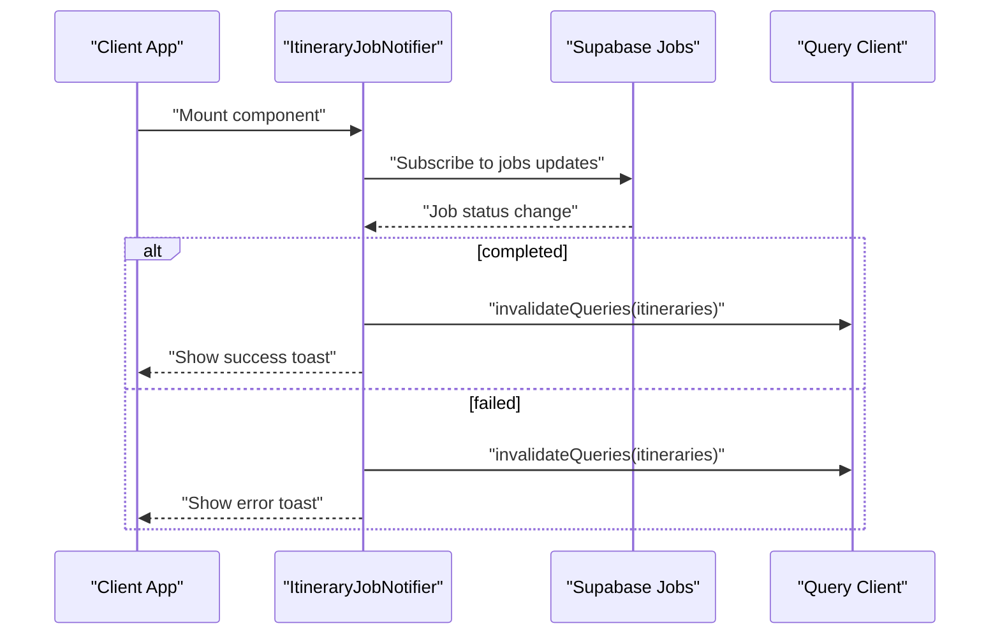
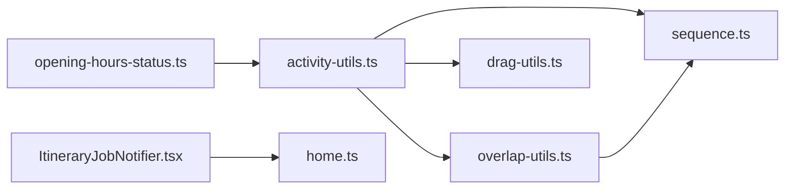

# Conflict Detection & Resolution

<cite>
**Referenced Files in This Document**
- [overlap-utils.ts](file://src/components/ui/itinerary/overlap-utils.ts)
- [activity-utils.ts](file://src/components/ui/itinerary/activity-utils.ts)
- [sequence.ts](file://src/components/ui/itinerary/ItineraryDayColumn/sequence.ts)
- [drag-utils.ts](file://src/components/ui/itinerary/drag-utils.ts)
- [opening-hours-status.ts](file://src/components/ui/itinerary/opening-hours-status.ts)
- [ItineraryJobNotifier.tsx](file://src/components/notifications/ItineraryJobNotifier.tsx)
- [home.ts](file://src/lib/supabase/queries/home.ts)
- [types.ts](file://src/lib/planner/types.ts)
</cite>

## Table of Contents
1. Introduction
2. Project Structure
3. Core Components
4. Architecture Overview
5. Detailed Component Analysis
6. Dependency Analysis
7. Performance Considerations
8. Troubleshooting Guide
9. Conclusion
10. Appendices

## Introduction
This document explains Argo’s activity conflict detection and resolution system for itineraries. It covers how scheduling conflicts are detected using time ranges and transport leg constraints, how conflicts are resolved through automatic reordering and cascaded time adjustments with user-controlled anchors, and how the system integrates with notifications to keep users informed. It also outlines performance considerations for large itineraries and provides guidance for extending conflict rules and integrating with notification systems.

## Project Structure
The conflict detection and resolution logic is implemented primarily in the itinerary UI layer:
- Overlap detection and resolution algorithms live in a dedicated utility module.
- Day sequence building renders activities and transport legs, surfacing conflicts visually.
- Time utilities support parsing/formatting and timezone-aware conversions.
- Notifications integrate with background jobs to inform users about planning outcomes.

**Diagram sources**
- [overlap-utils.ts:1-303](file://src/components/ui/itinerary/overlap-utils.ts#L1-L303)
- [activity-utils.ts:1-128](file://src/components/ui/itinerary/activity-utils.ts#L1-L128)
- [sequence.ts:1-196](file://src/components/ui/itinerary/ItineraryDayColumn/sequence.ts#L1-L196)
- [drag-utils.ts:37-65](file://src/components/ui/itinerary/drag-utils.ts#L37-L65)
- [ItineraryJobNotifier.tsx:1-92](file://src/components/notifications/ItineraryJobNotifier.tsx#L1-L92)
- [home.ts:214-249](file://src/lib/supabase/queries/home.ts#L214-L249)
- [types.ts:1-50](file://src/lib/planner/types.ts#L1-L50)

**Section sources**
- [overlap-utils.ts:1-303](file://src/components/ui/itinerary/overlap-utils.ts#L1-L303)
- [activity-utils.ts:1-128](file://src/components/ui/itinerary/activity-utils.ts#L1-L128)
- [sequence.ts:1-196](file://src/components/ui/itinerary/ItineraryDayColumn/sequence.ts#L1-L196)
- [drag-utils.ts:37-65](file://src/components/ui/itinerary/drag-utils.ts#L37-L65)
- [ItineraryJobNotifier.tsx:1-92](file://src/components/notifications/ItineraryJobNotifier.tsx#L1-L92)
- [home.ts:214-249](file://src/lib/supabase/queries/home.ts#L214-L249)
- [types.ts:1-50](file://src/lib/planner/types.ts#L1-L50)

## Core Components
- Overlap detection and resolution:
  - Detects pairwise time overlaps among non-transport activities.
  - Detects transport overflow when travel duration exceeds the gap between consecutive activities.
  - Computes a proposed order that respects locked anchors (e.g., flights or user-locked activities).
  - Cascades start times forward from the first conflict, applying travel durations and snapping to a grid.
- Day sequence rendering:
  - Builds a visual timeline including transport legs and marks conflicts where travel cannot fit.
- Time utilities:
  - Parses and formats times, supports timezones, and compares wall-clock times consistently.
- Notifications:
  - Subscribes to job updates and informs users when planning completes or fails.

**Section sources**
- [overlap-utils.ts:64-153](file://src/components/ui/itinerary/overlap-utils.ts#L64-L153)
- [overlap-utils.ts:155-218](file://src/components/ui/itinerary/overlap-utils.ts#L155-L218)
- [overlap-utils.ts:220-297](file://src/components/ui/itinerary/overlap-utils.ts#L220-L297)
- [sequence.ts:68-194](file://src/components/ui/itinerary/ItineraryDayColumn/sequence.ts#L68-L194)
- [activity-utils.ts:5-74](file://src/components/ui/itinerary/activity-utils.ts#L5-L74)
- [ItineraryJobNotifier.tsx:29-88](file://src/components/notifications/ItineraryJobNotifier.tsx#L29-L88)

## Architecture Overview
The system follows a two-phase approach:
1. Order computation: Determine a feasible visit order that avoids overlapping locked anchors while preserving relative order of unlocked activities.
2. Time cascade: Starting at the first conflict, compute new start/end times by adding travel durations and snapping to a grid, stopping if the day becomes overpacked.

**Diagram sources**
- [overlap-utils.ts:220-297](file://src/components/ui/itinerary/overlap-utils.ts#L220-L297)
- [overlap-utils.ts:64-153](file://src/components/ui/itinerary/overlap-utils.ts#L64-L153)
- [overlap-utils.ts:155-218](file://src/components/ui/itinerary/overlap-utils.ts#L155-L218)
- [sequence.ts:68-194](file://src/components/ui/itinerary/ItineraryDayColumn/sequence.ts#L68-L194)
- [ItineraryJobNotifier.tsx:29-88](file://src/components/notifications/ItineraryJobNotifier.tsx#L29-L88)

## Detailed Component Analysis

### Overlap Detection Algorithm
- Time overlap detection:
  - Filters out transport rows and sorts by start time.
  - Compares all pairs; if intervals overlap, both activities are flagged.
- Transport overflow detection:
  - For each consecutive pair, computes the gap between previous end and current start.
  - If travel duration (converted to minutes) exceeds the gap, both activities are flagged.
- Point activities:
  - Activities without an end time are treated as points and do not create overlaps with neighbors; only their legs can cause overflow.

**Diagram sources**
- [overlap-utils.ts:220-297](file://src/components/ui/itinerary/overlap-utils.ts#L220-L297)

**Section sources**
- [overlap-utils.ts:220-297](file://src/components/ui/itinerary/overlap-utils.ts#L220-L297)

### Proposed Order Computation
- Freezes activities before the first conflict.
- Merges unlocked activities around locked anchors:
  - An unlocked activity is placed before a locked anchor only if its entire window fits before the anchor’s start.
  - Otherwise, it is deferred until after the anchor.
- Tracks new adjacencies to identify legs requiring backend pricing due to reordering.

**Diagram sources**
- [overlap-utils.ts:64-153](file://src/components/ui/itinerary/overlap-utils.ts#L64-L153)

**Section sources**
- [overlap-utils.ts:64-153](file://src/components/ui/itinerary/overlap-utils.ts#L64-L153)

### Time Cascade and Grid Snapping
- Starts at the first conflict index and walks forward:
  - Locked anchors keep exact times and advance the cursor.
  - Unlocked activities start at previous end + travel, snapped up to a 10-minute grid.
  - End times preserve the activity’s stay duration; point activities remain points.
- Stops re-timing if any activity would push past a cap (overpacked day), leaving the remaining tail unchanged.

**Diagram sources**
- [overlap-utils.ts:155-218](file://src/components/ui/itinerary/overlap-utils.ts#L155-L218)

**Section sources**
- [overlap-utils.ts:155-218](file://src/components/ui/itinerary/overlap-utils.ts#L155-L218)

### Sequence Rendering and Visual Conflicts
- Builds a timeline of activities and transport legs:
  - Uses real route data (distance and duration) to render legs between activities.
  - Marks a leg as conflicting when travel cannot fit within the available gap.
- Hidden transports are supported but do not affect conflict detection.

**Diagram sources**
- [sequence.ts:68-194](file://src/components/ui/itinerary/ItineraryDayColumn/sequence.ts#L68-L194)

**Section sources**
- [sequence.ts:68-194](file://src/components/ui/itinerary/ItineraryDayColumn/sequence.ts#L68-L194)

### Notification Integration
- The notifier subscribes to job status changes for itinerary planning:
  - On completion, invalidates relevant caches and shows a success toast with a link to view the itinerary.
  - On failure, shows an error toast prompting retry.
- Ensures unique channel names per instance to avoid subscription conflicts.

**Diagram sources**
- [ItineraryJobNotifier.tsx:29-88](file://src/components/notifications/ItineraryJobNotifier.tsx#L29-L88)

**Section sources**
- [ItineraryJobNotifier.tsx:29-88](file://src/components/notifications/ItineraryJobNotifier.tsx#L29-L88)

### Data Model and Types
- Activity details include identifiers, timing, category, location metadata, and travel metrics used by detection and rendering.
- Planner types define scheduler options and preference profiles that influence planning behavior upstream.

**Section sources**
- [home.ts:214-249](file://src/lib/supabase/queries/home.ts#L214-L249)
- [types.ts:1-50](file://src/lib/planner/types.ts#L1-L50)

## Dependency Analysis
- overlap-utils.ts depends on activity-utils.ts for time parsing/formatting and on domain types for activity structures.
- sequence.ts depends on activity-utils.ts and uses activity fields to compute positions and transport legs.
- drag-utils.ts performs client-side cascading aligned with server ordering semantics.
- opening-hours-status.ts references overlap logic boundaries for overnight windows.
- ItineraryJobNotifier.tsx depends on Supabase client and query keys to refresh UI state upon job completion.

**Diagram sources**
- [activity-utils.ts:1-128](file://src/components/ui/itinerary/activity-utils.ts#L1-L128)
- [overlap-utils.ts:1-303](file://src/components/ui/itinerary/overlap-utils.ts#L1-L303)
- [sequence.ts:1-196](file://src/components/ui/itinerary/ItineraryDayColumn/sequence.ts#L1-L196)
- [drag-utils.ts:37-65](file://src/components/ui/itinerary/drag-utils.ts#L37-L65)
- [opening-hours-status.ts:8-122](file://src/components/ui/itinerary/opening-hours-status.ts#L8-L122)
- [ItineraryJobNotifier.tsx:1-92](file://src/components/notifications/ItineraryJobNotifier.tsx#L1-L92)
- [home.ts:214-249](file://src/lib/supabase/queries/home.ts#L214-L249)

**Section sources**
- [overlap-utils.ts:1-303](file://src/components/ui/itinerary/overlap-utils.ts#L1-L303)
- [activity-utils.ts:1-128](file://src/components/ui/itinerary/activity-utils.ts#L1-L128)
- [sequence.ts:1-196](file://src/components/ui/itinerary/ItineraryDayColumn/sequence.ts#L1-L196)
- [drag-utils.ts:37-65](file://src/components/ui/itinerary/drag-utils.ts#L37-L65)
- [opening-hours-status.ts:8-122](file://src/components/ui/itinerary/opening-hours-status.ts#L8-L122)
- [ItineraryJobNotifier.tsx:1-92](file://src/components/notifications/ItineraryJobNotifier.tsx#L1-L92)
- [home.ts:214-249](file://src/lib/supabase/queries/home.ts#L214-L249)

## Performance Considerations
- Pairwise overlap checks:
  - The detection algorithm compares all pairs of non-transport activities, resulting in O(n^2) complexity. For large days, consider early exits or spatial indexing if needed.
- Sorting and filtering:
  - Filtering transport rows and sorting by start time are linear operations and dominate less than pairwise checks for large n.
- Cascading:
  - Time cascade is linear in the number of activities from the first conflict onward.
- Rendering:
  - Sequence building iterates once over activities and emits transport legs conditionally based on available route data.
- Practical tips:
  - Keep locked sets minimal to reduce reordering complexity.
  - Avoid unnecessary recomputations by caching results when inputs are stable.
  - Use grid snapping to reduce micro-adjustments and simplify comparisons.

[No sources needed since this section provides general guidance]

## Troubleshooting Guide
- Conflicts persist after edits:
  - Ensure the first conflict index is correctly identified and that locked activities are properly marked.
  - Verify that new adjacencies trigger backend pricing so travel durations reflect reordered legs.
- Transport legs show conflicts:
  - Confirm that route data exists for the leg; missing distance/duration prevents accurate leg rendering.
  - Check that travel_mode and hidden transports are consistent with expectations.
- Notifications not appearing:
  - Validate that the job type filter matches “itinerary-planning” and that the user session is active.
  - Ensure query cache invalidation runs on job completion/failure.

**Section sources**
- [overlap-utils.ts:64-153](file://src/components/ui/itinerary/overlap-utils.ts#L64-L153)
- [overlap-utils.ts:155-218](file://src/components/ui/itinerary/overlap-utils.ts#L155-L218)
- [sequence.ts:108-178](file://src/components/ui/itinerary/ItineraryDayColumn/sequence.ts#L108-L178)
- [ItineraryJobNotifier.tsx:29-88](file://src/components/notifications/ItineraryJobNotifier.tsx#L29-L88)

## Conclusion
Argo’s conflict detection and resolution system combines robust overlap detection with a two-phase resolver that preserves user intent via locked anchors and applies precise time cascades with travel constraints. The visualization layer surfaces conflicts clearly, while notifications keep users informed of planning outcomes. With careful attention to performance and extensibility, the system scales to complex itineraries and supports custom rules and integrations.

[No sources needed since this section summarizes without analyzing specific files]

## Appendices

### Implementing Custom Conflict Rules
- Extend detection:
  - Add additional criteria in the overlap detector to flag activities based on categories, locations, or custom constraints.
- Adjust resolution:
  - Modify the order composer to incorporate priority weights or business rules when merging unlocked activities around locked anchors.
- Customize cascading:
  - Introduce new snapping grids or buffers, or enforce minimum gaps beyond the default grid step.

**Section sources**
- [overlap-utils.ts:220-297](file://src/components/ui/itinerary/overlap-utils.ts#L220-L297)
- [overlap-utils.ts:64-153](file://src/components/ui/itinerary/overlap-utils.ts#L64-L153)
- [overlap-utils.ts:155-218](file://src/components/ui/itinerary/overlap-utils.ts#L155-L218)

### Integrating with Notification Systems
- Subscribe to job events:
  - Use the existing notifier pattern to listen for job status changes and invalidate caches accordingly.
- Surface actionable feedback:
  - Provide links to affected itineraries or actions to retry generation.
- Handle edge cases:
  - Ensure unique channels per instance and guard against duplicate subscriptions.

**Section sources**
- [ItineraryJobNotifier.tsx:29-88](file://src/components/notifications/ItineraryJobNotifier.tsx#L29-L88)