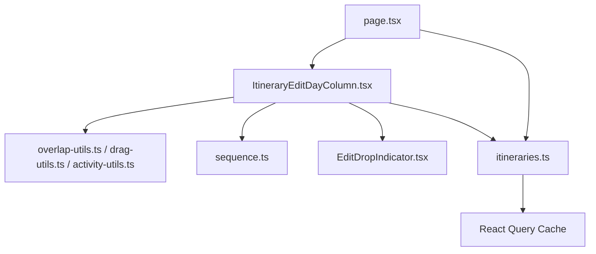
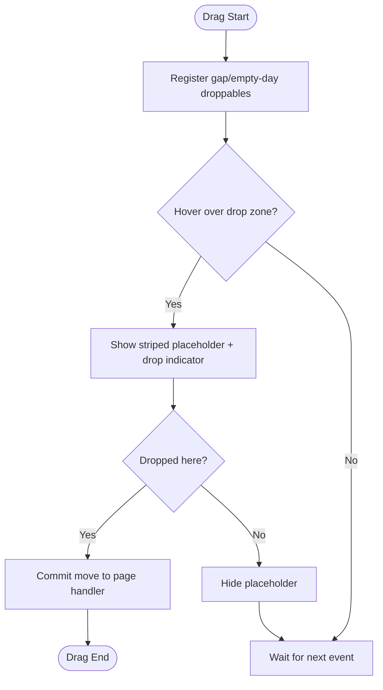
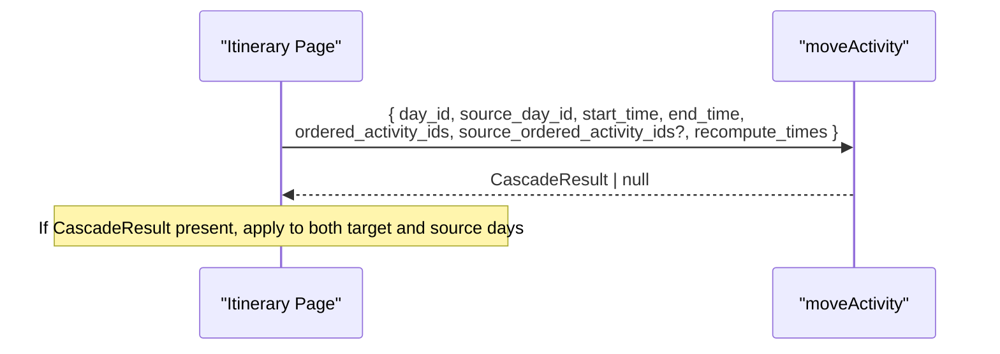
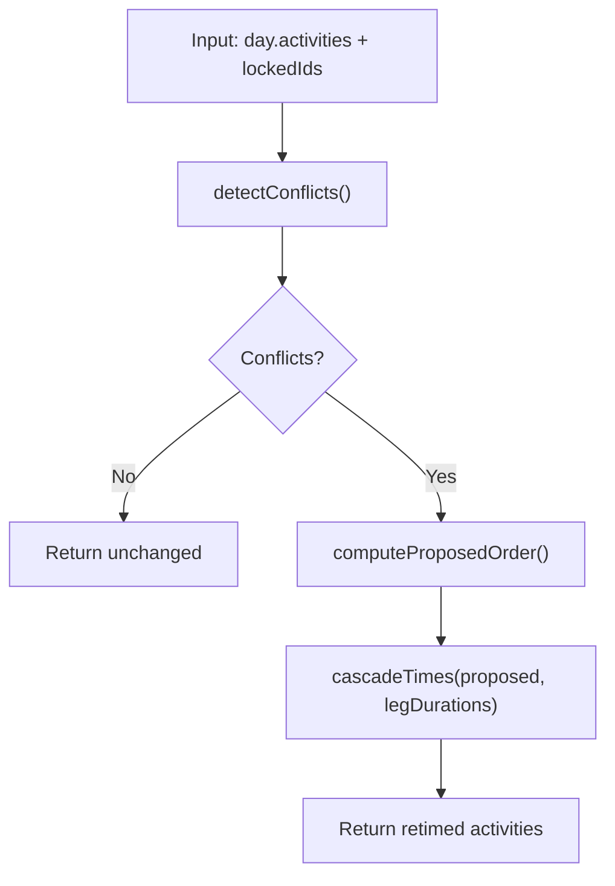
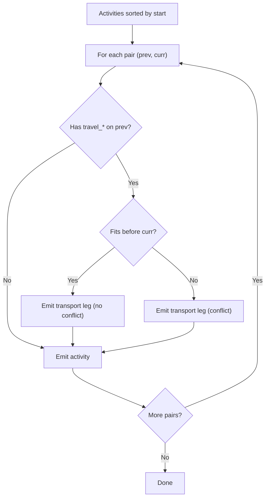
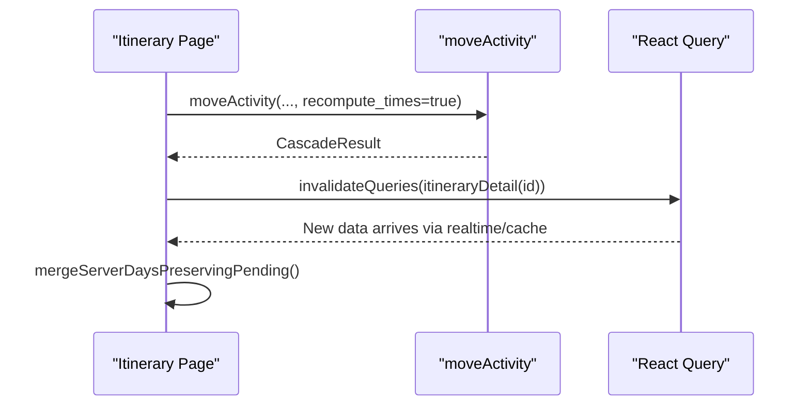
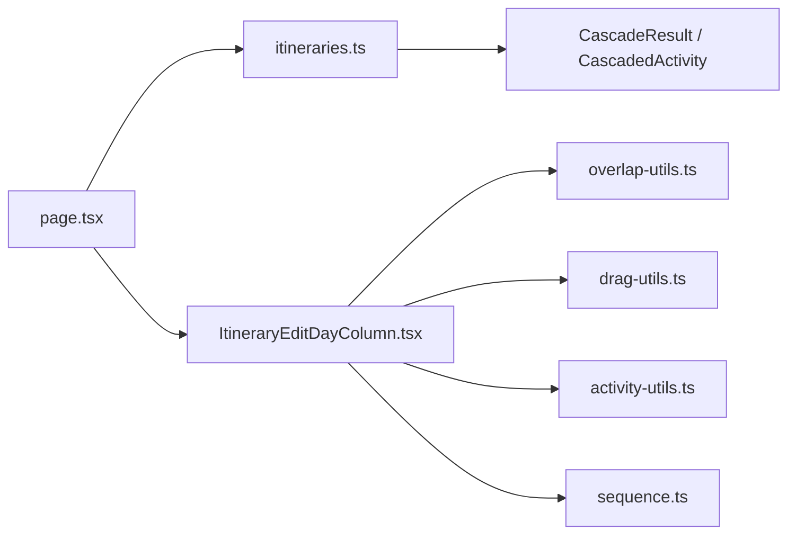

# Drag & Drop Reordering

<cite>
**Referenced Files in This Document**
- [ItineraryEditDayColumn.tsx](file://src/components/ui/itinerary/ItineraryEditDayColumn.tsx)
- [drag-utils.ts](file://src/components/ui/itinerary/drag-utils.ts)
- [overlap-utils.ts](file://src/components/ui/itinerary/overlap-utils.ts)
- [activity-utils.ts](file://src/components/ui/itinerary/activity-utils.ts)
- [sequence.ts](file://src/components/ui/itinerary/ItineraryDayColumn/sequence.ts)
- [EditDropIndicator.tsx](file://src/components/ui/itinerary/EditDropIndicator.tsx)
- [constants.ts](file://src/components/ui/itinerary/ItineraryDayColumn/constants.ts)
- [itineraries.ts](file://src/lib/api/itineraries.ts)
- [page.tsx](file://src/app/itineraries/[id]/page.tsx)
- [queryClient.ts](file://src/lib/query/queryClient.ts)
</cite>

## Table of Contents
1. Introduction
2. Project Structure
3. Core Components
4. Architecture Overview
5. Detailed Component Analysis
6. Dependency Analysis
7. Performance Considerations
8. Troubleshooting Guide
9. Conclusion
10. Appendices

## Introduction
This document explains Argo’s drag-and-drop activity reordering system for itineraries. It covers drop zone detection, visual feedback, cross-day movement support, the moveActivity API contract (including ordered_activity_ids, source_day_id, and recompute_times), the CascadeResult structure returned after moves, performance considerations for large itineraries, conflict resolution during reordering, and implementation patterns for custom drag handlers with optimistic updates via React Query.

## Project Structure
The drag-and-drop feature spans UI components, utility modules, and API integration:
- UI layer: day column rendering, draggable cards, drop zones, and drop indicators
- Utilities: overlap detection, time cascading, sequence building, and time formatting
- API layer: moveActivity and related endpoints that perform server-side route/time recalculation
- Orchestration: the itinerary page coordinates drag events, optimistic state, and query cache invalidation



**Diagram sources**
- [ItineraryEditDayColumn.tsx:450-740](file://src/components/ui/itinerary/ItineraryEditDayColumn.tsx#L450-L740)
- [overlap-utils.ts:75-218](file://src/components/ui/itinerary/overlap-utils.ts#L75-L218)
- [drag-utils.ts:37-88](file://src/components/ui/itinerary/drag-utils.ts#L37-L88)
- [activity-utils.ts:5-74](file://src/components/ui/itinerary/activity-utils.ts#L5-L74)
- [sequence.ts:68-193](file://src/components/ui/itinerary/ItineraryDayColumn/sequence.ts#L68-L193)
- [EditDropIndicator.tsx:13-45](file://src/components/ui/itinerary/EditDropIndicator.tsx#L13-L45)
- [itineraries.ts:264-291](file://src/lib/api/itineraries.ts#L264-L291)
- [page.tsx:2280-2331](file://src/app/itineraries/[id]/page.tsx#L2280-L2331)

**Section sources**
- [ItineraryEditDayColumn.tsx:450-740](file://src/components/ui/itinerary/ItineraryEditDayColumn.tsx#L450-L740)
- [page.tsx:2280-2331](file://src/app/itineraries/[id]/page.tsx#L2280-L2331)
- [itineraries.ts:264-291](file://src/lib/api/itineraries.ts#L264-L291)

## Core Components
- Draggable cards and sortable context: Activities are wrapped in a sortable component with per-card listeners and transforms; locked activities (e.g., flights or synthetic lodging bookends) disable dragging.
- Drop zones: Inter-card gaps and empty-day targets register as droppable regions; when active, they show a striped placeholder and a drop indicator line.
- Visual feedback: A ghost card follows the pointer; drop zones animate in/out; selected cards scroll into view; transport legs display mode and distance/duration where available.
- Conflict awareness: The column computes overlaps to surface a “Resolve conflicts” action and highlights overlapping ranges with inset offsets.

Key behaviors:
- Sorting uses position order from data to avoid re-sorting by start_time which can misplace midnight-wrapping or overlapping items.
- Transport rows are derived from stored travel_* fields on the origin row; missing legs are not synthesized client-side.

**Section sources**
- [ItineraryEditDayColumn.tsx:32-73](file://src/components/ui/itinerary/ItineraryEditDayColumn.tsx#L32-L73)
- [ItineraryEditDayColumn.tsx:137-227](file://src/components/ui/itinerary/ItineraryEditDayColumn.tsx#L137-L227)
- [ItineraryEditDayColumn.tsx:229-289](file://src/components/ui/itinerary/ItineraryEditDayColumn.tsx#L229-L289)
- [ItineraryEditDayColumn.tsx:292-401](file://src/components/ui/itinerary/ItineraryEditDayColumn.tsx#L292-L401)
- [ItineraryEditDayColumn.tsx:510-529](file://src/components/ui/itinerary/ItineraryEditDayColumn.tsx#L510-L529)
- [sequence.ts:68-193](file://src/components/ui/itinerary/ItineraryDayColumn/sequence.ts#L68-L193)
- [EditDropIndicator.tsx:13-45](file://src/components/ui/itinerary/EditDropIndicator.tsx#L13-L45)

## Architecture Overview
End-to-end flow for a drag-and-drop reorder:

```mermaid
sequenceDiagram
participant User as "User"
participant Column as "ItineraryEditDayColumn"
participant Page as "Itinerary Page"
participant API as "moveActivity"
participant Server as "Backend"
participant QCache as "React Query Cache"
User->>Column : Drag activity to new slot
Column->>Page : onDragEnd with target day, times, and indices
Page->>Page : Build ordered_activity_ids<br/>Compute downstream pending IDs
Page->>API : moveActivity({ day_id?, source_day_id?, start_time, end_time, ordered_activity_ids, source_ordered_activity_ids?, recompute_times })
API-->>Page : CascadeResult (or null if no cascade)
Page->>QCache : Invalidate itinerary detail query
Page->>Page : Apply server cascade to local days (retimes + leg updates)
Note over Column,Page : Optimistic UI shows drop preview; final state reconciles with server cascade
```

**Diagram sources**
- [page.tsx:2280-2331](file://src/app/itineraries/[id]/page.tsx#L2280-L2331)
- [itineraries.ts:264-291](file://src/lib/api/itineraries.ts#L264-L291)

**Section sources**
- [page.tsx:2280-2331](file://src/app/itineraries/[id]/page.tsx#L2280-L2331)
- [itineraries.ts:264-291](file://src/lib/api/itineraries.ts#L264-L291)

## Detailed Component Analysis

### Drop Zone Detection and Visual Feedback
- Inter-card gaps and empty-day targets use droppable regions with stable IDs so measurements are consistent before drag starts.
- When a region is hovered during a drag, a striped placeholder appears alongside a drop indicator line; an optional time label can be shown above the line.
- Ghost activity card renders while dragging; it dismisses when clicking outside interactive areas.



**Diagram sources**
- [ItineraryEditDayColumn.tsx:137-227](file://src/components/ui/itinerary/ItineraryEditDayColumn.tsx#L137-L227)
- [ItineraryEditDayColumn.tsx:229-289](file://src/components/ui/itinerary/ItineraryEditDayColumn.tsx#L229-L289)
- [EditDropIndicator.tsx:13-45](file://src/components/ui/itinerary/EditDropIndicator.tsx#L13-L45)

**Section sources**
- [ItineraryEditDayColumn.tsx:137-227](file://src/components/ui/itinerary/ItineraryEditDayColumn.tsx#L137-L227)
- [ItineraryEditDayColumn.tsx:229-289](file://src/components/ui/itinerary/ItineraryEditDayColumn.tsx#L229-L289)
- [EditDropIndicator.tsx:13-45](file://src/components/ui/itinerary/EditDropIndicator.tsx#L13-L45)

### Cross-Day Movement Support
- When moving across days, the page passes both target and source ordered arrays to the server so it can update positions consistently and preserve the intended ordering without index ambiguity.
- source_day_id identifies the original day; ordered_activity_ids is authoritative for the target day’s post-drop order; source_ordered_activity_ids is included only for cross-day moves.



**Diagram sources**
- [page.tsx:2280-2331](file://src/app/itineraries/[id]/page.tsx#L2280-L2331)
- [itineraries.ts:264-291](file://src/lib/api/itineraries.ts#L264-L291)

**Section sources**
- [page.tsx:2280-2331](file://src/app/itineraries/[id]/page.tsx#L2280-L2331)
- [itineraries.ts:264-291](file://src/lib/api/itineraries.ts#L264-L291)

### moveActivity Parameters and CascadeResult
- Parameters:
  - day_id: target day (optional for same-day moves)
  - source_day_id: original day for cross-day moves
  - start_time/end_time: scheduling hints used as floor values during cascade
  - ordered_activity_ids: authoritative post-drop order for the target day
  - source_ordered_activity_ids: authoritative order for the source day (cross-day only)
  - recompute_times: when true, server runs full route/time cascade and returns updated times and legs
- Return:
  - CascadeResult includes day_id, activities (updated times and legs), and optionally source_day with its updated activities when cross-day moves affect both sides.

```mermaid
classDiagram
class MoveParams {
+string? day_id
+string? source_day_id
+string start_time
+string? end_time
+string[] ordered_activity_ids
+string[] source_ordered_activity_ids
+boolean recompute_times
}
class CascadedActivity {
+string id
+string? start_time
+string? end_time
+string? travel_mode
+number? travel_duration_seconds
+number? travel_distance_meters
+string? travel_polyline
}
class CascadeResult {
+string day_id
+CascadedActivity[] activities
+{ day_id : string; activities : CascadedActivity[] }? source_day
}
MoveParams --> CascadeResult : "returns when recompute_times=true"
```

**Diagram sources**
- [itineraries.ts:202-228](file://src/lib/api/itineraries.ts#L202-L228)
- [itineraries.ts:264-291](file://src/lib/api/itineraries.ts#L264-L291)

**Section sources**
- [itineraries.ts:202-228](file://src/lib/api/itineraries.ts#L202-L228)
- [itineraries.ts:264-291](file://src/lib/api/itineraries.ts#L264-L291)

### Overlap Detection and Time Recalculation
- Phase 1 (order): computeProposedOrder determines a conflict-free visit order respecting locked anchors and user windows. It also flags new adjacencies requiring backend pricing.
- Phase 2 (times): cascadeTimes recomputes start/end times along the proposed order, honoring locked anchors and snapping to a 10-minute grid. It stops retiming when pushed too far past midnight to avoid overpacking.
- Client-side helpers: cascadeDayTimes aligns times within a single day using stored travel durations; clearLegs nulls stale travel legs optimistically until the server cascade returns fresh ones.



**Diagram sources**
- [overlap-utils.ts:75-218](file://src/components/ui/itinerary/overlap-utils.ts#L75-L218)
- [drag-utils.ts:37-88](file://src/components/ui/itinerary/drag-utils.ts#L37-L88)

**Section sources**
- [overlap-utils.ts:75-218](file://src/components/ui/itinerary/overlap-utils.ts#L75-L218)
- [drag-utils.ts:37-88](file://src/components/ui/itinerary/drag-utils.ts#L37-L88)

### Sequence Rendering and Transport Legs
- buildDaySequence builds a timeline of activities and transport legs between them. It only emits a leg when the previous row has real Google Routes data (distance and duration). Hidden transports render nothing; visible legs may surface as conflicts when they cannot fit before the next activity.



**Diagram sources**
- [sequence.ts:68-193](file://src/components/ui/itinerary/ItineraryDayColumn/sequence.ts#L68-L193)

**Section sources**
- [sequence.ts:68-193](file://src/components/ui/itinerary/ItineraryDayColumn/sequence.ts#L68-L193)

### Integration with React Query for Optimistic Updates
- After a successful move with recompute_times, the page invalidates the itinerary detail query key so subsequent reads fetch fresh data.
- The edit-mode working copy merges server responses while preserving pending optimistic cards matched by correlation identifiers.
- StaleTime and gcTime are configured at the QueryClient level to balance freshness and memory usage.



**Diagram sources**
- [page.tsx:2280-2331](file://src/app/itineraries/[id]/page.tsx#L2280-L2331)
- [queryClient.ts:1-12](file://src/lib/query/queryClient.ts#L1-L12)

**Section sources**
- [page.tsx:2280-2331](file://src/app/itineraries/[id]/page.tsx#L2280-L2331)
- [queryClient.ts:1-12](file://src/lib/query/queryClient.ts#L1-L12)

## Dependency Analysis
- UI depends on utilities for overlap detection, time cascading, and sequence building.
- The page orchestrates drag events, constructs authoritative ordered arrays, calls moveActivity, and applies server cascade results to local state and query cache.
- API module defines types and endpoints for moveActivity, createActivity, deleteActivity, and optimization helpers.



**Diagram sources**
- [ItineraryEditDayColumn.tsx:450-740](file://src/components/ui/itinerary/ItineraryEditDayColumn.tsx#L450-L740)
- [overlap-utils.ts:75-218](file://src/components/ui/itinerary/overlap-utils.ts#L75-L218)
- [drag-utils.ts:37-88](file://src/components/ui/itinerary/drag-utils.ts#L37-L88)
- [activity-utils.ts:5-74](file://src/components/ui/itinerary/activity-utils.ts#L5-L74)
- [sequence.ts:68-193](file://src/components/ui/itinerary/ItineraryDayColumn/sequence.ts#L68-L193)
- [itineraries.ts:202-291](file://src/lib/api/itineraries.ts#L202-L291)
- [page.tsx:2280-2331](file://src/app/itineraries/[id]/page.tsx#L2280-L2331)

**Section sources**
- [ItineraryEditDayColumn.tsx:450-740](file://src/components/ui/itinerary/ItineraryEditDayColumn.tsx#L450-L740)
- [page.tsx:2280-2331](file://src/app/itineraries/[id]/page.tsx#L2280-L2331)
- [itineraries.ts:202-291](file://src/lib/api/itineraries.ts#L202-L291)

## Performance Considerations
- Authoritative ordering: Send ordered_activity_ids (and source_ordered_activity_ids for cross-day moves) so the server writes position = array index. This avoids index-shift ambiguity and makes operations idempotent.
- Downstream tracking: Mark downstream activities as pending while recompute_times runs to prevent premature UI refreshes and to keep transport legs coherent.
- Grid alignment: Times snap to a 10-minute grid to reduce micro-adjustments and keep schedules readable.
- Overpacked guard: Retiming stops when activities are pushed beyond a threshold past midnight to avoid cascading unrealistic schedules.
- Leg computation: Only emit transport legs when the backend provides real travel data; otherwise, defer to server recalculation to avoid synthetic routes.
- Query cache tuning: StaleTime and gcTime are set to minimize unnecessary refetches while keeping data reasonably fresh.

[No sources needed since this section provides general guidance]

## Troubleshooting Guide
- Drag did not persist:
  - Check whether moveActivity returned a CascadeResult; if null, the endpoint performed a non-cascade update and you should refresh calendar days.
  - Ensure ordered_activity_ids were sent; without them, server position writes may be ambiguous.
- Times look off after move:
  - Verify recompute_times was true for drag-drop paths; otherwise, times are persisted but legs/times may not cascade.
  - Confirm source_day_id and source_ordered_activity_ids are included for cross-day moves.
- Conflicts remain unresolved:
  - Use the Resolve Overlaps action to run computeProposedOrder and cascadeTimes; then confirm changes via optimizeDayRoute if needed.
- Transport legs missing:
  - Legs require stored travel_* fields on the origin row; ensure the backend recalculated them (affected_activity_ids or recompute_times).

**Section sources**
- [page.tsx:2280-2331](file://src/app/itineraries/[id]/page.tsx#L2280-L2331)
- [overlap-utils.ts:229-297](file://src/components/ui/itinerary/overlap-utils.ts#L229-L297)
- [sequence.ts:108-178](file://src/components/ui/itinerary/ItineraryDayColumn/sequence.ts#L108-L178)

## Conclusion
Argo’s drag-and-drop reordering combines precise UI feedback, robust overlap detection, and a server-backed cascade to maintain consistent schedules across days. By sending authoritative ordered arrays and leveraging recompute_times, the system ensures accurate timing, travel legs, and conflict resolution. Integrating with React Query enables smooth optimistic updates and fast reconciliation with server state.

[No sources needed since this section summarizes without analyzing specific files]

## Appendices

### Implementation Patterns for Custom Drag Handlers
- Register stable droppable IDs for all inter-card gaps and empty-day targets before drag starts to avoid measurement timing issues.
- Compute the full ordered_activity_ids list at drop time rather than relying on indices; pass source_ordered_activity_ids for cross-day moves.
- Set pending states for downstream activities while recompute_times runs to keep transport legs and times coherent.
- On success, invalidate the itinerary detail query key to refresh cached data and merge server cascade into local state.

**Section sources**
- [ItineraryEditDayColumn.tsx:137-227](file://src/components/ui/itinerary/ItineraryEditDayColumn.tsx#L137-L227)
- [page.tsx:2280-2331](file://src/app/itineraries/[id]/page.tsx#L2280-L2331)
- [itineraries.ts:264-291](file://src/lib/api/itineraries.ts#L264-L291)