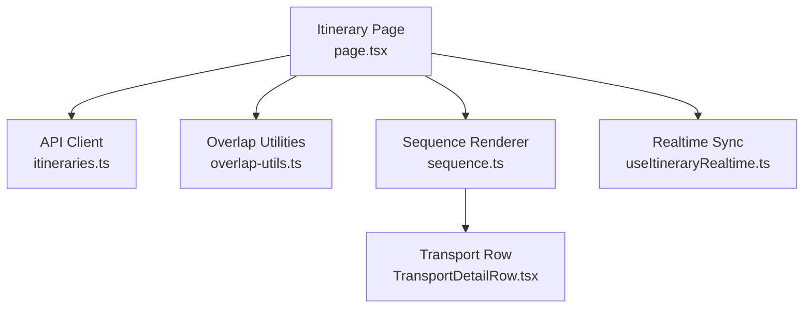
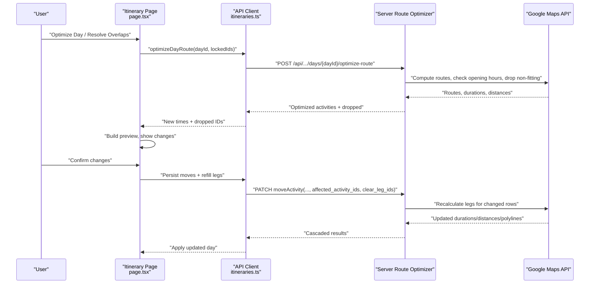
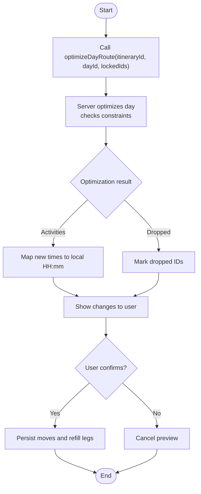
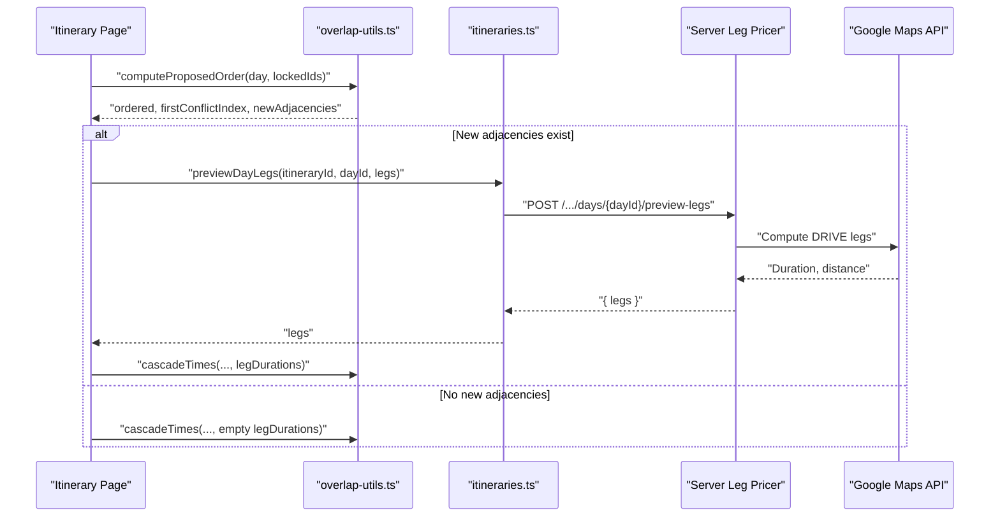
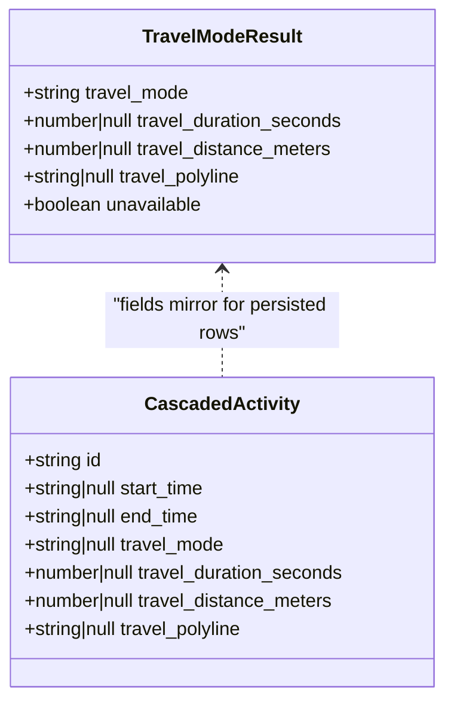
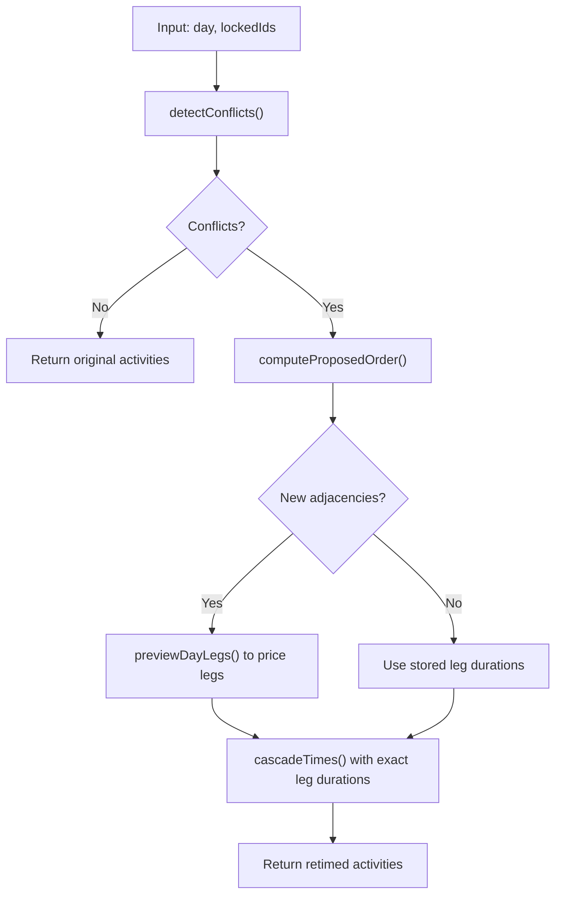
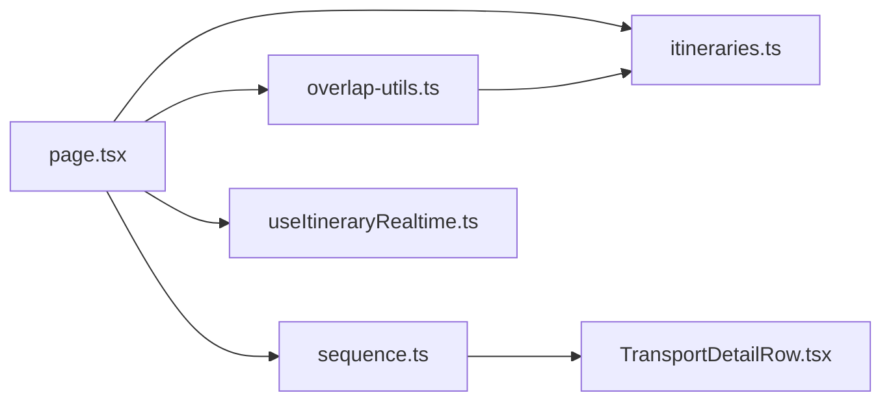

# Route Optimization & Scheduling

<cite>
**Referenced Files in This Document**
- [itineraries.ts](file://src/lib/api/itineraries.ts)
- [overlap-utils.ts](file://src/components/ui/itinerary/overlap-utils.ts)
- [page.tsx](file://src/app/itineraries/[id]/page.tsx)
- [sequence.ts](file://src/components/ui/itinerary/ItineraryDayColumn/sequence.ts)
- [TransportDetailRow.tsx](file://src/components/ui/itinerary/TransportDetailRow.tsx)
- [useItineraryRealtime.ts](file://src/hooks/useItineraryRealtime.ts)
</cite>

## Table of Contents
1. [Introduction](#introduction)
2. [Project Structure](#project-structure)
3. [Core Components](#core-components)
4. [Architecture Overview](#architecture-overview)
5. [Detailed Component Analysis](#detailed-component-analysis)
6. [Dependency Analysis](#dependency-analysis)
7. [Performance Considerations](#performance-considerations)
8. [Troubleshooting Guide](#troubleshooting-guide)
9. [Conclusion](#conclusion)
10. [Appendices](#appendices)

## Introduction
This document explains Argo’s route optimization and intelligent scheduling system for a single day. It focuses on:
- optimizeDayRoute: runs Google Route Optimization on a day, returning new activity times and any locations that do not fit.
- previewDayLegs: prices hypothetical legs (drive/walk) without persisting changes to support deconflict previews.
- TravelModeResult: the interface describing drive/walk transport mode outcomes including duration, distance, polyline, and availability.
- The cascade system that propagates schedule changes across dependent activities and handles conflicts with locked anchors.
- How the system integrates with Google Maps API to compute travel times, distances, and routes.
- Examples for implementing custom optimization strategies and integrating real-time collaboration features.

## Project Structure
The routing and scheduling logic spans client-side utilities, API clients, and UI orchestration:
- API client layer defines types and functions for route optimization and leg pricing.
- Overlap resolution utilities compute proposed order and cascade times using stored or priced legs.
- The itinerary page orchestrates user actions, triggers backend optimization, and applies results.
- Sequence rendering uses stored travel data to display transport legs and modes.
- Realtime hooks keep collaborators synchronized as changes propagate.

**Diagram sources**
- [page.tsx:920-1100](file://src/app/itineraries/[id]/page.tsx#L920-L1100)
- [itineraries.ts:162-337](file://src/lib/api/itineraries.ts#L162-L337)
- [overlap-utils.ts:64-218](file://src/components/ui/itinerary/overlap-utils.ts#L64-L218)
- [sequence.ts:104-139](file://src/components/ui/itinerary/ItineraryDayColumn/sequence.ts#L104-L139)
- [TransportDetailRow.tsx:37-119](file://src/components/ui/itinerary/TransportDetailRow.tsx#L37-L119)
- [useItineraryRealtime.ts:385-440](file://src/hooks/useItineraryRealtime.ts#L385-L440)

**Section sources**
- [itineraries.ts:162-337](file://src/lib/api/itineraries.ts#L162-L337)
- [overlap-utils.ts:64-218](file://src/components/ui/itinerary/overlap-utils.ts#L64-L218)
- [page.tsx:920-1100](file://src/app/itineraries/[id]/page.tsx#L920-L1100)
- [sequence.ts:104-139](file://src/components/ui/itinerary/ItineraryDayColumn/sequence.ts#L104-L139)
- [TransportDetailRow.tsx:37-119](file://src/components/ui/itinerary/TransportDetailRow.tsx#L37-L119)
- [useItineraryRealtime.ts:385-440](file://src/hooks/useItineraryRealtime.ts#L385-L440)

## Core Components
- optimizeDayRoute: Invokes server-side Google Route Optimization for a day with optional locked activities; returns reordered activities with new start/end times and any dropped locations that could not fit.
- previewDayLegs: Computes exact DRIVE travel durations and distances for hypothetical adjacencies without persisting anything; used by deconflict to price newly created legs before applying cascaded times.
- TravelModeResult: Describes the outcome of setting a transport mode per leg, including mode, duration, distance, polyline, and an unavailable flag when no route exists for the pair in that mode.
- Cascade system: Two-phase process—computeProposedOrder determines a conflict-free visit order respecting locked anchors; cascadeTimes then re-times unlocked activities from the first conflict forward, using exact leg durations where available and stored values otherwise.

Key behaviors:
- Locked activities act as immovable anchors; unlocked activities flow after them.
- Times are ceil-snapped to a 10-minute grid to avoid awkward start times.
- If a reorder creates new adjacencies, previewDayLegs is called to price those legs exactly before previewing.
- After user confirmation, moves are persisted and legs are refilled asynchronously via affected_activity_ids and clear_leg_ids.

**Section sources**
- [itineraries.ts:162-337](file://src/lib/api/itineraries.ts#L162-L337)
- [overlap-utils.ts:64-218](file://src/components/ui/itinerary/overlap-utils.ts#L64-L218)
- [page.tsx:920-1100](file://src/app/itineraries/[id]/page.tsx#L920-L1100)

## Architecture Overview
The system combines frontend planning with backend route computation:

**Diagram sources**
- [page.tsx:920-1100](file://src/app/itineraries/[id]/page.tsx#L920-L1100)
- [itineraries.ts:162-337](file://src/lib/api/itineraries.ts#L162-L337)

## Detailed Component Analysis

### optimizeDayRoute
Purpose:
- Runs Google Route Optimization on a single day with locked activities preserved.
- Returns new start/end times for reordered activities and a list of dropped locations that cannot fit due to constraints such as opening hours or time windows.

Flow:
- Frontend calls optimizeDayRoute with itineraryId, dayId, and lockedIds.
- Backend computes optimal ordering, checks feasibility, and returns optimized activities plus dropped items.
- Frontend converts ISO UTC times to local HH:mm and builds a preview showing changes and drops.

**Diagram sources**
- [itineraries.ts:298-313](file://src/lib/api/itineraries.ts#L298-L313)
- [page.tsx:1062-1100](file://src/app/itineraries/[id]/page.tsx#L1062-L1100)

**Section sources**
- [itineraries.ts:298-313](file://src/lib/api/itineraries.ts#L298-L313)
- [page.tsx:1062-1100](file://src/app/itineraries/[id]/page.tsx#L1062-L1100)

### previewDayLegs
Purpose:
- Prices exact DRIVE travel times for hypothetical activity adjacencies without persisting changes.
- Used during overlap resolution to fill in legs created by a reorder that have no stored travel time yet.

Flow:
- computeProposedOrder identifies new adjacencies caused by reordering.
- If any exist, previewDayLegs is called with those pairs.
- Returned durations populate a map keyed by "fromId:toId".
- cascadeTimes uses these exact durations to re-time unlocked activities from the first conflict forward.

**Diagram sources**
- [overlap-utils.ts:64-153](file://src/components/ui/itinerary/overlap-utils.ts#L64-L153)
- [itineraries.ts:315-337](file://src/lib/api/itineraries.ts#L315-L337)
- [page.tsx:920-957](file://src/app/itineraries/[id]/page.tsx#L920-L957)

**Section sources**
- [overlap-utils.ts:64-153](file://src/components/ui/itinerary/overlap-utils.ts#L64-L153)
- [itineraries.ts:315-337](file://src/lib/api/itineraries.ts#L315-L337)
- [page.tsx:920-957](file://src/app/itineraries/[id]/page.tsx#L920-L957)

### TravelModeResult and Transport Mode Handling
TravelModeResult describes the outcome of switching a leg’s transport mode:
- Fields include travel_mode ('drive' | 'walk'), duration, distance, polyline, and an unavailable flag when no route exists for the pair in that mode.
- setActivityTravelMode updates the mode for the leg departing an activity and returns the mode-specific metrics.

Rendering and UX:
- sequence.ts renders transport legs only when the predecessor row has valid travel_* fields from the backend; it reads travel_duration_seconds and travel_distance_meters to compute displayed duration and distance.
- TransportDetailRow shows loading skeletons while legs are recomputing, displays “No route” when unavailable, and formats duration/distance based on the selected mode.

**Diagram sources**
- [itineraries.ts:162-182](file://src/lib/api/itineraries.ts#L162-L182)

**Section sources**
- [itineraries.ts:162-200](file://src/lib/api/itineraries.ts#L162-L200)
- [sequence.ts:104-139](file://src/components/ui/itinerary/ItineraryDayColumn/sequence.ts#L104-L139)
- [TransportDetailRow.tsx:37-119](file://src/components/ui/itinerary/TransportDetailRow.tsx#L37-L119)

### Cascade System: Order and Timing
Two-phase cascade ensures consistent, conflict-free schedules:
- Phase 1 (computeProposedOrder): Determines a proposed visit order starting at the first conflict, preserving locked anchors and deferring unlocked activities that would overlap them. Tracks new adjacencies requiring exact leg pricing.
- Phase 2 (cascadeTimes): From the first conflict forward, re-times unlocked activities using previous end + travel (exact if available, otherwise stored), ceil-snapping starts to a 10-minute grid. Stops retiming if overpacked beyond a cap.

Conflict detection:
- detectConflicts identifies overlapping activities and transport time overflow between consecutive rows.
- dayHasConflicts provides a quick boolean check for UI indicators.

**Diagram sources**
- [overlap-utils.ts:64-218](file://src/components/ui/itinerary/overlap-utils.ts#L64-L218)
- [overlap-utils.ts:220-297](file://src/components/ui/itinerary/overlap-utils.ts#L220-L297)
- [itineraries.ts:315-337](file://src/lib/api/itineraries.ts#L315-L337)

**Section sources**
- [overlap-utils.ts:64-218](file://src/components/ui/itinerary/overlap-utils.ts#L64-L218)
- [overlap-utils.ts:220-297](file://src/components/ui/itinerary/overlap-utils.ts#L220-L297)
- [itineraries.ts:315-337](file://src/lib/api/itineraries.ts#L315-L337)

### Integration with Google Maps API
- Leg pricing and route optimization rely on Google Maps APIs to compute durations, distances, and polylines for each leg.
- The backend performs route optimization considering constraints like opening hours and meal windows, returning feasible orders and dropped locations.
- When a mode switch yields no route (e.g., water separation), the unavailable flag indicates the need to try another mode or adjust placement.

**Section sources**
- [itineraries.ts:162-337](file://src/lib/api/itineraries.ts#L162-L337)
- [TransportDetailRow.tsx:37-119](file://src/components/ui/itinerary/TransportDetailRow.tsx#L37-L119)

## Dependency Analysis
The following diagram shows how components depend on each other to implement route optimization and scheduling:

**Diagram sources**
- [page.tsx:920-1100](file://src/app/itineraries/[id]/page.tsx#L920-L1100)
- [itineraries.ts:162-337](file://src/lib/api/itineraries.ts#L162-L337)
- [overlap-utils.ts:64-218](file://src/components/ui/itinerary/overlap-utils.ts#L64-L218)
- [sequence.ts:104-139](file://src/components/ui/itinerary/ItineraryDayColumn/sequence.ts#L104-L139)
- [TransportDetailRow.tsx:37-119](file://src/components/ui/itinerary/TransportDetailRow.tsx#L37-L119)
- [useItineraryRealtime.ts:385-440](file://src/hooks/useItineraryRealtime.ts#L385-L440)

**Section sources**
- [page.tsx:920-1100](file://src/app/itineraries/[id]/page.tsx#L920-L1100)
- [itineraries.ts:162-337](file://src/lib/api/itineraries.ts#L162-L337)
- [overlap-utils.ts:64-218](file://src/components/ui/itinerary/overlap-utils.ts#L64-L218)
- [sequence.ts:104-139](file://src/components/ui/itinerary/ItineraryDayColumn/sequence.ts#L104-L139)
- [TransportDetailRow.tsx:37-119](file://src/components/ui/itinerary/TransportDetailRow.tsx#L37-L119)
- [useItineraryRealtime.ts:385-440](file://src/hooks/useItineraryRealtime.ts#L385-L440)

## Performance Considerations
- Avoid unnecessary backend calls: previewDayLegs is only invoked when new adjacencies exist, minimizing API usage.
- Use stored leg durations when unchanged to reduce recomputation; only clear stale legs when necessary.
- Ceil-snapping to a 10-minute grid reduces jitter and simplifies UI presentation.
- Stop retiming when overpacked beyond a threshold to prevent cascading into the next day.
- Display loading skeletons during asynchronous leg recalculations to improve perceived performance.

[No sources needed since this section provides general guidance]

## Troubleshooting Guide
Common issues and resolutions:
- “No route” in a given mode: Indicates Google returned no route for the pair in that mode; try switching to another mode or adjusting placement.
- Failed to calculate travel times: Occurs when previewDayLegs fails; retry the operation or check connectivity.
- Overpacked day: If retiming pushes activities past the push cap, the cascade stops; consider removing or rescheduling some activities.
- Stale legs after reorder: Clear stale legs explicitly so they recompute against new neighbors; the system supports clear_leg_ids for this purpose.

**Section sources**
- [TransportDetailRow.tsx:37-119](file://src/components/ui/itinerary/TransportDetailRow.tsx#L37-L119)
- [page.tsx:920-957](file://src/app/itineraries/[id]/page.tsx#L920-L957)
- [overlap-utils.ts:220-297](file://src/components/ui/itinerary/overlap-utils.ts#L220-L297)

## Conclusion
Argo’s route optimization and scheduling system combines precise Google Maps integration with a robust cascade mechanism to deliver reliable, conflict-free itineraries. By separating planning (order proposal) from timing (cascaded retiming), and by pricing hypothetical legs before applying changes, the system provides accurate previews and safe persistence. The TravelModeResult interface and transport UI ensure users can adapt routes dynamically, while realtime hooks keep collaborators synchronized.

[No sources needed since this section summarizes without analyzing specific files]

## Appendices

### Implementing Custom Optimization Strategies
- Extend computeProposedOrder to incorporate custom constraints (e.g., priority scores, category grouping).
- Introduce additional phases before cascadeTimes to apply domain-specific rules (e.g., buffer times, mandatory breaks).
- Hook into previewDayLegs to simulate alternative strategies and compare outcomes before committing.

[No sources needed since this section provides general guidance]

### Integrating Real-Time Collaboration Features
- Leverage useItineraryRealtime to subscribe to itinerary metadata and collaborator membership changes.
- On cascade confirmations, broadcast updates so all collaborators see consistent timelines and transport legs.
- Combine optimistic UI updates with server-backed cascade results to maintain responsiveness and consistency.

**Section sources**
- [useItineraryRealtime.ts:385-440](file://src/hooks/useItineraryRealtime.ts#L385-L440)