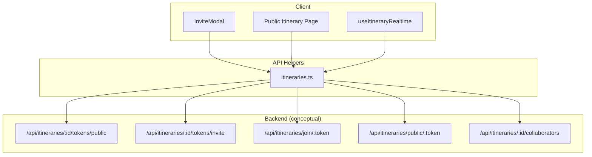
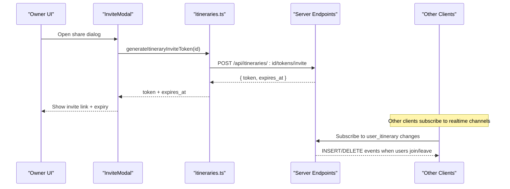
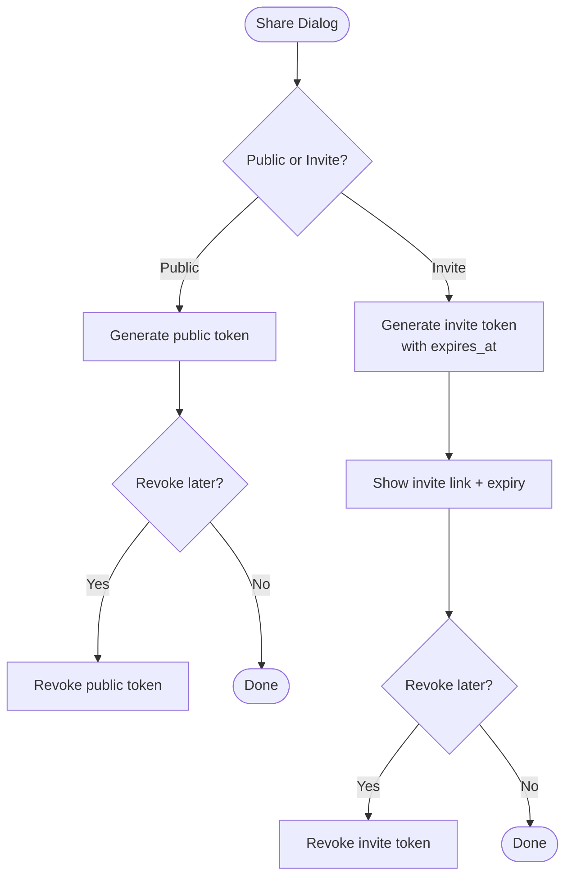
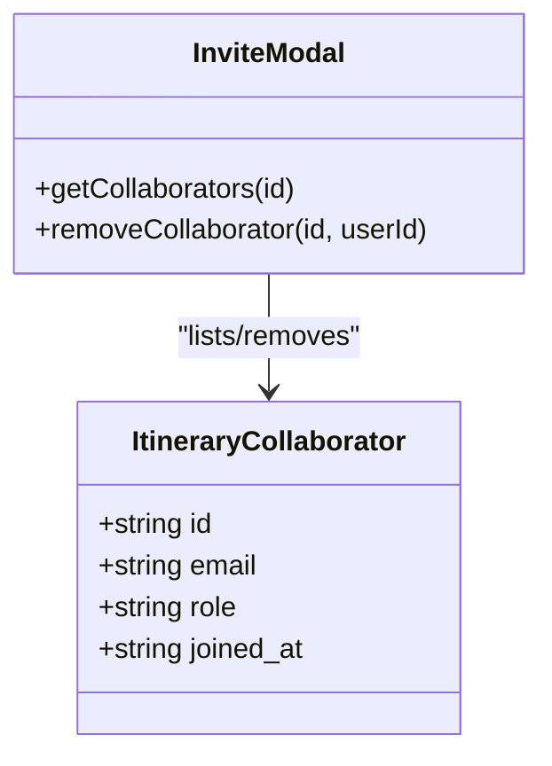
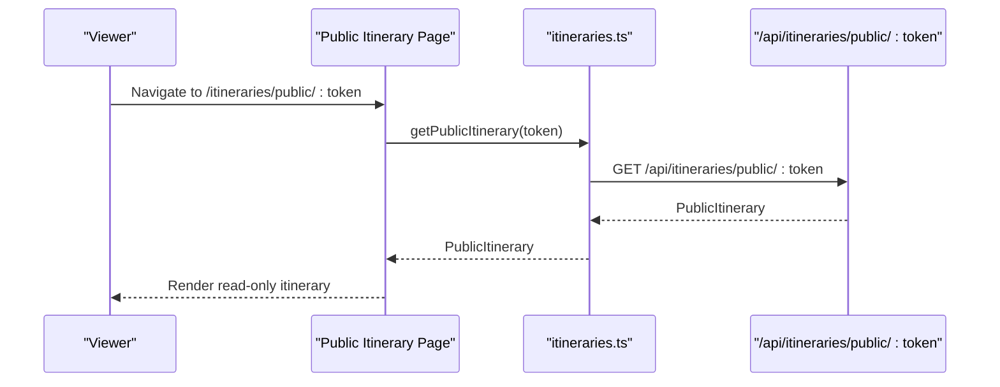
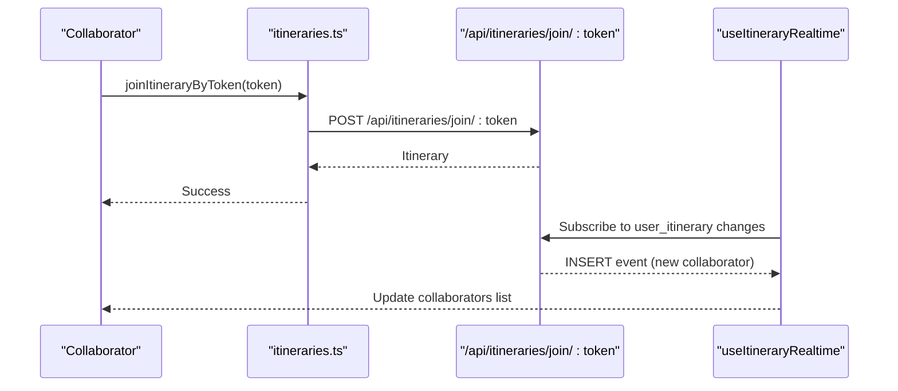
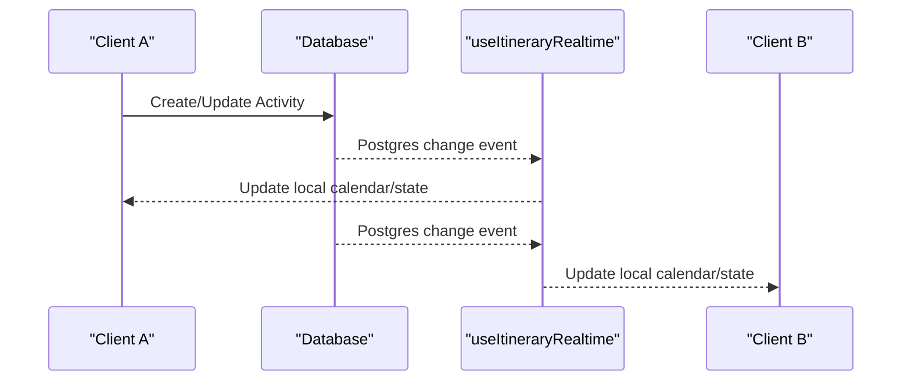
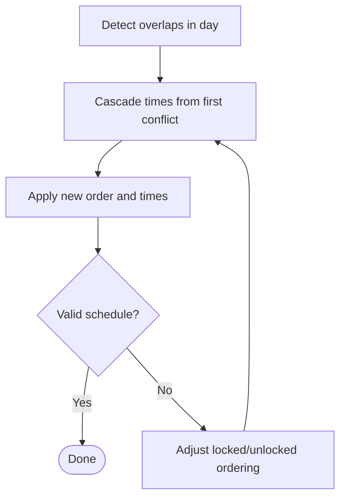
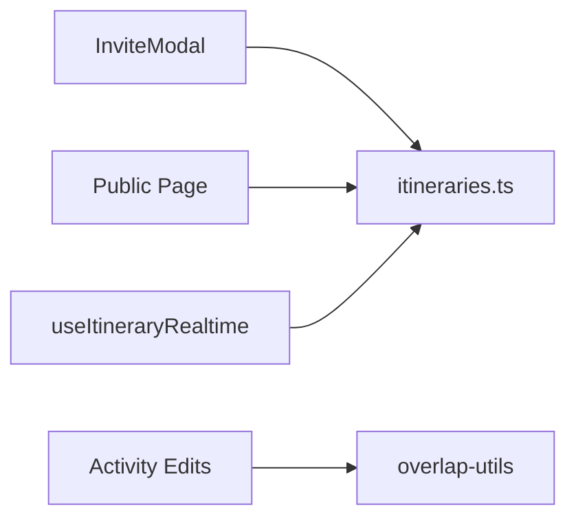

# Collaboration & Public Sharing

<cite>
**Referenced Files in This Document**
- [itineraries.ts](file://src/lib/api/itineraries.ts)
- [InviteModal.tsx](file://src/components/ui/modals/InviteModal.tsx)
- [public page](file://src/app/itineraries/public/[token]/page.tsx)
- [useItineraryRealtime.ts](file://src/hooks/useItineraryRealtime.ts)
- [overlap-utils.ts](file://src/components/ui/itinerary/overlap-utils.ts)
- [userMessages.ts](file://src/lib/errors/userMessages.ts)
</cite>

## Table of Contents
1. [Introduction](#introduction)
2. [Project Structure](#project-structure)
3. [Core Components](#core-components)
4. [Architecture Overview](#architecture-overview)
5. [Detailed Component Analysis](#detailed-component-analysis)
6. [Dependency Analysis](#dependency-analysis)
7. [Performance Considerations](#performance-considerations)
8. [Troubleshooting Guide](#troubleshooting-guide)
9. [Conclusion](#conclusion)

## Introduction
This document explains Argo’s collaboration and sharing features for itineraries, focusing on:
- Token-based access: public read-only links and invite tokens with expiration
- Managing collaborators via the ItineraryCollaborator interface
- Public itinerary viewing through getPublicItinerary and joining via joinItineraryByToken
- Security model for protecting private itineraries while enabling controlled sharing
- Token generation, revocation, and cleanup processes
- Real-time collaboration using Supabase channels
- Conflict detection and resolution for simultaneous edits
- Audit logging considerations for shared itineraries

## Project Structure
The collaboration and sharing capabilities span client-side UI, API helpers, and real-time subscriptions:
- API helpers define token operations, collaborator management, and public/invite flows
- The InviteModal orchestrates generating/revoking tokens and listing collaborators
- A dedicated public route renders read-only itineraries by token
- Real-time hooks subscribe to database changes to keep collaborators and activities synchronized
- Overlap utilities detect and resolve scheduling conflicts during collaborative edits

**Diagram sources**
- [InviteModal.tsx:91-107](file://src/components/ui/modals/InviteModal.tsx#L91-L107)
- [itineraries.ts:448-524](file://src/lib/api/itineraries.ts#L448-L524)
- [public page:27-46](file://src/app/itineraries/public/[token]/page.tsx#L27-L46)
- [useItineraryRealtime.ts:388-440](file://src/hooks/useItineraryRealtime.ts#L388-L440)

**Section sources**
- [itineraries.ts:441-524](file://src/lib/api/itineraries.ts#L441-L524)
- [InviteModal.tsx:111-419](file://src/components/ui/modals/InviteModal.tsx#L111-L419)
- [public page:27-211](file://src/app/itineraries/public/[token]/page.tsx#L27-L211)
- [useItineraryRealtime.ts:388-440](file://src/hooks/useItineraryRealtime.ts#L388-L440)

## Core Components
- ItineraryCollaborator interface defines collaborator identity and role metadata used across the app for managing team members and permissions.
- Token APIs provide:
  - Public token generation and revocation for read-only sharing
  - Invite token generation with expiration and revocation for collaborative editing
  - Joining an itinerary by invite token
  - Fetching public itinerary details by token
- InviteModal implements the user-facing workflows for toggling public sharing, generating invite links, displaying expiry, and managing collaborators.
- Public itinerary page fetches and renders a read-only view of an itinerary by token.
- Real-time hook subscribes to database changes to reflect collaborator joins/leaves and activity updates live.

**Section sources**
- [itineraries.ts:441-524](file://src/lib/api/itineraries.ts#L441-L524)
- [InviteModal.tsx:111-419](file://src/components/ui/modals/InviteModal.tsx#L111-L419)
- [public page:27-211](file://src/app/itineraries/public/[token]/page.tsx#L27-L211)
- [useItineraryRealtime.ts:388-440](file://src/hooks/useItineraryRealtime.ts#L388-L440)

## Architecture Overview
The collaboration architecture combines token-based authorization with real-time synchronization:
- Owners generate public or invite tokens via API helpers; the UI exposes these actions in the InviteModal
- Public links are read-only and served through a dedicated endpoint
- Invite tokens grant temporary collaborative access; they include expiration handling
- Collaborators are listed and managed via API endpoints exposed by the modal
- Real-time subscriptions keep collaborators and activities synchronized across clients

**Diagram sources**
- [InviteModal.tsx:217-256](file://src/components/ui/modals/InviteModal.tsx#L217-L256)
- [itineraries.ts:458-486](file://src/lib/api/itineraries.ts#L458-L486)
- [useItineraryRealtime.ts:407-440](file://src/hooks/useItineraryRealtime.ts#L407-L440)

## Detailed Component Analysis

### Token-Based Access System
- Public tokens:
  - Generated via generateItineraryPublicToken and revoked via revokeItineraryPublicToken
  - Used to create a public URL that serves read-only content through getPublicItinerary
- Invite tokens:
  - Generated via generateItineraryInviteToken returning both token and expires_at
  - Revoked via revokeItineraryInviteToken
  - Joined via joinItineraryByToken to add the current user as a collaborator
- Expiration handling:
  - The InviteModal computes remaining time from expires_at and displays it to owners
  - Error messages include “Invite link has expired” for invalid/expired invites

**Diagram sources**
- [itineraries.ts:448-486](file://src/lib/api/itineraries.ts#L448-L486)
- [InviteModal.tsx:194-256](file://src/components/ui/modals/InviteModal.tsx#L194-L256)

**Section sources**
- [itineraries.ts:448-524](file://src/lib/api/itineraries.ts#L448-L524)
- [InviteModal.tsx:194-307](file://src/components/ui/modals/InviteModal.tsx#L194-L307)
- [userMessages.ts:64-66](file://src/lib/errors/userMessages.ts#L64-L66)

### ItineraryCollaborator Interface and Management
- ItineraryCollaborator includes id, email, role, and joined_at fields to represent team members and their roles
- Collaborators can be fetched via getItineraryCollaborators and removed via removeItineraryCollaborator
- The InviteModal lists collaborators and allows owners to remove them

**Diagram sources**
- [itineraries.ts:441-476](file://src/lib/api/itineraries.ts#L441-L476)
- [InviteModal.tsx:184-270](file://src/components/ui/modals/InviteModal.tsx#L184-L270)

**Section sources**
- [itineraries.ts:441-476](file://src/lib/api/itineraries.ts#L441-L476)
- [InviteModal.tsx:184-270](file://src/components/ui/modals/InviteModal.tsx#L184-L270)

### Public Itinerary Viewing
- The public page calls getPublicItinerary(token) to fetch a read-only representation of the itinerary
- Errors surface friendly messages if the link is invalid or no longer shared

**Diagram sources**
- [public page:27-46](file://src/app/itineraries/public/[token]/page.tsx#L27-L46)
- [itineraries.ts:520-524](file://src/lib/api/itineraries.ts#L520-L524)

**Section sources**
- [public page:27-211](file://src/app/itineraries/public/[token]/page.tsx#L27-L211)
- [itineraries.ts:520-524](file://src/lib/api/itineraries.ts#L520-L524)

### Joining by Invite Token
- Users can join an itinerary using joinItineraryByToken(token), which adds them as a collaborator
- Real-time subscriptions update the collaborator list immediately after a join event

**Diagram sources**
- [itineraries.ts:484-486](file://src/lib/api/itineraries.ts#L484-L486)
- [useItineraryRealtime.ts:407-440](file://src/hooks/useItineraryRealtime.ts#L407-L440)

**Section sources**
- [itineraries.ts:484-486](file://src/lib/api/itineraries.ts#L484-L486)
- [useItineraryRealtime.ts:407-440](file://src/hooks/useItineraryRealtime.ts#L407-L440)

### Security Model
- Role checks:
  - Only owners can generate/revoke public and invite tokens
  - Only owners can view/remove collaborators
- Error messages enforce these constraints and inform users appropriately
- Public links are read-only; collaborative editing requires an invite token and membership

**Section sources**
- [userMessages.ts:73-83](file://src/lib/errors/userMessages.ts#L73-L83)

### Real-Time Collaboration
- Subscriptions to database changes synchronize:
  - Activities (insert/update/delete)
  - Days (insert/delete)
  - Itinerary metadata (updates)
  - Collaborator joins/leaves (user_itinerary table)
- These ensure all participants see consistent state without manual refresh

**Diagram sources**
- [useItineraryRealtime.ts:39-333](file://src/hooks/useItineraryRealtime.ts#L39-L333)
- [useItineraryRealtime.ts:335-440](file://src/hooks/useItineraryRealtime.ts#L335-L440)

**Section sources**
- [useItineraryRealtime.ts:39-440](file://src/hooks/useItineraryRealtime.ts#L39-L440)

### Conflict Resolution for Simultaneous Edits
- Conflict detection identifies overlapping activities and transport time overflow between consecutive activities
- Cascade logic re-times unlocked activities around locked anchors to maintain schedule integrity
- This ensures collaborative edits do not produce impossible schedules

**Diagram sources**
- [overlap-utils.ts:229-289](file://src/components/ui/itinerary/overlap-utils.ts#L229-L289)
- [overlap-utils.ts:155-170](file://src/components/ui/itinerary/overlap-utils.ts#L155-L170)

**Section sources**
- [overlap-utils.ts:155-289](file://src/components/ui/itinerary/overlap-utils.ts#L155-L289)

### Audit Logging for Shared Itineraries
- The frontend exposes error messages related to sharing permissions and token states
- For comprehensive audit trails, consider extending backend logs to record:
  - Token generation and revocation events
  - Collaborator joins and removals
  - Public link accesses
- This would support compliance and troubleshooting needs

[No sources needed since this section provides general guidance]

## Dependency Analysis
- InviteModal depends on itineraries.ts for token and collaborator operations
- Public page depends on itineraries.ts for fetching public data
- useItineraryRealtime depends on Supabase channels to sync state changes
- overlap-utils supports conflict resolution during collaborative edits

**Diagram sources**
- [InviteModal.tsx:91-107](file://src/components/ui/modals/InviteModal.tsx#L91-L107)
- [itineraries.ts:448-524](file://src/lib/api/itineraries.ts#L448-L524)
- [useItineraryRealtime.ts:388-440](file://src/hooks/useItineraryRealtime.ts#L388-L440)
- [overlap-utils.ts:229-289](file://src/components/ui/itinerary/overlap-utils.ts#L229-L289)

**Section sources**
- [InviteModal.tsx:91-107](file://src/components/ui/modals/InviteModal.tsx#L91-L107)
- [itineraries.ts:448-524](file://src/lib/api/itineraries.ts#L448-L524)
- [useItineraryRealtime.ts:388-440](file://src/hooks/useItineraryRealtime.ts#L388-L440)
- [overlap-utils.ts:229-289](file://src/components/ui/itinerary/overlap-utils.ts#L229-L289)

## Performance Considerations
- Real-time subscriptions minimize polling overhead by leveraging database change events
- Efficient state updates avoid unnecessary re-renders by targeting specific activities and days
- Conflict resolution operates on sorted arrays and uses maps for O(1) lookups where possible

[No sources needed since this section provides general guidance]

## Troubleshooting Guide
Common issues and resolutions:
- Invalid or expired invite token: Use friendly error messages to guide users to regenerate or request a new link
- Access denied: Ensure only owners perform token and collaborator management actions
- Real-time sync failures: Verify Supabase channel subscriptions and network connectivity

**Section sources**
- [userMessages.ts:64-83](file://src/lib/errors/userMessages.ts#L64-L83)

## Conclusion
Argo’s collaboration and sharing system combines token-based access control with real-time synchronization to enable secure, efficient teamwork on itineraries. Public links offer read-only sharing, while invite tokens provide temporary collaborative access with expiration handling. The ItineraryCollaborator interface and InviteModal streamline team member management. Real-time subscriptions keep all participants synchronized, and robust conflict resolution ensures schedule integrity during simultaneous edits. Extending backend audit logging would further enhance security and compliance.