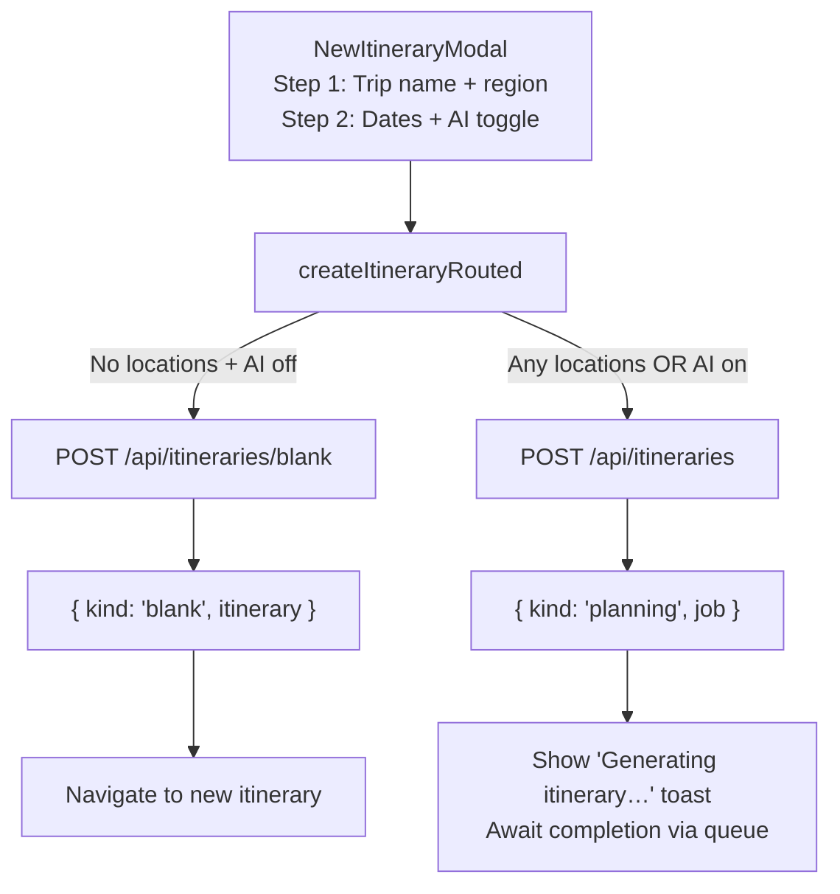
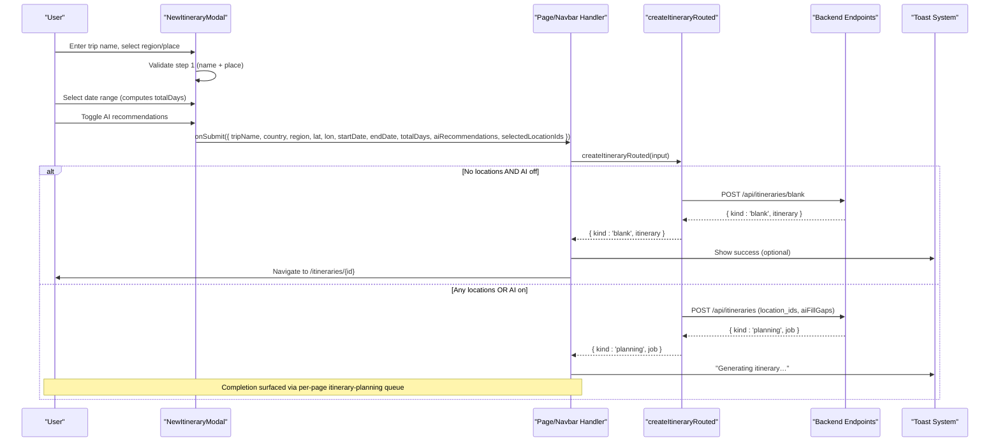
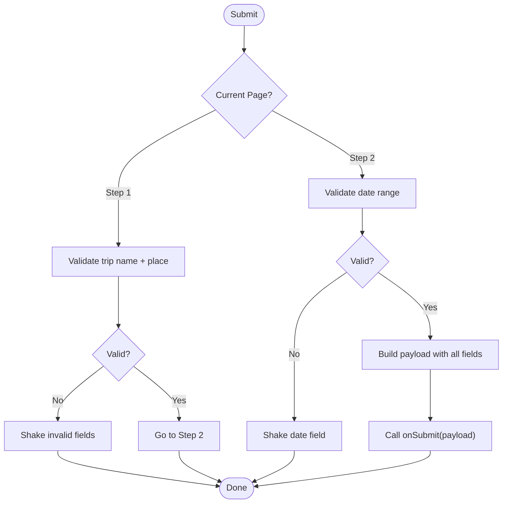
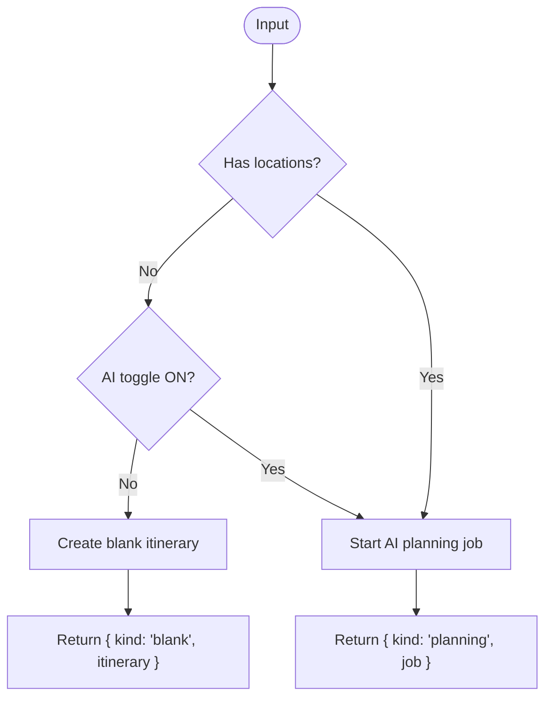
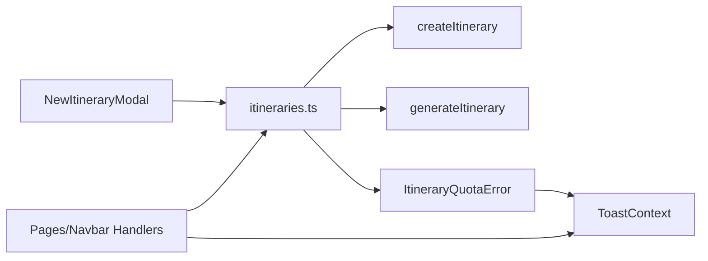

# Itinerary Creation Workflow

<cite>
**Referenced Files in This Document**
- [NewItineraryModal.tsx](file://src/components/ui/modals/NewItineraryModal.tsx)
- [itineraries.ts](file://src/lib/api/itineraries.ts)
- [MainLayout.tsx](file://src/components/ui/layout/MainLayout.tsx)
- [home/page.tsx](file://src/app/home/page.tsx)
- [itineraries/page.tsx](file://src/app/itineraries/page.tsx)
- [ToastContext.tsx](file://src/contexts/ToastContext.tsx)
- [userMessages.ts](file://src/lib/errors/userMessages.ts)
</cite>

## Table of Contents
1. [Introduction](#introduction)
2. [Project Structure](#project-structure)
3. [Core Components](#core-components)
4. [Architecture Overview](#architecture-overview)
5. [Detailed Component Analysis](#detailed-component-analysis)
6. [Dependency Analysis](#dependency-analysis)
7. [Performance Considerations](#performance-considerations)
8. [Troubleshooting Guide](#troubleshooting-guide)
9. [Conclusion](#conclusion)

## Introduction
This document explains the end-to-end itinerary creation workflow in Argo’s AI-powered planning system, focusing on the NewItineraryModal component and its routing logic that decides whether to create a blank itinerary or trigger an AI planning job. It covers trip parameter collection (name, dates, duration, locations), the AI recommendation toggle behavior, form validation, user input handling, and error handling for quota limits, network failures, and invalid inputs.

## Project Structure
The itinerary creation flow spans UI, API routing, and error handling layers:
- UI layer: NewItineraryModal collects trip parameters and validates inputs across two steps.
- Routing layer: createItineraryRouted decides which backend endpoint to call based on user selections.
- Error handling: Quota errors are typed and surfaced via toast notifications; friendly messages are used for user-facing errors.

**Diagram sources**
- [NewItineraryModal.tsx:118-160](file://src/components/ui/modals/NewItineraryModal.tsx#L118-L160)
- [itineraries.ts:406-439](file://src/lib/api/itineraries.ts#L406-L439)
- [itineraries.ts:339-367](file://src/lib/api/itineraries.ts#L339-L367)
- [itineraries.ts:101-120](file://src/lib/api/itineraries.ts#L101-L120)

**Section sources**
- [NewItineraryModal.tsx:1-286](file://src/components/ui/modals/NewItineraryModal.tsx#L1-L286)
- [itineraries.ts:339-439](file://src/lib/api/itineraries.ts#L339-L439)

## Core Components
- NewItineraryModal: Two-step modal collecting trip name, region/place, date range, and AI toggle. Validates required fields and computes total days from selected dates. Emits onSubmit with structured data including selectedLocationIds and aiRecommendations.
- createItineraryRouted: Routes requests to either blank itinerary creation or AI planning job based on presence of selected locations and AI toggle state. Returns a discriminated result indicating whether to navigate immediately or await async job completion.
- Callers (MainLayout, home page, itineraries page): Validate minimal required fields before calling createItineraryRouted, handle results by navigating or showing a success toast, and manage error states via toast notifications.

**Section sources**
- [NewItineraryModal.tsx:59-160](file://src/components/ui/modals/NewItineraryModal.tsx#L59-L160)
- [itineraries.ts:377-439](file://src/lib/api/itineraries.ts#L377-L439)
- [MainLayout.tsx:181-216](file://src/components/ui/layout/MainLayout.tsx#L181-L216)
- [home/page.tsx:492-551](file://src/app/home/page.tsx#L492-L551)
- [itineraries/page.tsx:201-223](file://src/app/itineraries/page.tsx#L201-L223)

## Architecture Overview
The creation workflow is driven by user interactions in the modal and routed through a central function that determines the correct backend path. The result type informs post-create UX: immediate navigation for blank itineraries or asynchronous job handling for AI-generated plans.

**Diagram sources**
- [NewItineraryModal.tsx:118-160](file://src/components/ui/modals/NewItineraryModal.tsx#L118-L160)
- [itineraries.ts:406-439](file://src/lib/api/itineraries.ts#L406-L439)
- [itineraries.ts:339-367](file://src/lib/api/itineraries.ts#L339-L367)
- [itineraries.ts:101-120](file://src/lib/api/itineraries.ts#L101-L120)
- [MainLayout.tsx:181-216](file://src/components/ui/layout/MainLayout.tsx#L181-L216)
- [home/page.tsx:492-551](file://src/app/home/page.tsx#L492-L551)
- [itineraries/page.tsx:201-223](file://src/app/itineraries/page.tsx#L201-L223)

## Detailed Component Analysis

### NewItineraryModal: Form Validation and Input Handling
- Step 1 validation: Requires trip name and a selected place/region. Invalid fields trigger visual feedback via shaking animation.
- Step 2 validation: Requires a valid date range; totalDays is computed from the selected range. If missing, the date field shakes.
- Submission payload: Includes tripName, country, region, latitude, longitude, startDate, endDate, totalDays, aiRecommendations, and selectedLocationIds.
- State management: Tracks page progression, submission state, and resets state when closing unless submitted.

**Diagram sources**
- [NewItineraryModal.tsx:118-160](file://src/components/ui/modals/NewItineraryModal.tsx#L118-L160)
- [NewItineraryModal.tsx:88-103](file://src/components/ui/modals/NewItineraryModal.tsx#L88-L103)

**Section sources**
- [NewItineraryModal.tsx:59-160](file://src/components/ui/modals/NewItineraryModal.tsx#L59-L160)
- [NewItineraryModal.tsx:180-277](file://src/components/ui/modals/NewItineraryModal.tsx#L180-L277)

### createItineraryRouted: Routing Logic and Four Creation Scenarios
- Inputs: tripName, country, region, latitude, longitude, startDate, endDate, totalDays, selectedLocationIds, aiRecommendations, source.
- Decision matrix:
  - No locations + AI off → Create blank itinerary via POST /api/itineraries/blank.
  - Any locations selected (AI on/off) → Trigger AI planning job via POST /api/itineraries with location_ids and aiFillGaps mirroring AI toggle.
  - No locations + AI on → Trigger AI planning job via POST /api/itineraries with empty location_ids.
- Output: Discriminated result { kind: 'blank' | 'planning' } guides post-create UX.

**Diagram sources**
- [itineraries.ts:406-439](file://src/lib/api/itineraries.ts#L406-L439)

**Section sources**
- [itineraries.ts:377-439](file://src/lib/api/itineraries.ts#L377-L439)

### Callers: Navigation and Job Queues
- MainLayout, home page, and itineraries page validate minimal required fields before invoking createItineraryRouted.
- For blank itineraries, callers invalidate relevant queries, prepend items, and navigate to the new itinerary detail page.
- For AI planning jobs, callers show a success toast indicating generation and rely on per-page queues to surface completion and enable viewing.

**Section sources**
- [MainLayout.tsx:181-216](file://src/components/ui/layout/MainLayout.tsx#L181-L216)
- [home/page.tsx:492-551](file://src/app/home/page.tsx#L492-L551)
- [itineraries/page.tsx:201-223](file://src/app/itineraries/page.tsx#L201-L223)

## Dependency Analysis
- NewItineraryModal depends on:
  - PlaceAutocomplete for region selection.
  - Calendar for date range selection.
  - FormModal for layout and submit/cancel behavior.
- createItineraryRouted depends on:
  - createItinerary for blank itineraries.
  - generateItinerary for AI planning jobs.
- Error handling depends on:
  - ItineraryQuotaError for quota violations.
  - getFriendlyApiError for safe user-facing messages.
  - ToastContext for consistent notification UX.

**Diagram sources**
- [NewItineraryModal.tsx:1-286](file://src/components/ui/modals/NewItineraryModal.tsx#L1-L286)
- [itineraries.ts:101-120](file://src/lib/api/itineraries.ts#L101-L120)
- [itineraries.ts:339-367](file://src/lib/api/itineraries.ts#L339-L367)
- [ToastContext.tsx:1-154](file://src/contexts/ToastContext.tsx#L1-L154)

**Section sources**
- [itineraries.ts:1-120](file://src/lib/api/itineraries.ts#L1-L120)
- [itineraries.ts:339-439](file://src/lib/api/itineraries.ts#L339-L439)
- [ToastContext.tsx:1-154](file://src/contexts/ToastContext.tsx#L1-L154)

## Performance Considerations
- Client-side validation minimizes unnecessary network calls by ensuring required fields are present before submission.
- Date range computation is memoized to avoid recalculating totalDays on every render.
- Asynchronous AI planning avoids blocking the UI; users receive immediate feedback via toasts while jobs complete in the background.
- Quota checks at the API layer prevent wasteful processing when limits are exceeded.

[No sources needed since this section provides general guidance]

## Troubleshooting Guide
Common issues and how they are handled:
- Quota limits: When the backend returns a quota exceeded response, ItineraryQuotaError is thrown and caught by callers, which display a toast with plan limit details and an action to view billing.
- Network failures: Friendly error messages are used to inform users about connectivity issues without exposing technical details.
- Invalid inputs: Form validation highlights missing or invalid fields with visual feedback; callers also perform pre-flight checks for required fields.

Recommended actions:
- Ensure trip name and region/place are selected before proceeding.
- Confirm a valid date range is chosen to compute totalDays.
- If encountering quota errors, consider deleting existing itineraries or upgrading the plan.
- Retry after network issues; use the provided friendly messages to guide next steps.

**Section sources**
- [itineraries.ts:339-367](file://src/lib/api/itineraries.ts#L339-L367)
- [itineraries.ts:101-120](file://src/lib/api/itineraries.ts#L101-L120)
- [userMessages.ts:94-106](file://src/lib/errors/userMessages.ts#L94-L106)
- [ToastContext.tsx:90-127](file://src/contexts/ToastContext.tsx#L90-L127)

## Conclusion
The itinerary creation workflow integrates a robust two-step modal with clear validation and a centralized routing function that directs requests to appropriate endpoints based on user choices. It supports both blank itinerary creation and AI-driven planning, providing immediate feedback and graceful error handling for quota and network issues. Callers coordinate navigation and job queues to deliver a seamless user experience across different entry points.

[No sources needed since this section summarizes without analyzing specific files]