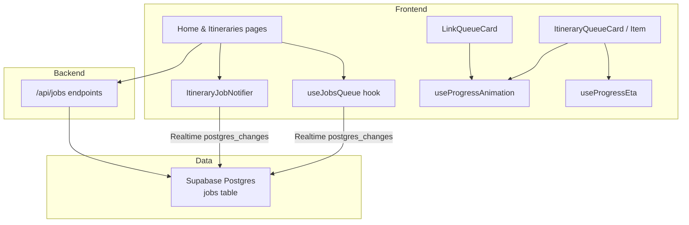
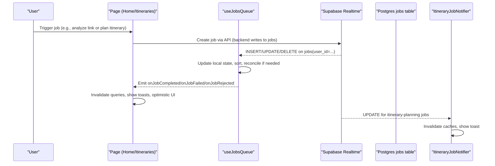
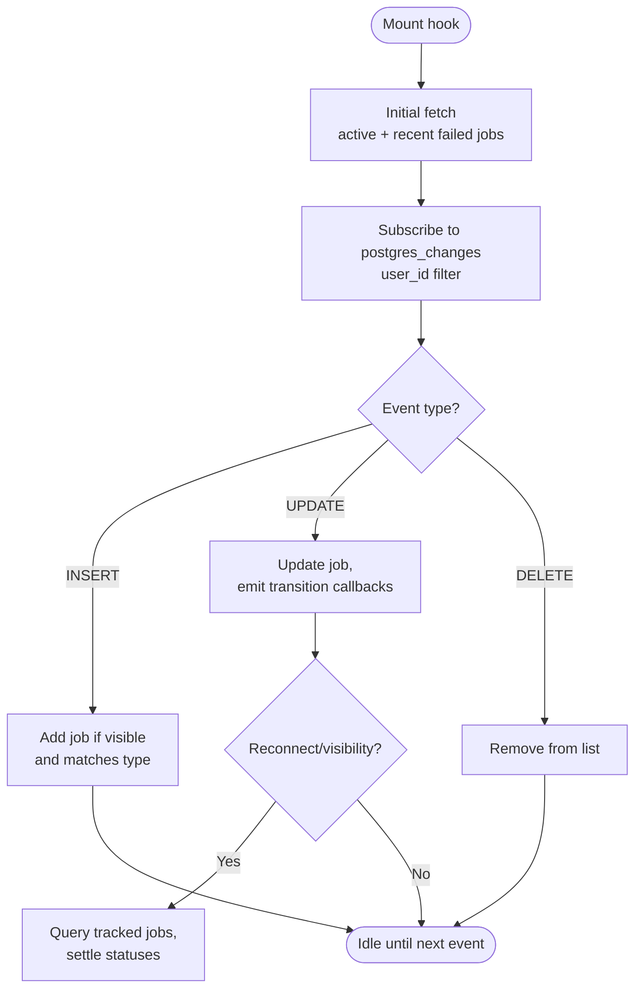
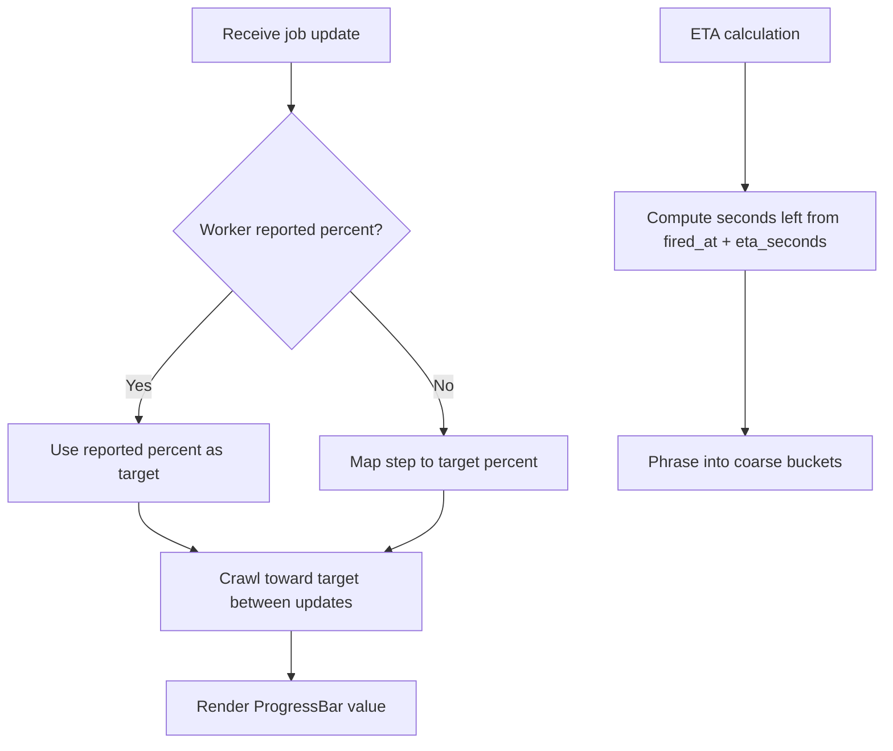
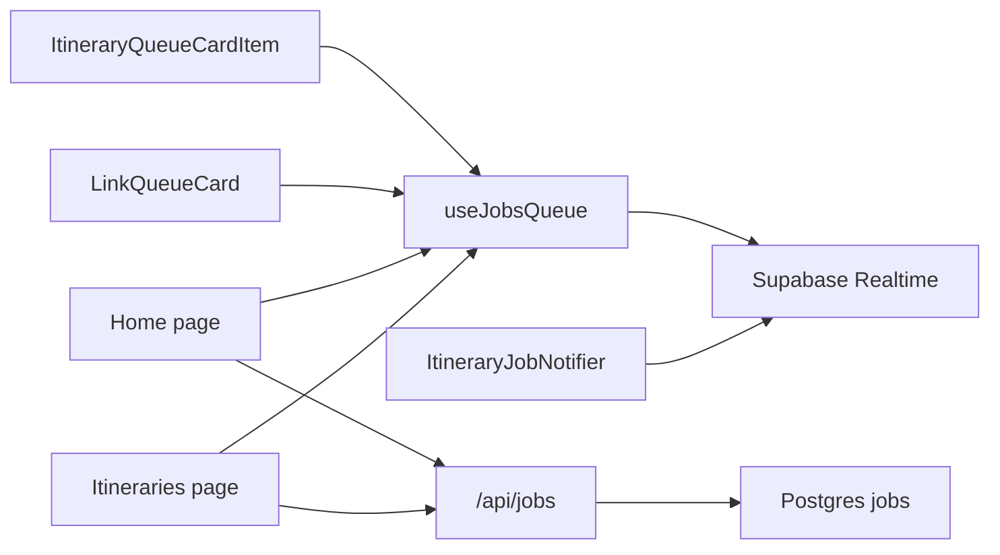

# Background Job Processing

<cite>
**Referenced Files in This Document**
- [useJobsQueue.ts](file://src/hooks/useJobsQueue.ts)
- [ItineraryJobNotifier.tsx](file://src/components/notifications/ItineraryJobNotifier.tsx)
- [useProgressAnimation.ts](file://src/hooks/useProgressAnimation.ts)
- [useProgressEta.ts](file://src/hooks/useProgressEta.ts)
- [ItineraryQueueCard.tsx](file://src/components/ui/itinerary/ItineraryQueueCard.tsx)
- [ItineraryQueueCardItem.tsx](file://src/components/ui/itinerary/ItineraryQueueCardItem.tsx)
- [LinkQueueCard.tsx](file://src/components/ui/links/LinkQueueCard.tsx)
- [home/page.tsx](file://src/app/home/page.tsx)
- [itineraries/page.tsx](file://src/app/itineraries/page.tsx)
- [client.ts](file://src/lib/api/client.ts)
- [personalization-pipeline.md](file://docs/personalization-pipeline.md)
</cite>

## Table of Contents
1. Introduction
2. Project Structure
3. Core Components
4. Architecture Overview
5. Detailed Component Analysis
6. Dependency Analysis
7. Performance Considerations
8. Troubleshooting Guide
9. Conclusion

## Introduction
This document explains Argo’s background job processing system for long-running tasks such as content analysis and itinerary generation. It covers the job queue architecture, job creation and status tracking, real-time progress updates via Supabase Realtime (Postgres changes), completion callbacks, retry mechanisms, failure recovery, global notifications, and progress animations. It also provides guidance on debugging, logging strategies, and monitoring approaches to keep the queue healthy and performant.

## Project Structure
The background job system is implemented primarily in React hooks and components that subscribe to a Postgres-backed jobs table through Supabase Realtime. Key pieces include:
- A hook that owns the job queue lifecycle and realtime subscription
- UI cards that render in-flight jobs with animated progress bars and ETA
- A global notifier that announces completed or failed itinerary jobs
- API helpers to create, retry, and detach jobs
- Pages that wire up job types and handle optimistic UI updates

**Diagram sources**
- [useJobsQueue.ts:167-260](file://src/hooks/useJobsQueue.ts#L167-L260)
- [ItineraryJobNotifier.tsx:45-85](file://src/components/notifications/ItineraryJobNotifier.tsx#L45-L85)
- [ItineraryQueueCardItem.tsx:39-100](file://src/components/ui/itinerary/ItineraryQueueCardItem.tsx#L39-L100)
- [LinkQueueCard.tsx:52-218](file://src/components/ui/links/LinkQueueCard.tsx#L52-L218)
- [client.ts:147-155](file://src/lib/api/client.ts#L147-L155)

**Section sources**
- [useJobsQueue.ts:1-296](file://src/hooks/useJobsQueue.ts#L1-L296)
- [ItineraryJobNotifier.tsx:1-92](file://src/components/notifications/ItineraryJobNotifier.tsx#L1-L92)
- [ItineraryQueueCard.tsx:1-199](file://src/components/ui/itinerary/ItineraryQueueCard.tsx#L1-L199)
- [ItineraryQueueCardItem.tsx:1-101](file://src/components/ui/itinerary/ItineraryQueueCardItem.tsx#L1-L101)
- [LinkQueueCard.tsx:1-218](file://src/components/ui/links/LinkQueueCard.tsx#L1-L218)
- [client.ts:130-155](file://src/lib/api/client.ts#L130-L155)
- [personalization-pipeline.md:140-155](file://docs/personalization-pipeline.md#L140-L155)

## Core Components
- useJobsQueue: Subscribes to user-specific job rows, maintains local state, reconciles missed updates, emits completion/failure/rejection callbacks, and exposes utilities to remove or optimistically update jobs.
- ItineraryJobNotifier: Global component that listens for itinerary-planning job transitions and shows toast notifications while invalidating relevant caches.
- Progress hooks: useProgressAnimation drives smooth percentage movement; useProgressEta computes human-friendly time-left labels based on worker-provided estimates.
- Queue UI: ItineraryQueueCard and LinkQueueCard render in-flight jobs with states (queued, processing, failed), progress bars, error messages, and retry actions.
- Pages: Home and Itineraries pages consume useJobsQueue for specific job types, trigger refreshes, and apply optimistic UI updates when jobs complete.

**Section sources**
- [useJobsQueue.ts:45-295](file://src/hooks/useJobsQueue.ts#L45-L295)
- [ItineraryJobNotifier.tsx:10-90](file://src/components/notifications/ItineraryJobNotifier.tsx#L10-L90)
- [useProgressAnimation.ts:1-104](file://src/hooks/useProgressAnimation.ts#L1-L104)
- [useProgressEta.ts:1-59](file://src/hooks/useProgressEta.ts#L1-L59)
- [ItineraryQueueCard.tsx:35-199](file://src/components/ui/itinerary/ItineraryQueueCard.tsx#L35-L199)
- [ItineraryQueueCardItem.tsx:13-100](file://src/components/ui/itinerary/ItineraryQueueCardItem.tsx#L13-L100)
- [LinkQueueCard.tsx:36-218](file://src/components/ui/links/LinkQueueCard.tsx#L36-L218)
- [home/page.tsx:192-240](file://src/app/home/page.tsx#L192-L240)
- [itineraries/page.tsx:32-72](file://src/app/itineraries/page.tsx#L32-L72)

## Architecture Overview
The system uses a Postgres-backed job queue with Supabase Realtime to push updates to clients. Jobs are created by backend APIs and processed asynchronously. Clients subscribe to changes for their user_id and react to INSERT/UPDATE/DELETE events to maintain an up-to-date queue view. Completion triggers cache invalidation and UI updates; failures surface errors and enable retries.

**Diagram sources**
- [useJobsQueue.ts:167-260](file://src/hooks/useJobsQueue.ts#L167-L260)
- [ItineraryJobNotifier.tsx:45-85](file://src/components/notifications/ItineraryJobNotifier.tsx#L45-L85)
- [client.ts:147-155](file://src/lib/api/client.ts#L147-L155)

## Detailed Component Analysis

### Job Queue Hook: useJobsQueue
Responsibilities:
- Initial fetch of active jobs (including recent failures) for the current user and optional type filter
- Realtime subscription to Postgres changes scoped to user_id
- Reconciliation pass to settle jobs that were in flight during disconnects or tab backgrounding
- Status transition detection and callback emission for completion, failure, and rejection
- Optimistic merge of job updates to avoid UI lag
- Sorting rules that pin failed jobs to the top and order newest first within groups

Key behaviors:
- Channel naming includes userId and a per-instance suffix to avoid channel dedup conflicts
- Visibility change listener triggers reconciliation when returning to foreground
- Connection error state toggles on channel errors/timeouts

**Diagram sources**
- [useJobsQueue.ts:109-165](file://src/hooks/useJobsQueue.ts#L109-L165)
- [useJobsQueue.ts:167-260](file://src/hooks/useJobsQueue.ts#L167-L260)

**Section sources**
- [useJobsQueue.ts:6-43](file://src/hooks/useJobsQueue.ts#L6-L43)
- [useJobsQueue.ts:45-165](file://src/hooks/useJobsQueue.ts#L45-L165)
- [useJobsQueue.ts:167-295](file://src/hooks/useJobsQueue.ts#L167-L295)

### Global Notifier: ItineraryJobNotifier
Responsibilities:
- Listen for itinerary-planning job updates for the current user
- Invalidate query caches for itineraries and usage metrics upon completion or failure
- Show success or error toasts with actionable links when appropriate

Design notes:
- Uses a unique instanceId to avoid channel dedup issues
- Avoids duplicate toasts by centralizing notification logic

**Section sources**
- [ItineraryJobNotifier.tsx:10-90](file://src/components/notifications/ItineraryJobNotifier.tsx#L10-L90)

### Progress Animation and ETA
- useProgressAnimation:
  - Maps step numbers to target percentages for smooth visual progression
  - Trusts worker-reported percent when available; otherwise interpolates between steps
  - Crawls forward gradually between step updates to avoid frozen UI
- useProgressEta:
  - Computes a human-friendly countdown using worker-provided eta_seconds and fired_at timestamps
  - Caps near-completion countdowns to avoid misleading promises

**Diagram sources**
- [useProgressAnimation.ts:6-31](file://src/hooks/useProgressAnimation.ts#L6-L31)
- [useProgressAnimation.ts:37-104](file://src/hooks/useProgressAnimation.ts#L37-L104)
- [useProgressEta.ts:15-59](file://src/hooks/useProgressEta.ts#L15-L59)

**Section sources**
- [useProgressAnimation.ts:1-104](file://src/hooks/useProgressAnimation.ts#L1-L104)
- [useProgressEta.ts:1-59](file://src/hooks/useProgressEta.ts#L1-L59)

### Queue UI Components
- ItineraryQueueCard: Renders queued/processing/failed states, media placeholders, progress bar, error message, and retry button
- ItineraryQueueCardItem: Binds a job to the card, computes retry eligibility (failed or stuck threshold), resolves destination photo, and manages retry spinner
- LinkQueueCard: Similar UX for content-analysis jobs with URL display, thumbnail, and retry flow

Retry behavior:
- Stuck-in-flight detection offers retry after a threshold
- Retry calls backend endpoint and uses optimistic upsert to reflect immediate state changes

**Section sources**
- [ItineraryQueueCard.tsx:35-199](file://src/components/ui/itinerary/ItineraryQueueCard.tsx#L35-L199)
- [ItineraryQueueCardItem.tsx:13-100](file://src/components/ui/itinerary/ItineraryQueueCardItem.tsx#L13-L100)
- [LinkQueueCard.tsx:36-218](file://src/components/ui/links/LinkQueueCard.tsx#L36-L218)
- [client.ts:147-155](file://src/lib/api/client.ts#L147-L155)

### Page Integration and Job Types
- Home page:
  - Subscribes to content-analysis jobs and shows toasts on completion/failure/rejection
  - Subscribes to itinerary-planning jobs, invalidates caches, and applies optimistic items
- Itineraries page:
  - Subscribes to itinerary-planning jobs and builds an optimistic itinerary item to seamlessly hand off the grid slot from queue card to final card

Optimistic UI:
- On completion, pages insert or update items immediately before refetch to prevent layout shifts and improve perceived performance

**Section sources**
- [home/page.tsx:192-240](file://src/app/home/page.tsx#L192-L240)
- [itineraries/page.tsx:32-72](file://src/app/itineraries/page.tsx#L32-L72)
- [itineraries/page.tsx:102-122](file://src/app/itineraries/page.tsx#L102-L122)

## Dependency Analysis
- useJobsQueue depends on Supabase client and Realtime channels scoped by user_id and instanceId
- ItineraryJobNotifier depends on Supabase client, auth session, and TanStack Query client for cache invalidation
- Queue UI components depend on progress hooks and API helpers for retry
- Pages orchestrate job subscriptions and side effects (cache invalidation, toasts, optimistic updates)

**Diagram sources**
- [useJobsQueue.ts:167-260](file://src/hooks/useJobsQueue.ts#L167-L260)
- [ItineraryJobNotifier.tsx:45-85](file://src/components/notifications/ItineraryJobNotifier.tsx#L45-L85)
- [client.ts:147-155](file://src/lib/api/client.ts#L147-L155)

**Section sources**
- [useJobsQueue.ts:167-260](file://src/hooks/useJobsQueue.ts#L167-L260)
- [ItineraryJobNotifier.tsx:45-85](file://src/components/notifications/ItineraryJobNotifier.tsx#L45-L85)
- [client.ts:147-155](file://src/lib/api/client.ts#L147-L155)

## Performance Considerations
- Realtime vs polling: The codebase currently uses Supabase Realtime for low-latency updates. An alternative approach documented suggests replacing heavy realtime consumers with periodic polling where appropriate to reduce complexity and channel dedup overhead.
- Reconciliation: The hook performs a reconciliation pass on visibility changes and reconnects to ensure no jobs remain stuck mid-progress due to missed realtime events.
- Progress interpolation: Smooth crawling avoids jarring jumps and keeps UI responsive even when workers report infrequently.
- Cache invalidation: Targeted invalidation minimizes unnecessary refetches and improves perceived performance.

[No sources needed since this section provides general guidance]

## Troubleshooting Guide
Common issues and remedies:
- Missed realtime updates:
  - Symptom: Job appears stuck in processing or queued
  - Resolution: Return to the tab to trigger reconciliation; verify connectionError state; check network connectivity
- Duplicate toasts:
  - Symptom: Multiple “Itinerary ready” notifications
  - Resolution: Ensure only ItineraryJobNotifier handles itinerary completion toasts; avoid duplicating toast logic in multiple places
- Stuck retries:
  - Symptom: Retry spinner never clears
  - Resolution: Clear retrying state when job status leaves failed; confirm backend acks retry requests
- Channel conflicts:
  - Symptom: Errors when subscribing to realtime channels
  - Resolution: Ensure each subscription uses a unique instanceId suffix to avoid topic dedup collisions

Monitoring and debugging tips:
- Observe connectionError state in useJobsQueue to detect realtime issues
- Use browser dev tools to inspect Supabase Realtime channel status and payloads
- Validate job statuses and progress fields in the jobs table to ensure workers are updating correctly
- Log key transitions (insert/update/delete) and callback emissions to trace UI reactions

**Section sources**
- [useJobsQueue.ts:250-266](file://src/hooks/useJobsQueue.ts#L250-L266)
- [ItineraryJobNotifier.tsx:63-82](file://src/components/notifications/ItineraryJobNotifier.tsx#L63-L82)
- [ItineraryQueueCardItem.tsx:69-83](file://src/components/ui/itinerary/ItineraryQueueCardItem.tsx#L69-L83)
- [personalization-pipeline.md:140-155](file://docs/personalization-pipeline.md#L140-L155)

## Conclusion
Argo’s background job system combines a robust Postgres-backed queue with Supabase Realtime to deliver responsive, accurate UI feedback for long-running tasks. The useJobsQueue hook centralizes lifecycle management, while dedicated UI components and progress hooks provide clear visual cues and helpful ETAs. Global notifications streamline user awareness, and retry mechanisms offer graceful failure recovery. By following the troubleshooting and performance recommendations, teams can maintain high reliability and a smooth user experience as job workloads scale.