# Collaboration & Sharing Features

<cite>
**Referenced Files in This Document**
- [InviteModal.tsx](file://src/components/ui/modals/InviteModal.tsx)
- [useItineraryRealtime.ts](file://src/hooks/useItineraryRealtime.ts)
- [itineraries.ts](file://src/lib/api/itineraries.ts)
- [collections.ts](file://src/lib/api/collections.ts)
- [client.ts](file://src/lib/api/client.ts)
- [Public Itinerary Page](file://src/app/itineraries/public/[token]/page.tsx)
- [Public Collection Page](file://src/app/collections/public/[token]/page.tsx)
- [ItineraryJobNotifier.tsx](file://src/components/notifications/ItineraryJobNotifier.tsx)
- [useCollaboratorProfilesQuery.ts](file://src/hooks/queries/useCollaboratorProfilesQuery.ts)
</cite>

## Table of Contents
1. Introduction
2. Project Structure
3. Core Components
4. Architecture Overview
5. Detailed Component Analysis
6. Dependency Analysis
7. Performance Considerations
8. Troubleshooting Guide
9. Conclusion

## Introduction
This document explains Argo’s collaboration and sharing features for team travel planning. It covers:
- Public sharing via token-based URLs for itineraries and collections (read-only access without authentication)
- Invitation workflow to add collaborators to private content, permission management, and collaborator profile display
- Session management for collaborative editing with real-time synchronization and conflict handling
- Security model including token validation, access control checks, and data isolation
- User experience aspects such as collaborator presence indicators, activity feeds, and notifications

## Project Structure
The collaboration and sharing capabilities are implemented across UI components, hooks, API clients, and public pages:
- Invite modal for managing public links and invite tokens, listing collaborators, and removing access
- Realtime hook that subscribes to database changes for live updates during collaborative editing
- API clients for generating/revoking tokens, fetching collaborators, and joining by token
- Public read-only pages for viewing shared itineraries and collections via tokens
- Notification component for asynchronous job completion events
- Collaborator profiles query to resolve user details for presence and avatars

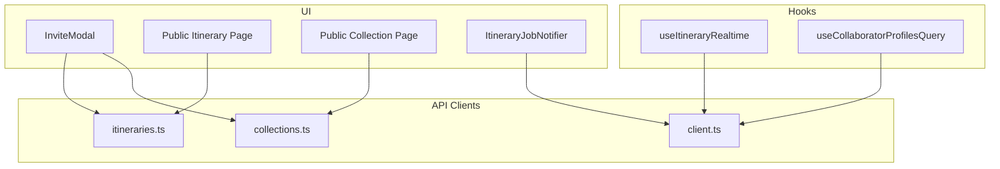

**Diagram sources**
- [InviteModal.tsx:91-107](file://src/components/ui/modals/InviteModal.tsx#L91-L107)
- [useItineraryRealtime.ts:39-333](file://src/hooks/useItineraryRealtime.ts#L39-L333)
- [itineraries.ts:448-487](file://src/lib/api/itineraries.ts#L448-L487)
- [collections.ts:134-173](file://src/lib/api/collections.ts#L134-L173)
- [client.ts:59-94](file://src/lib/api/client.ts#L59-L94)
- [Public Itinerary Page:27-46](file://src/app/itineraries/public/[token]/page.tsx#L27-L46)
- [Public Collection Page:13-32](file://src/app/collections/public/[token]/page.tsx#L13-L32)
- [ItineraryJobNotifier.tsx:18-88](file://src/components/notifications/ItineraryJobNotifier.tsx#L18-L88)
- [useCollaboratorProfilesQuery.ts:7-17](file://src/hooks/queries/useCollaboratorProfilesQuery.ts#L7-L17)

**Section sources**
- [InviteModal.tsx:111-537](file://src/components/ui/modals/InviteModal.tsx#L111-L537)
- [useItineraryRealtime.ts:27-534](file://src/hooks/useItineraryRealtime.ts#L27-L534)
- [itineraries.ts:448-524](file://src/lib/api/itineraries.ts#L448-L524)
- [collections.ts:134-214](file://src/lib/api/collections.ts#L134-L214)
- [client.ts:59-94](file://src/lib/api/client.ts#L59-L94)
- [Public Itinerary Page:27-211](file://src/app/itineraries/public/[token]/page.tsx#L27-L211)
- [Public Collection Page:13-152](file://src/app/collections/public/[token]/page.tsx#L13-L152)
- [ItineraryJobNotifier.tsx:10-92](file://src/components/notifications/ItineraryJobNotifier.tsx#L10-L92)
- [useCollaboratorProfilesQuery.ts:7-17](file://src/hooks/queries/useCollaboratorProfilesQuery.ts#L7-L17)

## Core Components
- InviteModal: Central UI for enabling public links, generating invite tokens, listing collaborators, and revoking access. Supports both itineraries and collections via injected API adapters.
- useItineraryRealtime: Subscribes to Postgres changes for activities, days, itinerary metadata, collaborators, flights, and lodgings to keep the UI synchronized in real time.
- API clients: Provide functions to generate/revoke public and invite tokens, fetch/remove collaborators, join by token, and fetch public content.
- Public pages: Render read-only views of shared itineraries and collections using token-based endpoints.
- ItineraryJobNotifier: Listens for job status changes and shows toast notifications when background tasks complete or fail.
- useCollaboratorProfilesQuery: Fetches collaborator profile information for presence and avatar rendering.

**Section sources**
- [InviteModal.tsx:111-537](file://src/components/ui/modals/InviteModal.tsx#L111-L537)
- [useItineraryRealtime.ts:27-534](file://src/hooks/useItineraryRealtime.ts#L27-L534)
- [itineraries.ts:448-524](file://src/lib/api/itineraries.ts#L448-L524)
- [collections.ts:134-214](file://src/lib/api/collections.ts#L134-L214)
- [Public Itinerary Page:27-211](file://src/app/itineraries/public/[token]/page.tsx#L27-L211)
- [Public Collection Page:13-152](file://src/app/collections/public/[token]/page.tsx#L13-L152)
- [ItineraryJobNotifier.tsx:10-92](file://src/components/notifications/ItineraryJobNotifier.tsx#L10-L92)
- [useCollaboratorProfilesQuery.ts:7-17](file://src/hooks/queries/useCollaboratorProfilesQuery.ts#L7-L17)

## Architecture Overview
The system combines token-based sharing with authenticated collaboration and real-time sync:
- Owners enable public sharing to generate a read-only URL for anyone with the link
- Owners generate invite tokens to allow new collaborators to join; these tokens can expire and be revoked
- Collaborators edit content while the app listens to database changes to reflect others’ edits instantly
- Public pages render read-only content without requiring authentication
- Notifications inform users about background job outcomes

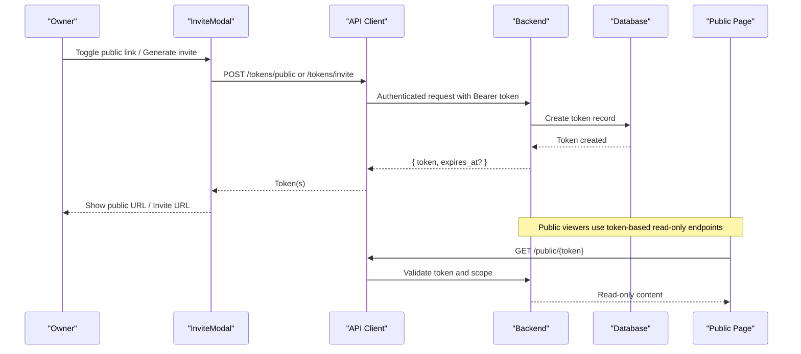

**Diagram sources**
- [InviteModal.tsx:194-256](file://src/components/ui/modals/InviteModal.tsx#L194-L256)
- [itineraries.ts:448-487](file://src/lib/api/itineraries.ts#L448-L487)
- [collections.ts:134-173](file://src/lib/api/collections.ts#L134-L173)
- [client.ts:59-94](file://src/lib/api/client.ts#L59-L94)
- [Public Itinerary Page:27-46](file://src/app/itineraries/public/[token]/page.tsx#L27-L46)
- [Public Collection Page:13-32](file://src/app/collections/public/[token]/page.tsx#L13-L32)

## Detailed Component Analysis

### InviteModal: Public Links, Invites, and Collaborators
- Public link toggle: Generates or revokes a public token for read-only sharing; constructs a shareable URL based on entity type
- Invite link: Auto-generates an invite token when the owner opens the Invite tab; displays expiry and allows revocation
- Collaborators list: Loads collaborators for owners; supports removal with confirmation feedback
- Copy-to-clipboard: Provides quick copying of public or invite URLs with visual feedback
- Error handling: Catches failures and surfaces friendly toasts

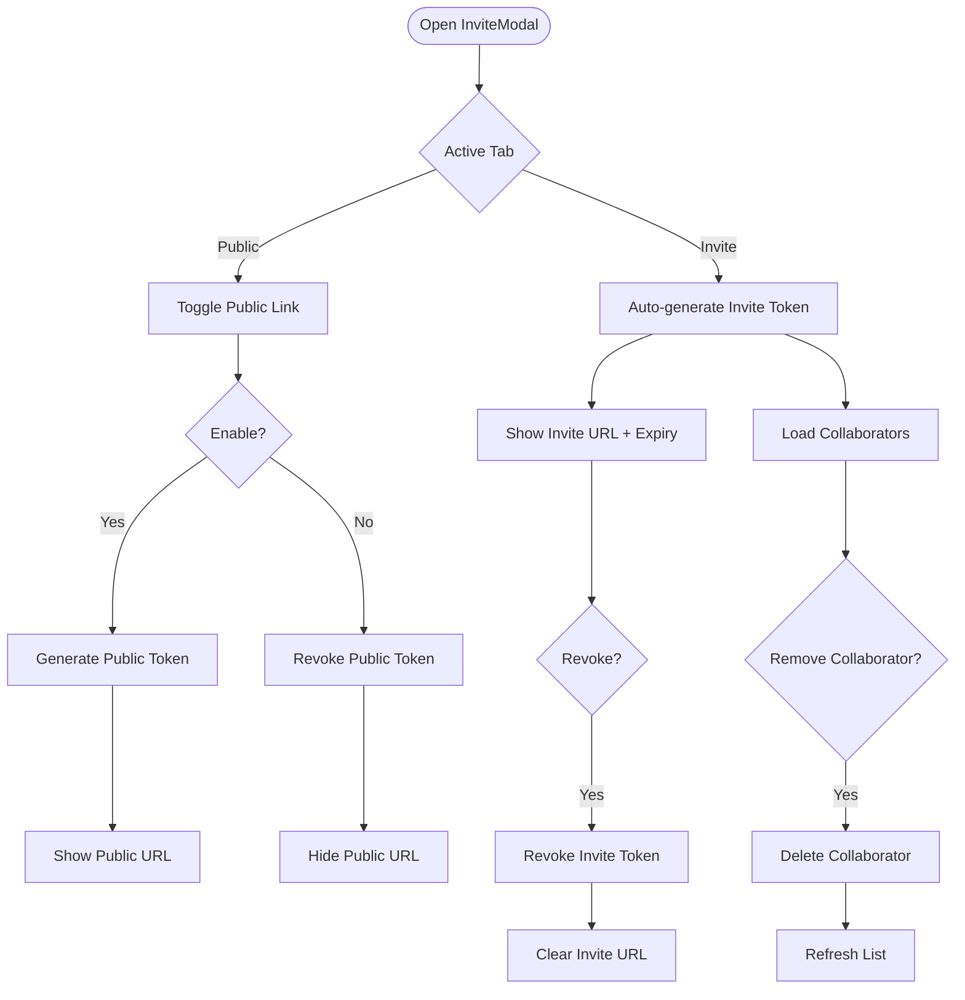

**Diagram sources**
- [InviteModal.tsx:194-256](file://src/components/ui/modals/InviteModal.tsx#L194-L256)
- [InviteModal.tsx:258-283](file://src/components/ui/modals/InviteModal.tsx#L258-L283)
- [InviteModal.tsx:311-419](file://src/components/ui/modals/InviteModal.tsx#L311-L419)

**Section sources**
- [InviteModal.tsx:111-537](file://src/components/ui/modals/InviteModal.tsx#L111-L537)

### Realtime Collaboration: Synchronization and Conflict Handling
- Activity changes: Inserts, updates, and deletes on activities update both calendar and view-mode state; location hydration is performed asynchronously after inserts
- Day range changes: Inserts and deletes on days expand or shrink the visible date range
- Metadata updates: Changes to itinerary name, country, or counts propagate to all clients
- Member presence: Joins and leaves on user_itinerary update the collaborators list in real time
- Sidebar-specific sync: Flights and lodgings are synced only when their sidebars are open to reduce overhead

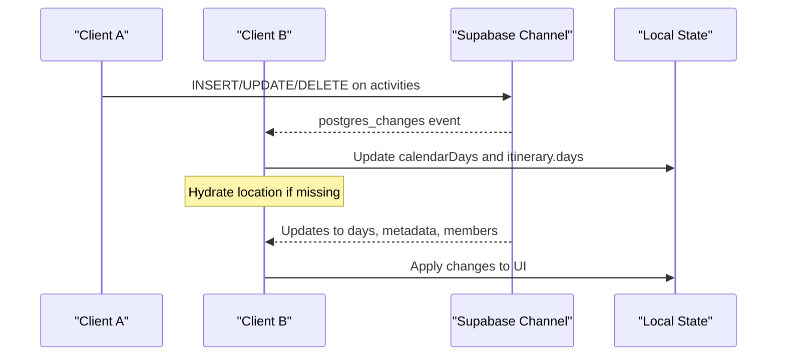

**Diagram sources**
- [useItineraryRealtime.ts:39-333](file://src/hooks/useItineraryRealtime.ts#L39-L333)
- [useItineraryRealtime.ts:335-440](file://src/hooks/useItineraryRealtime.ts#L335-L440)
- [useItineraryRealtime.ts:442-530](file://src/hooks/useItineraryRealtime.ts#L442-L530)

**Section sources**
- [useItineraryRealtime.ts:27-534](file://src/hooks/useItineraryRealtime.ts#L27-L534)

### Public Sharing: Read-Only Access via Tokens
- Public itinerary page: Fetches and renders a read-only itinerary using a token; handles loading and error states
- Public collection page: Fetches and renders a read-only collection using a token; handles loading and error states
- Both pages provide clear messaging that the content is public and invite users to sign in

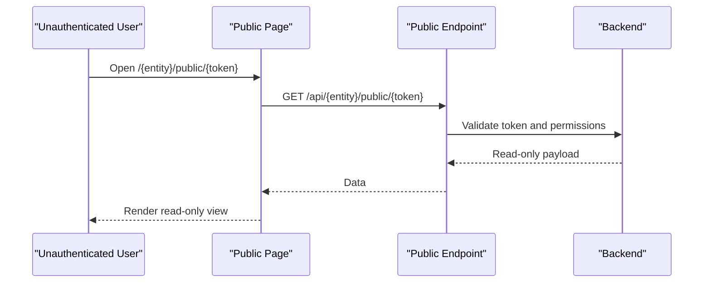

**Diagram sources**
- [Public Itinerary Page:27-46](file://src/app/itineraries/public/[token]/page.tsx#L27-L46)
- [Public Collection Page:13-32](file://src/app/collections/public/[token]/page.tsx#L13-L32)
- [itineraries.ts:520-524](file://src/lib/api/itineraries.ts#L520-L524)
- [collections.ts:195-199](file://src/lib/api/collections.ts#L195-L199)

**Section sources**
- [Public Itinerary Page:27-211](file://src/app/itineraries/public/[token]/page.tsx#L27-L211)
- [Public Collection Page:13-152](file://src/app/collections/public/[token]/page.tsx#L13-L152)
- [itineraries.ts:520-524](file://src/lib/api/itineraries.ts#L520-L524)
- [collections.ts:195-199](file://src/lib/api/collections.ts#L195-L199)

### Invitation Workflow: Joining Private Content
- Invite info: Clients can fetch invite metadata to pre-populate UI before joining
- Join by token: Authenticated users can join an itinerary or collection using an invite token
- Role assignment: The backend assigns roles upon successful join; clients then see updated collaborators

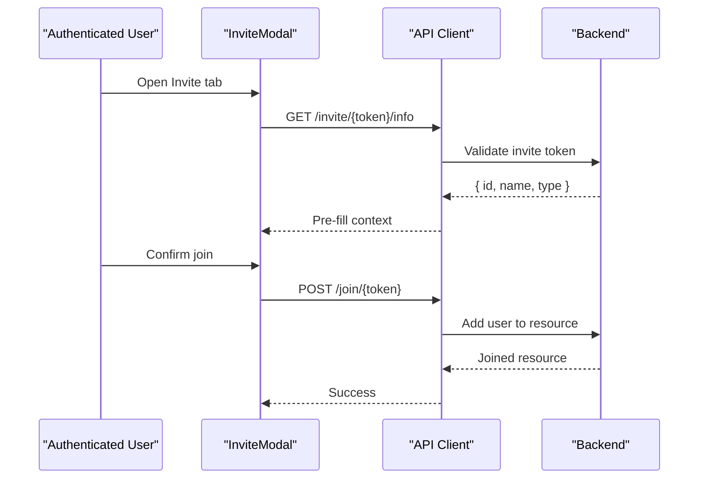

**Diagram sources**
- [itineraries.ts:478-487](file://src/lib/api/itineraries.ts#L478-L487)
- [collections.ts:164-173](file://src/lib/api/collections.ts#L164-L173)

**Section sources**
- [itineraries.ts:478-487](file://src/lib/api/itineraries.ts#L478-L487)
- [collections.ts:164-173](file://src/lib/api/collections.ts#L164-L173)

### Permission Management and Collaborator Profiles
- Listing collaborators: Only owners can retrieve and manage collaborators
- Removing collaborators: Owners can remove collaborators; UI provides immediate feedback
- Profile display: Collaborator profiles are fetched by user IDs to show names and avatars

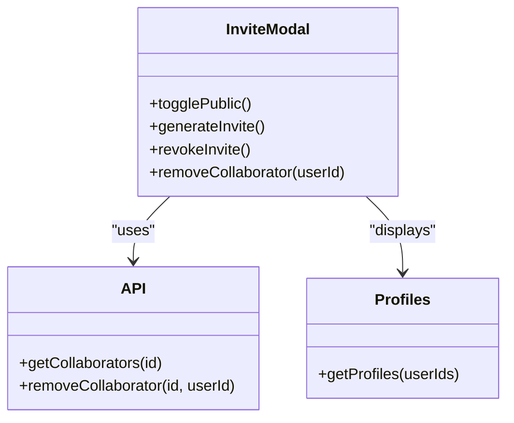

**Diagram sources**
- [InviteModal.tsx:184-270](file://src/components/ui/modals/InviteModal.tsx#L184-L270)
- [itineraries.ts:468-476](file://src/lib/api/itineraries.ts#L468-L476)
- [collections.ts:154-162](file://src/lib/api/collections.ts#L154-L162)
- [useCollaboratorProfilesQuery.ts:7-17](file://src/hooks/queries/useCollaboratorProfilesQuery.ts#L7-L17)

**Section sources**
- [InviteModal.tsx:184-270](file://src/components/ui/modals/InviteModal.tsx#L184-L270)
- [itineraries.ts:468-476](file://src/lib/api/itineraries.ts#L468-L476)
- [collections.ts:154-162](file://src/lib/api/collections.ts#L154-L162)
- [useCollaboratorProfilesQuery.ts:7-17](file://src/hooks/queries/useCollaboratorProfilesQuery.ts#L7-L17)

### Session Management and Real-Time Sync
- Database channels: Each relevant table has a dedicated channel scoped to the entity ID
- State updates: Local state is updated incrementally to avoid full re-renders
- Conditional subscriptions: Some channels activate only when related UI is visible (e.g., sidebars)

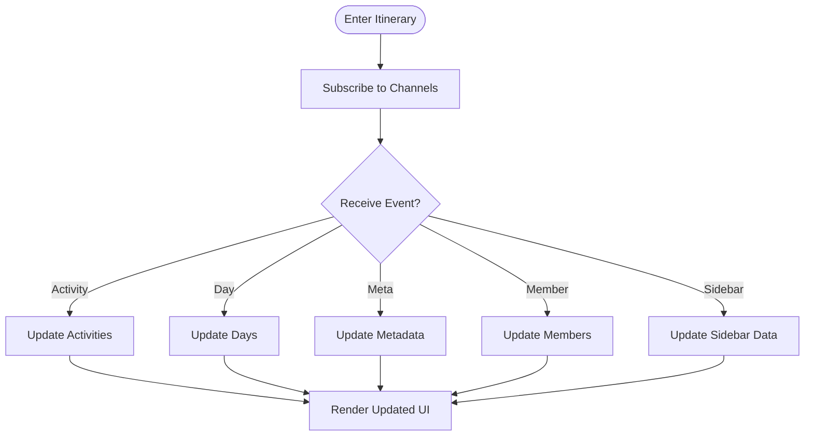

**Diagram sources**
- [useItineraryRealtime.ts:39-333](file://src/hooks/useItineraryRealtime.ts#L39-L333)
- [useItineraryRealtime.ts:335-440](file://src/hooks/useItineraryRealtime.ts#L335-L440)
- [useItineraryRealtime.ts:442-530](file://src/hooks/useItineraryRealtime.ts#L442-L530)

**Section sources**
- [useItineraryRealtime.ts:27-534](file://src/hooks/useItineraryRealtime.ts#L27-L534)

### Security Model: Token Validation, Access Control, and Data Isolation
- Authentication: Authenticated requests include a Bearer token; unauthenticated requests are rejected for protected routes
- Public endpoints: Token-based endpoints serve read-only data without requiring authentication
- Data isolation: Channels and queries are filtered by entity ID to ensure users only receive data they are authorized to see
- Invite tokens: Serve limited metadata and controlled join actions; can be revoked

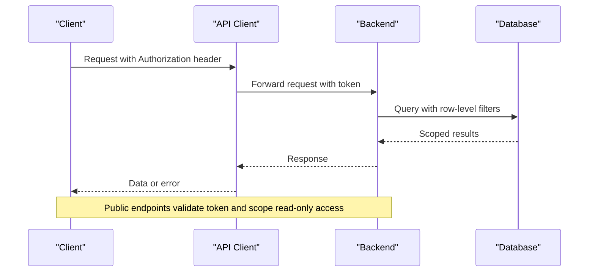

**Diagram sources**
- [client.ts:59-94](file://src/lib/api/client.ts#L59-L94)
- [itineraries.ts:520-524](file://src/lib/api/itineraries.ts#L520-L524)
- [collections.ts:195-199](file://src/lib/api/collections.ts#L195-L199)

**Section sources**
- [client.ts:59-94](file://src/lib/api/client.ts#L59-L94)
- [itineraries.ts:520-524](file://src/lib/api/itineraries.ts#L520-L524)
- [collections.ts:195-199](file://src/lib/api/collections.ts#L195-L199)

### User Experience: Presence Indicators, Activity Feeds, and Notifications
- Collaborator presence: Realtime member joins/leaves update the collaborators list and can drive presence indicators
- Activity feed: Realtime activity changes keep the calendar and itinerary view synchronized
- Notifications: Job notifier listens to job updates and shows success/error toasts with actionable links

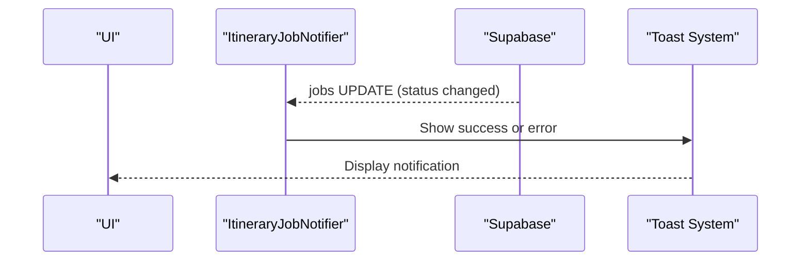

**Diagram sources**
- [ItineraryJobNotifier.tsx:18-88](file://src/components/notifications/ItineraryJobNotifier.tsx#L18-L88)
- [useItineraryRealtime.ts:407-440](file://src/hooks/useItineraryRealtime.ts#L407-L440)

**Section sources**
- [ItineraryJobNotifier.tsx:10-92](file://src/components/notifications/ItineraryJobNotifier.tsx#L10-L92)
- [useItineraryRealtime.ts:407-440](file://src/hooks/useItineraryRealtime.ts#L407-L440)

## Dependency Analysis
- InviteModal depends on itineraries and collections API modules for token and collaborator operations
- Public pages depend on API modules to fetch public content by token
- Realtime hook depends on Supabase client to subscribe to database changes
- Job notifier depends on Supabase client and query cache invalidation utilities
- Collaborator profiles query depends on Supabase queries to resolve user details

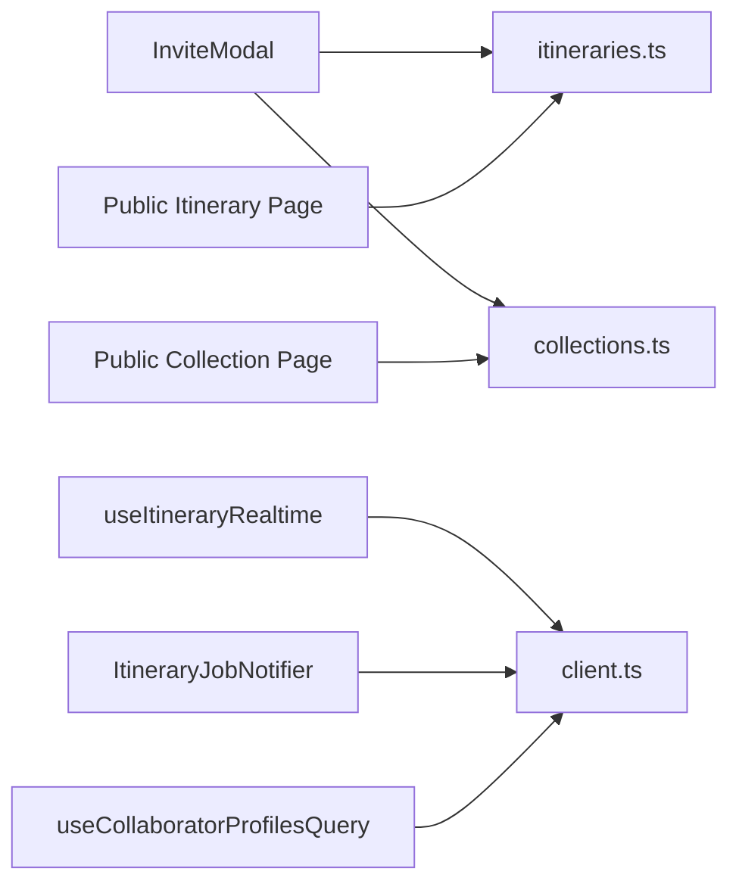

**Diagram sources**
- [InviteModal.tsx:91-107](file://src/components/ui/modals/InviteModal.tsx#L91-L107)
- [itineraries.ts:448-524](file://src/lib/api/itineraries.ts#L448-L524)
- [collections.ts:134-214](file://src/lib/api/collections.ts#L134-L214)
- [useItineraryRealtime.ts:27-534](file://src/hooks/useItineraryRealtime.ts#L27-L534)
- [ItineraryJobNotifier.tsx:10-92](file://src/components/notifications/ItineraryJobNotifier.tsx#L10-L92)
- [useCollaboratorProfilesQuery.ts:7-17](file://src/hooks/queries/useCollaboratorProfilesQuery.ts#L7-L17)

**Section sources**
- [InviteModal.tsx:91-107](file://src/components/ui/modals/InviteModal.tsx#L91-L107)
- [itineraries.ts:448-524](file://src/lib/api/itineraries.ts#L448-L524)
- [collections.ts:134-214](file://src/lib/api/collections.ts#L134-L214)
- [useItineraryRealtime.ts:27-534](file://src/hooks/useItineraryRealtime.ts#L27-L534)
- [ItineraryJobNotifier.tsx:10-92](file://src/components/notifications/ItineraryJobNotifier.tsx#L10-L92)
- [useCollaboratorProfilesQuery.ts:7-17](file://src/hooks/queries/useCollaboratorProfilesQuery.ts#L7-L17)

## Performance Considerations
- Conditional subscriptions: Realtime listeners for flights and lodgings activate only when their sidebars are open to reduce network and processing load
- Incremental state updates: Realtime handlers update local state minimally to avoid unnecessary re-renders
- Location hydration: Asynchronous location enrichment avoids blocking initial activity insertion
- Efficient queries: Public endpoints return minimal necessary fields for read-only views

[No sources needed since this section provides general guidance]

## Troubleshooting Guide
- Public link not working: Ensure the public token exists and has not been revoked; verify the public endpoint returns data
- Invite link expired: Check invite token expiry; regenerate if necessary
- Collaborator cannot be removed: Verify ownership role; check API responses for errors
- Realtime not updating: Confirm channels are subscribed and entity IDs match; inspect browser console for errors
- Notifications not showing: Ensure job notifier is mounted and user session is active; check job status transitions

**Section sources**
- [InviteModal.tsx:194-256](file://src/components/ui/modals/InviteModal.tsx#L194-L256)
- [Public Itinerary Page:27-63](file://src/app/itineraries/public/[token]/page.tsx#L27-L63)
- [Public Collection Page:13-49](file://src/app/collections/public/[token]/page.tsx#L13-L49)
- [ItineraryJobNotifier.tsx:18-88](file://src/components/notifications/ItineraryJobNotifier.tsx#L18-L88)

## Conclusion
Argo’s collaboration and sharing features combine token-based public sharing with authenticated invitations and real-time synchronization. Owners control access through public links and invite tokens, while collaborators benefit from live updates and presence awareness. The security model enforces authentication for write operations and validates tokens for public reads, ensuring safe and isolated collaboration experiences.

[No sources needed since this section summarizes without analyzing specific files]