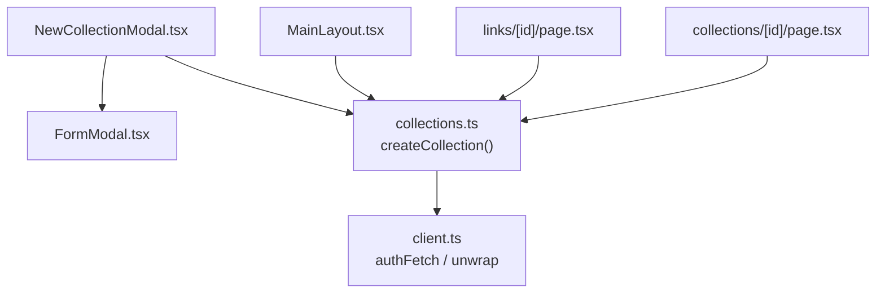
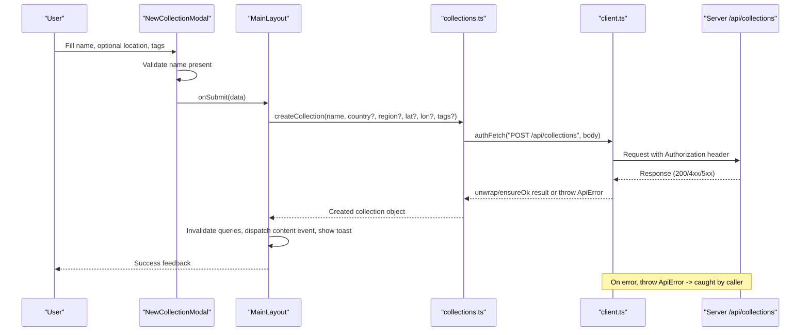
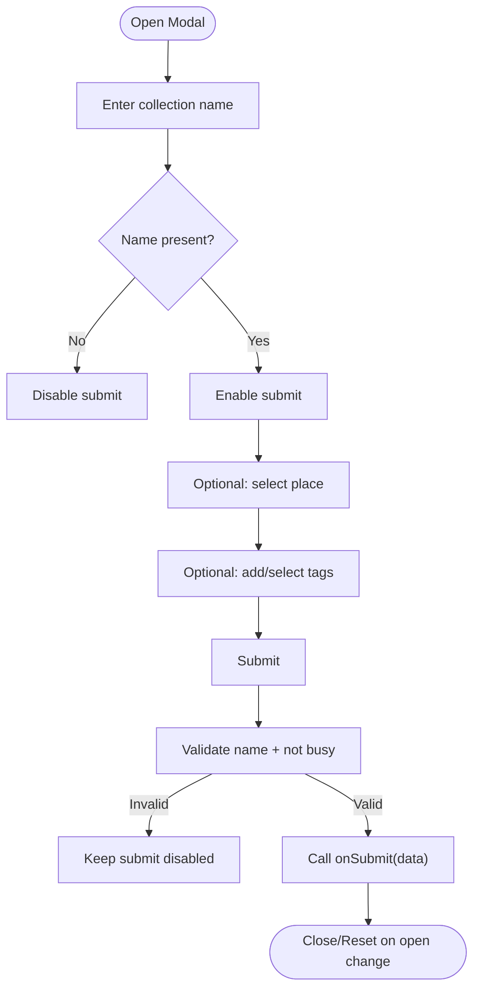
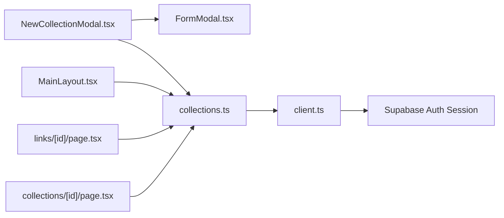

# Collection Creation & Setup

<cite>
**Referenced Files in This Document**
- [NewCollectionModal.tsx](file://src/components/ui/modals/NewCollectionModal.tsx)
- [FormModal.tsx](file://src/components/ui/modals/FormModal.tsx)
- [collections.ts](file://src/lib/api/collections.ts)
- [client.ts](file://src/lib/api/client.ts)
- [MainLayout.tsx](file://src/components/ui/layout/MainLayout.tsx)
- [page.tsx (links detail)](file://src/app/links/[id]/page.tsx)
- [page.tsx (collection detail)](file://src/app/collections/[id]/page.tsx)
- [userMessages.ts](file://src/lib/errors/userMessages.ts)
</cite>

## Table of Contents
1. [Introduction](#introduction)
2. [Project Structure](#project-structure)
3. [Core Components](#core-components)
4. [Architecture Overview](#architecture-overview)
5. [Detailed Component Analysis](#detailed-component-analysis)
6. [Dependency Analysis](#dependency-analysis)
7. [Performance Considerations](#performance-considerations)
8. [Troubleshooting Guide](#troubleshooting-guide)
9. [Conclusion](#conclusion)
10. [Appendices](#appendices)

## Introduction
This document explains how users create new collections in the application, focusing on:
- The NewCollectionModal form and its metadata fields (name, description, country, region, tags).
- The API calls used to create collections and how validation and errors are handled.
- Inline collection creation from the detail-view save picker workflow.
- Examples for common use cases such as travel research, restaurant lists, and group trip planning.
- The initial state and default settings of a newly created collection, including permissions and ownership.

## Project Structure
Collection creation spans UI components, API clients, and page-level handlers:
- UI layer: NewCollectionModal renders the form; FormModal provides modal shell and submit behavior.
- API layer: collections.ts defines types and functions to call backend endpoints; client.ts handles authentication and error wrapping.
- Page layers: MainLayout orchestrates creating a collection from the global “New” menu; detail pages implement inline creation via the save picker.

**Diagram sources**
- [NewCollectionModal.tsx:118-135](file://src/components/ui/modals/NewCollectionModal.tsx#L118-L135)
- [FormModal.tsx:124-213](file://src/components/ui/modals/FormModal.tsx#L124-L213)
- [collections.ts:78-92](file://src/lib/api/collections.ts#L78-L92)
- [client.ts:59-107](file://src/lib/api/client.ts#L59-L107)
- [MainLayout.tsx:131-179](file://src/components/ui/layout/MainLayout.tsx#L131-L179)
- [page.tsx (links detail):474-508](file://src/app/links/[id]/page.tsx#L474-L508)
- [page.tsx (collection detail):350-386](file://src/app/collections/[id]/page.tsx#L350-L386)

**Section sources**
- [NewCollectionModal.tsx:22-40](file://src/components/ui/modals/NewCollectionModal.tsx#L22-L40)
- [collections.ts:3-24](file://src/lib/api/collections.ts#L3-L24)
- [client.ts:59-107](file://src/lib/api/client.ts#L59-L107)

## Core Components
- NewCollectionModal: Collects name, optional location (country/region/coordinates), and tags. Validates that a name is present before submission. Emits an onSubmit callback with the collected data.
- FormModal: Provides consistent modal UX, disabled states during submission, and accessible structure.
- collections.ts: Defines the Collection type and createCollection function that POSTs to /api/collections with name, optional location fields, and tags.
- client.ts: Adds Authorization header using Supabase session token and centralizes error handling via unwrap/ensureOk.

Key behaviors:
- Name is required; submit is disabled until a non-empty name is provided.
- Location is optional; when selected, it contributes country, region, latitude, longitude.
- Tags can be selected from presets or added as custom tags; they are included only if at least one tag exists.

**Section sources**
- [NewCollectionModal.tsx:62-64](file://src/components/ui/modals/NewCollectionModal.tsx#L62-L64)
- [NewCollectionModal.tsx:118-135](file://src/components/ui/modals/NewCollectionModal.tsx#L118-L135)
- [collections.ts:78-92](file://src/lib/api/collections.ts#L78-L92)
- [client.ts:59-83](file://src/lib/api/client.ts#L59-L83)

## Architecture Overview
The end-to-end flow for creating a collection:

**Diagram sources**
- [NewCollectionModal.tsx:118-135](file://src/components/ui/modals/NewCollectionModal.tsx#L118-L135)
- [MainLayout.tsx:131-179](file://src/components/ui/layout/MainLayout.tsx#L131-L179)
- [collections.ts:78-92](file://src/lib/api/collections.ts#L78-L92)
- [client.ts:59-107](file://src/lib/api/client.ts#L59-L107)

## Detailed Component Analysis

### NewCollectionModal
Responsibilities:
- Render input for collection name.
- Provide optional place selection to capture country, region, and coordinates.
- Manage preset and custom tags.
- Prevent submission without a name and while busy.

Validation rules:
- Name must be non-empty to enable submit.
- Tags are optional; only included if any are selected or added.
- Location fields are optional; included only when a place is selected.

Submission payload:
- name (required)
- country, region, latitude, longitude (optional)
- tags (array, optional)

Error handling:
- Submit is guarded by isLoading/isSubmitting flags to prevent duplicate submissions.
- Errors are surfaced by the parent component via toast notifications.

**Diagram sources**
- [NewCollectionModal.tsx:62-64](file://src/components/ui/modals/NewCollectionModal.tsx#L62-L64)
- [NewCollectionModal.tsx:118-135](file://src/components/ui/modals/NewCollectionModal.tsx#L118-L135)

**Section sources**
- [NewCollectionModal.tsx:13-20](file://src/components/ui/modals/NewCollectionModal.tsx#L13-L20)
- [NewCollectionModal.tsx:54-60](file://src/components/ui/modals/NewCollectionModal.tsx#L54-L60)
- [NewCollectionModal.tsx:79-116](file://src/components/ui/modals/NewCollectionModal.tsx#L79-L116)
- [NewCollectionModal.tsx:118-135](file://src/components/ui/modals/NewCollectionModal.tsx#L118-L135)

### FormModal
Provides:
- Accessible dialog wrapper with title, description, and button actions.
- Disabled submit during submission state.
- Mobile sheet behavior and responsive layout.

Integration:
- NewCollectionModal uses variant="collection" and passes submitLabel, submittingLabel, and submitDisabled based on validation.

**Section sources**
- [FormModal.tsx:50-76](file://src/components/ui/modals/FormModal.tsx#L50-L76)
- [FormModal.tsx:124-213](file://src/components/ui/modals/FormModal.tsx#L124-L213)

### API Layer: collections.ts
Types:
- Collection includes id, name, description, country, region, latitude, longitude, tags, thumbnail_url, owner_id, is_public, is_bookmarked, is_archived, public_token, invite_token, invite_token_expires_at, fork_count, forked_from_id, created_at, updated_at.

Creation:
- createCollection(name, country?, region?, latitude?, longitude?, tags?, source?) posts to /api/collections and returns a Collection.
- Source parameter supports 'manual' | 'save_picker' | 'action_toolbar'.

Other operations:
- List, fetch single, generate/revoke tokens, collaborators, delete, remove locations.

**Section sources**
- [collections.ts:3-24](file://src/lib/api/collections.ts#L3-L24)
- [collections.ts:78-92](file://src/lib/api/collections.ts#L78-L92)
- [collections.ts:134-157](file://src/lib/api/collections.ts#L134-L157)
- [collections.ts:201-213](file://src/lib/api/collections.ts#L201-L213)

### Authentication and Error Handling: client.ts
Authentication:
- authFetch retrieves a Supabase session token and attaches Authorization header to requests.

Error handling:
- unwrap ensures response.ok and parses JSON; throws ApiError with status and message.
- ensureOk is used for no-body responses.

Transport failures:
- Network errors bypass HTTP status and are thrown directly; callers should handle them.

**Section sources**
- [client.ts:48-83](file://src/lib/api/client.ts#L48-L83)
- [client.ts:91-107](file://src/lib/api/client.ts#L91-L107)

### Global “New” Menu Flow: MainLayout
Behavior:
- Handles onSubmit from NewCollectionModal by calling createCollection.
- Invalidates collection queries to refresh lists.
- Dispatches a custom event to prepend the new collection into relevant lists.
- Shows success toast with a link to view the collection.
- Catches errors and shows a friendly error toast using getFriendlyApiError.

**Section sources**
- [MainLayout.tsx:131-179](file://src/components/ui/layout/MainLayout.tsx#L131-L179)

### Inline Creation from Detail View Save Picker
Two entry points demonstrate inline creation:
- Links detail page: When saving a location, users can create a new collection inline. After creation, the list of available collections is refreshed and the new collection ID is returned so the location can be saved immediately.
- Collection detail page: Similar flow within the context of managing locations within a collection.

Both flows:
- Call createCollection with source set to 'save_picker'.
- Refresh the save picker’s collection list.
- Return the created collection’s id/name to proceed with saving.
- Handle errors with user-friendly toasts.

**Section sources**
- [page.tsx (links detail):474-508](file://src/app/links/[id]/page.tsx#L474-L508)
- [page.tsx (collection detail):350-386](file://src/app/collections/[id]/page.tsx#L350-L386)

## Dependency Analysis

Coupling and cohesion:
- NewCollectionModal is decoupled from network logic; it delegates to onSubmit, keeping UI concerns separate.
- collections.ts encapsulates all collection-related API calls, improving cohesion.
- client.ts centralizes auth and error handling, reducing duplication across modules.

Potential circular dependencies:
- None observed between these modules; imports are unidirectional from UI to API to client.

External integrations:
- Supabase for authentication.
- Backend server at NEXT_PUBLIC_API_URL for REST endpoints.

**Diagram sources**
- [NewCollectionModal.tsx:118-135](file://src/components/ui/modals/NewCollectionModal.tsx#L118-L135)
- [collections.ts:78-92](file://src/lib/api/collections.ts#L78-L92)
- [client.ts:59-83](file://src/lib/api/client.ts#L59-L83)
- [MainLayout.tsx:131-179](file://src/components/ui/layout/MainLayout.tsx#L131-L179)
- [page.tsx (links detail):474-508](file://src/app/links/[id]/page.tsx#L474-L508)
- [page.tsx (collection detail):350-386](file://src/app/collections/[id]/page.tsx#L350-L386)

**Section sources**
- [client.ts:59-107](file://src/lib/api/client.ts#L59-L107)

## Performance Considerations
- Debounce or throttle place autocomplete interactions if needed to reduce network calls.
- Avoid redundant refetches: MainLayout invalidates queries once per creation; detail pages refresh only the save picker list after inline creation.
- Keep modal submission idempotent by disabling submit while isSubmitting is true.

[No sources needed since this section provides general guidance]

## Troubleshooting Guide
Common issues and resolutions:
- Not authenticated: If the Supabase session is missing, authFetch throws an ApiError with status 401. Ensure the user is logged in before attempting to create a collection.
- Network errors: Transport failures bypass HTTP status; wrap calls in try/catch and show a friendly message using getFriendlyApiError.
- Validation errors: Ensure a name is entered; submit remains disabled otherwise.
- Duplicate submissions: The modal disables submit while isSubmitting; avoid manual retries until the previous attempt completes.

User-facing error messages:
- Use getFriendlyApiError to map backend messages to safe, readable text. Technical details are suppressed from the UI.

**Section sources**
- [client.ts:59-83](file://src/lib/api/client.ts#L59-L83)
- [client.ts:91-107](file://src/lib/api/client.ts#L91-L107)
- [userMessages.ts:94-106](file://src/lib/errors/userMessages.ts#L94-L106)
- [MainLayout.tsx:170-179](file://src/components/ui/layout/MainLayout.tsx#L170-L179)
- [page.tsx (links detail):499-508](file://src/app/links/[id]/page.tsx#L499-L508)
- [page.tsx (collection detail):377-386](file://src/app/collections/[id]/page.tsx#L377-L386)

## Conclusion
Collection creation is implemented through a clear separation of concerns:
- NewCollectionModal focuses on user input and validation.
- collections.ts provides typed API functions for backend interaction.
- client.ts standardizes authentication and error handling.
- Page-level handlers orchestrate side effects like query invalidation and user feedback.

By following the documented flows and validation rules, developers can reliably support both global and inline collection creation across different contexts.

[No sources needed since this section summarizes without analyzing specific files]

## Appendices

### Metadata Fields Summary
- name: Required string.
- description: Optional string (present in model but not captured in NewCollectionModal).
- country: Optional string from place selection.
- region: Optional string from place selection.
- latitude: Optional number from place selection.
- longitude: Optional number from place selection.
- tags: Optional array of strings; includes preset and custom tags.

**Section sources**
- [collections.ts:3-24](file://src/lib/api/collections.ts#L3-L24)
- [NewCollectionModal.tsx:118-135](file://src/components/ui/modals/NewCollectionModal.tsx#L118-L135)

### Default Settings and Permissions
A newly created collection includes:
- owner_id: Set by the backend to the current user.
- is_public: Boolean indicating visibility; defaults are enforced by the backend.
- is_bookmarked: Boolean flag for bookmarking; defaults are enforced by the backend.
- is_archived: Boolean flag for archival; defaults are enforced by the backend.
- public_token and invite_token: Generated via dedicated endpoints when sharing is enabled.

These fields are part of the Collection model and managed by the backend; the frontend relies on the returned values to reflect state.

**Section sources**
- [collections.ts:3-24](file://src/lib/api/collections.ts#L3-L24)
- [collections.ts:134-157](file://src/lib/api/collections.ts#L134-L157)

### Example Workflows

- Travel research
  - Create a collection named “Japan Research”.
  - Optionally select a location (e.g., Tokyo) to auto-fill country/region.
  - Add tags like “Sightseeing”, “Nature”.
  - Submit to create; navigate to the new collection to start adding places.

- Restaurant lists
  - Create a collection named “NYC Restaurants”.
  - Add tags such as “Food”, “Must Try”.
  - Use inline creation from a link detail to quickly save a restaurant into a freshly created collection.

- Group trip planning
  - Create a collection named “Summer Trip 2025”.
  - Select a broad region (e.g., Italy) to set country/region.
  - Add tags like “Lodging”, “Cafes”.
  - Share later via public or invite tokens if collaboration is desired.

[No sources needed since this section provides conceptual examples]