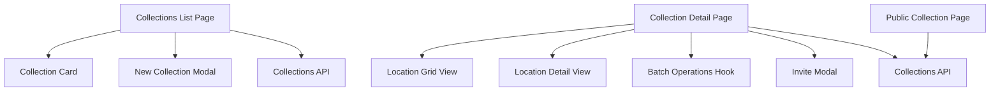
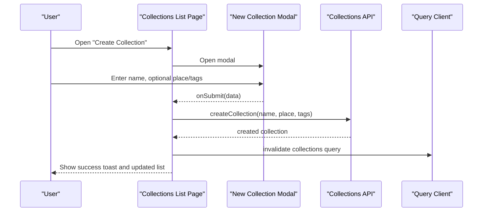
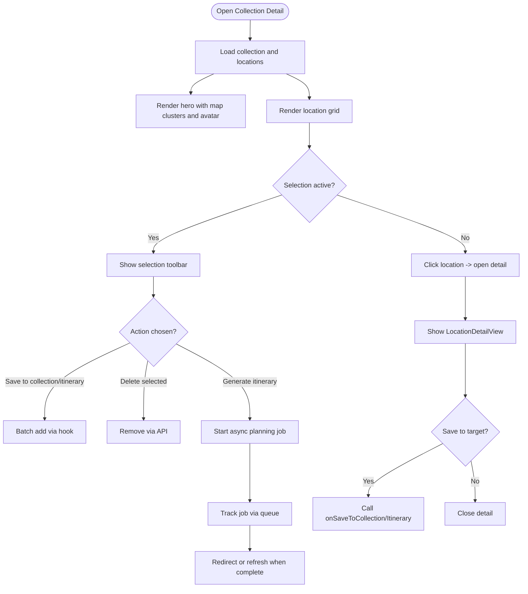
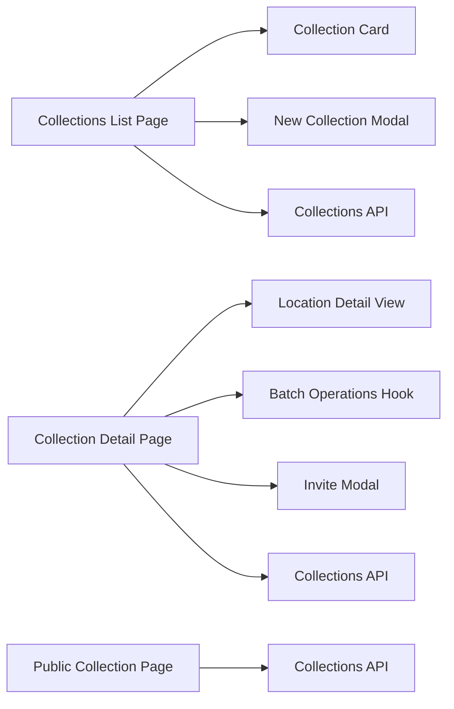

# Collection Management

<cite>
**Referenced Files in This Document**
- [collections page](file://src/app/collections/page.tsx)
- [collection detail page](file://src/app/collections/[id]/page.tsx)
- [public collection page](file://src/app/collections/public/[token]/page.tsx)
- [collection card component](file://src/components/ui/cards/CollectionCard.tsx)
- [new collection modal](file://src/components/ui/modals/NewCollectionModal.tsx)
- [invite modal](file://src/components/ui/modals/InviteModal.tsx)
- [location detail view](file://src/components/ui/detail-views/LocationDetailView.tsx)
- [batch operations hook](file://src/hooks/useCollectionLocationBatchOperations.ts)
- [collections API](file://src/lib/api/collections.ts)
</cite>

## Table of Contents
1. [Introduction](#introduction)
2. [Project Structure](#project-structure)
3. [Core Components](#core-components)
4. [Architecture Overview](#architecture-overview)
5. [Detailed Component Analysis](#detailed-component-analysis)
6. [Dependency Analysis](#dependency-analysis)
7. [Performance Considerations](#performance-considerations)
8. [Troubleshooting Guide](#troubleshooting-guide)
9. [Conclusion](#conclusion)
10. [Appendices](#appendices)

## Introduction
This document explains the collection management functionality: how users create, organize, and manage collections of locations; perform batch add/remove; manage metadata; share publicly or collaboratively; and integrate with itinerary planning. It also covers the collection detail page, location grid view, search/filtering within a collection, and common workflows such as organizing travel research or planning group trips.

## Project Structure
Collections are implemented across pages, components, hooks, and APIs:
- Pages:
  - Collections list page for browsing and creating collections
  - Collection detail page for managing locations, selection, and actions
  - Public collection page for read-only sharing via token
- Components:
  - Collection card for listing and preview
  - New collection modal for creation with optional place and tags
  - Invite modal for public links and collaboration
  - Location detail view for inspecting and saving locations into collections/itineraries
- Hooks:
  - Batch operations for adding/removing locations and generating itineraries
- API:
  - CRUD for collections, tokens, collaborators, and locations

**Diagram sources**
- [collections page:24-247](file://src/app/collections/page.tsx#L24-L247)
- [collection detail page:57-1134](file://src/app/collections/[id]/page.tsx#L57-L1134)
- [public collection page:13-152](file://src/app/collections/public/[token]/page.tsx#L13-L152)
- [collection card component:10-115](file://src/components/ui/cards/CollectionCard.tsx#L10-L115)
- [new collection modal:22-226](file://src/components/ui/modals/NewCollectionModal.tsx#L22-L226)
- [invite modal:111-537](file://src/components/ui/modals/InviteModal.tsx#L111-L537)
- [location detail view:189-787](file://src/components/ui/detail-views/LocationDetailView.tsx#L189-L787)
- [batch operations hook:32-102](file://src/hooks/useCollectionLocationBatchOperations.ts#L32-L102)
- [collections API:65-214](file://src/lib/api/collections.ts#L65-L214)

**Section sources**
- [collections page:24-247](file://src/app/collections/page.tsx#L24-L247)
- [collection detail page:57-1134](file://src/app/collections/[id]/page.tsx#L57-L1134)
- [public collection page:13-152](file://src/app/collections/public/[token]/page.tsx#L13-L152)
- [collection card component:10-115](file://src/components/ui/cards/CollectionCard.tsx#L10-L115)
- [new collection modal:22-226](file://src/components/ui/modals/NewCollectionModal.tsx#L22-L226)
- [invite modal:111-537](file://src/components/ui/modals/InviteModal.tsx#L111-L537)
- [location detail view:189-787](file://src/components/ui/detail-views/LocationDetailView.tsx#L189-L787)
- [batch operations hook:32-102](file://src/hooks/useCollectionLocationBatchOperations.ts#L32-L102)
- [collections API:65-214](file://src/lib/api/collections.ts#L65-L214)

## Core Components
- Collections list page:
  - Displays user’s non-archived collections sorted by recency
  - Create new collection via modal
  - Delete collections with confirmation
- Collection detail page:
  - Hero area with map clusters and avatar
  - Action bar: Add, Select all/Deselect all, Generate itinerary, Share (placeholder), More (Edit/Delete)
  - Location grid with rubber-band selection and per-card delete
  - Selection action toolbar to save to other collections/itineraries, generate itinerary, or delete selected
  - Location detail panel on desktop; bottom sheet on mobile
  - Integration with job queue for async itinerary generation
- Public collection page:
  - Read-only view of a shared collection by token
  - Shows title, location context, count, and a simple grid of locations
- New collection modal:
  - Name input, optional place autocomplete, tag chips (preset + custom)
- Invite modal:
  - Public link toggle and copy
  - Invite link auto-generation and expiry display
  - Collaborators list and removal (owner only)
- Location detail view:
  - Rich details, images, opening hours, contact info
  - “Add to” picker to save into existing collections or itineraries
  - Inline creation of a new collection and immediate save
- Batch operations hook:
  - Adds multiple locations to a destination (collection or itinerary backing collection)
  - Generates an itinerary from selected locations

**Section sources**
- [collections page:24-247](file://src/app/collections/page.tsx#L24-L247)
- [collection detail page:57-1134](file://src/app/collections/[id]/page.tsx#L57-L1134)
- [public collection page:13-152](file://src/app/collections/public/[token]/page.tsx#L13-L152)
- [new collection modal:22-226](file://src/components/ui/modals/NewCollectionModal.tsx#L22-L226)
- [invite modal:111-537](file://src/components/ui/modals/InviteModal.tsx#L111-L537)
- [location detail view:189-787](file://src/components/ui/detail-views/LocationDetailView.tsx#L189-L787)
- [batch operations hook:32-102](file://src/hooks/useCollectionLocationBatchOperations.ts#L32-L102)

## Architecture Overview
The system centers around a collection entity that contains many locations. Users can:
- Create collections with metadata (name, region, country, coordinates, tags)
- Add locations individually or in bulk
- Organize locations via selection and batch actions
- Share collections publicly or invite collaborators
- Generate itineraries from selected locations

**Diagram sources**
- [collections page:53-88](file://src/app/collections/page.tsx#L53-L88)
- [new collection modal:118-135](file://src/components/ui/modals/NewCollectionModal.tsx#L118-L135)
- [collections API:78-93](file://src/lib/api/collections.ts#L78-L93)

**Section sources**
- [collections page:53-88](file://src/app/collections/page.tsx#L53-L88)
- [new collection modal:118-135](file://src/components/ui/modals/NewCollectionModal.tsx#L118-L135)
- [collections API:78-93](file://src/lib/api/collections.ts#L78-L93)

## Detailed Component Analysis

### Collections List Page
Responsibilities:
- Fetch and render collections (non-archived, sorted by updated_at)
- Provide create flow via modal
- Handle deletion with confirmation
- Display usage metrics

Key behaviors:
- Filtering and sorting is client-side after fetch
- Creation triggers API call and invalidates queries to refresh list
- Deletion uses confirm dialog and then deletes via API

Common workflow example:
- Organizing travel research: create multiple themed collections (e.g., Cafes, Sightseeing) and populate them later.

**Section sources**
- [collections page:44-111](file://src/app/collections/page.tsx#L44-L111)
- [collections page:113-247](file://src/app/collections/page.tsx#L113-L247)

### Collection Detail Page
Responsibilities:
- Load collection with locations
- Render hero (map clusters, avatar), header, action bar
- Render location grid with selection and filtering
- Manage location detail panel (desktop) or bottom sheet (mobile)
- Support batch add/remove and itinerary generation
- Integrate sharing via Invite modal

Key features:
- Rubber-band selection with select-all toggle
- Search/filter by location name
- Add location from Google Maps URL with optimistic pending tile
- Save selected locations to another collection or itinerary
- Remove selected locations from current collection
- Generate itinerary from selection or entire collection
- Share via public link or invite collaborators

**Diagram sources**
- [collection detail page:110-158](file://src/app/collections/[id]/page.tsx#L110-L158)
- [collection detail page:237-302](file://src/app/collections/[id]/page.tsx#L237-L302)
- [collection detail page:304-422](file://src/app/collections/[id]/page.tsx#L304-L422)
- [collection detail page:518-592](file://src/app/collections/[id]/page.tsx#L518-L592)
- [collection detail page:647-689](file://src/app/collections/[id]/page.tsx#L647-L689)
- [collection detail page:802-900](file://src/app/collections/[id]/page.tsx#L802-L900)
- [collection detail page:905-1134](file://src/app/collections/[id]/page.tsx#L905-L1134)

**Section sources**
- [collection detail page:110-158](file://src/app/collections/[id]/page.tsx#L110-L158)
- [collection detail page:237-302](file://src/app/collections/[id]/page.tsx#L237-L302)
- [collection detail page:304-422](file://src/app/collections/[id]/page.tsx#L304-L422)
- [collection detail page:518-592](file://src/app/collections/[id]/page.tsx#L518-L592)
- [collection detail page:647-689](file://src/app/collections/[id]/page.tsx#L647-L689)
- [collection detail page:802-900](file://src/app/collections/[id]/page.tsx#L802-L900)
- [collection detail page:905-1134](file://src/app/collections/[id]/page.tsx#L905-L1134)

### Public Collection Page
Responsibilities:
- Fetch and render a public collection by token
- Display basic metadata and a simple grid of locations
- Encourage sign-in to save spots

Common workflow example:
- Sharing a curated list of cafes with friends via a public link.

**Section sources**
- [public collection page:13-152](file://src/app/collections/public/[token]/page.tsx#L13-L152)

### New Collection Modal
Responsibilities:
- Collect name, optional place, and tags
- Validate presence of name before submit
- Emit form data to parent for creation

Common workflow example:
- Creating a “Sightseeing” collection with tags like “Nature” and “Must Try”.

**Section sources**
- [new collection modal:22-226](file://src/components/ui/modals/NewCollectionModal.tsx#L22-L226)

### Invite Modal
Responsibilities:
- Toggle public link and generate/revoke tokens
- Auto-generate invite link when owner views Invite tab
- Display invite expiry and allow revocation
- List collaborators and remove them (owner only)
- Copy links to clipboard

Collaborative features:
- Owners can share a public read-only link
- Owners can invite collaborators via time-bound invite link
- Owners can remove collaborators

**Section sources**
- [invite modal:111-537](file://src/components/ui/modals/InviteModal.tsx#L111-L537)
- [invite modal:539-789](file://src/components/ui/modals/InviteModal.tsx#L539-L789)

### Location Detail View
Responsibilities:
- Show rich details, images, opening hours, contact info
- Provide “Add to” picker to save into collections or itineraries
- Support inline creation of a new collection and immediate save
- Show “Also found in” references to other collections/itineraries

Integration points:
- Called from collection detail page to show selected location
- Uses callbacks to save into destinations and create new collections

**Section sources**
- [location detail view:189-787](file://src/components/ui/detail-views/LocationDetailView.tsx#L189-L787)

### Batch Operations Hook
Responsibilities:
- Add multiple locations to a destination (collection or itinerary backing collection)
- Generate itinerary from selected locations with parameters (title, dates, location hints)

Usage:
- Collection detail page uses it for saving selections and generating itineraries
- Triggers refresh and job notifications

**Section sources**
- [batch operations hook:32-102](file://src/hooks/useCollectionLocationBatchOperations.ts#L32-L102)

## Dependency Analysis
High-level dependencies:
- Pages depend on components for UI and modals for flows
- Components rely on hooks for stateful behavior and batch operations
- All data interactions go through the collections API
- Public pages use unauthenticated endpoints for viewing shared content

**Diagram sources**
- [collections page:24-247](file://src/app/collections/page.tsx#L24-L247)
- [collection detail page:57-1134](file://src/app/collections/[id]/page.tsx#L57-L1134)
- [public collection page:13-152](file://src/app/collections/public/[token]/page.tsx#L13-L152)
- [collection card component:10-115](file://src/components/ui/cards/CollectionCard.tsx#L10-L115)
- [new collection modal:22-226](file://src/components/ui/modals/NewCollectionModal.tsx#L22-L226)
- [invite modal:111-537](file://src/components/ui/modals/InviteModal.tsx#L111-L537)
- [location detail view:189-787](file://src/components/ui/detail-views/LocationDetailView.tsx#L189-L787)
- [batch operations hook:32-102](file://src/hooks/useCollectionLocationBatchOperations.ts#L32-L102)
- [collections API:65-214](file://src/lib/api/collections.ts#L65-L214)

**Section sources**
- [collections page:24-247](file://src/app/collections/page.tsx#L24-L247)
- [collection detail page:57-1134](file://src/app/collections/[id]/page.tsx#L57-L1134)
- [public collection page:13-152](file://src/app/collections/public/[token]/page.tsx#L13-L152)
- [collections API:65-214](file://src/lib/api/collections.ts#L65-L214)

## Performance Considerations
- Client-side filtering and sorting of locations within a collection reduces server load for quick searches.
- Optimistic UI updates (pending tiles for Google Maps adds) improve perceived performance.
- Query invalidation ensures lists stay fresh without full page reloads.
- Job queue integration handles long-running itinerary generation asynchronously, keeping the UI responsive.

[No sources needed since this section provides general guidance]

## Troubleshooting Guide
Common issues and resolutions:
- Failed to create collection: check network errors and ensure required fields (name) are provided.
- Failed to add location from Google Maps: verify URL format and retry; error messages guide users.
- Failed to remove location(s): if API fails, the collection is refetched to reconcile state.
- Itinerary generation quota exceeded: quota gate shows appropriate toast; consider upgrading or reducing scope.
- Public link not working: ensure token exists and has not been revoked; re-generate if necessary.

**Section sources**
- [collections page:76-83](file://src/app/collections/page.tsx#L76-L83)
- [collection detail page:680-689](file://src/app/collections/[id]/page.tsx#L680-L689)
- [collection detail page:484-516](file://src/app/collections/[id]/page.tsx#L484-L516)
- [collection detail page:1061-1089](file://src/app/collections/[id]/page.tsx#L1061-L1089)
- [invite modal:194-215](file://src/components/ui/modals/InviteModal.tsx#L194-L215)

## Conclusion
The collection management feature set enables users to build, curate, and collaborate on location-based boards. With robust batch operations, flexible metadata, public sharing, and tight integration with itinerary planning, it supports both personal organization and team collaboration. The design balances responsiveness with powerful capabilities, offering clear feedback and recovery paths for common tasks.

[No sources needed since this section summarizes without analyzing specific files]

## Appendices

### Common Workflows

- Organizing travel research:
  - Create multiple themed collections (e.g., Cafes, Hotels, Activities)
  - Use the location detail view to add places directly into relevant collections
  - Tag collections to categorize quickly
  - Share a public link to gather feedback from others

- Planning group trips:
  - Create a trip collection and invite collaborators via time-bound invite link
  - Use selection toolbar to batch-add locations to the trip collection
  - Generate an itinerary from selected locations; monitor progress via job queue
  - Once generated, refine activities and share the resulting itinerary

[No sources needed since this section doesn't analyze specific files]